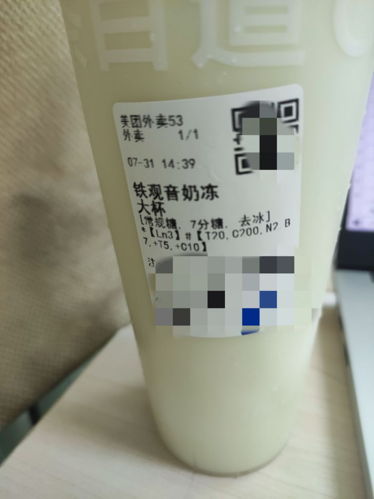

### [热点事件]铁观音奶冻repo

Made by ngapost2md (c) ludoux [GitHub Repo](https://github.com/ludoux/ngapost2md)

----

##### 0.[0] \<pid:0\> 2023-07-31 15:40:13 by 树叶叶

----

##### 1.[0] \<pid:706048359\> 2023-07-31 15:41:03 by 涨幅为困难
解释下，我看不懂

----

##### 2.[3] \<pid:706048542\> 2023-07-31 15:41:59 by 树叶叶
先放屁股
豆乳玉麒麟喝过，觉得腻
喜欢奶冻
喜欢果茶
杨枝甘露和青提葡萄(是叫这个吧)都挺喜欢的

----

##### 3.[1] \<pid:706048658\> 2023-07-31 15:42:29 by meg1412
我跟不上时代了，之前不是还是豆乳玉麒麟的时代吗

----

##### 4.[0] \<pid:706048763\> 2023-07-31 15:43:00 by 今天休息一会嘛
它家茉香奶绿也很不错，加奶冻

----

##### 5.[0] \<pid:706048791\> 2023-07-31 15:43:07 by 树叶叶
茶味挺重的，喜欢奶味重的不建议买，感觉喝奶冻都不太喝得到奶味

----

##### 6.[0] \<pid:706048874\> 2023-07-31 15:43:31 by 银霭鸢尾花
之前被坛友安利过乌漆嘛黑，
~~现在我是乌漆嘛黑一生黑~~

----

##### 7.[0] \<pid:706048899\> 2023-07-31 15:43:38 by 青春派洛迪
我家这边的茶百道都没有铁观音奶冻

----

##### 8.[0] \<pid:706048984\> 2023-07-31 15:44:02 by 树叶叶
>[jump](#pid706048359) 涨幅为困难(2023-07-31 15:41) 说: 
>
>解释下，我看不懂

就是评价一下铁观音奶冻的味道啊(

----

##### 9.[0] \<pid:706049038\> 2023-07-31 15:44:16 by 碾墨成莲
七分还是太甜了我个人推荐三分糖

----

##### 10.[0] \<pid:706049039\> 2023-07-31 15:44:16 by Kadoc_
>[jump](#pid706048658) meg1412(2023-07-31 15:42) 说: 
>
>我跟不上时代了，之前不是还是豆乳玉麒麟的时代吗

豆乳玉麒麟是绫人时代啊这也过去太久了

----

##### 11.[0] \<pid:706049071\> 2023-07-31 15:44:26 by 兰兰顶真
铁观音奶冻和黄金椰椰乌龙  三分糖，强无敌

----

##### 12.[0] \<pid:706049111\> 2023-07-31 15:44:36 by 淮水东边旧时月
之前都喝三分糖，糖少的话奶味会比较突出，另外可以换牛乳底更好喝(x)

----

##### 13.[0] \<pid:706049600\> 2023-07-31 15:47:01 by 树叶叶
三分糖收到了！！下次点三分糖

----

##### 14.[0] \<pid:706051064\> 2023-07-31 15:53:49 by 七月七寄
我是来歪楼的
给各位推荐瑞幸的西瓜拿铁(无糖或微糖)和兰韵铁观音拿铁(不建议无糖，会有铁观音的涩口感，微糖ok)
橙c美式和柚c美式都不错，个人更推荐柚c美式
还有幸运咖的鸳鸯拿铁也不错，其他品类先不谈

----

##### 15.[0] \<pid:706051983\> 2023-07-31 15:58:11 by 扶光む
前两天看潭友推荐点了铁观音奶冻，没有预想中好喝，我还是喜欢豆乳米麻薯那种料很多的

