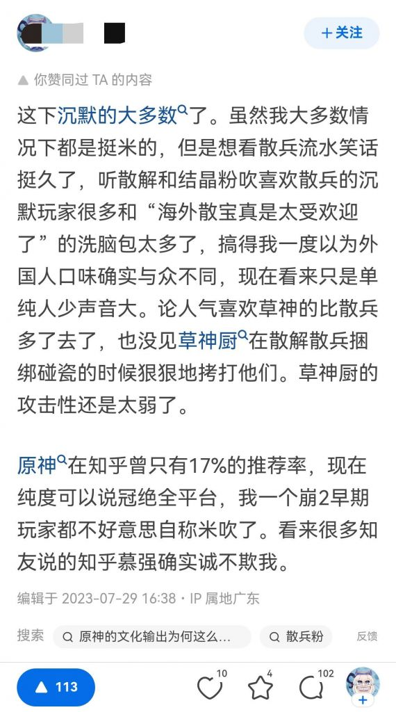
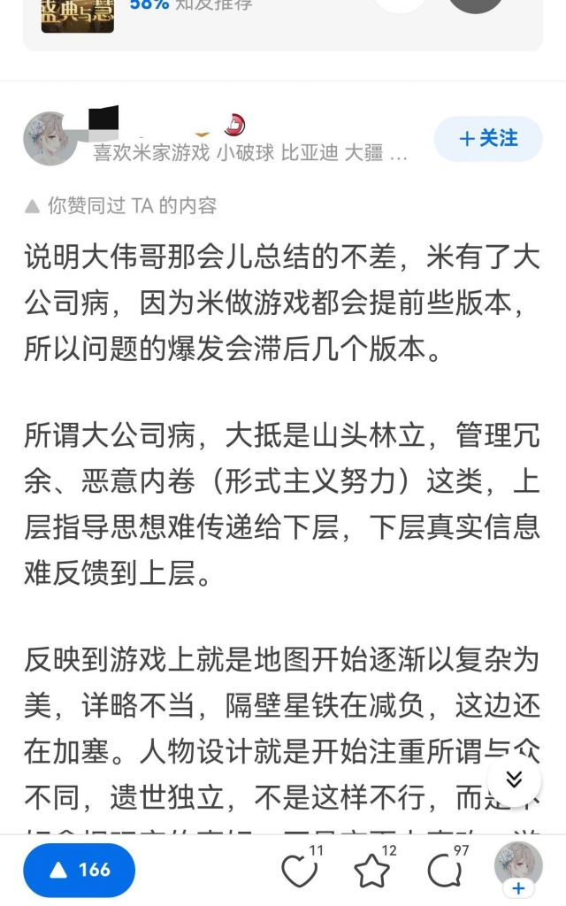
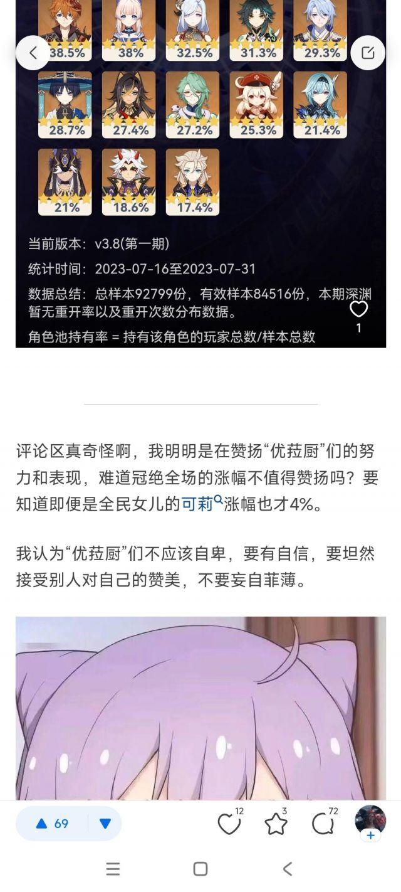
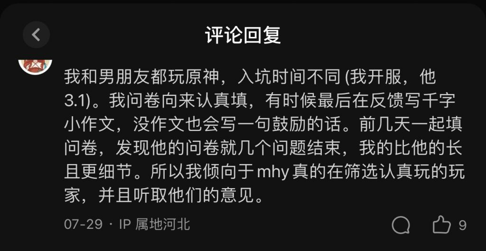

### [不吐不快] 报！！！ 知乎也失守了

Made by ngapost2md (c) ludoux [GitHub Repo](https://github.com/ludoux/ngapost2md)

----

##### 0.[1] \<pid:0\> 2023-07-31 16:39:48 by 经常看书看得开
结晶浓度最高的知乎也反水了，一部分网友表示这是散的塑造问题，另外一部分网友开始直球辱骂散兵。

六百多个评论，大伙还是挺关心散兵流水的，第一个回答算是一针见血  。

点进去回答的小评论，这里受点赞机制影响非常小，基本可以看到网友第一时间的真实表达

然后是按推送算法影响的默认排序

“我挺米，但是也爱看散兵笑话”

“大公司病”

“大洋彼岸网友的锐评”

----

##### 1.[0] \<pid:706061987\> 2023-07-31 16:42:45 by 天堂地狱破
其实我一直不理解某些结晶精股什么现在还那么挺散解这不已经算影响他米叠赚钱了吗？

----

##### 2.[1] \<pid:706062315\> 2023-07-31 16:44:18 by 经常看书看得开
>[jump](#pid706061987) 天堂地狱破(2023-07-31 16:42) 说: 
>
>其实我一直不理解某些结晶精股什么现在还那么挺散解这不已经算影响他米叠赚钱了吗？

别的结晶粉我是不太清楚  知乎我是看明白了，谁赢帮谁说话，取消匿名功能后，散兵0h的成绩洗也洗不动了，直接开骂

----

##### 3.[5] \<pid:706062351\> 2023-07-31 16:44:26 by adsere
借用一句话。现在玩家对散兵的评价分为两派，一派批评派一派赞扬派。批评派认为散兵塑造就是个傻逼，赞扬派赞扬批评派批评的十分中肯。

----

##### 5.[0] \<pid:706062461\> 2023-07-31 16:44:55 by 剑筑师と書記官
都别急。我先笑

----

##### 6.[3] \<pid:706062475\> 2023-07-31 16:44:59 by 嘀嘟滴嘟嘀
切割掉散兵才是mwb应该做的，最大赔钱货。
别的不说，就说里版有多少是原手综人？
不切割散兵的mwb就是nt，恕我说话直。

----

##### 7.[0] \<pid:706062612\> 2023-07-31 16:45:34 by Zzyugg
知乎只打顺风团，看来这次其他属实是大逆风了

----

##### 8.[0] \<pid:706062640\> 2023-07-31 16:45:41 by 哒哒块
知乎可是冠军粉浓度最高的地方

----

##### 9.[2] \<pid:706062739\> 2023-07-31 16:46:10 by xmkz798
>[jump](#pid706061987) 天堂地狱破(2023-07-31 16:42) 说: 
>
>其实我一直不理解某些结晶精股什么现在还那么挺散解这不已经算影响他米叠赚钱了吗？

对仙蛆来说
米是爹，解是妈
父母难两全啊

----

##### 10.[0] \<pid:706062769\> 2023-07-31 16:46:20 by 今锁朱楼
最后一张的关联词

----

##### 11.[1] \<pid:706063062\> 2023-07-31 16:47:42 by 大牧羊犬
我下午刚去搜了下这个问题，震惊了六百多回答，还有不少是喷散兵的

放在以往不都是没事的、文化输出、打破刻板印象……之类的夸夸人吗

----

##### 12.[1] \<pid:706063068\> 2023-07-31 16:47:44 by 罗一川
知乎真是纯冠军粉，原神要是后面还起不了你马上就能看到大量反噬了

----

##### 13.[0] \<pid:706063115\> 2023-07-31 16:47:55 by 已经成为了一种笑话
>[jump](#pid706061987) 天堂地狱破(2023-07-31 16:42) 说: 
>
>其实我一直不理解某些结晶精股什么现在还那么挺散解这不已经算影响他米叠赚钱了吗？

因为承认散兵失败，就是承认他米叠失败了啊

原神这几个月的大部分节奏，都是从散兵开始的，结晶为了维护他叠，已经战斗了快半年了，他们能承认散兵失败吗？

现在我看到结晶只会呵哈哈哈哈哈~“剧情不重要”“沉默的大多数”

----

##### 14.[0] \<pid:706063199\> 2023-07-31 16:48:15 by mimengan
没事的阿米，他们只是一群文盲不懂得欣赏，要坚持做好自己，钱已经赚够了，做自己想做的就好了，看着他们为了自己手中的玩物抓耳挠腮死去活来的样子阿米是不是又收货了很多很多很多快乐？啊呀我擦怎么又有想伤害玩家/读者的谏山创/阿米了

----

##### 15.[0] \<pid:706063315\> 2023-07-31 16:48:49 by 呵呵不会取名
天呐，这也太不容易了，知乎这种原粉纯度高的跟反串黑一样的地都能这样，太乐了

----

##### 16.[2] \<pid:706063468\> 2023-07-31 16:49:30 by snwx62
>[jump](#pid706062769) 今锁朱楼(2023-07-31 16:46) 说: 
>
>最后一张的关联词

怎么回事 散解里的top癌还没回踩你们知乎的慕强人怎么回踩了

----

##### 17.[0] \<pid:706063699\> 2023-07-31 16:50:28 by 今锁朱楼
知乎慕强的是真不少，你游大多数的top癌除了一些散解基本全集中在知乎了。

----

##### 18.[0] \<pid:706063745\> 2023-07-31 16:50:36 by mihomopromax
毕竟知乎冠军粉社区，看到赔钱货还不赶紧切割啊

----

##### 19.[0] \<pid:706063783\> 2023-07-31 16:50:48 by 子夜歌QAQ
广告投放的回报率微博和小红书比b站高多了，这两个平台很好接广告很好带货的，博主过的也比up主好，单纯一棒子打死说是以微博豆瓣小红书为根据地的人钱少事多可没道理，只能说散解在女玩家里面也是最不爆米的一群人

----

##### 20.[0] \<pid:706063865\> 2023-07-31 16:51:11 by Aritaaa
我开始有点担心了兄弟们，亲爱的米哈游你们一直以来都做的很对，请你们一定要把这些都当成噪音，再多买点宣发挺过困难时期
毕竟我是真的想看米死，而不是想看米改啊

----

##### 21.[0] \<pid:706064199\> 2023-07-31 16:52:43 by 魑魅魍魉魖魌
我建议雪藏其他五百天，谁赞成谁反对？

----

##### 22.[1] \<pid:706064382\> 2023-07-31 16:53:24 by TheLegislator
知乎只信市场经济，卖不动拖累它米die立刻开骂

----

##### 23.[0] \<pid:706064459\> 2023-07-31 16:53:46 by 海与风的礼物w
我之前就觉得，()都让mhy这么赔钱了，结晶还护着他，鉴定为他们对mhy不够忠诚

----

##### 24.[0] \<pid:706064543\> 2023-07-31 16:54:12 by 嘀嘟滴嘟嘀
>[jump](#pid706063115) 已经成为了一种笑话(2023-07-31 16:47):

剧情不重要。
沉默的大多数。
现在结晶已经不敢提了，因为0h+抽取比例接近1：1已经狠狠的打脸了，现在结晶已经又跑回去嗦那几个老奶嘴了，比如利刃。

----

##### 25.[0] \<pid:706064564\> 2023-07-31 16:54:17 by 雨源rainsource
慕强被动触发，该落井下石了

----

##### 26.[0] \<pid:706064702\> 2023-07-31 16:54:52 by 吞花嚼茶
>[jump](#pid706064199) 魑魅魍魉魖魌(2023-07-31 16:52)说:
>我建议雪藏其他五百天，谁赞成谁反对？[s:a2:鬼脸]

我反对，我认为应该连续复刻500天

----

##### 27.[0] \<pid:706064704\> 2023-07-31 16:54:52 by mimengan
>[jump](#pid706064199) 魑魅魍魉魖魌(2023-07-31 16:52) 说: 
>
>我建议雪藏其他五百天，谁赞成谁反对？

我反对，举双手反对，没了须弥大太子，阿米太上皇，米怎么整活？也就你这种还想让原好起来的才会这么想雪藏太子吧？

----

##### 28.[1] \<pid:706065317\> 2023-07-31 16:57:39 by Fablet
哇，真的吗，知乎真的失守了？
好！狠狠地开香槟！
这鬼地方结晶纯度150%，这都放弃维护了，我能说什么呢！

----

##### 29.[0] \<pid:706066375\> 2023-07-31 17:02:18 by 魑魅魍魉魖魌
>[jump](#pid706064704) mimengan(2023-07-31 16:54) 说: 
>
>我反对，举双手反对，没了须弥大太子，阿米太上皇，米怎么整活？也就你这种还想让原好起来的才会这么想雪藏太子吧？

没有其他卡池，米有的是方法推太子。比如把所有活动强制使用其它

----

##### 30.[0] \<pid:706066596\> 2023-07-31 17:03:23 by 剑筑师と書記官
>[jump](#pid706064459) 海与风的礼物w(2023-07-31 16:53) 说: 
>
>我之前就觉得，()都让mhy这么赔钱了，结晶还护着他，鉴定为他们对mhy不够忠诚

结晶很明显不完全等价于精神股东，从终焉节奏应该可见一斑了

他们就是打心底里认为mhy是对的，是至高无上的，是全世界最厉害的，是能改变他们的xp甚至三观的

----

##### 31.[1] \<pid:706066692\> 2023-07-31 17:03:51 by 四十度大陆
米站有没有机会反攻啊
那边都已经正常交流不了了
一句话十个人围攻

----

##### 32.[1] \<pid:706067380\> 2023-07-31 17:06:52 by 十夜铃沄花
毕竟知乎只是米的天狗，不是散的

----

##### 34.[0] \<pid:706067558\> 2023-07-31 17:07:40 by 野猫布鲁斯
完了，不会要回旋了吧

----

##### 35.[1] \<pid:706067788\> 2023-07-31 17:08:45 by 洪炉一点雪
mhy流水崩了，没钱养sb了？

----

##### 36.[0] \<pid:706067961\> 2023-07-31 17:09:28 by 己冉倪卯涂杜
其实只是抱怨散没给米爆金币，不是我想看的失守。
我想看高赞说好似喵。

----

##### 37.[5] \<pid:706068114\> 2023-07-31 17:10:11 by GrossGrass
如果4.0和4.1流水继续暴死，知乎会冒出你想都想不到数量的米黑。

----

##### 38.[1] \<pid:706068471\> 2023-07-31 17:11:38 by 狐狸吃团子
很简单，就是靠实力说话啊，你散兵手握什么资源大伙又不是不知道，平时散厨多膈应人大伙也是隐忍克制，这一切都是建立在老米背后买各种商单，散厨营造各种虚假繁荣上，好像散厨真的很多散兵真的超受欢迎一样，其实跟正机之神如出一辙，看着唬人结果拿走雷神之心拆了须弥机甲没了博士技术，内里就是个大头朝下的小丑

----

##### 39.[0] \<pid:706068541\> 2023-07-31 17:11:57 by 云天间
无所谓 结晶有结晶的说法，我又见到好几个话术 比如说超抖音时间完全不可信，我们就应该信七麦和蝉大师的数据，因为这都是专业的数据分析师做出来的 人家是有工资的，不比你吧友专业？以及全肯定民和米哈游下大棋派，我们不应该教游戏公司怎么赚钱，mhy里面的人一定比我们懂，我们只需要相信米哈游就行了，米哈游这么做一定有他的深意 我们可能看不懂但只需要支持就够了

----

##### 40.[0] \<pid:706068556\> 2023-07-31 17:12:00 by LU&#39;&#39;
>[jump](#pid706061987) 天堂地狱破(2023-07-31 16:42) 说: 
>
>其实我一直不理解某些结晶精股什么现在还那么挺散解这不已经算影响他米叠赚钱了吗？

伞好歹是他米叠的产品怎么肯骂啊，第一步先是完全否认有问题，现在流水打脸了就“上面是好的，下面执行出了问题”

----

##### 41.[2] \<pid:706068981\> 2023-07-31 17:13:48 by 魑魅魍魉魖魌
>[jump](#pid706068114) GrossGrass(2023-07-31 17:10) 说: 
>
>如果4.0和4.1流水继续暴死，知乎会冒出你想都想不到数量的米黑。

到那时候我一定要下回知乎狠狠踩上一脚

----

##### 42.[1] \<pid:706069031\> 2023-07-31 17:14:01 by mimengan
>[jump](#pid706066375) 魑魅魍魉魖魌(2023-07-31 17:02) 说: 
>
>没有其他卡池，米有的是方法推太子。比如把所有活动强制使用其它

拉倒吧，看看优拉，雪藏那么多天有多久查无此人的？到时候还真有可能被米()混过去了，现在要做的就是要让流浪者代替旅行者的位置，最好半分钟一小骂，两分钟一大骂，就逮着黄毛摄像头，蒙德璃月稻妻自机骂，骂的越狠，越多人破防才好，为什么要雪藏？你不会真以为米()能好起来吧？不会吧不会吧？

----

##### 43.[2] \<pid:706069067\> 2023-07-31 17:14:10 by q794623
>[jump](#pid706064543) 嘀嘟滴嘟嘀(2023-07-31 16:54) 说: 
>
>剧情不重要。
>沉默的大多数。
>现在结晶已经不敢提了，因为0h+抽取比例接近1：1已经狠狠的打脸了，现在结晶已经又跑回去嗦那几个老奶嘴了，比如利刃。

别把，舟游玩家这两年好不容易内部讨论环境正常点。。又来？

----

##### 44.[5] \<pid:706069402\> 2023-07-31 17:15:31 by 小kotomi
>[jump](#pid706067380) 十夜铃沄花(2023-07-31 17:06) 说: 
>
>毕竟知乎只是米的天狗，不是散的

错的，他只是谁赢了舔谁

----

##### 45.[0] \<pid:706069675\> 2023-07-31 17:16:47 by 好好好好111
知乎都能失守啊

----

##### 46.[0] \<pid:706070163\> 2023-07-31 17:18:55 by 狐狸吃团子
>[jump](#pid706064199) 魑魅魍魉魖魌(2023-07-31 16:52) 说: 
>
>我建议雪藏其他五百天，谁赞成谁反对？

反对！散散真爱粉看不到他的乐子会浑身难受，寝食难安
~~想看老米努力捧散散，多买商单多出剧情，一路加速~~

----

##### 47.[1] \<pid:706070391\> 2023-07-31 17:19:58 by 重庆堇业先锋
知乎好纯的冠军粉比散大妈纯多了，拿不到top就开踩

----

##### 48.[0] \<pid:706070578\> 2023-07-31 17:20:52 by 泥头熊
一定是心海和月华的问题(确信)，建议每个版本复刻一次你散宝，所有角色都陪跑一遍

----

##### 49.[0] \<pid:706070589\> 2023-07-31 17:20:55 by 残-决
我在NGA认识的很多结晶，除开某一些全肯定型结晶外，孝一点的便选择避而不谈散兵，但凡稍微正常点的都多多少少会骂散兵几句，或者作为mmr希望剧情绝不要沾上他，连肯定米哈游的人都尚且如此，对他建立起独特的赛博洁癖，更别说一般的路人的态度了

----

##### 50.[1] \<pid:706071466\> 2023-07-31 17:24:32 by 李猛赣
知乎和米站、手综boy不一样，并不是结晶浓度高，而是社达和慕强，米丧在二游的迫真垄断给了他们冠军粉的爽感。
如果流水继续暴毙，知乎人踩的会更狠

----

##### 51.[0] \<pid:706072244\> 2023-07-31 17:28:04 by 如意云游
支持4.0和4.1全部散兵单up

----

##### 52.[2] \<pid:706072359\> 2023-07-31 17:28:37 by 诗音小跟班
知乎的社区属性罢了，就像大时代的输赢二象性，等米真落魄了，知乎会马上变成米黑急先锋的

----

##### 53.[0] \<pid:706072766\> 2023-07-31 17:30:25 by 经常看书看得开
补一条经典的米氏回旋镖

----

##### 54.[0] \<pid:706073244\> 2023-07-31 17:32:21 by D_终于考好了
>[jump](#pid706069067) q794623(2023-07-31 17:14)说:
>[quote][pid=706064543,37207278,2]Reply[/pid] <b>Post by [uid=65160141]嘀嘟滴嘟嘀[/uid] (2023-07-31 16:54):</b>  剧情不重要。 沉默的大多数。 现在结晶已经不敢提了，因为0h+抽取比例接近1：1已经狠狠的打脸了，现在结晶已经又跑回去嗦那几个老奶嘴了，比如利刃。[/quote]别把，舟游玩家这两年好不容易内部讨论环境正常点。。又来？[s:ac:喷][s:ac:喷]

毕竟你家刚刚日服第一，知乎对能赚外汇的游戏特别吹捧，如果不是王者只是国内强者，他肯定被吹的最狠的一个

----

##### 56.[0] \<pid:706076678\> 2023-07-31 17:48:21 by 冷光小调
真正的纯胫骨公司厨估计都恨不得散兵不存在吧，拿了这么大量的资源强推他这一个角色，甚至草神都为他垫了，惹来这么多节奏争议也就算了，结果流水就这表现……结晶学长想护都护得心累

----

##### 57.[0] \<pid:706077288\> 2023-07-31 17:51:01 by 扶光む
>[jump](#pid706072766) 经常看书看得开(2023-07-31 17:30) 说: 
>
>补一条经典的米氏回旋镖
>

看肖战知成分，也难怪

----

##### 58.[0] \<pid:706077644\> 2023-07-31 17:52:38 by Météore
去知乎看了一眼给我恶心到了
遍地的我男我也就不说了
什么“含蓄美”，“高级审美”，“4星不算人是吧”

----

##### 59.[1] \<pid:706077691\> 2023-07-31 17:52:53 by 就随便起了个名字
米哈游快多来点其他剧情，我已经迫不及待想看b站逐渐变化的样子了

----

##### 60.[0] \<pid:706077828\> 2023-07-31 17:53:32 by Macline330206
有一说一某乎在3.3和3.6对其他的黑泥也不少，别觉得他们改性了人家指不定认为这只是散的问题不是米的问题呢

----

##### 61.[0] \<pid:706078059\> 2023-07-31 17:54:34 by 经常看书看得开
>[jump](#pid706077644) Météore(2023-07-31 17:52) 说: 
>
>去知乎看了一眼给我恶心到了
>遍地的我男我也就不说了
>什么“含蓄美”，“高级审美”，“4星不算人是吧”

别急，等林尼兄弟俩流水炸了，别的知友会过去青蒜她们

----

##### 62.[0] \<pid:706079564\> 2023-07-31 18:01:20 by shi态
拉数据算了算这亏钱玩意亏了多少，700+赞，算是相当讨人厌的角色了

----

##### 63.[0] \<pid:706079789\> 2023-07-31 18:02:25 by 经常看书看得开
>[jump](#pid706079564) shi态(2023-07-31 18:01) 说: 
>
>拉数据算了算这亏钱玩意亏了多少，700+赞，算是相当讨人厌的角色了
>

散解应该把这个回答踩冒烟了 前排都没看见

----

##### 64.[3] \<pid:706080382\> 2023-07-31 18:05:30 by 龙澂
知乎er是这样的，谁赢他们帮谁，突出一个从不打逆风局
不过即便这样也比b站强了，b站那就是一群鸵鸟，宁愿找一堆理由，也不愿意承认就是散兵塑造不行是个赔钱货

----

##### 65.[2] \<pid:706082821\> 2023-07-31 18:19:10 by q794623
>[jump](#pid706079564) shi态(2023-07-31 18:01) 说: 
>
>拉数据算了算这亏钱玩意亏了多少，700+赞，算是相当讨人厌的角色了
>

乐，，，3.6的时候我写了个散兵的历史作业笑话回答到今天也才700多赞吧，那个时候回答下还是一堆搁那吹冲击波的孝子贤孙。。

现在好了，逆风时候人手一棍子是吧

----

##### 66.[0] \<pid:706083794\> 2023-07-31 18:24:16 by 子守歌
>[jump](#pid706066596) 剑筑师と書記官(2023-07-31 17:03) 说: 
>
>结晶很明显不完全等价于精神股东，从终焉节奏应该可见一斑了
>
>我反正觉得终焉绝对是纯纯的赔钱货，
>~~岁律应该也算，但是没那么赔~~
>拉了一帮垫子，撕了一堆设定，但是却依旧被老角色狠狠的爆杀。
>
>股东，哪怕精神股东看到这种情况
>怕不是一样马上就切割了。
>
>但是结晶不一样，他们打心底里认为：
>mhy是对的，
>是至高无上的，
>是值得为其出征的，
>是能改变他们的xp的
>甚至足以重塑他们的三观的 
>是全世界最能贴合这些人的精神需要的。
>
>所以这大概就是我觉得精神股东变少了的原因吧，因为早就是

岁律是什么意思啊

----

##### 67.[0] \<pid:706083862\> 2023-07-31 18:24:37 by 須賀悠衣
>[jump](#pid706062351) adsere(2023-07-31 16:44):

不是激进派和保守派？
激进派激进的攻击mhy和散兵，保守派认为激进派的攻击过于保守

----

##### 68.[1] \<pid:706084079\> 2023-07-31 18:25:51 by CHiuPiung
大家千万记住一点，知乎是由“不玩游戏的游戏迷”掌控舆论的，他们只看数字和“逼格”，只会跟风，游戏那自然是啥都不懂的。他们现在纯度高，那是因为米哈游还没栽彻底，如果米哈游后面继续栽跟头，他们只会变本加厉地清算米哈游，以前纯度有多高，以后清算就有多狠，今天王国之泪在知乎是什么遭遇，也许明天米哈游在知乎就是什么遭遇，拭目以待吧

----

##### 69.[0] \<pid:706084338\> 2023-07-31 18:27:14 by 剑筑师と書記官
>[jump](#pid706083794) 子守歌(2023-07-31 18:24) 说: 
>
>岁律是什么意思啊

我给起的，真我人之律者的“爱称”
文案为了给爱莉抬咖造神，把崩坏岁成了外星文明的拥抱这一拥抱直接让所有对抗这项“痛苦的拥抱”而死去的角色成了丑中丑

----

##### 71.[0] \<pid:706084982\> 2023-07-31 18:31:02 by 老君喵被口球了
坏了散宝又被背叛了，第10086次背叛

----

##### 72.[0] \<pid:706085100\> 2023-07-31 18:31:41 by iwhcd
>[jump](#pid706062640) 哒哒块(2023-07-31 16:45):

连知乎也沦陷了吗？

----

##### 73.[0] \<pid:706085492\> 2023-07-31 18:34:03 by grp767
>[jump](#pid706085100) iwhcd(2023-07-31 18:31)说:
><b>Reply to [pid=706062640,37207278,1]Reply[/pid] Post by [uid=16199709]哒哒块[/uid] (2023-07-31 16:45)</b>  连知乎也沦陷了吗？[s:ac:哭笑]

短期沦陷而已
知乎是收钱大v和水军横行的地方，辅以冠军粉和结晶，真想沦陷得原4.0也褒姒一蹶不振，不然冠军粉直接给你整“起死回生，再现神奇”的通稿嘞

----

##### 74.[0] \<pid:706086190\> 2023-07-31 18:37:56 by NATFproposal

看了下维护散的还是占多数，知乎结晶在上半狂欢嘲讽优菈的时候，可没有那么宽容

----

##### 75.[1] \<pid:706086586\> 2023-07-31 18:40:13 by 云后的彩虹糖
米哈游文案，要自信！不要因为杂音动摇对散兵宝的爱，如果你退缩了，我便化身巡猎，不除汝势不罢休

----

##### 76.[0] \<pid:706086652\> 2023-07-31 18:40:32 by 大牧羊犬
>[jump](#pid706082821) q794623(2023-07-31 18:19) 说: 
>
>乐，，，3.6的时候我写了个散兵的历史作业笑话回答到今天也才700多赞吧，那个时候回答下还是一堆搁那吹冲击波的孝子贤孙。。
>
>现在好了，逆风时候人手一棍子是吧

你肯定是被踩下去了，我看不着
自从我知道知乎原神厨浓度这么高，我后来都没逛过，每次在热榜上看到都无视过去

----

##### 77.[0] \<pid:706087194\> 2023-07-31 18:43:33 by FAAET
看得出来知乎确实是慕强批，流水跌了立马反攻倒算，墙头草中草

----

##### 78.[0] \<pid:706087754\> 2023-07-31 18:46:44 by 加贺烧
>[jump](#pid706084338) 剑筑师と書記官(2023-07-31 18:27)说:
>[quote][pid=706083794,37207278,4]Reply[/pid] <b>Post by [uid=43065941]子守歌[/uid] (2023-07-31 18:24):</b>  岁律是什么意思啊[s:ac:晕][/quote]我给起的，真我人之律者的“爱称”[s:ac:哭笑] 文案为了给爱莉抬咖造神，把崩坏岁成了外星文明的拥抱[s:ac:反对]这一拥抱直接让所有对抗这项“痛苦的拥抱”而死去的角色成了丑中丑

那按你的逻辑终焉才是岁律

----

##### 79.[0] \<pid:706088157\> 2023-07-31 18:49:12 by 经常看书看得开
>[jump](#pid706086190) NATFproposal(2023-07-31 18:37) 说: 
>
>[img]./mon_202307/31/l2Q2s-box2ZdT1kSh

上半卡池散解在狂踩。  不过下半风头已经变了，你可以看看这两个比较火的回答下面的风评。(贴链接会被夹)

为什么《原神》散兵复刻前的呼声很高，但实际抽卡的人却寥寥无几？

如何看待 《原神》 3.8版本的流浪者卡池流水表现？

----

##### 80.[0] \<pid:706089169\> 2023-07-31 18:54:47 by jinjin886
>[jump](#pid706084079) CHiuPiung(2023-07-31 18:25) 说: 
>
>大家千万记住一点，知乎是由“不玩游戏的游戏迷”掌控舆论的，他们只看数字和“逼格”，只会跟风，游戏那自然是啥都不懂的。他们现在纯度高，那是因为米哈游还没栽彻底，如果米哈游后面继续栽跟头，他们只会变本加厉地清算米哈游，以前纯度有多高，以后清算就有多狠，今天王国之泪在知乎是什么遭遇，也许明天米哈游在知乎就是什么遭遇，拭目以待吧

虽然我无比期待星空，但我真的想看王泪各类奖项拿到手软，知乎这帮“大神”会是什么反应

----

##### 81.[0] \<pid:706089593\> 2023-07-31 18:57:24 by 农企翻身了
>[jump](#pid706084338) 剑筑师と書記官(2023-07-31 18:27):

有没有可能
这个“拥抱”
已经抱死一个了
这个“拥抱”我个人的理解是小孩撒尿呲蚂蚁窝那种
他确实不打算让你死 他就是玩
至于爱莉 为人类牺牲自己的神明也算神话传说常见角色 mhy无非照着老剧本再来一遍而已
终焉这个角色最大的问题是开池子开太早了+只有一套模组打凯文的时候这套不合适
他要是打完才出这套就差不多合适了
崩坏解决了女朋友回来了老爹找到了为什么还要苦大仇深呢  
经历许多归来仍是少年的老戏码而已

----

##### 82.[0] \<pid:706090081\> 2023-07-31 19:00:02 by 本次我们想你啊
其实知乎一直都有这种回答

----

##### 83.[0] \<pid:706090515\> 2023-07-31 19:02:37 by 道仰
知乎的纯度我一直认为比瓜版还高，现在看来确实比瓜版高
因为到现在才敢说mhy坏话，瓜版那边结晶已经失守了

----

##### 84.[0] \<pid:706091086\> 2023-07-31 19:06:00 by 未薇HAO
对了，在某乎最近原神某些热点时间事件被仙空瓶了，6

我不知道为啥把帽子扣到米黑头上了

----

##### 85.[0] \<pid:706091141\> 2023-07-31 19:06:23 by 经常看书看得开
>[jump](#pid706090081) 本次我们想你啊(2023-07-31 19:00) 说: 
>
>其实知乎一直都有这种回答

五月份的时候我在知乎回答下聊散草的塑造问题 那个时候赞数寥寥无几，底下评论被人追着喷。  现在至少能看见大家都对散兵意见很大了，个人觉得至少算是很大的进步

----

##### 86.[1] \<pid:706092156\> 2023-07-31 19:12:10 by 星际兄贵
mhy驻扎在知乎的员工们呢？救一下啊

----

##### 87.[2] \<pid:706092265\> 2023-07-31 19:12:49 by 檬黄芥绿
>[jump](#pid706063062) 大牧羊犬(2023-07-31 16:47) 说: 
>
>我下午刚去搜了下这个问题，震惊了六百多回答，还有不少是喷散兵的
>
>放在以往不都是没事的、文化输出、打破刻板印象……之类的夸夸人吗

可不能这么说，当初万字讨散檄文作者就是首发在知乎的(因为他 nga 号 mute 了)，后来里版成立大伙就来这水了，知乎直接让引流引麻了

----

##### 88.[1] \<pid:706092668\> 2023-07-31 19:15:20 by 年下萝莉控
感觉原吹不少都是幕墙流水的半云玩家

----

##### 89.[2] \<pid:706093055\> 2023-07-31 19:17:51 by 年下萝莉控
看乐了，什么玩家才是米家的宝

----

##### 90.[1] \<pid:706093196\> 2023-07-31 19:18:39 by lcm68
米宝好可怜你们怎么就不懂他们制造出的“艺术”呢
米家员工你们在看吗 我支持多来瘤子剧情支持你们继续各种异常xp厨放流水算个屁，只有mwb会在乎吧，关不受制约的文案和xp放出的美工什么事一定要加速不能停下来，不能受mwb打压！都是噪音，支持贯穿自我，没有你们继续作妖我乐子都没了，这可不行

----

##### 91.[1] \<pid:706093734\> 2023-07-31 19:21:55 by 等把美又强的剑
这下全线崩盘了。。

----

##### 92.[0] \<pid:706093795\> 2023-07-31 19:22:17 by 经常看书看得开
>[jump](#pid706093055) 年下萝莉控(2023-07-31 19:17) 说: 
>
>看乐了，什么玩家才是米家的宝
>
>

尾田诚不欺我，不过米不在乎

 

----

##### 93.[0] \<pid:706094071\> 2023-07-31 19:23:54 by 今天休息一会嘛
图里有个评论正确的，对于李猛干还有神父这两种小仙男来说，原神可以删除，但是其他绝对不能删除

----

##### 94.[0] \<pid:706094248\> 2023-07-31 19:24:58 by 黑眼睛的银白色暴风雪
知乎还停留在“mihoyo是好的只是散兵拉了胯”的阶段，你看不是还有一堆贵物搁那吹崩轨呢

----

##### 95.[1] \<pid:706094479\> 2023-07-31 19:26:27 by 17岁的八云紫
“崩二早期玩家” “挺米”这是收了多少钱？

----

##### 96.[1] \<pid:706094572\> 2023-07-31 19:27:01 by 农企翻身了
>[jump](#pid706094248) 黑眼睛的银白色暴风雪(2023-07-31 19:24)说:
>知乎还停留在“mihoyo是好的只是散兵拉了胯”的阶段，你看不是还有一堆贵物搁那吹崩轨呢[s:ac:哭笑]

崩轨优化了一部分原神的缺点
然后把一部分崩三的优点故意砍废拉出来了
我的评价是不如崩三 崩三打乐土好歹给爽 模拟宇宙刚要爽起来直接结束 寸止是真恶心
小游戏就更难绷了 那个逼鸟手感差得要死

----

##### 97.[1] \<pid:706094622\> 2023-07-31 19:27:15 by 燕子安贝
是的 我在这个问题下吐槽了散兵 结果有十几赞同 而且没有一个散粉来喷
放以前不会这样的

----

##### 98.[0] \<pid:706094712\> 2023-07-31 19:27:46 by Bauhaus的大豪斯
B乎的慕强心理很严重的，而且相当一部分用户是不玩游戏或者轻度游戏的玩家。别忘了“人在美国，刚下飞机”是从B乎出来的。

----

##### 99.[0] \<pid:706096915\> 2023-07-31 19:41:20 by LEAVENED
这部分卫兵护着散兵的原因是因为散兵是这次风波的最直接导火索，这让站在风波对立面的卫兵天然和散厨站在同一战线
这也是为什么优菈流水低骂优菈厨，但散兵流水低却找其他原因推脱的原因，因为散厨是“自己人”

至于散兵阻碍流水这事，首先卫兵们就不承认散兵阻碍流水，甚至不承认热度流水下滑，认为是版本周期
其次，卫兵其实并不在乎游戏好不好，会不会影响到游戏。就像虎扑那张图那样，他们知道剧情不好，但是你们不能说不好。比起游戏怎么样，他们更在乎的是立场

----

##### 101.[1] \<pid:706099986\> 2023-07-31 20:01:22 by CHiuPiung
>[jump](#pid706089169) jinjin886(2023-07-31 18:54):

这个简单，可以直接说“不会有人认为美末2后游戏媒体和奖项还有任何客观性吧？”
知乎“不玩游戏的硬核玩家”虽然繁忙得没时间玩游戏，但是一天24小时网上冲浪学些烂大街的、不知道有多么陈腐的话术还是比较在行的。但是这些人不知道的是，起码早在fami通给忍龙z打了36分的时候，在真正的婆罗门主机游戏玩家眼中，游戏媒体就已经失去任何客观性了，哪里轮得到美末2。也就是说，知乎“不玩游戏的硬核玩家”连学到的话术都是十分低级，令人捧腹，而且一眼就能看出是纯粹的云玩家的

----

##### 102.[0] \<pid:706100339\> 2023-07-31 20:03:43 by 的呢抵抗
>[jump](#pid706061987) 天堂地狱破(2023-07-31 16:42):

因为散解是被骂的最狠的原神玩家啊，那结晶维护不是很正常吗？他们的逻辑就是只要喜欢mhy的角色，不管干出什么事都不能骂

----

##### 103.[0] \<pid:706108055\> 2023-07-31 20:53:55 by lizy_930804
>[jump](#pid706083794) 子守歌(2023-07-31 18:24) 说: 
>
>岁律是什么意思啊

三蹦子的

----

##### 104.[0] \<pid:706108325\> 2023-07-31 20:55:41 by 大牧羊犬
>[jump](#pid706093055) 年下萝莉控(2023-07-31 19:17):

填个问卷也要踩一脚自己男朋友？行吧……她男朋友生活懒散配不上她

----

##### 105.[0] \<pid:706108976\> 2023-07-31 21:00:16 by 年下萝莉控
>[jump](#pid706108325) 大牧羊犬(2023-07-31 20:55) 说: 
>
>填个问卷也要踩一脚自己男朋友？行吧……她男朋友生活懒散配不上她

首先是犯下傲慢之罪的男朋友，因问卷不写小作文而成被米家筛掉的玩家

----

##### 106.[0] \<pid:706112616\> 2023-07-31 21:25:04 by 李猛赣
>[jump](#pid706094248) 黑眼睛的银白色暴风雪(2023-07-31 19:24) 说: 
>
>知乎还停留在“mihoyo是好的只是散兵拉了胯”的阶段，你看不是还有一堆贵物搁那吹崩轨呢

所有mvb变成米黑，都是一步步来的，别急。

一阶段：唉，猪鹅。mhy盲目扩招导致二次元浓度不够了，本意是好的，都是被基层员工执行歪了

二阶段：唉，xxn。本意是好的，都是被xxn蒙蔽了。

三阶段：唉，猛干。本意是好的，都怪高层有个毒瘤把风气带歪了

四阶段：米丧就是个散兵公司，本意是好的？上行下效！

----

##### 107.[0] \<pid:706114068\> 2023-07-31 21:35:13 by 剑筑师と書記官
>[jump](#pid706093795) 经常看书看得开(2023-07-31 19:22) 说: 
>
>尾田诚不欺我，不过米不在乎
>
> 

其实尾田名言不能完全代入米哈游

批话最多的是爆不出米的厕妹，而氪金的女玩家很可能和男玩家一样可能不满意就跑路，未必像她们批话那么多，mhy真顺从那些意见，这公司就准备倒闭吧

----

##### 108.[0] \<pid:706114198\> 2023-07-31 21:36:24 by 废墟幻想
>[jump](#pid706084079) CHiuPiung(2023-07-31 18:25):

王国之泪怎么了？销量不是挺高吗？

----

##### 109.[0] \<pid:706114765\> 2023-07-31 21:40:33 by CHiuPiung
>[jump](#pid706114198) 废墟幻想(2023-07-31 21:36)说:
><b>Reply to [pid=706084079,37207278,4]Reply[/pid] Post by [uid=43171522]CHiuPiung[/uid] (2023-07-31 18:25)</b>王国之泪怎么了？销量不是挺高吗？

王泪在知乎相对而言不太受待见

----

##### 110.[0] \<pid:706115026\> 2023-07-31 21:42:34 by 湖心石
>[jump](#pid706114198) 废墟幻想(2023-07-31 21:36)说:
><b>Reply to [pid=706084079,37207278,4]Reply[/pid] Post by [uid=43171522]CHiuPiung[/uid] (2023-07-31 18:25)</b>王国之泪怎么了？销量不是挺高吗？

王泪发售时知乎mwb们的集体高潮团建直接让知乎游戏区成了所有游戏社区的笑话

----

##### 111.[0] \<pid:706119229\> 2023-07-31 22:13:25 by gtgce
原来知乎只是幕墙

----

##### 112.[0] \<pid:706121241\> 2023-07-31 22:26:47 by 柚子汤圆
在糟糕的流水面前，结晶们的辩驳是多么苍白

----

##### 113.[1] \<pid:706122385\> 2023-07-31 22:34:54 by 陌湮
>[jump](#pid706100339) 的呢抵抗(2023-07-31 20:03)说:
><b>Reply to [pid=706061987,37207278,1]Reply[/pid] Post by [uid=38533649]天堂地狱破[/uid] (2023-07-31 16:42)</b>因为散解是被骂的最狠的原神玩家啊，那结晶维护不是很正常吗？他们的逻辑就是只要喜欢mhy的角色，不管干出什么事都不能骂

呵，若不是见过藓在钟刻优的评论区里刷脏东西，我还真信你了

----

##### 114.[0] \<pid:706122784\> 2023-07-31 22:37:40 by ai助手
>[jump](#pid706115026) 湖心石(2023-07-31 21:42)说:
><b>Reply to [pid=706114198,37207278,6]Reply[/pid] Post by [uid=38714455]废墟幻想[/uid] (2023-07-31 21:36)</b>王泪发售时知乎mwb们的集体高潮团建直接让知乎游戏区成了所有游戏社区的笑话[s:ac:哭笑]

知乎游戏区一直是个笑话，不用等到王泪

----

##### 115.[0] \<pid:706123554\> 2023-07-31 22:43:16 by biubiu222
没事，我们还有b站(悲)

----

##### 116.[0] \<pid:706125158\> 2023-07-31 22:54:02 by 经常看书看得开
>[jump](#pid706123554) biubiu222(2023-07-31 22:43) 说: 
>
>没事，我们还有b站(悲)

希望B站年轻的朋友们能够提供足够的流水吧

----

##### 117.[0] \<pid:706139936\> 2023-08-01 00:48:44 by 老君喵被口球了
知乎失守才证明知乎是真米结晶，因为他们意识到他米爹是真的养了个赔钱货，让他米爹赔钱的东西肯定要抵制。

----

##### 118.[0] \<pid:706142231\> 2023-08-01 01:13:57 by 胖达达人
讲个无关的话题。
某华语乐坛 空格 歌手，当年他上歌手节目一路空降冠军的时候，我看乐评回答点反对点到触发throttling
过了几年爆出生孩子的消息的时候，一路赞点的我手麻。

这就是知乎

----

##### 119.[1] \<pid:706143427\> 2023-08-01 01:28:37 by ZX_hysh
srds，有几张截图不还是那种清君侧套路，什么大公司病意见传不到上面，合计着三巨头纯洁无暇全是下面的人乱搞。

----

##### 120.[0] \<pid:706143489\> 2023-08-01 01:29:30 by 09092虎
>[jump](#pid706142231) 胖达达人(2023-08-01 01:13) 说: 
>
>讲个无关的话题。
>某华语乐坛 空格 歌手，当年他上歌手节目一路空降冠军的时候，我看乐评回答点反对点到触发throttling
>过了几年爆出生孩子的消息的时候，一路赞点的我手麻。
>
>这就是知乎

一眼华晨宇当年他还是个大脸娃子

----

##### 121.[0] \<pid:706149173\> 2023-08-01 03:30:19 by ican110
我起猛了，这是知乎？

----

##### 122.[0] \<pid:706150684\> 2023-08-01 04:36:32 by bzbjzj
>[jump](#pid706092265) 檬黄芥绿(2023-07-31 19:12) 说: 
>
>可不能这么说，当初万字讨散檄文作者就是首发在知乎的(因为他 nga 号 mute 了)，后来里版成立大伙就来这水了，知乎直接让引流引麻了

笑死我就是大佬引来的，才发现有话题这么浓缩的社区，米游社那边氵爆了。

----

##### 123.[0] \<pid:706169569\> 2023-08-01 09:10:55 by Moe_Ota
皇上是好的，只是身边出了奸臣  知乎的大内总管们骂散的角度都这么让人落泪

----

##### 125.[0] \<pid:706180527\> 2023-08-01 10:01:14 by 月影晴岚
>[jump](#pid706062475) 嘀嘟滴嘟嘀(2023-07-31 16:44) 说: 
>
>切割掉散兵才是mwb应该做的，最大赔钱货。
>别的不说，就说里版有多少是原手综人？
>不切割散兵的mwb就是nt，恕我说话直。
>另外我希望mhy继续写散兵，我要看米站反攻倒算。希望mhy继续倔强，不能听玩家的屁话，不然我哪有烟花能看呢？sj里版的员工看到了吗，散兵多来点，谢谢。

谢谢你，我的互联网嘴替

两条路都指出来了，米会走哪条呢，吃瓜看戏啦

----

##### 126.[0] \<pid:706184738\> 2023-08-01 10:18:37 by 魑魅魍魉魖魌
>[jump](#pid706125158) 经常看书看得开(2023-07-31 22:54) 说: 
>
>希望B站年轻的朋友们能够提供足够的流水吧

年轻的朋友们×
年幼的朋友们√

----

##### 127.[0] \<pid:706209599\> 2023-08-01 11:50:37 by 导论都尼玛厚的一批
>[jump](#pid706062351) adsere(2023-07-31 16:44) 说: 
>
>借用一句话。现在玩家对散兵的评价分为两派，一派批评派一派赞扬派。批评派认为散兵塑造就是个傻逼，赞扬派赞扬批评派批评的十分中肯。

环对立两派好评

----

##### 128.[0] \<pid:706216624\> 2023-08-01 12:20:08 by EmmaDragon
当时叉子佬在知乎发那篇万字文还要在末尾加上“转去玩崩铁”可见那边的结晶浓度，讨论剧情也必须表示对mhy忠诚的态度，要不你的文就被踩到最底下看不见咯还要被围攻(我是见了好多次了)

