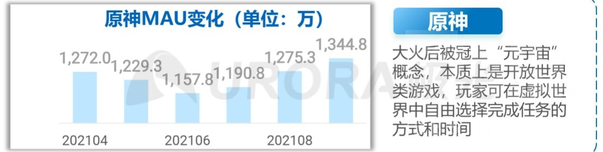

### [热点事件] 大概去看了一下最近米酱的活跃玩家数据，简单的文字描述一下吧。

Made by ngapost2md (c) ludoux [GitHub Repo](https://github.com/ludoux/ngapost2md)

----

##### 0.[0] \<pid:0\> 2023-07-31 18:51:07 by gayshitimpart
最近翻了一下米酱最近的游戏月活数据，说实话还真难找，一些数据网站的高级数据库不给看，只能看一些报告，因为图太多了发着太麻烦，这里我就先来简单的文字描述一下，在加上一些我个人的推测，后续再补上几张

数据大部分来自questmobile，一些来自极光月狐，都是直接搜的出来的，然后这两个软件重合的部分数据都是差不多的，所以我选的是这俩的数据来做参考。

首先是o这边，O开服的月活我没有找到数据，有一个预约人数1000w的数据，但是月活没有，我凭感觉估计应该是在2到3千万的级别。就开服的时候也是在爆炸狂出男角色，虽然没现在这么离谱，然后开服后热度就开始不断下滑，止不住的那种，一个月差不多掉100w，在2021年的6月份跌到了1100w级别，本来o这样多好的，这才是他应该的走势，结果稻妻开了救了一波，太可惜了，根据月狐数据，开稻妻之后月活又以100w每个月开始增长，而实际上O开始增长期也是从这个开始的，之后O就开始缓慢的成长期，我记得是有个questmobile的2022整年的月活估计表的，可惜我当时看到的时候没存，目前只有两个数据，一个是3月份的1790，第二个是12月份的2145万，可以说是比较稳定而缓慢的在增长，而非常可惜的是数据到这里就断掉了，正好在散宝的时间断掉了。

然后就是崩铁这边，目前能够知道的数据是崩铁在6月的日活是685w，月活并不清楚，但是说不定可以参考同样是二游的1999，1999的6月月活数据是300w，日活是180w，由此估算铁在6月的月活应该是1100w左右的级别，结合铁2300w的预约数据以及免费榜上的排位，铁目前应该是走的和O的1.0后期类似的走势，但是幅度会更大。

----

##### 1.[0] \<pid:706089851\> 2023-07-31 18:58:49 by gayshitimpart
补充一下具体数据来源的话，最后的日活数据来源是月狐，还有21年的5个月的月活也是，其他的大部分来自questmobile。月狐那边还有一个数据是O的在23年第一季度的日活是1000w，换算成月活应该是1700w上下。

根据这些数据，我来推算的话，现在O在7月的月活可能是1300w到1500w的级别，隔壁的月活应该在1000w上下，两边加起来去重后去对比O月活最高的时期，应该还是可以勉强做到1+1≈1的。

----

##### 3.[2] \<pid:706090326\> 2023-07-31 19:01:31 by 李猛赣
1+1&lt;1的好日子就要到了

----

##### 4.[1] \<pid:706090504\> 2023-07-31 19:02:35 by gayshitimpart
[url](https://www.bilibili.com/video/BV1dT411u7dm/?spm_id_from=333.337.search-card.all.click&amp;vd_source=37af54b7d9f3f8fcef513e6e3be3d960) 这个视频里面有qm 去年3月的月活

以下这两张是dau和21年5个月的数据

----

##### 5.[0] \<pid:706093892\> 2023-07-31 19:22:51 by gayshitimpart
>[jump](#pid706090139) xzhlm(2023-07-31 19:00)说:
>我还以为原现在月活有6000w左右[s:ac:哭笑]不知道哪个公众号看的了

那得把什么南美北美欧洲东南亚俄罗斯日韩全部加一块包括国服恐怕才有6000w

不过说实话现在包括日韩在内欧美那边就算某观圣已经努力把Pc系数调到1.5了，外服流水都没得国服的一半，如果再抛开日韩，欧美那边的流水可能大概占个10%的总流水不错了。

----

##### 6.[0] \<pid:706095697\> 2023-07-31 19:33:57 by xzhlm
>[jump](#pid706093892) gayshitimpart(2023-07-31 19:22) 说: 
>
>那得把什么南美北美欧洲东南亚俄罗斯日韩全部加一块包括国服恐怕才有6000w
>
>
>不过说实话现在包括日韩在内欧美那边就算某观圣已经努力把Pc系数调到1.5了，外服流水都没得国服的一半，如果再抛开日韩，欧美那边的流水可能大概占个10%的总流水不错了。

噢，原来是指国服的月活，懂了

