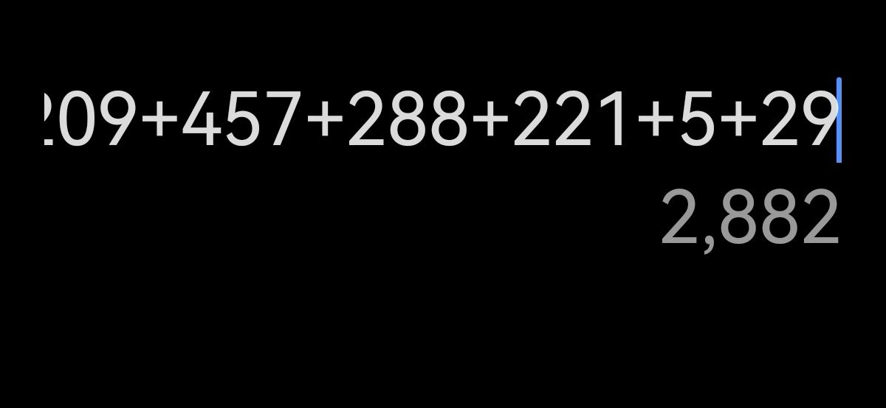
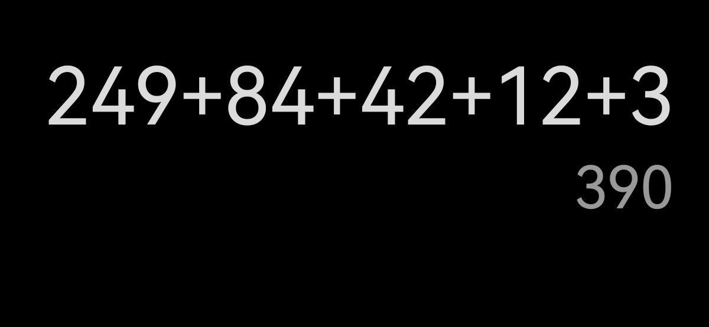

### [不吐不快]大致不严谨统计了知乎2.8和3.8的新地图活动相关回答数量

Made by ngapost2md (c) ludoux [GitHub Repo](https://github.com/ludoux/ngapost2md)

----

##### 0.[0] \<pid:0\> 2023-07-31 18:56:34 by 天堂地狱破
上次发过两次风来人活动的差距，那毕竟时间隔太久了

起因是看到这个问题(该问题为共有，不纳入统计)

突发奇想来看看两个版本新地图的话题差距

统计对象：如何评价活动，如何评价活动剧情，活动人物，活动地图等等(其他活动，卡池流水等节奏不计，很多几个回答的问题没有统计)

2.8

讨论非常激烈，从秘境到地图设计，人物剧情，喜欢的非常喜欢，讨厌的非常讨厌。但双方分析都很多。内容多的不像被天天车的知乎游戏区

3.8

我还以为我看错了，就这么点？我还专门找了标题类似的问题(因为2.8有两个标题类似的问题，每个都一堆回答)

想补点数据，结果找到了这个

……确实是活动讨论，但是因为真没什么营养价值，我就没算

好吧，3.8还没结束，就算各位的热情还能重新回到开开荒活动，把3.8数据乘个2，那还是被爆杀

如果从玩家反馈的角度来看，mhy的“减量”那确实挺成功的，不满的声音消失的巨多

反正“社区都是噪音罢了”，从数据上来看，米哈游确实实现了他们的目标和坚持，蒸蒸日上，赢

----

##### 1.[0] \<pid:706090174\> 2023-07-31 19:00:32 by IceDream-ere
很遗憾没玩到之前两张旧的地图

不知道以后能不能有机会了

----

##### 2.[0] \<pid:706090183\> 2023-07-31 19:00:35 by 花瓣飘零
知乎凉了跟我们ys有什么关系

----

##### 3.[0] \<pid:706090571\> 2023-07-31 19:02:55 by lleevvin
这很重要吗，也只有社区厨在乎吧

----

##### 4.[0] \<pid:706090795\> 2023-07-31 19:04:16 by 天堂地狱破
两次活动的相似问题

2

----

##### 5.[0] \<pid:706091714\> 2023-07-31 19:09:42 by RebbitX
楼主可以考虑一下全方位统计各大平台的数据，量化分析原神用户究竟流失了多少

----

##### 7.[0] \<pid:706092249\> 2023-07-31 19:12:43 by 天堂地狱破
>[jump](#pid706091714) RebbitX(2023-07-31 19:09) 说: 
>
>楼主可以考虑一下全方位统计各大平台的数据，量化分析原神用户究竟流失了多少

我个人认为这种数据不太能反应流失率

因为游戏内容的性质对类似的社区数据影响很大

假设2.8和3.8的人数完全一致，那地图设计不同也会导致类似b站视频播放量这种数据巨变，因为上次要看攻略的比这次多得多，有讨论意愿的也是这样

----

##### 8.[0] \<pid:706096344\> 2023-07-31 19:37:43 by WilliamsAuditore
戳啦，是3.8做的太好玩了，玩家都在游戏里，没时间看知乎

----

##### 9.[0] \<pid:706097781\> 2023-07-31 19:46:57 by ky446
各有各的好和坏

2.8：故事不错主要是几个自机角色的故事+地图设计得很有意思，能看的出来是花了很多心思去做的，但是奖励巨少无比，一个解密花了5分钟就给一个普通宝箱，奖励最多的居然是活动，而且角色的副本指引做得非常得差很多时候不看攻略根本不知道怎么解密

3.8：故事还是讲NPC的故事跟过来的那几个自机角色反而像个路人，地图很一般看着好玩实际上体验过几次就腻了，感觉还是须弥的感觉还有很大的进步空间，奖励比2.8要多，精致和华丽宝箱多了很多，比之前轻度化了很多不再出现解密5分钟还是原石X5了

