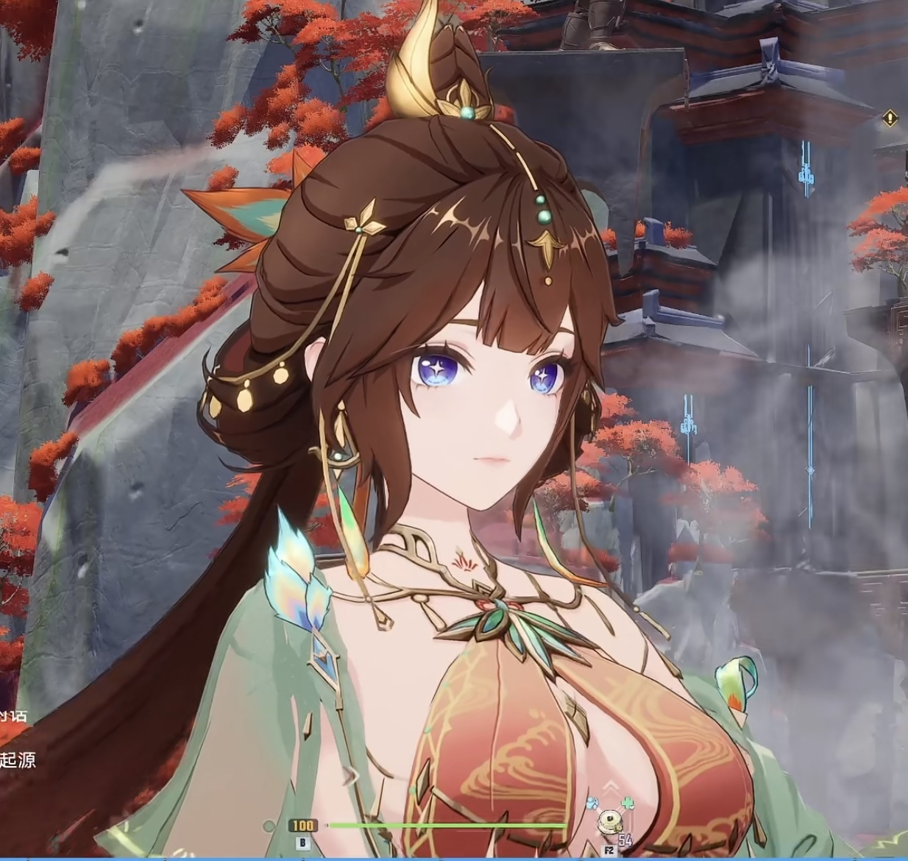
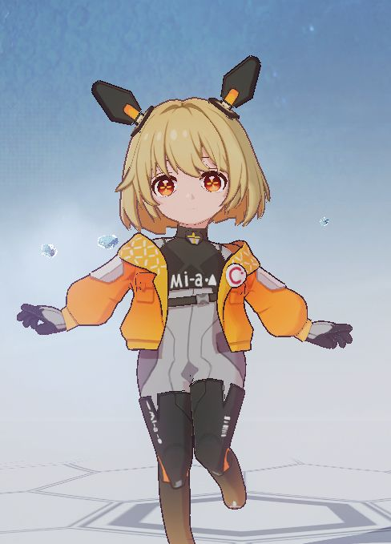
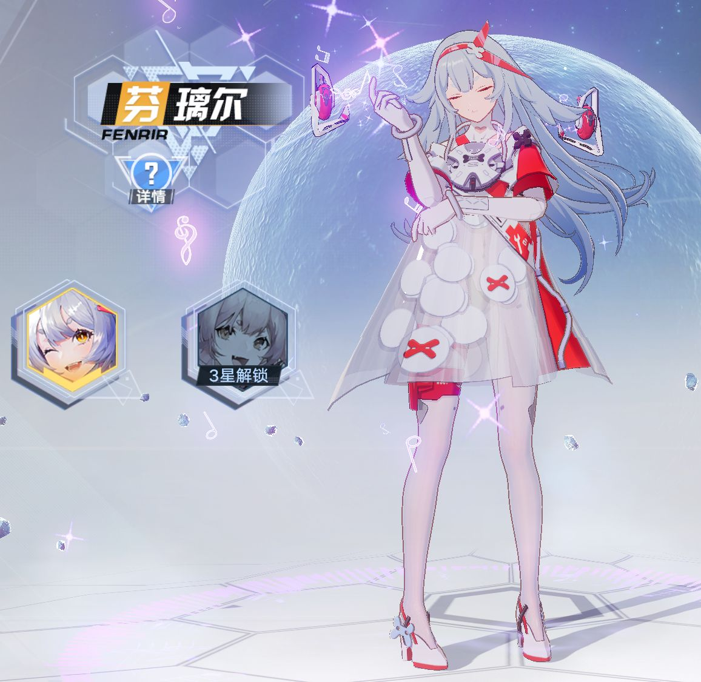
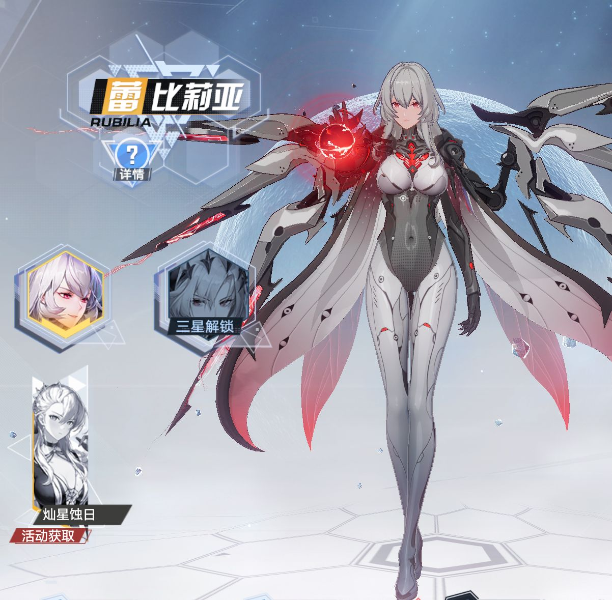
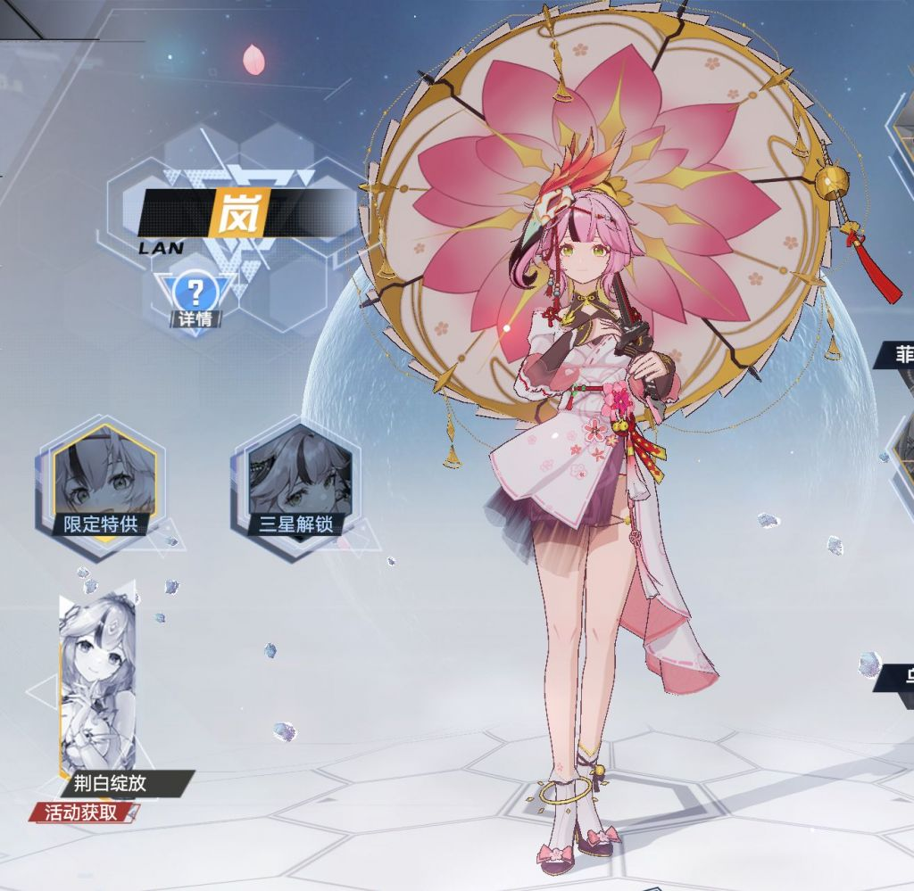
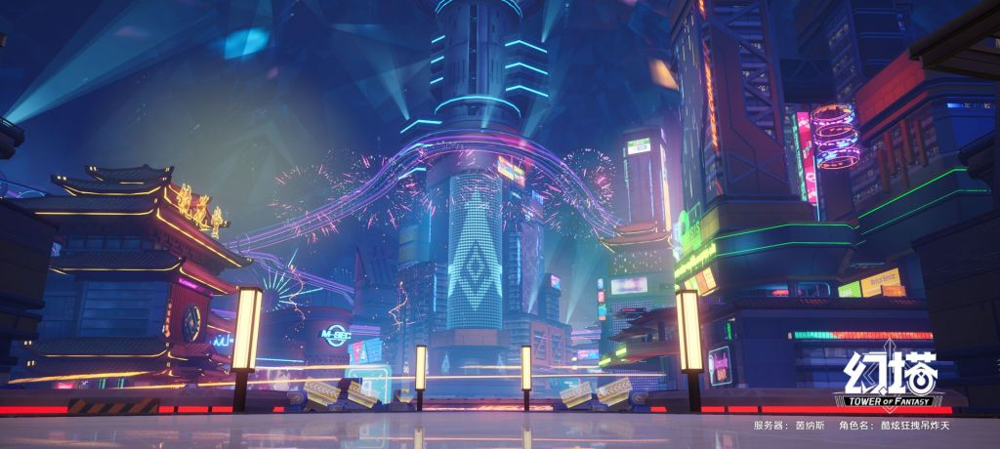
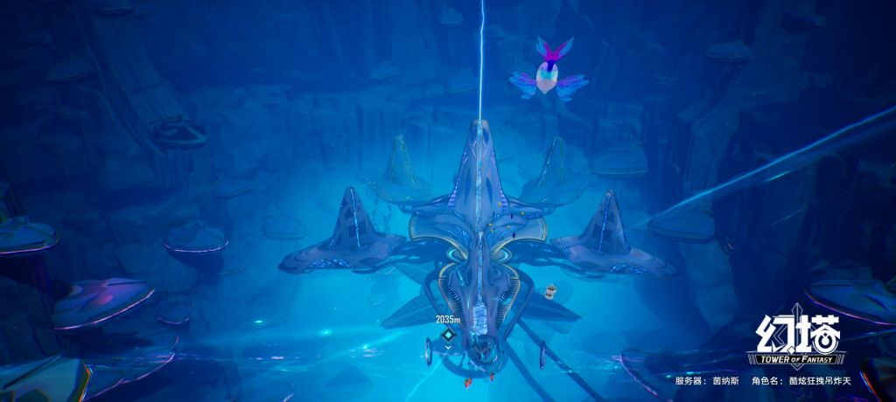
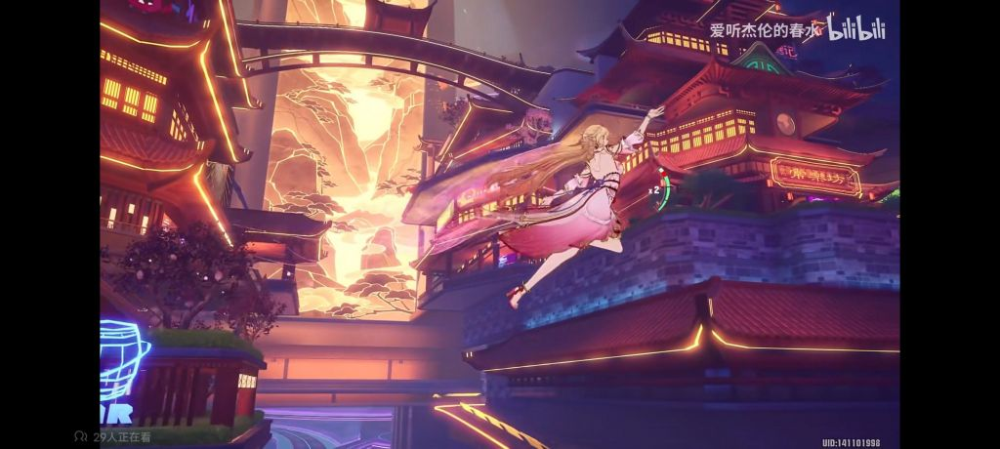

### [不吐不快]想问下里查为啥没人推荐幻塔当原神代餐？

Made by ngapost2md (c) ludoux [GitHub Repo](https://github.com/ludoux/ngapost2md)

----

##### 0.[1] \<pid:0\> 2023-07-31 19:00:07 by 友项
刚才爬了个推荐楼，自己幻塔开服玩过后来嫌弃打击感还有觉得团本麻烦就留在原神了。老哥们不推荐的原因是啥，看幻塔最近国风角色把我看摁了，还是老牌厂商懂宅男

----

##### 1.[0] \<pid:706090264\> 2023-07-31 19:01:08 by 记得关灯
真不如玩顺火暖

----

##### 2.[0] \<pid:706090404\> 2023-07-31 19:02:02 by 龙澂
>[jump](#pid706090264) 记得关灯(2023-07-31 19:01)说:
>真不如玩顺火暖[s:ac:哭笑]

但顺火暖那个画风我真欣赏不来

----

##### 3.[0] \<pid:706090435\> 2023-07-31 19:02:10 by 风之碧海之翠
这个确实漂亮，这是精三？0命是不是金发

----

##### 4.[4] \<pid:706090465\> 2023-07-31 19:02:19 by 酿酒酒
这个图是幻塔？？？好好看啊
~~实际上我曾经拿幻塔当代餐，但是感觉画风实在是粗糙了点~~

----

##### 5.[0] \<pid:706090530\> 2023-07-31 19:02:44 by grp767
没玩过塔
但是我顺火暖创了个九灵女号，光看主角的过场动画就嗯了

----

##### 6.[0] \<pid:706090594\> 2023-07-31 19:03:02 by jwbdbx
因为数值膨胀

----

##### 7.[0] \<pid:706090600\> 2023-07-31 19:03:04 by 锋叶琉璃
说起来我逛b站看见幻塔好像有个龙萝莉，声音也好听，挺喜欢的，但是听说幻塔的膨胀特别快，就放弃入坑了

----

##### 8.[0] \<pid:706090619\> 2023-07-31 19:03:11 by nervkid
幻塔我印象就是当初刚出来时bug一堆，不知道现在怎么样了

----

##### 9.[0] \<pid:706090636\> 2023-07-31 19:03:17 by 开磕
塔的数值膨胀还是受人诟病啊涩涩看看图就可以了，真玩感觉玩不下去

----

##### 10.[0] \<pid:706090729\> 2023-07-31 19:03:54 by 碎冰op
感觉没意思呀

顺火暖的剧情虽然目前有点憋屈，好歹不是什么阿猫阿狗写的
而且跟npc互动啥的确实挺有意思

----

##### 11.[0] \<pid:706090731\> 2023-07-31 19:03:55 by Rudimentary
如果幻塔3.6之后开服你看看大伙是不是都去玩了

----

##### 12.[0] \<pid:706090790\> 2023-07-31 19:04:15 by Inquisit
因为我玩原之前已经玩了一年塔了，

----

##### 13.[0] \<pid:706091029\> 2023-07-31 19:05:42 by 璃月推魈员
数值膨胀太快了，感觉还不如顺火暖(但顺火暖的操作手感又稀烂

----

##### 14.[0] \<pid:706091290\> 2023-07-31 19:07:15 by 香草凉拌折耳根
我用iPad玩幻塔不知道为什么会闪退，而且前期地图太空了

----

##### 15.[0] \<pid:706091343\> 2023-07-31 19:07:35 by 哒哒块
虽然是借鉴的飞天，但这才是我心里的正经舞娘(二阶)看了下这个角色能在大世界飞

说回正题，我主要是对完美系mmo有刻板印象了，以前玩过一段时间，后来玩上wow之后就再也不碰完美了

----

##### 17.[0] \<pid:706091587\> 2023-07-31 19:08:59 by 游云鲸梦
因为幻塔有pvp而且强社交？
我现在还在玩原其实就是找不到另一款单机大世界游戏，幻塔和顺火暖对我这种自闭玩家都不是很友好

----

##### 18.[0] \<pid:706091608\> 2023-07-31 19:09:07 by 年下萝莉控
等ps5去试试吧 手机画面太渣了

----

##### 19.[0] \<pid:706091632\> 2023-07-31 19:09:17 by erikcww
因为有手综结晶嘬奶嘴的时候早就推荐过了，不需要理查出手

----

##### 20.[0] \<pid:706091909\> 2023-07-31 19:10:43 by grp767
>[jump](#pid706090729) 碎冰op(2023-07-31 19:03)说:
>感觉没意思呀  顺火暖的剧情虽然目前有点憋屈，好歹不是什么阿猫阿狗写的 而且跟npc互动啥的确实挺有意思

顺火暖主线那叫一点憋屈吗？我碰到的建模还行的敌人就没赢过，天天剧情杀

最槽的是那个顾xx，我帮他投书能解决99%的问题，结果这逼纯纯敏感小仙男拒绝，剧情上还得我当他亲娘，吃喝拉撒住心理调节找老婆都得一手抓

幸好除了主线都还行

----

##### 21.[0] \<pid:706091912\> 2023-07-31 19:10:43 by 碎冰op
>[jump](#pid706091587) 游云鲸梦(2023-07-31 19:08)说:
>因为幻塔有pvp而且强社交？
>我现在还在玩原其实就是找不到另一款单机大世界游戏，幻塔和顺火暖对我这种自闭玩家都不是很友好

顺火暖可以自闭玩的，设置选同时显示在线人数改成0，然后左下角屏蔽其他玩家就好了呀
副本都可以AI带过。。。也不指望两天杀穿所有副本吧，随便玩玩就行

----

##### 22.[1] \<pid:706091954\> 2023-07-31 19:10:57 by JSYB
玩过，退坑了，再回去估计跟不上进度了mmo就是这点不好

----

##### 23.[0] \<pid:706091971\> 2023-07-31 19:11:04 by MeliMor
我靠主楼这图也太好看了这位美女叫什么名字？我要去搜索美图

----

##### 24.[0] \<pid:706092038\> 2023-07-31 19:11:31 by 江sama
数值膨胀太严重

----

##### 25.[0] \<pid:706092054\> 2023-07-31 19:11:36 by 碎冰op
>[jump](#pid706091909) grp767(2023-07-31 19:10)说:
><b>Reply to [pid=706090729,37208772,1]Reply[/pid] Post by [uid=60030714]碎冰op[/uid] (2023-07-31 19:03)</b> 顺火暖主线那叫一点憋屈吗？我碰到的建模还行的敌人就没赢过，天天剧情杀[s:ac:哭笑]  最槽的是那个顾xx，我帮他投书能解决99%的问题，结果这逼纯纯敏感小仙男拒绝，剧情上还得我当他亲娘，吃喝拉撒住心理调节找老婆都得一手抓  幸好除了主线都还行

怎么说呢那原小说不是更。。。
但是你看看原你就觉得不憋屈了，反正我是这样的。

----

##### 26.[1] \<pid:706092178\> 2023-07-31 19:12:19 by RiNSliiUH
3.6之后下过幻塔，只能说审美是mhy的形状了，觉得幻塔建模不对胃口，动作不够细腻。剧情刚到新手村？有没有小伙伴能说说后续咋样，要是之后的剧情动作细腻了我还能回去试试  

编辑：会不会是没用pc玩的原因

----

##### 27.[0] \<pid:706092197\> 2023-07-31 19:12:27 by Congyul
一直在玩啊，什么都不好，但就是好玩，这是开服的评价。
现在地图和角色做的不错了，但ch依旧频繁作妖，数值控制也是一坨，是真不太想向外安利

另外基本必须pc，手机端体验差太多了

----

##### 28.[0] \<pid:706092304\> 2023-07-31 19:13:04 by gawayne
印象流评价下

第一，塔塔的瓜也太tm多了。刚开服那一段时间各种bug和ch作妖真的印象差。

第二，塔塔膨胀好像非常夸张，淘汰旧角色的速度逆天。

第三，塔塔要团本，mmo式的联机绝对不是主流，二次元独狼/自闭人特别多，真想联机那mmo的竞品太多了。

----

##### 29.[0] \<pid:706092553\> 2023-07-31 19:14:40 by 燕国地图
>[jump](#pid706091587) 游云鲸梦(2023-07-31 19:08):

没有野外PVP，但有竞技场和类似吃鸡模式玩法
我觉得算强社交，每次打BOSS都有一面包车人

----

##### 30.[0] \<pid:706092580\> 2023-07-31 19:14:49 by 友项
>[jump](#pid706091971) MeliMor(2023-07-31 19:11) 说: 
>
>我靠主楼这图也太好看了这位美女叫什么名字？我要去搜索美图

去专区搜了下叫绯色，好像最近新出的。

----

##### 31.[0] \<pid:706092581\> 2023-07-31 19:14:49 by 转生能成功吗
建模不是很对我胃口我是幼态审美

----

##### 32.[0] \<pid:706092644\> 2023-07-31 19:15:10 by 冰河新栖姬
首先就是他是个mmo，经典战+法+牧组队打本的游戏，对适应了单机玩法的原神玩家可能不大接受，自闭单机玩确实也能玩，但可能会失去很多乐趣
它大世界也有一些内容是以组队的难度设计的，单人打可能极难甚至打不过，不过问题也不大，你可以等数值膨胀后抽新武器就能打过了后来塔出了世界等级，彻底解决了这个问题

然后是角色待遇，按照原神的格式，塔相当于每个角色up当期会在主线里露脸一段时间，然后直接神隐，能不能再次出场全看编剧心情，传说任务也是少数人才有，活动什么的几乎没有任何剧情，注定了塔在厨力这方面是比较薄弱的
~~不过问题也不大，毕竟塔的剧情要么逆天，要么白开水~~
不过塔也有塔的优势，那就是角色和强度完全解绑，你可以用任何一个角色的外观搭配其他角色的技能，这方面对厨力党还是比较友好的...如果塔还能培养出厨力党的话

----

##### 33.[0] \<pid:706092696\> 2023-07-31 19:15:31 by Inquisit
>[jump](#pid706091587) 游云鲸梦(2023-07-31 19:08) 说: 
>
>因为幻塔有pvp而且强社交？
>我现在还在玩原其实就是找不到另一款单机大世界游戏，幻塔和顺火暖对我这种自闭玩家都不是很友好

港真，顺火暖是真的自闭 我和坛友认亲前玩了一个月都没跟活人交流过

----

##### 34.[0] \<pid:706092713\> 2023-07-31 19:15:38 by ArseneZ
因为mmo对独狼不友好

----

##### 35.[0] \<pid:706092751\> 2023-07-31 19:15:48 by 癸唐贺庚屈陶
幻塔属于是什么都好，就是不好玩。

顺火暖卖相很糙，但是缝的东西多，让人有事干(而且不强制打团本)，如果幻塔你摆烂单机能接受的话其实也ok(反正没有深渊，打本只提战力，大世界10选手完全可以畅游)

----

##### 36.[2] \<pid:706092949\> 2023-07-31 19:17:07 by 李猛赣
塔也是生不逢时，撞上了如日中天的稻妻时代，玩的人少就必须数值膨胀，只能越来越寄，现在名声都烂了
要是3.6之后开服，你猜润过去的人多不多？

----

##### 37.[0] \<pid:706092966\> 2023-07-31 19:17:14 by Fairy_Yukikaze
当时想入坑万代的蓝色协议当代餐的，然后经典万代不当人封 ip，被封了俩号就放弃了

----

##### 38.[0] \<pid:706093248\> 2023-07-31 19:19:01 by 楚末_二号机
玩过，对本自闭社恐二次元来说最大的问题就是和逆水寒一样强社交所以原的竞品为什么都去卷mmo了，伪单机不比mmo好做吗，没那么多交互系统平衡问题

----

##### 39.[0] \<pid:706093257\> 2023-07-31 19:19:04 by Inquisit
>[jump](#pid706092304) gawayne(2023-07-31 19:13) 说: 
>
>印象流评价下
>
>
>第一，塔塔的瓜也太tm多了。刚开服那一段时间各种bug和ch作妖真的印象差。
>
>第二，塔塔膨胀好像非常夸张，淘汰旧角色的速度逆天。
>
>第三，塔塔要团本，mmo式的联机绝对不是主流，二次元独狼/自闭人特别多，真想联机那mmo的竞品太多了。

角色和武器技能解绑 抽到的模组谁都能用，倒是不用担心老婆被淘汰
第三个倒是真的传统数值mmo通病也是我断断续续最终玩不下去的原因  
而且塔的探索是真的挺无聊的虽然容易，真.吃豆人

----

##### 40.[0] \<pid:706093325\> 2023-07-31 19:19:28 by Kaekaekae
我是在玩原之前玩的幻塔
其实可以玩，闪避有“林克时间”我还挺喜欢的，但最后劝退我的还是社交属性太强，和MMO一样组团下副本需要固定队比较好，组野队很容易被踢或者失败

----

##### 41.[0] \<pid:706093395\> 2023-07-31 19:19:53 by 燕国地图
>[jump](#pid706092644) 冰河新栖姬(2023-07-31 19:15)说:
>首先就是他是个mmo，经典战+法+牧组队打本的游戏，对适应了单机玩法的原神玩家可能不大接受，自闭单机玩确实也能玩，但可能会失去很多乐趣 它大世界也有一些内容是以组队的难度设计的，单人打可能极难甚至打不过，不过问题也不大，你可以等数值膨胀后抽新武器就能打过了[s:ac:哭笑]后来塔出了世界等级，彻底解决了这个问题  然后是角色待遇，按照原神的格式，塔相当于每个角色up当期会在主线里露脸一段时间，然后直接神隐，能不能再次出场全看编剧心情，传说任务也是少数人才有，活动什么的几乎没有任何剧情，注定了塔在厨力这方面是比较薄弱的 <del class='gray'> 不过问题也不大，毕竟塔的剧情要么逆天，要么白开水 </del> 不过塔也有塔的优势，那就是角色和强度完全解绑，你可以用任何一个角色的外观搭配其他角色的技能，这方面对厨力党还是比较友好的...如果塔还能培养出厨力党的话

幻塔早期角色建模方面真的吃不少亏
另外虽然没什麽用，但其实可以在大地图找到自机角色

----

##### 42.[0] \<pid:706093655\> 2023-07-31 19:21:29 by 瀚宇茫茫
虽然说是膨胀(mmo警告)，但是在当电子手办这块还是比原好一点的(起码够大

----

##### 43.[0] \<pid:706094082\> 2023-07-31 19:23:59 by xmkz798
幻塔现在也得和顺火暖打而且因为都是mmo，幻塔打的还更正面一点…

----

##### 44.[0] \<pid:706094092\> 2023-07-31 19:24:01 by yunwowuxin
看这张确实有点想下回来了，好漂亮啊而且还是国风角色之前卸幻塔就是因为塔的国风角色比璃月还日式刻板印象一些，终于态度和审美大飞跃了

----

##### 45.[0] \<pid:706094706\> 2023-07-31 19:27:43 by 拿到了小孩角色卡噜
感觉不如顺火暖

----

##### 46.[0] \<pid:706094811\> 2023-07-31 19:28:20 by Joyeeeah没有joy
这什么角色啊 好漂亮！！这才叫国风好吧！！

----

##### 47.[0] \<pid:706094851\> 2023-07-31 19:28:34 by 银霭鸢尾花
我本来就对原没多大兴趣，玩点好的不行吗还找代餐

----

##### 48.[0] \<pid:706095284\> 2023-07-31 19:31:23 by 蝉儿鸣泣
幻塔模型是好看，就是数值膨胀太离谱了
但凡正儿八经的控制好了，以幻塔后期的地图跟人物，我觉得是薄纱现在的原神的

----

##### 49.[0] \<pid:706095381\> 2023-07-31 19:32:06 by 吃瓜田里的猹捏
之前玩过，但不知道为什么有点晕3d

----

##### 50.[0] \<pid:706095422\> 2023-07-31 19:32:16 by 池来
那边策划脑子不太好使，搞了几次抑制，结果成了有人膨胀有人抑制，现在没多少想抑制的玩家了。现在那边策划因为新火不够膨胀被冲。在意膨胀的话还是去玩易水寒吧。

----

##### 51.[0] \<pid:706095491\> 2023-07-31 19:32:41 by 2974Cypr
幻塔剧情怎样? 有人说下吗
逆水那部 海外好像有点难玩到阿...

----

##### 52.[0] \<pid:706095576\> 2023-07-31 19:33:09 by 何可守
幻塔现在对手机要求怎么样

----

##### 53.[0] \<pid:706095679\> 2023-07-31 19:33:51 by 燕国地图
幻塔算是吃了开服的亏，举几个例子：早期角色建模比较粗糙，武器数值膨涨，官方直播不会带货，手机体验不好等等，但後面都有一点点改善。

----

##### 54.[0] \<pid:706095949\> 2023-07-31 19:35:23 by mie001
早就试过了，除了探险工具自由和有载具之外也没多好。然而整体质量秒杀沙漠吧

----

##### 55.[0] \<pid:706096093\> 2023-07-31 19:36:14 by 咕咕Phi
据说数值崩了

----

##### 56.[0] \<pid:706096253\> 2023-07-31 19:37:13 by MeliMor
>[jump](#pid706092580) 友项(2023-07-31 19:14) 说: 
>
>去专区搜了下叫绯色，好像最近新出的。

好好好 谢谢老哥

----

##### 57.[0] \<pid:706097540\> 2023-07-31 19:45:15 by 夭叶舒华
幻塔试过，主角开场跑步奈子摇不对我胃口，摇地很奇怪，明明原还有战双的奈子摇我都没问题，就是幻塔的很奇怪

----

##### 58.[0] \<pid:706097669\> 2023-07-31 19:46:06 by 小汤圆圆圆又圆
这是那个最近经常刷到的金发美女的进化形态吗两个形态都很美啊

----

##### 60.[0] \<pid:706097915\> 2023-07-31 19:47:53 by 结弦听风小奏
我是不喜欢mmo(花时间太多，有这时间我不如去玩主机)，加上开服建模劝退，地图也不咋地

----

##### 61.[0] \<pid:706098167\> 2023-07-31 19:49:34 by 奈何断桥
战斗和养成系统太奇特，数值策划把握不住，伤害做崩了，结果就是最强的卡永远永远都是下一张。永无止尽地数值膨胀。

战斗特效挺好看，现在up的篁那个特效超炫酷，普通攻击跟原神这边迪卢克大招一样酷炫，手感也很棒。不过打击感嘛，和原神半斤八两，打木桩，没啥反馈。

幻塔的大世界其实挺大的，量大管饱，产能很足，但是<b>非常空洞</b>，而且质量不如原神，成本所限吧，挺可惜的。

不过相比原这边有个显著优势是道具种类多，且超好用。什么钩索，可以直接在垂直墙面上走的鞋子，能原地起飞的飞行器啦……哦，还有前段时间出的蕾比利亚这个拟态(也可以理解为角色)，长按冲刺可以原地起飞，~~高度(大概)可以超越蒙德城墙，~~大世界神一样的存在，而且在滑翔时还可以加速滑翔~~滑翔速度远超某扇子效果~~总得来说幻塔的大世界不如原神好玩。

剧情上，内容我没怎么看，不敢评价。不过有剧情跳过就赢了某个没剧情跳过的玩意儿一手。当然，剧情演出受限于成本也不如原，和原这边木头站桩棒读式演出堪称卧龙凤雏，不过主角说话要多些。

然后是角色设计。这个我觉得是幻塔没原神火最重要的因素。(这个先干饭，干完饭再聊)

----

##### 62.[0] \<pid:706098300\> 2023-07-31 19:50:29 by 我的奥利奥呢
>[jump](#pid706092644) 冰河新栖姬(2023-07-31 19:15):

塔的剧情不逆天，三观正的，白开水是真

----

##### 63.[0] \<pid:706098655\> 2023-07-31 19:52:44 by mithy-
>[jump](#pid0) 友项(2023-07-31 19:00):

后排发问有没有跟我一样受不了它里面那个机器人故意读错发音的设定，尬的我呲牙齿。想到今后有个发音不保准的一直在旁边，直接给卸了

----

##### 64.[0] \<pid:706099175\> 2023-07-31 19:56:05 by 问书想要一条鱼
卧槽这是塔的建模？我冲了

----

##### 65.[0] \<pid:706099184\> 2023-07-31 19:56:09 by NovalithCannon
已经在玩了

----

##### 66.[0] \<pid:706099319\> 2023-07-31 19:57:03 by 星光_夜芒
幻塔那个岚还挺好看挺出圈的，原神mod论坛也见过不少岚的模型mod。
至于游戏本体没玩过，听说比较氪。以前有心想玩时，pc端卡在安装了，好像和HyperV虚拟机有冲突，但是又听说幻塔的官方pc端是假安卓模拟器真pc架构，总之没装成，后面不了了之。

----

##### 67.[0] \<pid:706099553\> 2023-07-31 19:58:32 by 冰河新栖姬
>[jump](#pid706098300) 我的奥利奥呢(2023-07-31 19:50)说:
><b>Reply to [pid=706092644,37208772,2]Reply[/pid] Post by [uid=65165604]冰河新栖姬[/uid] (2023-07-31 19:15)</b>塔的剧情不逆天，三观正的，白开水是真

三观正不代表不逆天，塔1.0就是纯纯的逆天剧情，把主角当工具人写，剧情都在描写夏佐和反派，既想给主角戏份，又不让主角抢戏，结果就是主角屡战屡败还一直当舔狗

----

##### 68.[0] \<pid:706099617\> 2023-07-31 19:58:54 by 艮覆碗
主要是幻塔开服骚操作太多了，我玩了一段时间没坚持下去就弃了

----

##### 69.[0] \<pid:706099770\> 2023-07-31 19:59:49 by Question10086
我倒是下载过幻塔，但是原神搞得我对任何游戏都没兴趣了
即使幻塔可以跳过剧情，我也没有精力和耐心去开荒做任务了
幻塔的载具，跑跳都挺好的

----

##### 70.[1] \<pid:706101863\> 2023-07-31 20:12:45 by 江之岛
塔涩涩度是很够的，主要是不太好玩，也没有培养用户粘性的剧情，并且几波膨胀让人对未来的发展很没底气

----

##### 71.[0] \<pid:706103820\> 2023-07-31 20:25:22 by 我的奥利奥呢
>[jump](#pid706099553) 冰河新栖姬(2023-07-31 19:58) 说: 
>
>三观正不代表不逆天，塔1.0就是纯纯的逆天剧情，把主角当工具人写，剧情都在描写夏佐和反派，既想给主角戏份，又不让主角抢戏，结果就是主角屡战屡败还一直当舔狗

经历过公子散兵剧情，对我来说只要三观不歪就不算逆天

----

##### 72.[0] \<pid:706104324\> 2023-07-31 20:29:00 by 哇库哇库今天吃什么
虽然成天说MHY数值上班应该给美术磕头，但是我觉得幻塔才应该是给美术磕头的那个，还得是三拜九叩的那种

----

##### 73.[0] \<pid:706104949\> 2023-07-31 20:33:02 by hjg3
幻塔的运营和数值ch都是一等一的逆天，这些逼就是领着工资把项目玩死的吊人

----

##### 74.[0] \<pid:706105491\> 2023-07-31 20:36:47 by 时之流砂
但凡试过也不会问这个问题。年初被岚骗去玩了半个月，字面意思上的粗制滥造

----

##### 75.[0] \<pid:706111920\> 2023-07-31 21:20:32 by 奈何断桥
>[jump](#pid706098655) mithy-(2023-07-31 19:52) 说: 
>
>后排发问有没有跟我一样受不了它里面那个机器人故意读错发音的设定，尬的我呲牙齿。想到今后有个发音不保准的一直在旁边，直接给卸了

有有有，我就是，这玩意叫miya吧，上半身短且大头，比例逆天，丑得要死
然后加上你提的这一点，导致我过前期剧情时看到这玩意出镜就直接点跳过
捏鼻找的图

----

##### 76.[0] \<pid:706112632\> 2023-07-31 21:25:13 by 祈安Mokia
塔塔的毛病就是一直想做个让人一眼震撼的东西但忽视了细节和舒适度……从海底甚至沙漠开始就这样，3000m纵深的海洋可以算上是国内数一数二的了，但探索做的真的一坨屎……我现在去溟海地区都是去岛上挂机的，毕竟海面沙滩是真的美丽音乐也好听，但是探索是狗都不玩，至今探索度30%摆烂。
包括九域，特别是震州，好看吗？好看。震撼吗？震撼。但是那高低差跑的人想死，新版本都快更了我震州星碑还没开完……还有细节是真不行，上个楼梯都能卡脚。
还有就是社区氛围也不好，nga糊糊的，贴吧四÷大战有些黑的让人觉得脑子不好，B站评论区则是隐隐有结晶的倾向……妈的B站是什么培养皿吗哪哪都结晶。

但我玩塔塔只是给我推捏脸想带我推到另一个世界转转的代餐。所以我总体还是满意的，毕竟剧情能跳，策划犯病能冲，大世界能乱杀，武器技能也好看。反正我玩的挺开心，就是不会推荐给其他人就是了

----

##### 77.[0] \<pid:706114174\> 2023-07-31 21:36:03 by mithy-
>[jump](#pid706111920) 奈何断桥(2023-07-31 21:20) 说: 
>
>有有有，我就是，这玩意叫miya吧，上半身短且大头，比例逆天，丑得要死
>然后加上你提的这一点，导致我过前期剧情时看到这玩意出镜就直接点跳过
>捏鼻找的图
>

哈哈哈哈哈哈握手，你继续玩下去了？

----

##### 78.[0] \<pid:706115834\> 2023-07-31 21:50:51 by ican110
别来塔！别来塔！别来塔！重要的说三遍。起码最近别来。
塔现在属性平衡性有严重的问题，目测测试服结束就要出事。

不明真相的可以查我今天倒数第二个的回帖。

----

##### 79.[0] \<pid:706115866\> 2023-07-31 21:51:04 by 凉菲凡
玩过， MMO玩不来
现在想通了， 要玩开放世界我直接把辐射4打个nanakochan MOD爽玩

要玩二次元养成那就找专业媚宅的， 所以玩了碧蓝档案， 最近玩尘白因为我喜欢打枪， 顺便等一个少前追放

----

##### 80.[0] \<pid:706116901\> 2023-07-31 21:57:45 by 奈何断桥
>[jump](#pid706114174) mithy-(2023-07-31 21:36) 说: 
>
>哈哈哈哈哈哈握手，你继续玩下去了？

当个副游吧，想起来了就上线领一领东西，抽一抽卡，随便升升级，打打boss,过一过主线，然后有段时间不玩，清理电脑空间时把它卸载了。最近发现要出妃色(妃色确实惊艳到我了)，刚刚好又在手机上登录领了抽卡资源抽到芬璃尔，就回来玩玩。

有一说一，被gayshit折磨这么多个版本，看见幻塔该大的地方足够大的女拟态，真有点久汉逢甘雨

----

##### 81.[0] \<pid:706128378\> 2023-07-31 23:16:25 by 新世界的一道曙光
>[jump](#pid706090264) 记得关灯(2023-07-31 19:01) 说: 
>
>真不如玩顺火暖

也不是所有人都喜欢顺火暖画风的，看过挺多寒王视频，但我实在受不了古风，包括幻塔那个九域也是倒我胃口，为了前面那些有特色的地图和角色玩的幻塔，不打pvp本的话玩起来和原差不多

----

##### 82.[0] \<pid:706129319\> 2023-07-31 23:22:45 by ak1212ak
仅以现在版本来说，确实可以，某些方面更好，不过细节之类不足的地方也多
玩幻塔的一般都有公会群或者在贴吧吧，泥潭的幻塔版都没啥人的

----

##### 83.[0] \<pid:706129835\> 2023-07-31 23:26:06 by ak1212ak
>[jump](#pid706091343) 哒哒块(2023-07-31 19:07):

完美味ptsd高情商经典设计，低情商没进步。塔到2.x版本之后倒是有些进步的

----

##### 84.[0] \<pid:706130057\> 2023-07-31 23:27:24 by momookyk
不建议提其他游戏，可能会被广告为由禁言扣声望

----

##### 85.[0] \<pid:706130167\> 2023-07-31 23:28:07 by 什锦
开服蝗过，玩不明白，连日常都不知道怎么完成，只好跑了。后来听说数值膨胀很厉害，所以不会回去玩了。我并不是一定要玩游戏，不是原神烂掉了我就会去玩别的游戏，没有各方面都达标的游戏可以不玩的，望各厂商周知

----

##### 86.[0] \<pid:706130653\> 2023-07-31 23:31:40 by 新世界的一道曙光
个人更喜欢这两张图一些，感觉是比较少见的风格。探索的话也挺自由的，初始就有伞的探索能力，后续抽点原地起飞，直线飞行的角色还能更舒服，妃色就是新一代直线飞行角色，更赏心悦目，但是减飞行体力消耗放5命去，没抽五命就只能飞个七八秒，五命了可以飞二十几秒。另外我入坑三个月就见识过强度影响较大的暗改了，强度党谨慎入坑

----

##### 87.[0] \<pid:706131259\> 2023-07-31 23:36:20 by 闲人闲事儿
我不推荐的原因是不推荐强度玩家，幻塔的数值的确可以说非常失败，但探索这方面确实没啥问题，基本的探索用具也不卡你。但如果不喜欢探索，那幻塔除了数值确实没啥好玩的东西了

----

##### 88.[0] \<pid:706131340\> 2023-07-31 23:36:57 by chd1236999
我真玩过塔。下了两次卸了两次。
第一次是因为本身就对完美有阴影，完美味的剧情一出来，加上开始地图太糙，我路过一片贴图没贴好的沙漠玩不下去就卸了。另外刚开始开不了九域。
第二次还惦记着miya小机器人觉得挺可爱的又下了(对就是楼上那个觉得丑的)。地图还是太糙，我感觉解密有种哄幼儿园浪费我时间的感觉。另外社恐受不了镜都路过都是人。本来挺期待夏佐的结果建模一出来那什么鬼建模，又卸了

----

##### 89.[0] \<pid:706131359\> 2023-07-31 23:37:03 by ak1212ak
>[jump](#pid706130653) 新世界的一道曙光(2023-07-31 23:31)说:
>个人更喜欢这两张图一些，感觉是比较少见的风格。探索的话也挺自由的，初始就有伞的探索能力，后续抽点原地起飞，直线飞行的角色还能更舒服，妃色就是新一代直线飞行角色，更赏心悦目，但是减飞行体力消耗放5命去，没抽五命就只能飞个七八秒，五命了可以飞二十几秒。另外我入坑三个月就见识过强度影响较大的暗改了，强度党谨慎入坑[img]https://img.nga.178.com/attachments/mon_202307/31/l2Q2s-havnK2aT3cSsg-cs.png[/img][img]https://img.nga.178.com/attachments/mon_202307/31/l2Q2s-kyybK1cT3cSsg-cs.png[/img][img]https://img.nga.178.com/attachments/mon_202307/31/l2Q2s-ko69ZbT3cSsg-g0.jpg[/img][img]https://img.nga.178.com/attachments/mon_202307/31/l2Q2s-l381K21T3cSsg-cs.jpg[/img]

我看高赞有个说生不逢时的那个，但是考虑到幻塔本身各种bug多，而且有一些很恶性的(氪金道具相关)，所以也挺难说的之前国际服开服是被人开挂变巨人搞其他玩家弄了一波
现在也是各种丢伤害或者有利玩家的bug，一直都有，过一阵改一下什么组团去打单人的旧日超域，夏佐隔几天丢一波伤害，无限飞天啥的，还有各种各样的卡buff打xx本

----

##### 90.[0] \<pid:706132782\> 2023-07-31 23:47:21 by 子夜歌QAQ
玩过，只能说幻塔没人玩是正常的，原虽然垃圾但是幻塔想发原难财还是想多了，被原压着打可不是什么怀才不遇之类的原因
非常夸张的数值膨胀和角色建模与地图建模风格的割裂是老生常谈的了，楼里提的不少，我就再不说了
提一下大世界跑图吧，幻塔非常喜欢吹他们载具多这个，但是载具再多又不是免费直接发的，幻塔开局给的喷气背包还有几十秒的CD呢，很不好用，但是幻塔的地图上传送点特别少，类比就是原神的七天神像这种，去哪里都要跑很长的路，代步放式多但是都要靠攒或者买，有时候为了跑图抽个武器几个月后就除了跑图再什么用都没有了，被数值膨胀淘汰了。幻塔那个沙漠有很多蘑菇状的地形，免费的喷气背包上不去，好用的钩锁又不是免费的，传送点还特别少，去个哪儿不买或者攒那个钩锁费劲死了，海底也类似，没传送路还特别长，自己游有时候去个特定地方一游得好一会。原神里夜兰散兵这种是可以优化跑图体验，不抽角色有风之翼有传送锚点去哪都也算快捷，幻塔是真的你不买特定的东西跑图就是折磨
再说角色吧，幻塔没有角色只有武器，数值膨胀之外还有个让人难受的就是，幻塔开局不送治疗，得你抽到至少两把治疗武器才能玩治疗角色，大家脑补一下原神如果开局不送芭芭拉新手池也没有女仆，还得至少抽到两个奶妈才能玩带治疗的角色，开荒体验会是什么样的
幻塔的剧情也非常非常一般，不过到不是恶心人，就是一般罢了，让人不想看那种无聊，不过人家不像原神强迫你看剧情，可以连点过去。地图倒是有些好看的，九域远景就很漂亮，不过有些地图像镜都这种塑料感特别重
总之就是一个发不了原难财的游戏

----

##### 91.[0] \<pid:706134299\> 2023-07-31 23:58:46 by 拌饭派蒙酱
塔优点是有的，我反而很奇怪为什么那么多人推荐寒，对二游受众来说那个画风就不太行。
但是指望塔爆原金币也是想多了，真心不是一个赛道，塔很难抢走习惯原这种模式的玩家。

----

##### 92.[1] \<pid:706134906\> 2023-08-01 00:04:04 by lLerry
我的评价是玩玩可以但别用心虽然以前建模是真的难绷但是最近的很顶，后面成女也很多。
他家大地图主要是远看着特别唬人(褒义)，镜都地图我尤其喜欢。但是一是探索很操蛋；二是工期太紧，有些东西要后面版本优化，所以现在的新地图草皮秃噜，山的片数也很感人
BTW我老觉得这游戏缺点心眼，米米待机比耶他们看着真的不觉得难受吗活动界面老要整个不相关的人物立绘上去是何意啊反正就是那种……很不二次元的感觉(？)
但是这游戏最好玩的就是烧鸡很多，烧鸡很多，而且大家都乐于当烧鸡(

----

##### 93.[0] \<pid:706135003\> 2023-08-01 00:04:52 by 庶民物語
这图足够吸引我玩了，但是我是自闭玩家

----

##### 94.[0] \<pid:706135192\> 2023-08-01 00:06:28 by 风中的妮
>[jump](#pid706095284) 蝉儿鸣泣(2023-07-31 19:31) 说: 
>
>幻塔模型是好看，就是数值膨胀太离谱了
>但凡正儿八经的控制好了，以幻塔后期的地图跟人物，我觉得是薄纱现在的原神的

在幻塔也可以当大世界党啊

----

##### 95.[0] \<pid:706135205\> 2023-08-01 00:06:35 by 梦境黄昏
幻塔的角色如此符合对原神不满玩家的期望，还没爆原神金币只能证明一件事，游戏好玩才是最重要的，这也是原神有恃无恐的原因
我看过幻塔地图，也想过要不要入坑，地图看上去很多但太空了，这个地图就没有让我跳坑的想法

----

##### 96.[0] \<pid:706135281\> 2023-08-01 00:07:17 by biubiu222
我觉得幻塔前期体验一般 手感也不好

