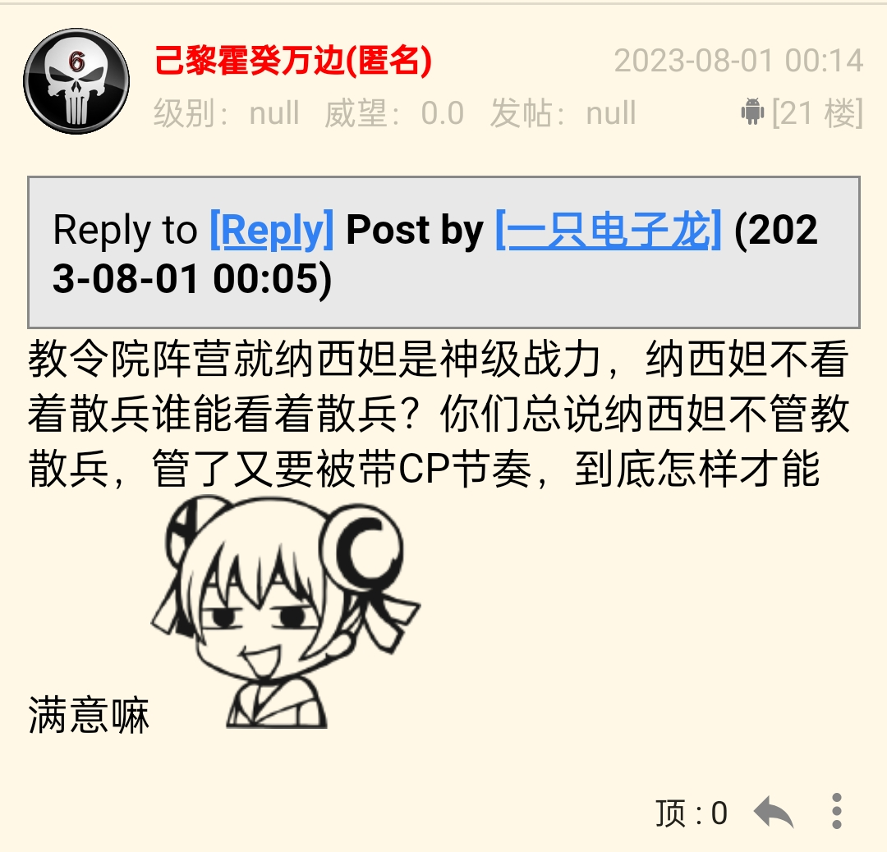
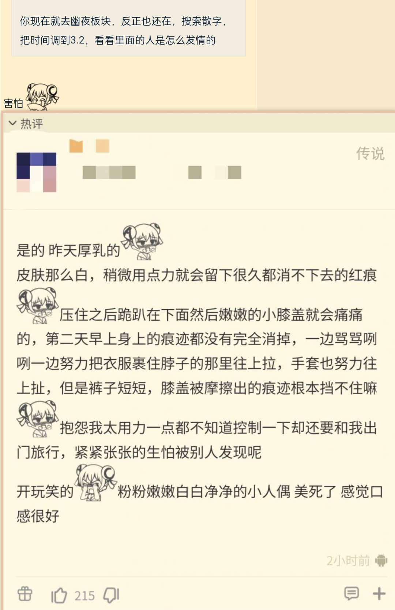
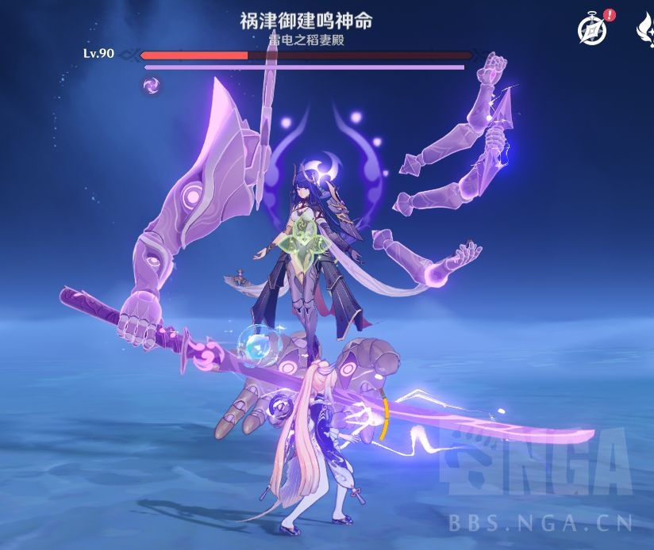
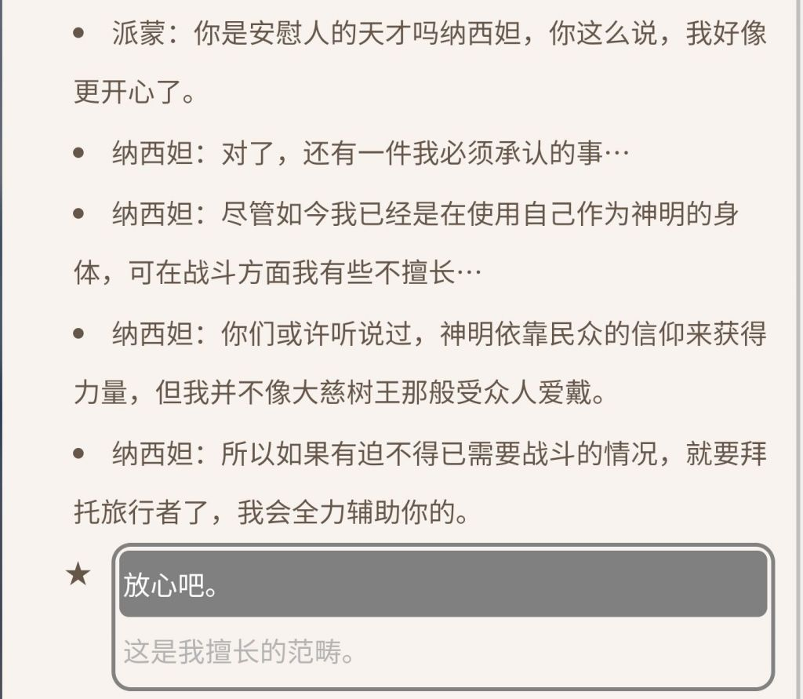
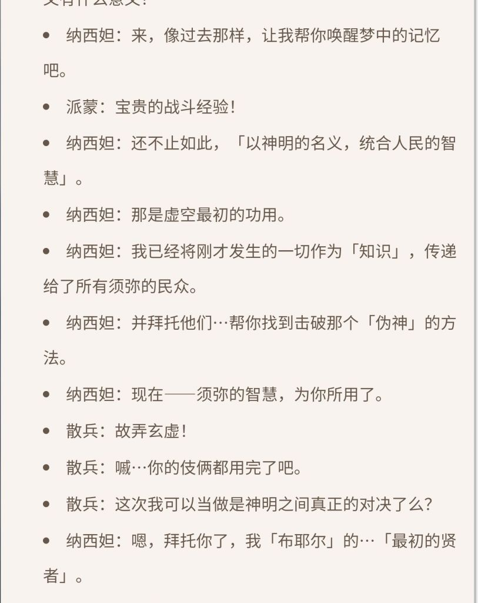
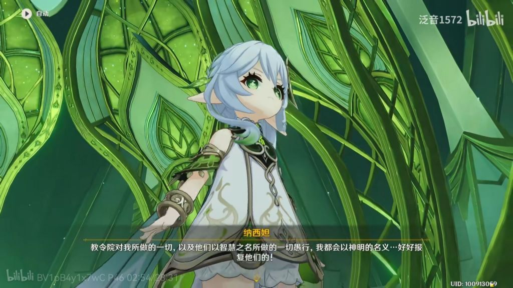

### [不吐不快]为什么这版本其他和纳西妲完全没有互动？

Made by ngapost2md (c) ludoux [GitHub Repo](https://github.com/ludoux/ngapost2md)

----

##### 0.[2] \<pid:0\> 2023-07-31 23:11:30 by 吸水恶魔
那么大的秘境，草神也不派人来检查一下。

看不到99了，我好伤心

----

##### 1.[2] \<pid:706128213\> 2023-07-31 23:15:30 by 大碗番茄炒鸡拌饭
知道为什么池子up四个人活动只出场三个吗因为剩下那一个和老婆在净善宫甜甜蜜蜜呢，小夫妻也有自己的生活黄毛别蹭

----

##### 2.[3] \<pid:706128237\> 2023-07-31 23:15:37 by UID3563849
怎么没互动了，ep里不是吗

----

##### 3.[1] \<pid:706128355\> 2023-07-31 23:16:16 by Emmmuuuu
赔钱货没有出现在秘境
因为赔钱货和草神在净善宫疯狂批论文
批论文批到走不动路了

----

##### 4.[0] \<pid:706128422\> 2023-07-31 23:16:42 by BakaEustia
乐不思蜀

----

##### 5.[0] \<pid:706128460\> 2023-07-31 23:16:58 by 我不是路过的
差不多得了，谁家交公粮是喊路人一起参与的。

----

##### 6.[0] \<pid:706128604\> 2023-07-31 23:18:03 by rrysher
之前有人分析剧情中草会派SB来调查，SB的戏份被删除后活动也出了一些BUG

----

##### 7.[0] \<pid:706128683\> 2023-07-31 23:18:39 by ricardo_milos
ep里有，野外打扑克呢

----

##### 8.[0] \<pid:706128764\> 2023-07-31 23:19:08 by Torchka123
其实是有的，只不过是500+内容，你这种不到百岁的小孩不可以看的啦

----

##### 9.[0] \<pid:706128928\> 2023-07-31 23:20:06 by 宵妃黑莺
>[jump](#pid706128460) 我不是路过的(2023-07-31 23:16) 说: 
>
>差不多得了，谁家交公粮是喊路人一起参与的。

艾尔嗨森和卡位家

----

##### 10.[0] \<pid:706131222\> 2023-07-31 23:36:07 by mimengan
你造泡芙的时候会叫人围观吗？

----

##### 11.[0] \<pid:706131495\> 2023-07-31 23:37:53 by 己黎霍癸万边
>[jump](#pid706128213) 大碗番茄炒鸡拌饭(2023-07-31 23:15)说:
>知道为什么池子up四个人活动只出场三个吗[s:a2:doge]因为剩下那一个和老婆在净善宫甜甜蜜蜜呢，小夫妻也有自己的生活黄毛别蹭[s:a2:doge]

是什么让你对两个未成年外貌的角色发出这种想象？

----

##### 12.[4] \<pid:706131792\> 2023-07-31 23:40:12 by a205xjx
>[jump](#pid706131495) 己黎霍癸万边(2023-07-31 23:37) 说: 
>
>是什么让你对两个未成年外貌的角色发出这种想象？

是玩原神玩的

----

##### 13.[0] \<pid:706132185\> 2023-07-31 23:43:04 by 涨幅为困难
我希望以后也不要有

----

##### 15.[0] \<pid:706132803\> 2023-07-31 23:47:29 by Axcend
>[jump](#pid706131495) 己黎霍癸万边(2023-07-31 23:37) 说: 
>是什么让你对两个未成年外貌的角色发出这种想象？

你说的对，但散兵的批超话是……

----

##### 16.[1] \<pid:706132910\> 2023-07-31 23:48:11 by 大碗番茄炒鸡拌饭
>[jump](#pid706131495) 己黎霍癸万边(2023-07-31 23:37) 说: 
>
>是什么让你对两个未成年外貌的角色发出这种想象？

我被藕片夺舍了，笔在我手里，这事很重要吗？只有你这种匿名鹿喑癖觉得这事儿重要吧，玩c罗玩的

----

##### 17.[1] \<pid:706133013\> 2023-07-31 23:48:57 by 七月七寄
>[jump](#pid706131495) 己黎霍癸万边(11楼) (2023-07-31 23:37)说:
><b>Reply to [pid=706128213,37211252,1]Reply[/pid] Post by [uid=62260918]大碗番茄炒鸡拌饭[/uid] (2023-07-31 23:15)</b>是什么让你对两个未成年外貌的角色发出这种想象？

这种事情很重要吗？也就你这样的op会在乎吧

----

##### 18.[0] \<pid:706133110\> 2023-07-31 23:49:51 by 冷泠棱凌
我怀疑挪到3.6版本去了。
之前不是有潭友开帖分析了，3.6的剧情把散兵删了也没有任何影响，“开导”莱依拉的可以只是派蒙和爷，给提纳里送水的可以只是赛诺，跟进调查揪出幕后黑手的也可以只有艾尔海森一个，不然怎么解释散解们耿耿于怀的“三无”复刻呢
当然还有一种可能是文案知道自己剧情编得一坨到时候一定会影响散兵复刻流水，所以决定提前两个版本就放大。但是没想到这一下炸出核爆后遗症了，草神风评骤降跟着几个卡池都拉了，散兵池流水甚至是0哦

----

##### 19.[0] \<pid:706134008\> 2023-07-31 23:56:36 by 纸游W
4.0找新妈了

----

##### 20.[1] \<pid:706135078\> 2023-08-01 00:05:32 by 一只电子龙
>[jump](#pid706131495) 己黎霍癸万边(11楼) (2023-07-31 23:37)说:
><b>Reply to [pid=706128213,37211252,1]Reply[/pid] Post by [uid=62260918]大碗番茄炒鸡拌饭[/uid] (2023-07-31 23:15)</b>是什么让你对两个未成年外貌的角色发出这种想象？

是费劲心思的ep，是众多的糖点
另外解匿在说话，是见不得人吗？

----

##### 21.[0] \<pid:706136126\> 2023-08-01 00:14:56 by 己黎霍癸万边
>[jump](#pid706135078) 一只电子龙(2023-08-01 00:05)说:
><b>Reply to [pid=706131495,37211252,1]Reply[/pid] Post by 己黎霍癸万边(11楼) (2023-07-31 23:37)</b> 是费劲心思的ep，是众多的糖点 另外解匿在说话，是见不得人吗？

教令院阵营就纳西妲是神级战力，纳西妲不看着散兵谁能看着散兵？你们总说纳西妲不管教散兵，管了又要被带CP节奏，到底怎样才能满意嘛

----

##### 22.[1] \<pid:706136365\> 2023-08-01 00:16:52 by 09092虎
>[jump](#pid706136126) 己黎霍癸万边(2023-08-01 00:14) 说: 
>
>教令院阵营就纳西妲是神级战力，纳西妲不看着散兵谁能看着散兵？你们总说纳西妲不管教散兵，管了又要被带CP节奏，到底怎样才能满意嘛

你也知道匿名

----

##### 23.[0] \<pid:706136661\> 2023-08-01 00:19:10 by 己黎霍癸万边
>[jump](#pid706136365) 09092虎(2023-08-01 00:16)说:
>[quote][pid=706136126,37211252,2]Reply[/pid] <b>Post by 己黎霍癸万边(21楼) (2023-08-01 00:14):</b>  教令院阵营就纳西妲是神级战力，纳西妲不看着散兵谁能看着散兵？你们总说纳西妲不管教散兵，管了又要被带CP节奏，到底怎样才能满意嘛[s:ac:嘲笑1][/quote]你也知道匿名[s:a2:哦嗬嗬嗬]

匿名怎么了，我有理有据问心无愧，不需要靠这个来证明什么

----

##### 24.[0] \<pid:706136751\> 2023-08-01 00:19:55 by 涨幅为困难
>[jump](#pid706136126) 己黎霍癸万边(2023-08-01 00:14) 说: 
>
>教令院阵营就纳西妲是神级战力，纳西妲不看着散兵谁能看着散兵？你们总说纳西妲不管教散兵，管了又要被带CP节奏，到底怎样才能满意嘛

怎样才能满意，散兵千刀万剐。
别管什么神级战斗力
我还说几十上百个兰纳罗个个都比散兵强呢
还是直系眷属，长生种
搞笑的地方在于，论战力
你甚至没办法证明他比赛诺，珐姐更能打。

----

##### 25.[0] \<pid:706136763\> 2023-08-01 00:20:01 by 大碗番茄炒鸡拌饭
>[jump](#pid706136126) 己黎霍癸万边(2023-08-01 00:14) 说: 
>
>教令院阵营就纳西妲是神级战力，纳西妲不看着散兵谁能看着散兵？你们总说纳西妲不管教散兵，管了又要被带CP节奏，到底怎样才能满意嘛

为什么要管？他不能赶紧亖吗？怎么，你们舍不得？自律人差不多得了，玩散兵玩的，有空搁这撒泼不如充两单648给宝宝冲c位

----

##### 26.[0] \<pid:706136807\> 2023-08-01 00:20:20 by 瓜粢瓷
>[jump](#pid706136126) 己黎霍癸万边(2023-08-01 00:14) 说: 
>
>教令院阵营就纳西妲是神级战力，纳西妲不看着散兵谁能看着散兵？你们总说纳西妲不管教散兵，管了又要被带CP节奏，到底怎样才能满意嘛

你说得对 都是玩原神玩的

----

##### 27.[0] \<pid:706136835\> 2023-08-01 00:20:33 by 大碗番茄炒鸡拌饭
>[jump](#pid706136661) 己黎霍癸万边(2023-08-01 00:19) 说: 
>
>匿名怎么了，我有理有据问心无愧，不需要靠这个来证明什么

----

##### 28.[1] \<pid:706136884\> 2023-08-01 00:21:04 by 狐狸吃团子
夏活是玩给小朋友的，而情侣亲密这种不适合小朋友看，虽然3.8up四个角色只有三个光明正大出演了，但剩下的那个在我们看不到的地方履行着他当男宠的义务

----

##### 29.[0] \<pid:706137436\> 2023-08-01 00:25:43 by ac天徵
>[jump](#pid706131495) 己黎霍癸万边(2023-07-31 23:37) 说: 
>
>是什么让你对两个未成年外貌的角色发出这种想象？

你说得对，两个500多岁的巨婴

----

##### 30.[0] \<pid:706137525\> 2023-08-01 00:26:37 by 己黎霍癸万边
>[jump](#pid706136751) 涨幅为困难(2023-08-01 00:19)说:
>[quote][pid=706136126,37211252,2]Reply[/pid] <b>Post by 己黎霍癸万边(21楼) (2023-08-01 00:14):</b>  教令院阵营就纳西妲是神级战力，纳西妲不看着散兵谁能看着散兵？你们总说纳西妲不管教散兵，管了又要被带CP节奏，到底怎样才能满意嘛[s:ac:嘲笑1][/quote]怎样才能满意，散兵千刀万剐。 别管什么神级战斗力 我还说几十上百个兰纳罗个个都比散兵强呢 还是直系眷属，长生种 搞笑的地方在于，论战力 你甚至没办法证明他比赛诺，珐姐更能打。

你是认真的吗？愚人众执行官的level已经下降到这种程度了吗

----

##### 31.[0] \<pid:706137837\> 2023-08-01 00:29:09 by 狐狸吃团子
>[jump](#pid706136126) 己黎霍癸万边(2023-08-01 00:14) 说: 
>
>教令院阵营就纳西妲是神级战力，纳西妲不看着散兵谁能看着散兵？你们总说纳西妲不管教散兵，管了又要被带CP节奏，到底怎样才能满意嘛

什么时候怨纳西妲不管教散兵了？谁怨恨？总不会是草厨吧？散兵五百年归来仍是巨婴，到哪儿都要别人管教？不管教会怎样？第四次背叛然后杀人放火？这种五百年都长不熟的人不早点死还管教什么？
现在他刚成长了一点学着做草神的守护骑士，大家很欣慰，你又出来破坏气氛，还不跟我们一起献上祝福，祝他们永远在须弥甜甜蜜蜜

----

##### 32.[0] \<pid:706137906\> 2023-08-01 00:29:48 by 就随便起了个名字
怎么大半夜有人来理查打滚啊？是真不知道理查里面是什么人嘛

----

##### 33.[0] \<pid:706138225\> 2023-08-01 00:32:56 by Hitagi.
>[jump](#pid706137525) 己黎霍癸万边(30楼) (2023-08-01 00:26)说:
><b>Reply to [pid=706136751,37211252,2]Reply[/pid] Post by [uid=65139083]涨幅为困难[/uid] (2023-08-01 00:19)</b>你是认真的吗？愚人众执行官的level已经下降到这种程度了吗[s:a2:惊]

打雷婆：一刀货

----

##### 34.[1] \<pid:706138259\> 2023-08-01 00:33:16 by 狐狸吃团子
>[jump](#pid706137525) 己黎霍癸万边(2023-08-01 00:26) 说: 
>
>你是认真的吗？愚人众执行官的level已经下降到这种程度了吗

散兵不是靠耐打当的执行官吗有什么level ，女士说的明明白白
就这还多亏捏他的神呢

----

##### 35.[0] \<pid:706138401\> 2023-08-01 00:34:36 by 吸水恶魔
>[jump](#pid706136661) 己黎霍癸万边(2023-08-01 00:19) 说: 
>
>匿名怎么了，我有理有据问心无愧，不需要靠这个来证明什么

但是我们光明正大.jpg

----

##### 36.[0] \<pid:706138480\> 2023-08-01 00:35:18 by 己黎霍癸万边
>[jump](#pid706136763) 大碗番茄炒鸡拌饭(2023-08-01 00:20) 说: 
>
>为什么要管？他不能赶紧亖吗？怎么，你们舍不得？自律人差不多得了，玩散兵玩的，有空搁这撒泼不如充两单648给宝宝冲c位嘴是天天叭叭水是一点没有

散兵这个角色本来就不是很讨喜，流水差一点有什么意外吗，你们不是早就预料到了吗？
其次，你们总说想杀死散兵，但是散兵可是有七神等级的身体的，要什么人用什么武器才能杀死散兵？破刀片子？断头台？

----

##### 37.[0] \<pid:706138552\> 2023-08-01 00:35:52 by 涨幅为困难
>[jump](#pid706138480) 己黎霍癸万边(2023-08-01 00:35) 说: 
>
>散兵这个角色本来就不是很讨喜，流水差一点有什么意外吗，你们不是早就预料到了吗？
>其次，你们总说想杀死散兵，但是散兵可是有七神等级的身体的，要什么人用什么武器才能杀死散兵？破刀片子？断头台？

你在米游社是不是叫驱鬼大师啊？

----

##### 38.[0] \<pid:706138680\> 2023-08-01 00:37:02 by rrysher
未成年人杀了多少无辜的人啊，那时候咋不说自己未成年人了
500岁的未成年人

----

##### 39.[1] \<pid:706138740\> 2023-08-01 00:37:32 by rrysher
>[jump](#pid706138480) 己黎霍癸万边(2023-08-01 00:35) 说: 
>
>散兵这个角色本来就不是很讨喜，流水差一点有什么意外吗，你们不是早就预料到了吗？
>其次，你们总说想杀死散兵，但是散兵可是有七神等级的身体的，要什么人用什么武器才能杀死散兵？破刀片子？断头台？

残次品，简称：废物

----

##### 42.[0] \<pid:706138852\> 2023-08-01 00:38:28 by UID42694396
没看到版本图？连夜打电话叫兰那罗过来伺候，太甜啦

----

##### 44.[0] \<pid:706139497\> 2023-08-01 00:44:26 by 己黎霍癸万边
>[jump](#pid706138845) 涨幅为困难(2023-08-01 00:38) 说: 
>
>我认出你来了，你别跑你在米游社是不是那个驱鬼大师？

我不是，不认识，不知道你说的是谁，说不过开始扣帽子了吗

----

##### 45.[0] \<pid:706139558\> 2023-08-01 00:45:01 by zhengmo？
他最好给我好好动

----

##### 46.[2] \<pid:706139639\> 2023-08-01 00:45:49 by 涨幅为困难
>[jump](#pid706139497) 己黎霍癸万边(2023-08-01 00:44) 说: 
>
>我不是，不认识，不知道你说的是谁，说不过开始扣帽子了吗

太像了，别否定了，基本锁定目标了

----

##### 47.[1] \<pid:706139683\> 2023-08-01 00:46:18 by Kururugi
>[jump](#pid706137525) 己黎霍癸万边(2023-08-01 00:26) 说: 
>
>你是认真的吗？愚人众执行官的level已经下降到这种程度了吗

愚人众执行官散兵在神之心和博士的加成下表现只能用拉垮来形容，这个头衔含金量不高

----

##### 48.[1] \<pid:706139843\> 2023-08-01 00:47:45 by 雷电女王的鬼铠
匿名就是硬气，可惜理查又不是5ch

----

##### 49.[0] \<pid:706139904\> 2023-08-01 00:48:23 by 踏上旅途i
>[jump](#pid706136126) 己黎霍癸万边(2023-08-01 00:14) 说: 
>
>教令院阵营就纳西妲是神级战力，纳西妲不看着散兵谁能看着散兵？你们总说纳西妲不管教散兵，管了又要被带CP节奏，到底怎样才能满意嘛

宰了呗，又不赚钱

----

##### 50.[0] \<pid:706139963\> 2023-08-01 00:48:56 by 己黎霍癸万边
>[jump](#pid706139639) 涨幅为困难(2023-08-01 00:45) 说: 
>
>太像了，别否定了，基本锁定目标了

懒得否认了，我只是想给纳西妲一个公正的评价罢了

----

##### 51.[2] \<pid:706140436\> 2023-08-01 00:53:56 by 冯仔from2001
>[jump](#pid706137906) 就随便起了个名字(2023-08-01 00:29):

一直有人世间的今天看来是某个解或者结晶潜水的时候破防红温了，忍不住出来对线了。

----

##### 52.[1] \<pid:706140599\> 2023-08-01 00:55:41 by 小kotomi
>[jump](#pid706136126) 己黎霍癸万边(2023-08-01 00:14) 说: 
>
>教令院阵营就纳西妲是神级战力，纳西妲不看着散兵谁能看着散兵？你们总说纳西妲不管教散兵，管了又要被带CP节奏，到底怎样才能满意嘛

那请解释一下3.3把这个神级战力放进世界树的原因？

----

##### 53.[0] \<pid:706140621\> 2023-08-01 00:55:56 by 训早鸟
理查天天关注人夫角色的去向有什么意图？当然是甜蜜学术情侣，论文只是play的开始。

----

##### 54.[0] \<pid:706140676\> 2023-08-01 00:56:36 by NATFproposal
>[jump](#pid706139963) 己黎霍癸万边(2023-08-01 00:48) 说: 
>
>懒得否认了，我只是想给纳西妲一个公正的评价罢了

三节在里茶护不了小巨婴，就想方设法迂回护典王的行为非常爆笑了

说着囚犯也能受教育，怎么着囚犯没坐牢到处跑啊，也没见她哪里管教了。还神级战力，那么强怎么还要黄毛去救啊

----

##### 55.[1] \<pid:706140744\> 2023-08-01 00:57:23 by 小kotomi
>[jump](#pid706138480) 己黎霍癸万边(2023-08-01 00:35) 说: 
>
>散兵这个角色本来就不是很讨喜，流水差一点有什么意外吗，你们不是早就预料到了吗？
>其次，你们总说想杀死散兵，但是散兵可是有七神等级的身体的，要什么人用什么武器才能杀死散兵？破刀片子？断头台？

你没仔细看剧情，至少雷神明确表示可以销毁他。

----

##### 56.[1] \<pid:706140787\> 2023-08-01 00:57:50 by 涨幅为困难
>[jump](#pid706139963) 己黎霍癸万边(2023-08-01 00:48) 说: 
>
>懒得否认了，我只是想给纳西妲一个公正的评价罢了

我现在去米游社艾特你，别装死

----

##### 57.[1] \<pid:706141021\> 2023-08-01 01:00:24 by 透明级
驱鬼大师是哪个，米游社卸载好久了有没有好心潭友切下瓜

----

##### 59.[0] \<pid:706141197\> 2023-08-01 01:02:17 by 涨幅为困难
>[jump](#pid706141021) 透明级(2023-08-01 01:00) 说: 
>
>驱鬼大师是哪个，米游社卸载好久了有没有好心潭友切下瓜

驱鬼大师是也，一个一千多天的结晶。捧米护米毫无逻辑。这段日子还天天帮散解说话。一个老孝子罢了

----

##### 60.[0] \<pid:706141274\> 2023-08-01 01:03:09 by NATFproposal
这时候吹你神级战力了，那麻烦你自己对付大贤者好吧。小黄毛也是有自己独立的生活的，小黄毛本来就只想找到哥哥/妹妹麻利的滚粗提瓦特，不是你提瓦特本地人非要拦着么

----

##### 61.[0] \<pid:706141378\> 2023-08-01 01:04:15 by 无意识koishi
你们跟个匿名的sb厨争什么
他都是sb厨了你争不赢的

----

##### 62.[0] \<pid:706141471\> 2023-08-01 01:05:21 by 己黎霍癸万边
>[jump](#pid706140676) NATFproposal(2023-08-01 00:56) 说: 
>
>三节在里茶护不了小巨婴，就想方设法迂回护典王的行为非常爆笑了
>
>说着囚犯也能受教育，怎么着囚犯没坐牢到处跑啊，也没见她哪里管教了。还神级战力，那么强怎么还要黄毛去救啊

现在须弥的战力，纳西妲&gt;散兵&gt;其他人，请问有疑问吗？
雷神说可以销毁，这确实是事实，但是那是散兵刚制作出来的时候，而现在他已经靠神之心成就半神，论战力不比没有影附身的将军差。

----

##### 63.[0] \<pid:706141637\> 2023-08-01 01:07:05 by mimengan
他都玩原神而且厨散兵了大家就让让他吧

----

##### 64.[0] \<pid:706141719\> 2023-08-01 01:07:57 by 涨幅为困难
>[jump](#pid706141471) 己黎霍癸万边(2023-08-01 01:05) 说: 
>
>现在须弥的战力，纳西妲&gt;散兵&gt;其他人，请问有疑问吗？
>雷神说可以销毁，这确实是事实，但是那是散兵刚制作出来的时候，而现在他已经靠神之心成就半神，论战力不比没有影附身的将军差。

你别以为死不承认就够了，你不知道你的伪装很拙劣吗？我可是和你对线过上百楼的，我不了解你？还想掩盖吗？

----

##### 65.[0] \<pid:706142273\> 2023-08-01 01:14:29 by 涨幅为困难
>[jump](#pid706141471) 己黎霍癸万边(2023-08-01 01:05) 说: 
>
>现在须弥的战力，纳西妲&gt;散兵&gt;其他人，请问有疑问吗？
>雷神说可以销毁，这确实是事实，但是那是散兵刚制作出来的时候，而现在他已经靠神之心成就半神，论战力不比没有影附身的将军差。

怎么哑火了？继续啊？

----

##### 66.[0] \<pid:706142293\> 2023-08-01 01:14:37 by 就随便起了个名字
好家伙，这还能跨软件认人啊

----

##### 67.[0] \<pid:706142415\> 2023-08-01 01:15:53 by 涨幅为困难
>[jump](#pid706142293) 就随便起了个名字(2023-08-01 01:14) 说: 
>
>好家伙，这还能跨软件认人啊

世界真是小呀

----

##### 68.[0] \<pid:706142507\> 2023-08-01 01:17:09 by 己黎霍癸万边
>[jump](#pid706142273) 涨幅为困难(2023-08-01 01:14) 说: 
>
>怎么哑火了？继续啊？

根本无法证明的事我要怎么跟你证明？而且你一上来就咄咄逼人，有交流的必要吗？

----

##### 69.[0] \<pid:706142594\> 2023-08-01 01:18:00 by 涨幅为困难
>[jump](#pid706142507) 己黎霍癸万边(2023-08-01 01:17) 说: 
>
>根本无法证明的事我要怎么跟你证明？而且你一上来就咄咄逼人，有交流的必要吗？

士可杀不可辱？

----

##### 70.[1] \<pid:706142635\> 2023-08-01 01:18:31 by 二氧合蛋白氮

散草99

----

##### 71.[0] \<pid:706142714\> 2023-08-01 01:19:34 by 群青UM
>[jump](#pid706136126) 己黎霍癸万边(2023-08-01 00:14) 说: 
>
>教令院阵营就纳西妲是神级战力，纳西妲不看着散兵谁能看着散兵？你们总说纳西妲不管教散兵，管了又要被带CP节奏，到底怎样才能满意嘛

不都是文案一句话的事文案想让须弥有别的就可以有，不就是非得捧某个赔钱货才不敢写须弥别的战力的？写了别的战力怎么显得赔钱货独一无二呢？

----

##### 72.[0] \<pid:706143157\> 2023-08-01 01:25:20 by sikaolvwo
大家都来散草99让楼主破防我都玩原神玩的了你让让我吧

----

##### 73.[0] \<pid:706143272\> 2023-08-01 01:26:38 by 己黎霍癸万边
>[jump](#pid706142714) 群青UM(2023-08-01 01:19) 说: 
>
>不都是文案一句话的事文案想让须弥有别的就可以有，不就是非得捧某个赔钱货才不敢写须弥别的战力的？写了别的战力怎么显得赔钱货独一无二呢？

你们能不能先统一话术？一讨论剧情就说米哈游偏心内部爱，你想以什么为标准呢？
纳西妲没有跟散兵有过任何亲密接触，还是被你们硬塞18+剧情，这就是你们希望出现在原神里面的剧情吗？

----

##### 74.[0] \<pid:706143293\> 2023-08-01 01:26:55 by MysTic伦
厨sb厨的.jpg
散草99磕到太甜了

----

##### 75.[0] \<pid:706143381\> 2023-08-01 01:28:05 by MysTic伦
>[jump](#pid706143272) 己黎霍癸万边(2023-08-01 01:26) 说: 
>
>你们能不能先统一话术？一讨论剧情就说米哈游偏心内部爱，你想以什么为标准呢？
>纳西妲没有跟散兵有过任何亲密接触，还是被你们硬塞18+剧情，这就是你们希望出现在原神里面的剧情吗？

你说的对，但是阿帽君，不喜欢吗？

----

##### 76.[0] \<pid:706143385\> 2023-08-01 01:28:14 by 涨幅为困难
退出了，反正看大伙逗他，他没事我一个草厨快破防了睡觉了

----

##### 77.[0] \<pid:706143687\> 2023-08-01 01:31:59 by 岚岚鹭
>[jump](#pid706142415) 涨幅为困难(2023-08-01 01:15)说:
>[quote][pid=706142293,37211252,4]Reply[/pid] <b>Post by [uid=64302216]就随便起了个名字[/uid] (2023-08-01 01:14):</b>  好家伙，这还能跨软件认人啊[s:a2:惊][s:a2:惊][/quote]世界真是小呀[s:a2:笑]

米油社看了一下真的把动态隐藏了

----

##### 78.[0] \<pid:706150604\> 2023-08-01 04:32:34 by 悠弓
>[jump](#pid706128213) 大碗番茄炒鸡拌饭(2023-07-31 23:15):

沉醉在小树林里共度二人世界一起等日出呢 哪有心思理你

----

##### 79.[0] \<pid:706150837\> 2023-08-01 04:43:28 by YVANLAU
去匿名化迫在眉睫

----

##### 80.[0] \<pid:706150943\> 2023-08-01 04:48:16 by linmenil
>[jump](#pid706136126) 己黎霍癸万边(21楼) (2023-08-01 00:14):

杀了不就完事，多简单啊

----

##### 81.[0] \<pid:706151067\> 2023-08-01 04:54:24 by 经常看书看得开
>[jump](#pid706131495) 己黎霍癸万边(2023-07-31 23:37) 说: 
>
>是什么让你对两个未成年外貌的角色发出这种想象？

两个几百岁的孩子 那种事情不要呀
话又说回来了，他俩孩子叫小傻帽好不好听

----

##### 82.[0] \<pid:706151096\> 2023-08-01 04:56:10 by mitsuhide
>[jump](#pid706136661) 己黎霍癸万边(2023-08-01 00:19) 说: 
>
>匿名怎么了，我有理有据问心无愧，不需要靠这个来证明什么

----

##### 83.[0] \<pid:706151153\> 2023-08-01 04:59:55 by 白菊 ほたる
>[jump](#pid706139963) 己黎霍癸万边(2023-08-01 00:48) 说: 
>
>懒得否认了，我只是想给纳西妲一个公正的评价罢了

得，别扯纳西妲。又举着给纳西妲讨说法的大旗是想给编剧洗还是给赔钱货洗。这种看得多了都快免疫了。纳西妲是遭谁惹谁了受这委屈，给赔钱货背书，给编剧套皮还得给你们这种啥玩意儿拿来当令箭到处批判别人。想说啥直接说，批话还是人话我们能看得懂，不用每次都扯起虎皮敲大鼓。
有嘴请说人话，有批请去流水。不要搁这批嘴互换到头来屁用没有找骂

----

##### 84.[0] \<pid:706152313\> 2023-08-01 06:01:45 by 己黎霍癸万边
>[jump](#pid706151153) 白菊 ほたる(2023-08-01 04:59) 说: 
>
>得，别扯纳西妲。又举着给纳西妲讨说法的大旗是想给编剧洗还是给赔钱货洗。这种看得多了都快免疫了。纳西妲是遭谁惹谁了受这委屈，给赔钱货背书，给编剧套皮还得给你们这种啥玩意儿拿来当令箭到处批判别人。想说啥直接说，批话还是人话我们能看得懂，不用每次都扯起虎皮敲大鼓。
>有嘴请说人话，有批请去流水。不要搁这批嘴互换到头来屁用没有找骂

少来，骂纳西妲最狠的就是这里，一个个专门往下三路招呼。

----

##### 85.[0] \<pid:706153713\> 2023-08-01 06:49:24 by 我修院淳平
>[jump](#pid706136661) 己黎霍癸万边(2023-08-01 00:19) 说: 
>
>匿名怎么了，我有理有据问心无愧，不需要靠这个来证明什么

对线有种把匿名去了  
连成分都不敢亮的人，一律视作sj的阴湿策划和仙蛆

----

##### 86.[0] \<pid:706154709\> 2023-08-01 07:11:30 by jwbdbx
有本事别匿名啊

----

##### 87.[0] \<pid:706155349\> 2023-08-01 07:22:44 by WilliamsAuditore
>[jump](#pid706136661) 己黎霍癸万边(2023-08-01 00:19) 说: 
>
>匿名怎么了，我有理有据问心无愧，不需要靠这个来证明什么

这样是吧，笑死，什么同路货色

----

##### 88.[0] \<pid:706155502\> 2023-08-01 07:25:17 by GothicB
>[jump](#pid706139963) 己黎霍癸万边(50楼) (2023-08-01 00:48):

公正的评价？

2.8海岛小草开盒众人为何不事先征求当事人允许？为何要截断温迪通讯？
3.0～3.2说教令院无法原谅，为何转过头来又招安散兵？按你的战力论，小草为何不能先去关爱能镇压死域的兰纳罗？带它们开开心心过无忧节？
3.3先说散兵比自己更了解世界树的某些机制，然后居然放心把散兵放进了世界树，最后成什么样了大家都有目共睹。那些个破记忆等他出世界树再告诉他又有何妨？一定要把一个五百岁高龄的堪比炸弹的巨婴放进世界树？！
3.3后小草口上说着囚犯囚犯，<b>囚</b>在哪？囚在<b>不羁</b>的远游？犯下的罪又告诉了谁？告诉了民众没？！

你想给一个公正的评价，就不要对上面这些问题熟视无睹了。记住，纳西妲只是出自编剧笔下的一个虚拟角色，反应的就是创作者的思想。无论你再怎么不愿意承认，流浪者EP就是藏了一个纳西妲。树影婆娑中，一个和流浪者享受二人世界的纳西妲。

----

##### 89.[0] \<pid:706155972\> 2023-08-01 07:32:27 by 似逸风者
你都在泥潭匿名了那只能顺从了，祝好祝欧祝散草99

----

##### 90.[0] \<pid:706157116\> 2023-08-01 07:46:10 by 大碗番茄炒鸡拌饭
>[jump](#pid706138480) 己黎霍癸万边(2023-08-01 00:35) 说: 
>
>散兵这个角色本来就不是很讨喜，流水差一点有什么意外吗，你们不是早就预料到了吗？
>其次，你们总说想杀死散兵，但是散兵可是有七神等级的身体的，要什么人用什么武器才能杀死散兵？破刀片子？断头台？

顺风就是全世界都喜欢散宝，不喜欢的就是散黑，我们散是夜下第一人流水赶超胡夜赔钱货们早点看清现实
逆风就是散兵本来就不讨喜，流水低点也很正常
好坏都让你们说了，无能狂怒的样子是真小丑啊你打字散宝不招人喜的时候是不是在偷偷掉小珍珠啊
笑死了，搞得你家散宝天下无敌一样，一个破残次品搁这蹭七神是吧，三阶真是非常符合我的印象，和主子一样心里没点abcd数

----

##### 91.[0] \<pid:706157990\> 2023-08-01 07:55:25 by Emmmuuuu
>[jump](#pid706155349) WilliamsAuditore(2023-08-01 07:22) 说: 
>
>
>这样是吧，笑死，什么同路货色

从方女士来看，散厨和这个群体重合度蛮高的

----

##### 92.[0] \<pid:706158101\> 2023-08-01 07:56:23 by 一只电子龙
笑死，晚上回了匿名就睡了，没想到打滚了这么多一早上起来就看到跨软件认人，太好笑了

----

##### 93.[0] \<pid:706158583\> 2023-08-01 08:00:46 by 无涯本涯
楼主想要的99

----

##### 94.[0] \<pid:706158863\> 2023-08-01 08:03:07 by 醉梦泪千行
匿名把这楼的欢乐带到了新的高度

----

##### 95.[0] \<pid:706158994\> 2023-08-01 08:04:16 by 吸水恶魔
>[jump](#pid706158583) 无涯本涯(2023-08-01 08:00) 说: 
>
>楼主想要的99

领带美元

----

##### 96.[1] \<pid:706163009\> 2023-08-01 08:34:49 by 戊于和寅孔蒲
>[jump](#pid706136126) 己黎霍癸万边(2023-08-01 00:14) 说: 
>
>教令院阵营就纳西妲是神级战力，纳西妲不看着散兵谁能看着散兵？你们总说纳西妲不管教散兵，管了又要被带CP节奏，到底怎样才能满意嘛

草神算个屁神级战力，硬要说的话也就在床上有吧。难道她要靠床困住sb？

(我是说做梦能力，你不要乱想嗷。)

----

##### 97.[0] \<pid:706163798\> 2023-08-01 08:39:36 by GothicB
>[jump](#pid706152313) 己黎霍癸万边(84楼) (2023-08-01 06:01)说:
>[quote][pid=706151153,37211252,5]Reply[/pid] <b>Post by [uid=60180422]白菊 ほたる[/uid] (2023-08-01 04:59):</b>  得，别扯纳西妲。又举着给纳西妲讨说法的大旗是想给编剧洗还是给赔钱货洗。这种看得多了都快免疫了。纳西妲是遭谁惹谁了受这委屈，给赔钱货背书，给编剧套皮还得给你们这种啥玩意儿拿来当令箭到处批判别人。想说啥直接说，批话还是人话我们能看得懂，不用每次都扯起虎皮敲大鼓。 有嘴请说人话，有批请去流水。不要搁这批嘴互换到头来屁用没有找骂[s:ac:茶][s:ac:茶][/quote]少来，骂纳西妲最狠的就是这里，一个个专门往下三路招呼。

那就来点纯洁点的？
GBF角色，初登场时间：2022年01月17日

----

##### 98.[0] \<pid:706165406\> 2023-08-01 08:48:42 by 呆萌螃蟹公
>[jump](#pid706163798) GothicB(2023-08-01 08:39) 说: 
>
>那就来点纯洁点的？
>GBF角色，初登场时间：2022年01月17日
>
>
>

刚刚在隔壁帖子里看到的，还有女主角，宵宫，艾尔海神都是。
有抄袭形象的很大嫌疑
这下真的……坏名声了

----

##### 99.[0] \<pid:706166590\> 2023-08-01 08:55:29 by 小kotomi
>[jump](#pid706152313) 己黎霍癸万边(2023-08-01 06:01) 说: 
>
>少来，骂纳西妲最狠的就是这里，一个个专门往下三路招呼。

建议先回复最主要的两个问题，为什么放他进树还明确故意刺激他？这是在你所说的神级战力基础上的

----

##### 100.[0] \<pid:706166809\> 2023-08-01 08:56:43 by 夜雨天烟火
是不是说明知道提起来也没好处，所以干脆不提了

另外最近mg哥这瓜，看到自称没说什么但是匿名的就觉得很像是…

----

##### 101.[0] \<pid:706169487\> 2023-08-01 09:10:30 by 二氧合蛋白氮
>[jump](#pid706131495) 己黎霍癸万边(2023-07-31 23:37) 说: 
>是什么让你对两个未成年外貌的角色发出这种想象？

不忘畜心，散草99

----

##### 102.[0] \<pid:706174678\> 2023-08-01 09:35:00 by tag一定要打对真菌
>[jump](#pid706136126) 己黎霍癸万边(2023-08-01 00:14) 说: 
>
>教令院阵营就纳西妲是神级战力，纳西妲不看着散兵谁能看着散兵？你们总说纳西妲不管教散兵，管了又要被带CP节奏，到底怎样才能满意嘛

散兵还有个屁战力，剧情早说了他没战力了
兰帝袈它们才是正儿八经的战力

----

##### 103.[0] \<pid:706175292\> 2023-08-01 09:37:38 by tag一定要打对真菌
>[jump](#pid706152313) 己黎霍癸万边(2023-08-01 06:01) 说: 
>
>少来，骂纳西妲最狠的就是这里，一个个专门往下三路招呼。

而且你在这叫嚣什么啊，地狱叉的文章还没删呢，真想什么证名你去也写一篇驳斥一下啊？还是说只会打滚不会逻辑思考啊

----

##### 104.[0] \<pid:706187805\> 2023-08-01 10:31:37 by Hzxcmp4
>[jump](#pid706165406) 呆萌螃蟹公(2023-08-01 08:48) 说: 
>
>刚刚在隔壁帖子里看到的，还有女主角，宵宫，艾尔海神都是。
>有抄袭形象的很大嫌疑
>这下真的……坏名声了

哪个帖子，指个路吃吃瓜

----

##### 105.[0] \<pid:706216685\> 2023-08-01 12:20:24 by 己黎霍癸万边
>[jump](#pid706155502) GothicB(2023-08-01 07:25) 说: 
>
>公正的评价？
>
>2.8海岛小草开盒众人为何不事先征求当事人允许？为何要截断温迪通讯？
>3.0～3.2说教令院无法原谅，为何转过头来又招安散兵？按你的战力论，小草为何不能先去关爱能镇压死域的兰纳罗？带它们开开心心过无忧节？
>3.3先说散兵比自己更了解世界树的某些机制，然后居然放心把散兵放进了世界树，最后成什么样了大家都有目共睹。那些个破记忆等他出世界树再告诉他又有何妨？或者一定要把一个五百岁高龄的堪比炸弹的巨婴放进世界树吗？！
>3.3后小草口上说着囚犯囚犯，<b>囚</b>在哪？囚在[b]不羁[/

纳西妲没错，顶多只能算失误。
当初让散兵进世界树的时候，散兵已经失去了神之心，没有邪眼，也还没有获得新的神之眼，按照常理那个时候的他是最虚弱的时候，只要黄毛看住他就行了。
让散兵进世界树一方面是为了告诉他踏鞴砂的真相，另一方面主要是为了寻找降临者跟黄毛的妹妹存在的痕迹，因为根据博士与散兵提供的信息，愚人众认为黄毛是新的降临者。而散兵知道这些信息比纳西妲多，所以更有希望找出被隐藏的降临者跟妹妹的信息。
后面散兵也只是删除了自己的存在，没有做其他事，但是因为自己是执行人，而世界树的特性就是不能自己删除自己，所以就没删干净。然后纳西妲拿出了散兵成神前在实验中备份的记忆，才取回了他的记忆，但是他肯定已经忘了成神到进世界树的这一段剧情。
散兵的皮实程度就连博士也会惊叹，你不会以为愚人众期间博士对他进行过的实验会是什么轻松的事吧？你们所谓的惩罚，能比博士的实验更加厉害更加惨无人道吗？不能吧。

----

##### 106.[0] \<pid:706218010\> 2023-08-01 12:26:03 by 大碗番茄炒鸡拌饭
>[jump](#pid706187805) Hzxcmp4(2023-08-01 10:31) 说: 
>
>哪个帖子，指个路吃吃瓜

帖子已经被杀了这是不能碰的话题

----

##### 107.[0] \<pid:706218433\> 2023-08-01 12:27:52 by 透明级
>[jump](#pid706152313) 己黎霍癸万边(84楼) (2023-08-01 06:01):

3u最喜欢干的一件事就是拿“我们在护角色”当道德高地，但问题是，在角色被写崩了的情况下，你护的是个几把啊？

张三是个好女孩，不幸的是，从某一天起，张三被编剧按头去包庇杀人犯李四。群众因此对张三李四骂声如潮。
四u这时跳出来说你们不许骂张三，你们辱角色！
谁不知道你们心里那点打算啊？你们在意过张三原本的人设吗？你们在意过张三心里的想法吗？没有，你们只不过想找个理由维护李四罢了，哪怕这个理由会毁掉一个原本真正善良无辜的人。

而现在，我只会真心地祝愿3u，恭喜你们找到了官方3.3-3.8坚持强推的原神第一bg，别一天天地馋别人草神的老公了，散草99！

----

##### 108.[0] \<pid:706220362\> 2023-08-01 12:36:00 by GothicB
>[jump](#pid706216685) 己黎霍癸万边(105楼) (2023-08-01 12:20)说:
>[quote][pid=706155502,37211252,5]Reply[/pid] <b>Post by [uid=40956602]GothicB[/uid] (2023-08-01 07:25):</b>  公正的评价？  2.8海岛小草开盒众人为何不事先征求当事人允许？为何要截断温迪通讯？ 3.0～3.2说教令院无法原谅，为何转过头来又招安散兵？按你的战力论，小草为何不能先去关爱能镇压死域的兰纳罗？带它们开开心心过无忧节？ 3.3先说散兵比自己更了解世界树的某些机制，然后居然放心把散兵放进了世界树，最后成什么样了大家都有目共睹。那些个破记忆等他出世界树再告诉他又有何妨？或者一定要把一个五百岁高龄的堪比炸弹的巨婴放进世界树吗？！ 3.3后小草口上说着囚犯囚犯，<b>囚</b>在哪？囚在[b]不羁[/[/quote]纳西妲没错，顶多只能算失误。 当初让散兵进世界树的时候，散兵已经失去了神之心，没有邪眼，也还没有获得新的神之眼，按照常理那个时候的他是最虚弱的时候，只要黄毛看住他就行了。 让散兵进世界树一方面是为了告诉他踏鞴砂的真相，另一方面主要是为了寻找降临者跟黄毛的妹妹存在的痕迹，因为根据博士与散兵提供的信息，愚人众认为黄毛是新的降临者。而散兵知道这些信息比纳西妲多，所以更有希望找出被隐藏的降临者跟妹妹的信息。 后面散兵也只是删除了自己的存在，没有做其他事，但是因为自己是执行人，而世界树的特性就是不能自己删除自己，所以就没删干净。然后纳西妲拿出了散兵成神前在实验中备份的记忆，才取回了他的记忆，但是他肯定已经忘了成神到进世界树的这一段剧情。 散兵的皮实程度就连博士也会惊叹，你不会以为愚人众期间博士对他进行过的实验会是什么轻松的事吧？你们所谓的惩罚，能比博士的实验更加厉害更加惨无人道吗？不能吧。

失误亦作失悮，是一个汉语词语，指的是出现差错。
再怎么玩文字游戏，错了就是错了。

----

##### 109.[0] \<pid:706220363\> 2023-08-01 12:36:00 by 己黎霍癸万边
>[jump](#pid706163009) 戊于和寅孔蒲(2023-08-01 08:34) 说: 
>
>草神算个屁神级战力，硬要说的话也就在床上有吧。难道她要靠床困住sb？
>
>(我是说做梦能力，你不要乱想嗷。)

让成神状态的散兵经历168次轮回而不自知，这不是神级什么是？你们已经黑散兵跟纳西妲无脑到这种程度了吗？跟你们这些一点不看文本的人对线确实不值得。

----

##### 110.[0] \<pid:706221022\> 2023-08-01 12:39:03 by GothicB
>[jump](#pid706216685) 己黎霍癸万边(105楼) (2023-08-01 12:20)说:
>[quote][pid=706155502,37211252,5]Reply[/pid] <b>Post by [uid=40956602]GothicB[/uid] (2023-08-01 07:25):</b>  公正的评价？  2.8海岛小草开盒众人为何不事先征求当事人允许？为何要截断温迪通讯？ 3.0～3.2说教令院无法原谅，为何转过头来又招安散兵？按你的战力论，小草为何不能先去关爱能镇压死域的兰纳罗？带它们开开心心过无忧节？ 3.3先说散兵比自己更了解世界树的某些机制，然后居然放心把散兵放进了世界树，最后成什么样了大家都有目共睹。那些个破记忆等他出世界树再告诉他又有何妨？或者一定要把一个五百岁高龄的堪比炸弹的巨婴放进世界树吗？！ 3.3后小草口上说着囚犯囚犯，<b>囚</b>在哪？囚在[b]不羁[/[/quote]纳西妲没错，顶多只能算失误。 当初让散兵进世界树的时候，散兵已经失去了神之心，没有邪眼，也还没有获得新的神之眼，按照常理那个时候的他是最虚弱的时候，只要黄毛看住他就行了。 让散兵进世界树一方面是为了告诉他踏鞴砂的真相，另一方面主要是为了寻找降临者跟黄毛的妹妹存在的痕迹，因为根据博士与散兵提供的信息，愚人众认为黄毛是新的降临者。而散兵知道这些信息比纳西妲多，所以更有希望找出被隐藏的降临者跟妹妹的信息。 后面散兵也只是删除了自己的存在，没有做其他事，但是因为自己是执行人，而世界树的特性就是不能自己删除自己，所以就没删干净。然后纳西妲拿出了散兵成神前在实验中备份的记忆，才取回了他的记忆，但是他肯定已经忘了成神到进世界树的这一段剧情。 散兵的皮实程度就连博士也会惊叹，你不会以为愚人众期间博士对他进行过的实验会是什么轻松的事吧？你们所谓的惩罚，能比博士的实验更加厉害更加惨无人道吗？不能吧。

[quote]散兵的皮实程度就连博士也会惊叹，你不会以为愚人众期间博士对他进行过的实验会是什么轻松的事吧？你们所谓的惩罚，能比博士的实验更加厉害更加惨无人道吗？不能吧。[/quote]是是是，那风散那段旅行者干嘛要救散兵啊？反正皮实。
这么皮实怎么被旅行者打败了啊？这么皮实咋不去挑战雷神，只会做些阴湿的勾当啊？

不说别的，你就把散兵的罪行告知天下就行。

----

##### 111.[0] \<pid:706221184\> 2023-08-01 12:39:46 by 透明级
>[jump](#pid706220363) 己黎霍癸万边(109楼) (2023-08-01 12:36)说:
>[quote][pid=706163009,37211252,5]Reply[/pid] <b>Post by 戊于和寅孔蒲(96楼) (2023-08-01 08:34):</b>  草神算个屁神级战力，硬要说的话也就在床上有吧。难道她要靠床困住sb？  (我是说做梦能力，你不要乱想嗷。)[/quote]让成神状态的散兵经历168次轮回而不自知，这不是神级什么是？你们已经黑散兵跟纳西妲无脑到这种程度了吗？跟你们这些一点不看文本的人对线确实不值得。

我说你怎么这么个游戏理解，合着是看原神文案看的。

----

##### 112.[0] \<pid:706221268\> 2023-08-01 12:40:08 by GothicB
>[jump](#pid706220363) 己黎霍癸万边(109楼) (2023-08-01 12:36)说:
>[quote][pid=706163009,37211252,5]Reply[/pid] <b>Post by 戊于和寅孔蒲(96楼) (2023-08-01 08:34):</b>  草神算个屁神级战力，硬要说的话也就在床上有吧。难道她要靠床困住sb？  (我是说做梦能力，你不要乱想嗷。)[/quote]让成神状态的散兵经历168次轮回而不自知，这不是神级什么是？你们已经黑散兵跟纳西妲无脑到这种程度了吗？跟你们这些一点不看文本的人对线确实不值得。

2.8海岛小草开盒众人为何不事先征求当事人允许？为何要截断温迪通讯？
3.0～3.2说教令院无法原谅，为何转过头来又招安散兵？按你的战力论，小草为何不能先去关爱能镇压死域的兰纳罗？带它们开开心心过无忧节？
3.3后小草口上说着囚犯囚犯，囚在哪？囚在不羁的远游？犯下的罪又告诉了谁？告诉了民众没？！
你反对散草99，但你又有什么证据能反驳散草99？用“阿帽先生”来反驳吗？

匿名文本哥，你这些问题还没解释呢。

----

##### 113.[0] \<pid:706222060\> 2023-08-01 12:43:45 by 小kotomi
>[jump](#pid706216685) 己黎霍癸万边(2023-08-01 12:20) 说: 
>
>纳西妲没错，顶多只能算失误。
>当初让散兵进世界树的时候，散兵已经失去了神之心，没有邪眼，也还没有获得新的神之眼，按照常理那个时候的他是最虚弱的时候，只要黄毛看住他就行了。
>让散兵进世界树一方面是为了告诉他踏鞴砂的真相，另一方面主要是为了寻找降临者跟黄毛的妹妹存在的痕迹，因为根据博士与散兵提供的信息，愚人众认为黄毛是新的降临者。而散兵知道这些信息比纳西妲多，所以更有希望找出被隐藏的降临者跟妹妹的信息。
>后面散兵也只是删除了自己的存在，没有做其他事，但是因为自己是执行人，而世界树的特性就是不能自己删

建议先回答我的问题，另外雷鸟可明确让鹤观千年循环 也没人说它是魔神级 最后在问一遍，散兵3.3进树的理由

----

##### 114.[0] \<pid:706223288\> 2023-08-01 12:49:04 by 己黎霍癸万边
>[jump](#pid706222060) 小kotomi(2023-08-01 12:43) 说: 
>
>建议先回答我的问题，另外雷鸟可明确让鹤观千年循环 也没人说它是魔神级 最后在问一遍，散兵3.3进树的理由

不了解鹤观的剧情，不多评价。但是鹤观只是一群已经死掉的普通人，控制他们跟控制散兵能是一个等级的？为什么让散兵进世界树主线已经说得很清楚了，我也说过一遍了，不再赘述。

----

##### 115.[0] \<pid:706223868\> 2023-08-01 12:51:32 by 小kotomi
>[jump](#pid706223288) 己黎霍癸万边(2023-08-01 12:49) 说: 
>
>不了解鹤观的剧情，不多评价。但是鹤观只是一群已经死掉的普通人，控制他们跟控制散兵能是一个等级的？为什么让散兵进世界树主线已经说得很清楚了，我也说过一遍了，不再赘述。

怎么？整个岛的控制比散兵容易？还明确千年了呢，，最后再问一遍进树的理由，难道就是靠一个神之眼就是魔神级了？

----

##### 116.[0] \<pid:706224006\> 2023-08-01 12:52:13 by 突棘嵴线
>[jump](#pid706165406) 呆萌螃蟹公(2023-08-01 08:48):

 难道女主是吉塔？那宵宫又是？

----

##### 117.[0] \<pid:706224541\> 2023-08-01 12:54:43 by GothicB
>[jump](#pid706223288) 己黎霍癸万边(114楼) (2023-08-01 12:49)说:
>[quote][pid=706222060,37211252,6]Reply[/pid] <b>Post by [uid=64820508]小kotomi[/uid] (2023-08-01 12:43):</b>  建议先回答我的问题，另外雷鸟可明确让鹤观千年循环 也没人说它是魔神级 最后在问一遍，散兵3.3进树的理由[/quote]不了解鹤观的剧情，不多评价。但是鹤观只是一群已经死掉的普通人，控制他们跟控制散兵能是一个等级的？为什么让散兵进世界树主线已经说得很清楚了，我也说过一遍了，不再赘述。

告诉踏鞴砂的真相不必在世界树内进行，在外面亦可。在世界树内告知反而有可能导致散兵失控。你并没有解释这一点。

----

##### 118.[0] \<pid:706224566\> 2023-08-01 12:54:50 by 乙瞿严巳俞蒙
>[jump](#pid706223288) 己黎霍癸万边(2023-08-01 12:49) 说: 
>
>不了解鹤观的剧情，不多评价。但是鹤观只是一群已经死掉的普通人，控制他们跟控制散兵能是一个等级的？为什么让散兵进世界树主线已经说得很清楚了，我也说过一遍了，不再赘述。

sb高贵论又来了是吧收收味

----

##### 120.[0] \<pid:706225605\> 2023-08-01 12:59:45 by shli—
>[jump](#pid706136126) 己黎霍癸万边(2023-08-01 00:14) 说: 
>教令院阵营就纳西妲是神级战力，纳西妲不看着散兵谁能看着散兵？你们总说纳西妲不管教散兵，管了又要被带CP节奏，到底怎样才能满意嘛

我问问你纳西妲打得过散兵吗？
后排看到了，玩原神入脑了，那没事了，玩原神玩的

----

##### 121.[0] \<pid:706226426\> 2023-08-01 13:03:53 by 己黎霍癸万边
>[jump](#pid706224541) GothicB(2023-08-01 12:54) 说: 
>
>告诉踏鞴砂的真相不必在世界树内进行，在外面亦可。在世界树内告知反而有可能导致散兵失控危及世界树。你并没有解释这一点。

怎么没有回答，失去了神之心，还没有获得神之眼，愚人众的邪眼应该也没收了，散兵当时已经在剧情中被无害化处理了，更何况还让旅行者进去看着他了，双重保障下才让他进去的。

----

##### 122.[0] \<pid:706227490\> 2023-08-01 13:09:20 by GothicB
>[jump](#pid706226426) 己黎霍癸万边(121楼) (2023-08-01 13:03)说:
>[quote][pid=706224541,37211252,6]Reply[/pid] <b>Post by [uid=40956602]GothicB[/uid] (2023-08-01 12:54):</b>  告诉踏鞴砂的真相不必在世界树内进行，在外面亦可。在世界树内告知反而有可能导致散兵失控危及世界树。你并没有解释这一点。[/quote]怎么没有回答，失去了神之心，还没有获得神之眼，愚人众的邪眼应该也没收了，散兵当时已经在剧情中被无害化处理了，更何况还让旅行者进去看着他了，双重保障下才让他进去的。

我问的是，<b>告诉踏鞴砂的真相为什么要在世界树内进行？</b>假如在世界树外部说，哪怕散兵情绪不稳定都不会立刻危及世界树。
你要回答的是在世界树内部告知的<b>必要性</b>，而不是别的。顺带一提，你可能忘了，小草当时还提到“<b>散兵比自己更清楚世界树的某些机制</b>”，所以才有理由委托散兵进去寻找情报。所谓散兵没有威胁也是无稽之谈。

----

##### 123.[1] \<pid:706227919\> 2023-08-01 13:11:16 by 草酸艾司西酞普蘭
还看剧情哪认真看剧情，有脑子，喜欢流浪者，三者只能同时存在两个
不知道匿名在同一楼反复使用会不会重复扣币，最好扣到以后匿不了名只能一边冒烟一边疯狂签到

----

##### 124.[0] \<pid:706228206\> 2023-08-01 13:12:37 by 废墟幻想
打不过博士只能谈判，谈判条件还是“不合我意就告天理”，战力不能说强吧

----

##### 125.[0] \<pid:706228713\> 2023-08-01 13:15:00 by bekg55
求求你们留着这个贵物好不好总是我们自己车轱辘车来车去多没意思，来个对线的多少有点新鲜感

----

##### 126.[0] \<pid:706229958\> 2023-08-01 13:21:20 by 己黎霍癸万边
>[jump](#pid706227490) GothicB(2023-08-01 13:09) 说: 
>
>我问的是，<b>告诉踏鞴砂的真相为什么要在世界树内进行？</b>假如在世界树外部说，哪怕散兵情绪不稳定都不会立刻危及世界树。
>我的解释很简单，小草犯错了。
>你如果认为小草没错，要回答的就是在世界树内部告知的<b>必要性</b>，而不是别的。顺带一提，你可能忘了，小草当时还提到“<b>散兵比自己更清楚世界树的某些机制</b>”，所以才有明面上的理由委托散兵进去寻找情报。所谓散兵没有威胁也是无稽之谈。

纳西妲是在博士的记忆片段里面发现踏鞴砂事件的真相的，而这段历史要让散兵亲眼看到才有意义，才能起到感化散兵的目的。
而且我建议你再回去看一眼文本，纳西妲当时说的是散兵更了解降临者与黄毛的情报，所以更能通过蛛丝马迹找出被隐藏的信息。而不是散兵比纳西妲更了解世界树。

----

##### 127.[0] \<pid:706230882\> 2023-08-01 13:25:45 by 己黎霍癸万边
>[jump](#pid706228206) 废墟幻想(2023-08-01 13:12) 说: 
>
>打不过博士只能谈判，谈判条件还是“不合我意就告天理”，战力不能说强吧

打不过第二的博士不丢人，愚人众上三席是神级已经很明确了。纳西妲能凭借谋算就让博士大出血已经很了不起了。

----

##### 128.[0] \<pid:706235837\> 2023-08-01 13:51:35 by 江右商帮
>[jump](#pid706220363) 己黎霍癸万边(2023-08-01 12:36) 说: 
>
>让成神状态的散兵经历168次轮回而不自知，这不是神级什么是？你们已经黑散兵跟纳西妲无脑到这种程度了吗？跟你们这些一点不看文本的人对线确实不值得。

散兵没有成神，哪句文案说散兵成神了，你找出来

----

##### 129.[0] \<pid:706237114\> 2023-08-01 13:58:20 by 布耶尔今天吃什么
>[jump](#pid706235837) 江右商帮(2023-08-01 13:51)说:
>[quote][pid=706220363,37211252,6]Reply[/pid] <b>Post by 己黎霍癸万边(109楼) (2023-08-01 12:36):</b>  让成神状态的散兵经历168次轮回而不自知，这不是神级什么是？你们已经黑散兵跟纳西妲无脑到这种程度了吗？跟你们这些一点不看文本的人对线确实不值得。[/quote]散兵没有成神，哪句文案说散兵成神了，你找出来[s:ac:茶]  轮回168次，打架的也不是草神而是主角。而且草神明确说了自己不能打[s:ac:茶]

旁白说的。

<a href="javascript:;" onclick="collapse(this);">+</a>点击展开 ...
派蒙：他、他现在已经和大慈树王一样&#39;全知全能&#39;了吗？
纳西妲：不，从他身上我感受不到类似大慈树王的神性，贤者似乎还没来得及&#39;注入&#39;神明灌装知识。
纳西妲：但毫无疑问的是，此刻的他也已经是货真价实的&#39;神明&#39;了。
…………………………
此刻的散兵的确拥有了神明的力量。抛弃了国崩之名的他，已化身货真价实的神明——正机之神。
(过场动画结束)
派蒙：这种威压的感觉，确实是神明级的…
纳西妲：将散兵原本身为&#39;机械人偶&#39;的概念极致化的躯体，又有来自神之心源源不断的能量输送…
纳西妲：不知教令院和贤者在其中贡献了多少力量…
纳西妲：单单从技术的角度上讲，的确值得嘉奖，说是人类智慧的结晶也不为过。
派蒙：你还有心思说这个，纳西妲…
纳西妲：不过，从精神的角度上，我不认为他达到了神明的高度。

----

##### 130.[0] \<pid:706238225\> 2023-08-01 14:04:12 by 己黎霍癸万边
>[jump](#pid706235837) 江右商帮(2023-08-01 13:51)说:
>[quote][pid=706220363,37211252,6]Reply[/pid] <b>Post by 己黎霍癸万边(109楼) (2023-08-01 12:36):</b>  让成神状态的散兵经历168次轮回而不自知，这不是神级什么是？你们已经黑散兵跟纳西妲无脑到这种程度了吗？跟你们这些一点不看文本的人对线确实不值得。[/quote]散兵没有成神，哪句文案说散兵成神了，你找出来[s:ac:茶]  轮回168次，打架的也不是草神而是主角。而且草神明确说了自己不能打[s:ac:茶]

旁白已经说得很清楚了，周本的名字也叫正机之神，散兵除了精神没有蜕变，其余的部分已经达到了神明的高度，这是有据可查的。主角能赢散兵，主要是靠纳西妲，就像你在周本就算站着不动也能靠小飞机耗死散兵一样。

----

##### 131.[0] \<pid:706239674\> 2023-08-01 14:11:39 by 小kotomi
>[jump](#pid706229958) 己黎霍癸万边(2023-08-01 13:21) 说: 
>
>纳西妲是在博士的记忆片段里面发现踏鞴砂事件的真相的，而这段历史要让散兵亲眼看到才有意义，才能起到感化散兵的目的。
>而且我建议你再回去看一眼文本，纳西妲当时说的是散兵更了解降临者与黄毛的情报，所以更能通过蛛丝马迹找出被隐藏的信息。而不是散兵比纳西妲更了解世界树。

那请问你如何解释梦境呢？散兵重获记忆也没进树啊

----

##### 132.[0] \<pid:706239898\> 2023-08-01 14:12:49 by 江右商帮
>[jump](#pid706237114) 布耶尔今天吃什么(2023-08-01 13:58) 说: 
>
>旁白说的。
>[collapse]派蒙：他、他现在已经和大慈树王一样&#39;全知全能&#39;了吗？
>纳西妲：不，从他身上我感受不到类似大慈树王的神性，贤者似乎还没来得及&#39;注入&#39;神明灌装知识。
>纳西妲：但毫无疑问的是，此刻的他也已经是货真价实的&#39;神明&#39;了。
>…………………………
>此刻的散兵的确拥有了神明的力量。抛弃了国崩之名的他，已化身货真价实的神明——正机之神。
>(过场动画结束)
>派蒙：这种威压的感觉，确实是神明级的…
>纳西妲：将散兵原本身为&#39;机械人偶&#39;的概念极致化的躯体，又有来自神之心源源不断的能量输送…
>

那是机甲达到神明级了，和散兵有什么关系。哪家神拔了管就和婴儿一样

----

##### 133.[0] \<pid:706240408\> 2023-08-01 14:15:23 by 己黎霍癸万边
>[jump](#pid706239674) 小kotomi(2023-08-01 14:11)说:
>[quote][pid=706229958,37211252,7]Reply[/pid] <b>Post by 己黎霍癸万边(126楼) (2023-08-01 13:21):</b>  纳西妲是在博士的记忆片段里面发现踏鞴砂事件的真相的，而这段历史要让散兵亲眼看到才有意义，才能起到感化散兵的目的。 而且我建议你再回去看一眼文本，纳西妲当时说的是散兵更了解降临者与黄毛的情报，所以更能通过蛛丝马迹找出被隐藏的信息。而不是散兵比纳西妲更了解世界树。[/quote]那请问你如何解释梦境呢？散兵重获记忆也没进树啊

因为那段记忆不是纳西妲存的，是当初的实验人员保存的，纳西妲只是负责保管，然后把他拿出来解密。

----

##### 134.[0] \<pid:706241426\> 2023-08-01 14:20:29 by 盈众有为1t阴湿地狗
怎么扯了一整天，什么情况

----

##### 136.[0] \<pid:706241954\> 2023-08-01 14:23:20 by 己黎霍癸万边
>[jump](#pid706239898) 江右商帮(2023-08-01 14:12)说:
>[quote][pid=706237114,37211252,7]Reply[/pid] <b>Post by [uid=65213909]布耶尔今天吃什么[/uid] (2023-08-01 13:58):</b>  旁白说的。 [collapse]派蒙：他、他现在已经和大慈树王一样&#39;全知全能&#39;了吗？ 纳西妲：不，从他身上我感受不到类似大慈树王的神性，贤者似乎还没来得及&#39;注入&#39;神明灌装知识。 纳西妲：但毫无疑问的是，此刻的他也已经是货真价实的&#39;神明&#39;了。 ………………………… 此刻的散兵的确拥有了神明的力量。抛弃了国崩之名的他，已化身货真价实的神明——正机之神。 (过场动画结束) 派蒙：这种威压的感觉，确实是神明级的… 纳西妲：将散兵原本身为&#39;机械人偶&#39;的概念极致化的躯体，又有来自神之心源源不断的能量输送… [/quote]那是机甲达到神明级了，和散兵有什么关系。哪家神拔了管就和婴儿一样[s:a2:笑]

你不记得打雷电将军的时候出现的那些玩意了吗？正机之神的形象就是他们作为人偶的真实形象。

----

##### 138.[0] \<pid:706244820\> 2023-08-01 14:36:57 by 己黎霍癸万边
>[jump](#pid706241545) 江右商帮(2023-08-01 14:21)说:
>[quote][pid=706238225,37211252,7]Reply[/pid] <b>Post by 己黎霍癸万边(130楼) (2023-08-01 14:04):</b>  旁白已经说得很清楚了，周本的名字也叫正机之神，散兵除了精神没有蜕变，其余的部分已经达到了神明的高度，这是有据可查的。主角能赢散兵，主要是靠纳西妲，就像你在周本就算站着不动也能靠小飞机耗死散兵一样。[/quote]第一阶段是主角打的哦，第一阶段不动可没人帮你[s:ac:偷笑]而且机甲到达神级不代表散兵就是神级，散兵管的是精神。哪个神拔了管就和婴儿一样[s:ac:擦汗]

黄毛是靠纳西妲的幻境，通过168次试炼，再加上纳西妲做的宠物才能打败散兵的，单靠他自己完全不行。

----

##### 139.[0] \<pid:706245607\> 2023-08-01 14:40:49 by 己黎霍癸万边
有个时候真的怀疑有些人是不是来反串的，毫无逻辑，文本又一眼不看，就拼命脑补。

----

##### 141.[0] \<pid:706246319\> 2023-08-01 14:44:30 by 江右商帮
>[jump](#pid706244820) 己黎霍癸万边(2023-08-01 14:36) 说: 
>
>黄毛是靠纳西妲的幻境，通过168次试炼，再加上纳西妲做的宠物才能打败散兵的，单靠他自己完全不行。

别搞的草神打的了一样。她打得了开战前还特意和主角说她不能打，战斗的事要交给主角？两个人打的，到你这就成了草神单干是吧

----

##### 142.[0] \<pid:706249165\> 2023-08-01 14:58:23 by 己黎霍癸万边
>[jump](#pid706246319) 江右商帮(2023-08-01 14:44)说:
>[quote][pid=706244820,37211252,7]Reply[/pid] <b>Post by 己黎霍癸万边(138楼) (2023-08-01 14:36):</b>  黄毛是靠纳西妲的幻境，通过168次试炼，再加上纳西妲做的宠物才能打败散兵的，单靠他自己完全不行。[/quote]别搞的草神打的了一样。她打得了开战前还特意和主角说她不能打，战斗的事要交给主角？两个人打的，到你这就成了草神单干是吧[s:a2:笑]

已经开始故意扭曲别人的话来找切入点了吗？刚好168次的循环，对应168次的花神诞祭，在这样的情况下纳西妲还有余力凹数字，这就是真神与伪神的差距。

----

##### 144.[0] \<pid:706250448\> 2023-08-01 15:04:37 by 江右商帮
>[jump](#pid706249165) 己黎霍癸万边(2023-08-01 14:58) 说: 
>
>已经开始故意扭曲别人的话来找切入点了吗？刚好168次的循环，对应168次的花神诞祭，在这样的情况下纳西妲还有余力凹数字，这就是真神与伪神的差距。
>

那草神搁这说什么呢，她自己都能打赢了还要主角干嘛主角真是他俩play的一环啊

----

##### 145.[0] \<pid:706252495\> 2023-08-01 15:14:08 by 己黎霍癸万边
>[jump](#pid706250448) 江右商帮(2023-08-01 15:04)说:
>[quote][pid=706249165,37211252,8]Reply[/pid] <b>Post by 己黎霍癸万边(142楼) (2023-08-01 14:58):</b>  已经开始故意扭曲别人的话来找切入点了吗？刚好168次的循环，对应168次的花神诞祭，在这样的情况下纳西妲还有余力凹数字，这就是真神与伪神的差距。 [img]https://img.nga.178.com/attachments/mon_202308/01/l2Q2s-f8k1K1aT3cSi8-5k.jpg[/img][/quote][img]https://img.nga.178.com/attachments/mon_202308/01/l2Q2s-8cxzK2qT3cSsg-or.jpg[/img]那草神搁这说什么呢，她自己都能打赢了还要主角干嘛[s:ac:擦汗]主角真是他俩play的一环啊[s:a2:你看看你]

在文本中，学会根据人物所处的状态判断她说的话对不对，是基本的阅读分析能力。这里纳西妲还没有真正成长，她还是那个自卑的纳西妲，所以她说她不擅长战斗并不是真正的不擅长，而是她不喜欢战斗。而与散兵对峙中的纳西妲完全不是这个不会战斗的样子，初见散兵她就敏锐地察觉散兵只是肉身成神，但是精神仍未完全蜕变，于是以己之长攻彼之短，用幻境拖住散兵寻找他的弱点。并且，纳西妲的能力甚至还没完全体现，完全有可能让散兵永远迷失在幻境中。

----

##### 146.[0] \<pid:706253661\> 2023-08-01 15:19:18 by 己黎霍癸万边
>[jump](#pid706250448) 江右商帮(2023-08-01 15:04)说:
>[quote][pid=706249165,37211252,8]Reply[/pid] <b>Post by 己黎霍癸万边(142楼) (2023-08-01 14:58):</b>  已经开始故意扭曲别人的话来找切入点了吗？刚好168次的循环，对应168次的花神诞祭，在这样的情况下纳西妲还有余力凹数字，这就是真神与伪神的差距。 [img]https://img.nga.178.com/attachments/mon_202308/01/l2Q2s-f8k1K1aT3cSi8-5k.jpg[/img][/quote][img]https://img.nga.178.com/attachments/mon_202308/01/l2Q2s-8cxzK2qT3cSsg-or.jpg[/img]那草神搁这说什么呢，她自己都能打赢了还要主角干嘛[s:ac:擦汗]主角真是他俩play的一环啊[s:a2:你看看你]

在与散兵的战斗中，最关键的几样东西，纳西妲的战斗意识与她强大的幻境、进本前捏的机器人、黄毛，这几样东西的重要程度你自己判断吧。永远叫不醒一个装睡的人。

----

##### 148.[0] \<pid:706257922\> 2023-08-01 15:39:26 by 江右商帮
>[jump](#pid706253661) 己黎霍癸万边(2023-08-01 15:19) 说: 
>
>在与散兵的战斗中，最关键的几样东西，纳西妲的战斗意识与她强大的幻境、进本前捏的机器人、黄毛，这几样东西的重要程度你自己判断吧。永远叫不醒一个装睡的人。

当然是主角最重要了，有弱点也是主角动手去打。分不清什么是游戏战斗系统和什么是实际剧情内容，还有脸说别人叫不醒。打散兵的时候还是四个人打呢，难道真的四个人打他？

----

##### 149.[0] \<pid:706260740\> 2023-08-01 15:51:19 by 布耶尔今天吃什么
>[jump](#pid706254554) 江右商帮(2023-08-01 15:23)说:
>[quote][pid=706252495,37211252,8]Reply[/pid] <b>Post by 己黎霍癸万边(145楼) (2023-08-01 15:14):</b>  在文本中，学会根据人物所处的状态判断她说的话对不对，是基本的阅读分析能力。这里纳西妲还没有真正成长，她还是那个自卑的纳西妲，所以她说她不擅长战斗并不是真正的不擅长，而是她不喜欢战斗。而与散兵对峙中的纳西妲完全不是这个不会战斗的样子，初见散兵她就敏锐地察觉散兵只是肉身成神，但是精神仍未完全蜕变，于是以己之长攻彼之短，用幻境拖住散兵寻找他的弱点。并且，纳西妲的能力甚至还没完全体现，完全有可能让散兵永远迷失在幻境中。[/quote]前后隔了半天不到，就飞速成长，打了激素是吧[s:ac:哭笑]那草二，搁那说自己不够成熟在那干嘛呢。还有那个小机器在剧情里是虚空终端用来共享给须弥人找寻弱点的。 打不了散兵。如果你连什么是游戏特性，什么是剧情都分不清。就别在说什么别人叫不醒，你自己才是真叫不醒  [img]https://img.nga.178.com/attachments/mon_202308/01/l2Q2s-1f5lK22T3cSsg-is.jpg[/img]

虚空最初的作用就是借用梦境的力量对抗禁忌知识的污染，这也是在纳西妲与树王最后的见面中说过的。纳西妲把这个机器人给黄毛可以看作是纳西妲把梦境的力量借给了他。

----

##### 150.[0] \<pid:706263218\> 2023-08-01 16:01:48 by 江右商帮
>[jump](#pid706260740) 布耶尔今天吃什么(2023-08-01 15:51) 说: 
>
>虚空最初的作用就是借用梦境的力量对抗禁忌知识的污染，这也是在纳西妲与树王最后的见面中说过的。纳西妲把这个机器人给黄毛可以看作是纳西妲把梦境的力量借给了他。
>[collapse]大慈树王：那时的我知道，单靠我自己的力量，根本无法将禁忌知识驱逐。
>大慈树王：于是我创造了统合人类智慧的装置，并将其命名为&#39;虚空&#39;。
>纳西妲：那真是世间最了不起的发明。
>大慈树王：呵呵…谢谢你。长久以来，我都认为梦境是人类智慧的结晶。
>大慈树王：虽然这样做有些自私，但我还是利用虚空借走了人们的梦境。我将人们的智慧统合，再贡

看清楚我反驳的是什么。我反驳的是在剧情里是小机器的打的散兵。至始至终都是主角通过小机器收集的弱点来打的散兵。小机器在剧情中并没有战力，它做的是收集信息，寻找弱点。而且我最早就说过是主角和草神一起打散兵。单靠草神打不下来。做过比喻就是草神给你提供了深渊攻略，以及怪物的机制和弱点，以及允许重开。但是自己手残打不了，所以找另一个比她手操好的人代打，这个人在重开168次后打过了深渊。那好这次深渊是谁打过的？结果上面在说什么呢？草神完爆散兵她要能完爆散兵还求主角打什么呢

----

##### 151.[0] \<pid:706264159\> 2023-08-01 16:06:16 by 己黎霍癸万边
>[jump](#pid706254554) 江右商帮(2023-08-01 15:23)说:
>[quote][pid=706252495,37211252,8]Reply[/pid] <b>Post by 己黎霍癸万边(145楼) (2023-08-01 15:14):</b>  在文本中，学会根据人物所处的状态判断她说的话对不对，是基本的阅读分析能力。这里纳西妲还没有真正成长，她还是那个自卑的纳西妲，所以她说她不擅长战斗并不是真正的不擅长，而是她不喜欢战斗。而与散兵对峙中的纳西妲完全不是这个不会战斗的样子，初见散兵她就敏锐地察觉散兵只是肉身成神，但是精神仍未完全蜕变，于是以己之长攻彼之短，用幻境拖住散兵寻找他的弱点。并且，纳西妲的能力甚至还没完全体现，完全有可能让散兵永远迷失在幻境中。[/quote]前后隔了半天不到，就飞速成长，打了激素是吧[s:ac:哭笑]那草二，搁那说自己不够成熟在那干嘛呢。还有那个小机器在剧情里是虚空终端用来共享给须弥人找寻弱点的。 打不了散兵。如果你连什么是游戏特性，什么是剧情都分不清。就别在说什么别人叫不醒，你自己才是真叫不醒  [img]https://img.nga.178.com/attachments/mon_202308/01/l2Q2s-1f5lK22T3cSsg-is.jpg[/img]

1.如果没有纳西妲，是否无法打败散兵？2.纳西妲是否有余力继续将幻境进行下去？3.是否承认就像战斗流程中表现的一样，纳西妲通过虚空终端以梦境的力量草神之心协助下才打败了散兵？先回答这些问题。在这一系列的前提下，黄毛就是一个抗伤害的坦克角色，怎么就成了黄毛才是主要作用。

----

##### 152.[0] \<pid:706264415\> 2023-08-01 16:07:33 by 小kotomi
>[jump](#pid706264159) 己黎霍癸万边(2023-08-01 16:06) 说: 
>
>1.如果没有纳西妲，是否无法打败散兵？2.纳西妲是否有余力继续将幻境进行下去？3.是否承认就像战斗流程中表现的一样，纳西妲通过虚空终端以梦境的力量草神之心协助下才打败了散兵？先回答这些问题。在这一系列的前提下，黄毛就是一个抗伤害的坦克角色，怎么就成了黄毛才是主要作用。

那么同样的问题还给你？如果没有黄毛，纳西妲能不能拿下散兵？  如果不能，就没什么好说的了，各占一半

----

##### 153.[0] \<pid:706265064\> 2023-08-01 16:10:56 by 江右商帮
>[jump](#pid706264159) 己黎霍癸万边(2023-08-01 16:06) 说: 
>
>1.如果没有纳西妲，是否无法打败散兵？2.纳西妲是否有余力继续将幻境进行下去？3.是否承认就像战斗流程中表现的一样，纳西妲通过虚空终端以梦境的力量草神之心协助下才打败了散兵？先回答这些问题。在这一系列的前提下，黄毛就是一个抗伤害的坦克角色，怎么就成了黄毛才是主要作用。

主线已经给你回答了，找到弱点让主角去打，没有主角找到弱点有什么用？谁去打？这时候可是草神自信心爆爆棚的时候，纳西妲怎么不上去打啊？怎么打感情牌，叫主角最初的贤者啊？既然做的小机器会打，怎么还要主角上啊

----

##### 154.[0] \<pid:706265876\> 2023-08-01 16:14:43 by 布耶尔今天吃什么
>[jump](#pid706263218) 江右商帮(2023-08-01 16:01)说:
>[quote][pid=706260740,37211252,8]Reply[/pid] <b>Post by [uid=65213909]布耶尔今天吃什么[/uid] (2023-08-01 15:51):</b>  虚空最初的作用就是借用梦境的力量对抗禁忌知识的污染，这也是在纳西妲与树王最后的见面中说过的。纳西妲把这个机器人给黄毛可以看作是纳西妲把梦境的力量借给了他。 [collapse]大慈树王：那时的我知道，单靠我自己的力量，根本无法将禁忌知识驱逐。 大慈树王：于是我创造了统合人类智慧的装置，并将其命名为&#39;虚空&#39;。 纳西妲：那真是世间最了不起的发明。 大慈树王：呵呵…谢谢你。长久以来，我都认为梦境是人类智慧的结晶。 大慈树王：虽然这样做有些自私，但我还是利用虚空借走了人们的梦境。我将人们的智慧统合，再贡[/quote]看清楚我反驳的是什么。我反驳的是在剧情里是小机器的打的散兵。至始至终都是主角通过小机器收集的弱点来打的散兵。小机器在剧情中并没有战力，它做的是收集信息，寻找弱点。而且我最早就说过是主角和草神一起打散兵。单靠草神打不下来。做过比喻就是草神给你提供了深渊攻略，以及怪物的机制和弱点，以及允许重开。但是自己手残打不了，所以找另一个比她手操好的人代打，这个人在重开168次后打过了深渊。那好这次深渊是谁打过的？结果上面在说什么呢？草神完爆散兵[s:ac:擦汗]她要能完爆散兵还求主角打什么呢[s:ac:擦汗]

可是在这场战斗中，草神的作用就是不可替代的啊，你还能找出下一个人用168次的循环来把散兵耍的团团转吗？就算是其他的神也应该没有这时候的纳西妲一样精通幻境的力量吧。肯定是不可替代的人更重要啊，就算没有旅行者，小草也不过就是多准备一下，大不了就是马上叫须弥F4集合来一场正义的群殴。

----

##### 156.[0] \<pid:706266577\> 2023-08-01 16:17:44 by 09092虎
>[jump](#pid706265876) 布耶尔今天吃什么(2023-08-01 16:14) 说: 
>
>可是在这场战斗中，草神的作用就是不可替代的啊，你还能找出下一个人用168次的循环来把散兵耍的团团转吗？就算是其他的神也应该没有这时候的纳西妲一样精通幻境的力量吧。肯定是不可替代的人更重要啊，就算没有旅行者，小草也不过就是多准备一下，大不了就是马上叫须弥F4集合来一场正义的群殴。

什么精神资本家发言。
草：能代替黄毛你救我的人要多少有多少。你不想救有的是人来救我。

----

##### 157.[0] \<pid:706267333\> 2023-08-01 16:21:18 by 布耶尔今天吃什么
>[jump](#pid706266577) 09092虎(2023-08-01 16:17)说:
>[quote][pid=706265876,37211252,8]Reply[/pid] <b>Post by [uid=65213909]布耶尔今天吃什么[/uid] (2023-08-01 16:14):</b>  可是在这场战斗中，草神的作用就是不可替代的啊，你还能找出下一个人用168次的循环来把散兵耍的团团转吗？就算是其他的神也应该没有这时候的纳西妲一样精通幻境的力量吧。肯定是不可替代的人更重要啊，就算没有旅行者，小草也不过就是多准备一下，大不了就是马上叫须弥F4集合来一场正义的群殴。[/quote][s:ac:咦][s:ac:咦][s:ac:咦]什么精神资本家发言。 草：能代替黄毛你救我的人要多少有多少。你不想救有的是人来救我[s:ac:blink]。

只是打个比方，纳西妲哪有你说的这么屑……

----

##### 158.[0] \<pid:706267571\> 2023-08-01 16:22:20 by 逢河牧野0v0
>[jump](#pid706264159) 己黎霍癸万边(2023-08-01 16:06) 说: 
>
>1.如果没有纳西妲，是否无法打败散兵？2.纳西妲是否有余力继续将幻境进行下去？3.是否承认就像战斗流程中表现的一样，纳西妲通过虚空终端以梦境的力量草神之心协助下才打败了散兵？先回答这些问题。在这一系列的前提下，黄毛就是一个抗伤害的坦克角色，怎么就成了黄毛才是主要作用。

你匿名是不是因为ip属地在上海，怕大家发现你就是文案本人啊这种事很重要吗，也就你这种还看原神剧情的人在意吧

----

##### 159.[0] \<pid:706267732\> 2023-08-01 16:23:00 by 江右商帮
>[jump](#pid706265876) 布耶尔今天吃什么(2023-08-01 16:14) 说: 
>
>可是在这场战斗流程中，~~(严谨一点，仅限这个战斗流程)~~草神的作用就是不可替代的啊，你还能找出下一个人用168次的循环来把散兵耍的团团转吗？就算是其他的神也应该没有这时候的纳西妲一样精通幻境的力量吧。肯定是不可替代的人更重要啊，就算没有旅行者，小草也不过就是多准备一下，大不了就是马上叫须弥F4集合来一场正义的群殴。

其他神不需要这么麻烦。拔了管就成婴儿的机甲，在武力神面前真不够看。还有你指望非长生种有主角这样耐打群玉阁之战只有主角可以承受各大仙人的力量，稻妻主线直接承载愿望加buff。须弥谁能做到

----

##### 160.[0] \<pid:706267829\> 2023-08-01 16:23:24 by 布耶尔今天吃什么
>[jump](#pid706266557) 小kotomi(2023-08-01 16:17)说:
>[quote][pid=706265876,37211252,8]Reply[/pid] <b>Post by [uid=65213909]布耶尔今天吃什么[/uid] (2023-08-01 16:14):</b>  可是在这场战斗中，草神的作用就是不可替代的啊，你还能找出下一个人用168次的循环来把散兵耍的团团转吗？就算是其他的神也应该没有这时候的纳西妲一样精通幻境的力量吧。肯定是不可替代的人更重要啊，就算没有旅行者，小草也不过就是多准备一下，大不了就是马上叫须弥F4集合来一场正义的群殴。[/quote]F4？你对他们有什么误解？这群人有人能抗住散兵一巴掌吗？小提连散兵一发雷都动弹不得，另外，这绝对不是魔神的实力，温迪明确能带来过去的灵魂，雷神岩神明确能自造空间，能让鹤观笼罩千年循环的雷鸟一箭都扛不住，你凭什么认为她有魔神级   纳西妲的控制在3.1中只能维持须弥城的民众，你凭什么认为她比雷鸟强

赛诺请神上身我觉得可以让赛诺当T，草神挂草，妮露产种，还有剩一个辅助位呢

----

##### 161.[0] \<pid:706268477\> 2023-08-01 16:26:14 by 小kotomi
>[jump](#pid706267829) 布耶尔今天吃什么(2023-08-01 16:23) 说: 
>
>赛诺请神上身我觉得可以让赛诺当T，草神挂草，妮露产种，还有剩一个辅助位呢

巧了，妮露天赋只能水草，建议还是不要把游戏带入剧情了，另外赛诺只是说有个请神上身的能力，具体实力存疑， 我觉得他能否打过炎之魔女都存疑。

----

##### 162.[0] \<pid:706273226\> 2023-08-01 16:45:51 by 己黎霍癸万边
>[jump](#pid706265064) 江右商帮(2023-08-01 16:10):

纳西妲怎么看也不像是会打打杀杀的暴走萝莉的样子啊，更何况旅行者就在面前，想要依靠他，这有什么很难理解的吗？初期的纳西妲就是很依赖旅行者啊。一直到后面纳西妲忘记了树王，才开始不自卑了。不自卑了对旅行者的依赖当然就少了。
至于说旅行者为什么不把树王的事告诉纳西妲，是因为那样没有用啊。因为纳西妲已经完全忘记了树王，就是告知了纳西妲树王的事，纳西妲也只是心里多了一个树王的概念物，不会因此记起以前的树王和对树王的感情，反而徒增烦恼。

----

##### 163.[0] \<pid:706275501\> 2023-08-01 16:54:46 by 江右商帮
>[jump](#pid706273226) 己黎霍癸万边(2023-08-01 16:45) 说: 
>
>纳西妲怎么看也不像是会打打杀杀的暴走萝莉的样子啊，更何况旅行者就在面前，想要依靠他，这有什么很难理解的吗？初期的纳西妲就是很依赖旅行者啊。一直到后面纳西妲忘记了树王，才开始不自卑了。不自卑了对旅行者的依赖当然就少了。
>至于说旅行者为什么不把树王的事告诉纳西妲，是因为那样没有用啊。因为纳西妲已经完全忘记了树王，就是告知了纳西妲树王的事，纳西妲也只是心里多了一个树王的概念物，不会因此记起以前的树王和对树王的感情，反而徒增烦恼。

你在说什么你整清楚了自己的观点没有你前面说草神爆杀散兵，没有主角也能打过。我说打得了怎么还要拜托主角打啊，你说她没有信心。等遇到散兵了隔了半天有信心了，结果最终决战这个有信心的草王要叫最初的贤者打架？这是谁的事？你的意思是草王在自己能打赢散兵的情况下，还是要主角出手，自己在那看着？

----

##### 165.[0] \<pid:706283119\> 2023-08-01 17:25:04 by 小kotomi
>[jump](#pid706273226) 己黎霍癸万边(2023-08-01 16:45) 说: 
>
>纳西妲怎么看也不像是会打打杀杀的暴走萝莉的样子啊，更何况旅行者就在面前，想要依靠他，这有什么很难理解的吗？初期的纳西妲就是很依赖旅行者啊。一直到后面纳西妲忘记了树王，才开始不自卑了。不自卑了对旅行者的依赖当然就少了。
>至于说旅行者为什么不把树王的事告诉纳西妲，是因为那样没有用啊。因为纳西妲已经完全忘记了树王，就是告知了纳西妲树王的事，纳西妲也只是心里多了一个树王的概念物，不会因此记起以前的树王和对树王的感情，反而徒增烦恼。

所有说草神仁慈的人对此作何解释  
这是一个软弱的人能说出来的吗？

----

##### 166.[0] \<pid:706284031\> 2023-08-01 17:28:40 by 火炎焱燚之浮浪人
看到上面一群人为角色在剧情里的战力扯头花，真是乐死了，剧情都是一坨答辩，争赢了很光荣吗？

----

##### 167.[0] \<pid:706288720\> 2023-08-01 17:49:30 by 布耶尔今天吃什么
>[jump](#pid706283119) 小kotomi(2023-08-01 17:25) 说: 
>
>所有说草神仁慈的人对此作何解释  
>这是一个软弱的人能说出来的吗？

纳西妲只是说说而已，就很像那种小孩子的气话，又没真的对他们做了什么，当初还有人说只是流放面壁思过便宜了大贤者呢

----

##### 169.[0] \<pid:706317564\> 2023-08-01 20:08:49 by 戊于和寅孔蒲
>[jump](#pid706220363) 己黎霍癸万边(2023-08-01 12:36) 说: 
>
>让成神状态的散兵经历168次轮回而不自知，这不是神级什么是？你们已经黑散兵跟纳西妲无脑到这种程度了吗？跟你们这些一点不看文本的人对线确实不值得。

我说了，硬要说的话，草神在床上有神级战力。我这才几行字啊，恁都看不懂呢，还是别自诩什么文案精通了。
原的文案本就漏洞百出，配上你这毫无理解的理解，更是稀碎。
第一，168次轮回没有主角的话，草神能自己解决sb么？那个正机之神有多大的水分我都懒得提。
第二，按你的说法，须弥唯一的神级战力是草神，只有草神可以看住sb，那我问你，当初说的啥，说的是让sb成为暗中的助力，一个得时时刻刻得让一个(而且是唯一一个)神级战力看着的助力，到底有什么作用？如果草神比sb强，能让sb干的为什么不草神自己上，反正本来也得“看着”sb，没办法把sb派出去；如果sb比草神强，那草神看了个寂寞？
第三，sb草神俩都五百多岁了，我觉得他俩贴贴没有任何问题，甚至问我他俩结婚我同不同意，我全心全意举双手双脚赞成。正如sb是草神“暗中的助力”，我也要“暗中助力”他俩的爱情。
最后，散草99，你不喜欢是你的问题。
哈哈哈哈哈哈哈哈哈哈哈哈哈哈哈哈。

