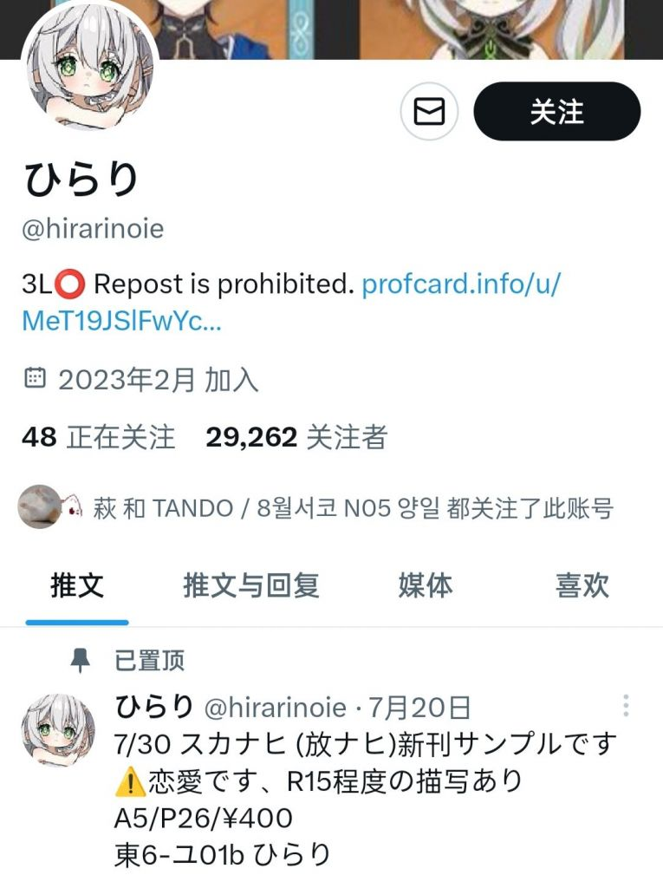
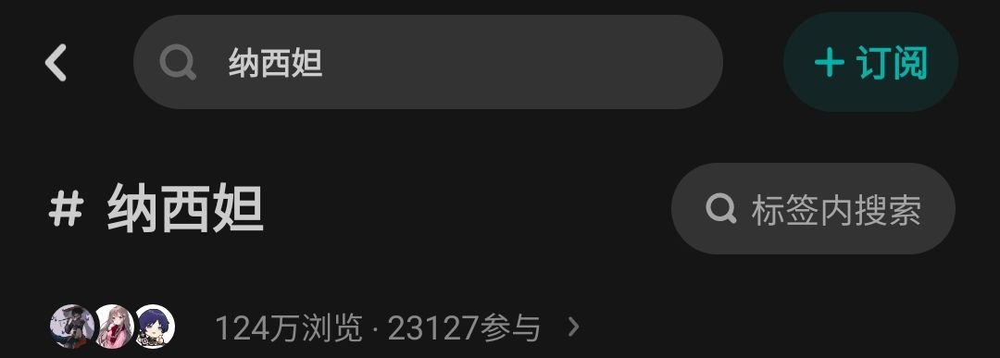
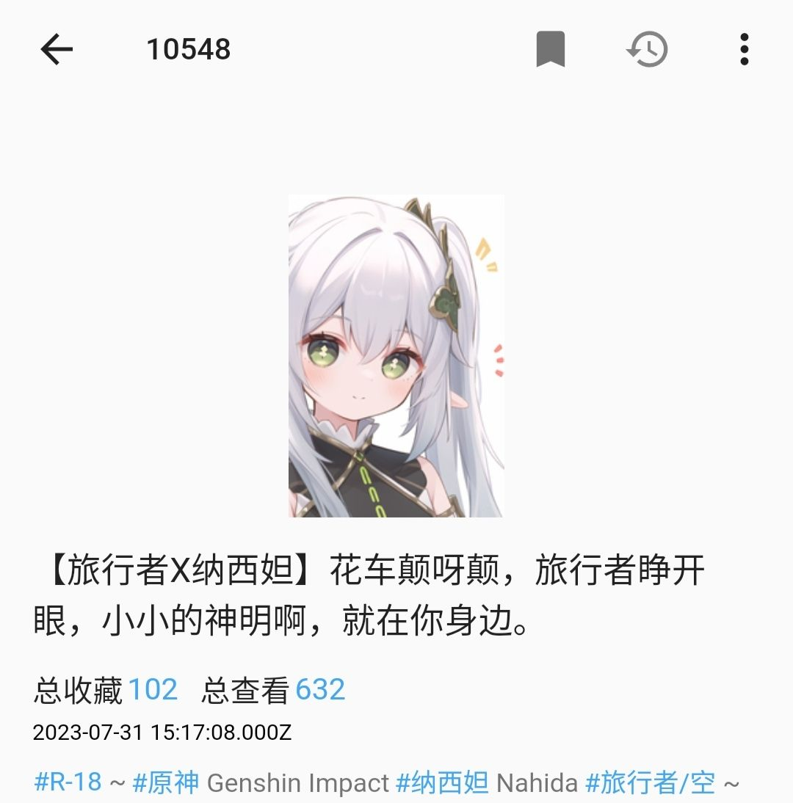
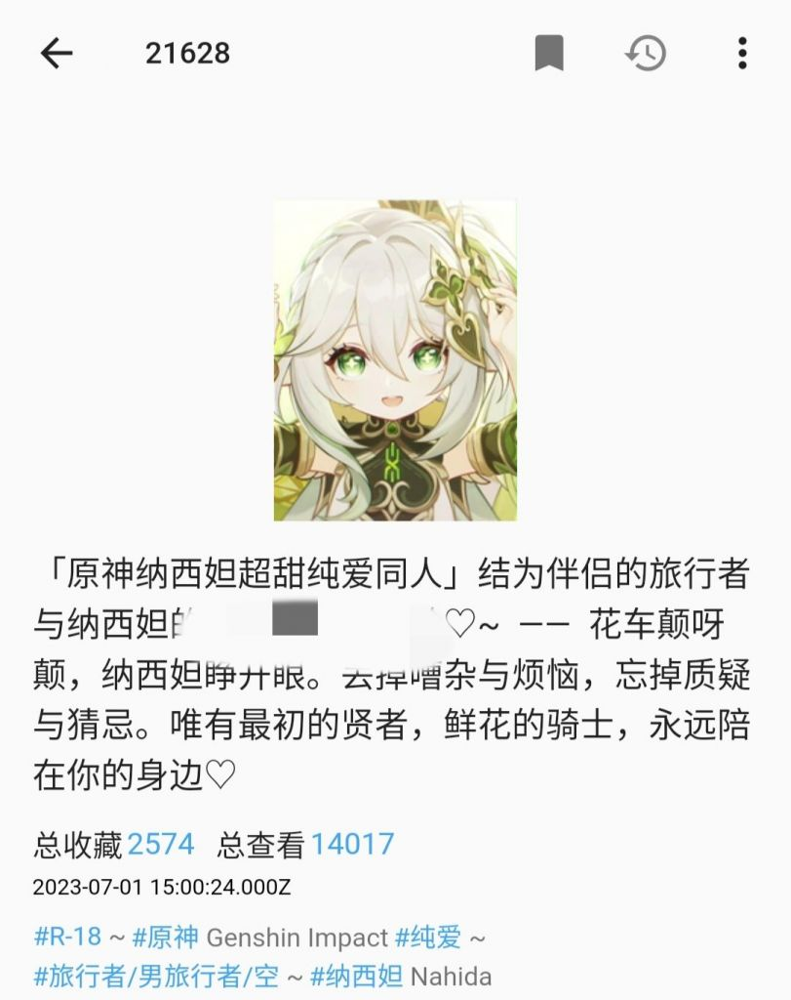

### [不吐不快] 求推荐几篇纳西妲同人文

Made by ngapost2md (c) ludoux [GitHub Repo](https://github.com/ludoux/ngapost2md)

----

##### 0.[0] \<pid:0\> 2023-08-01 12:14:00 by 油门踩到底
任意题材、主题均可
任意cp(包括散草、gb)或者ml或者cb都可以
用来做一些研究，谢谢各位

----

##### 1.[2] \<pid:706216108\> 2023-08-01 12:17:55 by フライア

你要做研究的话就不臊皮了。
可以关注一下这位，真情实感的同人作者。

----

##### 2.[0] \<pid:706216324\> 2023-08-01 12:18:52 by 龙澂
zoe女士的lofter主页里关注了一堆散草同人，建议你好好品鉴一下

----

##### 3.[1] \<pid:706216368\> 2023-08-01 12:19:03 by 大碗番茄炒鸡拌饭
LOF草神热门总榜点只看文字筛选一下翻翻？应该能看出来大众口味，话说草神tag参与量多少啊我还真没注意过

----

##### 4.[0] \<pid:706220681\> 2023-08-01 12:37:27 by 阿猹不吃香菜
>[jump](#pid706216368) 大碗番茄炒鸡拌饭(2023-08-01 12:19) 说: 
>
>LOF草神热门总榜点只看文字筛选一下翻翻？应该能看出来大众口味，话说草神tag参与量多少啊我还真没注意过

两万三

----

##### 5.[0] \<pid:706222687\> 2023-08-01 12:46:28 by 8991aiih
之前在理查复制的文，不知道来源还在不在

<a href="javascript:;" onclick="collapse(this);">+</a>1 ...
-你游历路过某西南大宗门须弥宗，下一代的天骄是一个秀外慧中有慈悲之心的纯洁少女，为人奸计所陷害被囚禁在宗门深处

-你串联当地的朋友将她救出，并且和她一同打败了想害她的黄毛，黄毛修为不如她，不仅喜欢嘴臭阴阳而且在故乡犯下多起命案，流窜到须弥后依旧在残害须弥人，可谓一无是处像个小丑。
但她是有慈悲之心的人，黄毛束手就擒后她登上宗主之位，决定不取黄毛性命，而是由她亲自监视管教，助黄毛修心向善。

-一段时间过后你俩再见，你惊讶地发现黄毛屁事没有活得好好的，也没被关也还有自由。而且她将黄毛收入麾下为她办事，对此她的解释是黄毛身上有不少曾经当坏人时候的价值。而且她安排你去助她一起施展秘法，让世人遗忘黄毛曾经造下的杀孽。

-再过一段时间之后你俩再见，你惊异地发现黄毛竟然在她的安排下加入了须弥宗，摆脱罪人身份，成了内门弟子。对此她的解释是黄毛对于海外奇物风情有独到的见识，须弥宗需要这样的人才。而且黄毛的修行由她作为宗主亲自监督指导。

-再过一段时间须弥宗宗门大比，黄毛代表作为宗主的她也加入大比中。赛后你看着她亲切地笑着称呼黄毛的昵称，而黄毛一副傲娇的表情，百思不得其解。

-须弥宗素有以猫为喻的猫卜之法，她与你历险时曾带你见识过外门的猫卜，她自己更是个中高手。
你以猫为卜想看看到底是怎么回事，发现公猫舔了舔母猫之后骑了上去。

我只能说不管丢到sis还是p站上，润色一下细节都绝对是年度经典，画出来丢去里绅士都是牛头人圣经级别。12+真是限制编剧发挥了，22+才是这段剧情该去的地方。

<a href="javascript:;" onclick="collapse(this);">+</a>2 ...
却说纳兰希妲自登上宗主之位，应下天外来客好好管教国崩之事后，日常处理完宗门事务，便来金缮宫监督雷姓少年修行。

这一日国崩正在宫中打坐，纳兰希妲端坐一旁，眼见宫中无人，唯有窗外蝉鸣，她晃着小脚，甚是无聊。突然发声：你在此金缮宫中日久，未有称呼，不如我就叫你阿帽如何？

国崩只是冷哼一声，并未理睬。

见国崩不理她，纳兰希妲也不生气。而是以法力幻化出形状，玩起了翻花绳。

不一会儿，许是翻花绳也无聊，她又开声道：你说你乃是人造之物，我也无父无母，世间的常人却都是父母所生，这男女之间，却是如何生下儿童？

国崩沉默不语，半晌反问：你贵为须弥之主，人称智慧主，却连这也不知道？

纳兰希妲坦然道：我自幼便被囚于金缮宫中，于世间之事知晓甚少。

国崩又问：你与天外来客相熟，不曾问过他么？

纳兰希妲小脸微红：问过，他说是渡渡鸟会送孩子来，分明是糊弄我。

国崩闻言停下打坐睁开眼，似笑非笑地看着纳兰希妲：我倒是知道男女之间如何生子，你若想知道，我可以教你。

纳兰希妲身为智慧主，求知欲旺盛，闻言大喜，连连催促国崩演示于她。

国崩却道：不急，如你所知，我非凡人，乃是人偶，虽然金刚不坏精力不竭，却无演示所需之物。
我闻须弥之主历来身具伟力，可令枯树发芽，荒地开花。且借你法力一用，使我生出演示所用之物，方可教你。

纳兰希妲晒笑道：这有何难？言毕抬手一指，一道绿光直射国崩眉心，沛然草木之力充盈国崩体内，他控制不住低吼一声，身形已悄然发生变化。

纳兰希妲见之微微皱眉，问道：这是何物。

国崩不答，却是明言：男女之事，乃是世间玄奥，不可轻言。天外来客与你相熟，敷衍于你，也有这一番考虑。今日我教你，当与你约定，却不可对外人说道。

纳兰希妲点点头道：我保证不告诉别人，来吧。

<a href="javascript:;" onclick="collapse(this);">+</a>3 ...
却说自天外来客助纳兰希妲登上宗主之位后，已经过去了一段时间。天外来客忙于寻找胞妹，而须弥宗乃是七大宗之一，事务繁重，纳兰希妲身为宗主也脱不开身，时日一久，二人遍疏于联系，不复此前于须弥城中并肩流连的亲密之举。

这一日金缮宫中来信，智慧主召见天外来客。天外来客赶到金缮宫时，纳兰希妲早已等候多时。

多日不见，她还是当日脱困时的模样，只是曾经懵懂亲昵的神情多了一分沉稳冷淡。天外来客只道是须弥宗中事务繁多，纳兰希妲有所历练，心智成熟。不料却见国崩也在一旁，抱着双臂看着自己冷笑。

此獠狂妄自傲，言语不逊，在稻妻多造杀孽，此前更妄图取纳兰希妲而代之。当日此獠落败，纳兰希妲慈悲心肠，愿意绕此獠一命，由她亲自监管，教导向善。只是以此獠所为，死罪可免，活罪难逃。不知为何出现在此处，而且行动无碍？

天外来客于是问纳兰希妲：他为何在此处？他此前所为种种，好歹也该镇入金缮宫下，何以如常人一般无异？

纳兰希妲见天外来客神色有变，急忙解释道：他教了我很多东西。忽地想起什么，双颊飞红，欲言又止。转而开口又道：总之他身上还有不少邪教的消息，价值非凡。我让他为我做事，也算作为他的过去赎罪。

天外来客待要再问，纳兰希妲却抢过话头去：你不是想寻找胞妹么，我从国崩处知晓一秘法，可以上天入地寻人搜物，所以叫你来金缮宫。现在恰是施展秘法的好时机，过了时辰却难有下次机会了。事不宜迟，你与国崩先前去，多余的问题回来再说。

天外来客无法，只好随国崩离开，只是不知为何，国崩仿佛想起什么可笑地事，呵呵一声乐出声来

<a href="javascript:;" onclick="collapse(this);">+</a>4 ...
自上次秘法出错，寻亲不得，反而使得国崩的过去为秘法所掩盖，天外来客与纳兰希妲为此不欢而散之后，又过了一些时日。

天外来客自忖是否对这娇小的须弥宗主过于严苛了些。她确是一颗慈心不曾改变，犹如皎月，可亲可爱。许是她胸怀善念，心思单纯不曾念人坏处，念及国崩身世复杂，便以须弥宗至宝施此秘法。何况国崩的过去为秘法所改，未必就在她意料之中，万一她确实未想过国崩会利用至宝抹去自身过去呢？自己是否过于多虑了。

思索至此，天外来客便想去金缮宫见见纳兰希妲，为上次的争吵道歉。可惜三番五次，金缮宫却总是大门紧闭，随着纳兰希妲成为宗主的日子渐长，许是她身上宗门的担子越来越重，日渐繁忙，所以往往金缮宫中不见人影。天外来客也只好安慰自己缘分不巧，改日再访。

这一日天外来客再次来到金缮宫外，前几次来金缮宫总是大门紧闭，只听见不知何处的野猫叫的欢畅。今日却是四周寂静，宫门开着。天外来客大喜，推开门去，却见不到纳兰希妲的人影。

正疑惑间，有人呼唤着“阿帽，阿帽”从走廊里过来，定睛一看，原来是纳兰希妲。她见了天外来客，却是一怔，停下来问道：你怎么来了？

天外来客一脸讪讪：上次和你争吵是我不是，我来看看你。又问道：阿帽是谁？你在找他吗？

纳兰希妲展颜一笑道：阿帽就是国崩啊，我见他在金缮宫日久没个称呼，所以给他起了个名字叫阿帽。怎么样？这名字是不是很适合他？

天外来客心中暗觉此举不妥，正待要说，念及自己此来是和纳兰希妲和好的，便话题一转，问道纳兰希妲近日如何，一宗之主是否劳累。

纳兰希妲也招呼天外来客坐下，与他说起宗门中的种种，言谈间二人嫌隙渐消，有说有笑，仿佛回到当初纳兰希妲尚被囚于金缮宫的日子。

话到一半，天外来客还是抛出了疑惑，问道：那日国崩在须弥至宝前突然施法，我不及阻止，让他抹去了自身。我自天外而来，不受此宝影响，尚记得此人，你却是如何想起此人的？

纳兰希妲狡黠一笑，道：须弥宗素有猫卜之法，乃是以猫联通命运，借猫喻人。当日我附身至冬人偶身上，领你游须弥城时曾带你见识过，你可记得？

天外来客略一思索，想起当日确实见过一个占卜师，养着两只灵猫。却又不解道：可这猫卜之法似乎只能占卜，如何能够使人想起不存在的事物？

纳兰希妲嘿嘿一笑，神气道：猫卜之法岂止占卜命运。猫乃是此方天地钟爱之物，不受刀枪，风火不侵。须弥至宝虽可改写历史，却无法影响到猫儿。我为一宗之主，猫卜之术早已炉火纯青。

当日因要动用此宝，未免意外，我借猫存形，将记忆存了下来。所以之后你来金缮宫见我说事情有异，我当时便取回了这段记忆。对了你要看看吗？

天外来客自无不可。于是纳兰希妲施展猫卜之术，将那日存下的记忆展现出来。原来借猫形所存下的竟是个以一只黑猫为主角的童话故事。天外来客见此啧啧称奇，纳兰希妲听得天外来客称赞自己，也不由得高兴起来。

....

二人相谈许久，纳兰希妲乃是一宗之主，不可耽误太多。于是二人在金缮宫门口依依惜别。天外来客看着眼前的少女，心有所感，仿佛回到初次于梦境中见到她的时候，恬静仿佛睡莲，纯洁犹如皎月。想起近日间的种种，一时百感交集，到了嘴边却无法开口，支支吾吾了一会儿，问道：你还要找国崩吗？要不要我帮你找？

纳兰希妲微微一笑，道：不用了，阿帽应该是又溜出去玩儿了，他一会儿自己会回来的。

天外来客闻言点头，转身要走，却又鬼使神差地提起来：对了，说起来我前几次来金缮宫都没碰着你，倒是听见野猫叫得欢，你是养猫了吗？

纳兰希妲小脸一红，低下头小声说：是...是呢，养了几只，他们总是叫得很大声，我还是要学学如何跟小猫相处。

<a href="javascript:;" onclick="collapse(this);">+</a>5 ...
宗门大比结束后，天外来客始终不明白何以纳兰希妲和国崩亲昵如此，连日来浑浑噩噩，就连寻找胞妹之事也不甚上心。想去金缮宫寻纳兰希妲问个清楚，却偏巧几次前去，金缮宫都大门紧闭，纳兰希妲不在宫中，守卫也不知她的踪迹，只有她养的猫儿叫得愈发大声。

这一日天外来客用过早饭，照旧来到须弥城中，一时不知何去何从。见不着纳兰希妲踪影，寻找胞妹一事没了纳兰希妲相助，一时也无甚头绪。他在大巴扎附近闲逛，旧友却也没见着。只是看看这里，问问那里，咖啡馆里听故事，小吃摊边尝个鲜。眼见着日上中天，快到午饭时间。

他正合计去哪家吃饭，望见前方一个小小摊位，正是前日里须弥城中的猫卜师和她的两只灵猫。天外来客心思一动，想到也许可以请她帮忙寻找纳兰希妲，急忙上前去打了招呼。猫卜师雷塔塞端详片刻，认出来者乃是须弥宗的大英雄天外来客，自是好一番招待。

二人叙旧片刻，雷塔塞问道：我听闻您自从助宗主登位后，颇得宗主器重，不知今日来城中，却是有何贵干？

天外来客闻言苦笑一声，暗道得宗主器重的另有其人，却不好为外人道。只好说道：闲来无事，城中闲逛。

见雷塔塞神情疑惑，天外来客晒道：忙里偷闲，不值一提。我记得先生乃是猫卜高手，此前曾经领教过先生的猫卜之术，不知这猫卜之术为何神妙如此？

雷塔塞想起此前为天外来客占卜的乌龙事，却是有些不好意思，道：此方世界并非无人看管。此间天机有命，凡人不可轻窥，一经天道察觉，便会降下灾祸。但猫乃天地钟灵之物，借猫形不仅可以掩人耳目，更能遮蔽天机，不为天道所知。此前为您占卜，便是见一姜黄猫，岁时不侵，乃至千秋万载，故此估错了您的寿元。许是在下学艺不精，请您勿怪。

天外来客闻言暗喜，连连摆手道：无妨无妨，先生技艺未必不精。只是听先生所言，这猫卜之术甚是玄奇，我若想寻人，不知先生可否帮我？

雷塔塞道：倒是可以寻人，只是在下法力有限，若此人不在须弥城中，遍无法寻得消息。先生所寻之人，可在此城中？若是这城中人，只需其人因缘沾染之物，在下便可施法助先生寻人。

天外来客道声稍待，转身离开，不久返回，乃是去寻了那至冬人偶发丝两三根。雷塔塞见此物，更不多言，吩咐天外来客凝神打坐，便掐起法诀，两只灵猫也喵喵叫着绕圈，配合着施起法来。

不一时天外来客两眼一黑，待到缓过神来，已不在须弥城中。定睛一看，方墙圆顶，墙上装饰精美，乃是到了金缮宫内。

只是此间朦朦胧胧，仿佛那日观看纳兰希妲以猫卜之术所存童话，不似在现实中。此时宫门紧闭，四周一片寂静，既无猫声，也无人影。

天外来客正要走动，却发现自己变成了一只猫儿，姜黄毛发。知是法术玄妙，自己身形为猫形掩盖。

只是此术引自己来此，却不见纳兰希妲踪影。见四下无人，天外来客便迈动四足，向殿内走去。

路过两间房间，均未见人影，到第三间门口时天外来客却听到了悉悉索索的声音。他走入房间，只觉床上有甚么东西，猫形矮小，看不真切。眼见此屋乃女子闺阁，床边有一梳妆柜台，便悄然无息地跳了上去。

这一下居高临下，看得真切。原来床上却是一只奶牛花色的母猫，慵懒地趴在床上，一只眼熟的黑猫正在舔舐着母猫。母猫尾巴一摇一晃，形态舒坦，仿佛习以为常。

天外来客见猫儿互相舔毛，想着这也许就是纳兰希妲养的猫儿们了，打算靠上前去看个真切。母猫不知感到了什么，回过头来。

四只猫眼相对，天外来客竟从母猫脸上看出了人一般的惊慌神情。他顿觉不对，这母猫表情太过像人，何况这里是猫卜幻境，人非人，猫非猫，却不是现实。

正要细想，母猫支起上身，抬爪一指。天外来客所见之处绿光大盛，随即浑浑噩噩，思绪犹如溺水一般，却是无法再做多想，本已迈出的前腿也停在半空，忘了接下来该如何动作。

朦胧中只见母猫还欲起身，身后黑猫却是舔舐几下之后骑了上去动作起来，母猫顿时被压在身下，一时顾不得理会其他，只能发出断断续续的欢愉叫声。

...

雷塔塞眼见两炷香过去，天外来客尚未醒来。正暗忖莫非这次施法也出了问题，只见天外来客缓缓睁开了眼，却是双眼迷蒙，仿佛还未回魂。雷塔塞喊了他两声，他也没应。

又过了一会儿，天外来客一个激灵，却是回过神来了。雷塔塞问他可曾寻到所寻之人，天外来客道：倒是到了一处地方，只是记不清了，后来仿佛是见到了猫儿，只是细节一概模糊。

雷塔塞苦笑：猫卜幻境中见了猫儿，正如须弥城中见了人一样，实是对于寻人无用。只得称自己学艺不精，没帮上忙。天外来客连连摆手，也不记得告辞，失魂落魄地寻地吃午饭去了。雷塔塞只道他神志为法术所扰，并未在意。

...

数日过去，这一日天外来客正于住处百无聊赖，有人传信金缮宫召见。他心中大喜，只道终于能再见纳兰希妲，他却是要好好问问她国崩之事。

来到金缮宫中，只见纳兰希妲坐于主座上，国崩侍立身后。纳兰希妲回过头去，正笑着与国崩说着甚么。见天外来客前来，便回过头来起身与他见礼。

天外来客见二人亲昵，心中不悦，正待要开言，纳兰希妲先开口道：前日里宗门大比结束，你我不欢而散。我这几日思索再三，觉得你说的有道理，我对阿帽太过亲近了，有些不成体统，日后我待他会有分寸。我这里向你赔个不是，希望你我二人不至因此生分，能重归旧好。说完深鞠一躬。

天外来客见她言语真挚，神情诚恳，想到她为人纯善慈悲，亲近之举许是不晓得防备恶人，顿时气消了大半，摆手道：也不必如此慎重，我知你素来善心，只是千万记得提防此人。

纳兰希妲见天外来客如此，展颜一笑，道声晓得，坐回位上。又开口问道天外来客近日如何，寻妹一事可有进展。天外来客也讲起日间须弥城中见闻。二人渐渐说笑起来。国崩侍立纳兰希妲身后，也不言语，只是不时冷笑两声。天外来客素知此獠行径如此，并不往心里去。

话到一半，正谈及枫丹情形。纳兰希妲忽然话锋一转，问道：对了，你来我这宫中，可曾见过猫儿？

天外来客见纳兰希妲神情认真，略一思索，虽然来金缮宫常常听见猫叫，却是未曾见过猫影。便答道：不曾。只是与守卫闲聊，守卫常常抱怨宫中猫叫不分昼夜，这却不是猫叫的时节。

言罢一笑，又道：寻常人家里的猫只是到了季节半夜会叫。你这金缮宫中养的猫倒是神异，叫个不停，我也常常听闻。

纳兰希妲舒一口气，如释重负笑道：这却是阿帽在照顾猫儿，他于猫颇有心得，猫儿玩得开心，自然声音大了些。

言罢回过头道：今晚陪猫儿玩耍可要努力哦，阿帽先生。

国崩只是冷哼一声，并不回话。

天外来客只觉莫名其妙，二人似乎在打哑谜，忍不住问道：你们在说甚么陪猫儿玩耍？

纳兰希妲狡黠一笑道：我答应了别人要保密，这次却不能告诉你了。

天外来客见她少女娇态可亲可爱，一时心软，便不再追问下去。

----

##### 6.[0] \<pid:706234055\> 2023-08-01 13:42:01 by shiro_mio
pixiv novel上挺多的，各种类型都有
列举几篇纳西妲x空纯爱文吧 

----

##### 7.[0] \<pid:706242460\> 2023-08-01 14:25:55 by 雏幻
刺猬猫的《她们都想和我元素反应》
现代男和草交换身体了，然后从璃月开始，然后稻妻，收妹子中
现在到须弥了，我在等怎么处理sb再订阅

