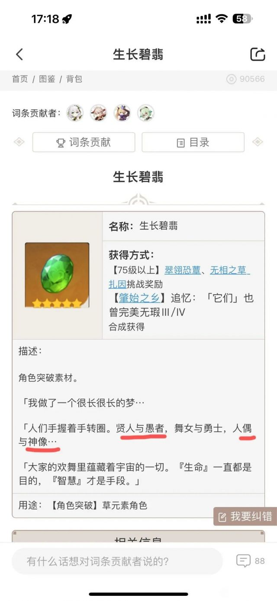
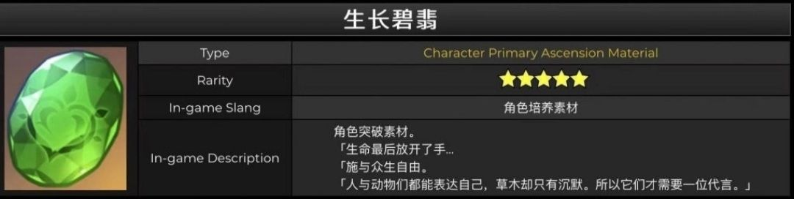
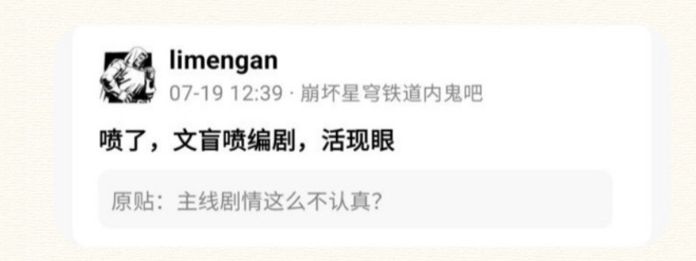

### [不吐不快]草石头是不是预示了散草99

Made by ngapost2md (c) ludoux [GitHub Repo](https://github.com/ludoux/ngapost2md)

----

##### 0.[1] \<pid:0\> 2023-08-01 12:58:24 by 丹阳子-

----

##### 1.[0] \<pid:706225936\> 2023-08-01 13:01:23 by 就随便起了个名字
我记得以前这个石头的文案好像不是这样子的，世界树岁月史树发动把这文案也改了吗？

----

##### 2.[0] \<pid:706226124\> 2023-08-01 13:02:22 by rindunica
你发现晚了，早就被挨个考据然后超极巨散草锁死了

----

##### 3.[3] \<pid:706226170\> 2023-08-01 13:02:33 by 普露璐特
散草99直接是世界观的一部分了，而海卡只有你旅行者知道。

----

##### 4.[0] \<pid:706226503\> 2023-08-01 13:04:13 by 不想上班999号
每次看都觉得被原文案吊打

----

##### 5.[1] \<pid:706226772\> 2023-08-01 13:05:39 by AvengerS5990
99？
69！

----

##### 6.[0] \<pid:706226817\> 2023-08-01 13:05:51 by 无意识koishi
sb不能没有典王 
就像典王不能缺少sb一样
这些就是原神底层代码啦

----

##### 7.[0] \<pid:706226914\> 2023-08-01 13:06:18 by 落阳晨曦
你是第一次来里板吗，醒醒散草99已经更新到ep了

----

##### 8.[0] \<pid:706227441\> 2023-08-01 13:09:03 by 纠缠的狗
>[jump](#pid706226772) AvengerS5990(2023-08-01 13:05) 说: 
>
>99？
>69！

你tm……(?ò ? ó?)卧槽！

----

##### 10.[3] \<pid:706227980\> 2023-08-01 13:11:36 by 大碗番茄炒鸡拌饭
>[jump](#pid706225936) 就随便起了个名字(2023-08-01 13:01) 说: 
>
>我记得以前这个石头的文案好像不是这样子的，世界树岁月史树发动把这文案也改了吗？

原先的是这个
上线前改成主楼的版本了，mhy为了散草包了这顿饺子太细了太刀了

----

##### 11.[0] \<pid:706229507\> 2023-08-01 13:19:14 by 就随便起了个名字
>[jump](#pid706227980) 大碗番茄炒鸡拌饭(2023-08-01 13:11) 说: 
>
>原先的是这个
>上线前改成主楼的版本了，mhy为了散草包了这顿饺子太细了太刀了

太细了我哭死，磕到真的了
散草99

----

##### 12.[0] \<pid:706229886\> 2023-08-01 13:20:56 by 涨幅为困难
这个新的真的一股子小家子气，我还是喜欢草木代言那一版

----

##### 13.[2] \<pid:706230516\> 2023-08-01 13:23:56 by 杀菌消毒
我现在才注意到，草石头中间是不是个淫纹啊

----

##### 14.[0] \<pid:706230757\> 2023-08-01 13:25:10 by 迪卢克激推人
有没有老哥解释一下贤人和愚者是啥啊

----

##### 15.[0] \<pid:706230844\> 2023-08-01 13:25:35 by 大碗番茄炒鸡拌饭
>[jump](#pid706230516) 杀菌消毒(2023-08-01 13:23) 说: 
>
>我现在才注意到，草石头中间是不是个淫纹啊

你要这么一说，其实草元素一直被人说像()()来着这也是你们散草play的一环吗

----

##### 16.[0] \<pid:706231316\> 2023-08-01 13:27:52 by tmp216
细

----

##### 17.[0] \<pid:706233992\> 2023-08-01 13:41:44 by 漫松冰碴

----

##### 18.[0] \<pid:706237903\> 2023-08-01 14:02:33 by 超定归约律
这个老早就锤了
我比较好奇前面俩对是谁，现在只有舞女指妮露是明确的吧，打算给妮露也拉个cp？

----

##### 19.[0] \<pid:706238272\> 2023-08-01 14:04:27 by 再也不随意注销了
贤人和愚者不会是海卡吧
舞女和勇士是谁？反正不会是黄毛吧

----

##### 20.[0] \<pid:706238380\> 2023-08-01 14:05:05 by 红豆薏米汤圆
我每次看到这句文案的时候就想吐槽 神像就不提了 人偶凭什么能跟拯救须弥的舞女和勇士相提并论

----

##### 21.[0] \<pid:706240573\> 2023-08-01 14:16:17 by c1351773467
更可笑的是同为人偶的凯瑟琳被某神像用完之后就扔了，并且某神像什么表示也没有，人偶也是要打引号特别标注的

----

##### 22.[1] \<pid:706240883\> 2023-08-01 14:17:47 by 海上飘丝瓜
>[jump](#pid706238272) 再也不随意注销了(2023-08-01 14:04) 说: 
>
>贤人和愚者不会是海卡吧
>舞女和勇士是谁？反正不会是黄毛吧

卡维论设定和“愚者”毫无关系吧，大建筑师高材生，而且他和主线故事也没关系

我认为愚者是大贤者。

或者更加抽象和辩证的意思，比如大贤者等人认为另立新神是智慧的选择，但实际上他们才是愚钝的。

比如雨林人自以为智慧，因此轻视愚钝的沙漠人，但沙漠人有沙漠人的智慧，雨林人有雨林人的愚钝。

----

##### 23.[0] \<pid:706273165\> 2023-08-01 16:45:33 by bingximofa1998
>[jump](#pid706240883) 海上飘丝瓜(2023-08-01 14:17) 说: 
>
>卡维论设定和“愚者”毫无关系吧，大建筑师高材生，而且他和主线故事也没关系
>
>我认为愚者是大贤者，贤人是海森，毕竟二人剧情里互相摆对方一道，大贤者用神明知识暗算海森被反杀，大贤者自以为自己比海森聪明，结果中了海森的计
>
>或者更加抽象和辩证的意思，比如大贤者等人认为另立新神是智慧的选择，但实际上他们才是愚钝的。
>
>比如雨林人自以为智慧，因此轻视愚钝的沙漠人，但沙漠人有沙漠人的智慧，雨林人有雨林人的愚钝。

某四星这一眼空降二眼倒贴蹭啥啊……

----

##### 24.[0] \<pid:706361882\> 2023-08-02 00:05:34 by Kaleidoscope2
>[jump](#pid706240883) 海上飘丝瓜(2023-08-01 14:17) 说: 
>
>卡维论设定和“愚者”毫无关系吧，大建筑师高材生，而且他和主线故事也没关系
>
>我认为愚者是大贤者，贤人是海森，毕竟二人剧情里互相摆对方一道，大贤者用神明知识暗算海森被反杀，大贤者自以为自己比海森聪明，结果中了海森的计
>
>或者更加抽象和辩证的意思，比如大贤者等人认为另立新神是智慧的选择，但实际上他们才是愚钝的。
>
>比如雨林人自以为智慧，因此轻视愚钝的沙漠人，但沙漠人有沙漠人的智慧，雨林人有雨林人的愚钝。

不不不，某些文化背景里愚者是个好词
我知道塔罗牌里有个愚者牌，也是二次元常用的标签。卡维这种善良并且为了善良而积极行动不记得失的，应该是能对上愚者这个称号的。JOJO3里伊奇就是愚者牌，女神异闻录有一部主角也是愚者牌，隔壁崩三崩铁，愚者都是奥拓(积极部分)。愚者这里就是说的卡维，并且是褒义

----

##### 25.[0] \<pid:706362344\> 2023-08-02 00:08:52 by nonaligned9888
原本的立意比现在这个高多了
现在的编剧改得真的一塌糊涂

----

##### 26.[0] \<pid:706364840\> 2023-08-02 00:26:07 by 无涯本涯
这里还是在说主线剧情吧，贤人与愚者对应阿扎尔党和愚人众，舞女与勇士对应救神小队初始成员和后期加入的妮露，人偶与神像对应散草99

----

##### 27.[0] \<pid:706386774\> 2023-08-02 07:35:22 by 海上飘丝瓜
>[jump](#pid706361882) Kaleidoscope2(2023-08-02 00:05) 说: 
>
>不不不，某些文化背景里愚者是个好词
>我知道塔罗牌里有个愚者牌，也是二次元常用的标签。卡维这种善良并且为了善良而积极行动不记得失的，应该是能对上愚者这个称号的。JOJO3里伊奇就是愚者牌，女神异闻录有一部主角也是愚者牌，隔壁崩三崩铁，愚者都是奥拓(积极部分)。愚者这里就是说的卡维，并且是褒义

那应该至少对应的“贤人”也用塔罗牌的意思吧，比如“愚者与隐士”

相应后面两组也可以用塔罗解释
“女祭司与战车”
“月亮与命运之轮”

不然六个词，五个和塔罗毫无关系，就其中一个撞词然后说在用典塔罗0号牌，未免有点过度解读了。

----

##### 28.[0] \<pid:706387555\> 2023-08-02 07:44:04 by Elleece
愚人和贤者就是字面意义的阿扎尔个多托雷合作吧？多托雷不也是须弥出身的学者嘛，这么一看说不定可以和大贤者互为表里呢

论有没有可能阿扎尔的原型就是干“好事”的多托雷

----

##### 29.[0] \<pid:706388233\> 2023-08-02 07:50:27 by Kaleidoscope2
>[jump](#pid706386774) 海上飘丝瓜(2023-08-02 07:35) 说: 
>
>那应该至少对应的“贤人”也用塔罗牌系统的意思吧，比如“愚者与隐士”，隐士在小阿尔卡纳里代表智慧、理性、切中肯綮与孤独，完美描述艾尔海森的状态。
>
>相应后面两组角色也应该用塔罗的词来描述，
>“女祭司与战车”，妮露看破梦境的内心力量与赛诺打大贤者速战速决的胜利
>“月亮与命运之轮”内心存在猜疑不安的“月亮”小草神，和命运变化被从世界树删除的流浪者
>
>不然六个词连用，五个和塔罗系统根本毫无关系，就其中一个愚者撞词，然后说在用典塔罗0号愚者牌夸卡维，
>
>咋不说“舞女与勇士”里的勇士是在说NBA金州勇士队[

我又没说这里的愚者就是塔罗牌愚者，我只是说米家用这个愚者不是贬义，隔壁奥拓剧情里给的评价就是愚者，意思指向基本和塔罗牌愚者一致，换言之米家词典里愚者一词已经包含了正面用法的含义。
你要联系上下文，那好啊，神像和人偶，舞者和勇士，哪一个是贬低性的？为什么贤者这一组就要拉一个被批判的角色？
自己多理解理解，滑什么滑

----

##### 30.[0] \<pid:706388725\> 2023-08-02 07:54:55 by 雷军单推人
看楼上诸位还在争论设定
这里送上猛干金句给大家

----

##### 31.[0] \<pid:706391279\> 2023-08-02 08:14:46 by 海上飘丝瓜
>[jump](#pid706388233) Kaleidoscope2(2023-08-02 07:50) 说: 
>
>我又没说这里的愚者就是塔罗牌愚者，我只是说米家用这个愚者不是贬义，隔壁奥拓剧情里给的评价就是愚者，意思指向基本和塔罗牌愚者一致，换言之至少米家词典里愚者一词已经包含了正面用法的含义。愚者是否在塔罗牌之前就包含正面含义我不清楚，我猜是有的。
>你要联系上下文，那好啊，神像和人偶，舞者和勇士，哪一个是贬低性的？为什么贤者这一组就要拉一个被批判的角色？拉个阿扎尔或者多托雷来跳舞是吧，真晦气。
>自己多理解理解，滑什么滑，照你这么滑那是不是卡莲还要多个标签？女祭司卡莲？不然奥拓和卡莲对不上啊？

米家词典

----

##### 32.[0] \<pid:706422871\> 2023-08-02 10:39:52 by 四洲鱼蛋
>[jump](#pid706387555) Elleece(2023-08-02 07:44) 说: 
>
>愚人和贤者就是字面意义的阿扎尔和多托雷合作吧？多托雷不也是须弥出身的学者嘛，这么一看说不定可以和大贤者互为表里呢
>
>论有没有可能阿扎尔的原型就是遵纪守法干“好事”的多托雷

妄图造神的阿扎尔哪里都算不上遵纪守法。

----

##### 33.[0] \<pid:706428454\> 2023-08-02 11:01:05 by 逢河牧野0v0
>[jump](#pid706388233) Kaleidoscope2(2023-08-02 07:50) 说: 
>
>我又没说这里的愚者就是塔罗牌愚者，我只是说米家用这个愚者不是贬义，隔壁奥拓剧情里给的评价就是愚者，意思指向基本和塔罗牌愚者一致，换言之至少米家词典里愚者一词已经包含了正面用法的含义。愚者是否在塔罗牌之前就包含正面含义我不清楚，我猜是有的。
>你要联系上下文，那好啊，神像和人偶，舞者和勇士，哪一个是贬低性的？为什么贤者这一组就要拉一个被批判的角色？拉个阿扎尔或者多托雷来跳舞是吧，真晦气。
>自己多理解理解，滑什么滑，照你这么滑那是不是卡莲还要多个标签？女祭司卡莲？不然奥拓和卡莲对不上啊？

你有点好笑还有乐子吗，再来点

----

##### 34.[0] \<pid:706450385\> 2023-08-02 12:27:14 by Kaleidoscope2
>[jump](#pid706391279) 海上飘丝瓜(2023-08-02 08:14) 说: 
>
>米家词典

他们就喜欢这么说话，我有什么办法？
还是说你觉得这里是阿扎尔和艾尔海森手拉手呢？大聪明？

