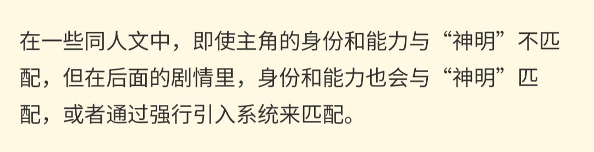
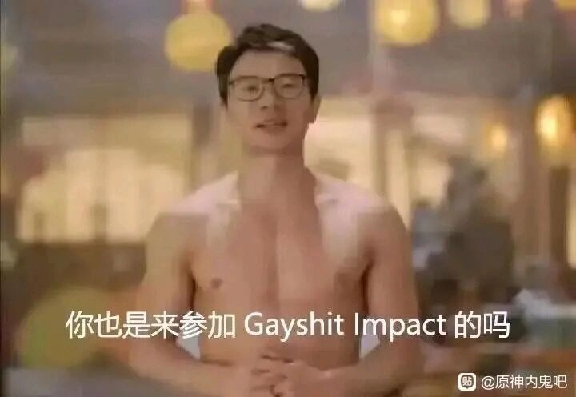

### [不吐不快] 发现在一些《原神》同人文中，主角与“神明”谈恋爱时的身份真的很重要。

Made by ngapost2md (c) ludoux [GitHub Repo](https://github.com/ludoux/ngapost2md)

----

##### 0.[0] \<pid:0\> 2023-08-01 13:08:29 by GT7896
在一些《原神》同人文中，我们经常看到主角与“神明”展开浪漫爱情故事，然而，仔细思考后会发现一个悲观的现实：原神世界同样讲究门当户对，特别是当涉及到与“神明”谈恋爱这一情节时，身份真的很重要。

在一些同人文中，即使主角的身份和能力与“神明”不匹配，但在后面的剧情里，身份和能力也会与“神明”匹配，或者通过强行引入系统来匹配。

这一现象其实并不难理解。如果主角没有足够的身份和能力，主角可能连参与到剧情中的机会都没有，甚至无法在提瓦特自保。更别说与自机角色交流和谈恋爱了。

一般穿越者如果没有神之眼，又没有系统，却想要参与到主线剧情里，或许下场跟哲平一样吧，不如学习崩铁主角留在空间站做普通人，等旅行者推进剧情就好了。

----

##### 1.[2] \<pid:706231196\> 2023-08-01 13:27:18 by Fablet
人类的底蕴.jpg
我们不是筛选神选者的残渣.jpg
所以说趁早搞清楚：现在就是仙偶剧逻辑，天下苍生为神魔精怪的恋爱铺路那一套。

----

##### 2.[0] \<pid:706231730\> 2023-08-01 13:30:07 by 今锁朱楼
我倒是见过没有神之眼的普通人主角和自机谈恋爱的同人文，但那种文主线就是恋爱，也没有什么其他剧情了。

----

##### 3.[2] \<pid:706231746\> 2023-08-01 13:30:12 by 转生能成功吗
写不出高贵的人格，那就只能写高贵的身份。如果连高贵的身份都没有了，“神明”凭什么要看上这个主角

----

##### 4.[0] \<pid:706234695\> 2023-08-01 13:45:29 by 夭叶舒华
所以现在神之眼的发放逻辑就是个迷啊，完全不知道这些角色为什么能有神之眼。

----

##### 5.[0] \<pid:706234811\> 2023-08-01 13:46:09 by 透明级
原的同人我从没看过，不清楚啥情况，不过我因缘巧合在一个推书区见过两本，听评论的说法确实都是很强行地将能力和神明匹配上了。
防止引战(~~万一真有人看过这两本书呢~~)就不说到底是哪个神了
一本和神cp，但主角原型为奥托。内容上主角比神还足智多谋，聪明绝顶。先不论奥托和神到底谁更聪明的问题，我在得知这一原型后就已经陷入茫然()评论区有差评认为作者把神写成了主角的垫子(
另一本也是和神cp，但主角比神还有魅力，堪称人见人爱。在评论区看到了差评说人物塑造根本没看出来到底哪里比神更有魅力的(
总之看完评论区非常害怕()不过也不排除本体也许并没有那么糟糕的可能

----

##### 6.[1] \<pid:706235040\> 2023-08-01 13:47:22 by 喵西斯
神活了那么久，什么奇形怪状的人类没见过
套皮霸总小白文罢了，“女人，你引起了我的注意”

----

##### 7.[0] \<pid:706235430\> 2023-08-01 13:49:22 by 残血之殇
就是比较俗套嘛

----

##### 8.[0] \<pid:706236896\> 2023-08-01 13:57:10 by 辛卫芦戊陶白
种姓制游戏说这些

----

##### 9.[0] \<pid:706237075\> 2023-08-01 13:58:08 by 无料通贩商
不是俗套，是封建

----

##### 10.[0] \<pid:706237939\> 2023-08-01 14:02:44 by 云恭
这不是因为很多人喜欢b格吗，其实和神不神关系也不大，盐神你觉得有多少人希望自推或者同人里自己喜欢的那位是这个模版的

你看论坛讨论到人类底蕴，最后要求的也是希望那些角色战斗力堪比神，否则无法证明人类可比神明，但是永远是某个单体实力堪比而不是真想看什么众志成城，本质最后还是大家都想要“强”的，不管是剧情强还是别的强度，还有什么好纠结的，实话并没有那么多人真想要“普普通通xx角色”

----

##### 11.[0] \<pid:706238589\> 2023-08-01 14:06:10 by narozx
但是门当户对的本质逻辑没有什么大问题啊哪怕是想要跟刻晴甘雨这样的人谈恋爱，那也得是年轻优秀的人才吧，还是说你想车的是人的底蕴？

----

##### 12.[0] \<pid:706240570\> 2023-08-01 14:16:15 by 苹果红茶
寿命论还是很合理的。
假如主角是个普通人，短生种，那就算再怎么风华绝代聪颖无伦，早晚有一天也是要给往生堂提供业绩的，那长生的一方是看开了好还是没看开呢？
要是虽然痛苦却看开了，那难免会有人觉得剧情不感人，长生种太冷漠淡定，短生种对长生种不够特殊，不符合她们心中绝美爱情的定义。
要是看不开，沉浸在悲伤之中，或者为了复活爱人而做出啥不好的事情来，又会让人觉得low。
要是神想方设法让对方也变成长生种，那还是让人觉得神很low。
要是神为了对方殉情……
总之，把主角写成和神门当户对，确实是一种讨巧的方式，避免创作过程中出现某些问题。

当然，不是说不门当户对就不能和神谈情说爱了，只是很多作者都没有能力写好这样的感情罢了。

----

##### 13.[0] \<pid:706241388\> 2023-08-01 14:20:17 by MemoriesHesin
原神有能看的同人吗？但凡我刷到的全是二十年前无脑文的套路

----

##### 14.[0] \<pid:706241825\> 2023-08-01 14:22:37 by 离去的脚步声
我的评价是 那种拿别人世界观写自己原创主角yy同人的

拿着别人的东西满足自己低级幻想，还不如李猛干呢

----

##### 15.[0] \<pid:706242444\> 2023-08-01 14:25:50 by 星星鬼鬼会飞
这段激起一些远古同人文回忆

----

##### 16.[0] \<pid:706244500\> 2023-08-01 14:35:25 by 卡普琪琪3
>[jump](#pid706241825) 离去的脚步声(2023-08-01 14:22)说:
>我的评价是 那种拿别人世界观写自己狗屁原创主角垃圾同人的  这种踩着别人作品来满足自己低级幻想的乐色，还不如李猛干呢

按照我对李猛干的想象，他绝对干过这种事，所以大家都差不多

----

##### 17.[0] \<pid:706247691\> 2023-08-01 14:51:10 by 有梦想的非酋
不然神明凭什么喜欢上你认真地说，主角没啥身份能力，和神明谈恋爱都说服不了观众，也就是yy文，如果作者的笔力能写出灵魂如太阳般闪耀的主角，那主角没身份其实也可以，写内在美，但是这对作者要求很高，需要他真的能写出让观众真的觉得有内在美的主角，而不是给个设定再让其他角色吹捧两句就可以了的。本质上，主角的身份(写不出内在美只能写外在因素了)与神明匹配，是为了说服观众，让观众觉得这个谈恋爱发生的相对合理，不然要么神明很掉价，要么就是文风就是yy文，太离谱了观众看不下去，缺乏沉浸感

----

##### 18.[0] \<pid:706247888\> 2023-08-01 14:52:06 by 李孟安的老攻
你说得对，奖励你参加gayshit impart

----

##### 18.[0] \<pid:706247888\> 2023-08-01 14:52:06 by 李孟安的老攻
抱歉回复错了，编辑一下

----

##### 19.[0] \<pid:706255254\> 2023-08-01 15:26:45 by 纠缠的狗
>[jump](#pid706231730) 今锁朱楼(2023-08-01 13:30) 说: 
>
>我倒是见过没有神之眼的普通人主角和自机谈恋爱的同人文，但那种文主线就是恋爱，也没有什么其他剧情了。

确实，说起来蛮抑智的吧

----

##### 20.[0] \<pid:706261331\> 2023-08-01 15:53:48 by Amklein
多少有点废话，主角之所以是主角，就决定了他们的不平凡，除非你看的是日常番。顺便我们本人可能普通，但旅行者和隔壁星核精可都算不上路人背景。

