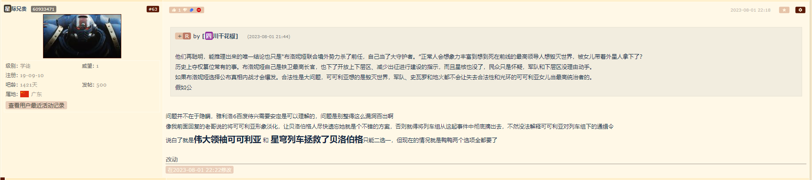

### [不吐不快] 为什么散兵草神爷派蒙一致选择不公开真相？

Made by ngapost2md (c) ludoux [GitHub Repo](https://github.com/ludoux/ngapost2md)

----

##### 0.[0] \<pid:0\> 2023-08-01 15:20:13 by lym9494
散兵撞树一事，就目前剧情里的样子应该只有散兵本人、纳西妲、爷和派蒙四人知晓。
先说散兵，既然散兵有意赎罪，为什么连自己有什么罪都不能说出来？算了这个角色的剧情本来就那啥，不多说了。
再说纳西妲，身为世界树的管理员，现在发现树被修改，而自己手上也有能还原真相的童话，为什么不改回去？如果是怕世界树改回去容易坏，那直接把真相讲出来也可以吧，就算没有证据，身为智慧之神说的话应该很多人愿意考虑考虑吧。如果是为了让散兵成为暗中助力而掩藏真相，那纳西妲就配不上慈爱之神的说法了。再说了为什么一定要暗中的助力，不能光明正大的助力吗？
还有爷和派蒙，一路几国过来，爷也算是重情重义、善良公正之人，派蒙在这方面也不差，这么重要的事情，为什么都不讲出来，好歹跟神里家、枫原家的后人讲讲。白鹭公主对爷一片真心，万叶也算生死之交了，都不值得换一句真相吗？散兵的制造者雷神更应该知晓自己当初做错选择的后果。如果说大慈树王修改世界树那次，因为涉及禁忌知识不能讲出来，散兵撞树这次又有什么理由？就算爷讲出来是空口无凭，考虑到爷的身份，万叶他们应该也会严肃对待爷说的话吧。再说了，听者信不信是一回事，你讲不讲是另一回事啊！
总结：也就你这种剧情党觉得重要了，玩原神玩的，尖叫抓挠吧。

----

##### 1.[0] \<pid:706254641\> 2023-08-01 15:23:47 by 科莱恩，克怂
反正哪怕抛开sb对于平民的伤害(汝等贱命也配和自机入池角色比？)
只看自机角色。
就凭旅行者和万叶神里家的关系
至少和这俩说一声真相吧，你看mhy写出来的双子是个什么玩意儿

----

##### 2.[1] \<pid:706255162\> 2023-08-01 15:26:21 by scoutqq
看到你这才想起来,铁的贝洛伯格好像也是给了俩废物选项然后大守护者拍板掩盖真相,可能阿米真的很爱这个戏码吧

----

##### 4.[0] \<pid:706255340\> 2023-08-01 15:27:08 by 大碗番茄炒鸡拌饭
因为都被编剧夺舍了，你见过左手举报右手的吗

----

##### 5.[0] \<pid:706255657\> 2023-08-01 15:28:40 by _Aheng
在提瓦特因为你被禁言了，所以没有言论发表的权利

----

##### 6.[1] \<pid:706255856\> 2023-08-01 15:29:42 by 我冲我自己
因为被编剧夺舍了

----

##### 7.[0] \<pid:706256043\> 2023-08-01 15:30:32 by Inquisit
被猛干夺舍

----

##### 9.[0] \<pid:706256482\> 2023-08-01 15:32:44 by EIVAAAA
因为李猛干就想看你玩家被堵嘴什么也做不了的抓耳挠腮模样呢

----

##### 10.[1] \<pid:706258839\> 2023-08-01 15:43:21 by 云老王协会
>[jump](#pid706256466) 镀金牌咖啡(2023-08-01 15:32) 说: 
>
>不太一样，可可丽亚是大守护者，公布真相之后会造成社会不稳定，对于贝洛伯格未来发展没有什么实际意义；并且当事人可可丽亚最后死了，保留真相主要是为了不让布洛尼亚被清算，毕竟布洛尼亚是一个正派人物而且和主角还有交情。
>
>而原这边，隐瞒的纯纯是伞兵的私仇，除了包庇罪犯想不出别的更好的词来形容；以及最最关键的一点，当事人，即加害者本人还在逍遥法外，甚至在须弥吃喝玩乐

这不挺神似的吗，隔壁也没给下层区青蒜上层区人上人的机会啊，这么多年的罪白遭了，板鸭不也是扛着正义的大旗实则当可可利亚压迫下层区的帮凶？她也没付出啥代价啊，还喜提一个希儿，除了主观上不是故意的之外，这不已经接近一比一复刻了

----

##### 11.[0] \<pid:706259622\> 2023-08-01 15:46:34 by Cloudrapid133
黄毛惨遭夺舍罢了，等太子下次出演雷五肥皂剧第二季时再掉下鳄鱼的眼泪

----

##### 12.[0] \<pid:706259953\> 2023-08-01 15:47:56 by mie001
>[jump](#pid706255162) scoutqq(2023-08-01 15:26)说:
>[s:ac:哭笑]看到你这才想起来,铁的贝洛伯格好像也是给了俩废物选项然后大守护者拍板掩盖真相,可能阿米真的很爱这个戏码吧

贝勒伯是真有设定去圆，毕竟信仰之力。这里其实更接近稻妻的“影会犯错，但是将军永远不会犯错”
太子的真相的重要性？目前来说是0

----

##### 13.[0] \<pid:706260340\> 2023-08-01 15:49:39 by 纠缠的狗
>[jump](#pid0) lym9494(2023-08-01 15:20) 说: 
>
>散兵撞树一事，就目前剧情里的样子应该只有散兵本人、纳西妲、爷和派蒙四人知晓。
>先说散兵，既然散兵有意赎罪，为什么连自己有什么罪都不能说出来？算了这个角色的剧情本来就那啥，不多说了。
>再说纳西妲，身为世界树的管理员，现在发现树被修改，而自己手上也有能还原真相的童话，为什么不改回去？如果是怕世界树改回去容易坏，那直接把真相讲出来也可以吧，就算没有证据，身为智慧之神说的话应该很多人愿意考虑考虑吧。如果是为了让散兵成为暗中助力而掩藏真相，那纳西妲就配不上慈爱之神的说法了。再说了为什么一定要暗中的助力，不

毕竟是夫妻嘛，散草九九

----

##### 15.[0] \<pid:706262098\> 2023-08-01 15:57:11 by 一念の差
>[jump](#pid706256466) 镀金牌咖啡(2023-08-01 15:32) 说: 
>
>不太一样，可可丽亚是大守护者，公布真相之后会造成社会不稳定，对于贝洛伯格未来发展没有什么实际意义；并且当事人可可丽亚最后死了，保留真相主要是为了不让布洛尼亚被清算，毕竟布洛尼亚是一个正派人物而且和主角还有交情。
>
>而原这边，隐瞒的纯纯是伞兵的私仇，除了包庇罪犯想不出别的更好的词来形容；以及最最关键的一点，当事人，即加害者本人还在逍遥法外，甚至在须弥吃喝玩乐

造成社会不稳定
哈哈哈，皇帝和太子一起出去，回来太子说皇帝为国捐躯了，哈哈哈

----

##### 16.[0] \<pid:706263699\> 2023-08-01 16:04:08 by 绯弹的亚里亚1
>[jump](#pid706262098) 一念の差(2023-08-01 15:57) 说: 
>
>造成社会不稳定
>哈哈哈，皇帝和太子一起出去，回来太子说皇帝为国捐躯了，哈哈哈

雅利洛比较难蚌的一点就是这个要为了保持安稳吧，本来整个王道的热血故事结局唐突转进现实，不是说现实向不好，但这么搞得现实不完全现实(太子和皇帝以及外来者一块去了个地方，回来太子说皇帝为国捐躯了，贵族要搞事还要考虑你干的好吗)，王道不完全王道，就不上不下卡那了，而且看博物馆剧情，我真担心布洛妮娅会在任期里把可可利亚彻底洗白成冰清玉洁的明君

----

##### 17.[0] \<pid:706263845\> 2023-08-01 16:04:48 by 今锁朱楼
我之前在某个帖子底下的评论。

所以我当时过剧情最恶心的点在于，面对你大可以告诉他们 那句话，旅行者居然就那么应下来了且一点反应都没有。
救命之恩的万叶，分享心事与秘密的绫华，面对稻妻那些有生死之交的朋友们的仇人，旅行者连嘲讽一句都做不到吗？
从那以后我就再也代入不了这个角色了。

----

##### 18.[0] \<pid:706263998\> 2023-08-01 16:05:27 by 小kotomi
黄毛摄像头还想处罚编剧亲爹

----

##### 19.[0] \<pid:706264650\> 2023-08-01 16:08:52 by 浮士德噩梦
铁那个是合逻辑的，散兵这个纯SB剧情

----

##### 20.[1] \<pid:706264938\> 2023-08-01 16:10:22 by 镀金牌咖啡
>[jump](#pid706262098) 一念の差(2023-08-01 15:57) 说: 
>
>造成社会不稳定
>哈哈哈，皇帝和太子一起出去，回来太子说皇帝为国捐躯了，哈哈哈

你说的这种桥段不是挺多的，可以不喜欢这种处理，但至少逻辑是顺的

而原神这个剧情是皇太子力保下敌国刺客并且封了大内总管，还大手一挥往事既不追究。除非两人有点内啥，不然连逻辑都不通了。

----

##### 21.[0] \<pid:706265606\> 2023-08-01 16:13:29 by D_终于考好了
铁还能说一句可能主角本来对这个地方没啥感情，多一事不如少一事
但是原这里，我和万叶神里总归有感情的吧

----

##### 22.[0] \<pid:706265764\> 2023-08-01 16:14:13 by 逆空空空空空_
分清楚，是编剧隐瞒真相，不是角色，按照黄毛爱管闲事又某种程度上谨慎的性格不给其他好脸色看转身摇人才正常，派蒙这喜欢损人的大嘴巴也早该说漏了，再不济也得半夜三更跟旅行者推心置腹聊一聊

----

##### 23.[0] \<pid:706266758\> 2023-08-01 16:18:33 by 扶光む
>[jump](#pid706255162) scoutqq(2023-08-01 15:26) 说: 
>
>看到你这才想起来,铁的贝洛伯格好像也是给了俩废物选项然后大守护者拍板掩盖真相,可能阿米真的很爱这个戏码吧

贝洛伯格那个可可利亚好歹前期执政时是有功绩的，像是之后剑走偏锋了，勉强可以说没有功劳也有苦劳，颇有人都死了，就不再计较犯下的错的味道。
散兵：因为我朋友死了，我遭受了背叛，所以我要报复无关的刀匠；因为我认为的妈对我不管不顾，所以我要报复她手下的刀匠；因为我要拿雷神之心登神，所以我就接受博士计划选择无关的须弥群众进行人脑挖矿

----

##### 24.[0] \<pid:706267841\> 2023-08-01 16:23:27 by 你掉的是西瓜还是南瓜
>[jump](#pid706262098) 一念の差(2023-08-01 15:57) 说: 
>
>造成社会不稳定
>哈哈哈，皇帝和太子一起出去，回来太子说皇帝为国捐躯了，哈哈哈

其实主线之后的贝洛伯格也有NPC在猜是不是大鸭把可可利亚做掉的

----

##### 25.[0] \<pid:706268084\> 2023-08-01 16:24:29 by Axcend
派蒙我记得也被蒙在鼓里吧

----

##### 26.[0] \<pid:706268488\> 2023-08-01 16:26:17 by 潜水企鹅
笔在编剧手上，剧情就是要这样写，没有为什么。

----

##### 27.[0] \<pid:706268569\> 2023-08-01 16:26:36 by Tony特别帅
游戏内外表现一致罢了，你看游戏不好玩角色不吸引人，社区让说吗？

----

##### 28.[1] \<pid:706268979\> 2023-08-01 16:28:20 by 狐狸吃团子
因为3.3后草神是编剧，她肯定帮心爱的男宠背书，爷是个没有选择权的黄毛摄像头，编剧的僚机
黄毛和前三国的情感联系比草神散兵深得多，所以总想着帮自机报仇，但凡编剧会写都不会把玩家架在火架上烤

----

##### 29.[0] \<pid:706269684\> 2023-08-01 16:31:18 by 木木旦
黄毛是个销冠，商品离柜概不负责

----

##### 30.[1] \<pid:706270144\> 2023-08-01 16:33:11 by jasmine4869
这件事黄毛一开始不知情被骗(草神我亲人信息呢？)参与，还一定要参与给其他改名字(就我们很熟吗？)，最后责任还要怪到黄毛头上(其他你自己没长嘴巴不会说吗？)，难怪玩家觉得自己大冤种了

----

##### 31.[0] \<pid:706270271\> 2023-08-01 16:33:48 by 狼煞天泣
笔在人家手上.jpg

----

##### 32.[0] \<pid:706271387\> 2023-08-01 16:38:41 by 班班班班尼特
>[jump](#pid706256466) 镀金牌咖啡(2023-08-01 15:32) 说: 
>
>不太一样，可可丽亚是大守护者，公布真相之后会造成社会不稳定，对于贝洛伯格未来发展没有什么实际意义；并且当事人可可丽亚最后死了，保留真相主要是为了不让布洛尼亚被清算，毕竟布洛尼亚是一个正派人物而且和主角还有交情。
>
>而原这边，隐瞒的纯纯是伞兵的私仇，除了包庇罪犯想不出别的更好的词来形容；以及最最关键的一点，当事人，即加害者本人还在逍遥法外，甚至在须弥吃喝玩乐

而且大守护者的权力让了一半给下城区的希儿，只是帮她保个死后的名声，换来权力，暂时的稳定，甚至是以后可以作为把柄，我觉得逻辑起码是顺的。之后的剧情我就不知道了，我就玩到了这，没意思就删了

----

##### 33.[0] \<pid:706271834\> 2023-08-01 16:40:23 by Narinth
没证据，说出来也没人信的，就好像“我是秦始皇”一样的

----

##### 34.[0] \<pid:706272027\> 2023-08-01 16:41:13 by 魑魅魍魉魖魌
说个好笑的事：笔在人家手里

----

##### 35.[0] \<pid:706272411\> 2023-08-01 16:42:37 by 芥子禹
因为笔在别人手上

----

##### 36.[0] \<pid:706272426\> 2023-08-01 16:42:40 by 懂不懂薄纱啊
>[jump](#pid706256466) 镀金牌咖啡(2023-08-01 15:32):

就算是badend，那为啥不出呢，非要搞大团圆吗

----

##### 37.[1] \<pid:706274267\> 2023-08-01 16:49:46 by 莱卡勒斯s
>[jump](#pid706271387) 班班班班尼特(2023-08-01 16:38) 说: 
>
>而且大守护者的权力让了一半给下城区的希儿，只是帮她保个死后的名声，换来权力，暂时的稳定，甚至是以后可以作为把柄，我觉得逻辑起码是顺的。之后的剧情我就不知道了，我就玩到了这，没意思就删了

让个p，贝城结尾鸭还在跟希儿吵架，完事之后希儿说不适应卸任跑路了，大鸭重新大权在握，活脱脱一个曲婉婷，突出一个妈对不起下城区人民也没对不起我

----

##### 38.[1] \<pid:706275665\> 2023-08-01 16:55:28 by 班班班班尼特
>[jump](#pid706274267) 莱卡勒斯s(2023-08-01 16:49) 说: 
>
>让个p，贝城结尾鸭还在跟希儿吵架，完事之后希儿说不适应卸任跑路了，大鸭重新大权在握，活脱脱一个曲婉婷，突出一个妈对不起下城区人民也没对不起我

辣是真的牛批

----

##### 39.[0] \<pid:706279127\> 2023-08-01 17:08:56 by 德赫瑞姆的小麦贩子
>[jump](#pid706274267) 莱卡勒斯s(2023-08-01 16:49) 说: 
>
>让个p，贝城结尾鸭还在跟希儿吵架，完事之后希儿说不适应卸任跑路了，大鸭重新大权在握，活脱脱一个曲婉婷，突出一个妈对不起下城区人民也没对不起我

贝洛伯格剧情到这点到为止就是最好的了，问题暂时解决了，新的矛盾埋下了，开拓者们作为英雄离开了
但是就怕文案们后面发挥传统艺能使劲作妖，把这点事反复拿出来复读反刍，博物馆任务已经有这倾向了
如果真的能写明白希儿带着地火清算大守护者也不失为一个好活，可是该搞姬的终归是要搞姬的

----

##### 40.[0] \<pid:706280698\> 2023-08-01 17:15:08 by 月上七楼6004537238
别说这个，我甚至没理解为什么不能把大慈树王的事跟纳西妲说说
就看见旅行者左纠结右纠结，最后看纳西妲感怀了点什么就决定不说了

----

##### 41.[0] \<pid:706281274\> 2023-08-01 17:17:31 by 万岁玛利亚
摄像头被op夺舍了导致的

----

##### 42.[1] \<pid:706281300\> 2023-08-01 17:17:39 by lym9494
很多人说是怕禁忌知识又回来了，其实就是编剧的选择吧，选择了删历史删记忆 >[jump](#pid706280698) 月上七楼6004537238(2023-08-01 17:15)说:
>别说这个，我甚至没理解为什么不能把大慈树王的事跟纳西妲说说 就看见旅行者左纠结右纠结，最后看纳西妲感怀了点什么就决定不说了[s:ac:咦]

----

##### 43.[0] \<pid:706281526\> 2023-08-01 17:18:36 by lym9494
这句话说得太好了！ >[jump](#pid706269684) 木木旦(2023-08-01 16:31):

----

##### 44.[0] \<pid:706281577\> 2023-08-01 17:18:48 by 风之碧海之翠
你报警啊，他们净善宫就在须弥

----

##### 45.[0] \<pid:706291328\> 2023-08-01 18:00:24 by 溶解在暧昧中
隔壁还能说为了城市的存续，避免内战
你游我不好说

----

##### 46.[0] \<pid:706292007\> 2023-08-01 18:03:09 by whiskyDJ
哪怕3.6之前都能强行解释纳西妲需要“暗中的助力”，所以要把其他藏起来，不能让别人知道。然后就3.6正大光明的参加比赛恶心人了还让玩家感受到了甜甜的恋爱

----

##### 47.[0] \<pid:706292201\> 2023-08-01 18:03:56 by 银霭鸢尾花
大慈树王的事不能说是因为怕禁忌知识再度泄露？
反正剧情里就给我这个感觉，不能告诉草神“哦你的记忆都是假的”也是这个原因

----

##### 48.[0] \<pid:706295944\> 2023-08-01 18:21:02 by 和光同尘0909
因为他们只是编剧的皮套

----

##### 49.[0] \<pid:706297318\> 2023-08-01 18:27:57 by 星际兄贵
理由只有一个：编剧不让

----

##### 50.[0] \<pid:706298038\> 2023-08-01 18:31:41 by 废墟幻想
都岁掉了，记忆和文字都改了，怎么公布真相，靠旅行者空口白牙吗。那我也公布一个真相，三体人在路上了

----

##### 51.[0] \<pid:706298952\> 2023-08-01 18:36:22 by 冯仔from2001
总结得很到位，哪有这么多为什么，因为策划觉得人物之间的行为逻辑根本不重要啊，随便把人设立起来不就美美恰米了

----

##### 52.[0] \<pid:706298954\> 2023-08-01 18:36:23 by 星际兄贵
>[jump](#pid706263699) 绯弹的亚里亚1(2023-08-01 16:04):

我在B站上跟人争论过这个，结论是作为纸牌屋向的剧情bug太多了，朗道姐弟算半个知情人士，史瓦罗的头脑也不难推算出事实真相，一旦瞒不下去怕不是直接开始贝洛伯格内战

----

##### 53.[0] \<pid:706300877\> 2023-08-01 18:46:24 by 咸鱼6666668
>[jump](#pid706256466) 镀金牌咖啡(2023-08-01 15:32) 说: 
>
>不太一样，可可丽亚是大守护者，公布真相之后会造成社会不稳定，对于贝洛伯格未来发展没有什么实际意义；并且当事人可可丽亚最后死了，保留真相主要是为了不让布洛尼亚被清算，毕竟布洛尼亚是一个正派人物而且和主角还有交情。
>
>而原这边，先不提伞兵的死活在提瓦特七国的国家层面上毫无影响力，在须弥更是一个街溜子战犯，主角隐瞒的甚至还只是伞兵的私仇，除了包庇罪犯想不出别的更好的词来形容；以及最最关键的一点，当事人，即加害者本人还在逍遥法外，甚至在须弥吃喝玩乐

我没有看过隔壁剧情，但这个描述真的好熟悉啊，这个情节。是蝙蝠侠哪部电影来着，最后的大反派boss其实是城市里的正面形象代表，类似哥谭市警督？也是因为类似原因，要维持市民这种对政府的信任，所以还要为反派boss遮掩，还开了一个盛大的追悼会。真的没有人看过这个电影吗？我还是在b站解说电影里看到的，不知道是不是蝙蝠侠系列里的。

----

##### 54.[0] \<pid:706303924\> 2023-08-01 19:01:01 by 谢谢我不喝
隔壁铁那个属于，能解释，但不好
因为幻想设定的游戏里就别搞这种现实东西，要么就热血王道到底，要么干脆黑深残
两头不靠容易让人出戏，o这品鉴的够多了

----

##### 55.[0] \<pid:706304357\> 2023-08-01 19:03:07 by 一只忙狗
>[jump](#pid706255162) scoutqq(2023-08-01 15:26) 说: 
>
>看到你这才想起来,铁的贝洛伯格好像也是给了俩废物选项然后大守护者拍板掩盖真相,可能阿米真的很爱这个戏码吧

可可利亚那个还好，毕竟设定上是贝洛伯格领导人，玉米在苏二十上做的事的后果大家有目共睹。散兵这个外国侵略者不敢公布自己的罪行就是纯小丑，显然编剧脑子有坑

----

##### 56.[0] \<pid:706308724\> 2023-08-01 19:25:23 by CUCUK
因为莹和空说过啊“我亲爱的哥哥，继续去摄像吧，我们会在摄像的尽头重逢”

----

##### 57.[0] \<pid:706320404\> 2023-08-01 20:24:34 by 妙妙猪要减肥
铁道那个也是垃圾结局。既然怕被发现，为啥不让把功劳都给三人组，然后说可可利亚是对战星核的时候为了保护主角牺牲了。这样把功劳都给可可利亚，等有人发现真相，功劳不是她干的，她还叛变了，这不更让人生气吗？功劳说小点还能挽尊。况且大守护者在，为什么星神的注视不给大守护者，反而给了主角让主角拿了骑枪，这怎么解释？贝洛伯格这个结局简直就是一坨

----

##### 58.[0] \<pid:706323159\> 2023-08-01 20:40:57 by GT7896
>[jump](#pid706280698) 月上七楼6004537238(2023-08-01 17:15)说:
>别说这个，我甚至没理解为什么不能把大慈树王的事跟纳西妲说说 就看见旅行者左纠结右纠结，最后看纳西妲感怀了点什么就决定不说了[s:ac:咦]

别尬黑，草神目前能统治须弥全靠世界树洗脑大家以为她是树王。

赤王害得树王失去身体就引来须弥人仇恨，如果让大家知道纳西妲用世界树做了什么，问题可就大喽。

纳西妲说树王是自愿被她杀死的?可是经过岁月史书，只留下大慈树王是被纳西妲杀的证据哩。

----

##### 59.[0] \<pid:706323307\> 2023-08-01 20:41:35 by 呙邱邱
文案要求的，笔在人家手上可不是为所欲为。

----

##### 60.[0] \<pid:706332430\> 2023-08-01 21:20:22 by 夜语灵风
先说星铁：可可莉亚死了么？死了，复活了么？没复活。

谁最早提出隐瞒的，希儿，她代表谁？长年吃亏的下层阵营。

作出决定的是谁？雅利洛6的本地人，主角是谁？外来者，现场有人有很大的异议么？没有。

这个决定的结果是有利的么？目前来看均为有利。

再说原神：散兵死了么？感觉不算，复活了么？复活了，还把罪责全推到受害者身上自己一身轻了。

谁最早提出隐瞒的？旅行者，虽然大慈树王的决定就是遗忘，但并没有隐瞒的意思。

作出决定的是谁？旅行者，外来者，擅自替须弥决定命运，并且不在乎须弥在座所有人的态度。

这个决定的结果是有利的么？目前所有的问题基本都和这个隐瞒有关，包括碎掉了和最初贤者头衔的丧失。

----

##### 61.[0] \<pid:706336023\> 2023-08-01 21:38:08 by Linainvers
现在原的剧情认真思考一秒都是对自己的侮辱

----

##### 62.[0] \<pid:706337185\> 2023-08-01 21:44:29 by 四川干花椒
>[jump](#pid706298954) 星际兄贵(2023-08-01 18:36) 说: 
>
>我在B站上跟人争论过这个，结论是作为纸牌屋向的剧情bug太多了，朗道姐弟算半个知情人士，史瓦罗的头脑也不难推算出事实真相，一旦瞒不下去怕不是直接开始贝洛伯格内战

他们再聪明，能推理出来的唯一结论也只是“布洛妮娅联合境外势力杀了前任，自己当了大守护者。”正常人会想象力丰富到想到死在前线的最高领导人想毁灭世界，被女儿带着外星人拿下了？
历史上夺权篡位常有的事。布洛妮娅自己是铁卫最高长官，也下了开放上下层区、减少出征进行建设的指示，而且星核也没了，民众只是怀疑，军队和下层区没理由动手。
如果布洛妮娅选择公布真相内战才会爆发。合法性是大问题，可可利亚想的是毁灭世界，军队、史瓦罗和地火都不会让失去合法性和光环的可可利亚女儿当最高统治者的。
假如公布真相，最好的结局也就是民众和军队都不信这个扯淡的真相，马上意识到“布洛妮娅夺权篡位了”，这个结局比现在最坏的结局还坏的多

----

##### 64.[0] \<pid:706345845\> 2023-08-01 22:32:04 by 绯弹的亚里亚1
>[jump](#pid706298954) 星际兄贵(2023-08-01 18:36) 说: 
>
>我在B站上跟人争论过这个，结论是作为纸牌屋向的剧情bug太多了，朗道姐弟算半个知情人士，史瓦罗的头脑也不难推算出事实真相，一旦瞒不下去怕不是直接开始贝洛伯格内战

雅利洛的剧情其实也算是mhy的两头吃策略，你真要搞王道剧情最后揭露可可利亚的过错然后布洛妮娅谢罪民众谅解就行，反正最后气氛到了，搞个皆大欢喜的结局反而不会有人BB这不切实际，网文里也不是没见过这种理想的民众，但最后你要按照现实为了和平隐瞒，结果剧情出了一堆BUG让人出脑了，我的评价是写不好政治和现实向故事就不要写，老老实实写个合家欢大结局乐呵一下就行了

----

##### 65.[0] \<pid:706346871\> 2023-08-01 22:38:01 by 星际兄贵
>[jump](#pid706345845) 绯弹的亚里亚1(2023-08-01 22:32)说:
>[quote][pid=706298954,37217922,3]Reply[/pid] <b>Post by [uid=60933471]星际兄贵[/uid] (2023-08-01 18:36):</b>  我在B站上跟人争论过这个，结论是作为纸牌屋向的剧情bug太多了，朗道姐弟算半个知情人士，史瓦罗的头脑也不难推算出事实真相，一旦瞒不下去怕不是直接开始贝洛伯格内战[/quote]雅利洛的剧情其实也算是mhy的两头吃策略，你真要搞王道剧情最后揭露可可利亚的过错然后布洛妮娅谢罪民众谅解就行，反正最后气氛到了，搞个皆大欢喜的结局反而不会有人BB这不切实际，网文里也不是没见过这种理想的民众，但最后你要按照现实为了和平隐瞒，结果剧情出了一堆BUG让人出脑了，我的评价是写不好政治和现实向故事就不要写，老老实实写个合家欢大结局乐呵一下就行了

就是mhy编剧水平不行，整点生离死别苦情戏还凑合，一旦想搞有深度的就拉了

----

##### 67.[0] \<pid:706347587\> 2023-08-01 22:42:25 by 四川干花椒
>[jump](#pid706346871) 星际兄贵(2023-08-01 22:38) 说: 
>
>就是mhy编剧水平不行，整点生离死别苦情戏还凑合，一旦想搞有深度的就拉了

63楼抽了，没看到你说了啥

----

##### 68.[0] \<pid:706351630\> 2023-08-01 23:05:25 by 星际兄贵
>[jump](#pid706347587) 四川干花椒(2023-08-01 22:42)说:
>[quote][pid=706346871,37217922,4]Reply[/pid] <b>Post by [uid=60933471]星际兄贵[/uid] (2023-08-01 22:38):</b>  就是mhy编剧水平不行，整点生离死别苦情戏还凑合，一旦想搞有深度的就拉了[/quote]63楼抽了，没看到你说了啥

----

##### 69.[0] \<pid:706353197\> 2023-08-01 23:14:07 by sszzk
太子爷这剧情，别忘了有世界树这东西，你公开了，大不了再冲一次树呗，再给你岁掉，主妲一个“蒸馍，你不扶器”。

----

##### 70.[0] \<pid:706354321\> 2023-08-01 23:20:44 by Heartonthebla
隔壁剧情最后选了不隐瞒真相还会被希儿大声吼(~~mhy总想教会我们什么？~~)，也行吧不跟恋爱脑一般见识。最后还要特地给个和布洛妮娅吵架为什么不优先重建下层区的镜头，不明白猛干哥想表达啥 ~~左倾机会主义的软弱性？~~

----

##### 71.[0] \<pid:706360820\> 2023-08-01 23:59:05 by 洛长河
因为没有旅行者选择的权利

----

##### 72.[0] \<pid:706400296\> 2023-08-02 09:03:03 by 反正到最尾也唏嘘
>[jump](#pid706254641) 科莱恩，克怂(2023-08-01 15:23) 说: 
>
>反正哪怕抛开sb对于平民的伤害(汝等贱命也配和自机入池角色比？)
>只看自机角色。
>就凭旅行者和万叶神里家的关系
>至少和这俩说一声真相吧，你看mhy写出来的双子是个什么玩意儿

我要是万叶 神里兄妹知道真相后铁定跟双子老死不相往来

