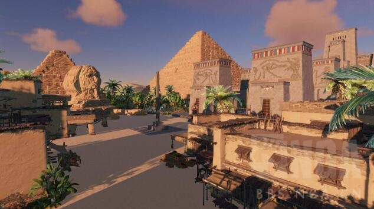
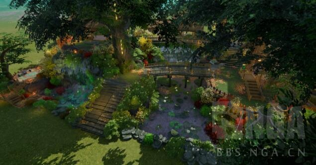
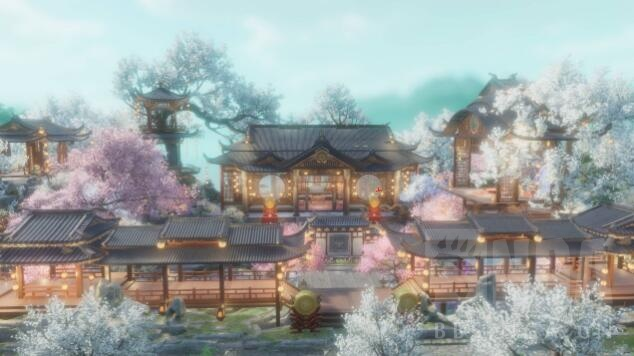
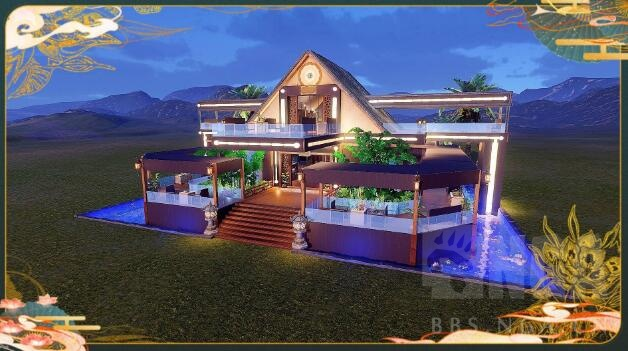
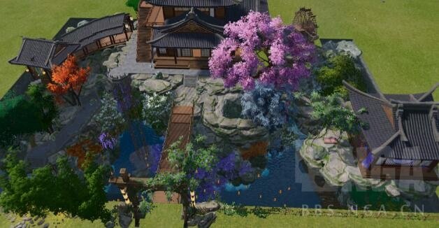
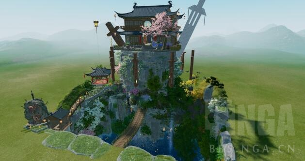

### [不吐不快]感觉好多玩法只是听上去好玩

Made by ngapost2md (c) ludoux [GitHub Repo](https://github.com/ludoux/ngapost2md)

----

##### 0.[2] \<pid:0\> 2023-08-01 18:45:22 by 格兰登
尘歌壶爆料的时候，以为角色能在家园里互动了(角色和角色之间，角色和家具之间)，实际上就是在哪罚站

钓鱼也是，打牌也是，开船也是(这也叫海战？)

这一次的过山车没玩过，不知道。(但好像没什么人夸，刚知道的时候还有点荒，还以为会升一点免费榜呢)

估计未来的潜水也不好玩

----

##### 1.[0] \<pid:706301183\> 2023-08-01 18:47:58 by 吸水恶魔
其他的不好玩顶多只是让你以后不想再玩了。
比如壶不好玩那就不进壶，打牌不好玩就不打，钓鱼拿到想要的东西就不钓。

但是枫丹的潜水估计是大地图的一部分，躲不过，应该类似须弥的森林书，做任务解锁潜水工具→解锁更多的地图→又继续解锁更高级的工具→又解锁更多的地图

----

##### 2.[0] \<pid:706301748\> 2023-08-01 18:51:13 by 真叫人脑壳大
底层代码，照顾手机，tx打压，领带美元，米桑无能，后面忘了，挑一个吧

----

##### 3.[0] \<pid:706301834\> 2023-08-01 18:51:39 by AvadaKedvara
这是mhy凭实力做到的大家也没想到会这么不好玩

----

##### 4.[0] \<pid:706301867\> 2023-08-01 18:51:52 by Inquisit
米在做玩法方面的让人失望从不让人失望

----

##### 5.[0] \<pid:706302042\> 2023-08-01 18:52:38 by 沆瀣一气zex
有家具数量上限还不能随意组装拼合的家园本身就没啥好玩的，这种自由度太低了。
还不如剑三的家园呢你想要的风格都可以靠自己弄出来，官方交易平台随便几张玩家自制拿来卖的蓝图都能把尘歌壶秒了

----

##### 6.[0] \<pid:706302750\> 2023-08-01 18:55:32 by 疯狂de兔子n
客观来说，过山车还可以，不算拉胯

----

##### 7.[0] \<pid:706302871\> 2023-08-01 18:56:07 by 龙澂
钓鱼我是最无语的，当时为了拿鱼叉，纯纯就是坐牢

----

##### 8.[0] \<pid:706303099\> 2023-08-01 18:57:00 by UID3563849
各种层面的抠抠索索就因为什么都要跟体力绑定，卖体力到底有多赚钱？
自缚手脚，什么都做不了，就连4399也是越做越不好玩

----

##### 9.[0] \<pid:706303295\> 2023-08-01 18:57:53 by Teddydesu
内容仙人是这样的
真要谈游戏性可能还真不如一部分4399

----

##### 10.[0] \<pid:706303389\> 2023-08-01 18:58:15 by sbsx123
mhy做某个玩法只是为了宣发的时候可以说自己有这个玩法，你以为是为了让你觉得好玩吗

----

##### 11.[3] \<pid:706303659\> 2023-08-01 18:59:44 by 子廖陆己沈孟
其实就是做的都很浅。充满着“哦，这次要做这个内容啊”然后糊弄糊弄交交差完事的感觉，怎么样有趣？那不重要，交差了就行

----

##### 12.[0] \<pid:706303808\> 2023-08-01 19:00:27 by ソフィスト
>[jump](#pid706302750) 疯狂de兔子n(2023-08-01 18:55)说:
>客观来说，过山车还可以，不算拉胯

啊？观光轨道车好玩吗？怎么好玩法？不会是风景好看吧？

----

##### 13.[0] \<pid:706303912\> 2023-08-01 19:00:58 by 右手边03
>[jump](#pid706302750) 疯狂de兔子n(2023-08-01 18:55) 说: 
>
>客观来说，过山车还可以，不算拉胯

实际上须弥花环啥的一个版本也行，放到一年的长度就是没活。再加上量大，自然会显得烦人  更别说怪物镇守 点火把两年半了

----

##### 14.[0] \<pid:706303984\> 2023-08-01 19:01:18 by jwbdbx
>[jump](#pid706303099) UID3563849(2023-08-01 18:57) 说: 
>
>各种层面的抠抠索索就因为什么都要跟体力绑定，卖体力到底有多赚钱？
>自缚手脚，什么都做不了，就连4399也是越做越不好玩

为了拖在线时长罢了，包括剧情的废话

----

##### 15.[0] \<pid:706304241\> 2023-08-01 19:02:34 by aswaw111
>[jump](#pid706301183) 吸水恶魔(2023-08-01 18:47)说:
>其他的不好玩顶多只是让你以后不想再玩了。 比如壶不好玩那就不进壶，打牌不好玩就不打，钓鱼拿到想要的东西就不钓。  但是枫丹的潜水估计是大地图的一部分，躲不过，应该类似须弥的森林书，做任务解锁潜水工具→解锁更多的地图→又继续解锁更高级的工具→又解锁更多的地图

虽然但是，符合这个描述的应该是稻妻的神樱树/层岩巨渊的流光晶体吧，须弥感觉就是带着开图，没有那种等级的感觉

----

##### 16.[0] \<pid:706304276\> 2023-08-01 19:02:45 by 哒哒块
尘歌壶容量太低导致我根本不想玩，都装不下玩家的脑洞

近景拍照很美吧，视角拉远全都穿帮

----

##### 17.[0] \<pid:706304301\> 2023-08-01 19:02:52 by A-simple
潜水体验估计是打不过潜水员戴夫这游戏的在我这已经寄了

----

##### 18.[0] \<pid:706304675\> 2023-08-01 19:04:40 by 方子幕_桃
钓鱼这个玩法我可以喷米哈游一年
我玩逆水寒的时候天天钓鱼(上次钓到稀有鱼的时候被炸鱼的炸死了给我气撅过去)，我都想不懂为什么原神我拉条的时候没法看鱼，看鱼的时候没精力拉条？会做玩法吗米哈游，这纯纯折磨人的

----

##### 19.[0] \<pid:706304762\> 2023-08-01 19:05:04 by 路过的白毛团子
节假日试玩过幻塔 逆水寒 晶核  感觉原从1.0就没什么进步的感觉  
幻塔对话时候的姿态动作看着比较自然流畅 不像原摆来摆去就那几个 而且部分动作都是给你挡住  比如夏活里什么握手 给可莉大头挡住  其他各种和手有关的基本都是看不到的  感觉就很敷衍   
逆水寒手感偏差 碰一下就没动了  但是看人发的图 好看的挺多时装免费搞 大世界也更自由的样子
晶核的话今天刚打 技能方面爽快感超过原了 二段跳 空中冲刺 空连 下劈  缝了dnf和FF14的样子 暂时玩着感觉还行  比起原什么切人卡住 被圣骸兽乱创根本跑不出去什么的  连个后台技能CD都不给  晶核一个键两个技能靠ui独立显示CD情况之类的

----

##### 20.[0] \<pid:706312156\> 2023-08-01 19:43:19 by 雨源rainsource
米哈游就从来没有做过好玩的内容

----

##### 22.[0] \<pid:706322538\> 2023-08-01 20:37:01 by Ngchikrn
玩法沒創新是這樣，只是換個花樣擺上來給你品嚐

----

##### 23.[0] \<pid:706325890\> 2023-08-01 20:50:34 by jasmine4869
三年了，都没出新玩法，甚至战斗也是换汤不换药的破盾打伤害，每个大版本加点神奇的()()元素

----

##### 24.[0] \<pid:706328249\> 2023-08-01 21:00:17 by gawayne
这个逼制作组满脑子就是卡玩家，

尘歌壶，材料要砍树，要挖矿。砍树tm有cd，十几颗树才能跑回来砍。矿又有cd，几天后再来。然后tmd造家具有cd，买家具还有cd。

钓鱼，鱼的数量又有cd，三天吊一轮。鱼的钓起又tm麻烦的要死，甩个鱼饵进了有惊吓跑路又是cd，远了完全不过来。

打牌不记得了，但是记得是不可以一次肝到10级的，都忘了是怎么卡住玩家的，但反正记得要几个星期才能到10级。然后tm还来个傻逼邀请信，跟个npc大牌也要卡。

最傻逼是深渊，tm重启深渊不重启角色技能cd，3.7几次重启，放了第一个角色技能，发现后面的角色cd没转好，开始重启重启。

个傻逼游戏天天就是卡卡卡，活该出一个玩法死一个玩法。

----

##### 25.[0] \<pid:706328666\> 2023-08-01 21:02:03 by 璃月优质牛
过山车第三视角这个就很搞笑

----

##### 26.[0] \<pid:706329902\> 2023-08-01 21:08:05 by 肯定是假的
以前一说活动不好玩，就是第一次在尝试，这下好了，尝试了快三年
还是那么几个活动类型，包括什么壶、钓鱼、打牌
给人一种做东西做一半，端上来完事的感觉

----

##### 27.[0] \<pid:706329952\> 2023-08-01 21:08:19 by High_n_Dry
他玩法无聊到我甚至都开始觉得这次三队打怪好玩了

----

##### 28.[0] \<pid:706331715\> 2023-08-01 21:16:32 by beatles05
听起来好玩是因为别的游戏这些功能都做得挺好玩的，别的不说能把钓鱼做得这么无聊也算是一种本事，钓鱼之前就看到自己钓的是什么鱼是什么逆天设计，最重要的那种未知的刺激感完全没有了，当时听说为了做这个钓鱼玩法策划连夜学习钓鱼，合着真就一点都不了解钓鱼临时抱佛脚是吧

----

##### 29.[0] \<pid:706332749\> 2023-08-01 21:21:56 by 花瓣飘零
这是一个慈善机构吗？剧情我都不说了，这好歹是个游戏吧，做什么废物游戏内容出来都没人把关

----

##### 30.[0] \<pid:706332778\> 2023-08-01 21:22:02 by 一个苦柚子
说真的
我完全不期待水下

问就是玩过mmo的水下

----

##### 31.[0] \<pid:706333868\> 2023-08-01 21:27:25 by 哈兰德0175
主要很多东西做的太差了，比如钓鱼还有家园系统

----

##### 32.[0] \<pid:706335090\> 2023-08-01 21:33:13 by 重生之我是荣誉骑士
讲个笑话，从崩3开始研究小游戏，专注小游戏不知道第三年，做出来都是这种东西，甚至佳酿节那个经营还能在崩铁复刻

----

##### 33.[0] \<pid:706337777\> 2023-08-01 21:47:38 by 碎月翩跹
我敢拍着胸脯说未来的水下一定不好玩

----

##### 34.[0] \<pid:706339335\> 2023-08-01 21:55:58 by Seeyoupelos
2023年了，竟然还有厂家拿大世界潜水作卖点，挺搞笑的。

----

##### 35.[0] \<pid:706339983\> 2023-08-01 21:59:25 by 雷电女王的鬼铠
把各种好玩的玩法搬进游戏做得不好玩，这也太好玩了

----

##### 36.[0] \<pid:706341238\> 2023-08-01 22:06:07 by 凉菲凡
陈哥壶因为有早期滤镜所以我勉强接受
钓鱼真是做成了一坨， 换完鱼叉后根本不想浪费一秒钟在上面

小游戏里最让我无语的是佳酿节那个“模拟经营”， 我知道小游戏只能做4399做不出多少深度， 但是做成NM纯凑数值条的玩意是不是有点离谱？崩铁还复刻一遍， MHY策划不会觉得这东西很好玩吧？哦当然崩铁那个优化了一点点， 中间穿插了一点事件， 节奏算是好了那么一丢丢， 但依旧是无聊

要说好的， 也不是没有， 第一届蕈兽宝可梦我是认可的， 玩法谈不上多好玩， 但打个及格分没问题

----

##### 37.[0] \<pid:706354066\> 2023-08-01 23:19:11 by 天涯墨刀
钓鱼难受+1，玩“盗贼之海”和哥们钓了一夜的鱼根本不觉得无聊，这游戏根本不想钓鱼

----

##### 38.[0] \<pid:706354737\> 2023-08-01 23:23:08 by 柑橘橙橙橙橙橙子
第一次遇见一个游戏里各种玩法能这——么无聊的

----

##### 39.[0] \<pid:706355681\> 2023-08-01 23:28:55 by wzdlc
最好玩儿的我觉得是塔防二期抽卡结果三期直接砍了，而且三期不好玩儿，那时候我就觉得ch有什么病

----

##### 40.[0] \<pid:706357083\> 2023-08-01 23:37:20 by 何德何能丨
想想原神里各种载具操作，远的不说，新地图花灵的操作，是不是憋屈的不行？我可不觉得它新地图水下操作能有多丝滑。
我就不比别的厂商了，就隔壁铁道操纵机巧鸟上天，鼠标左键右键上升下降，不比你个花灵上升下降放到Z键和左Ctrl键丝滑？(忘了是不是这俩键了，也好像是shift)，甘露花海开图的时候，想升降结果点到切换回人物，返回原位，真的让人脑溢血。什么脑回路能把所有按键挤在左下角一坨啊？这也能优化到隔壁？

----

##### 41.[0] \<pid:706358645\> 2023-08-01 23:46:17 by 四十四号外星人
之前前瞻直播，最后漏了一个下水游泳的画面，直接全场沸腾，我寻思着米桑平a刚抬手，你直接df二连。怼着一个画面兴奋的样子真是把我乐死了???

----

##### 42.[0] \<pid:706359384\> 2023-08-01 23:50:47 by 小町Sama
>[jump](#pid706302750) 疯狂de兔子n(2023-08-01 18:55) 说: 
>
>客观来说，过山车还可以，不算拉胯

这还不算拉垮嘛？哥们平时玩过过山车？要是改成第一人称视角我可以给个及格分。现实是速度慢悠悠不说，第三人称视角毫无代入感，难得冲刺加速的地方，他还拉到广角。说白了过山车的乐趣并不是这次游戏里所展现的，想体验游戏里的过山车可以看看过山车大亨这款老游戏，画面虽然很老了但我就是看视频都有感觉。
风景我不好评价，个人喜好不一样。我承认这次做的很认真，但是对雨林瀑布山洞沙漠有点腻歪了。

----

##### 43.[0] \<pid:706361280\> 2023-08-02 00:01:43 by 银河外的水滴
原神里钓鱼趣味性还不如二十年前的一些武侠rpg网游，至少人家游戏里不知道钓上来的会是什么，还会钓到一些奇怪的东西触发事件

----

##### 44.[0] \<pid:706372624\> 2023-08-02 01:32:15 by 三木木三
梦里不是说水下地图也很无聊吗

