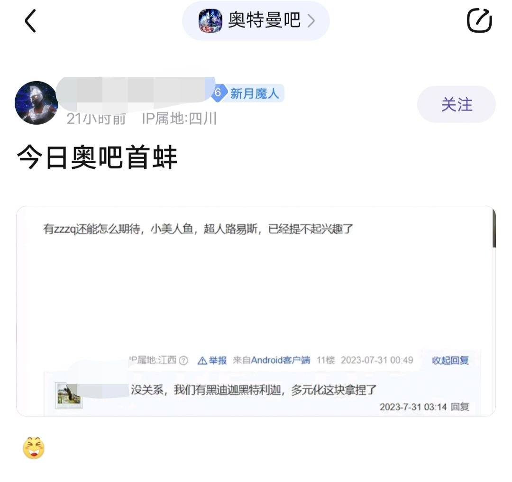
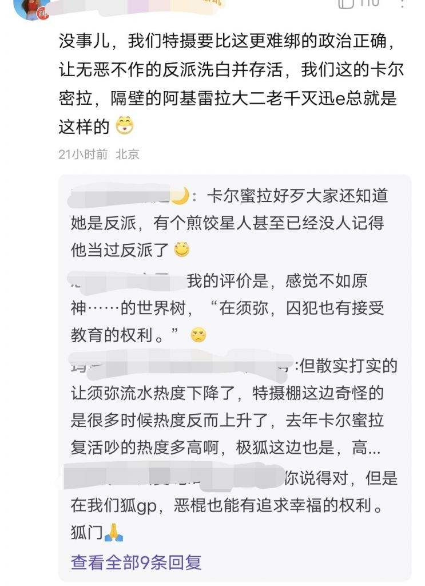

### [不吐不快]联动详谈散兵与伽古拉

Made by ngapost2md (c) ludoux [GitHub Repo](https://github.com/ludoux/ngapost2md)

----

##### 0.[0] \<pid:0\> 2023-08-01 18:53:52 by 同泽原光
刚刚看到一个帖子里面掰扯散兵与伽古拉，说什么伽古拉也是反派洗白就像散兵，看到我是真的绷不住作为一个奥厨完全不能接受这种弱智言论，我来给大家细说一下伽古拉的历程吧。
他与他的好友凯一起参加了他们星球上奥特战士的选拔，伽古拉落选，凯成为了真正的奥特曼，两人一同前往完成一个有关“世界树”的任务，在一次战斗中爱徒被杀，伽古拉因为几位光之战士高高在上的态度，说着所谓的不能干涉的言论(这是编剧的锅)，彻底黑化，获得了魔人形态，在几位奥特曼都化身道德标兵不出手的情况下，自己舍身斩了世界树，化解了危机
到这里，其实伽古拉经历了真正的背叛，自己的爱徒丢了性命，自己的行为不被别人理解冷嘲热讽，自己化解了危机却被人误会，种种情况导致到了欧布奥特曼tv时期他彻底黑化，释放了魔王兽祸害世界，自己也变成了怪兽与好友凯战斗，但最后被击败，自己也醒悟了过来，面对自己放出的祸害，伽古拉选择了什么？他选择了亲自参与战斗，与朋友携手抗敌，在最后的关键时刻舍弃了自己的性命，让欧布奥特曼击杀了最终boss(但其实伽古拉这里并没有死，只是失去了巨大化的能力，但人家是真的有舍弃生命，弥补过错的觉悟，真正付出了行动不只是嘴上说说)，到此可以说伽古拉遭遇背叛，黑化，弥补过错，付出代价
反观散兵呢，杀了人犯了错，没关系，我会修改世界树，怎么洗白的？换个身份，认纳西妲当妈惩罚呢？当然有了，就是和小草每天游山玩水，写写论文
人伽古拉赎罪之后，还去了另一个世界，人家也是改变了自己的身份，成为了防卫队队长，但人家做了什么，又一次以自己的方式拯救了这个差点毁灭的世界
综上，伽古拉背叛黑化犯错，但自己成功救赎(甚至还额外救了另一个世界)，散兵呢，巨婴心态，天天把背叛挂在嘴边，杀人放火还能找个神明当妈，每天逍遥自在，我可qtmd，米哈游真的好好学学人物塑造吧，看看人家伽古拉这样的反派多有魅力，希望某个sb的粉丝不要再来碰瓷伽古拉了，我只会觉得恶心

----

##### 1.[0] \<pid:706302992\> 2023-08-01 18:56:32 by Lucifer1992
>[jump](#pid0) 同泽原光(2023-08-01 18:53) 说: 
>
>刚刚看到一个帖子里面掰扯散兵与伽古拉，说什么伽古拉也是反派洗白就像散兵，看到我是真的绷不住作为一个奥厨完全不能接受这种弱智言论，我来给大家细说一下伽古拉的历程吧。
>他与他的好友凯一起参加了他们星球上奥特战士的选拔，伽古拉落选，凯成为了真正的奥特曼，两人一同前往完成一个有关“世界树”的任务，在一次战斗中爱徒被杀，伽古拉因为几位光之战士高高在上的态度，说着所谓的不能干涉的言论(这是编剧的锅)，彻底黑化，获得了魔人形态，在几位奥特曼都化身道德标兵不出手的情况下，自己舍身斩了世界树，化解

说得好，奖励你下版本原神之初

----

##### 2.[0] \<pid:706303262\> 2023-08-01 18:57:45 by 同泽原光
>[jump](#pid706302992) Lucifer1992(2023-08-01 18:56) 说: 
>
>说得好，奖励你下版本原神之初

我感觉这几个版本原神的剧情已经超越原生之初了

----

##### 3.[0] \<pid:706303858\> 2023-08-01 19:00:45 by Lucifer1992
>[jump](#pid706303262) 同泽原光(2023-08-01 18:57) 说: 
>
>我感觉这几个版本原神的剧情已经超越原生之初了

考虑童年滤镜，那还是比不过的，毕竟刚出两三个版本3.3塑造就开始崩盘的草神，原生之初可是把戴拿和高斯都崩了
好好看看光之战士的战斗方法吧

----

##### 4.[0] \<pid:706304208\> 2023-08-01 19:02:25 by 同泽原光
>[jump](#pid706303858) Lucifer1992(2023-08-01 19:00) 说: 
>
>考虑童年滤镜，那还是比不过的，毕竟刚出两三个版本3.3塑造就开始崩盘的草神，原生之初可是把戴拿和高斯都崩了
>好好看看光之战士的战斗方法吧

你说的也有道理，但在我眼里两坨都是答辩，已经不需要分个上下了

----

##### 5.[0] \<pid:706306100\> 2023-08-01 19:11:37 by 唔於
感觉sb跟mhy这个公司有点像，作为反派low的出奇：错不在我，把所有人拉下水恶心遍 说不定sb就是mhy内部文化的缩影，以后还玩原的有难了

----

##### 6.[0] \<pid:706307118\> 2023-08-01 19:16:59 by 磷伊2
>[jump](#pid0) 同泽原光(2023-08-01 18:53) 说: 
>
>刚刚看到一个帖子里面掰扯散兵与伽古拉，说什么伽古拉也是反派洗白就像散兵，看到我是真的绷不住作为一个奥厨完全不能接受这种弱智言论，我来给大家细说一下伽古拉的历程吧。
>他与他的好友凯一起参加了他们星球上奥特战士的选拔，伽古拉落选，凯成为了真正的奥特曼，两人一同前往完成一个有关“世界树”的任务，在一次战斗中爱徒被杀，伽古拉因为几位光之战士高高在上的态度，说着所谓的不能干涉的言论(这是编剧的锅)，彻底黑化，获得了魔人形态，在几位奥特曼都化身道德标兵不出手的情况下，自己舍身斩了世界树，化解

你说的那个帖子是我发的，原帖标题是这个

这个是提反派时候顺便说了一下伞兵，你理解错了

----

##### 7.[0] \<pid:706308098\> 2023-08-01 19:21:55 by 冰河新栖姬
有趣的是后面泽塔里也提过了这个事件，他嘲讽戴拿勋章“你可要让我看看光之战士的战斗方式啊”，也提过他曾经砍倒一颗参天巨树试图终结战争，但一切都被否定了，正视了自己的行为，同时又给这一行为定了性
虽然有一说一这个真怪不了伽古拉，戴拿和高斯两个划水佬，战神无战意，当时的情况就是个死局...
伽古拉其实也有“内心的强大和脆弱”这个tag，但他的脆弱体现在堕入黑暗的部分，后续经历了心境转变而洗白之后确实称得上是可靠的伙伴/暗中的助力

----

##### 8.[0] \<pid:706308816\> 2023-08-01 19:25:57 by 泛舟浮白
真·子供向作品的反派塑造都比原的有深度得多

----

##### 9.[1] \<pid:706309758\> 2023-08-01 19:30:39 by 同泽原光
>[jump](#pid706307118) 磷伊2(2023-08-01 19:16) 说: 
>
>你说的那个帖子是我发的，原帖标题是这个
>
>这个是提反派时候顺便说了一下伞兵，倒不是碰瓷，你理解错了

原来是这样，那应该是我误会了，那我这帖子大伙就理解成两个反派的比较贴吧，mhy好好看反派洗白是怎么写的

----

##### 10.[0] \<pid:706317662\> 2023-08-01 20:09:16 by smasher401
伽古拉是新生代我最喜欢的反派，角色要塑造有塑造，演员要演技有演技，是()能来碰瓷的？子供向≠幼稚原现在的剧情比不上欧布一根，~~原生之初还是太拉了~~

----

##### 11.[0] \<pid:706318218\> 2023-08-01 20:12:00 by D_终于考好了
现在由拍过欧布的田口执导的布莱泽好评播放中，有兴趣的可以看看~~原生之初不是他拍的~~

----

##### 12.[0] \<pid:706404576\> 2023-08-02 09:22:28 by ashcarrier
伽古拉这事其实挺搞的，他砍树是长痛不如短痛，然后几个奥搁那圣母犟着，但是也没提出比伽古拉更靠谱的方案，突出一个bb他人我当仁不让，让我上我不上

----

##### 13.[0] \<pid:706408266\> 2023-08-02 09:38:59 by FM不是调频
抱走我方尖角星人！！泽塔里伽古拉对欧斯太好了，呜呜呜

----

##### 14.[0] \<pid:706410261\> 2023-08-02 09:47:40 by 大魔王的小忠犬
>[jump](#pid706318218) D_终于考好了(2023-08-01 20:12)说:
>现在由拍过欧布的田口执导的布莱泽好评播放中，有兴趣的可以看看[s:ac:goodjob]<del class='gray'> 原生之初不是他拍的 </del>

你也在看奥特野人吗

----

##### 15.[0] \<pid:706413276\> 2023-08-02 10:00:20 by zxx小白
其他还是去碰阿加慕斯吧一个复读三次背叛，一个吟唱花朵圣经，绝配

----

##### 16.[0] \<pid:706414738\> 2023-08-02 10:06:44 by 杀菌消毒
原生之初除了补完伽古拉黑化的原因，其他都是一泡污。而就因为这一泡污才导致了伽古拉的黑化。这一切就很奇妙，但凡那些跑来OB的前辈做点人事也不至于一点人事都不做。
其他不想讨论

----

##### 17.[0] \<pid:706417712\> 2023-08-02 10:19:22 by bbb7789
就高斯和戴拿在剧里的表现着实是让人想进去抽他俩一个大嘴巴子
而且我觉得伽古拉已经很克制了，换其他人处在伽古拉这个位置上，怕不是在砍树的时候顺便把女王一起劈了省得后半段那么多屁事

----

##### 18.[1] \<pid:706418007\> 2023-08-02 10:20:35 by n258456
凭什么能碰瓷伽古拉的塑造啊？还是看看远处三生三世古利特里的的安奇吧，什么叫反派洗白暗中助力啊

----

##### 19.[0] \<pid:706421961\> 2023-08-02 10:36:11 by qw18637
伽古拉塑造的关键点有两点
第一个是他手上没血，虽然听起来特别扯淡，但奥特曼现在基本都默认怪兽出来蹦跶，没给人死的镜头就0人亡了，最后一集“我不知道我怎么了，但当我反应过来的时候已经把她救下来了”说明伽古拉内心深处还是不愿意作恶的，起码不愿意看到无辜人死
特摄有一个定律，只要一个角色手上没血，那怎么洗白都好商量，反例就是555的小马哥，人也整挺好，就是前期上头激情杀人，最后拿命跟BOSS换了，也算是个好下场
第二个是官方小说里说的，伽古拉在泽塔里很珍重的那盆栽是世界树的嫩枝
点出了伽古拉的成长，他也在当年局势有没有迫切到必须砍树，有没有相对好点的办法，所以他现在成为了守护树苗的人，而不是砍翻大树的人

----

##### 20.[0] \<pid:706427300\> 2023-08-02 10:56:50 by 冰川真琴
花朵，树木，天空，微风，云彩，太阳，彩虹，海洋，沙滩，森林，石子，砂砾，大地”

----

##### 21.[0] \<pid:706513311\> 2023-08-02 17:24:52 by ashcarrier
>[jump](#pid706318218) D_终于考好了(2023-08-01 20:12) 说: 
>
>现在由拍过欧布的田口执导的布莱泽好评播放中，有兴趣的可以看看~~原生之初不是他拍的~~

划掉的这句是重点

----

##### 22.[0] \<pid:706516946\> 2023-08-02 17:40:34 by Aikili
原生之初其实看大纲和立意能感觉到导演是想拍点有冲突的大制作的，但是实际水平我认识的特摄粉跟我讲田口他们是捏着鼻子认了，算正史，为了衔接伽古拉的人设后面还出了个打补丁用的外传欧布超全集
原没法碰瓷，无论是从大纲立意还是实际表现都是一坨

----

##### 23.[0] \<pid:706529993\> 2023-08-02 18:41:56 by 同泽原光
>[jump](#pid706516946) Aikili(2023-08-02 17:40) 说: 
>
>原生之初其实看大纲和立意能感觉到导演是想拍点有冲突的大制作的，但是实际水平我认识的特摄粉跟我讲田口他们是捏着鼻子认了，算正史，为了衔接伽古拉的人设后面还出了个打补丁用的外传欧布超全集
>原没法碰瓷，无论是从大纲立意还是实际表现都是一坨

原生之初确实是奥系列作品里最大的答辩

