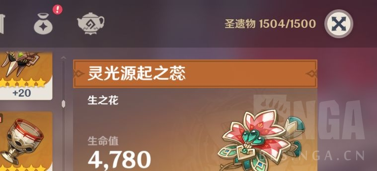

### [不吐不快]这圣遗物上限是在闹着玩吗？

Made by ngapost2md (c) ludoux [GitHub Repo](https://github.com/ludoux/ngapost2md)

----

##### 0.[0] \<pid:0\> 2023-08-01 19:01:11 by 吸猫过度
刷圣遗物刷着刷着提示我上限满了，我就打开背包准备用一点，打开背包一看我惊呆了，上限1500但是能放1504个是吧

----

##### 1.[3] \<pid:706304414\> 2023-08-01 19:03:26 by ラK
不然呢，你1499的时候下一次本随机一个给你进包里别的扔掉吗

----

##### 2.[0] \<pid:706304474\> 2023-08-01 19:03:40 by 明明是我先来的a
…..你要是只剩一个格子，非要把你最后一把收益吞掉只给一个才算合理吗

----

##### 3.[0] \<pid:706304629\> 2023-08-01 19:04:27 by 四枝星穗
>[jump](#pid706304474) 明明是我先来的a(2023-08-01 19:03)说:
>…..你要是只剩一个格子，非要把你最后一把收益吞掉只给一个才算合理吗

这种情况一般是多出来的发进邮箱里

----

##### 4.[0] \<pid:706305048\> 2023-08-01 19:06:26 by 吸猫过度
>[jump](#pid706304414) ラK(2023-08-01 19:03)说:
>不然呢，你1499的时候下一次本随机一个给你进包里别的扔掉吗[s:ac:哭笑]

那既然存在格子不够时提示背包已满的设计，同时又能超过背包上限，这不是很割裂？

----

##### 5.[0] \<pid:706308188\> 2023-08-01 19:22:24 by 明明是我先来的a
>[jump](#pid706304629) 四枝星穗(2023-08-01 19:04) 说: 
>
>这种情况一般是多出来的发进邮箱里

也行，不过跟上限多出来一个意思，给还是得给。
策划又不好意思直接写：我要让你定期进行养成操作增加粘性

----

##### 6.[0] \<pid:706308265\> 2023-08-01 19:22:49 by 火郭 Electronica
>[jump](#pid706305048) 吸猫过度(2023-08-01 19:06) 说: 
>
>那既然存在格子不够时提示背包已满的设计，同时又能超过背包上限，这不是很割裂？

超限是有利于空格不够情况下刷本体验的
打个比方说同样是仓库还剩7个格子，一次刷本获取6个狗粮，可以超限的少女前线你可以刷两次本12个狗粮统一清理，没有超限的碧蓝航线就会在你开第二把第二战掉落第8个狗粮的时候弹窗卡你
除非无上限否则总要有一个允不允许超限的设计，原神刷一次本直接给你x个狗粮进仓库也不可能因为上限到了就让你吐出来
建议是没活拿来发帖的话不用硬整

----

##### 7.[0] \<pid:706308437\> 2023-08-01 19:23:47 by 格里兹纳特
>[jump](#pid706305048) 吸猫过度(2023-08-01 19:06) 说: 
>
>那既然存在格子不够时提示背包已满的设计，同时又能超过背包上限，这不是很割裂？

这游戏割裂的地方还少么？

