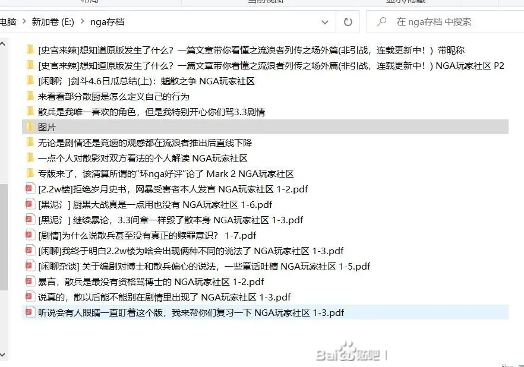

### [不吐不快] [赛博史官] 关于里茶馆建版历史的考据

Made by ngapost2md (c) ludoux [GitHub Repo](https://github.com/ludoux/ngapost2md)

----

##### 0.[2] \<pid:0\> 2023-08-01 21:30:02 by 不织围脖
[和裕茶馆]最初是原神版的一个合集(STID=23552542)，后来独立开版(FID=758)。作为原神版的杂谈版，原[和裕茶馆]主要承担ROLL帖、黑泥帖两类帖子，后者与今天的里茶馆的职能相近。

[quote]本版面负责收录ROLL贴，游戏相关黑泥，对游戏的看法/反馈/发展建议，以及其他较有争议性或是与游戏本体关联性不强的话题。
黑泥请使用[黑泥氵]，ROLL贴请参照关于ROLL帖的规范补充公告并使用[ROLL贴]，其他对应内容可使用对应TAG。
在茶馆外发布黑泥贴，造成更多的不良影响，可能会导致更高一级的处罚，请谨慎本帖提示。
《关于版面分类的重要公告》
[/quote]从3.2末尾及3.3开始，原[和裕茶馆]和[桓那兰那](FID=510375)共同承担了剧情方面及散兵、纳西妲人设方面的争议帖。

2023年3月27日，[@碧蓝の海]在[桓那兰那]发表《[[剧情讨论] 散兵这个角色的立意再高，大部分观众看完get不到有什么用呢](https://nga.178.com/read.php?tid=31482928)》，引发了原神版对间章第三幕《倾落伽蓝》的又一次大讨论。

3月31日，[3.6版本前瞻直播](https://weibo.com/6593199887/MzReMfhnh)中，放出了3.6大活动《盛典与慧业》过场动画《荣冕》的片段，其中散兵出场。

前瞻直播还透露了除因论派外各学派的代表人，引发了对于散兵成为因论派代表人的广泛猜测，版内黑泥被引爆。

当晚，[@达大力呀]在[桓那兰那]发表《[[剧情讨论] 今天又和人聊起散兵这件事，突然理解为什么争议可以持续到现在了](https://nga.178.com/read.php?tid=35835617)》。

4月1日愚人节，[原神官方发布散兵的猫塑立绘](https://weibo.com/6593199887/MzXa7g1FK)。

4月5日，由于版内黑泥过多，影响主版、原[和裕茶馆]和[桓那兰那]的正常浏览，[流浪者剧情临时讨论合集](STID=35876383)建立，最开始归属于[桓那兰那]，然后转移至原[和裕茶馆]。合集后来俗称“散兵专版”。

当天，[@浪里白条Altair]在[流浪者剧情临时讨论合集]发表《专版来了，该清算所谓的“环nga好评”论了》，一天之内达2000楼。第二天，帖子被锁隐，[@风间莫璃]在合集内补档《&amp;#8203;专版来了，该清算所谓的“环nga好评”论了 Mark 2》。

4月10日，3.6版本预下载开放，未实装的《盛典与慧业》剧情对话曝光。由于[流浪者剧情临时讨论合集]内关于未实装消息的黑泥引发的风险较大，合集关闭。

4月12日，3.6版本更新。由于版内黑泥过多，合集重新开放。

4月23日下午，根据[关于原神版面“和裕茶馆”、“层岩巨渊”的新增和调整公告](https://nga.178.com/read.php?tid=35945776)，新开版面[层岩巨渊]。由于三位数FID比较珍贵，版务想将三位数FID给新版面，因此将[和裕茶馆](FID=758)改名[层岩巨渊](FID=758)，原[和裕茶馆]内的帖子随之转移至[层岩巨渊]内。[流浪者剧情临时讨论合集]作为原[和裕茶馆]的子合集，也被转移至[层岩巨渊]内，因而适用于[层岩巨渊]的5日冲水规定；后来重要帖子被打捞。

原[和裕茶馆]新开版[和裕茶馆](FID=510391)，这就是如今的表茶馆。原[和裕茶馆]自此被拆分为表里两版：表茶馆继承了ROLL帖职能，并新增了分享生活等和游戏本体关联不大的帖子和创意分享帖两类帖子，主版随之将[闲聊杂谈]标签改为[游戏杂谈]标签，禁止发布和游戏本体无关的帖子；里茶馆继承了黑泥职能，并对热点事件的讨论更加友好。

3月1日，[幽夜净土](FID=798)脱离原神版；3月31日24点，[幽夜净土]关闭。由于[幽夜净土]导致污名化皇女的前车之鉴，潭友担心[层岩巨渊](FID=758)会污名化层岩巨渊；同时5日冲水被认为不方便讨论。4月23日傍晚，版务在[层岩巨渊]发出《[版务公告] 关于这次的“和裕茶馆”、“层岩巨渊”版面的调整和新增，开一个反馈贴》和《[版务公告] 现“层岩巨渊”板块名征集》，收集潭友的意见。当晚，版务发出《[版务公告] 关于板块名称和冲水问题》，对潭友的意见作出反馈，并提交了将[层岩巨渊](FID=758)改名为[临时版面](FID=758)的申请。

24日，版务发起关于新版面名字的投票。

最终“和裕茶馆(里)”当选。随后，[临时版面](FID=758)改名为[和裕茶馆(里)](FID=758)，冲水期限也从5日改为15日，这就是今天的里茶馆。

5月9日，[@地狱叉]在主版发表《[&amp;#8203;[游戏杂谈] 1.5万字长文，我为什么会对现在的草王塑造感到愤怒？](https://nga.178.com/read.php?tid=36225693)》(帖子后来被转移至[桓那兰那])。

5月11日，[@RNG丶杨涟涟]在[剑斗绮谭](FID=835)发表《关于散兵夜兰之下第一人这个称呼的溯源和讨论》，对版内散厨开团。随后，[剑斗绮谭]和[和裕茶馆](表茶馆)出现大量跟团帖子，散厨退居[万文集舍](FID=809)，后来基本退出原神版。

5月15日，[流浪者剧情临时讨论合集]随着《盛典与慧业》活动的结束而被关闭，后来版面入口被移出[和裕茶馆(里)]。

参考帖子：
[[史官来辣]想知道原版发生了什么？一篇文章带你看懂之流浪者列传之场外篇(4月12日录屏视频之争更新！到底谁的视频在造谣？)](https://nga.178.com/read.php?tid=35899723)
[[热点事件] 当初三阶是怎么被青蒜出剑斗的啊](https://nga.178.com/read.php?tid=37102857)
[[热点事件] 关于油液，盘一下理查发展进程](https://nga.178.com/read.php?tid=37220509)
欢迎交流讨论

----

##### 1.[0] \<pid:706335362\> 2023-08-01 21:34:30 by yian127
我们里版，也拥有了自己的悠久历史

----

##### 2.[0] \<pid:706335578\> 2023-08-01 21:35:35 by 凌依凌依
整挺好

----

##### 3.[0] \<pid:706335757\> 2023-08-01 21:36:36 by 众生蔓延
不知不觉里版也有这么久了

----

##### 4.[0] \<pid:706335901\> 2023-08-01 21:37:29 by 剑筑师と書記官
那我大概是层岩时期来的了

----

##### 5.[2] \<pid:706336678\> 2023-08-01 21:41:41 by 经常看书看得开
支持史官，祝里茶越办越好
~~这是可以祝福的嘛~~

----

##### 6.[2] \<pid:706337111\> 2023-08-01 21:44:01 by 请看签名
楼主别忘了孤散者

----

##### 8.[0] \<pid:706337496\> 2023-08-01 21:46:13 by k384698637
其实一点都不好吧，很多过去的帖子全冲水了，几乎没法打捞，

----

##### 9.[0] \<pid:706337638\> 2023-08-01 21:46:58 by 风干的小花
只隐约记得刚入坑的时候还没有里茶

----

##### 10.[0] \<pid:706337683\> 2023-08-01 21:47:10 by 等把美又强的剑
我居然错过了5月11日的大事件。。。原来是那个事件之后才大规模败走的吗。。。

----

##### 11.[0] \<pid:706338077\> 2023-08-01 21:49:11 by UID42694396
除了不看剑斗以外几乎全都见证过不知道5月11号那贴子有什么乐子

----

##### 12.[0] \<pid:706338410\> 2023-08-01 21:50:49 by 祈安Mokia
除了层岩时期心情不好没看泥潭外基本都是亲眼目睹

----

##### 13.[0] \<pid:706338647\> 2023-08-01 21:52:14 by 0123cola
围观剑斗老害被拷打那些楼还挺乐呵的

----

##### 14.[0] \<pid:706339138\> 2023-08-01 21:54:54 by --致秋
环nga好评楼，紧随其后的剑斗老害出征茶馆大败而归的故事呢

----

##### 15.[1] \<pid:706339327\> 2023-08-01 21:55:54 by 梦一下怎么了
全程跟环nga好评那栋楼，真是热血

----

##### 16.[1] \<pid:706339361\> 2023-08-01 21:56:04 by 地狱叉
史官贴好评，不过感觉简短了点，像人口普查的直球骂文案贴、2.2万楼受害者澄清帖之类的感觉也可以加入，如果大家群策群力完善就太好了

----

##### 18.[0] \<pid:706340028\> 2023-08-01 21:59:39 by EWSCHNEE
李典王的事迹和外网升堂对理查发展也挺重要的吧

----

##### 19.[0] \<pid:706340038\> 2023-08-01 21:59:42 by 油门踩到底
这个链接的指向有问题

----

##### 20.[1] \<pid:706340235\> 2023-08-01 22:00:51 by 我不是琴秀
明明征名高票是世界树
怎么选上的理查我到现在都没搞清楚

----

##### 22.[0] \<pid:706340841\> 2023-08-01 22:04:07 by 凌依凌依
>[jump](#pid706340235) 我不是琴秀(2023-08-01 22:00)说:
>明明征名高票是世界树 怎么选上的理查我到现在都没搞清楚[s:ac:哭笑]

当时都给我冲飞了，如果现在大伙想心平气和的听我说关于这个名字的事儿我倒是可以讲一讲

----

##### 23.[0] \<pid:706341035\> 2023-08-01 22:05:06 by Lilith330
2023年3月27日， [@碧蓝の海] 在[桓那兰那]发表《[剧情讨论] 散兵这个角色的立意再高，大部分观众看完get不到有什么用呢》

这个链接点进去是bw的公告，地址不对

----

##### 24.[0] \<pid:706341656\> 2023-08-01 22:08:31 by Qqqxy2001
看来我也算是查理老人了从3.27就开始看，但没怎么发言

----

##### 25.[0] \<pid:706341906\> 2023-08-01 22:09:56 by 李猛干厨
第一次使用nga就是为了流专版，没想到见证历史了，可惜老号早就因为对线寄了

----

##### 26.[0] \<pid:706341924\> 2023-08-01 22:10:00 by 之归耶
>[jump](#pid706340841) 凌依凌依(2023-08-01 22:04)说:
><b>Reply to [pid=706340235,37223114,2]Reply[/pid] Post by [uid=5582610]我不是琴秀[/uid] (2023-08-01 22:00)</b>[s:ac:哭笑]当时都给我冲飞了，如果现在大伙想心平气和的听我说关于这个名字的事儿我倒是可以讲一讲

愿闻其详

----

##### 27.[0] \<pid:706342306\> 2023-08-01 22:11:59 by Skalski_
我三个号殉在了版务改名成层岩巨渊的那次

----

##### 28.[1] \<pid:706342500\> 2023-08-01 22:13:02 by A暴富的兔子
>[jump](#pid706342306) Skalski_(2023-08-01 22:11)说:
>我三个号殉在了版务改名成层岩巨渊的那次[s:ac:茶]

我大号就在那里没了，发帖问了一句火速没了，气的我脑子冒烟。

----

##### 29.[0] \<pid:706342798\> 2023-08-01 22:14:48 by 经常看书看得开
>[jump](#pid706340841) 凌依凌依(2023-08-01 22:04) 说: 
>
>当时都给我冲飞了，如果现在大伙想心平气和的听我说关于这个名字的事儿我倒是可以讲一讲

搬好小板凳了，细说

----

##### 31.[0] \<pid:706343094\> 2023-08-01 22:16:37 by 就随便起了个名字
>[jump](#pid706340841) 凌依凌依(2023-08-01 22:04) 说: 
>
>当时都给我冲飞了，如果现在大伙想心平气和的听我说关于这个名字的事儿我倒是可以讲一讲

冰镇西瓜准备好了，细说

----

##### 32.[0] \<pid:706344871\> 2023-08-01 22:26:38 by 不织围脖
>[jump](#pid706338647) 0123cola(2023-08-01 21:52) 说: 
>
>围观剑斗老害被拷打那些楼还挺乐呵的

剑斗老害是什么事，我不知道

----

##### 33.[0] \<pid:706345192\> 2023-08-01 22:28:25 by 不织围脖
>[jump](#pid706340028) EWSCHNEE(2023-08-01 21:59) 说: 
>
>李典王的事迹和外网升堂对理查发展也挺重要的吧

3.6之后的事我就不敢写了，没有亲历过而且也找不到相关记录，有谁能说说3.7 3.8发生过什么大事件吗

----

##### 34.[0] \<pid:706346236\> 2023-08-01 22:34:11 by 凌依凌依
>[jump](#pid706342798) 经常看书看得开(2023-08-01 22:14)说:
>[quote][pid=706340841,37223114,2]Reply[/pid] <b>Post by [uid=7116974]凌依凌依[/uid] (2023-08-01 22:04):</b>  [s:ac:哭笑]当时都给我冲飞了，如果现在大伙想心平气和的听我说关于这个名字的事儿我倒是可以讲一讲[/quote]搬好小板凳了，细说[s:ac:赞同]

之前的就不说了，之后的也不说了，就只说下这个名字的事儿
最开始，我的灵感就是寂静岭的表里世界，所以我初版提议就是[表·和裕茶馆]和[里·和裕茶馆]，因为这个真的很帅
但是碰到了两个问题，第一是有人说版块名字都是原神相关的地名或者专有名词，第二个就是，如果你在用老版APP的话会发现，以上的两个名字会导致最后一个字看不到
后来我们开始想地名，挑来拣去弄了个层岩巨渊，想的是有黑泥又没有黑泥，有深渊又没有深渊
结果因为完全没去想千岩军的事儿被冲爆
之后大伙就又琢磨，最后决定开个投票
但是名称征集大伙也看到了，最多的其实是世界树，但是不能用，因为这玩意TM不是自己骂自己吗，以后别的地方一说原版，“啊，有个板块专门岁月史书的”，我怕我还没咋地呢坛友崩溃了
后来从征集里边选了剩下的发的比较多的，但是就那么两条，剩下的我们几个就打开元神WIKI开始找
不敢找地名了啊，怕又有哪里考虑不周整坏了，于是就开始对着尘歌壶里边的摆设和活动名开始找，甚至活动每天的名字不都不一样嘛，就一天一天的翻，找又带感又合适的
最终找了投票的那几个，然后我说，这回该把表里板块加上去了吧(我真的觉得这个表里世界的设定很帅)，反正都投票了，于是决定加上
但是就[里·和裕茶馆]还是[和裕茶馆(里)]这两个我们又纠结了起来
我本来是想里·和裕茶馆的(别问，问就是很帅)，但是这样会导致(联动前边，后边有字看不到)，所以最后决定了和裕茶馆(里)，起码能直接看到和裕茶馆(，里字看不看得到都知道不是表茶馆了
然后就是发投票贴，和裕茶馆[里]断档当选
名字的事情就是这样了

其实如果最开始采取我的方案的话，现在就是[表·和裕茶馆]和[里·和裕茶馆]了

----

##### 35.[0] \<pid:706347697\> 2023-08-01 22:43:02 by 经常看书看得开
>[jump](#pid706346236) 凌依凌依(2023-08-01 22:34) 说: 
>
>之前的就不说了，之后的也不说了，就只说下这个名字的事儿
>最开始，我的灵感就是寂静岭的表里世界，所以我初版提议就是[表·和裕茶馆]和[里·和裕茶馆]，因为这个真的很帅
>但是碰到了两个问题，第一是有人说版块名字都是原神相关的地名或者专有名词，第二个就是，如果你在用老版APP的话会发现，以上的两个名字会导致最后一个字看不到
>后来我们开始想地名，挑来拣去弄了个层岩巨渊，想的是有黑泥又没有黑泥，有深渊又没有深渊
>结果因为完全没去想千岩军的事儿被冲爆
>之后大伙就又琢磨，最后决定开个投票
>但是名称征集大伙也看

没想到有这么多考究， 现在里茶读起来格外的顺口，取的好呀

----

##### 36.[1] \<pid:706348122\> 2023-08-01 22:45:36 by aswaw111
>[jump](#pid706335578) 凌依凌依(2023-08-01 21:35):

这种时候就要说这句话了
“风(米哈游)带来故事(散兵)的种子(流浪者剧情讨论合集)，时间(和坛友)使之发芽(成为今天的里版)”

----

##### 37.[0] \<pid:706348156\> 2023-08-01 22:45:48 by 被塞抹布后的小号
>[jump](#pid706346236) 凌依凌依(2023-08-01 22:34) 说: 
>
>之前的就不说了，之后的也不说了，就只说下这个名字的事儿
>最开始，我的灵感就是寂静岭的表里世界，所以我初版提议就是[表·和裕茶馆]和[里·和裕茶馆]，因为这个真的很帅
>但是碰到了两个问题，第一是有人说版块名字都是原神相关的地名或者专有名词，第二个就是，如果你在用老版APP的话会发现，以上的两个名字会导致最后一个字看不到
>后来我们开始想地名，挑来拣去弄了个层岩巨渊，想的是有黑泥又没有黑泥，有深渊又没有深渊
>结果因为完全没去想千岩军的事儿被冲爆
>之后大伙就又琢磨，最后决定开个投票
>但是名称征集大伙也看

所以这贴能一直活着成史官楼吗？

----

##### 38.[0] \<pid:706348222\> 2023-08-01 22:46:10 by 凌依凌依
>[jump](#pid706348122) aswaw111(2023-08-01 22:45)说:
>>[jump](#pid706335578) 凌依凌依(2023-08-01 21:35):
>
>这种时候就要说这句话了
>“风(米哈游)带来故事(散兵)的种子(流浪者剧情讨论合集)，时间(和坛友)使之发芽(成为今天的里版)”

你要不要上网页端看看我的头衔

----

##### 39.[1] \<pid:706348432\> 2023-08-01 22:47:17 by 凌依凌依
>[jump](#pid706347697) 经常看书看得开(2023-08-01 22:43)说:
>[quote][pid=706346236,37223114,2]Reply[/pid] <b>Post by [uid=7116974]凌依凌依[/uid] (2023-08-01 22:34):</b>  之前的就不说了，之后的也不说了，就只说下这个名字的事儿 最开始，我的灵感就是寂静岭的表里世界，所以我初版提议就是[表·和裕茶馆]和[里·和裕茶馆]，因为这个真的很帅 但是碰到了两个问题，第一是有人说版块名字都是原神相关的地名或者专有名词，第二个就是，如果你在用老版APP的话会发现，以上的两个名字会导致最后一个字看不到 后来我们开始想地名，挑来拣去弄了个层岩巨渊，想的是有黑泥又没有黑泥，有深渊又没有深渊 结果因为完全没去想千岩军的事儿被冲爆 之后大伙就又琢磨，最后决定开个投票 但是名称征集大伙也看[/quote]没想到有这么多考究， 现在里茶读起来格外的顺口，取的好呀[s:ac:赞同]

其实楼主写的每一句话，在我们这边背后都有很多事情，但是楼主写的就是大伙能看到的全部了，要都说完估计也1.5W字长文了

----

##### 41.[0] \<pid:706349059\> 2023-08-01 22:50:46 by 不织围脖
>[jump](#pid706346236) 凌依凌依(2023-08-01 22:34) 说: 
>
>之前的就不说了，之后的也不说了，就只说下这个名字的事儿
>最开始，我的灵感就是寂静岭的表里世界，所以我初版提议就是[表·和裕茶馆]和[里·和裕茶馆]，因为这个真的很帅
>但是碰到了两个问题，第一是有人说版块名字都是原神相关的地名或者专有名词，第二个就是，如果你在用老版APP的话会发现，以上的两个名字会导致最后一个字看不到
>后来我们开始想地名，挑来拣去弄了个层岩巨渊，想的是有黑泥又没有黑泥，有深渊又没有深渊
>结果因为完全没去想千岩军的事儿被冲爆
>之后大伙就又琢磨，最后决定开个投票
>但是名称征集大伙也看

这样说的话，桓那兰那反而是最合适的，因为游戏里有现实的桓那兰那和梦境的桓那兰那(我还对着云堇的角色故事找过哪里有个里茶馆

另外我其实能理解为什么没用世界树，因为世界树像是大家被那个5日冲水给整怕了才提议的

投票的其他选项大家应该能感觉到版务是用了心找的，但可能知名度比较低才没有当选

另外好奇两件事情：
1.当时你提交的改名是“临时版面”还是“临时板块”还记得吗，你的惯用语是“板块”，我这里没有相关截图留存了
2.我这样回复你你能收到提醒吗，感觉都被流水楼回复的提醒淹没了

----

##### 42.[0] \<pid:706349258\> 2023-08-01 22:51:49 by aswaw111
>[jump](#pid706348222) 凌依凌依(2023-08-01 22:46)说:
><b>Reply to [pid=706348122,37223114,2]Reply[/pid] Post by [uid=65151631]aswaw111[/uid] (2023-08-01 22:45)</b>你要不要上网页端看看我的头衔[s:ac:哭笑]

我就是看见你头衔才这么说的

----

##### 43.[1] \<pid:706349479\> 2023-08-01 22:53:00 by 颤抖的布丁
>[jump](#pid706346236) 凌依凌依(2023-08-01 22:34) 说: 
>
>之前的就不说了，之后的也不说了，就只说下这个名字的事儿
>最开始，我的灵感就是寂静岭的表里世界，所以我初版提议就是[表·和裕茶馆]和[里·和裕茶馆]，因为这个真的很帅
>但是碰到了两个问题，第一是有人说版块名字都是原神相关的地名或者专有名词，第二个就是，如果你在用老版APP的话会发现，以上的两个名字会导致最后一个字看不到
>后来我们开始想地名，挑来拣去弄了个层岩巨渊，想的是有黑泥又没有黑泥，有深渊又没有深渊
>结果因为完全没去想千岩军的事儿被冲爆
>之后大伙就又琢磨，最后决定开个投票
>但是名称征集大伙也看

我当时比较喜欢净善宫来着现在发现mhy危害远远不止散草99
典多到无法概括了

----

##### 44.[1] \<pid:706349717\> 2023-08-01 22:54:17 by Lilith330
投世界树的人很多也很符合冲水机制，目前小丑完了，但它确实不是一个拿来当黑泥版的好名字，万一回旋镖了呢
层岩巨渊当时引起那么大怒火除了寓意很不好，立马被散解截图去鸡舍专楼嘲笑“不亏是魈的剧情出现的地方”，给这帮解解闹麻了

----

##### 45.[0] \<pid:706350493\> 2023-08-01 22:58:41 by 追寻愉悦的人
应该算是全程吃瓜(除了中间版面大改的一段)
从散兵临时讨论专版到里茶馆建立，我清晰感知到里茶馆活跃人数的暴涨和反散反米情绪的浓烈。这不得不感叹米哈游作死之能。

----

##### 46.[1] \<pid:706351640\> 2023-08-01 23:05:28 by shskdbd
我记得当时受害者楼被版务误封过，后来发帖解释后台举报太多加上不了解前因后果手快就给封了并自封几天表歉意当时大伙都在下面说原来举报键真按冒烟了，还p了图来着

----

##### 47.[0] \<pid:706351915\> 2023-08-01 23:06:58 by 不织围脖
>[jump](#pid706351640) shskdbd(2023-08-01 23:05) 说: 
>
>我记得当时受害者楼被版务误封过，后来发帖解释后台举报太多加上不了解前因后果手快就给封了并自封几天表歉意当时大伙都在下面说原来举报键真按冒烟了，还p了图来着

这帖子还在呢 [url](https://nga.178.com/read.php?tid=35907216) ，我记得这好像是“冒烟”这个梗的来源吧

----

##### 48.[0] \<pid:706352149\> 2023-08-01 23:08:17 by 待星落
从幽夜建立前身一路跟到现在，除了剑斗那个板块没看——当时是散解团建地也根本不想看——其他的都是一步步跟下来的清算环nga好评真的是打响第一枪，那个时候大家才发现原来你也讨厌散兵！

----

##### 49.[0] \<pid:706352170\> 2023-08-01 23:08:24 by Abendsonne
请问清算剑斗老害有没有什么补档能看的呀

----

##### 50.[2] \<pid:706352646\> 2023-08-01 23:11:05 by 大牧羊犬
你们这个版面能建立，我只能说，很大程度依赖于幽夜净土由于某种原因被迫关闭，不然顺风仗都未必有(同理就是现在QQ幽夜频道)

等有些人鼓起勇气开团了，我才明白一句话：原来你也讨厌其他？

被堵嘴久了，早就憋了一肚子话想说

----

##### 51.[0] \<pid:706352712\> 2023-08-01 23:11:31 by 啊哈信徒
看得我津津有味，里茶的夏活满分好吧

----

##### 52.[0] \<pid:706352738\> 2023-08-01 23:11:38 by distaling
这个帖子能不能保存一下不要冲水啊

----

##### 53.[0] \<pid:706353196\> 2023-08-01 23:14:06 by 不织围脖
>[jump](#pid706352646) 大牧羊犬(2023-08-01 23:11) 说: 
>
>你们这个版面能建立，我只能说，很大程度依赖于幽夜净土由于某种原因被迫关闭，不然顺风仗都未必有(同理就是现在QQ幽夜频道)
>
>等有些人鼓起勇气开团了，我才明白一句话：原来你也讨厌其他？
>
>被堵嘴久了，早就憋了一肚子话想说

问题是自3.3以后幽夜就不能讨论散兵了啊，散厨去其他子版了

----

##### 56.[0] \<pid:706354942\> 2023-08-01 23:24:24 by UID43055609
这个号这么多年第一次被禁言就是改名层岩版那次，气得我打字的手都在抖

----

##### 58.[1] \<pid:706355533\> 2023-08-01 23:28:04 by Cloudrapid133
不会吃书的历史，赢！

----

##### 59.[0] \<pid:706355989\> 2023-08-01 23:30:36 by 平淡无奇的今天
我大号就寄在改名层岩巨渊那回，乐。不过小号看乐子也挺有意思的

----

##### 60.[0] \<pid:706356580\> 2023-08-01 23:34:21 by 狐狸吃团子
赔宝改写了很多历史，无论游戏内还是游戏外，不同的是，这里无法用世界树更改，里版会记得一切

----

##### 61.[0] \<pid:706358223\> 2023-08-01 23:43:59 by 程品
如果幽夜没关，3.6剧情提前引爆，事情会不会不一样

----

##### 62.[0] \<pid:706359147\> 2023-08-01 23:49:14 by Lilith330
>[jump](#pid706358223) 程品(2023-08-01 23:43) 说: 
>
>如果幽夜没关，3.6剧情提前引爆，事情会不会不一样

没区别吧
油液不让讨论剧情的

----

##### 63.[0] \<pid:706359189\> 2023-08-01 23:49:29 by 不织围脖
>[jump](#pid706358223) 程品(2023-08-01 23:43) 说: 
>
>如果幽夜没关，3.6剧情提前引爆，事情会不会不一样

《盛典与慧业》的剧情文本是4月10日(星期一)预下载开启后才曝光的，火速传到了散兵专版。就这一点来看，如果幽夜还在，仅仅是火力从散兵专版转移到了幽夜，然后幽夜又要因为禁止讨论剧情而大规模锁隐，结果应该差不多。

