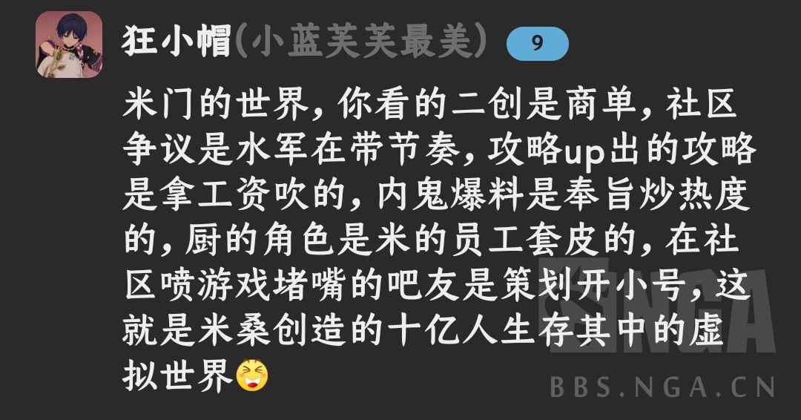

### [不吐不快] 原对世界观的塑造突出一个挖坑不填，高开底走

Made by ngapost2md (c) ludoux [GitHub Repo](https://github.com/ludoux/ngapost2md)

----

##### 0.[0] \<pid:0\> 2023-08-01 22:42:34 by 霞云
有一说一，原刚开服的时候我对他的世界观还是蛮感兴趣的，但现在都三年了，啥都没补充。可莉妈妈，深渊，坎瑞亚书，天理，双子的身世，知道的信息和开服基本没变化，还是说这些都要拖到至冬甚至以后？那我只能说你原的剧情就像个葫芦，突出一个两头粗中间细，而且按现在的文案水平，这葫芦还是空的，毫无底蕴和内涵。还有虚假之天，不会是吃书吃掉了吧？不会吧不会吧？奶嘴都会填坑呢

----

##### 1.[1] \<pid:706347865\> 2023-08-01 22:44:02 by zhengmo？
他不填还显得有逼格，填了那就是云上五骁琼瑶剧

----

##### 2.[0] \<pid:706348086\> 2023-08-01 22:45:24 by UID3563849
编剧情的前后都不是一批人
别人挖的填为什么要我填.jpg

----

##### 3.[0] \<pid:706348177\> 2023-08-01 22:45:57 by 老虎二世
吞掉的设定挺多的，别的不说，看过早期配套漫画《原神Project》(科莱前传)的话，肯定猜不到最后登场的赛诺居然是个只会冷笑话和打牌梗堆叠的小丑吧？
另外3.X版本都结束了，丽莎的须弥留学坑就一点都不填呗，开服4星强度下水道的路人角色不配剧情补完呗？丽莎厨震怒
别提那个皮肤配套的白开水剧情，基本等于什么都没说

----

##### 4.[1] \<pid:706348338\> 2023-08-01 22:46:41 by 0123cola
我觉得原神剧情是在击鼓传锅和击鼓传药，现在不光是须弥全员cos，老角色的身上的药也快被岁没了吧，最后天理入池还不能是反派，信原神能把剧情写好不如信我是秦始皇

----

##### 5.[1] \<pid:706348508\> 2023-08-01 22:47:39 by Cloudrapid133
自从魔女套现实版的结局是女士小丑一样地死在稻妻，华馆套的主人最后找了草神当女友在须弥上大学写论文之后，我的评价是。。。。呕

----

##### 6.[0] \<pid:706348708\> 2023-08-01 22:48:45 by citizenNicole
听说开服那些文案离职了不少，不知道有没有了解的佬可以出来切个瓜。御三家的伏笔有一个算一个全都浪费掉了，安柏爷爷的故事怕是也是要吃书了。
感觉现在卖角色与其说是工业化，不如更像是快消式，只要人设点子有亮点，不管塑造出来的质量和后续内容，一路过来那么多伏笔，真是可惜了。

----

##### 7.[0] \<pid:706349025\> 2023-08-01 22:50:34 by 甲叶
正常，所谓的“群体创作”又都是同一世界下是这样的，不然你看看美漫。。。

何况你米的文案啥水平？猛干这种人能达到美漫那些不出名创作者的下限吗？

----

##### 8.[1] \<pid:706349089\> 2023-08-01 22:50:56 by 被塞抹布后的小号
>[jump](#pid706347865) zhengmo？(2023-08-01 22:44) 说: 
>
>他不填还显得有逼格，填了那就是云上五骁琼瑶剧

别尬黑，琼瑶不是米哈游文案能碰瓷的

----

##### 9.[0] \<pid:706349171\> 2023-08-01 22:51:24 by 霞云
>[jump](#pid706348508) Cloudrapid133(2023-08-01 22:47)说:
>自从魔女套现实版的结局是女士小丑一样地死在稻妻，华馆套的主人最后找了草神当女友在须弥上大学写论文之后，我的评价是。。。。呕

确实，我挺喜欢女士的，还以为每个国家都能遇见她呢，没想到退场的这么草率，还老是被3解cue，现在想想退场早说不定是好事

----

##### 10.[0] \<pid:706349332\> 2023-08-01 22:52:13 by 银霭鸢尾花
我一直很奇怪明明剧情有很多东西能聊啊补充设定的，
为啥不管支线还是小版本活动都劲捣鼓那些大众脸NPC的破事(还有工业化结晶的XX书)，
人物一眼望到头的没成长，出场就在复读标签…是不让说吗还是怎么的，
双子线进度也是慢到绝望(一年出一次，一次一小时的挖坑谜语人时间)

----

##### 11.[0] \<pid:706349672\> 2023-08-01 22:54:03 by zhengmo？
>[jump](#pid706349089) 被塞抹布后的小号(2023-08-01 22:50)说:
>[quote][pid=706347865,37224031,1]Reply[/pid] <b>Post by [uid=65104265]zhengmo？[/uid] (2023-08-01 22:44):</b>  他不填还显得有逼格，填了那就是云上五骁琼瑶剧[/quote]别尬黑，琼瑶不是米哈游文案能碰瓷的[s:ac:哭笑]

我错了，琼瑶剧确实老少咸宜

----

##### 12.[0] \<pid:706349809\> 2023-08-01 22:54:50 by 猫小乐1124
我挺想知道渊下宫的地图设计主导，文案主导，特别是日月前事是谁写的。
他们还在不在米哈游。

顺便问问现在的编剧，还记不记得白夜国馆藏的内容。

----

##### 13.[0] \<pid:706351095\> 2023-08-01 23:02:08 by 老虎二世
>[jump](#pid706348708) citizenNicole(2023-08-01 22:48) 说: 
>
>听说开服那些文案离职了不少，不知道有没有了解的佬可以出来切个瓜。御三家的伏笔有一个算一个全都浪费掉了，安柏爷爷的故事怕是也是要吃书了。
>感觉现在卖角色与其说是工业化，不如更像是快消式，只要人设点子有亮点，不管塑造出来的质量和后续内容，一路过来那么多伏笔，真是可惜了。

而且有一个可怕的趋势：就是人设的点子全是二次元烂梗

----

##### 14.[0] \<pid:706351548\> 2023-08-01 23:04:52 by 羲一望
挖坑不填，作为剧情党，真没耐心再去深挖各种设定，弄到最后估计编剧自己都忘了。
3.3之后的剧情是既没起伏，又没深意，时不时还要被编剧扭曲的三观恶心下

----

##### 15.[0] \<pid:706361940\> 2023-08-02 00:05:59 by forewan
>[jump](#pid706348177) 老虎二世(2023-08-01 22:45) 说: 
>
>吞掉的设定挺多的，别的不说，看过早期配套漫画《原神Project》(科莱前传)的话，肯定猜不到最后登场的赛诺居然是个只会冷笑话和打牌梗堆叠的小丑吧？
>另外3.X版本都结束了，丽莎的须弥留学坑就一点都不填呗，开服4星强度下水道的路人角色不配剧情补完呗？丽莎厨震怒
>别提那个皮肤配套的白开水剧情，基本等于什么都没说

层岩的推荐信这个版本填坑了，填了个什么

明显找补的跑腿任务，学术不能被利益玷污和炒股赚钱做学术，还TMD不如不填

----

##### 16.[0] \<pid:706365639\> 2023-08-02 00:31:35 by 花瓣飘零
写着写着发现玩家脑补的更高明我发现很多长文作者都有这个实力，比如那个1.5w字的

----

##### 17.[0] \<pid:706366391\> 2023-08-02 00:36:47 by setsuna2023
去年我看过一个群像二创，虽然是商单，最后凯亚背影遥望天空岛那一个镜头语言看得我怪惆怅的
3.8我连凯亚邀约都看不下去了，谜语了一堆其实还是什么都没有说，而且又是一种你想多了咱就是个平凡公务员的怪味，安柏人际关系边缘化，丽莎也是，丽莎和赛诺的老师说话是为了卡维邀约卖上一代f4这种烂腐，须弥版本把初期御三家的背景令人遐想之处都毁得差不多了

----

##### 18.[0] \<pid:706367474\> 2023-08-02 00:44:50 by Axcend
>[jump](#pid706349332) 银霭鸢尾花(2023-08-01 22:52) 说: 
>我一直很奇怪明明剧情有很多东西能聊啊补充设定的，
>为啥不管支线还是小版本活动都劲捣鼓那些大众脸NPC的破事(还有工业化结晶的XX书)，
>人物一眼望到头的没成长，出场就......

因为小版本活动要搞限时，不做剧情回顾，逼玩家必须玩不然不能再在游戏里看到/获取对应道具(可以强化拉新/固定新玩家+提老玩家日活)，但因为这样就不能放太多药在小版本活动里，不然对后续拉新不利，就这么死结了

----

##### 19.[0] \<pid:706368125\> 2023-08-02 00:49:45 by 未始有物
看别人一年年周年庆符号矩阵越来越大，情绪调动越来越强，原是符号价值和情绪调动最大的时候是开场，塑造了个寂寞最后把价值都塑造没了还搞了一堆基本加入不了符号矩阵的日抛刀乐npc

----

##### 20.[0] \<pid:706370936\> 2023-08-02 01:13:57 by 银色放逐
想起半年前在原版开贴抱怨角色塑造，提了一句感觉角色档案的文案不是开始那批了，行文风格都有变，被骂了半天被害妄想真不懂难道结晶觉得它米是永远没有人员流动的，连个猜测都听不得？现在各平台都崩口碑只能说应得的

----

##### 21.[0] \<pid:706371552\> 2023-08-02 01:20:12 by 秘密首领
>[jump](#pid706349025) 甲叶(2023-08-01 22:50) 说: 
>
>正常，所谓的“群体创作”又都是同一世界下是这样的，不然你看看美漫。。。
>
>何况你米的文案啥水平？猛干这种人能达到美漫那些不出名创作者的下限吗？

哪怕是死亡金属这样的美漫冥著至少还能当个笑话看，你骂也没人堵嘴，评价为薄纱原神

----

##### 22.[0] \<pid:706371993\> 2023-08-02 01:24:57 by KOUBAKU
當初寫設定挖坑的人跟現在這個寫手怎麼看都是不同人，現在這個寫手只有滿腦子她親愛的兒子，還在須彌上線前把石頭文本全改了，填坑？有她的非親生兒子在遊戲中爽過重要？
至於虛假之天，如果沒猜測錯的話在3.8劇情中已經暗示的挺清楚了，整個提瓦特就跟3.8的瓶子一樣，足跡PV中納塔片段說要告訴旅行者的秘密大概也是這個。

----

##### 23.[0] \<pid:706372781\> 2023-08-02 01:33:45 by 好想上钟离啊
最神奇的是各个角色传说故事都是未完待续，结果现在也就除了岩雷草就一个宵宫有后续

----

##### 24.[0] \<pid:706377949\> 2023-08-02 02:54:08 by sky丁龟
崩铁现在也是这样，之前丹枢引发“哪一方才是真正的正义”的思考，还有丹刃之间的纠葛都把逼格抬得很高，结果这版本都是草草收尾，赛博寸止了属于是

----

##### 25.[0] \<pid:706379288\> 2023-08-02 03:33:18 by 云有时
>[jump](#pid706348177) 老虎二世(2023-08-01 22:45) 说: 
>
>吞掉的设定挺多的，别的不说，看过早期配套漫画《原神Project》(科莱前传)的话，肯定猜不到最后登场的赛诺居然是个只会冷笑话和打牌梗堆叠的小丑吧？
>另外3.X版本都结束了，丽莎的须弥留学坑就一点都不填呗，开服4星强度下水道的路人角色不配剧情补完呗？丽莎厨震怒
>别提那个皮肤配套的白开水剧情，基本等于什么都没说

散兵初登场的时候，其实我这辈子想不到他会成为一个大学生，编剧很牛的，拥有突破常理的想像力.jpg

----

##### 26.[0] \<pid:706385955\> 2023-08-02 07:25:09 by 风之碧海之翠
>[jump](#pid706371993) KOUBAKU(2023-08-02 01:24)说:
>當初寫設定挖坑的人跟現在這個寫手怎麼看都是不同人，現在這個寫手只有滿腦子她親愛的兒子，還在須彌上線前把石頭文本全改了，填坑？有她的非親生兒子在遊戲中爽過重要？ 至於虛假之天，如果沒猜測錯的話在3.8劇情中已經暗示的挺清楚了，整個提瓦特就跟3.8的瓶子一樣，足跡PV中納塔片段說要告訴旅行者的秘密大概也是這個。

咱理查是不是突破虚假之天啦？

----

##### 27.[0] \<pid:706390542\> 2023-08-02 08:09:18 by Cloudrapid133
>[jump](#pid706349171) 霞云(2023-08-01 22:51) 说: 
>
>确实，我挺喜欢女士的，还以为每个国家都能遇见她呢，没想到退场的这么草率，还老是被3解cue，现在想想退场早说不定是好事

那曾经是我最喜欢的成女，曾经想过入池只要外形不变，不管人设怎么小丑我都会给她抽满命的。
有过伤痛过往的成熟御姐真的很让人心疼。更何况本来愚人众执行官前期画饼卖的就是这一口(“我是曾为整个世界所背叛的带伤之狼，我们终将建立谁人都不背弃的新世界”)。

现在？我现在看到“背叛”这个词就反胃，就ptsd。

----

##### 28.[1] \<pid:706392080\> 2023-08-02 08:19:38 by Narinth
设定，世界观这些重要吗？只有被这些骗进来的才觉得重要吧，
补这些又不会直接增加收入，把人骗进来就已经完成目的了，

----

##### 29.[0] \<pid:706393198\> 2023-08-02 08:26:49 by 诸葛老贼
>[jump](#pid706377949) sky丁龟(2023-08-02 02:54) 说: 
>
>崩铁现在也是这样，之前丹枢引发“哪一方才是真正的正义”的思考，还有丹刃之间的纠葛都把逼格抬得很高，结果这版本都是草草收尾，赛博寸止了属于是

说起这个，丹枢明明之前关系这么紧密，这版本剧情见面理都不理你一下，连句话都不说，就对着符玄情绪输出了只能说崩铁确实是用三个月时间走完了原神三年的路，这版本又是主角摄像头化又是搞bgcp，之前看完剧情气得我一晚上没睡着，现在直接退了。还好因为原神没有往里面氪过金，没有氪过金的游戏弃起来就是轻松。

----

##### 30.[0] \<pid:706394529\> 2023-08-02 08:34:25 by 回锅虾糕
感觉就是以前的文案已经润了，现在的文案既没有他的水平，也没想好好延续之前文案写的内容

----

##### 31.[1] \<pid:706424301\> 2023-08-02 10:45:24 by 「Rendez-Vous」
编剧写剧情，犹如沉香练功，总差不多差不多。次次半吊子，最后成品还是半吊子

----

##### 32.[0] \<pid:706432563\> 2023-08-02 11:17:02 by KOUBAKU
>[jump](#pid706385955) 风之碧海之翠(2023-08-02 07:25)说:
><b>Reply to [pid=706371993,37224031,2]Reply[/pid] Post by [uid=62393316]KOUBAKU[/uid] (2023-08-02 01:24)</b>咱理查是不是突破虚假之天啦？  [img]https://img.nga.178.com/attachments/mon_202308/02/l2Q2s-icwlZhT3cSu0-fq.jpg[/img] [img]https://img.nga.178.com/attachments/mon_202308/02/l2Q2s-anfhZhT3cSu0-fq.jpg[/img]

嗯...你可以先從如何自己表達論述開始，加油喔！

