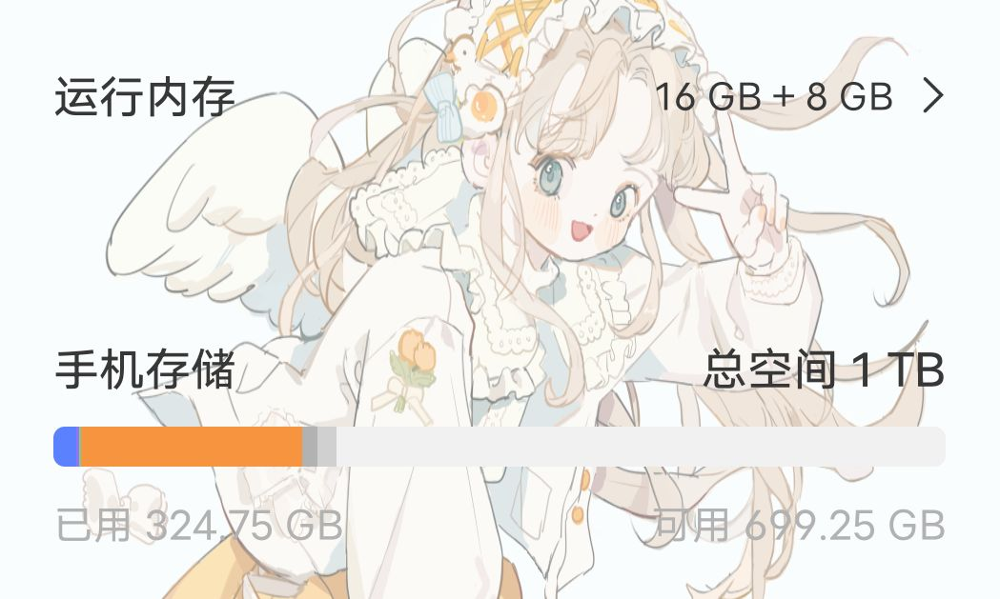

### [不吐不快] 关于我的退坑历程

Made by ngapost2md (c) ludoux [GitHub Repo](https://github.com/ludoux/ngapost2md)

----

##### 0.[0] \<pid:0\> 2023-08-02 02:59:31 by kongbaixyxy
何时有的退坑之心？
3.3开始，该版本的重量级不必多言，但我当初并没有特别气愤，毕竟凡事都要有个过程，就像当初的雷神一 一样，所以我选择沉默外加相信mhy一次(第一次玩mhy家的游戏)，在此之后我便丧失了之前玩原神的热情，大月卡也是我在玩原神之后的第一次断档。
然后3.6的活动剧情粉墨登场，某角色一开始就给了我一个下马威让我立刻血压飙升，当时气的我直接退出了游戏，再之便是两个星期的短暂退游，期间也去看了除b站外的各个社区，如nga，贴吧，mys等(之前仅仅是知道，并未深入游览)，不看不知道，我发现比起玩原神，我更喜欢看原神里面的乐子，为了不变成云玩家我登上原神过完了剧情，不出所料关于某角色依然让我感到恶心甚至连带上了草神，不过这时的我已经无所谓了，主要是看乐子。
3.7应该是我最后一个全勤的版本了，一是因为月卡，二是因为个人比较喜欢打牌，剧情也不多评价(这位姐姐是？创始人是？)
从3.8开始到现在，我只过完了大活动的剧情，没雷点也没爆点，平平淡淡也挺好。说来惭愧，在我与一位朋友闲聊时我吐槽原神(他并不玩原神)的各个方面，基本都是论坛里捞过的了就不再复述，然后我提出想要共享他的steam库(库中游戏众多)，本来是开玩笑说的没成想他却答应了，我也承诺之后请他吃顿饭，在此之前我steam玩的是apex，csgo，命运2等网游，借此机会我去游玩了他库中的“3A”大作。首先那就是鼎鼎大名的老头环了，不得不说确实好玩，现在存档时间已经98个小时依然玩不腻(因为断网steam不计时)，我也向他询问了还有什么好玩的游戏，他也向我推荐了比较火的，比如大镖客2，道德与法治5等等，我也向他借了旷野之息的卡带准备让我吃灰的ns重新启动，游玩期间也曾想过吸引我的到底是什么，思考良久我得出一个结论，我喜欢的是听故事，听别人讲一个魔幻却真实的故事。当这个故事不再吸引我，我便会离去。原神大抵就是这个情况吧，现在月卡估计还有10天结束，但我依然没有上线的动力。
总结：游戏里面不止有原神
ps：社区和论坛还是要逛的，乐子这块不能少

----

##### 1.[0] \<pid:706378896\> 2023-08-02 03:20:18 by 橙子eQAQ
发现老有人喜欢用崩铁踩一捧一，仿佛世界上就只有米家游戏一样，自从3.3，3.6版本过后我就不对这家公司的任何游戏抱有幻想了，从5月开始玩王泪，又陆续玩起了很久没碰过的CF，还有在gayshit无聊透顶的剧情和不能跳过的对话洗礼下，最近开始久违地追番时，再无聊的剧集也看得下去了，反正比O好看(突然发现我的成分真的好复杂

----

##### 2.[0] \<pid:706379567\> 2023-08-02 03:44:33 by 丷南小鸟丷
我3.7开始就停止了大月卡和几乎不上线了，重新玩起了文明6，趁夏促买了群星。

然后觉得，原神算个屁。

----

##### 3.[0] \<pid:706389844\> 2023-08-02 08:04:10 by 小吉祥典王
3.6直接导致我退坑意愿+90%
然后3.7令人无语的打牌剧情直接给我送走了

----

##### 4.[0] \<pid:706391298\> 2023-08-02 08:14:56 by 洛长河
我也是，我突然意识到玩游戏是为了快乐，不是上班打工赚6块钱(60原石)的，捡~~垃圾~~宝箱开一个都是两毛五毛，开月卡就跟签劳动合同似的。。。

然后就彻底退坑了，赛博朋克2077真好玩啊，心烦了就地平线5漫无目的听歌开车，还开始玩ff15(很小的时候看到里面的造型很帅，主要是在家里电视上看了王国之剑，真帅啊，但当时电脑带不起来)，虽然都褒贬不一吧，但我真觉得挺好玩的

玩游戏是放松享受的，不知道是原神变了，还是我变了

----

##### 5.[0] \<pid:706392738\> 2023-08-02 08:23:56 by adsere
>[jump](#pid706378896) 橙子eQAQ(2023-08-02 03:20) 说: 
>
>发现老有人喜欢用崩铁踩一捧一，仿佛世界上就只有米家游戏一样，自从3.3，3.6版本过后我就不对这家公司的任何游戏抱有幻想了，从5月开始玩王泪，又陆续玩起了很久没碰过的CF，还有在gayshit无聊透顶的剧情和不能跳过的对话洗礼下，最近开始久违地追番时，再无聊的剧集也看得下去了，反正比O好看(突然发现我的成分真的好复杂

崩铁？猛干哥就是崩铁文案，直接把我的游玩热情干成了ptsd

----

##### 6.[0] \<pid:706392944\> 2023-08-02 08:25:19 by 拿到了小孩角色卡噜
才发现3.2是我最后一个全勤的版本

----

##### 7.[0] \<pid:706393824\> 2023-08-02 08:30:33 by 月华丛云
喜欢魔幻奇幻故事推荐你两个经典游戏，巫师3和上古卷轴5，这俩游戏支线任务都特别好，一个故事情节好，一个代入感爆表

----

##### 8.[0] \<pid:706397143\> 2023-08-02 08:48:35 by 壬应葵辛周数？
其实我退坑最大原因是因为内存不够了其他的都是其次

----

##### 9.[0] \<pid:706400215\> 2023-08-02 09:02:42 by 两块半大魔王
我也是捡起了吃灰的ns，塞尔达真的好玩，宝可梦也很有趣，最近在沉迷星之卡比，真的是没有对比就没有伤害，三年过去了，你原在游戏本体玩法一点进步都没有，还一直碰瓷塞尔达，配钥匙吗？

----

##### 10.[0] \<pid:706400763\> 2023-08-02 09:05:09 by Inquisit
>[jump](#pid706397143) 壬应葵辛周数？(2023-08-02 08:48) 说: 
>
>其实我退坑最大原因是因为内存不够了其他的都是其次

我就不一样了，我这里有700G内存 但是原宝 这个家没有你的位置了

----

##### 11.[0] \<pid:706403105\> 2023-08-02 09:16:07 by 是大可不是duck
玩法也就那样，几个月体验下来永远在跑地图开宝箱捡垃圾，剧情也是依托。3.6卸载之后用空下来的时间玩了挺多游戏，最近刚打完大逆12幽灵诡计还有三伏，现在在玩逆转3，我为我之前觉得原的剧情还能看，而且在b看完全部活动剧情有些还看了两遍，我之前还觉得未定剧情玩法有意思,我现在就是觉得恶心。
毕竟都是缝的好作品，当然刚开始好玩啦，等自己开始做原创部分的时候，文案策划的依托就出现了，鉴定为什么都缝不好。

----

##### 12.[0] \<pid:706405155\> 2023-08-02 09:25:00 by UID42376165
这边就好看不好玩，全方位的限制就意味着全方位的不痛快，游戏从技术性走向了偶像营销，然后现在剧情和角色设计又都崩了，猛干哥又亲自宣判了角色偶像的死刑，真是妙啊

----

##### 13.[0] \<pid:706406160\> 2023-08-02 09:29:37 by 夕月君
一想到他们公司全是李猛干，并且还打算加大力度嘟玩家嘴，这哪里还玩得下去 

----

##### 14.[0] \<pid:706406917\> 2023-08-02 09:33:03 by smasher401
>[jump](#pid706393824) 月华丛云(2023-08-02 08:30) 说: 
>
>喜欢魔幻奇幻故事推荐你两个经典游戏，巫师3和上古卷轴5，这俩游戏支线任务都特别好，一个故事情节好，一个代入感爆表

请问下这俩steam可以用玩吗？还是需要主机

----

##### 15.[0] \<pid:706409047\> 2023-08-02 09:42:24 by tzl605165670
实不相瞒，20年10月入坑，2.8版本萌生退坑想法，实际退坑时间应该在须弥男性角色大爆发时期。
但至今任务停留在3.1版本，因为实在感觉不到须弥有什么吸引我的地方，高度重复的任务，平平无奇的剧情，失败的草元素草神体系，还有那一堆漫山遍野的神瞳宝箱。
所以里版一直车的剧情实际上我没亲自体验过，都是看来的，只是没想过会这么逆天。
至于散，我从未归的熄星开始就讨厌他了两个原因，第一，装，第二，想杀爷，包括神子把神之眼交给散的那次。
此外，我还是半个幽夜人，当时散在幽夜那叫火得不行，散÷种种跳脸我就不说了，踩女士的尸体沾沾自喜入卡池，结果现在0h真的笑死

----

##### 16.[0] \<pid:706437190\> 2023-08-02 11:34:09 by eddyseptem
我大概是…
原神，玩崩铁，三个月更新两小时主线不能接受
铁令我回想起了8年前玩的轨迹
打创轨去了
沉迷jpg

目前原好几天没做日常，铁上线180
不知道还能不能玩下去(

----

##### 17.[0] \<pid:706437693\> 2023-08-02 11:36:00 by 杜阡陌
感谢猛干哥，这么伟大的编剧成功熄灭了我最后的热情

----

##### 18.[0] \<pid:706442072\> 2023-08-02 11:52:39 by 科莱恩，克怂
其实生活的快乐挺多的，没必要吊死在mhy身上。
游戏二游也不只有他们一家，抛开二游也还有各类生产经营冒险等等，抛开手游还有各种3A大作。哪怕是不想玩游戏了，二次元有番剧，非二次元有电影电视小说等等(起点小说你去一些群里找推荐，很多老作品水平高的不可思议，我被群友推荐了个日常小说，回猫，很厉害，真的，剧情很普通的日常但是就是看的很开心)
真没必要吊死在mhy身上

