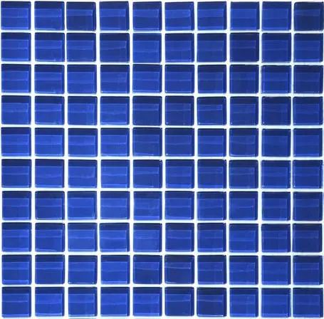
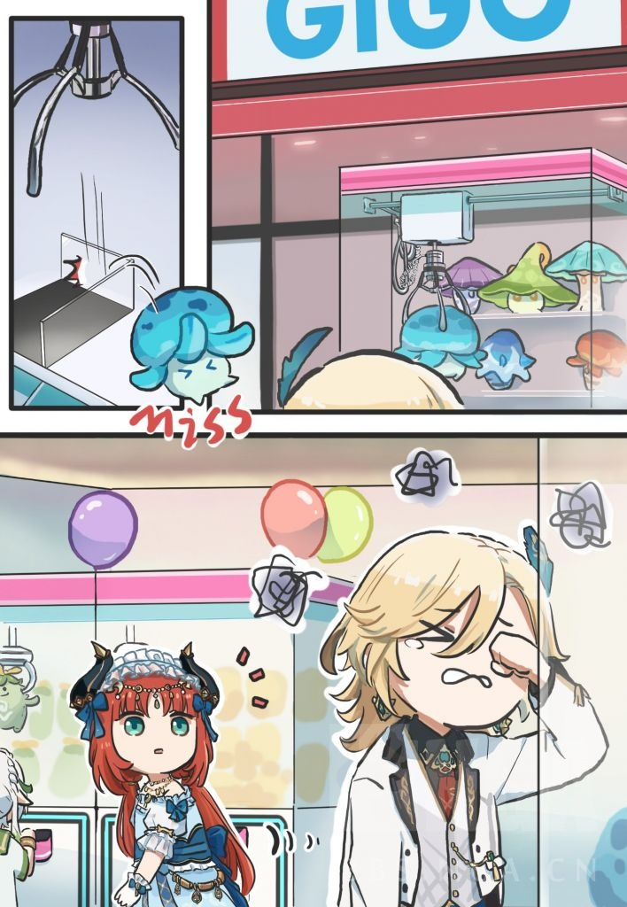
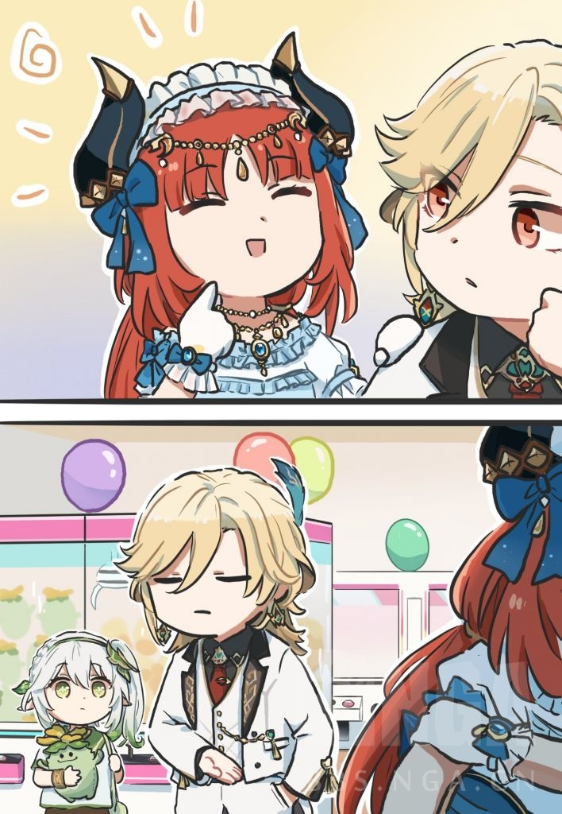
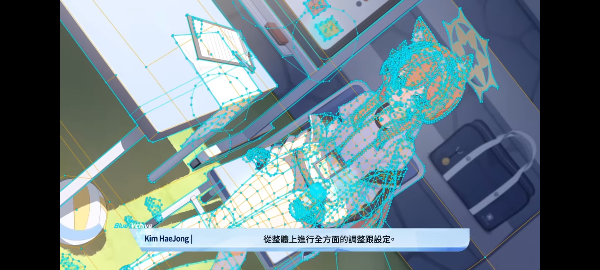

### [不吐不快] 弃坑后玩了一段别的游戏，越来越感觉原现在人物外形设计上真是一言难尽

Made by ngapost2md (c) ludoux [GitHub Repo](https://github.com/ludoux/ngapost2md)

----

##### 0.[0] \<pid:0\> 2023-08-02 10:27:37 by 森罗万象AL
从须弥开始，人物的设计就堆满了各种意义不明的装饰和线条，前面三国好歹还比较克制，须弥和枫丹突出一个意义不明，莫名其妙的装饰莫名其妙的细节，一眼看过去都不知道这东西是个啥材质啥结构。
举俩最简单例子：
珐露珊裙子上的彩色方块，有谁看出来那到底是染的方块颜色，还是方形的类宝石吗？
科莱和小草头上的饰品什么材质？模型上看着是金属的，但不想想金属的不沉吗？须弥可不见得有什么塑料电镀的工艺

相比之下最近在玩的BA就简单多了，全都是日常中常见的东西，突出一个简单，出现在身上不违和，看起来就很轻松，甚至可以直接从衣着看出来阵营，比如千年的外套，格黑娜的军装，阿拜多斯的格子裙
相比之下，同样是学院，须弥那能看出来啥？艾尔海森，卡维，莱依拉，珐露珊，赛诺，这些都是在教令院里的人，为啥别人都穿统一的制服，你们几个这么个性？
丽莎穿新衣服往那一站都比这几个更像教令院的人

----

##### 1.[0] \<pid:706420770\> 2023-08-02 10:31:12 by 小狼全肯定人
大概是须弥教令院有什么针对coser的优惠政策，专门爱招收一些cosplay爱好者

----

##### 2.[2] \<pid:706421222\> 2023-08-02 10:33:10 by 5151208
皮套人穿cos服有什么不对啊

----

##### 3.[1] \<pid:706421445\> 2023-08-02 10:34:06 by kunizu
BA采用简化设计，国内多采取复杂化设计，原神大概在中游偏上，很奇怪的是珐露珊，好像恰巧是设计元素比较简化，也许还更和BA靠近一点？

----

##### 4.[1] \<pid:706422091\> 2023-08-02 10:36:47 by 魑魅魍魉魖魌
珐姐裙子上的透明方块可能是马赛克吧

----

##### 5.[0] \<pid:706422273\> 2023-08-02 10:37:29 by RebbitX
>[jump](#pid706421445) kunizu(2023-08-02 10:34) 说: 
>
>BA采用简化设计，国内多采取复杂化设计，原神大概在中游偏上，很奇怪的是珐露珊，好像恰巧是设计元素比较简化，也许还更和BA靠近一点？

简化有可能是因为她是四星
对比一下你就会发现，五星角色身上的元素堆砌比四星明显得多。

----

##### 6.[0] \<pid:706422788\> 2023-08-02 10:39:34 by qianshuijun2
BA刚在fes七连歪，这个也很难顶，没有井真的别下池子

----

##### 7.[0] \<pid:706422856\> 2023-08-02 10:39:49 by GrossGrass
更糟糕的是原的发型。整个须弥的发型，说夸张，完全没有记忆点，说日常，又没见谁日常理这种头发

----

##### 8.[0] \<pid:706423045\> 2023-08-02 10:40:34 by yoyo12138
你这俩例子举的我一头雾水
二游什么时候可以肉眼鉴定材质了。还是说因为我自己买衣服不怎么区分材质，所以脱节了？

----

##### 9.[0] \<pid:706423055\> 2023-08-02 10:40:36 by 别慌冷静
看看妮露这衣服这饰品复杂的，也就心脏弱老师这么不惜力了，真爱

----

##### 10.[0] \<pid:706423985\> 2023-08-02 10:44:16 by 森罗万象AL
>[jump](#pid706423045) yoyo12138(2023-08-02 10:40) 说: 
>
>你这俩例子举的我一头雾水
>二游什么时候可以肉眼鉴定材质了。还是说因为我自己买衣服不怎么区分材质，所以脱节了？

你看着科莱和小草头上那一坨看起来像金属的大饰品不觉得沉吗？反正我看着就难受

----

##### 11.[0] \<pid:706424025\> 2023-08-02 10:44:24 by 白告姬
草神那个衣服我画了一次就不想再画了，那个头饰画起来也麻烦的要死

----

##### 12.[0] \<pid:706424278\> 2023-08-02 10:45:20 by commodore1280
米家有些不符合逻辑的服装设计，比如隔壁希儿、姬子的大衣，突出一个为设计而设计

----

##### 13.[0] \<pid:706424793\> 2023-08-02 10:47:16 by Torchka123
唉，堆堆堆，不只是米，国内二游卷立绘大方向都是在堆，大众也没啥审美，看着眼花缭乱就夸好看

----

##### 14.[0] \<pid:706425160\> 2023-08-02 10:48:53 by 李孟安的老攻
你原现在的人物设计不就是设圈圣诞树么

----

##### 15.[0] \<pid:706425636\> 2023-08-02 10:50:40 by 蒂莫西
所以我喜欢画四星,,,,,,虽然现在也不画了

----

##### 16.[1] \<pid:706426508\> 2023-08-02 10:54:00 by 森罗万象AL
>[jump](#pid706424793) Torchka123(2023-08-02 10:47) 说: 
>
>唉，堆堆堆，不只是米，国内二游卷立绘大方向都是在堆，大众也没啥审美，看着眼花缭乱就夸好看

确实，堆也算上国内手游目前的通病，但米这个真的是。。。

楼主我也是做设计的，不过是室内，现在不管是行业风向还是客户需求，都在往简单的方向上走，通过点线面个更合理组合提升设计感，通过材料提升品质，所以看现在看原的这些。。。有种十几年前暴发户的美

----

##### 17.[0] \<pid:706428098\> 2023-08-02 10:59:43 by 落檄
这个我早就在跟朋友吐槽了，怕不是全身零零碎碎加起来能有20斤重，更重要的是，早期的设计细碎的地方都在视线边缘，人家都是有明确的主体和视线主要部分的，现在是全身都是细碎，铁道更甚，看得我脑壳痛

想了一下同人画师有点同情，噢人家可能不需要同情，画ba去了

----

##### 18.[0] \<pid:706429767\> 2023-08-02 11:06:04 by Laeditil
论繁琐还是比不上崩三，穿个泳装都鸡零狗碎的挂一身真的很想吐槽新出的装甲，衣块越裁越碎，乍一看像浑身缠满碎布条，知道你们要媚宅所以能掏洞的地方尽量掏洞，可我感觉还不如旧装甲兼顾美观与露出度，始源比不上雷律一根

----

##### 19.[0] \<pid:706430363\> 2023-08-02 11:08:22 by 永遠の蓬莱人形
人设愈来愈没个性，都怀疑是AI生成出来的

----

##### 20.[0] \<pid:706430984\> 2023-08-02 11:10:44 by 哒哒块
我觉得最大败笔是大头大头还不够还要加复杂的头饰

----

##### 21.[0] \<pid:706431362\> 2023-08-02 11:12:17 by 黑蜀黍电动输弹机
你说的判断不出金属还是塑料，实际上是O根本没有材质这个概念，所有服装材料除了会发光的，反射率都是一样的，从刀刃到皮肤到布料，没有高光也没有亚光，光照效果也很敷衍
同一个模型喷高光漆和哑光漆都能做出完全不同的感觉，O整出来一素组，所有的视觉特效全靠堆叠更多的光污染，衣品就是加繁琐细节，怪不得画师不愿画coser不愿出

----

##### 22.[0] \<pid:706432235\> 2023-08-02 11:15:45 by 105104_
米家游戏角色服设无用的堆料太多，原神还好隔壁崩三我真欣赏不来，跟设圈圣诞树差不多

----

##### 23.[0] \<pid:706432895\> 2023-08-02 11:18:17 by 饭醉咸鱼被吃了人
元素堆砌太明显了

----

##### 24.[0] \<pid:706434161\> 2023-08-02 11:23:02 by akanatsu
珐露珊的衣品和她天山童姥的人设完全不搭边的，写她喜欢过气奶奶衣服的文案都没有想过她穿的什么

----

##### 25.[0] \<pid:706434826\> 2023-08-02 11:25:33 by garatea
小提肩膀后面那个圆盘是个啥？不会是他剧情里提到的那个放大镜吧

----

##### 26.[0] \<pid:706435544\> 2023-08-02 11:28:15 by ggt12
可能米哈游的美工也和文案一样“不太受制约”吧……

----

##### 27.[0] \<pid:706436392\> 2023-08-02 11:31:14 by ggt12
>[jump](#pid706430984) 哒哒块(2023-08-02 11:10)说:
>我觉得最大败笔是大头[s:ac:哭笑]大头还不够还要加复杂的头饰

但是日系二次元大眼人设肯定是要大头的，搞油腻师姐八头身才是一脸暴死相。

----

##### 28.[0] \<pid:706436402\> 2023-08-02 11:31:17 by 夭叶舒华
其实对比蒙德和须弥也能发现，蒙德骑士团服饰是统一里带着个性，个性里带着统一，须弥就是个穿个的

----

##### 29.[0] \<pid:706436448\> 2023-08-02 11:31:27 by 雪饼与仙贝
原神的角色设计突出一个光看外形你根本不知道这人性格和背景。里面比较好的，比如我自己就喜欢像芭芭拉那样的设计，能根据着装推测她的身份，也没有过分夸张，所以显得在世界观中不违和。包括迪卢克，也是在日常款式中增加了一些设计，看得出他的贵族身份，以及性格比较沉稳。这些都是好设计。只是这样的设计不多。大多数都是好看归好看，但和身份个性包括世界观都关系不大。

比如须弥教令院那群人有一个看得出来是搞学术的吗包括枫丹那些人，为啥说像vtuber，不就是因为元素一大堆但浮在空中，不像设定世界观下应该有的服设吗？看不出背景，看不出性格，可不就像以人设为主的vtuber吗

----

##### 30.[0] \<pid:706439105\> 2023-08-02 11:41:12 by 哒哒块
>[jump](#pid706436392) ggt12(2023-08-02 11:31) 说: 
>
>但是日系二次元大眼人设肯定是要大头的，搞油腻师姐八头身才是一脸暴死相。

隔壁铁也是日系啊更不用说别的厂了，原神的大头是独一份的

----

##### 31.[0] \<pid:706441439\> 2023-08-02 11:50:15 by xxxxttmm
以前没觉得后来角色一个个都乱七八糟的感觉是在家里封了好多衣料碎块出来的

----

##### 32.[0] \<pid:706442596\> 2023-08-02 11:54:47 by 渐行渐远ii
柯莱的衣服从3.0就想吐槽了，就像小孩穿妈妈衣服，巡林员走在雨林里真的要穿露脚趾的小高跟吗？不怕蚊虫？全身金属装饰+棕色+丝袜真的没有偏中性的小女孩的感觉，中配更是难蚌，全靠日配carry

----

##### 33.[0] \<pid:706443719\> 2023-08-02 11:59:05 by 森罗万象AL
>[jump](#pid706430984) 哒哒块(2023-08-02 11:10) 说: 
>
>我觉得最大败笔是大头大头还不够还要加复杂的头饰

你有没有想过大头才“二次元”。。。

----

##### 34.[0] \<pid:706444497\> 2023-08-02 12:02:10 by 疯子二太郎
>[jump](#pid706420770) 小狼全肯定人(2023-08-02 10:31) 说: 
>
>大概是须弥教令院有什么针对coser的优惠政策，专门爱招收一些cosplay爱好者
>

说白了还是吃了设定，按道理说写写赛诺跟赤王的关系，写写妮露跟花神的关系，写写海哥的背景之类的就能符合角色设计了，结果森林书沙漠书花神书愣是一个一个相关的都没讲，真的离谱，天天让我看npc的故事，问题是我跟那些人又不熟，完全没兴趣看，多讲点能抽到的角色的故事不好吗

----

##### 35.[0] \<pid:706444534\> 2023-08-02 12:02:20 by 森罗万象AL
>[jump](#pid706436448) 雪饼与仙贝(2023-08-02 11:31) 说: 
>
>原神的角色设计突出一个光看外形你根本不知道这人性格和背景。里面比较好的，比如我自己就喜欢像芭芭拉那样的设计，能根据着装推测她的身份，也没有过分夸张，所以显得在世界观中不违和。包括迪卢克，也是在日常款式中增加了一些设计，看得出他的贵族身份，以及性格比较沉稳。这些都是好设计。只是这样的设计不多。大多数都是好看归好看，很酷炫，但和身份个性包括世界观都关系不大。
>
>比如须弥教令院那群人有一个看得出来是搞学术的吗包括枫丹那些人，为啥说像vtuber，不就是因为元素一大堆但浮在空中，不像设

芭芭拉，琴，胡桃，钟离，这些都是比较不错的

----

##### 36.[0] \<pid:706445456\> 2023-08-02 12:05:53 by 哒哒块
>[jump](#pid706443719) 森罗万象AL(2023-08-02 11:59) 说: 
>
>你有没有想过大头才“二次元”。。。
>
>以及你可以去看BA的三头身模型

崩铁被开除二次元了吗

----

##### 37.[0] \<pid:706447098\> 2023-08-02 12:13:00 by sbsx123
>[jump](#pid706445456) 哒哒块(2023-08-02 12:05) 说: 
>
>崩铁被开除二次元了吗

崩铁和ba比哪个二次元难道还用说吗？

----

##### 38.[1] \<pid:706448091\> 2023-08-02 12:17:23 by 转生能成功吗
>[jump](#pid706439105) 哒哒块(2023-08-02 11:41) 说: 
>
>隔壁铁也是日系啊更不用说别的厂了，原神的大头是独一份的

相比崩铁的建模我还是更喜欢原神的，崩铁的建模有一种说不出的怪，感觉线条很生硬锐利，不如原的圆润

----

##### 39.[1] \<pid:706448965\> 2023-08-02 12:21:06 by 剑筑师と書記官
不仅是原神
米的衣服不知道从什么时候开始就越来越不日常，就越来越觉得怪，奇装异服感特别重。

----

##### 40.[0] \<pid:706449453\> 2023-08-02 12:23:20 by 柑橘橙橙橙橙橙子
>[jump](#pid706436402) 夭叶舒华(2023-08-02 11:31) 说: 
>
>其实对比蒙德和须弥也能发现，蒙德骑士团服饰是统一里带着个性，个性里带着统一，须弥就是个穿个的

蒙德的服饰都很贴合人设，琴是骑士团的，就一身制服；丽莎是魔女，就有大帽子；迪卢克是大老板，一身貂皮大衣彰显贵气；班尼特是冒险家，就有古铜色皮肤，创口贴；皇女穿得不像冒险家是因为人家是真·中二病·coser，每个角色穿符合自己身份地位的衣服，做符合自己身份地位的事，须弥就一群穿着奇怪衣服的诡异coser

哦对了，由于丽莎不幸地与须弥扯上关系，现在丽莎也成了穿着奇怪衣服的大姐姐coser了

----

##### 41.[0] \<pid:706450192\> 2023-08-02 12:26:25 by cbgc343
角色的外形和角色的人设是割裂的，你完全不理解这样人设的角色为什么会穿这样的衣服
典中典就是我头像，乡下女学生的人设，穿了一套被怀疑冰神废案的衣服，还带着攻击性极强的指套，请问文案和美术之间没有交流的吗？

----

##### 42.[0] \<pid:706451613\> 2023-08-02 12:34:21 by 谢谢我不喝
你一说别的作品，我就想到哪怕是jojo里，主角团的几个学生也起码能看出那是校服吧
须弥别说统一，连阵营都看不出了，只能拿所谓的临时改剧情去圆
只能说需要这样圆的时候已经输一半了

----

##### 43.[0] \<pid:706451616\> 2023-08-02 12:34:21 by Skalski_
我觉得现在米的人物设计只能用一个词来形容：鸡零狗碎

----

##### 44.[0] \<pid:706452625\> 2023-08-02 12:40:00 by 草右mmm
>[jump](#pid706428098) 落檄(2023-08-02 10:59) 说: 
>
>这个我早就在跟朋友吐槽了，怕不是全身零零碎碎加起来能有20斤重，更重要的是，早期的设计细碎的地方都在视线边缘，人家都是有明确的主体和视线主要部分的，现在是全身都是细碎，铁道更甚，看得我脑壳痛
>
>想了一下同人画师有点同情，噢人家可能不需要同情，画ba去了

整个须弥版本，只有莱依拉这一个角色符合你说的带着开服的美和温迪的设计一个气质，怀疑莱依拉是原神开服大佬或者崩三开服大佬以前画的废案被拉出来了。

单从视觉上看整个外形设计很整体，有梳有密有重点，不靠堆砌靠设计。当然在角色设计和人设的协调统一这一块还是和开服的温迪可莉魈迪卢克这批角色没得比。可以说莱依拉很好看但这个角色做的并不精彩。

别的哪怕是被网友夸好看的草猫和珐露姗都没有，连视觉上都不够吸睛别提更进一步的协调人设了。

----

##### 45.[0] \<pid:706453063\> 2023-08-02 12:42:07 by znfxxh
跟疯了似的追求那个意义不明的不对称设计，看看开服六星再看看现在，毫无氪金欲望…

----

##### 46.[0] \<pid:706453226\> 2023-08-02 12:43:00 by garatea
>[jump](#pid706436448) 雪饼与仙贝(2023-08-02 11:31) 说: 
>
>原神的角色设计突出一个光看外形你根本不知道这人性格和背景。里面比较好的，比如我自己就喜欢像芭芭拉那样的设计，能根据着装推测她的身份，也没有过分夸张，所以显得在世界观中不违和。包括迪卢克，也是在日常款式中增加了一些设计，看得出他的贵族身份，以及性格比较沉稳。这些都是好设计。只是这样的设计不多。大多数都是好看归好看，很酷炫，但和身份个性包括世界观都关系不大。
>
>比如须弥教令院那群人有一个看得出来是搞学术的吗包括枫丹那些人，为啥说像vtuber，不就是因为元素一大堆但浮在空中，不像设

自从看见博士那为了强拗个白大褂结果整成情趣屁帘的造型你就该意识到蒙德人物的设计师早就不在了

----

##### 47.[0] \<pid:706454877\> 2023-08-02 12:51:02 by 雷军单推人
>[jump](#pid706429767) Laeditil(2023-08-02 11:06) 说: 
>
>论繁琐还是比不上崩三，穿个泳装都鸡零狗碎的挂一身真的很想吐槽新出的装甲，衣块越裁越碎，乍一看像浑身缠满碎布条，知道你们要媚宅所以能掏洞的地方尽量掏洞，可我感觉还不如旧装甲兼顾美观与露出度，始源比不上雷律一根

怪不得崩三p站大部分都是r18
因为r18不用画衣服

----

##### 48.[0] \<pid:706456372\> 2023-08-02 12:58:00 by origird
恍惚，好像确实，最初玩的时候做须弥主线看艾尔海森的设计觉着堆砌。为什么现在容忍度变高了，是越来越“幻想”了？一种页游的美
最开始喜欢万叶和心海的简洁设计，之后觉着中间部分的详略得当也不错，现在也很包容须弥、反倒觉着之前喜欢的太空了……
锐评：玩原神玩的

----

##### 49.[0] \<pid:706458878\> 2023-08-02 13:10:00 by 别慌冷静
枫丹那几个角色，我觉得网友锐评很合适——像皮套像Vtuber，就是不像二次元游戏里的人物

反正就是味儿特别诡异

----

##### 50.[0] \<pid:706459021\> 2023-08-02 13:10:43 by TooruW
简单来说就是不爱了

----

##### 51.[0] \<pid:706459792\> 2023-08-02 13:14:30 by 御坂2180号
>[jump](#pid706453063) znfxxh(2023-08-02 12:42) 说: 
>
>跟疯了似的追求那个意义不明的不对称设计，看看开服六星再看看现在，毫无氪金欲望…

这属于是传统了不对成丝袜，腿环，手套，裤子等等

----

##### 52.[0] \<pid:706460087\> 2023-08-02 13:15:54 by 愈创糖浆
隔壁崩3的美术也是一落千丈，虚三家的设计水平也太…………差了，完全是设圈小画家水平

----

##### 53.[0] \<pid:706460239\> 2023-08-02 13:16:38 by UID64544820
这就是工业化的魅力，人设不贴合国家， 配音不适配外观。
一切都是为了卖卡。外观不行就加强数值。
真有点追求， 能搞出夜兰那指甲？

----

##### 54.[1] \<pid:706462076\> 2023-08-02 13:25:58 by 道仰
至今不知道为啥让白术这个设定的病弱慈爱跑两步就咳嗽的医生整一身精神小伙
露肚脐豆豆鞋紫秋裤，泰裤辣

----

##### 55.[0] \<pid:706462471\> 2023-08-02 13:27:56 by 脖子右拧好兄弟
石块排列组合罢了，说不定都不是活人画的

----

##### 57.[0] \<pid:706465443\> 2023-08-02 13:42:52 by lcm68
ba的衣服设计的就是很巧没有过多复杂元素堆积还很好看

----

##### 58.[0] \<pid:706465886\> 2023-08-02 13:45:13 by 透明级
原神有材质区分的啊，虽然就两种，金属和哑光
(可能还有玻璃/塑料片)
纠结是哪种金属实在为难原神匮乏的材质库，它甚至没法区分丝绸棉布和亚麻，即使是凝光理论上价值不菲的旗袍，实际表现也是跟塑料布一样的二次元特供材质。比起材质，还是衣服和人设割裂的问题更严重一点

----

##### 59.[0] \<pid:706466458\> 2023-08-02 13:48:13 by 李猛赣
>[jump](#pid706421445) kunizu(2023-08-02 10:34) 说: 
>
>BA采用简化设计，国内多采取复杂化设计，原神大概在中游偏上，很奇怪的是珐露珊，好像恰巧是设计元素比较简化，也许还更和BA靠近一点？

做减法比做加法，更需要审美和技术，米丧不往角色身上堆料，和绘圈圣诞树一样，马上就暴露出建模水平的垃圾了

----

##### 60.[0] \<pid:706467049\> 2023-08-02 13:51:20 by 信笺2
海的衣服上也有很多元素，当初看考据的时候以为海会有什么特殊身份，结果最后跟我说他就是个普通人，那你堆那么多元素干什么

----

##### 61.[0] \<pid:706471439\> 2023-08-02 14:13:56 by eva_02
不是画画的人可能体会不了，打了很多字都删了
简单来说，原神主要卖的是3D角色，你们觉得简洁美观的服饰设计，做成3D模型会是灾难
2D角色可以画得很简单，因为每一根线条的走向，每一片色块的形状都经过精确的设计，不会动的画面(L2D那种幅度的动画不算)基本不会破坏原有的设计，所以才能将简单的东西做的好看
而3D化之后这些静止的平面设计都破坏掉了(例如绫华联动JK好看，做成3D不敢想)
另外游戏角色还需要有一个剪影辨识度的问题

非要说原神角色设计的问题，我觉得主要是很多角色外观(服设)经常与人设不符，在深入了解角色之前，很难通过外观判断角色大体定位。这一点我仅代表我个人，比较膈应......

----

##### 62.[1] \<pid:706475788\> 2023-08-02 14:35:38 by 森罗万象AL
>[jump](#pid706471439) eva_02(2023-08-02 14:13) 说: 
>
>不是画画的人可能体会不了，打了很多字都删了
>简单来说，原神主要卖的是3D角色，你们觉得简洁美观的服饰设计，做成3D模型会是灾难
>2D角色可以画得很简单，因为每一根线条的走向，每一片色块的形状都经过精确的设计，不会动的画面(L2D那种幅度的动画不算)基本不会破坏原有的设计，所以才能将简单的东西做的好看
>而3D化之后这些静止的平面设计都破坏掉了(例如绫华联动JK好看，做成3D不敢想)
>另外游戏角色还需要有一个剪影辨识度的问题
>
>非要说原神角色设计的问题，我觉得主要是很多角色外观(服设)经常与人设不符

你猜猜我为啥会用BA来举例？因为BA它也有模型啊

就算BA那模型小能说压缩后不明显，你难道不逛街的吗？不逛街那也得找服装参考吧，简单的东西做不好看简直搞笑，一件西服或者旗袍从版型到扣子数量到领口到适配身材，只要这些做好了哪怕是纯色的布料做出来都好看，不好看那就是水平不到位，别找上门“静止的平面设计都破坏掉了”这种借口

还有我是做室内的，我们的东西做出来那可不是动起来看(别说什么人动不算动)，还是个角度全方位身临其中的看，你说做的简单就不好看了？拜托现在做的都是极简，极简做得好那才是厉害，堆料的风格早就淘汰了

室内，平面，服装，现在哪个不是在追求简单的同时彰显设计感，如果你真是美术行业的，那真的只能说多看看其他同行的领域吧，闭门造车走不远

----

##### 63.[0] \<pid:706477446\> 2023-08-02 14:43:34 by uk40184
>[jump](#pid706475788) 森罗万象AL(2023-08-02 14:35)说:
>[quote][pid=706471439,37227867,4]Reply[/pid] <b>Post by [uid=6232421]eva_02[/uid] (2023-08-02 14:13):</b>  不是画画的人可能体会不了，打了很多字都删了 简单来说，原神主要卖的是3D角色，你们觉得简洁美观的服饰设计，做成3D模型会是灾难 2D角色可以画得很简单，因为每一根线条的走向，每一片色块的形状都经过精确的设计，不会动的画面(L2D那种幅度的动画不算)基本不会破坏原有的设计，所以才能将简单的东西做的好看 而3D化之后这些静止的平面设计都破坏掉了(例如绫华联动JK好看，做成3D不敢想) 另外游戏角色还需要有一个剪影辨识度的问题  非要说原神角色设计的问题，我觉得主要是很多角色外观(服设)经常与人设不符[/quote]你猜猜我为啥会用BA来举例？因为BA它也有模型啊  就算BA那模型小能说压缩后不明显，你难道不逛街的吗？不逛街那也得找服装参考吧，简单的东西做不好看简直搞笑，一件西服或者旗袍从版型到扣子数量到领口到适配身材，只要这些做好了哪怕是纯色的布料做出来都好看，不好看那就是水平不到位，别找什么“静止的平面设计都破坏掉了”这种借口  还有我是做室内的，我们的东西做出来那可不是动起来看(别说什么人动不算动)，还是个角度全方位身临其中的看，你说做的简单就不好看了？拜托现在做的都是极简，极简做得好那才是厉害，堆料的风格早就淘汰了  室内，平面，服装，现在哪个不是在追求简单的同时彰显设计感，如果你真是美术行业的，那真的只能说多看看其他同行的领域吧，闭门造车走不远

檔案的也不只2D(幫舉例)

然後O明明是3D建模，卻沒利用在各種地方

----

##### 64.[1] \<pid:706478099\> 2023-08-02 14:46:48 by 神乐苍籁
怎么说呢…我觉得以米的美术水平和审美很难做到ba那样子…只能说由于上限不高保住了下限现在连下限都保不住了…还铁…铁也堆的只是现在看到的几个堆的比较讨巧看起来还行，饮月是直接把所有问题一口气boom了…

----

##### 65.[0] \<pid:706479090\> 2023-08-02 14:51:32 by 叶落寒宵
原神最让我难绷的还是。。。大头娃娃。
妮露，甘雨给我的这样的感觉尤其明显。

----

##### 66.[0] \<pid:706480644\> 2023-08-02 14:59:09 by 你掉的是西瓜还是南瓜
>[jump](#pid706439105) 哒哒块(2023-08-02 11:41) 说: 
>
>隔壁铁也是日系啊更不用说别的厂了，原神的大头是独一份的

其实到底是不是头大，身材比例好不好还是要看成男成女，
BA的少女也是头大窄肩
铁那边只能说……成女好歹能看得出是有肩膀了
原成女真的没肩膀

----

##### 67.[0] \<pid:706483373\> 2023-08-02 15:11:42 by 慕梓菡
>[jump](#pid706471439) eva_02(2023-08-02 14:13) 说: 
>
>不是画画的人可能体会不了，打了很多字都删了
>简单来说，原神主要卖的是3D角色，你们觉得简洁美观的服饰设计，做成3D模型会是灾难
>2D角色可以画得很简单，因为每一根线条的走向，每一片色块的形状都经过精确的设计，不会动的画面(L2D那种幅度的动画不算)基本不会破坏原有的设计，所以才能将简单的东西做的好看
>而3D化之后这些静止的平面设计都破坏掉了(例如绫华联动JK好看，做成3D不敢想)
>另外游戏角色还需要有一个剪影辨识度的问题
>
>非要说原神角色设计的问题，我觉得主要是很多角色外观(服设)经常与人设不符

亲爱的你说这话学产品设计的跟你急哦，简洁不是简单，比例分割是设计里最基础也是最难掌握最考验天赋的不然《红黄蓝》那张画为什么那么经典，哪怕是3d立体建模比例好节奏好的设计照样很养眼

诚然在工业社会简洁的设计更符合社会需求但是原神毕竟是游戏，是游戏那必然要符合这个游戏的需求和设定，如果原神开局就走那种华丽浮夸繁杂的风格，整个游戏都需要这种风格传达信息，那堆砌是符合游戏需要的。但是原神最开始的风格就是简约的，开服的角色个个都是简洁而不简单，很多角色的设计节奏感都很强，角色外观和剧情和人设也能保持一致，这时候再看须弥角色。。。。。。
算了不评价了

----

##### 68.[0] \<pid:706485653\> 2023-08-02 15:22:01 by 月小炎
你拿BA比有点欺负人了
BA的人设，闪彩的构图
我觉得都算得上业界教科书水平级别了

----

##### 69.[0] \<pid:706486429\> 2023-08-02 15:25:23 by gtmmd
我也一直有种感觉，国内画角色就是喜欢往浮夸里画，一定要张扬、要酷炫霸气、要做整条街最靓的崽。
但是很多日式二游的角色设计，不会那么浮夸。(除了某些路线鲜明，就是要狠狠激发荷尔蒙的风格)
拿和服浴衣举例，味儿正的二游里的和服角色的形象设计，就是你去日本街上真的能看到这么穿的人，不是coser。我喜欢这种“朴素”的设计，而不是一个个画的跟花魁大选一样

----

##### 70.[0] \<pid:706489268\> 2023-08-02 15:38:11 by inyourisland
不会设计只会堆砌元素就会变成这样

----

##### 73.[0] \<pid:706494862\> 2023-08-02 16:02:49 by 黑蜀黍电动输弹机
>[jump](#pid706465886) 透明级(2023-08-02 13:45):

去武器面板看一把剑，注意看模型边缘，剑刃和剑脊一样是油光锃亮的……行
护手也是油光锃亮的……就当你磨过了吧
手柄还是油光锃亮的……手柄不缠胶或者缠布真的能握？
法器里的书，书钉还是油光锃亮的……以及书皮和书页
如果没有贴图，完全没法从反光判断材质究竟是人体、头发、石头、木头、布料还是金属。更别提金属贵贱、布匹种类了
可能这就是塑料感的根本由来吧

再问一个问题，隔壁帕姆的耳朵是毛的还是光的

----

##### 74.[0] \<pid:706495367\> 2023-08-02 16:05:11 by keiyoku
说点叛逆的话
你游五星成男都还行，女性角色除了稻妻和开服几个+甘雨其他都…………吉尔一动不动

----

##### 75.[0] \<pid:706504166\> 2023-08-02 16:43:52 by hhh1232123
原还算好，至少总体上是卡通又圆润的
看看隔壁的铁，比如希儿和希露瓦的衣服，真是多看一眼就会爆炸，我都不知道同人画手该如何下笔

----

##### 76.[0] \<pid:706510910\> 2023-08-02 17:13:30 by 眼中血
隔壁做主线希儿和布洛尼亚站一起的时候眼都要瞎了。

----

##### 77.[0] \<pid:706523916\> 2023-08-02 18:12:48 by 黎舟霁
你才发现啊

----

##### 78.[0] \<pid:706530450\> 2023-08-02 18:44:17 by 森罗万象AL
>[jump](#pid706523916) 黎舟霁(2023-08-02 18:12) 说: 
>
>你才发现啊

很早就发现了，只是感觉现在的更严重了，当初崩3没玩下去就是那个美术不喜欢，原一开始要好不少的，相对来说克制了很多

----

##### 79.[0] \<pid:706544165\> 2023-08-02 19:54:10 by milieudelanuit
>[jump](#pid706429767) Laeditil(2023-08-02 11:06) 说: 
>
>论繁琐还是比不上崩三，穿个泳装都鸡零狗碎的挂一身真的很想吐槽新出的装甲，衣块越裁越碎，乍一看像浑身缠满碎布条，知道你们要媚宅所以能掏洞的地方尽量掏洞，可我感觉还不如旧装甲兼顾美观与露出度，始源比不上雷律一根

太真实了，本来想摸一张琪猫猫的图，结果仔细一看wc怎么这么多莫名其妙，不看都注意不到的无意义小细节。比如说头发上就有至少5个不同的装饰，还是复杂的那种，后面本来以为是简单爽快的单马尾，结果头发扎成个发髻带双马尾，头都爆炸了。然后看了一下p站，哦难怪没多少人画

----

##### 80.[0] \<pid:706547282\> 2023-08-02 20:13:00 by eva_02
>[jump](#pid706475788) 森罗万象AL(2023-08-02 14:35) 说: 
>
>你猜猜我为啥会用BA来举例？因为BA它也有模型啊
>
>就算BA那模型小能说压缩后不明显，你难道不逛街的吗？不逛街那也得找服装参考吧，简单的东西做不好看简直搞笑，一件西服或者旗袍从版型到扣子数量到领口到适配身材，只要这些做好了哪怕是纯色的布料做出来都好看，不好看那就是水平不到位，别找什么“静止的平面设计都破坏掉了”这种借口
>
>还有我是做室内的，我们的东西做出来那可不是动起来看(别说什么人动不算动)，还是个角度全方位身临其中的看，你说做的简单就不好看了？拜托现在做的都是极简，极简做得好那才是厉害，堆料

恰好我接单的方向之一就是游戏人设和小场景，不过没有概设那么高端
我觉得你根本没理解我前一楼说的意思，解释多了只会带来无意义的拉扯抬杠。就简单想象一下，你认为很高级的，极简的西服和旗袍，做成游戏(主要是原神这类二游)模型，是什么样子吧
隔行如隔山，我觉得你没法拿现代风格的东西去套一个奇幻风格的游戏，连我这个外行都知道高端的极简室内都需要作出材质区分的，材质单调(或者廉价)了一样low。现代服饰也是如此，同一款剪裁，用高端和地摊布料做出来就是两个故事
更何况是二次元风格的游戏，根本没法表现不同的质感细节，基本都是纯色块，贴图画出来的纹理和游戏引擎渲染出来的材质，视觉表现上差得不是一点半点。所以只能做平面构成上的切割，这是对渲染引擎的妥协。举个泥潭可能看不上的，最近小火的换装游戏以闪，它的现代装就很好看(反而是幻想风格的衣服显得太冗杂)，材质丰富且细腻，即使一件素色的裙子也很有设计感，但我无法想象这条裙子放在二游的模型里是什么样子，因为二次元风格的模型除了简单的色块，根本无法还原其他细节。
游戏美术里的一些无意义的繁复堆砌，大部分是为了3D效果更好实现而做的妥协，如果只是L2D或者纯立绘，就不需要考虑这么多，可以通过画法构图来把简单的东西做好看，经验丰富的美宣画师可以把一件白T画的很好看，但我不认为一件白T模型可以做成皮肤拿出来卖钱。这就是我上一楼说的模型动起来会破坏设计图(2D美术设计)的构成，导致整个模型很单调。你室内软件渲染图和实际完工效果不会相差很远(不然客户不会验收吧)，但游戏设计图、立绘、3D模型、实机效果之间都可能是天壤之别。

----

##### 81.[0] \<pid:706548460\> 2023-08-02 20:19:28 by mASAYUMecHASIN
有次认真观察了少女的身体比例，头跟肩差不多宽度，真吓人，从此不敢细看人物比例

----

##### 82.[0] \<pid:706548655\> 2023-08-02 20:20:38 by Collapsar。
论堆砌元素集大成者，绫华皮肤不得不品。

可以数数，她这身塞了多少蝴蝶结，蕾丝，花花。
光看脑袋，就做了编发，还戴帽子，帽子上有花和丝带，编发上也有花有蝴蝶。冗余到不忍直视。
配色之“刻板印象少女粉蓝紫调色盘”糊身上，再来一个完全不搭边的棕色靴子。
靴子上还不忘塞个粉色蝴蝶，和袜子上的粉色花纹堆在一起。

你原的美术连个正经的学都没上过吗？
但凡学过色彩搭配和设计基础，能搞出这种设计？

----

##### 83.[0] \<pid:706551359\> 2023-08-02 20:37:18 by 森罗万象AL
>[jump](#pid706548655) Collapsar。(2023-08-02 20:20) 说: 
>
>论堆砌元素集大成者，绫华皮肤不得不品。
>
>可以数数，她这身塞了多少蝴蝶结，蕾丝，花花。
>光看脑袋，就做了编发，还戴帽子，帽子上有花和丝带，编发上也有花有蝴蝶。冗余到不忍直视。
>配色之“刻板印象少女粉蓝紫调色盘”糊身上，再来一个完全不搭边的棕色靴子。
>靴子上还不忘塞个粉色蝴蝶，和袜子上的粉色花纹堆在一起。
>
>Amazing，你原的美术连个正经的大学都没上过吗？
>但凡学过色彩搭配和设计基础，能搞出这种玩意？

这还算好的了，起码都知道每个东西是啥

----

##### 84.[0] \<pid:706551949\> 2023-08-02 20:41:09 by 須賀悠衣
>[jump](#pid706475788) 森罗万象AL(2023-08-02 14:35):

马娘ip啥的也都是简洁好看有特点的3d模型，水平不行再怎么长篇大论找补也还是水平不行

----

##### 85.[1] \<pid:706553167\> 2023-08-02 20:48:39 by 夕音子
就是堆一些自己都不懂的东西，不管是人设还是文案

----

##### 86.[0] \<pid:706553379\> 2023-08-02 20:49:55 by 咕哒阳
最想吐槽的是草神那个羽毛球裙子的骨架，为什么会有金属一样的光泽啊那是能穿的衣服吗
尤其她待机动作还是坐下，已经有操控金属级别的能力了

----

##### 87.[0] \<pid:706556064\> 2023-08-02 21:06:47 by 花夹饼
珐露珊那个裙子，看着像是彩窗的设计，彩窗很好看的，光透过去的那种华丽感很美
至于这个彩窗裙摆是什么材质重不重跟上半身素色少装饰的设计搭不搭和她人设相不相符嘛。。。

