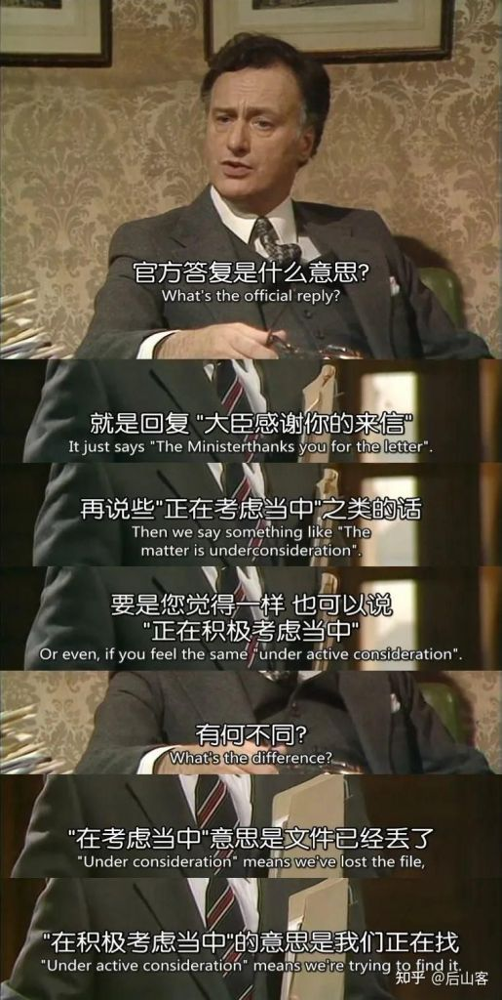

### [不吐不快]我忽然觉得，枫丹可能不是不想改，而是没办法改了

Made by ngapost2md (c) ludoux [GitHub Repo](https://github.com/ludoux/ngapost2md)

----

##### 0.[0] \<pid:0\> 2023-08-02 10:43:29 by 和光同尘0909
经过0h后，米很可能意识到了方向上的问题，但是他现在很可能已经无法回头了。
我们看崩三时期就是姐姐骗氪然后全力投入开发原神，那原是否也是一样的。原的收入也全都被用来开发新游，优化也全部都优化到新游上。旧游戏拿来骗氪，新游戏来优化。
米的新游之所以会有很大的技术突破是否就是因为这样的一种赌徒一样的手法。换言之因为他这样的职场赌徒的行为和想法加上他天天工业化的生产内容导致他实际上已经尾大不掉周转不灵。他已经没有余力来对枫丹进行修改了 他很可能已经把原赚的钱多开到了很多别的项目里，导致现在想改已经没有足够的人和钱了。
假使果真如此那这样的一个职场赌徒一旦遭遇资金链断裂或者卡顿都将会是灭顶之灾。
不过这跟我们有什么关系呢，也就只有米哈游厨才会关心吧。

----

##### 1.[0] \<pid:706424072\> 2023-08-02 10:44:34 by guangyao6123
项目管理绝非易事，船越大越不好掉头

----

##### 2.[1] \<pid:706424248\> 2023-08-02 10:45:13 by gtgce
反正后果都是米自己买单

----

##### 3.[2] \<pid:706424344\> 2023-08-02 10:45:35 by 不织围脖
我记得以前知乎上结晶吹的就是，拿崩崩崩赚来的钱倾尽所有做出一个原神，孤注一掷，有魄力

----

##### 4.[0] \<pid:706424478\> 2023-08-02 10:46:01 by limengan全手动爆典机
那可太好了，改了就没有大乐子了

----

##### 5.[2] \<pid:706424511\> 2023-08-02 10:46:08 by Nimbus純水100
就跟做问卷一样
第一阶段，我们宣称那些都是无用的噪音和刻薄的攻讦
第二阶段，说也许矛盾已经激化了，但让我们看看接下来会发生什么
第三阶段，怎么有人说我们不屑于跟玩家互动？也许我们该有所行动，就用问卷来平息一下事态吧
第四阶段，或许问卷能起到什么作用，但是对于已经定好的大版本来说已经太迟了
extra.选几个在直播平台论坛社区和问卷中言辞比较激烈的幸运儿到新地图站岗。

----

##### 6.[0] \<pid:706424620\> 2023-08-02 10:46:35 by 宣无邪
原的收入全部拿来开发新游，那米的公司规模再扩个十倍差不多

----

##### 7.[0] \<pid:706424674\> 2023-08-02 10:46:47 by 龙澂
工业化不止是生产的流水线配合，米的品控显然出了问题

----

##### 8.[0] \<pid:706424723\> 2023-08-02 10:47:00 by muziqiduan
那活该，有人拿刀逼他们这么干么。。
作为玩家，自己给游戏花的钱是希望他们能好好做自己正在玩的这款游戏的，哪怕分些出去也不要割这款游戏的大动脉，结果他们拿去干其他事情，你不心疼自己花的钱打了水漂心疼他们？

----

##### 9.[5] \<pid:706424755\> 2023-08-02 10:47:09 by 0摸了
你好，是第三阶段呢

----

##### 10.[5] \<pid:706424805\> 2023-08-02 10:47:18 by 药师鬼
3.3开始，每隔一段时间就有人说改不了了……
所以呢？

----

##### 11.[0] \<pid:706424930\> 2023-08-02 10:47:52 by cbzmxx
很难改？那就别改了呗。反正who care 呢？

----

##### 12.[2] \<pid:706424969\> 2023-08-02 10:48:03 by rindunica
有没有一种可能，当他们半年或一年前确定自己的制作方向时就已经是傲慢得没救了
轮不到我们现在看他们迷途知返~~实际上死不悔改~~来心疼

----

##### 13.[2] \<pid:706425020\> 2023-08-02 10:48:16 by lng236
大伟自己不都说了有大公司病么，没人敢担责没人敢指出问题，只能一条路走到死不撞南墙不回头。就算他真的想改也没时间改了，枫丹的内容估计半年前就做好了，现在的话估计起码4.1的配音什么的都已配完了

----

##### 14.[1] \<pid:706425030\> 2023-08-02 10:48:20 by UID3563849
所以秘不发丧啊
刚刚他又发座谈会了，说的东西都是已知的，突出一个屁用没有
为4.0预热不会就用这个吧？看笑了都

----

##### 15.[0] \<pid:706425081\> 2023-08-02 10:48:35 by GrossGrass
改是可以改的，只是想不想的问题。
如果明确了怎么改，并且把修改作为第一优先级，几天时间就能改出来。
玩家或许会发现改动的痕迹，但是改动本身就是一种真诚，玩家是不会苛责的。
以此为借口不改才是傲慢。

----

##### 16.[0] \<pid:706425095\> 2023-08-02 10:48:39 by 梓川枫丶
赚的钱都去买豪车别墅了吧，崩铁就一纯换皮原神，看不出需要多少开发费用

----

##### 17.[0] \<pid:706425203\> 2023-08-02 10:49:02 by wyvern0315
>[jump](#pid706424805) 药师鬼(2023-08-02 10:47) 说: 
>
>3.3开始，每隔一段时间就有人说改不了了……
>所以呢？

流水爆炸就是他米的福报啊，可惜降的还不够多，再腰斩两次才差不多。

----

##### 18.[0] \<pid:706425225\> 2023-08-02 10:49:08 by 燐Rin
有没有一种可能，米觉得没问题不需要改，花点钱加强下社区管控就行了

----

##### 19.[1] \<pid:706425255\> 2023-08-02 10:49:15 by 音羽城
笑话，问题又不是3.8才出现的，之前版本的反馈意见全当噪音扔进垃圾桶是吧

----

##### 20.[0] \<pid:706425302\> 2023-08-02 10:49:25 by UID42376165
不会，账户上钱多得是，现在很可能的是来不及更改了。

----

##### 21.[1] \<pid:706425334\> 2023-08-02 10:49:32 by 伤逝遐汐
3.8阴阳不是挺快么，隔壁缝梗不是挺快么

----

##### 22.[0] \<pid:706425435\> 2023-08-02 10:49:55 by 风之碧海之翠
别荒，切午餐肉呢

----

##### 25.[1] \<pid:706425704\> 2023-08-02 10:50:56 by 四洲鱼蛋
>[jump](#pid706424620) 宣无邪(2023-08-02 10:46) 说: 
>
>原的收入全部拿来开发新游，那米的公司规模再扩个十倍差不多

不如那经费投入去加强社区管理和各大论坛网站宣发，只要没人说，剧情烂就没有人知道。
这招，无用。

----

##### 26.[2] \<pid:706425933\> 2023-08-02 10:51:49 by adsere
>[jump](#pid706424511) Nimbus純水100(2023-08-02 10:46) 说: 
>
>就跟做问卷一样
>第一阶段，我们宣称那些都是无用的噪音和刻薄的攻讦
>第二阶段，说也许矛盾已经激化了，但让我们看看接下来会发生什么
>第三阶段，怎么有人说我们不屑于跟玩家互动？也许我们该有所行动，就用问卷来平息一下事态吧
>第四阶段，或许问卷能起到什么作用，但是对于已经定好的大版本来说已经太迟了
>extra.选几个在直播平台论坛社区和问卷中言辞比较激烈的幸运儿到新地图站岗。

----

##### 27.[0] \<pid:706426243\> 2023-08-02 10:53:04 by 药师鬼
>[jump](#pid706425203) wyvern0315(2023-08-02 10:49) 说: 
>
>流水爆炸就是他米的福报啊，可惜降的还不够多，再腰斩两次才差不多。

赚了那么多钱，那么多人的大公司，几个月了，真改不了吗？
都是打工人，谁家公司没有为了客户临时加班加点改方案的时候啊？
确实还是赚太多。

----

##### 28.[1] \<pid:706426560\> 2023-08-02 10:54:11 by 未始有物
工业化就是给自己脸上贴金，工业化应该是改的更快，深圳出个什么新产品是分分钟的，工业化也是有严格安全生产守则的，不是什么“不受限制好爽”，而且工业化一定是有冗余备份小步快跑的，调方向这种不做备份就开始走量生产一堆库存了不是自己找死么

----

##### 29.[0] \<pid:706427040\> 2023-08-02 10:55:55 by 阿来
3.3就开始没法该，没法改到3.8了，每次我看见有人说没法改了我就想笑

----

##### 30.[0] \<pid:706427073\> 2023-08-02 10:56:01 by lllililylaly
改啥啊，不是要看“女玩家抓心挠肝”吗，不受约束，放飞理想，坚持自我，加油！

----

##### 31.[1] \<pid:706427261\> 2023-08-02 10:56:40 by Skalski_
3.3时说3.6改不了，3.6时说3.8改不了，4.快到了直接整个枫丹都改不了了

然而3.8的夏活里还能做进去假编剧和各种yygq呢，这个时候不说改不了啦

----

##### 32.[0] \<pid:706427291\> 2023-08-02 10:56:48 by Shem_ha
这个基本上是肯定的
大版本开发排期基本是按年计算，加上普测服就是一年两个月以上，换言之如果真是大方向问题，3.8的反馈可能要5.1才能看到个结果
当然他可以对未来内容做点相对小的修改，但是每个修改落实到打工人手上都是加班时长，而且朝令夕改加上缺乏时间打磨，最终出来产品质量恐怕不能尽如人意
总之如果真是大方向问题，那我觉得米厂干什么都是错的了

----

##### 33.[0] \<pid:706427432\> 2023-08-02 10:57:17 by 李孟安的老攻
你说得对但是假编剧.jpg

----

##### 34.[0] \<pid:706427665\> 2023-08-02 10:58:05 by 口害
是大臣简直就是人类文化瑰宝啊

----

##### 35.[0] \<pid:706427716\> 2023-08-02 10:58:17 by 科莱恩，克怂
>[jump](#pid706424511) Nimbus純水100(2023-08-02 10:46) 说: 
>
>就跟做问卷一样
>第一阶段，我们宣称那些都是无用的噪音和刻薄的攻讦
>第二阶段，说也许矛盾已经激化了，但让我们看看接下来会发生什么
>第三阶段，怎么有人说我们不屑于跟玩家互动？也许我们该有所行动，就用问卷来平息一下事态吧
>第四阶段，或许问卷能起到什么作用，但是对于已经定好的大版本来说已经太迟了
>extra.选几个在直播平台论坛社区和问卷中言辞比较激烈的幸运儿到新地图站岗。

只是出自(是！首相)吧，这个真的太经典了

----

##### 36.[0] \<pid:706428552\> 2023-08-02 11:01:27 by Torchka123
改？这事很重要吗？
有问题就捂嘴，捂不住了就提纯，
没准还巴不得咱都退游，不然mengan看厕所还要提心吊胆

----

##### 38.[0] \<pid:706430340\> 2023-08-02 11:08:16 by 无意识koishi
洗地 接着洗地

----

##### 39.[0] \<pid:706431056\> 2023-08-02 11:11:01 by cbzmxx
问就是没时间改，它连挽回玩家的信心都觉得费时间了，那还有什么是值当的呢？估计还是搞NPC出来阴阳怪气两句吧

----

##### 40.[1] \<pid:706431284\> 2023-08-02 11:12:00 by 南翎
到了3.8才明白
这叫不撞南墙不回头，不见黄河心不死
那么多可以改的机会那么长的时间有动弹过吗？反馈到流水这个核心上了终于知道自己错了？
顺便一提，他们真的知道自己有问题了吗？我看不见得，这发布的那些边角料改动真有什么实际效果吗？不还是把玩家当猴耍？重点问题一点没提啊

----

##### 41.[0] \<pid:706432294\> 2023-08-02 11:16:02 by 0123cola
3.3 3.4肯定来得及改，3.6的时候也许是来不及改大的但是可以补救一下，但是3.8ep暗戳戳塞个小草神他们之前怕不是就没想改，现在新建文件夹黄花菜都凉了

----

##### 42.[0] \<pid:706432736\> 2023-08-02 11:17:42 by akanatsu
改不了那就别做了吧，原地解散不也挺好

----

##### 43.[0] \<pid:706432856\> 2023-08-02 11:18:05 by usfdocb
但凡有点脑子和敏感性在3.3就该意识到了，又不是没人反馈过剧情问题，大半年的时间，就算推翻重来不现实，打打补丁填填坑总行吧？非要搞不见棺材不落泪那套不是活该

