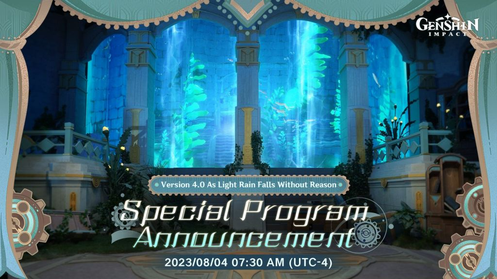

### [热点事件] 谁来翻译翻译

Made by ngapost2md (c) ludoux [GitHub Repo](https://github.com/ludoux/ngapost2md)

----

##### 0.[0] \<pid:0\> 2023-08-02 12:22:20 by 无名的弗朗西斯
前瞻的标题就是主线名吧？听起来和千朵玫瑰带来的黎明一样意味不明、狗p不通呢

----

##### 1.[0] \<pid:706449388\> 2023-08-02 12:23:01 by 懂不懂薄纱啊
喷了，________

----

##### 2.[0] \<pid:706449560\> 2023-08-02 12:23:49 by UID3563849
译文：有人要哭了

----

##### 3.[4] \<pid:706449675\> 2023-08-02 12:24:17 by 可恶，长个锤子
有种……文盲的美

----

##### 4.[0] \<pid:706449821\> 2023-08-02 12:24:51 by 哈人哈人太哈人了
什么狗屁不通的
他念出来不觉得拗口吗

----

##### 5.[0] \<pid:706449858\> 2023-08-02 12:25:00 by 何可守
>[jump](#pid706449560) UID3563849(2023-08-02 12:23) 说: 
>
>译文：有人要哭了

领带美元

----

##### 6.[3] \<pid:706449923\> 2023-08-02 12:25:17 by OTZ链球菌
>[jump](#pid706449560) UID3563849(2023-08-02 12:23) 说: 
>
>译文：有人要哭了

那得是大到暴雨才行吧，轻雨说明赔钱货赔得还不够多

----

##### 7.[0] \<pid:706450017\> 2023-08-02 12:25:41 by 风起微渺
就像无缘无故的哭泣？

----

##### 8.[2] \<pid:706450026\> 2023-08-02 12:25:43 by もいです
像没由头来的小雨不过这写法感觉还没走出日轻翻译

----

##### 9.[1] \<pid:706450040\> 2023-08-02 12:25:49 by tsl19860824
我来翻一下 就是
“目前的节奏就像没有任何理由就飘下来的毛毛细雨，无伤大雅，毫无影响，我们会自信的在继续作死的道路上越行越远”

----

##### 10.[0] \<pid:706450100\> 2023-08-02 12:26:07 by 剑筑师と書記官
(米哈游的眼泪)仿如无(流水的)因(论派学员)(被厕妹吹)飘(而)落(得个0h)的轻雨

----

##### 11.[0] \<pid:706450165\> 2023-08-02 12:26:20 by 碎银酿普洱
有股厕妹的臭味
平常正确的错误的大胆的无因的飘落的哀嚎的写多了脑子是会转不过弯

----

##### 12.[0] \<pid:706450230\> 2023-08-02 12:26:34 by 这游戏真给我整沉默了
轻雨指的应该是某人脸上缓缓留下的滚烫热泪吧

----

##### 13.[1] \<pid:706450291\> 2023-08-02 12:26:49 by --致秋
读不通的话，先看看日文吧

----

##### 14.[0] \<pid:706450342\> 2023-08-02 12:27:02 by 大饼卷馒头就着稀饭吃
玩之前:哇哇好有意思，究竟是什么样的剧情呢？
看过无数剧情后:经典文青无病呻吟

----

##### 15.[0] \<pid:706450354\> 2023-08-02 12:27:06 by 白商陆
中译中：好像要下小雨了
再译：天呐，又有乱七八糟的剧情了

----

##### 16.[0] \<pid:706450355\> 2023-08-02 12:27:06 by 万岁玛利亚
千朵玫瑰带来的黎明至少是易读的，意象是美的，虽然喻义是什么大家暂且蒙在鼓里
这个就

----

##### 17.[1] \<pid:706450434\> 2023-08-02 12:27:28 by 剑筑师と書記官
>[jump](#pid706449923) OTZ链球菌(2023-08-02 12:25) 说: 
>
>那得是大到暴雨才行吧，轻雨说明赔钱货赔得还不够多

别说了，华北最近雨还不够大吗

----

##### 18.[3] \<pid:706450440\> 2023-08-02 12:27:30 by 红豆薏米汤圆
所以感觉这个枫丹剧情也没啥可期待的了...也就和须弥后半差不多

----

##### 19.[0] \<pid:706450593\> 2023-08-02 12:28:06 by tut485
翻译：就像没有理由便降下的小雨
反正米哈游就喜欢显摆自己的文学素养，习惯了

----

##### 21.[1] \<pid:706450829\> 2023-08-02 12:29:27 by infineon-
像极了初中时，班上喜欢什么郭敬明之流的女同学，写出的狗屁不通的作文。。。

----

##### 22.[8] \<pid:706450850\> 2023-08-02 12:29:35 by 御坂2180号
米哈游的文案果然是日本毕业高材生这股物哀味

----

##### 23.[1] \<pid:706450900\> 2023-08-02 12:29:51 by 甲李汪巳华童
就像无因飘落的细雨一样
那么就不是无端飘落的细雨，因为是就像
得出结论，水神要人工降雨

----

##### 24.[2] \<pid:706451038\> 2023-08-02 12:30:33 by Nimbus純水100
#刘伟座谈会雨夜狂飙#

----

##### 25.[0] \<pid:706451070\> 2023-08-02 12:30:44 by 廓尔克蜀黍
按照我的生活经验，这是被楼上浇花的人淋到了

----

##### 26.[0] \<pid:706451108\> 2023-08-02 12:30:54 by 燐Rin
看看日语怎么写呗

----

##### 27.[0] \<pid:706451159\> 2023-08-02 12:31:11 by 十一月四日风
我猜是表达没有根基，无依无靠的意思？猜错了不负责

----

##### 28.[0] \<pid:706451287\> 2023-08-02 12:31:56 by 未薇HAO
这个标题跟天气预报一样，不就是突然下雨吗

----

##### 29.[0] \<pid:706451308\> 2023-08-02 12:32:06 by 水晶包袱锤
什么青春疼痛文学式版本名

----

##### 30.[1] \<pid:706451332\> 2023-08-02 12:32:16 by lkjzxm
又是猛干哥的哪个兄弟玉玉了

----

##### 31.[0] \<pid:706451338\> 2023-08-02 12:32:18 by OTZ链球菌
>[jump](#pid706450434) 剑筑师と書記官(2023-08-02 12:27) 说: 
>
>别说了，华北最近雨还不够大吗

额，我在说“哭”的程度，你在说啥

----

##### 32.[0] \<pid:706451370\> 2023-08-02 12:32:36 by 老鼠戏橘猫
1.时间改成7点半
2.名字格式像普通版本而不是前两次“新版本前瞻节目”
推测：
1.节目时间可能钓长所以只能提前
2.由于3.8爆似所以部分内容紧急回炉，把4.0当成普通版本了
3.有可能只是部分员工懒到随便套了上一版本的文案格式就端上来了
权当一乐

----

##### 33.[0] \<pid:706451378\> 2023-08-02 12:32:40 by lkjzxm
编辑(网卡了发重了

----

##### 34.[0] \<pid:706451414\> 2023-08-02 12:32:58 by q794623
建议翻译下日语标题再来。。你米的文案组在深井冰的路上越走越远了。。

什么若制句子？？？你文青你馬呢？

新地区第一个版本是一群人户口本焚毁还是黄毛一来就要发洪水水淹了？什么勾八？??

----

##### 35.[0] \<pid:706451428\> 2023-08-02 12:33:02 by 孤独瞬息
百度了一下怀疑是这句

“如毛的细雨无因的由天上洒落着”——郑振铎

----

##### 36.[0] \<pid:706451505\> 2023-08-02 12:33:35 by Abendsonne
无病呻吟，不可以好好说话嘛

----

##### 37.[0] \<pid:706451621\> 2023-08-02 12:34:23 by 临云砂
刘伟要在其他怀里入夜狂飙了

----

##### 38.[0] \<pid:706451898\> 2023-08-02 12:36:13 by 罐头晓鱼
琼瑶风一股猛干文案的味道

----

##### 39.[0] \<pid:706451921\> 2023-08-02 12:36:21 by 雨源rainsource
无病呻吟

----

##### 40.[0] \<pid:706451955\> 2023-08-02 12:36:36 by M42331
来个人中译日我看不懂中文

----

##### 41.[0] \<pid:706451967\> 2023-08-02 12:36:40 by Branden0118
去看了下，日语不好就不自己翻译了~~可能我中文也不好~~

----

##### 42.[0] \<pid:706452246\> 2023-08-02 12:38:03 by 红豆薏米汤圆
>[jump](#pid706450291) --致秋(2023-08-02 12:26) 说: 
>
>读不通的话，先看看日文吧

4.0&#39;ゆえなく煙る霧雨のように&#39;予告番組を放送！

去推特看了下 但是我日语不太懂 还是楼里各位高人看看是不是有翻译问题   

----

##### 43.[1] \<pid:706452332\> 2023-08-02 12:38:32 by 碎月翩跹
在日本家乡呆太久外文模块破损了理解

----

##### 44.[1] \<pid:706452396\> 2023-08-02 12:38:52 by 在家模块
有种爱恨抓挠的自我陶醉味道

----

##### 45.[0] \<pid:706452529\> 2023-08-02 12:39:30 by piepiero
米编剧是真的爱用轻雨这个词，星铁里都见了好多次
不是说不能用，古诗词常能见到轻雨轻雨，但加在这里就好像猛干哥靠“那末”掉书袋一样

----

##### 46.[0] \<pid:706452572\> 2023-08-02 12:39:40 by 海酱024
翻译：领带美元

----

##### 47.[0] \<pid:706452677\> 2023-08-02 12:40:14 by 一般路过abcd
>[jump](#pid706449560) UID3563849(2023-08-02 12:23) 说: 
>
>译文：有人要哭了

笑得要死了

----

##### 48.[3] \<pid:706452692\> 2023-08-02 12:40:18 by 之归耶
对比从来不会下雨的主城底层代码太细了

----

##### 49.[0] \<pid:706452728\> 2023-08-02 12:40:31 by 少男看上哥哥
翻译：有人要掉小珍珠力

----

##### 50.[0] \<pid:706452898\> 2023-08-02 12:41:22 by 剑筑师と書記官
>[jump](#pid706451338) OTZ链球菌(2023-08-02 12:32) 说: 
>
>额，我在说“哭”的程度，你在说啥

可能是ptsd了华北最近这几天的雨量确实在客观意义上就非常不正常我也是一度怀疑究竟是谁做法了的程度

----

##### 51.[0] \<pid:706453865\> 2023-08-02 12:46:03 by 儿童文学
翻译成日语后通顺多了，我怀疑文案脑内就是先日语再译中的，语序都不是中文的习惯

----

##### 52.[1] \<pid:706453994\> 2023-08-02 12:46:40 by 红豆薏米汤圆
>[jump](#pid706452898) 剑筑师と書記官(2023-08-02 12:41) 说: 
>
>可能是ptsd了华北最近这几天的雨量确实在客观意义上就非常不正常我也是一度怀疑究竟是谁做法了的程度

你也是北京连续几天大暴雨的受害者吗
放心mhy的那些厕所文案可不配给这边作法 只怕是枫丹流水拉胯他们哭都哭不出来这么多眼泪

----

##### 53.[0] \<pid:706454200\> 2023-08-02 12:47:42 by 露缇娜丝
>[jump](#pid706450758) 子柃子柃(2023-08-02 12:28):

谢谢，这下看懂了，我还以为我的母语不是中文呢，玩原神玩的

----

##### 54.[0] \<pid:706454207\> 2023-08-02 12:47:44 by 海上飘丝瓜
>[jump](#pid706451070) 廓尔克蜀黍(2023-08-02 12:30) 说: 
>
>按照我的生活经验，这是被楼上浇花的人淋到了

按照我的生活经验，可以抬头看看上面是不是有空调外机

----

##### 55.[0] \<pid:706454422\> 2023-08-02 12:48:44 by giegie好坏我好爱
评价为对“Like tears in rain/如雨中泪”的拙劣模仿

----

##### 56.[0] \<pid:706454469\> 2023-08-02 12:48:57 by CUCUK
郭敬明进米文案组了吧
哦对了，郭以前的受众也是中学女学生

----

##### 57.[0] \<pid:706454486\> 2023-08-02 12:49:01 by 碎银酿普洱
翻译成日语哪通顺了，这句日语抽象指数更惊人

ゆえなく煙る霧雨のように

----

##### 58.[0] \<pid:706454839\> 2023-08-02 12:50:53 by illium
还是英语好，一眼就能看懂，我建议文案去暴雨里冷静冷静

----

##### 59.[0] \<pid:706454921\> 2023-08-02 12:51:17 by _Aheng
夸克日译中，如烟雨蒙蒙一样
大概是米游文案组文青病犯了，不好好说话，整高级感吧

----

##### 60.[0] \<pid:706454969\> 2023-08-02 12:51:30 by 孤舟霓裳
无病呻吟

----

##### 61.[0] \<pid:706455026\> 2023-08-02 12:51:42 by 喵西斯
狗屁不通的粪

----

##### 62.[1] \<pid:706455277\> 2023-08-02 12:52:58 by FAAET
翻译：情深深雨濛濛

----

##### 63.[0] \<pid:706455450\> 2023-08-02 12:53:47 by 怎样才能不被禁言1
>[jump](#pid706454469) CUCUK(2023-08-02 12:48) 说: 
>
>郭敬明进米文案组了吧
>哦对了，郭以前的受众也是中学女学生

我得为四正名一下，他虽然无病呻吟又装b，但文字是能通顺无压力地读下来的

----

##### 64.[1] \<pid:706455831\> 2023-08-02 12:55:32 by 杏野
能读通，但是太装了

----

##### 65.[1] \<pid:706455865\> 2023-08-02 12:55:41 by 奈何断桥
已阅，狗屁不通。无病呻吟的轻小说自己私下写就行了，不要硬插进游戏里

----

##### 66.[1] \<pid:706455900\> 2023-08-02 12:55:51 by BackinTown
日语确实自然多了，因为本来人家就是不带主语的
中文缺主语+长比喻容易给人那种，很费劲地拗了但没什么信息量的感觉
中文要卖文艺和有气势，毫无疑问适合对仗的，比如2.1“韶光抚月，天下人间”，还有星铁那一堆懒得读但44断句还押韵的主线名，要说信息量也是不明觉厉的级别，但帅啊

----

##### 67.[0] \<pid:706455941\> 2023-08-02 12:56:03 by rua开云雾
我来稍微推理一下下，千朵玫瑰带来的黎明和仿若无因飘落的轻雨主要的内容分别是黎明和轻雨，然后根据原的文字来看，非常喜欢把现实字母拆开然后转一转方向，利用这个原理，我们把黎明和轻雨还原至拼音状态li ming，qing yu，再进行合理拆分后得到lm，qy，最后转一转，得到ml，yq，由于后者难以判断，所以进行另一个方向的转得到py，这样我的解读就迎来答案了，分别是：ml(戈壁)，py(交易)。

----

##### 68.[0] \<pid:706456139\> 2023-08-02 12:57:03 by Torchka123
我哪看得懂啊，我一个文盲怎么能乱解读编剧的高深用意，多现眼啊

----

##### 69.[0] \<pid:706456424\> 2023-08-02 12:58:17 by darkness翔
>[jump](#pid706451967) Branden0118(2023-08-02 12:36) 说: 
>
>去看了下，日语不好就不自己翻译了~~可能我中文也不好~~
>

要直译的话还差不多真就是中文标题那样。。 
ゆえなく-毫无来由 
煙る-(雨、雾)散落
雾雨基本按汉字字面意思理解没问题

日语这么写还算自然
但中文里类似表达的词语可太多了。。

----

##### 70.[0] \<pid:706456658\> 2023-08-02 12:59:25 by snwx62
看到标题有种打开言情文的感觉 怎么感觉还是写须弥那批人起的题目

----

##### 71.[0] \<pid:706457219\> 2023-08-02 13:02:13 by mASAYUMecHASIN
好耶，枫丹剧情已经可以提前开香槟庆祝好死了

----

##### 72.[1] \<pid:706458452\> 2023-08-02 13:08:09 by 鱿格索托丝
写法上确实很不符合中文写作习惯，日语的却很顺
意象很冗杂又没有主语，仿若后面有“无因”“飘落”“轻”三个词全部修饰给了雨，但雨又是被比喻给别的东西的，强调的到底是什么就很不明朗了
一般比喻的修饰词到两个我就觉得过多了，应该拆开，哪怕直接写成“仿若轻雨，无因飘落”都要顺畅一些

----

##### 73.[0] \<pid:706459025\> 2023-08-02 13:10:45 by 红豆薏米汤圆
>[jump](#pid706455277) FAAET(2023-08-02 12:52) 说: 
>
>翻译：情深深雨濛濛

须弥那剧情还不如情深深雨蒙蒙呢 琼瑶阿姨虽然感情写得狗血了点 起码人物面对家国大义的时候是能抛弃什么小情小爱的反观散草..
.~~不反观了 祝他们99~~

----

##### 74.[0] \<pid:706459322\> 2023-08-02 13:12:10 by Scaramoche_SanJ
仿若猛干乳液的狂飙

----

##### 76.[0] \<pid:706459435\> 2023-08-02 13:12:39 by shandingren
lmg：这很重要吗

----

##### 77.[0] \<pid:706460441\> 2023-08-02 13:17:37 by 花瓣飘零
无根之水……

----

##### 78.[1] \<pid:706461695\> 2023-08-02 13:23:49 by 景邀明
仿佛没有原因飘落的濛濛细雨，拽这种不明所以的文艺腔，文案就是喜欢搞这种来突显逼格

----

##### 79.[0] \<pid:706461891\> 2023-08-02 13:24:53 by bwzkuc233
好像没有原因下的雨

----

##### 80.[0] \<pid:706462227\> 2023-08-02 13:26:45 by baiyefuxue
感觉和须弥的版本名一个风格，大概率是同一批编剧有了乐子可看了

----

##### 81.[1] \<pid:706463228\> 2023-08-02 13:31:34 by 琅华宴_二号机
还不如初中课本上的，未若柳絮因风起。

----

##### 82.[0] \<pid:706463327\> 2023-08-02 13:32:06 by 萨萨萨萨0918
文不文白不白的狗屎玩意，呕了

----

##### 83.[0] \<pid:706463391\> 2023-08-02 13:32:27 by 逢河牧野0v0
一个不负责任的猜想：
原本可能是仿若无因飘落的细雨，后来改成轻雨了
虽然都很狗屁不通，但是轻雨这个表达跟飘落有点重复了

----

##### 84.[0] \<pid:706463490\> 2023-08-02 13:32:56 by 别再提蘑菇了
哪个xxn写的青春伤痛文学味

----

##### 85.[0] \<pid:706463857\> 2023-08-02 13:34:46 by kunizu
怎么翻译：Just like drizzle floating down without  reason

----

##### 86.[0] \<pid:706464201\> 2023-08-02 13:36:34 by kunizu
>[jump](#pid706451414) q794623(2023-08-02 12:32) 说: 
>
>建议翻译下日语标题再来。。你米的文案组在深井冰的路上越走越远了。。
>
>
>什么若制句子？？？你文青你馬呢？
>
>新地区第一个版本是一群人户口本焚毁还是黄毛一来就要发洪水水淹了？什么勾八？??

“轻雨”字面上和淹水没关系吧

----

##### 87.[0] \<pid:706464513\> 2023-08-02 13:38:10 by kunizu
没翻译出来“烟雨”，明明日语有个“烟”

----

##### 88.[0] \<pid:706464630\> 2023-08-02 13:38:42 by wuyu333
一眼顶针为日译中，随便选几句诗改改不比这拗口的好听？

----

##### 89.[0] \<pid:706464925\> 2023-08-02 13:40:06 by kunizu
>[jump](#pid706458452) 鱿格索托丝(2023-08-02 13:08) 说: 
>
>写法上确实很不符合中文写作习惯，日语的却很顺
>意象很冗杂又没有主语，仿若后面有“无因”“飘落”“轻”三个词全部修饰给了雨，但雨又是被比喻给别的东西的，强调的到底是什么就很不明朗了
>一般比喻的修饰词到两个我就觉得过多了，应该拆开，哪怕直接写成“仿若轻雨，无因飘落”都要顺畅一些

我喜欢你这种翻译，不喜欢轻雨这个词

----

##### 90.[0] \<pid:706465422\> 2023-08-02 13:42:45 by annadian
>[jump](#pid706451898) 罐头晓鱼(2023-08-02 12:36):

这水平差琼瑶奶奶18条街，琼瑶奶奶给自己的电影电视剧主题曲填的词都很经典

----

##### 91.[0] \<pid:706465538\> 2023-08-02 13:43:18 by A暴富的兔子
半文半白，狗屁不通。

----

##### 92.[0] \<pid:706465923\> 2023-08-02 13:45:24 by garatea
轻雨：大伟的鳄鱼眼泪

无因：0H是为什么呢？我不道啊

----

##### 93.[0] \<pid:706466527\> 2023-08-02 13:48:32 by TooruW
我觉得他这个城市设计可能载不起标题想要传达的无因愁绪，没有那种美感。
现在看来童话风格真是掣肘。

----

##### 94.[0] \<pid:706466563\> 2023-08-02 13:48:42 by rds5217
翻译：又有NPC要寄了，领带美元

----

##### 95.[0] \<pid:706466988\> 2023-08-02 13:51:03 by lyk6666
傻逼玩意，是不是为了凑字数写成这样的

----

##### 96.[0] \<pid:706467089\> 2023-08-02 13:51:35 by 不织围脖
>[jump](#pid706455900) BackinTown(2023-08-02 12:55) 说: 
>
>日语确实自然多了，因为本来人家就是不带主语的
>中文缺主语+长比喻容易给人那种，很费劲地拗了但没什么信息量的感觉
>中文要卖文艺和有气势，毫无疑问适合对仗的，比如2.1“韶光抚月，天下人间”，还有星铁那一堆懒得读但44断句还押韵的主线名，要说信息量也是不明觉厉的级别，但帅啊

有一说一，2.1“韶光抚月，天下人间”是大活动“韶光抚月”和第二章第三幕“千手百眼，天下人间”糅合起来的，但莫名其妙地合适

----

##### 97.[0] \<pid:706467546\> 2023-08-02 13:53:55 by 須賀悠衣
一股文青无病呻吟的酸臭味儿

----

##### 98.[0] \<pid:706468843\> 2023-08-02 14:00:33 by 灵芝是个快乐的小蘑菇
它真的若无因飘落的轻雨吗？仿若。

  以及舒服划半天也被找到“轻雨”这个搭配。
 推荐的词是“轻语”，啧啧，()()出轻语，沉默又破防。

----

##### 99.[0] \<pid:706469467\> 2023-08-02 14:03:41 by 冯仔from2001
>[jump](#pid706450291) --致秋(2023-08-02 12:26):

你是懂米哈游的

----

##### 100.[0] \<pid:706469730\> 2023-08-02 14:04:55 by 阿猹不吃香菜
>[jump](#pid706453994) 红豆薏米汤圆(2023-08-02 12:46) 说: 
>
>你也是北京连续几天大暴雨的受害者吗
>放心mhy的那些厕所文案可不配给这边作法 只怕是枫丹流水拉胯他们哭都哭不出来这么多眼泪

看见你这个想起我认识的人
半个月前就准备好了要带家人去北京旅游，票和酒店都订好了结果昨天被退票了

----

##### 101.[0] \<pid:706471112\> 2023-08-02 14:12:09 by 红豆薏米汤圆
>[jump](#pid706469730) 阿猹不吃香菜(2023-08-02 14:04) 说: 
>
>看见你这个想起我认识的人
>半个月前就准备好了要带家人去北京旅游，票和酒店都订好了结果昨天被退票了

暂时还是不要考虑来北京了 杜苏芮越来越往这边跑 而且最近雨势不小 影响出行的话玩也玩不好

----

##### 102.[0] \<pid:706500188\> 2023-08-02 16:26:24 by Fsge2017

英文比中文好懂

----

##### 103.[0] \<pid:706514585\> 2023-08-02 17:30:28 by 橘猫天下第一
>[jump](#pid706463228) 琅华宴_二号机(2023-08-02 13:31) 说: 
>
>还不如初中课本上的，未若柳絮因风起。

啥叫还不如米X的文案也配和谢家才女比的吗

----

##### 104.[0] \<pid:706515900\> 2023-08-02 17:36:13 by 琅华宴_二号机
>[jump](#pid706514585) 橘猫天下第一(2023-08-02 17:30)说:
>[quote][pid=706463228,37229464,5]Reply[/pid] <b>Post by [uid=65149883]琅华宴_二号机[/uid] (2023-08-02 13:31):</b>  还不如初中课本上的，未若柳絮因风起。[s:ac:委屈][/quote]啥叫还不如[s:ac:冷]米X的文案也配和谢家才女比的吗

当然不能比，我只是想说，他但凡抄一下义务教育阶段的语文课本都不至于写成这个样子

----

##### 105.[0] \<pid:706516952\> 2023-08-02 17:40:35 by 日德兰的悲歌
>[jump](#pid706463228) 琅华宴_二号机(2023-08-02 13:31):

照虎画猫一下，仿若轻雨无因落

----

##### 106.[0] \<pid:706522186\> 2023-08-02 18:04:19 by 待得云开时
>[jump](#pid706449560) UID3563849(2023-08-02 12:23) 说: 
>
>译文：有人要哭了

想看鳄鱼的眼泪

