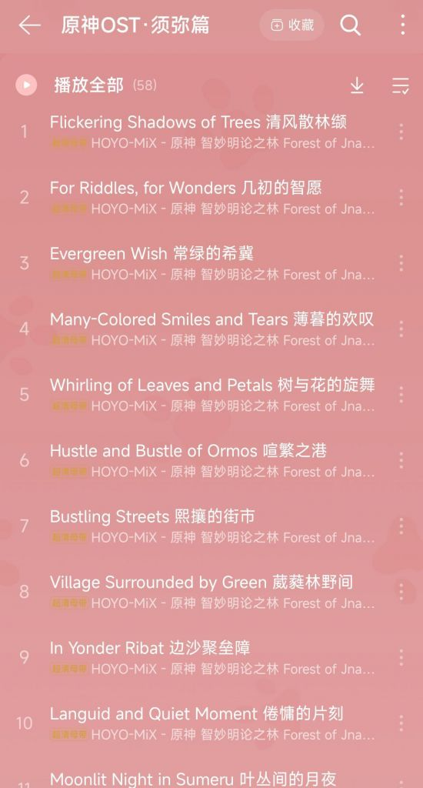
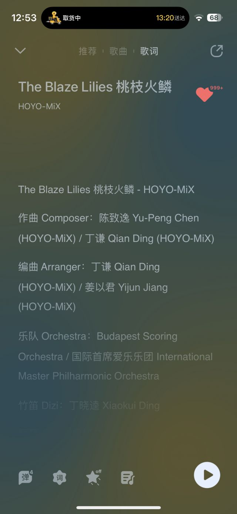

### [不吐不快]陈致逸真的走了吗

Made by ngapost2md (c) ludoux [GitHub Repo](https://github.com/ludoux/ngapost2md)

----

##### 0.[0] \<pid:0\> 2023-08-02 12:46:09 by 同此凉热
我觉得到现在mhy为数不多的能拿得出手也只有音乐比较出色了  但听说接下来陈致逸也不干了有这回事吗 如果是真的 mh好死

----

##### 1.[0] \<pid:706455011\> 2023-08-02 12:51:39 by 鹊之歌
现在须弥的曲子没有陈致逸老师的名了
但还是不好说，走了属于小道消息，没实锤~~也许陈致逸老师与hoyomix融为一体了~~

----

##### 2.[0] \<pid:706455770\> 2023-08-02 12:55:13 by Mendax丶
>[jump](#pid706455011) 鹊之歌(2023-08-02 12:51) 说: 
>
>现在须弥的曲子没有陈致逸老师的名了
>但还是不好说，走了属于小道消息，没实锤~~也许陈致逸老师与hoyomix融为一体了~~
>

应该是跟hoyomix融为一体了，作曲者里陈老师还是有蛮多的

----

##### 3.[0] \<pid:706457018\> 2023-08-02 13:01:05 by 亦鸟LL
>[jump](#pid706455770) Mendax丶(2023-08-02 12:55) 说: 
>
>应该是跟hoyomix融为一体了，作曲者里陈老师还是有蛮多的
>

很多旋律是以前的老曲子，所以有陈老师的名字

----

##### 4.[0] \<pid:706457595\> 2023-08-02 13:04:06 by 9with9
须弥disc1里基本都是他呀

----

##### 5.[0] \<pid:706457977\> 2023-08-02 13:05:52 by aphemia777
音乐会备案也没有他

----

##### 6.[0] \<pid:706458233\> 2023-08-02 13:07:07 by 敲碎锁骨
后天就知道了吧，如果没上前瞻可能真的走了

----

##### 7.[1] \<pid:706458457\> 2023-08-02 13:08:10 by 别慌冷静
不会吧，哪家开了什么逆天条件，能把陈致逸挖走啊，他应该是有mhy以及hymix原始股的吧，估计光股票都是亿为单位的，这都能挖走吗

----

##### 8.[0] \<pid:706458796\> 2023-08-02 13:09:36 by 子柃子柃
之前好像里版就有人说已经走了，现在在吃存货，不知真假

----

##### 9.[1] \<pid:706459276\> 2023-08-02 13:11:58 by 怎样才能不被禁言1
>[jump](#pid706458457) 别慌冷静(2023-08-02 13:08) 说: 
>
>不会吧，哪家开了什么逆天条件，能把陈致逸挖走啊，他应该是有mhy以及hymix原始股的吧，估计光股票都是亿为单位的，这都能挖走吗

不一定是挖，或许是单干，和米哈游也只是合作关系

----

##### 10.[0] \<pid:706459450\> 2023-08-02 13:12:46 by sakrua丶
滑坡也不是这么滑的，想也知道陈老师这种体量的怎么可能被挖走，起码得等到原神提瓦特篇结束才有可能的事，不出意外枫丹的战斗曲和主旋律都是他负责的

----

##### 11.[0] \<pid:706461485\> 2023-08-02 13:22:49 by 哒哒块
我觉得顶多是不想管下面那群虫豸了他只做好他的那部分

----

##### 12.[0] \<pid:706461872\> 2023-08-02 13:24:49 by 贺一猫二世
对我来说陈老师是原这游戏唯一的含金量

----

##### 13.[0] \<pid:706462157\> 2023-08-02 13:26:24 by Buss123
>[jump](#pid706455011) 鹊之歌(2023-08-02 12:51)说:
>现在须弥的曲子没有陈致逸老师的名了 但还是不好说，走了属于小道消息，没实锤<del class='gray'> 也许陈致逸老师与hoyomix融为一体了 </del>[s:ac:哭笑] [img]https://img.nga.178.com/attachments/mon_202308/02/l2Q2s-f0bqK1pT1kSfa-sg.jpg[/img]

收走署名权了而已，你不会仔细看看作曲人么，他签了5年的。

----

##### 14.[0] \<pid:706462322\> 2023-08-02 13:27:13 by 一只二一四啊
一想到这公司的环境，正常人不想待下去了也很合理

----

##### 15.[0] \<pid:706462709\> 2023-08-02 13:29:06 by kunizu
多半是徒弟满天下，然后，退居二线了

----

##### 16.[0] \<pid:706463683\> 2023-08-02 13:33:49 by Cloudrapid133
看陈志逸后面新歌给什么作品出吧，如果自己单干或者跳槽，应该会有后续动态的

----

##### 17.[0] \<pid:706464168\> 2023-08-02 13:36:25 by 景邀明
对我来说现在唯一能让人满意放心的只有陈老师的音乐了，虽然觉得陈老师别呆在米哈游这个垃圾公司了，但是他走了就不知道去哪里听他作的曲了，如果要走希望陈老师公布一下去向

----

##### 18.[0] \<pid:706466161\> 2023-08-02 13:46:36 by 0cmdy
>[jump](#pid706455011) 鹊之歌(2023-08-02 12:51) 说: 
>
>现在须弥的曲子没有陈致逸老师的名了
>但还是不好说，走了属于小道消息，没实锤~~也许陈致逸老师与hoyomix融为一体了~~
>

之前署名是因为曲子基本上是陈老师一个人搞定的，后面都是一群人作曲

----

##### 19.[0] \<pid:706467360\> 2023-08-02 13:52:56 by 喵西斯
我的自建歌单之一

----

##### 21.[0] \<pid:706468037\> 2023-08-02 13:56:23 by 鹊之歌
>[jump](#pid706466161) 0cmdy(2023-08-02 13:46) 说: 
>
>之前署名是因为曲子基本上是陈老师一个人搞定的，后面都是一群人作曲

那可能真的是融为一体了

----

##### 22.[6] \<pid:706468056\> 2023-08-02 13:56:28 by 癸潘应丁裴金
有只小鸟告诉我，你米给陈老师塞了几个根本不认识的人当助手不仅不认识，还啥都不听人家的
当然我也就这么一说反正我就只是个里版匿名滑坡人

----

##### 23.[0] \<pid:706468906\> 2023-08-02 14:00:50 by paradoxtale
之前哪里听说签了5年？我感觉国家主题曲应该还是他吧，角色演示和其他地区音乐就不好说了，好奇的话可以多留意作曲和编曲栏

----

##### 24.[0] \<pid:706469114\> 2023-08-02 14:01:52 by 不要和傻逼争论
>[jump](#pid706467360) 喵西斯(2023-08-02 13:52) 说: 
>
>我的自建歌单之一
>

进度：1/44

----

##### 25.[1] \<pid:706476335\> 2023-08-02 14:38:08 by starship2357
说到音乐，有人能告诉我为什么花海大世界的音乐用了女士的调子开头吗？本来挺好听的，现在就很怪了

----

##### 26.[0] \<pid:706476869\> 2023-08-02 14:40:51 by 剑筑师と書記官
之前听到的说法是枫丹结束润
现在正好到4.0了

----

##### 27.[0] \<pid:706478958\> 2023-08-02 14:50:56 by ielmagnets
我唯一的期待就是璃月新地图听陈老师的曲子了
等给璃月多谱几首曲再走吧

----

##### 29.[0] \<pid:706486403\> 2023-08-02 15:25:15 by 灭世之吼
>[jump](#pid706468906) paradoxtale(2023-08-02 14:00) 说: 
>
>之前哪里听说签了5年？我感觉国家主题曲应该还是他吧，角色演示和其他地区音乐就不好说了，好奇的话可以多留意作曲和编曲栏

他自己B站动态说的接下来在米工作五年

----

##### 30.[0] \<pid:706488593\> 2023-08-02 15:35:08 by hcbbce
>[jump](#pid706486403) 灭世之吼(2023-08-02 15:25) 说: 
>
>他自己B站动态说的接下来在米工作五年

这种大佬签个五年的合同也是想走就走啊

----

##### 31.[0] \<pid:706491977\> 2023-08-02 15:49:57 by 乐百派大队长
啊？
现在觉得须弥这版本唯一的优点就是陈老师的音乐了
另外按说到了欧洲本土地界更是应该有超神音乐
这要是走了…

----

##### 32.[0] \<pid:706492448\> 2023-08-02 15:51:58 by 他小炒肉谁啊
>[jump](#pid706468906) paradoxtale(2023-08-02 14:00) 说: 
>之前哪里听说签了5年？我感觉国家主题曲应该还是他吧，角色演示和其他地区音乐就不好说了，好奇的话可以多留意作曲和编曲栏

合同又不是卖身契，想跑的时候合同是拦不住的

----

##### 33.[0] \<pid:706496159\> 2023-08-02 16:08:44 by TooruW
>[jump](#pid706455011) 鹊之歌(2023-08-02 12:51):

这样理解是有问题的。现在作编曲常不是一人，以团队名出场更规范。
新pv《致终幕的欢宴》作曲仍有陈老师，也就是说枫丹主题很可能还是他写的。

