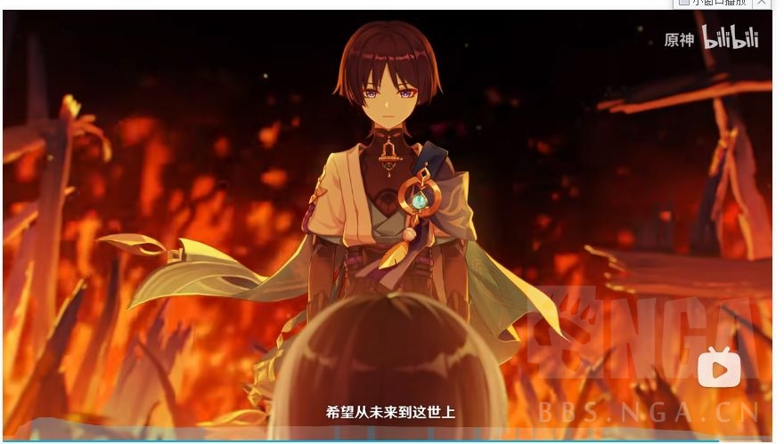
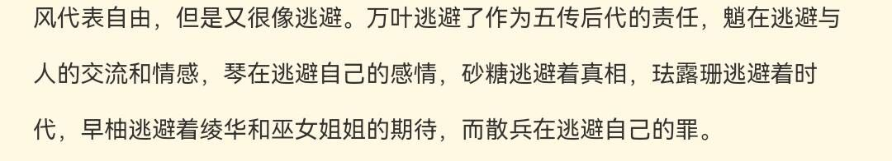

### [不吐不快] 流浪者凭什么得到风属性神之眼？

Made by ngapost2md (c) ludoux [GitHub Repo](https://github.com/ludoux/ngapost2md)

----

##### 0.[1] \<pid:0\> 2023-08-02 13:55:28 by 虾虾滑儿
原神每个角色各自的主线都是强烈的愿望与神之眼。
流浪者的主线是什么？
他到底有什么愿望？
他没有强烈的愿望，凭什么拿到这个风属性神之眼？
散兵的愿望是抹杀自己，他的愿望足够强烈，以至于他配获得神之眼。最后他也确实实现了愿望。
但是流浪者的愿望不是抹杀自己。
纵观流浪者全局的愿望，只有赎罪这一项。赎什么罪？这个神之眼在他赎罪的路上扮演了什么角色？帮老奶奶摆摊非需要神之眼不可？显然不是。流浪者的这颗神之眼和他角色的主线没有任何的关联。他根本不配拿到这颗风属性神之眼。
原神的编剧必然换人了，否则不可能连这么简单的问题也含糊其辞，无法解答。

----

##### 1.[5] \<pid:706468171\> 2023-08-02 13:57:03 by casa卡萨
温迪：我忘了

----

##### 2.[0] \<pid:706468261\> 2023-08-02 13:57:31 by 星空鱼糖
风属性核心特点就是无牵无挂

自灭也是一种无牵无挂

----

##### 3.[0] \<pid:706468392\> 2023-08-02 13:58:12 by kip2021
>[jump](#pid706468261) 星空鱼糖(2023-08-02 13:57) 说: 
>
>风属性核心特点就是无牵无挂
>
>自灭也是一种无牵无挂

琴：？

----

##### 4.[8] \<pid:706468426\> 2023-08-02 13:58:24 by narozx
既然进了里版，那我可以说了
鬼图请打码

----

##### 5.[0] \<pid:706468479\> 2023-08-02 13:58:40 by 雨宫美琴
神之眼的发放目前是一个没填的坑，谁发放，根据什么标准发放目前没有明确的设定

----

##### 6.[0] \<pid:706468765\> 2023-08-02 14:00:08 by 斜日半山
不知道呀。
他莫名其妙穿越到自己打自己的场面，然后莫名其妙发癫又笑又吼，莫名其妙从空气里一抓就抓出一个风系神之眼。
过这段剧情我整个人都是懵的，他到底明白什么了？从失去记忆到拿回记忆就突然悟了？那到底又悟了什么呢？为什么说话做事还能这么装逼呢？
我看不懂，但我大受震撼。

----

##### 7.[0] \<pid:706468826\> 2023-08-02 14:00:27 by 黑蜀黍电动输弹机
万一神之眼属性是摇骰子骰出来的呢
谁来贴段猛干语录：

----

##### 8.[0] \<pid:706468934\> 2023-08-02 14:01:01 by 茫然的熊
风男可是亲儿子组，铁道里也是，比较好奇mhy怎么产生这个xp的

----

##### 9.[0] \<pid:706469155\> 2023-08-02 14:02:05 by 道仰
>[jump](#pid706468826) 黑蜀黍电动输弹机(2023-08-02 14:00) 说: 
>
>万一神之眼属性是摇骰子骰出来的呢
>谁来贴段猛干语录：

这很重要吗，也就你这样玩原神玩的才会在在乎吧

----

##### 10.[0] \<pid:706469332\> 2023-08-02 14:03:01 by 大魔王的小忠犬
>[jump](#pid706468826) 黑蜀黍电动输弹机(2023-08-02 14:00)说:
>万一神之眼属性是摇骰子骰出来的呢 谁来贴段猛干语录：

他可能是被疯子OP夺舍了，所以给了疯神之眼

----

##### 11.[0] \<pid:706469334\> 2023-08-02 14:03:01 by Torchka123
我记得是白散决定完全接纳前世的时候拿到的，但是结果从mmr变成嘴臭小屁孩，不如不拿

----

##### 12.[0] \<pid:706469460\> 2023-08-02 14:03:38 by 我御御了
蒸馍

----

##### 13.[0] \<pid:706469599\> 2023-08-02 14:04:23 by タウィル
卖第一个飞天所以风属,如果雷的话散草99太直接会被看穿

----

##### 14.[0] \<pid:706469703\> 2023-08-02 14:04:49 by 蛀牙先生直呼内行
>[jump](#pid706468934) 茫然的熊(2023-08-02 14:01) 说: 
>
>风男可是亲儿子组，铁道里也是，比较好奇mhy怎么产生这个xp的

从原带过去的XP吧，铁道那位不一眼缝了原的某风男

----

##### 15.[0] \<pid:706469802\> 2023-08-02 14:05:18 by 黑蜀黍电动输弹机
>[jump](#pid706469332) 大魔王的小忠犬(2023-08-02 14:03)说:
><b>Reply to [pid=706468826,37230450,1]Reply[/pid] Post by [uid=60012221]黑蜀黍电动输弹机[/uid] (2023-08-02 14:00)</b>他可能是被疯子OP夺舍了，所以给了疯神之眼

没让你贴大风机关语录，琴团长爱好者震怒

----

##### 16.[0] \<pid:706469828\> 2023-08-02 14:05:25 by yian127
提到这个我就要说了。
倾落伽蓝的英版是“创世纪的反转”
白散拉住黑散中间神之眼那个画面很明显的想乱蹭那副著名的画
表达了什么玩意呢，我是不知道的。自我感动?

----

##### 17.[0] \<pid:706470134\> 2023-08-02 14:06:53 by zkh54788
现在来看神之眼发放和愿望有个锤子关系，森林书最后的npc啥事没干睡一觉就能拿神之眼。

----

##### 18.[0] \<pid:706470682\> 2023-08-02 14:09:44 by Fablet
哈？风属性神之眼为什么是无牵无挂？
他角色故事里那个“从此他只为自己而活”就看得我一脸黑人问号，更别提“自由”“随心所欲”，那和()半拉关系不沾边好不好：
真正的自由接近混沌武士的最后一集，用武士刀斩断过去，与黑暗的过往做个了断，自己在濒临死亡之中得到新生。
一个坛友的签名总结的倒挺对的，风代表逃避，()在逃避自己的罪。

----

##### 19.[0] \<pid:706471194\> 2023-08-02 14:12:38 by liqinggan
认真地说，太子当时的愿望是希望自己没存在过，本质是对自己过去做的事感到愧疚。那么愧疚到被神~~猛干~~认可的太子在~~岁月史书~~赎罪无果之后做了几件事来实现他的愿望呢？竟然是零诶！

----

##### 20.[0] \<pid:706471599\> 2023-08-02 14:14:45 by 冷泠棱凌
我猜就是米放不下它那风系小男孩的烂梗

----

##### 21.[1] \<pid:706471626\> 2023-08-02 14:14:53 by 风与牧歌
还有真研究散兵的特质和风眼特质的关系的啊？

获取神之眼的条件是得到天空岛上神的注视，
而天空岛上住着一群李猛干，散兵得到了李猛干们的注视自然就能得到风神之眼咯

----

##### 22.[0] \<pid:706471759\> 2023-08-02 14:15:31 by 云恭
策划喜欢本应自由的少年去其他国家开启新的生活，放下过去拥抱明天，所以是风，你看这个风说不定米以后得游戏都有

----

##### 23.[0] \<pid:706471787\> 2023-08-02 14:15:41 by SamidareTacho
别管这玩意了，他们三年愣是给不出一个获得理由，基本靠脸，一堆兢兢业业的npc还是“凡人”，有些看表现没比自机差就是没有，然后您猜怎么着，稻妻主线有几个平平无奇甚至能说软蛋的通用模型NPC竟然有神之眼早就成可拆卸元素了

----

##### 24.[0] \<pid:706471788\> 2023-08-02 14:15:41 by 水色晴月
风男可是太子认证专用身份

----

##### 25.[0] \<pid:706473063\> 2023-08-02 14:22:13 by 悠哥死得早7
他没有风系神之眼，米哈游还怎么卖飞天技能呢

----

##### 26.[0] \<pid:706473156\> 2023-08-02 14:22:38 by 狼煞天泣
笔在人家手上.jpg

----

##### 27.[0] \<pid:706473335\> 2023-08-02 14:23:29 by 疯狂de兔子n
 因为策划决定它应该是风男

----

##### 28.[0] \<pid:706473975\> 2023-08-02 14:26:28 by 南翎
这是侧滑对他的温油啊
你看sb他快乐吗？今天睿频稻妻，明天就当因论派代表，全游戏独一份的短距离腾空机制。可谓是全游戏最快乐的男角色。所以侧滑给了他快乐风男之位。你有甚么问题？

----

##### 30.[0] \<pid:706475260\> 2023-08-02 14:32:55 by momookyk
>[jump](#pid706473063) 悠哥死得早7(2023-08-02 14:22) 说: 
>
>他没有风系神之眼，米哈游还怎么卖飞天技能呢

我雷系练个反地心引力磁悬浮怎么了  

大雷神不就是全程磁悬浮的

----

##### 31.[0] \<pid:706475629\> 2023-08-02 14:34:45 by 狐狸吃团子
>[jump](#pid706468261) 星空鱼糖(2023-08-02 13:57) 说: 
>
>风属性核心特点就是无牵无挂
>
>自灭也是一种无牵无挂

无牵无挂和逃避责任有本质区别，蓄意杀了人最后想的不是把真相告诉受害者而是让第三个人“大可以”去公布真相，自己躲在须弥无羁的漫游守望纯白公主，差不多得了

----

##### 32.[0] \<pid:706477076\> 2023-08-02 14:41:53 by 辛徐潘辛陶时
1：风男xp
2：想想sb的E技能，sb作为里主角自然也要拥有操纵各元素的能力，再给个草系的妈，总不能当个孤儿岩吧，笑

----

##### 33.[1] \<pid:706478841\> 2023-08-02 14:50:22 by 良和先生
我想起当时在油液看到的那段话了
他是 孤傲的雷
染成 自由的风
~~是这样吧~~

----

##### 34.[0] \<pid:706484608\> 2023-08-02 15:17:15 by 萌量不足-v-
你纠结这个…风神自己都不会飞，散会飞捏

----

##### 35.[0] \<pid:706493196\> 2023-08-02 15:55:16 by 叶公好龙娘
女士当时见面就该一刀铜丝旅行者
玩家就不用受这种苦了

----

##### 36.[0] \<pid:706493282\> 2023-08-02 15:55:40 by 叶公好龙娘
>[jump](#pid706478841) 良和先生(2023-08-02 14:50) 说: 
>
>我想起当时在油液看到的那段话了
>他是 孤傲的雷
>染成 自由的风
>~~是这样吧~~

ac娘表情是真的牛逼

----

##### 37.[0] \<pid:706530625\> 2023-08-02 18:45:02 by 星空鱼糖
>[jump](#pid706475629) 狐狸吃团子(2023-08-02 14:34) 说: 
>
>无牵无挂和逃避责任有本质区别，蓄意杀了人最后想的不是把真相告诉受害者而是让第三个人“大可以”去公布真相，自己躲在须弥无羁的漫游守望纯白公主，差不多得了

骗别人可以，别把自己骗了

散兵本意是为了让那些人活下来才去撞树的

----

##### 38.[0] \<pid:706530954\> 2023-08-02 18:46:35 by 玩c罗玩的
mhy想玩死好友这个烂梗

----

##### 39.[0] \<pid:706531328\> 2023-08-02 18:48:17 by 透明级
>[jump](#pid706530625) 星空鱼糖(2023-08-02 18:45)说:
>[quote][pid=706475629,37230450,2]Reply[/pid] <b>Post by [uid=63702443]狐狸吃团子[/uid] (2023-08-02 14:34):</b>  无牵无挂和逃避责任有本质区别，蓄意杀了人最后想的不是把真相告诉受害者而是让第三个人“大可以”去公布真相，自己躲在须弥无羁的漫游守望纯白公主，差不多得了[s:a2:你看看你][/quote]骗别人可以，别把自己骗了  散兵本意是为了让那些人活下来才去撞树的

嗯，只要本意是好的，那么就算结果是再给受害者重重一拳，且之后也不打算对此作出任何补救，那也是纯洁、无辜、至高的美好，是不应得到任何责备的。

----

##### 40.[0] \<pid:706531827\> 2023-08-02 18:50:41 by 狐狸吃团子
>[jump](#pid706530625) 星空鱼糖(2023-08-02 18:45) 说: 
>
>骗别人可以，别把自己骗了
>
>散兵本意是为了让那些人活下来才去撞树的

散兵不是想删除自己么？本质就是逃避责任啊。结果自己没删成功把别人记忆洗了，最后也没见他多懊悔，让黄毛传个话自己很愉快留在须弥和草神漫游了
骗不了别人骗自己可以，也别把自己骗成sb啊

----

##### 41.[1] \<pid:706532252\> 2023-08-02 18:52:45 by 喵西斯
因为内部喜欢。
隔壁崩铁不还在推风男。
蜜汁情怀，我不懂
(然后皇级也有高下之分)

----

##### 42.[0] \<pid:706532499\> 2023-08-02 18:53:54 by 星空鱼糖
>[jump](#pid706531328) 透明级(2023-08-02 18:48) 说: 
>
>嗯，只要本意是好的，那么就算结果是再给受害者重重一拳，且之后也不打算对此作出任何补救，那也是纯洁、无辜、至高的美好，是不应得到任何责备的。

稻草人谬误，我只是针对主贴神之眼的问题，别瞎扯了，我的立场对你来说不重要

----

##### 43.[0] \<pid:706532634\> 2023-08-02 18:54:31 by 渐行渐远ii
官方自己玩起了四风守护

----

##### 44.[0] \<pid:706532871\> 2023-08-02 18:55:41 by 盒马生鲜鲜
不懂mhy对风系男角色(非城南)有什么执念，原这边风系小男孩(这个词让我想吐)待遇一个赛一个的好，隔壁游戏太子也是个风系非成男

----

##### 45.[0] \<pid:706533024\> 2023-08-02 18:56:27 by 星空鱼糖
>[jump](#pid706531827) 狐狸吃团子(2023-08-02 18:50) 说: 
>
>散兵不是想删除自己么？本质就是逃避责任啊。结果自己没删成功把别人记忆洗了，最后也没见他多懊悔，让黄毛传个话自己很愉快留在须弥和草神漫游了
>骗不了别人骗自己可以，也别把自己骗成sb啊

散兵是想让那些人活下来，他以为自己会就此不存在，所以那些人可以复活，这还需要讨论？

至于你对后续剧情表现不满意，我也一样

----

##### 46.[0] \<pid:706533152\> 2023-08-02 18:57:05 by QDXEX
它都无羁了，为什么不能是风

----

##### 47.[0] \<pid:706533400\> 2023-08-02 18:58:25 by 透明级
>[jump](#pid706532499) 星空鱼糖(2023-08-02 18:53)说:
>>[jump](#pid706531328) 透明级(2023-08-02 18:48) 说: 
>>
>>嗯，只要本意是好的，那么就算结果是再给受害者重重一拳，且之后也不打算对此作出任何补救，那也是纯洁、无辜、至高的美好，是不应得到任何责备的。
>
>稻草人谬误，我只是针对主贴神之眼的问题，别瞎扯了，我的立场对你来说不重要

你的观点确实不重要，我只是不满于别人在分析一个双标行为，你搁那说什么本意是好的

----

##### 48.[0] \<pid:706533528\> 2023-08-02 18:58:58 by 随便改个名字吧
强烈的愿望就是一个笑话 你游那么多“感动人心”的npc也没有神之眼啊 难道他们的愿望不够强烈？

----

##### 49.[0] \<pid:706533811\> 2023-08-02 19:00:24 by 钓鱼蛰
>[jump](#pid706468826) 黑蜀黍电动输弹机(2023-08-02 14:00) 说: 
>
>万一神之眼属性是摇骰子骰出来的呢
>谁来贴段猛干语录：

一个不受太多制约的编剧真是最快乐的职业呼哈哈哈。

----

##### 50.[0] \<pid:706533938\> 2023-08-02 19:01:00 by 星空鱼糖
>[jump](#pid706533400) 透明级(2023-08-02 18:58) 说: 
>
>你的立场确实不重要，我只是不满于别人在分析一个双标行为，你搁那说什么本意是好的

剧情演绎的事实就是事实，你这样和撞树又有什么区别呢？

另外后续剧情表现不好也是事实，我并不想歪曲什么

----

##### 51.[0] \<pid:706533992\> 2023-08-02 19:01:18 by 雷军单推人
>[jump](#pid706468826) 黑蜀黍电动输弹机(2023-08-02 14:00) 说: 
>
>万一神之眼属性是摇骰子骰出来的呢
>谁来贴段猛干语录：

来了

----

##### 52.[1] \<pid:706534234\> 2023-08-02 19:02:29 by 超音速凉面
神说过神之眼发放不是自己决定的，那么是谁呢上面某位的套皮

----

##### 53.[0] \<pid:706534290\> 2023-08-02 19:02:43 by 参选者VZ
希腊奶

----

##### 54.[1] \<pid:706534536\> 2023-08-02 19:03:58 by 香槟买好了就等
>[jump](#pid706532871) 盒马生鲜鲜(2023-08-02 18:55) 说: 
>
>不懂mhy对风系男角色(非城南)有什么执念，原这边风系小男孩(这个词让我想吐)待遇一个赛一个的好，隔壁游戏太子也是个风系非成男

肯定是给某个原型做代餐，我还挺好奇谁，应该会让所有人大吃一惊

----

##### 55.[0] \<pid:706534960\> 2023-08-02 19:06:00 by 狐狸吃团子
>[jump](#pid706533024) 星空鱼糖(2023-08-02 18:56) 说: 
>
>散兵是想让那些人活下来，他以为自己会就此不存在，所以那些人可以复活，这还需要讨论？
>
>至于你对后续剧情表现不满意，我也一样

赔宝的目的不就是希望自己从未来过这世上吗？就是想删除自己，他以为删除自己别人就能活，本质是逃避责任。结果没删成功一边想着自己要是没来过这世上就好了一边嘴臭别人，我的评价是不如求雷神把自己销毁，好歹做到了言行一致

----

##### 56.[0] \<pid:706535413\> 2023-08-02 19:08:11 by 星空鱼糖
>[jump](#pid706534960) 狐狸吃团子(2023-08-02 19:06) 说: 
>
>赔宝的目的不就是希望自己从未来过这世上吗？就是想删除自己，他以为删除自己别人就能活，本质是逃避责任。结果没删成功一边想着自己要是没来过这世上就好了一边嘴臭别人，我的评价是不如求雷神把自己销毁，好歹做到了言行一致

如果按你这样说的发展，感觉也挺有意思的，比现在这样半吊着要好多了

----

##### 57.[0] \<pid:706535429\> 2023-08-02 19:08:15 by 狐狸吃团子
>[jump](#pid706533938) 星空鱼糖(2023-08-02 19:01) 说: 
>
>剧情演绎的事实就是事实，你这样和撞树又有什么区别呢？
>
>另外后续剧情表现不好也是事实，我并不想歪曲什么

剧情演绎的是否是事实也需要配合文案看吧，赔宝所谓的三次背叛算事实吗？那卢老爷班尼特等等提瓦特遭受苦难的人都有话说

----

##### 58.[0] \<pid:706535679\> 2023-08-02 19:09:28 by 吃乐川下你和我
“删除自己别人就能活”，结果发现删除了之后被他杀的人也没活
嗯，那他接下来是不是该做点什么了？
比如，他不是还活着吗？

----

##### 59.[0] \<pid:706536758\> 2023-08-02 19:14:49 by 积极向上的用户名
梦里的设计稿好多角色神之眼和最终版本都不同，不就说明神之眼就是随便填的，只和战斗定位有关么。神之眼和角色愿望性格的关系重要吗，也就只有你们()觉得重要吧

----

##### 60.[0] \<pid:706539404\> 2023-08-02 19:28:32 by LejourNora
场外来说的话, 我是觉得因为波西米亚狂想曲

最后一句的歌词是
Any way the wind blows...

----

##### 61.[0] \<pid:706541510\> 2023-08-02 19:39:09 by 重生细胞
真的晦气

----

##### 62.[0] \<pid:706543290\> 2023-08-02 19:49:03 by wuyu333
>[jump](#pid706530625) 星空鱼糖(2023-08-02 18:45) 说: 
>
>骗别人可以，别把自己骗了
>
>散兵本意是为了让那些人活下来才去撞树的

流浪者角色故事“歪曲真相只为实现他愿望”，以及我记得他说过愿望是自己不存在世界上吧？清醒一点你主子从来都是只考虑自己感受的巨婴，三次背叛还不够说明这一点吗？

----

##### 63.[0] \<pid:706545439\> 2023-08-02 20:01:29 by 星空鱼糖
>[jump](#pid706543290) wuyu333(2023-08-02 19:49) 说: 
>
>流浪者角色故事“歪曲真相只为实现他愿望”，以及我记得他说过愿望是自己不存在世界上吧？清醒一点你主子从来都是只考虑自己感受的巨婴，三次背叛还不够说明这一点吗？

按你的逻辑，“…那些死在踏鞴砂的人，与我有关的人，应该过上另一种生活”，这是一句违心的话对吧，杠就是你对

----

##### 64.[0] \<pid:706546045\> 2023-08-02 20:05:16 by 不要和傻逼争论
请选择你想要跨的火盆

----

##### 65.[0] \<pid:706550613\> 2023-08-02 20:32:26 by kunizu
新原学：编剧想让他创造的角色享受离家出走的漂泊和自由

----

##### 66.[0] \<pid:706551111\> 2023-08-02 20:35:44 by wuyu333
>[jump](#pid706545439) 星空鱼糖(2023-08-02 20:01) 说: 
>
>按你的逻辑，“…那些死在踏鞴砂的人，与我有关的人，应该过上另一种生活”，这是一句违心的话对吧，杠就是你对

如何评价创树前的虫子瑞平

----

##### 67.[0] \<pid:706553324\> 2023-08-02 20:49:37 by 夕音子
天空岛(米哈游)发的

----

##### 68.[0] \<pid:706560400\> 2023-08-02 21:34:58 by 不淡定の文
>[jump](#pid706471194) liqinggan(2023-08-02 14:12) 说: 
>
>认真地说，太子当时的愿望是希望自己没存在过，本质是对自己过去做的事感到愧疚。那么愧疚到被神~~猛干~~认可的太子在~~岁月史书~~赎罪无果之后做了几件事来实现他的愿望呢？竟然是零诶！

我超，老哥你这头像让我想起了里版的那位老熟人。。。

----

##### 69.[0] \<pid:706561750\> 2023-08-02 21:43:41 by 乙姬卞己边许
>[jump](#pid706534536) 香槟买好了就等(2023-08-02 19:03) 说: 
>
>肯定是给某个原型做代餐，我还挺好奇谁，应该会让所有人大吃一惊

隔壁太子一眼是原这边某个风系小男孩的代餐啊，还偷了一位角色的衣服和另一位角色的二创。

----

##### 70.[0] \<pid:706562065\> 2023-08-02 21:45:39 by 那话是谁也不像了
>[jump](#pid706532871) 盒马生鲜鲜(2023-08-02 18:55) 说: 
>
>不懂mhy对风系男角色(非城南)有什么执念，原这边风系小男孩(这个词让我想吐)待遇一个赛一个的好，隔壁游戏太子也是个风系非成男

隔壁是风吗？不了解崩铁。我还以为创作“水龙吟”，所以那位是水呢。
有点反直觉。

----

##### 71.[0] \<pid:706562559\> 2023-08-02 21:48:55 by 士郎大胜利
为了ch忘不掉的风系小男孩

----

##### 72.[0] \<pid:706572422\> 2023-08-02 22:52:51 by liqinggan
>[jump](#pid706560400) 不淡定の文(2023-08-02 21:34) 说: 
>
>我超，老哥你这头像让我想起了里版的那位老熟人。。。

我的头像就是受那位和推特的散草bot启发的都给我磕眉目传情的散草

----

##### 73.[0] \<pid:706576828\> 2023-08-02 23:21:19 by 冷泠棱凌
>[jump](#pid706572422) liqinggan(2023-08-02 22:52) 说: 
>
>我的头像就是受那位和推特的散草bot启发的都给我磕眉目传情的散草

甚至你头像的两个人好像一个画师画的啊

----

##### 74.[0] \<pid:706579287\> 2023-08-02 23:38:07 by 四喜不是萝莉
凭《笔在人家手里》
__,____?

----

##### 75.[0] \<pid:706582555\> 2023-08-03 00:00:54 by 摆烂的鱼鱼
他如果是个用一生赎罪的苦修者那才配

----

##### 76.[0] \<pid:706583710\> 2023-08-03 00:10:02 by 天射星
>[jump](#pid706530625) 星空鱼糖(2023-08-02 18:45) 说: 
>
>骗别人可以，别把自己骗了
>
>散兵本意是为了让那些人活下来才去撞树的

本意让别人活下来为啥不删博士，删他自己有屁用？他根本对被他灭门的雷五尤其是百目家没有任何的歉意

----

##### 77.[0] \<pid:706583816\> 2023-08-03 00:10:52 by 1703kj
神之眼现在就纯√8搞笑，发得莫名其妙

----

##### 78.[0] \<pid:706584153\> 2023-08-03 00:13:19 by 1703kj
>[jump](#pid706530625) 星空鱼糖(2023-08-02 18:45) 说: 
>
>骗别人可以，别把自己骗了
>
>散兵本意是为了让那些人活下来才去撞树的

按照现在剧情来看，世界树根本没有任何修改客观历史的能力，撞树最多只能修改人们对历史的认知。

明明撞树谁都救不了，散兵为了修改自己和其他人对历史的认知一头攒上去，真是巨√8小丑

----

##### 79.[0] \<pid:706587219\> 2023-08-03 00:36:36 by 天青车道了解一哈
详情请关注风神传说任务2

----

##### 80.[0] \<pid:706600960\> 2023-08-03 05:23:51 by 布耶尔今天吃什么
>[jump](#pid706533024) 星空鱼糖(2023-08-02 18:56):

世界树应该是可以删除散兵的，只是他不知道不能自己删除自己。是不是真的能改变历史存疑。
关于世界树的规则打个比方，有个树王文件夹，这个文件夹里面有个叫世界树的清理程序，如果需要删除树王这个文件夹，就需要先在外面创建一个新文件夹命名为纳西妲，然后把世界树复制进去，再让纳西妲文件夹里面的世界树程序把树王文件夹删除。

----

##### 81.[0] \<pid:706601162\> 2023-08-03 05:32:36 by 布耶尔今天吃什么
>[jump](#pid706584153) 1703kj(2023-08-03 00:13):

如果不能修改历史，只是修改认知，那你很难解释为什么最后所有关于散兵的实体文字记录都被改动了。
即使是花神诞祭，也不能改变花瓶破碎的现实，但世界树却能改变写在纸张上的文字，不觉得说不通吗？
不过改变历史本来就是危险的设定，说不定米哈游什么时候就否认了，谁关心呢

----

##### 83.[0] \<pid:706619535\> 2023-08-03 09:08:48 by kmoretti
>[jump](#pid706470682) Fablet(2023-08-02 14:09) 说: 
>
>哈？风属性神之眼为什么是无牵无挂？
>()角色故事里“从此他只为自己而活”看得我一脸黑人问号，更别提“自由”“随心所欲”，那和()半拉关系不沾边：
>真正的自由接近混沌武士的最后一集，用武士刀斩断过去，与黑暗的过往做个了断，自己在濒临死亡之后得到新生，与过去斩不断理还乱的，根本不能说无牵无挂吧？
>一个坛友的签名总结的倒挺对的，风比起自由更代表逃避，()在逃避自己的罪。
>  

别太离谱，你要车风男就直接车，除了散兵这几个人获得神之眼的故事和逃避有半毛钱关系，珐露珊逃避时代都出来了

----

##### 84.[0] \<pid:706620710\> 2023-08-03 09:14:29 by momookyk
>[jump](#pid706468392) kip2021(2023-08-02 13:58) 说: 
>
>琴：？

一般来说，讨论风系没家人的时候都是特指风男

----

##### 85.[0] \<pid:706621063\> 2023-08-03 09:16:12 by Eisen_Mann
之前我有个帖子对比哲平愿望强烈至死无神之眼，散兵删自己却被白送神之眼，让散厨把楼掀了
散厨言论：哲平死的好

真的是三观尽失

----

##### 86.[0] \<pid:706623299\> 2023-08-03 09:26:59 by Eisen_Mann
>[jump](#pid706545439) 星空鱼糖(2023-08-02 20:01) 说: 
>
>按你的逻辑，“…那些死在踏鞴砂的人，与我有关的人，应该过上另一种生活”，这是一句违心的话对吧，杠就是你对

实话说，雷散的塑造我觉得还可以，这句话也是雷散说出来的。我也相信他是真的这么想过，虽然他的地位和智商应该知道过去改变不了，所以这种撞树就是不可理喻的脑抽行为。

等到后面撞了树之后的风散反而给人感觉根本没有忏悔之心，大放厥词。

要么雷散当时立刻自尽，要么风散回到稻妻告诉所有人自己做的恶然后自尽，否则永远是个懦夫。

----

##### 87.[0] \<pid:706623360\> 2023-08-03 09:27:16 by kmoretti
>[jump](#pid706620710) momookyk(2023-08-03 09:14) 说: 
>
>一般来说，讨论风系没家人的时候都是特指风男

鹿野奈奈亲切问候你全家

----

##### 88.[0] \<pid:706629154\> 2023-08-03 09:53:41 by 病_
>[jump](#pid706468261) 星空鱼糖(2023-08-02 13:57):

不是无牵无挂，而是反面，求而不得的束缚  如拘束的风所以才需要别的方式来解脱   

琴 砂糖 温蒂 魈 万叶 早柚 平藏 珐露珊 都是被某种责任/事业/宿命/愿望诉求束缚住 几近是最不自由

散兵，我不好说，这人是被束缚还是自找烂事我不好说  

冰是求而不得的对立统一，可谓是现实与理想具有反差
火是传承/热诚
雷是自我/突破
岩是一筋单纯/勤勉
水是塑形与变化

但你游明显后面角色的神之眼与角色设定的契合度越来越不怎么对得上
比如水，行秋-富家少爷和仗剑江湖的侠客之间身份的自由变化；芭芭拉-修女和偶像的变化统一；公子-愚人众和家里大哥；心海-巫女军师与宅；绫人-兄长、神里家主、忍部头领；夜兰-自己找刺激的抖M生活和为责任而行动的英雄后裔；妮露-角色扁平的根本没有第二重身份的变化！坎迪斯我尚且勉强可以认为这人是高贵赤王后裔与破村子守护者的双重身份，妮露就单纯的一张纸

----

##### 89.[0] \<pid:706638910\> 2023-08-03 10:35:10 by Fablet
>[jump](#pid706619535) kmoretti(2023-08-03 09:08) 说: 
>
>别太离谱，你要车风男就直接车，除了散兵这几个人获得神之眼的故事和逃避有半毛钱关系，珐露珊逃避时代都出来了

所以那么大一行字“这是坛友的签名”你是看不见呗？
别模糊我发言重心，拉其他角色共沉沦。
我对其他角色没啥恶意，但发神之眼的逻辑不找其他人的共性，怎么证明不是李猛干们一拍脑袋随便想出来的？
明明是对过去有牵挂，却凹出一副无牵无挂自由自在的样子，然后拿去抬内部爱快乐风男，我只会嘲笑李猛干们根本不懂什么是自由。

----

##### 90.[0] \<pid:706675766\> 2023-08-03 13:10:53 by kmoretti
>[jump](#pid706638910) Fablet(2023-08-03 10:35) 说: 
>
>所以那么大一行字“这是坛友的签名”你是看不见呗？
>别模糊我发言重心，拉其他角色共沉沦。
>我对其他角色没啥恶意，但发神之眼的逻辑不找其他人的共性，怎么证明不是李猛干们一拍脑袋随便想出来的？
>明明是对过去有牵挂，却凹出一副无牵无挂自由自在的样子，然后拿去抬内部爱快乐风男，我只会嘲笑李猛干们根本不懂什么是自由。

我会狠狠嘲笑指望文案们真的编了“获得某元素神之眼的人都有某种特征”的人
风系硬编了个逃避出来，其他系你要怎么编？
也是离谱，真觉得除了散兵其他人和逃避有关系了？
你又从哪里看出来风系“凹出一副自由自在的样子”了？
明确说了放下的只有万叶一个，魈从来都是坦然表示他怀念和其他四夜叉在一起的日子，砂糖一直都在为仙境努力，琴一切以骑士团优先，珐露珊在尽量适应现在这个时代但从来没有否定过过去，温迪还特意把你叫去风神像上喝酒讲故事
要车风男内部爱你就光明正大车，为了把风系绑一起车编这种东西出来给自己找借口，有意思吗？

----

##### 91.[0] \<pid:706678112\> 2023-08-03 13:23:26 by Fablet
>[jump](#pid706675766) kmoretti(2023-08-03 13:10) 说: 
>
>我会狠狠嘲笑指望文案们真的编了“获得某元素神之眼的人都有某种特征”的人
>风系硬编了个逃避出来，其他系你要怎么编？
>也是离谱，真觉得除了散兵其他人和逃避有关系了？
>你又从哪里看出来风系“凹出一副自由自在的样子”了？
>明确说了放下的只有万叶一个，魈从来都是坦然表示他怀念和其他四夜叉在一起的日子，砂糖一直都在为仙境努力，琴一切以骑士团优先，珐露珊在尽量适应现在这个时代但从来没有否定过过去，温迪还特意把你叫去风神像上喝酒讲故事
>要车风男内部爱你就光明正大车，为了把风系绑一起车编出些不存在的共性来给自己找

所以你到底是想针对风男拒绝扩大化，还是借着“共沉沦”“其他风系角色厨子”洗地？
这楼里已经有搞“我的本心纯洁无瑕，我的行为不负责任”那一套的人了，和你掰扯，倒是方便后排()解打滚炸楼。
要是你赞同前者，那就算了，我确实用词不当疑似扩大战场。
后者，啧，你品味也就这些了。

----

##### 92.[1] \<pid:706688599\> 2023-08-03 14:15:40 by kmoretti
>[jump](#pid706678112) Fablet(2023-08-03 13:23) 说: 
>
>所以你到底是想针对风男拒绝扩大化，还是借着“共沉沦”“其他风系角色厨子”洗地？
>这楼里已经有搞“我的本心纯洁无瑕，我的行为不负责任”那一套的人了，和你掰扯，倒是方便后排()解打滚炸楼。
>要是你赞同前者，那就算了，我确实用词不当疑似扩大战场。
>后者，啧，你品味也就这些了。

我是在反对你们把所有风系绑起来车
至于拉其他角色共沉沦，你不觉得这种把散兵的特点(逃避)安到其他角色身上的行为，很像散解那一套“他也有问题凭什么不骂他吗？”
散解拉雷电影垫的话术，散解给魈扣了个赎罪的帽子，这种手段见太多了，其他角色厨子辟谣都辟不过来

----

##### 93.[0] \<pid:706691971\> 2023-08-03 14:32:21 by Fablet
>[jump](#pid706688599) kmoretti(2023-08-03 14:15) 说: 
>
>我是在反对你们把所有风系绑起来车
>至于拉其他角色共沉沦，你不觉得这种把散兵的特点(逃避)安到其他角色身上的行为，很像散解那一套“他也有问题凭什么不骂他吗？”
>散解拉雷电影垫的话术，散解给魈扣了个赎罪的帽子，这种手段见太多了，其他角色厨子辟谣都辟不过来

原来你是这个意思，那确实是我有“所有风系共沉沦”“扩大化”之嫌了，不好意思。
~~我说这话是因为看到有散解自比风系男孩，认为自己自由自在随心所欲古灵精怪，看不起岩系角色“困于沉重的过去”“保守”。
所以会产生“风之于岩有什么优越感？所谓自由自在，不也牵着一根过往的线吗”的看法~~

----

##### 94.[0] \<pid:706697540\> 2023-08-03 14:58:29 by 山药薏米粥
问就是死友人了

----

##### 95.[0] \<pid:706697710\> 2023-08-03 14:59:15 by kmoretti
>[jump](#pid706691971) Fablet(2023-08-03 14:32) 说: 
>
>原来你是这个意思，那确实是我有“所有风系共沉沦”“扩大化”之嫌了，不好意思。
>~~我说这话是因为看到有散解自比风系男孩，认为自己自由自在随心所欲古灵精怪，看不起岩系角色“困于沉重的过去”“保守”。
>所以会产生“风之于岩有什么优越感？所谓自由自在，不也牵着一根过往的线吗”的看法~~

我语气也不好，抱歉，最开始怀疑你是试图拖其他角色垫背的散解来着……
别和散解的言论较劲风系还有两个经常加班的琴和魈呢，，哪里自由自在了……风石头文案我的理解更类似于接受过去，和过去和解然后向前走这样，只是一个祝福不是说角色就一定会，至于散兵……他的过去已经被他岁掉了，估计永远都不可能和解了吧

----

##### 96.[0] \<pid:706697872\> 2023-08-03 15:00:02 by Naranjaa
为了绑进风系小男孩呗

----

##### 97.[0] \<pid:706709926\> 2023-08-03 15:56:06 by xdccc023
因为他免费了，所以0h

----

##### 98.[0] \<pid:706720871\> 2023-08-03 16:45:07 by 发货币
>[jump](#pid706530625) 星空鱼糖(2023-08-02 18:45) 说: 
>
>骗别人可以，别把自己骗了
>
>散兵本意是为了让那些人活下来才去撞树的

说的好，那请问赎罪前能不能先缝上那天天喷?的臭嘴？

