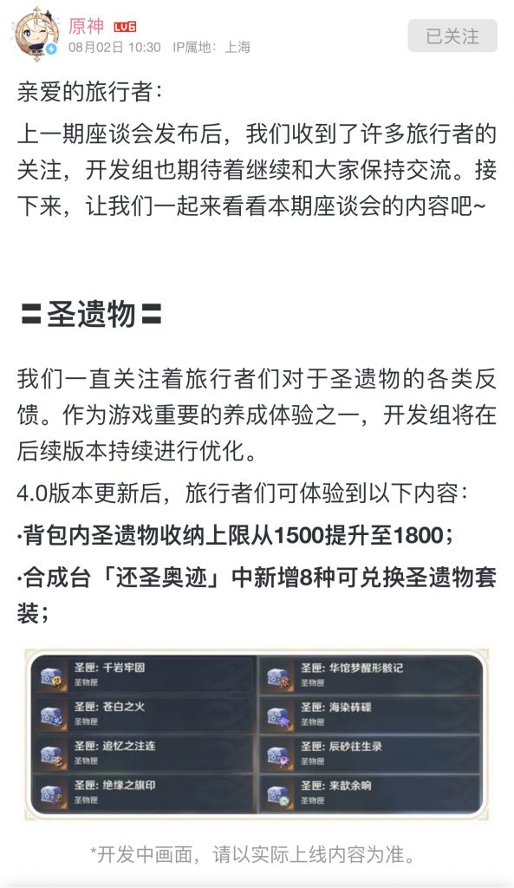

### [不吐不快]我服了，加个圣遗物上限也抠抠索索的

Made by ngapost2md (c) ludoux [GitHub Repo](https://github.com/ludoux/ngapost2md)

----

##### 0.[0] \<pid:0\> 2023-08-02 14:38:58 by 终末之夏

干脆凑个整数加到2000不好么，还非得只加到1800……

----

##### 1.[0] \<pid:706477000\> 2023-08-02 14:41:28 by 梓川枫丶
这样方便下次玩家再有不满的时候再加200啊

----

##### 2.[0] \<pid:706480726\> 2023-08-02 14:59:31 by 夜夜new
诚意不足，直接加724我就回坑

----

##### 3.[0] \<pid:706481936\> 2023-08-02 15:05:04 by mASAYUMecHASIN
会不会跟隔壁未定周年活动一样？先拿一个离谱的数加300出来挨骂，等玩家骂上一轮后，再把自己原先定好的数比如加500拿出来，表现出一种我们真的有在意玩家反馈的意思

----

##### 4.[0] \<pid:706482637\> 2023-08-02 15:08:22 by 这游戏真给我整沉默了
别想太多，就是打发要饭的

