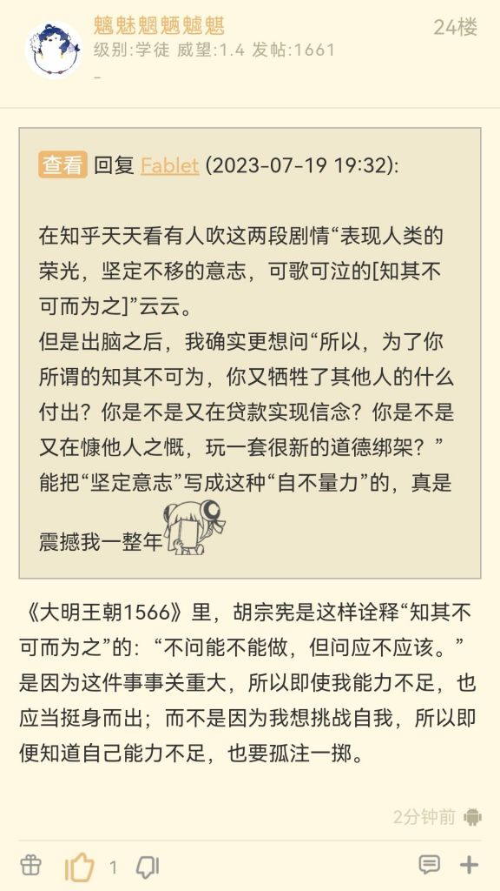
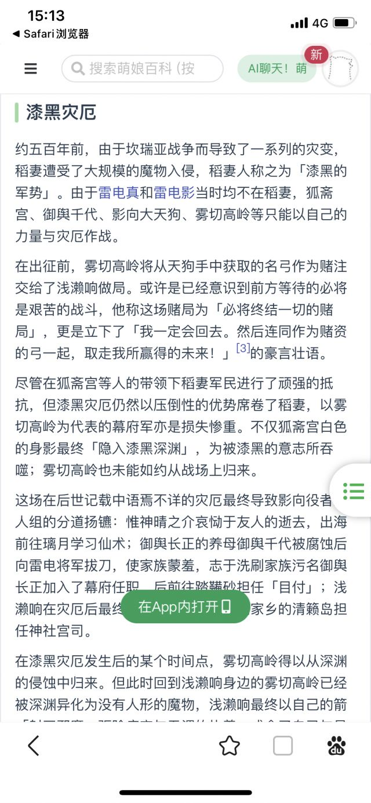

### [不吐不快]硬要说的话

Made by ngapost2md (c) ludoux [GitHub Repo](https://github.com/ludoux/ngapost2md)

----

##### 0.[0] \<pid:0\> 2023-08-02 14:55:42 by 不断下坠的心情
我觉得整个acgn圈里和散兵故事最像的其实也是原神里的。那就是浅濑响。
区别大概在于浅濑响没有进池，那也就不需要为此整什么撞树这种更加抽象的东西。
但精神内核是一样的。都是在那里莫名其妙的顾影自怜，然后自己破防，疯狂卖惨，然而正常人根本get不到，只会觉得你神经，还有就是觉得被你这样的神经波及到的无辜人才是真的惨。
哦，对，还有个共同特点是雷电影明明在这两件事里什么都没有做错但却莫名其妙的就成了背锅侠，是真的惨。
Mhy自我标榜是技术宅，但却能散发出这么浓郁的文青病，我不好说好吧

----

##### 1.[0] \<pid:706480336\> 2023-08-02 14:57:34 by 到头来一天
再小的再技术再宅的公司召来的文案也是文科学院毕业的。
注定如此。

----

##### 2.[2] \<pid:706481334\> 2023-08-02 15:02:14 by Fablet
额……你说的<b>顾影自怜，莫名其妙破防，各种卖惨，阴阳怪气，犯文青病</b>可不光是一个角色身上有啊。

----

##### 3.[0] \<pid:706481563\> 2023-08-02 15:03:16 by 水晶包袱锤
在3.3之前我甚至觉得浅籁响比散兵更癫……这俩都是我到现在都不能理解的，要说的话还真挺像

----

##### 4.[0] \<pid:706481747\> 2023-08-02 15:04:05 by 无。乡4
我感觉这个人应该是失心疯了，亲手杀死自己的爱人，还能崩的住就是超人

----

##### 6.[0] \<pid:706481938\> 2023-08-02 15:05:05 by 不断下坠的心情
>[jump](#pid706481334) Fablet(2023-08-02 15:02)说:
>额……你说的<b>顾影自怜，莫名其妙破防，各种卖惨，阴阳怪气，犯文青病</b>可不光是一个角色身上有啊。  倒不如说，目前玩家社区不想看见的流量角色，身上或多或少都有这种自己觉得自己好惨的症状。

别的角色只是有这个成分。
散兵和浅濑响整个角色就是建立在这个上面的，还是有区别的

----

##### 7.[0] \<pid:706483116\> 2023-08-02 15:10:33 by 己晏佘庚贾卢
浅籁响怎么了吗。我对她的印象就只剩下她养了只猫然后用术式造了片云，我印象里挺健康一角色。

----

##### 8.[0] \<pid:706483662\> 2023-08-02 15:12:55 by Fablet
>[jump](#pid706481938) 不断下坠的心情(2023-08-02 15:05) 说: 
>
>别的角色只是有这个成分。
>散兵和浅濑响整个角色就是建立在这个上面的，还是有区别的

我很想回复些骂人的话，但是隔壁楼有其他cp的粉丝在打滚，我不想把他们引过来。
笼统的来说，我认为原神的部分剧情有一种“初心很好，所以就不顾忌他们<b>自己</b>表现初心，需要花费其他人的人力损失”。
有个老哥的总结很好，我放下面了。

----

##### 9.[0] \<pid:706484455\> 2023-08-02 15:16:33 by 不断下坠的心情
>[jump](#pid706483116) 己晏佘庚贾卢(2023-08-02 15:10) 说: 
>
>浅籁响怎么了吗。我对她的印象就只剩下她养了只猫然后用术式造了片云，我印象里挺健康一角色。

一点都不阳角好吗

----

##### 10.[0] \<pid:706484982\> 2023-08-02 15:18:53 by 不断下坠的心情
>[jump](#pid706483662) Fablet(2023-08-02 15:12) 说: 
>
>我很想回复些骂人的话，但是隔壁楼有其他cp的粉丝在打滚，我不想把他们引过来。
>笼统的来说，我认为原神的部分剧情有一种“初心很好，所以就不顾忌他们<b>自己</b>表现初心，需要消耗<b>他人</b>的时间精力甚至责任”的味道。
>有个老哥的总结很好，我放下面了。
>

我大约理解了是哪一对了。
确实，原神里面那种“只要我人是个好人，不管给别人造成多么大的影响也不是我的错”的这种情感表达感觉越来越多了。

----

##### 11.[1] \<pid:706486042\> 2023-08-02 15:23:42 by 十夜铃沄花
唯一区别是大家基本都默认浅赖响已经死了，所以恶心就恶心了，看到等她的猫还是会心疼同情

----

##### 12.[2] \<pid:706491064\> 2023-08-02 15:45:56 by 马铃薯先生
还有一个共同点就是都拿猫来博同情然而一深挖都是猛干那股酸臭“文青”的思想，个人感情大于无辜的性命，就算角色毫无社会责任感也要按头观众赞同他们的顾影自怜

----

##### 14.[0] \<pid:706491739\> 2023-08-02 15:48:59 by 吃烤肉去啊
其实就是大纲先定了雷神是正方，然后在这个基础上设计反方。
但编剧又喜欢那种“你的正义会伤害到他人”、又从反派身上挖掘各种苦衷理直气壮来煽情的套路。
于是就代入反方视角一个劲自我陶醉，好像他们都被雷神这个恶毒女人怎么了一样。
围绕雷神周边的角色，这种是非颠倒的剧情设计特别明显。
奥罗巴斯、雷鸟、浅赖响、惟神晴之介、散兵等等都是一个模子，问就是立场不同没有对错，或者他/她/它也很可怜如果不是雷神xx就不会xx。真的没有对错吗？

----

##### 16.[0] \<pid:706495127\> 2023-08-02 16:04:00 by ZacharyWH
>[jump](#pid706483116) 己晏佘庚贾卢(2023-08-02 15:10) 说: 
>
>浅籁响怎么了吗。我对她的印象就只剩下她养了只猫然后用术式造了片云，我印象里挺健康一角色。

概括地来讲，她曾经在鸣神大社当过巫女，她的心上人(一个已经有婚约的旗本)在深渊污染中变成了魔物，凭借对她的思念来到她面前，被她射杀。

之后她就躲到清籁岛的神社里自闭，期间遇到了一个海盗，她觉得这个海盗和她死了的男人很像，就对他产生了一种类似母子/姐弟/挚友的感情。基于这种感情她开始庇护这个海盗。

之后有一天幕府军来围剿这个海盗，她解放了雷鸟的封印大家一起板载。整个故事的主基调就是突出一个什么阿猫阿狗都可以拿一个匪夷所思的狗屁理由踩一脚雷电影

另外，剧情里虽然没有这么说，但这段总给我一种强盗掠夺物资资助村庄，村庄给强盗提供庇护的感觉。

----

##### 17.[0] \<pid:706500383\> 2023-08-02 16:27:19 by 不断下坠的心情
>[jump](#pid706491739) 吃烤肉去啊(2023-08-02 15:48) 说: 
>
>其实就是大纲先定了雷神是正方，然后在这个基础上设计反方。
>但编剧又喜欢那种“你的正义会伤害到他人”、又从反派身上挖掘各种苦衷理直气壮来煽情的套路。
>于是就代入反方视角一个劲自我陶醉，好像他们都被雷神这个恶毒女人怎么了一样。
>围绕雷神周边的角色，这种是非颠倒的剧情设计特别明显。
>奥罗巴斯、雷鸟、浅赖响、惟神晴之介、散兵等等都是一个模子，问就是立场不同没有对错，或者他/她/它也很可怜如果不是雷神xx就不会xx。真的没有对错吗？

我觉得这些人也是有不同的。奥罗巴斯和雷鸟他们的想法我倒是还能理解。浅濑响和散兵我真的是理解不了一点

----

##### 18.[0] \<pid:706503317\> 2023-08-02 16:40:16 by 子夜歌QAQ
>[jump](#pid706491739) 吃烤肉去啊(2023-08-02 15:48) 说: 
>
>其实就是大纲先定了雷神是正方，然后在这个基础上设计反方。
>但编剧又喜欢那种“你的正义会伤害到他人”、又从反派身上挖掘各种苦衷理直气壮来煽情的套路。
>于是就代入反方视角一个劲自我陶醉，好像他们都被雷神这个恶毒女人怎么了一样。
>围绕雷神周边的角色，这种是非颠倒的剧情设计特别明显。
>奥罗巴斯、雷鸟、浅赖响、惟神晴之介、散兵等等都是一个模子，问就是立场不同没有对错，或者他/她/它也很可怜如果不是雷神xx就不会xx。真的没有对错吗？

奥罗巴斯和雷鸟的故事里谁在认为雷神是反派啊，他们的高光和陨落本质原因都和雷神半毛钱关系都没有，至于散兵，只有散解才觉得雷神对不起散兵吧

----

##### 19.[0] \<pid:706509890\> 2023-08-02 17:08:48 by 吃烤肉去啊
>[jump](#pid706503317) 子夜歌QAQ(2023-08-02 16:40)说:
>[quote][pid=706491739,37231090,1]Reply[/pid] <b>Post by [uid=63987990]吃烤肉去啊[/uid] (2023-08-02 15:48):</b>  其实就是大纲先定了雷神是正方，然后在这个基础上设计反方。 但编剧又喜欢那种“你的正义会伤害到他人”、又从反派身上挖掘各种苦衷理直气壮来煽情的套路。 于是就代入反方视角一个劲自我陶醉，好像他们都被雷神这个恶毒女人怎么了一样。 围绕雷神周边的角色，这种是非颠倒的剧情设计特别明显。 奥罗巴斯、雷鸟、浅赖响、惟神晴之介、散兵等等都是一个模子，问就是立场不同没有对错，或者他/她/它也很可怜如果不是雷神xx就不会xx。真的没有对错吗？[/quote]奥罗巴斯和雷鸟的故事里谁在认为雷神是反派啊，他们的高光和陨落本质原因都和雷神半毛钱关系都没有，至于散兵，只有散解才觉得雷神对不起散兵吧

你没有见过为了给奥罗巴斯拔高形象而怒骂雷神的人吗？现在是少，但以前那会可太多了。
雷鸟是少一些，但也有人说雷神不该杀它、稻妻这么惨都怪雷神的。
因为本质上，当你直观地绘声绘色地刻画出了一个无辜的、可怜的角色，然后再写另一个角色伤害了他或者杀了他。
不管另一个人理由如何正当，你的内心都会更同情你面前看到了详细惨状的这一个，而或多或少地怨恨那个动手的人无情。

其实这种手法是很流行的，也一直都有很多受众。
这也是现在许多人提出倡议“少报道一些罪犯幕后动机”的缘由。因为这样做往往正常行动的一方反而会被认为不近人情，受害者的权益会被忽视。

----

##### 20.[0] \<pid:706512140\> 2023-08-02 17:19:06 by 子夜歌QAQ
>[jump](#pid706509890) 吃烤肉去啊(2023-08-02 17:08) 说: 
>
>你没有见过为了给奥罗巴斯拔高形象而怒骂雷神的人吗？现在是少，但以前那会可太多了。
>雷鸟是少一些，但也有人说雷神不该杀它、稻妻这么惨都怪雷神的。
>因为本质上，当你直观地绘声绘色地刻画出了一个无辜的、可怜的角色，然后再写另一个角色伤害了他或者杀了他。
>不管另一个人理由如何正当，你的内心都会更同情你面前看到了详细惨状的这一个，而或多或少地怨恨那个动手的人无情。
>
>其实这种手法是很流行的，也一直都有很多受众。
>这也是现在许多人提出倡议“少报道一些罪犯幕后动机”的缘由。因为这样做往往正常行动的一方反而会被

啊？为什么要因为奥罗巴斯骂雷神啊奥罗巴斯不是因为看日月前事和带白夜国这群被天理放弃的人来到地面上而触犯了天理的法则，所以必死无疑吗？白夜国人没迁到海祇岛上的时候大蛇就在安排后事了，那时候雷神都不知道稻妻要有新邻居了

----

##### 21.[0] \<pid:706512646\> 2023-08-02 17:21:30 by mdy3502
>[jump](#pid706491739) 吃烤肉去啊(2023-08-02 15:48) 说: 
>
>其实就是大纲先定了雷神是正方，然后在这个基础上设计反方。
>但编剧又喜欢那种“你的正义会伤害到他人”、又从反派身上挖掘各种苦衷理直气壮来煽情的套路。
>于是就代入反方视角一个劲自我陶醉，好像他们都被雷神这个恶毒女人怎么了一样。
>围绕雷神周边的角色，这种是非颠倒的剧情设计特别明显。
>奥罗巴斯、雷鸟、浅赖响、惟神晴之介、散兵等等都是一个模子，问就是立场不同没有对错，或者他/她/它也很可怜如果不是雷神xx就不会xx。真的没有对错吗？

有点摸不着头脑了…感觉浅籁响的故事里雷神完全不是反面形象，没她啥锅啊？浅籁这故事线不是个经典的反派如何一步步堕落并最终毁灭的模板吗？

----

##### 22.[0] \<pid:706513246\> 2023-08-02 17:24:34 by kiyota119
原神这边mhy好那口都这感觉，须弥散卡
铁道我没玩，零散看消息感觉那个龙男也有点

----

##### 23.[0] \<pid:706514379\> 2023-08-02 17:29:40 by 水晶包袱锤
>[jump](#pid706512140) 子夜歌QAQ(2023-08-02 17:19) 说: 
>
>啊？为什么要因为奥罗巴斯骂雷神啊奥罗巴斯不是因为看日月前事和带白夜国这群被天理放弃的人来到地面上而触犯了天理的法则，所以必死无疑吗？白夜国人没迁到海祇岛上的时候大蛇就在安排后事了，那时候雷神都不知道稻妻要有新邻居了

因为当时很多人是站在海祈岛角度的(包括一些任务也是)，所以他们觉得大蛇温柔，为了子民生存才去侵略的，却被残忍的雷神一刀斩了，为大蛇惋惜。

----

##### 24.[0] \<pid:706520012\> 2023-08-02 17:54:18 by 吃烤肉去啊
>[jump](#pid706512646) mdy3502(2023-08-02 17:21)说:
>[quote][pid=706491739,37231090,1]Reply[/pid] <b>Post by [uid=63987990]吃烤肉去啊[/uid] (2023-08-02 15:48):</b>  其实就是大纲先定了雷神是正方，然后在这个基础上设计反方。 但编剧又喜欢那种“你的正义会伤害到他人”、又从反派身上挖掘各种苦衷理直气壮来煽情的套路。 于是就代入反方视角一个劲自我陶醉，好像他们都被雷神这个恶毒女人怎么了一样。 围绕雷神周边的角色，这种是非颠倒的剧情设计特别明显。 奥罗巴斯、雷鸟、浅赖响、惟神晴之介、散兵等等都是一个模子，问就是立场不同没有对错，或者他/她/它也很可怜如果不是雷神xx就不会xx。真的没有对错吗？[/quote]有点摸不着头脑了…感觉浅籁响的故事里雷神完全不是反面形象，没她啥锅啊？浅籁这故事线不是个经典的反派如何一步步堕落并最终毁灭的模板吗？

你猜编剧为什么要写海盗们是清籁岛的守护者
然后你再猜一下庇护海盗的从鸣神大社出来的巫女，以及打击海盗的幕府，以及稻妻真正的统治者雷神，在这个故事里分别是什么立场和形象。

编剧在写的时候，就是以同情浅赖响、埋怨雷神的笔法而写的。
所以从幕府仓库偷走魔偶剑鬼的海盗首领百目鬼、以及海盗船大肉丸、以及浅赖神社的猫，都是以比较正面的形象出场，各种有情有义。
对浅赖响塑造的侧重点也不在于批判，而在于描写她拼尽一切也要保护百目鬼的情谊。
所以最后一些不细看剧情的人，很容易就把所有问题都归咎于雷神头上。

----

##### 25.[0] \<pid:706558781\> 2023-08-02 21:24:16 by mdy3502
>[jump](#pid706520012) 吃烤肉去啊(2023-08-02 17:54) 说: 
>
>你猜编剧为什么要写海盗们是清籁岛的守护者
>然后你再猜一下庇护海盗的从鸣神大社出来的巫女，以及打击海盗的幕府，以及稻妻真正的统治者雷神，在这个故事里分别是什么立场和形象。
>
>编剧在写的时候，就是以同情浅赖响、埋怨雷神的笔法而写的。
>所以从幕府仓库偷走魔偶剑鬼的海盗首领百目鬼、以及海盗船大肉丸、以及浅赖神社的猫，都是以比较正面的形象出场，各种有情有义。
>对浅赖响塑造的侧重点也不在于批判，而在于描写她拼尽一切也要保护百目鬼的情谊。
>所以最后一些不细看剧情的人，很容易就把所有问题都归咎

海盗是清籁守护者这个描写我大概是看得不细，完全没印象了，所以没意识到笔墨倾斜得这么过分

不过对于这样写是为了体现雷神“你的正义会伤害别人”还是不认同的。雷神形象在主线和海祈岛相关部分被狠狠矮化，为了卖卡，稻妻的非主线文本基本都在有意找补，世界任务和碎片文本里的抗击黑潮相关，包括日月前事对奥罗巴斯的补完都支持的是正面塑造方向，即她的铁面征伐对稻妻安定居功至伟。

所以推测一下文案的意图，都明说了清籁的雷神封印是这个岛能住人的关键，那浅籁响的反派立场是坐稳了的，不太可能用她来给雷神当小黑子。给她加致死量的正面描写更像只是为了塑造符合文案xp的 &quot;非脸谱化、值得同情&quot;型反派，以追求他幻想中的剧情深度。这里已经表现出了一种奇怪的倾向：我好惨，所以发癫情有可原；我为了爱哪管贱民去死，但我就是温柔善良。

这大病到了散兵这儿进一步恶化了，惨=白 的公式完全入脑，干了啥畜牲事不重要，惨就完了。这次连找的黑化理由都让人想笑，对他好十分是应该的，坏一分立马取死之道，惨个毛线，弱智巨婴。

----

##### 26.[0] \<pid:706564864\> 2023-08-02 22:03:57 by 星际兄贵
>[jump](#pid706514379) 水晶包袱锤(2023-08-02 17:29)说:
>[quote][pid=706512140,37231090,2]Reply[/pid] <b>Post by [uid=64771333]子夜歌QAQ[/uid] (2023-08-02 17:19):</b>  啊？为什么要因为奥罗巴斯骂雷神啊[s:ac:晕][s:ac:晕][s:ac:晕]奥罗巴斯不是因为看日月前事和带白夜国这群被天理放弃的人来到地面上而触犯了天理的法则，所以必死无疑吗？白夜国人没迁到海祇岛上的时候大蛇就在安排后事了，那时候雷神都不知道稻妻要有新邻居了[/quote]因为当时很多人是站在海祈岛角度的(包括一些任务也是)，所以他们觉得大蛇温柔，为了子民生存才去侵略的，却被残忍的雷神一刀斩了，为大蛇惋惜。

不对，正常的话不是该把账算在天理头上吗，反正我看B站弹幕都是说大蛇好可怜雷神大天狗好无辜什么的
难道喷雷神的不知道日月前事？

----

##### 27.[0] \<pid:706566274\> 2023-08-02 22:13:39 by rysher1
这两个人脑回路都有点问题，浅濑响还稍微正常点

----

##### 28.[0] \<pid:706566430\> 2023-08-02 22:14:46 by 水晶包袱锤
>[jump](#pid706564864) 星际兄贵(2023-08-02 22:03) 说: 
>
>不是，正常的话不都是把这笔账算天理头上的吗，反正我看B站弹幕都是说大蛇好可怜雷神大天狗好无辜啥的
>还是说喷雷神的不知道日月前事？

那时候还没出吧？最早的时候的确是骂雷神的比较多，包括雷鸟也确实有很多人是怪到雷神头上，~~更离谱的是连鹤观都怪到雷神头上的~~，后面少了很多。

不过凡事先怪雷神的惯性思维倒是养成了，散兵剧情那么多人率先接受是雷神无能才导致散兵黑化的洗脑包，甚至3.2散兵厨骂纳西妲都有人以“都是雷神的错”来劝和，某种程度上也是这种叙事方式的遗毒。
稻妻相关特别多这种案例，凡事先把雷神拉出来，玩家把责任怪到雷神头上后又出来说“其实事实是xxx，不是雷神的错”，不能理解。

----

##### 29.[0] \<pid:706577715\> 2023-08-02 23:27:08 by 邬宏畅
>[jump](#pid706491739) 吃烤肉去啊(2023-08-02 15:48):

还是不要把惟神晴之介和浅濑响散兵相提并论比较好，惟神晴之介学仙术开创阴阳术，也做过杀魔物维护稻妻民生的事，设阴阳寮训练武士，最后对雷神杀光魔物是没有怨言的(有怨言的是旅行者！)，放下了游历去了。他真的是个好人，做的都是好事，我出脑前曾经很喜欢他。

----

##### 30.[1] \<pid:706577978\> 2023-08-02 23:28:58 by 秘密首领
浅籁响至少惨是真的，不用把小孩病死当背叛。

----

##### 31.[0] \<pid:706578265\> 2023-08-02 23:30:49 by 等把美又强的剑
死了就不恶心了。

----

##### 32.[0] \<pid:706578494\> 2023-08-02 23:32:27 by 吸水恶魔
>[jump](#pid706564864) 星际兄贵(2023-08-02 22:03) 说: 
>
>不是，正常的话不都是把这笔账算天理头上的吗，反正我看B站弹幕都是说大蛇好可怜雷神大天狗好无辜啥的
>还是说喷雷神的不知道日月前事？

世界树出来之后大蛇直接死得真不明不白了。

奥罗巴斯:天理你要杀我就自己下手，搞暗戳戳的很好玩？

----

##### 33.[0] \<pid:706579033\> 2023-08-02 23:36:14 by 等把美又强的剑
>[jump](#pid706512646) mdy3502(2023-08-02 17:21) 说: 
>
>有点摸不着头脑了…感觉浅籁响的故事里雷神完全不是反面形象，没她啥锅啊？浅籁这故事线不是个经典的反派如何一步步堕落并最终毁灭的模板吗？

。。普通来说，稻妻支线边角料都是阴阳差错的小悲剧叠加起来的，但是大部分理由说他们自己作的或者暗中推手害的，然而最终也没人真正去清算黑手甚至有的人还逍遥自在。。差不多是3.3的迷你版吧，整个系列故事都透露出一股编剧自以为是的味道。。

----

##### 34.[0] \<pid:706580616\> 2023-08-02 23:47:24 by 火郭 Electronica
遇事不决怪雷神，我要是雷神我直接恶堕变波波杀把你们都突突了
雷神(敲桌ing)：我要是利维坦我会这样？
雷神，你的一款利维坦背锅人模拟器

----

##### 35.[0] \<pid:706586954\> 2023-08-03 00:34:35 by bwzkuc233
……嗯？这是谁原神里有这号人吗

