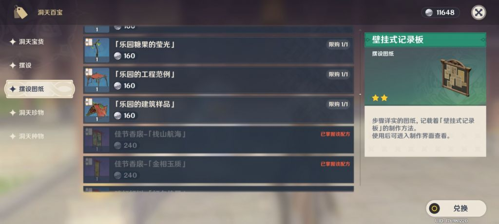
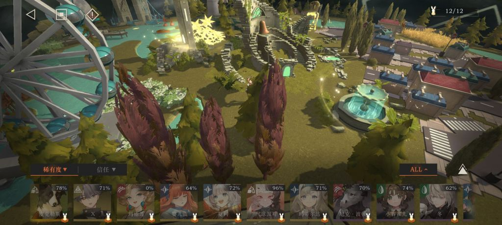
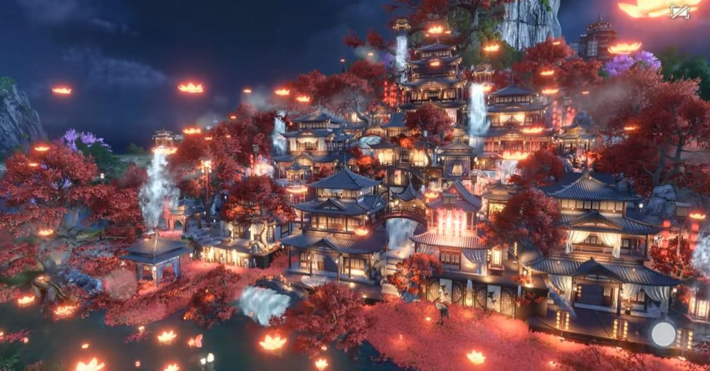
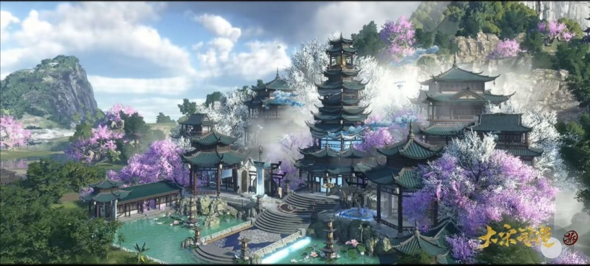

### [热点事件]从原神8月2日优化访谈谈米哈游脱离玩家的产品研发

Made by ngapost2md (c) ludoux [GitHub Repo](https://github.com/ludoux/ngapost2md)

----

##### 0.[0] \<pid:0\> 2023-08-02 15:21:17 by CUCUK
注明:
本帖重点讨论的不是运营和剧情，而是回顾原神发布三年，它的制作是如果从工业化沦为万恶流水线
_
今天的优化访谈，诸多可笑改动以及还没来得及新建文件夹的大饼，让我反思米哈游的工业化究竟哪里出了问题，结合原神三年的产品发表情况，个人做如下分析。
_
罪一:内容(流量)大于玩法，管生不管养
看见泥潭发帖说原神的新玩法总是非常无聊，或者说明明是新的常驻玩法，却设计的异常简陋。这并不是空穴来风，我们从原神第一个新增常驻玩法尘歌壶就不难看出，原神对待新增的常驻玩法通常不是为了玩家服务，而是服务于版本造势，利于买量推广。
此话怎讲。不论尘歌壶建造，亦或种菜钓鱼，都遵循一个规律，既刚推出时伴随高额奖励吸引你玩，但后期维护极其敷衍，最终被玩家抛弃。
下面我会着重围绕尘歌壶来探讨米在新玩法上的研发逻辑。
在须弥，推出了尘歌壶建造的临摹功能，推出这个功能的原因就是可以为版本宣传造势，买各种二创商单流量。为了配合临摹上线，尘歌壶的建造，在须弥更新了一个建造检索。因为图纸名称的设计之初就非常烂，你完全无法根据家具的样貌和名称直接判断家具类型，这个功能确实不错。
但是。
我敢肯定策划们平时压根就不玩他们设计的尘歌壶建造，或者不像玩家那样玩。因为整个尘歌壶建造系统，最需要检索功能的，不是已经有分类的建造页面，而是购买页面。目前尘歌壶有约数百图纸，全部挤在一列，仅通过手指滑动与拖动滑动栏。
而这由不得不提原神另一项逆天设计，采用win交互逻辑的[滑动栏]，项目越多，滑动栏越小。win好歹是个矩形，再小也是一条线，原神直接缩成一个点，各位登录游戏去图纸购买页试试，你点十次有多少次能选中这个滑动栏呢

尘歌壶的逆天设计可不止建造，还有邀请角色。邀请角色最大的功能就是增加好感度，但是竟然不支持直接显示好感度，来辅助玩家挑选入驻尘歌壶的角色。你每次调整入驻名单，都需要反复进角色页面看好感度，而尘歌壶进建造还偏偏有个CD。
[附图，某游的家园界面，可以根据角色稀有度既好感度，直接安排角色]

尘歌壶种地。刚推出的时候，囊括璃月蒙德几乎所有的采集突破素材，着实吸引了一波眼球，可到了稻妻须弥才发现逗你玩呢，新增加的可种素材全是野菜。原的种地更是以六块地之多，傲视所游戏的家园系统。
综上，其实不难看出，米给原神做这些玩法的初衷，仅仅是需要这些玩法的噱头吸引流量，并不是真正愿意为玩家去创造优质玩法并持续优化。宣传引新目的达到了，维护就敷衍了事。
_
罪二:玩家需要但米不需要，就不会做
说的最多的圣遗物配装，在赔宝的召唤下，终于开始画饼了。但我要说的这一位则更具代表性，那就是[狼王锚点]。
给狼王加锚点，可以说是原年一一直一直在社区讨论度颇高的话题，但是直到大部分离开蒙德再也不需要刷取狼王素材的今天，狼王都没有得到一个属于它的锚点。
这让人不禁好奇，原神目前304个锚点，给狼王新增一个锚点到底需要多少工作量?
答案是显而易见的，并不需要多少工作量，而且稍微关注社区的策划也不可能不知道这个需求，米哈游不做的唯一理由就是米并不重视玩家体验。只要流水线和留存合格，就不会浪费精力去优化玩家体验。
有个帖子说得很好，流水拉胯，月活拉胯，米哈游才会把1.X的用户调研翻出来看。
_
罪三:傲慢的制作观，已犯下的错误不修改，不改就是不用承认
这里面首先要说的就是璃月和须弥的声望周常。米哈游确实意识到了开元素视野墨迹半天是多愚蠢，并在稻妻做了改进。但是，正常的制作逻辑，是发现错误，改正错误。也就是应该把璃月和蒙德的声望周常一并进行优化，但是米并没有这样做。
类似的还出现在每日任务中。稻妻有几个每日，跑图可谓跋山涉水，有记忆的玩家知道米哈游在稻妻末的问卷中有过调研，确实须弥的每日跑图没有那么离谱了。但是稻妻每日呢？知道做的不好，但并没有优化。
米的研发，总给我一种傲慢，仿佛米在说“我做出来的东西不需要修改”，虽然他知道自己做的拉也会在以后缝缝补补，但就是不承认曾经错过。
_
总结一下，三则罪状只是临时起意而书，其实内涵或许有交叉。我个人观点，米在游戏制作理念上，工业化最初被交口称赞，使人们往往忽视了工业化另一个特点，就是没有温度。
我们看很多小厂游戏，各种逆天操作也好，良心操作也罢，你总可以从他们的滑轨声明、作死声明后看见游戏团队的态度，热也好冷也罢，你会觉得这群人终归是个可以交流的对象。你总是能期待下个游戏版本有点转变。
但是米的游戏，没有温度。就好像原神一个国家是一次性做好9个版本就打包好，研发人员就彻底走去下一个项目再不过问，运营就像拆快递一样一个版本拆一个包。而不会说官方会根据社区反馈，实时优化玩家体验。玩家想要表达需求，简直是在跨越时空交流。

----

##### 1.[5] \<pid:706486088\> 2023-08-02 15:23:52 by 乱世桃花精
流水线是有品控的！
请不要侮辱工业化、流水线这几个词

----

##### 2.[0] \<pid:706486433\> 2023-08-02 15:25:25 by 永不回头怅望
技术宅芒着开发常温超导，勿cue

----

##### 3.[0] \<pid:706486840\> 2023-08-02 15:27:08 by a1818137
赔宝，可比崩宝，帽宝，散宝什么勾八玩应好听多了

----

##### 4.[0] \<pid:706487104\> 2023-08-02 15:28:22 by 雪饼与仙贝
游戏体验重要吗？只有天天玩原的玩家才在乎吧，我米只管在复刻之前要捞钱了才赏夜兰十个指甲盖就够了，蒸馍，不扶器？

----

##### 5.[0] \<pid:706487393\> 2023-08-02 15:29:38 by yaemikochan
米的研发，总给我一种傲慢，仿佛米在说“我做出来的东西不需要修改”，虽然他知道自己做的拉也会在以后缝缝补补，但就是不承认曾经错过。
_
总结一下，三则罪状只是临时起意而书，其实内涵或许有交叉。我个人观点，米在游戏制作理念上，工业化最初被交口称赞，使人们往往忽视了工业化另一个特点，就是没有温度。
我们看很多小厂游戏，各种逆天操作也好，良心操作也罢，你总可以从他们的滑轨声明、作死声明后看见游戏团队的态度，热也好冷也罢，你会觉得这群人终归是个可以交流的对象。你总是能期待下个游戏版本有点转变。
但是米的游戏，没有温度。就好像原神一个国家是一次性做好9个版本就打包好，研发人员就彻底走去下一个项目再不过问，运营就像拆快递一样一个版本拆一个包。而不会说官方会根据社区反馈，实时优化玩家体验。玩家想要表达需求，简直是在跨越时空交流。

这段说的真好

----

##### 6.[0] \<pid:706487660\> 2023-08-02 15:30:54 by 啊哈信徒
跨时空交流挺形象的

----

##### 7.[0] \<pid:706487662\> 2023-08-02 15:30:54 by 白苹果k
其实就是流水不下跌，玩家的声音通通是噪音，因为他们不需要对玩家负责，只要对老板负责就行了，流水下跌老板来问责才会急

----

##### 8.[0] \<pid:706487668\> 2023-08-02 15:30:55 by lng236
忙着连号超跑入夜狂飙和看wb厕所，没有空去搭理玩家改这些东西

----

##### 9.[0] \<pid:706487890\> 2023-08-02 15:31:55 by 农企翻身了
别尬黑
我们Windows滚动条是有个固定的最小高度的

----

##### 10.[0] \<pid:706487946\> 2023-08-02 15:32:12 by 一只墩邦妮
老兄，你这发的游戏好玩不？

----

##### 11.[0] \<pid:706489642\> 2023-08-02 15:39:56 by lzlzzzz
 反正需要自己收集，花时间等家具造好，然后容量又不高的“家园”，真的挺。。。

----

##### 12.[1] \<pid:706490415\> 2023-08-02 15:43:11 by gtmmd
老米的“游戏”制作团队我可以说看不到一点对“做一个好游戏是有成就感”这点的表现，对自己参与的项目没有想做好的念头，做出来的东西只能是敷衍敷衍再敷衍，没有打磨、没有进步没有成长。
我敢说，老米现在内部员工就算知道社区环境有多差的今天，也不会感到一份失落或者情绪波动，因为他们的态度就是上班拿钱，产品做成什么样？我才不管

----

##### 13.[0] \<pid:706490556\> 2023-08-02 15:43:44 by 月舞星璇
招募成绩最好的大学生，用业界顶尖的三渲二引擎，开发各种弹珠，跳高，吃豆人，塔防，乒乓，拍照，扫雷，搭积木等等游戏

现在连活动场景都是复用了，不愧工业化

----

##### 14.[0] \<pid:706491666\> 2023-08-02 15:48:34 by CUCUK
>[jump](#pid706490415) gtmmd(2023-08-02 15:43) 说: 
>
>老米的“游戏”制作团队我可以说看不到一点对“做一个好游戏是有成就感”这点的表现，对自己参与的项目没有想做好的念头，做出来的东西只能是敷衍敷衍再敷衍，没有打磨、没有进步没有成长。
>我敢说，老米现在内部员工就算知道社区环境有多差的今天，也不会感到一份失落或者情绪波动，因为他们的态度就是上班拿钱，产品做成什么样？我才不管

从猛干哥语录就能看得出，自认为高出玩家一个维度的他们，压根不屑于获得玩家的认可

----

##### 15.[0] \<pid:706491669\> 2023-08-02 15:48:35 by samiyako
是管杀不管埋，不是管生不管养

----

##### 16.[0] \<pid:706492243\> 2023-08-02 15:51:05 by iospo
无言是最大的轻蔑

----

##### 17.[0] \<pid:706492308\> 2023-08-02 15:51:22 by 超音速凉面
在以后缝缝补补？在下一个游戏里缝缝补补！

----

##### 18.[2] \<pid:706492359\> 2023-08-02 15:51:36 by 右席酱
米以为的工业化：高质高量低成本，风格统一协调快速产出碾压对手，实际玩家到手的工业化：不停的生产一坨又一坨的答辩，简直停不下来

----

##### 19.[0] \<pid:706492589\> 2023-08-02 15:52:35 by 农企翻身了
>[jump](#pid706492308) 超音速凉面(2023-08-02 15:51)说:
>在以后缝缝补补？在下一个游戏里缝缝补补！

然后在再下一个游戏里把广受好评的部分砍废端上来给你

----

##### 20.[0] \<pid:706493074\> 2023-08-02 15:54:43 by 泡泡闪光必杀剑
工业化，谁和我说这话我笑谁，哪家工业化是稳定的生产答辩啊

----

##### 21.[1] \<pid:706493873\> 2023-08-02 15:58:22 by CUCUK
>[jump](#pid706492359) 右席酱(2023-08-02 15:51) 说: 
>
>米以为的工业化：高质高量低成本，风格统一协调快速产出碾压对手，实际玩家到手的工业化：不停的生产一坨又一坨的答辩，简直停不下来

确实
别人做烂一个版本就被骂到改，米做烂一国完全停不下来

----

##### 22.[0] \<pid:706494139\> 2023-08-02 15:59:39 by 柑橘橙橙橙橙橙子
你米愿意给种地高达20原石的奖励，却生怕你多种了几颗菜多得了几个素材

----

##### 23.[0] \<pid:706494555\> 2023-08-02 16:01:29 by CUCUK
>[jump](#pid706494139) 柑橘橙橙橙橙橙子(2023-08-02 15:59) 说: 
>
>你米愿意给种地高达20原石的奖励，却生怕你多种了几颗菜多得了几个素材

六块地不能再多了再多老米要亏了

----

##### 24.[0] \<pid:706495012\> 2023-08-02 16:03:29 by macree
Mhy说到底只是一家公司，员工也只想拿钱，你要是提出问题，上司说不定就把问题丢给你，还不如得过且过的拿钱办事的了

----

##### 25.[0] \<pid:706496113\> 2023-08-02 16:08:32 by scoutqq
>[jump](#pid706493074) 泡泡闪光必杀剑(2023-08-02 15:54) 说: 
>
>工业化，谁和我说这话我笑谁，哪家工业化是稳定的生产答辩啊

错误的,连答辩都不一定能稳定
我接下来要点名一款版本前瞻pv比游戏实装内容时长更长的游戏

----

##### 26.[1] \<pid:706496863\> 2023-08-02 16:11:46 by mie001
mhy：我要削弱芭芭拉，但是我如果直接说削弱就好像承认了我之前给她设计的强度有问题，所以我宣布修改bug！

----

##### 27.[0] \<pid:706498423\> 2023-08-02 16:18:41 by 风听沙白
我想说工业化的产品返厂维护和改进都是很迅速的，米这个拖拖拉拉N个版本过去毫无反应的，不知道工业化哪去了。

----

##### 28.[0] \<pid:706499339\> 2023-08-02 16:22:38 by Inquisit
>[jump](#pid706494555) CUCUK(2023-08-02 16:01) 说: 
>
>六块地不能再多了再多老米要亏了

实际上pvx玩家根本不需要家园给原石也不需要给角色升级材料，甚至自己倒贴花钱都心甘情愿
但你米唯独不给的就是自由度和负载量，随便截几张隔壁种菜可以种一整天种到吐但对战力o收益还要花免费货币的家园是原壶玩家不行吗，是壶不行

----

##### 29.[1] \<pid:706499994\> 2023-08-02 16:25:35 by 贾元春儿
高质量黑泥
同意主楼提到的几乎每一个点。

----

##### 30.[0] \<pid:706511106\> 2023-08-02 17:14:22 by 毛靴海盗
>[jump](#pid706486840) a1818137(2023-08-02 15:27) 说: 
>
>赔宝，可比崩宝，帽宝，散宝什么勾八玩应好听多了

~~PayPal ：啊？~~

----

##### 31.[0] \<pid:706511296\> 2023-08-02 17:15:10 by 毛靴海盗
某种意义上来说米算不算一种工业化仙人

----

##### 32.[0] \<pid:706511645\> 2023-08-02 17:16:44 by 御坂2180号
尘歌壶最逆天的是造家具，要一个一个点后续一点玩法都不给。

----

##### 33.[0] \<pid:706513543\> 2023-08-02 17:26:04 by Torchka123
真是怪了，厂商优化一下已出的内容跟要了他们命一样

----

##### 34.[0] \<pid:706518545\> 2023-08-02 17:47:38 by usfdocb
米家的反馈渠道真的给我一种无力感，那么多肉眼可见可以优化的地方就是死活不动，让他们多动一下跟要了他们命似的

----

##### 35.[0] \<pid:706518704\> 2023-08-02 17:48:21 by StayCoolBro
挺合理的

它們應該是宣傳公司，而不是做遊戲的公司

----

##### 36.[0] \<pid:706519801\> 2023-08-02 17:53:11 by 若长久
当年经过种地，钓鱼以及各种无聊而且拖时间的4399活动之后。
我对mhy最大的认识就是，mhy的游戏什么都好，就是不好玩，缺乏一个游戏最根本的东西，如无根之萍。
而现在，它不但游戏性差，连原本还能留得住我的剧情设定，漂亮女角色都没了

从2020.9.15开服初见原神的惊艳，之后因为不好玩逐渐丧失热情，到现在只想看原神怎么死

----

##### 37.[0] \<pid:706521522\> 2023-08-02 18:01:09 by kokobird
我感觉是对着空气交流，你说话不知道米能不能听到，米说话也不在乎你什么反应

----

##### 38.[0] \<pid:706522327\> 2023-08-02 18:05:03 by 十一阁下
[pid=706490415,37231371,1]Reply[/pid] <b>Post by [uid=60499710]gtmmd[/uid] (2023-08-02 15:43):</b>

上班是没有感情的社畜，下班是和你我一样的论坛乐子人。从米哈游宣称工业化开始，原神就不是对“做游戏”这件事有信念感的人适合待着的地方了

----

##### 39.[0] \<pid:706522852\> 2023-08-02 18:07:35 by Seebird
>[jump](#pid706499339) Inquisit(2023-08-02 16:22) 说: 
>
>实际上pvx玩家根本不需要家园给原石也不需要给角色升级材料，甚至自己倒贴花钱都心甘情愿
>但你米唯独不给的就是自由度和负载量，随便截几张隔壁种菜可以种一整天种到吐但对战力o收益还要花免费货币的家园是原壶玩家不行吗，是壶不行
>
>[img]./mon_202308/02/l2Q2

好家伙，第二个是璃月港复刻吗我得加倍努力种田了看来

----

##### 40.[0] \<pid:706524381\> 2023-08-02 18:15:01 by Collapsar。
>[jump](#pid706522852) Seebird(2023-08-02 18:07) 说: 
>
>好家伙，第二个是璃月港复刻吗我得加倍努力种田了看来

别侮辱顺火暖，这图上的建筑不比璃月港繁华多了

----

##### 41.[0] \<pid:706526344\> 2023-08-02 18:24:42 by Seebird
>[jump](#pid706524381) Collapsar。(2023-08-02 18:15) 说: 
>
>别侮辱顺火暖，这图上的建筑不比璃月港繁华多了

这倒是，暖的这个家园系统比壶好太多了

----

##### 42.[0] \<pid:706527562\> 2023-08-02 18:30:16 by 疯子二太郎
在ps5上买图纸简直就是灾难

----

##### 43.[0] \<pid:706528536\> 2023-08-02 18:34:53 by 文湫
这些事很重要吗？只有你们这样的玩家才觉得这些事儿重要吧？

----

##### 44.[0] \<pid:706529120\> 2023-08-02 18:37:34 by 二氧合蛋白氮
狼王锚点补充一下，优化到隔壁崩铁去了。崩铁所有的周本，突破boss，地脉花，甚至活动期间的npc都可以传送

----

##### 45.[0] \<pid:706531652\> 2023-08-02 18:49:49 by 丙卢娄乙冉马
回忆一下你能想起很多游戏制作人和老总玩自己的游戏，宫崎英高玩过魂，吉田玩过狒狒14，郭炜炜玩过剑三，马上要来的博德3老总在最初发布会上也整过扔靴子的活，现在刘伟有玩过自己的游戏吗？还是豪车好玩吧

----

##### 46.[0] \<pid:706534303\> 2023-08-02 19:02:48 by fyfhua
>[jump](#pid706531652) 丙卢娄乙冉马(2023-08-02 18:49) 说: 
>
>回忆一下你能想起很多游戏制作人和老总玩自己的游戏，宫崎英高玩过魂，吉田玩过狒狒14，郭炜炜玩过剑三，马上要来的博德3老总在最初发布会上也整过扔靴子的活，现在刘伟有玩过自己的游戏吗？还是豪车好玩吧

说到狒，人家狒狒几乎每个小版本都能端出来让玩家欢呼的系统优化，至少游戏制作组在玩自己的游戏，他们知道玩家在真正的游戏体验中需要什么
米呢？我只能看到他们的自我感动，看我做的东西多好都给我玩不玩我就逼着你玩

----

##### 47.[0] \<pid:706536767\> 2023-08-02 19:14:53 by ricardo_milos
米给我一种印象，就像顶级小镇做题家，很擅长刷题(抄和模仿)应付考试(超高的更新频率)，但是忙着赶路忙着卷，没有热情没有创造力

----

##### 48.[0] \<pid:706542313\> 2023-08-02 19:43:20 by 安希雅_R4
>[jump](#pid706499339) Inquisit(2023-08-02 16:22) 说: 
>
>实际上pvx玩家根本不需要家园给原石也不需要给角色升级材料，甚至自己倒贴花钱都心甘情愿
>但你米唯独不给的就是自由度和负载量，随便截几张隔壁种菜可以种一整天种到吐但对战力o收益还要花免费货币的家园是原壶玩家不行吗，是壶不行
>
>[img]./mon_202308/02/l2Q2

草，这是剑三还是逆水寒啊，中间那个才是我心目中的璃月啊

----

##### 49.[0] \<pid:706542550\> 2023-08-02 19:44:30 by setsuna2023
真正的工业化企业能容纳几十万就业还能走出国门正面刚顶尖外企甚至真·美国打压，你米配吗

----

##### 50.[0] \<pid:706543326\> 2023-08-02 19:49:13 by Inquisit
>[jump](#pid706542313) 安希雅_R4(2023-08-02 19:43) 说: 
>
>草，这是剑三还是逆水寒啊，中间那个才是我心目中的璃月啊

逆水寒而且它建筑不分内外，造完房子直接就能进去布置里面

----

##### 51.[0] \<pid:706554782\> 2023-08-02 20:58:19 by 为卿曲墨书离殇
技术宅忙着脑机接口呢，谁管你个破玩游戏的

----

##### 52.[0] \<pid:706556205\> 2023-08-02 21:07:42 by 霞云
>[jump](#pid706487946) 一只墩邦妮(2023-08-02 15:32):

重返未来1999吧，玩法不怎么样，剧情和演出不错，养成很肝

----

##### 53.[0] \<pid:706581245\> 2023-08-02 23:51:46 by Anthony润
提这个意见不下三次了，圣遗物、家具图纸栏的下拉滑动框太小，根本点不到
奈何mhy策划如此傲慢清高这期发的优化事项还是依托
现在我版本问卷都不做了，还是喜欢你米傲慢不羁的样子捏

----

##### 54.[0] \<pid:706585383\> 2023-08-03 00:22:48 by MLDOFMTC65
感觉不如脑补一下制作组在和植物抢空气zsbd

----

##### 55.[0] \<pid:706596646\> 2023-08-03 02:39:22 by he0119
>[jump](#pid706534303) fyfhua(2023-08-02 19:02) 说: 
>
>说到狒，人家狒狒几乎每个小版本都能端出来让玩家欢呼的系统优化，至少游戏制作组在玩自己的游戏，他们知道玩家在真正的游戏体验中需要什么
>米呢？我只能看到他们的自我感动，看我做的东西多好都给我玩不玩我就逼着你玩

而且真的会回去优化老版本体验，我记得以前吐槽很多的2.0老副本现在都优化了

----

##### 57.[0] \<pid:706596964\> 2023-08-03 02:46:28 by Lilith330
键鼠和手机我不知道，米哈游肯定没人用手柄玩过尘歌壶
昨天给坎迪斯建好感套装，一个沙漠房子我特么翻了一分钟都没翻到，左摇杆稍微动了一下又给我回到上级菜单了，然后我选进去重新从上面往下翻，六百多个东西一个个往下拉，快要拉到的时候摇杆稍微动一下又归零了，我真是鲨了ch的马
谁设计出来的逆天玩意，自己认领好吧 那几个什么摆件室外摆设的分类跟没用一样，谁知道那玩意是室内的还是室外的？喜欢我来回翻遍600多个家具才发现是图纸没解锁么
我可以说任何玩过尘歌壶的人都不至于放着这么个纱布玩意不优化一下，只能说他们是真的没玩过
不尊重玩家时间的公司只配被钉在耻辱柱上

----

##### 58.[0] \<pid:706597007\> 2023-08-03 02:47:46 by Hesperia
他们作为一个体量比较大的互联网公司到底有没有ux部门啊原的ux设计很多都是地狱级别的

----

##### 59.[0] \<pid:706602115\> 2023-08-03 06:17:19 by 雾雨之冬
>[jump](#pid706486433) 永不回头怅望(2023-08-02 15:25) 说: 
>
>技术宅芒着开发常温超导，勿cue

这个技术宅开发的产品里面，超导一定很强吧

----

##### 60.[0] \<pid:706606130\> 2023-08-03 07:38:01 by 格里兹纳特

zsbd，没什么好期待的，乐就完事了

----

##### 61.[1] \<pid:706624646\> 2023-08-03 09:33:25 by 兜适措蹩恣
手游厂商都是这样的，基本上只能唯流水论，只要流水能保住，自然能用沉默的大多数来洗论坛甚至问卷里的差评乃至中肯的建议(如果他们真的会看的话)。换言之不影响流水的改动，不论是mhy还是其他手游厂家，基本上是不会去做的。
然而其他厂家要是在论坛提出中肯的建议，合理的黑泥，甚至对于游戏内逆天操作的谩骂，其他玩家都会来帮帮场子。
mhy这边恰恰相反，会有一帮堵嘴洗地的。我提手柄优化的建议，立马就会有“底层代码”“手柄玩家少”这种话术来堵嘴。即使优化手柄对于键鼠和搓玻璃的玩家没有任何影响。
论坛的观感说不定真的会影响到沉默的大多数从而影响到流水的。只能说mhy养的好一手粉丝，直到出了岁月史书这种逆天大活才真正迎来崩溃，一味的堵嘴加固堤坝挡得住洪水还好，挡不住，决堤只会引发更大的洪水。当然在某些网站某些论坛的某些板块还是一片歌舞升平。

