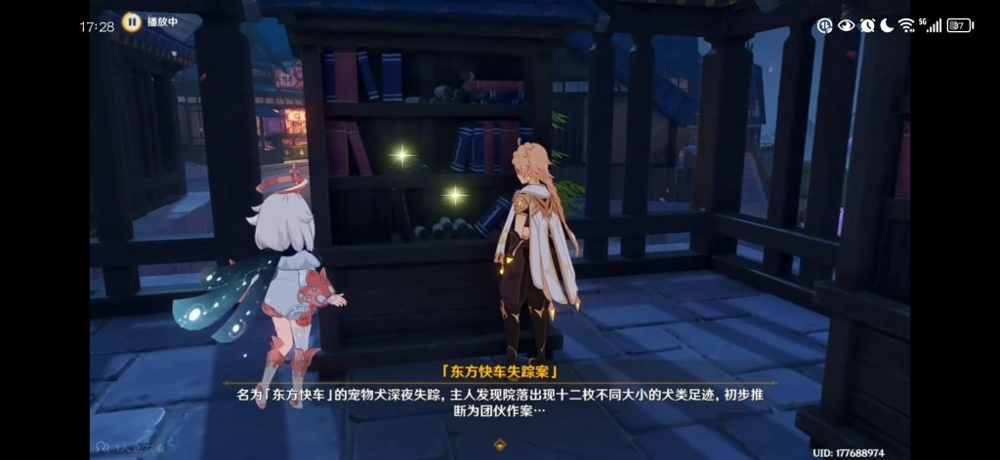

### [不吐不快] 无奖竞猜，以猛干老师为代表的文案们看过多少经典侦探小说

Made by ngapost2md (c) ludoux [GitHub Repo](https://github.com/ludoux/ngapost2md)

----

##### 0.[0] \<pid:0\> 2023-08-02 16:57:45 by 霞云
我猜完整看完的是0我相信他们的实力
再猜猜这次水国剧情会缝多少断章取义的名著桥段，再美其名曰致敬？

----

##### 1.[3] \<pid:706508935\> 2023-08-02 17:04:29 by cbgc343
就崩三有关福尔摩斯的剧情来说，他们可能没看过柯南道尔原作只看过福改影视剧……或者更进一步，只看过名侦探柯南

----

##### 2.[0] \<pid:706508954\> 2023-08-02 17:04:34 by 神乐苍籁
压一个只看过名侦探柯南

----

##### 3.[1] \<pid:706509055\> 2023-08-02 17:05:03 by 剑筑师と書記官
我猜是看了电影解说就当自己看过了然后进来缝

----

##### 4.[0] \<pid:706509316\> 2023-08-02 17:06:07 by 霞云
>[jump](#pid706508954) 神乐苍籁(2023-08-02 17:04)说:
>压一个只看过名侦探柯南

估计连逆转裁判系列都没看完罢

----

##### 5.[4] \<pid:706509373\> 2023-08-02 17:06:22 by Gdygfdqqqq
反正必缝逆转裁判mhy借鉴了这么久的卡普空，这次不借鉴了我都不信

----

##### 6.[1] \<pid:706509640\> 2023-08-02 17:07:40 by 哈啤哈沃克
想缝波洛那起码英剧得看过吧，别给波洛真整成法国人就行

----

##### 7.[0] \<pid:706509669\> 2023-08-02 17:07:48 by 神乐苍籁
>[jump](#pid706509316) 霞云(2023-08-02 17:06) 说: 
>
>估计连逆转裁判系列都没看完罢

我估摸着应该是只云过123，实际上手都没上过要是玩过大逆转未定那个调查怎么会做的那么烂我参加过未定内测

----

##### 8.[0] \<pid:706509681\> 2023-08-02 17:07:52 by Noven
根据我读侦探小说的经验...
大部分写得好的作者即使不写侦探小说也是一流水准.....

----

##### 9.[1] \<pid:706509683\> 2023-08-02 17:07:53 by Fablet
我猜……李猛干们了解的推理小说知识量不如怪异菌(辱了)。
估计李猛干们能干出来，把偏向冒险小说的福尔摩斯探案集，抬到高于黄金三角的笑话。  
~~那个笑话咋说的来着，阿婆是黄金，奎因是三角，卡尔是连接符~~

----

##### 10.[0] \<pid:706509777\> 2023-08-02 17:08:19 by 冬日霜露
必缝弹丸论破

----

##### 11.[0] \<pid:706509965\> 2023-08-02 17:09:10 by 七月七寄
说不定只是抖音看了点快进解说就开缝了

----

##### 12.[1] \<pid:706510085\> 2023-08-02 17:09:41 by sunshine23334
夏洛克福尔摩斯你就只能走好了，应该霍霍不到我喜欢的别的侦探了

----

##### 13.[0] \<pid:706510216\> 2023-08-02 17:10:20 by yxliu24
定不如我
(家里30+本格新本格)

----

##### 15.[1] \<pid:706510903\> 2023-08-02 17:13:29 by gtmmd
不知道看没看过阿加莎克里斯蒂的，我猜不一定

----

##### 16.[0] \<pid:706511441\> 2023-08-02 17:15:52 by sunshine23334
>[jump](#pid706510903) gtmmd(2023-08-02 17:13) 说: 
>
>不知道看没看过阿加莎克里斯蒂的，我猜不一定

东方快车谋杀案的电影应该很有名，说不定逢点皮毛就行了~~我想看文案缝无人生还 ~~

----

##### 17.[0] \<pid:706511554\> 2023-08-02 17:16:17 by abasiyaluo2
我是觉得有逆转裁判水平就可以了。但我估计编剧们想着整点大活，逆转那种轻松日常带点喜剧的风格还原不出来 。

----

##### 18.[2] \<pid:706511787\> 2023-08-02 17:17:27 by 两块半大魔王
人家猛干哥是看克苏鲁的好不啦

----

##### 19.[0] \<pid:706511851\> 2023-08-02 17:17:41 by 零点，陈彬
>[jump](#pid706511441) sunshine23334(2023-08-02 17:15) 说: 
>
>东方快车谋杀案的电影应该很有名，说不定逢点皮毛就行了~~我想看文案缝无人生还 ~~

我觉得吧，有点难

----

##### 20.[1] \<pid:706511895\> 2023-08-02 17:17:55 by 芒果布丁555
>[jump](#pid706510903) gtmmd(2023-08-02 17:13) 说: 
>
>不知道看没看过阿加莎克里斯蒂的，我猜不一定

我猜那几部比较出名的电影应该是知道的，但也就仅限于此了

----

##### 21.[1] \<pid:706512314\> 2023-08-02 17:19:52 by 色胚茄子
！后排求推理小说推荐，欧内盖西马斯！(鞠躬)

----

##### 22.[0] \<pid:706512371\> 2023-08-02 17:20:07 by Fablet
>[jump](#pid706511787) 两块半大魔王(2023-08-02 17:17) 说: 
>
>人家猛干哥是看克苏鲁的好不啦

猛干哥看克苏鲁(×)
猛干哥是克苏鲁(对)

----

##### 23.[2] \<pid:706512424\> 2023-08-02 17:20:23 by 无涯本涯
楼里说东方快车谋杀案的，这个在鹿野院邀约的时候就已经当梗用过了啊

----

##### 24.[0] \<pid:706512726\> 2023-08-02 17:21:55 by sunshine23334
>[jump](#pid706512314) 色胚茄子(2023-08-02 17:19) 说: 
>
>！后排求推理小说推荐，欧内盖西马斯！(鞠躬)

那我要给你推荐我现在正在看的岛田庄司的螺丝人了，虽然有点老，但是在我看来还是很精彩的

----

##### 25.[0] \<pid:706512903\> 2023-08-02 17:22:52 by safindem
>[jump](#pid706512314) 色胚茄子(2023-08-02 17:19)说:
>！后排求推理小说推荐，欧内盖西马斯！(鞠躬)

玫瑰的名字
如果想脑补未修改的草石头文案剧情的话我觉得这是最好的参考用书

----

##### 26.[0] \<pid:706512914\> 2023-08-02 17:22:55 by sunshine23334
>[jump](#pid706512424) 无涯本涯(2023-08-02 17:20) 说: 
>
>楼里说东方快车谋杀案的，这个在鹿野院邀约的时候就已经当梗用过了啊

好吧，邀约我都没有过，那我能期待无人生还了吗？

----

##### 27.[0] \<pid:706513115\> 2023-08-02 17:23:55 by 御坂2180号
没有逆转系列我不认可

----

##### 28.[0] \<pid:706513579\> 2023-08-02 17:26:12 by yxliu24
>[jump](#pid706512314) 色胚茄子(2023-08-02 17:19) 说: 
>
>！后排求推理小说推荐，欧内盖西马斯！(鞠躬)

希腊棺材之谜 x的悲剧
本格+推理的浪漫

三口棺材
极致的密室诡计

犹大之窗
节奏很棒的法庭辩论题材

点与线
清爽的社会派

钟表馆
新本格无人生还

----

##### 29.[0] \<pid:706513754\> 2023-08-02 17:27:04 by Inquisit
但肯定会大抄特抄然后被xz们把借鉴内容据为己有口牙

----

##### 30.[0] \<pid:706513785\> 2023-08-02 17:27:10 by ArseneZ
>[jump](#pid706512314) 色胚茄子(2023-08-02 17:19) 说: 
>
>！后排求推理小说推荐，欧内盖西马斯！(鞠躬)

几年前看过一本彩虹牙刷。感觉很适合你的名字。

----

##### 31.[1] \<pid:706514285\> 2023-08-02 17:29:22 by 无涯本涯
>[jump](#pid706512914) sunshine23334(2023-08-02 17:22) 说: 
>
>好吧，邀约我都没有过，那我能期待无人生还了吗？

它蹭也就是这种水平了，如果你是希望它整个好活儿的话，那还是v我50吧

----

##### 32.[0] \<pid:706514423\> 2023-08-02 17:29:49 by 黑眼睛的银白色暴风雪
>[jump](#pid706512726) sunshine23334(2023-08-02 17:21) 说: 
>
>那我要给你推荐我现在正在看的岛田庄司的螺丝人了，虽然有点老，但是在我看来还是很精彩的

毕竟是岛田庄司的回光返照之作

----

##### 33.[0] \<pid:706516320\> 2023-08-02 17:38:01 by sunshine23334
>[jump](#pid706514285) 无涯本涯(2023-08-02 17:29) 说: 
>
>它蹭也就是这种水平了，如果你是希望它整个好活儿的话，那还是v我50吧

硬蹭是吧，结晶看了直呼太细了

----

##### 34.[0] \<pid:706516633\> 2023-08-02 17:39:15 by 奇怪毛
压一个名侦探柯南

----

##### 35.[0] \<pid:706516695\> 2023-08-02 17:39:30 by annadian
能把柯南看全就不错了

----

##### 36.[3] \<pid:706517049\> 2023-08-02 17:40:57 by scoutqq
为啥你们都猜本格派,以阿米这么喜欢锐评和卖现实梗来说不是更应该缝社会派吗

----

##### 37.[0] \<pid:706517563\> 2023-08-02 17:43:16 by 五蕴盛苦
>[jump](#pid706509640) 哈啤哈沃克(2023-08-02 17:07):

疑似已经neta过了(？) 不过具体文本我真忘了

----

##### 38.[2] \<pid:706517736\> 2023-08-02 17:44:06 by sunshine23334
>[jump](#pid706517049) scoutqq(2023-08-02 17:40) 说: 
>
>为啥你们都猜本格派,以阿米这么喜欢锐评和卖现实梗来说不是更应该缝社会派吗

那缝个我高中时感觉大热的东野圭吾？

----

##### 39.[0] \<pid:706517750\> 2023-08-02 17:44:08 by OrionLatte
异邦骑士？罗刹那个任务名

----

##### 40.[4] \<pid:706517790\> 2023-08-02 17:44:18 by UID64792814
建议 云一下 崩铁版麦琪的礼物
虎克同行任务

你们就会体会 看着原著“被致敬”是多么绝望了

----

##### 41.[0] \<pid:706518252\> 2023-08-02 17:46:25 by 黑眼睛的银白色暴风雪
>[jump](#pid706512314) 色胚茄子(2023-08-02 17:19) 说: 
>
>！后排求推理小说推荐，欧内盖西马斯！(鞠躬)

看起喜欢什么类型的了
古典推理的话，除了黄金三角，强烈推荐保罗霍尔特的几本代表作，第七重解答，第四扇门以及我个人非常喜欢的幻影小巷
新本格的话，岛田庄思的四大名著加螺丝人都值得推荐，零食的馆系列则只推荐钟表馆之谜，其他的都是一坨答辩。青崎有吾的体育馆之谜强烈，后面的水族馆与图书馆也还凑合，但是不如第一本。贵志佑介虽然是恐怖小说出身，但是那本玻璃之锤确实算是推理佳作，也值得一看。还有最近从baka推理转型回来的白井智之的名侦探的牺牲，算是这几年最好的本格作品了
喜欢氛围感强烈的民俗推理的话，中文推理圈第一网红神作首无作崇之物值得推荐，可惜三三发挥过于不稳定，整个系列也就这本和作者不详算是优秀。
叙诡的话我个人比较喜欢的是向日葵不开的夏天，主要是把叙诡的部分与作品的氛围融合的很好，不像很多其他作品单纯为了叙诡而叙诡。
设定系的话前两年很火的那本灵媒侦探不错，亮点都在最后的反转，但是记得别看第二本。而方丈贵惠作为最近的当红炸子鸡，时间旅行者的沙漏、孤岛的来访者以及让名侦探甜美的死亡确实一本比一本出色，值得一看。
至于社会派我其实看得不多，不过凑佳苗的那本告白我还是蛮喜欢的，别当推理小说看就好…

----

##### 42.[0] \<pid:706518683\> 2023-08-02 17:48:13 by iwhcd
>[jump](#pid706509373) Gdygfdqqqq(2023-08-02 17:06):

听说4.0散兵会出场，等一手散兵被抓玩家当辩护律师

----

##### 43.[2] \<pid:706519627\> 2023-08-02 17:52:26 by 五蕴盛苦
>[jump](#pid706518252) 黑眼睛的银白色暴风雪(2023-08-02 17:46)说:
>[quote][pid=706512314,37232519,2]Reply[/pid] <b>Post by [uid=42899117]色胚茄子[/uid] (2023-08-02 17:19):</b>  ！后排求推理小说推荐，欧内盖西马斯！(鞠躬)[/quote]看你喜欢什么类型的了 古典推理的话，除了黄金三角，强烈推荐保罗霍尔特的几本代表作，第七重解答，第四扇门以及我个人非常喜欢的幻影小巷 新本格的话，岛田庄司的四大名著加螺丝人都值得推荐，零食的馆系列则只推荐钟表馆之谜，其他的都是一坨答辩。青崎有吾的体育馆之谜强烈，后面的水族馆与图书馆也还凑合，但是不如第一本。贵志佑介虽然是恐怖小说出身，但是那本玻璃之锤确实算是推理佳作，也值得一看。还有最近从baka推理转型回来的白井智之的名侦探的牺牲，算是这几年最好的本格作品了 喜欢氛围感强烈的民俗推理的话，中文推理圈第一网红神作首无作崇之物值得推荐，可惜三三发挥过于不稳定，整个系列也就这本和作者不详算是优秀。 叙诡的话我个人比较喜欢的是向日葵不开的夏天，主要是把叙诡的部分与作品的氛围融合的很好，不像很多其他作品单纯为了叙诡而叙诡。 设定系的话前两年很火的那本灵媒侦探不错，亮点都在最后的反转，但是记得别看第二本。而方丈贵惠作为最近的当红炸子鸡，时间旅行者的沙漏、孤岛的来访者以及让名侦探甜美的死亡确实一本比一本出色，值得一看。 至于社会派我其实看得不多，不过凑佳苗的那本告白我还是蛮喜欢的，别当推理小说看就好…

贵志佑介！点了！
不过我觉得这人还是写悬疑带感一点

----

##### 44.[0] \<pid:706523047\> 2023-08-02 18:08:28 by 万岁玛利亚
>[jump](#pid706511554) abasiyaluo2(2023-08-02 17:16) 说: 
>
>我是觉得有逆转裁判水平就可以了。但我估计编剧们想着整点大活，逆转那种轻松日常带点喜剧的风格还原不出来 。

大哥，你以为巧舟的剧情这么好复刻吗这么好做那正转裁判 倒转裁判早就满地走了

----

##### 45.[0] \<pid:706523208\> 2023-08-02 18:09:16 by kunizu
柯南总看过的吧，“你们没有童年吗？.jpg”

----

##### 46.[0] \<pid:706523260\> 2023-08-02 18:09:31 by 万岁玛利亚
快进到不是原神谁认识逆转裁判

----

##### 47.[0] \<pid:706540903\> 2023-08-02 19:35:58 by abasiyaluo2
>[jump](#pid706523047) 万岁玛利亚(2023-08-02 18:08)说:
>[quote][pid=706511554,37232519,1]Reply[/pid] <b>Post by [uid=65163511]abasiyaluo2[/uid] (2023-08-02 17:16):</b>  我是觉得有逆转裁判水平就可以了。但我估计编剧们想着整点大活，逆转那种轻松日常带点喜剧的风格还原不出来 。[/quote]大哥，你以为巧舟的剧情这么好复刻吗[s:ac:汗]这么好做那正转裁判 倒转裁判早就满地走了

当然不好复刻所以我说能有逆转裁判水平就很不错了

----

##### 48.[0] \<pid:706543935\> 2023-08-02 19:52:44 by liveriver
都要上法庭，编剧不考虑缝个十二怒汉

----

##### 49.[0] \<pid:706545686\> 2023-08-02 20:02:59 by 点滴的空想
有一说一，看估计肯定是看过不少的，猛干老师都是trow论坛翻译者，阿婆小说已经算爆火大众小说了，更不用说福尔摩斯这种很多人小时候就看完

就是以他们这水平最好一点不改全部照抄，不然搞出逻辑漏洞出来挺尴尬的

更不要尝试碰缝菠萝夏洛克这种逆天行为

