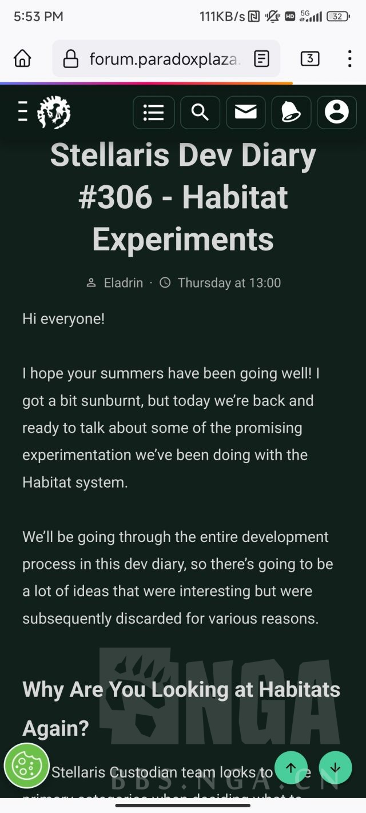
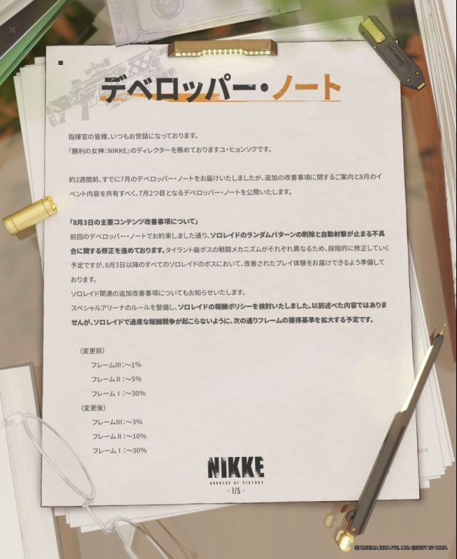
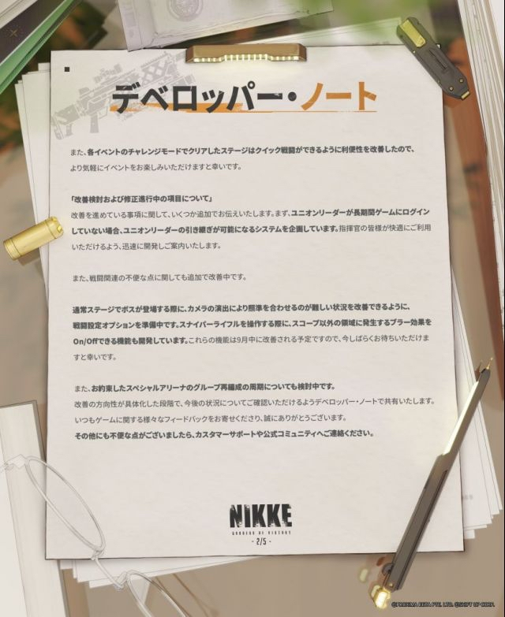
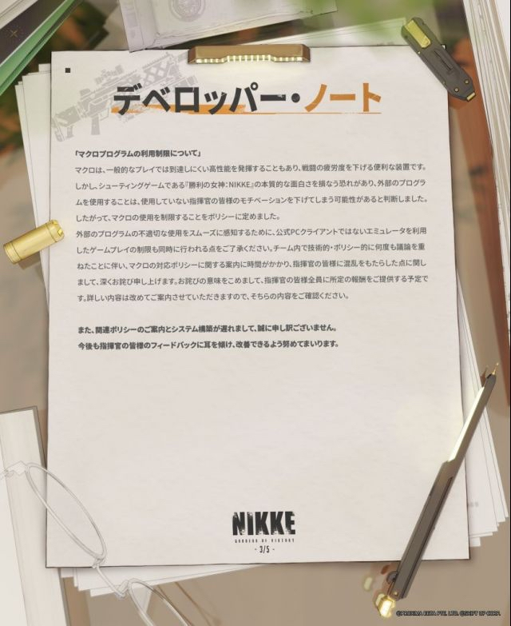
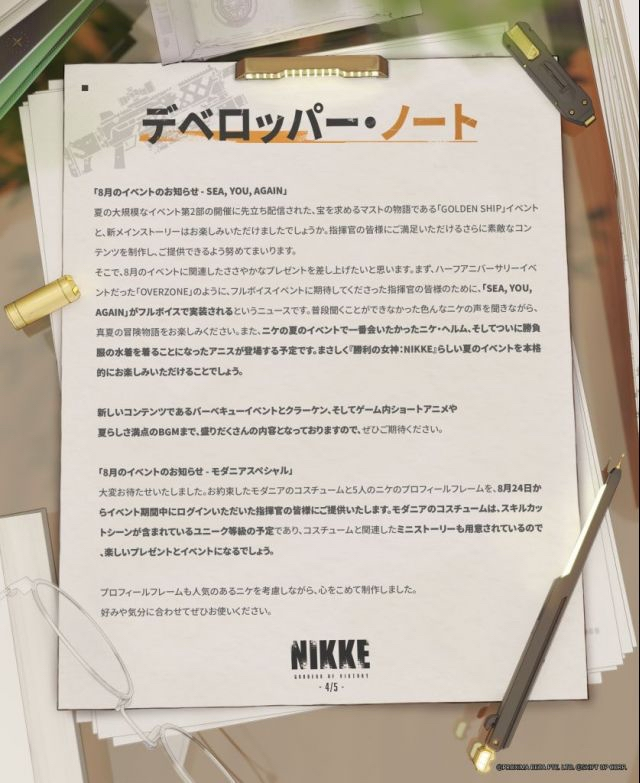
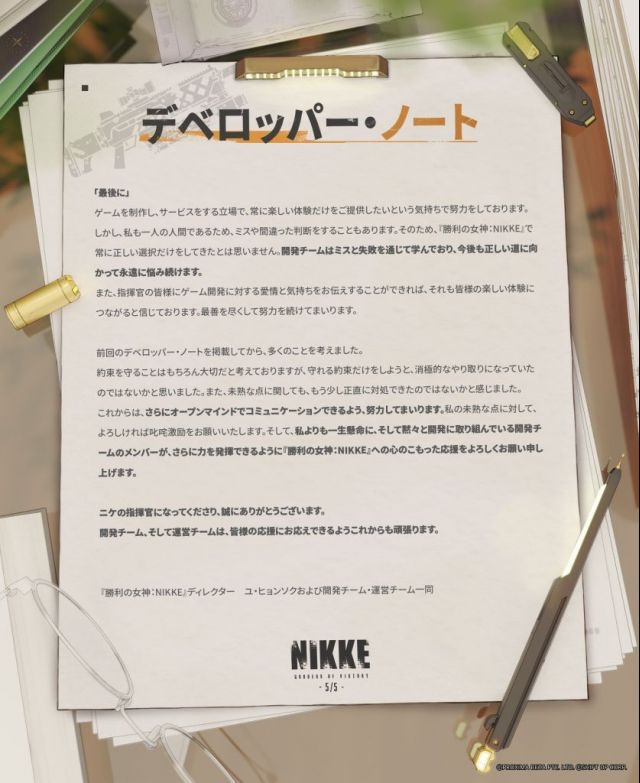

### [热点事件]你的桀骜不驯，让我感到恶心

Made by ngapost2md (c) ludoux [GitHub Repo](https://github.com/ludoux/ngapost2md)

----

##### 0.[7] \<pid:0\> 2023-08-02 17:04:42 by kimiwaboki
受不了了，有感而发，直接进行一个联动:
[url](https://ngabbs.com/read.php?tid=37228608)
这是2023年的:
这是2021年的:
这是2020年的:
什么?你问我为什么没有2022年的?
那你<b>一整年不发一个</b>我能怎么办呢?

----

##### 1.[8] \<pid:706517831\> 2023-08-02 17:44:27 by Gdygfdqqqq
这个座谈会跟放屁一样除了+300格子其他都没什么用
尤其是四星圣遗物直接摧毁我笑了，ch就抱着他那个圣遗物狗粮进棺材吧

----

##### 2.[0] \<pid:706518765\> 2023-08-02 17:48:40 by q794623
反正我自从看过那啥。。。丘丘人发的什么玩家反馈里面。。。

有什么诸如圣遗物强化返回不方便之类的问题的时候

我就懂了，你米策划与其说脑子有问题，不如说脑子里有东西(物理)，，，，流上脑是吧

----

##### 3.[0] \<pid:706518840\> 2023-08-02 17:48:59 by a838695857
最搞笑一共要实装也就标题上那两条 其他的全是画饼
居然有脸在标题后面加省略号

----

##### 4.[0] \<pid:706519842\> 2023-08-02 17:53:21 by ximu23
打补丁修bug修充值问题倒是很积极

----

##### 5.[0] \<pid:706521887\> 2023-08-02 18:02:53 by UID3563849
可恶
他宁愿放座谈会都不预热4.0

----

##### 6.[0] \<pid:706522152\> 2023-08-02 18:04:08 by lly0571
米哈游的面对玩家反馈的态度，连靠卖DLC挣钱的单机厂商都比不过。p社的单机游戏都能每周出一篇开发日志，内容比米的多。

<a href="javascript:;" onclick="collapse(this);">+</a>某单机策略游戏的开发日志 ...

----

##### 7.[0] \<pid:706523344\> 2023-08-02 18:10:00 by qianshuijun2
我们很重视玩家的意见.jpg

----

##### 8.[0] \<pid:706546271\> 2023-08-02 20:06:43 by kunizu
>[jump](#pid706522152) lly0571(2023-08-02 18:04) 说: 
>
>米哈游的面对玩家反馈的态度，连靠卖DLC挣钱的单机厂商都比不过。p社的单机游戏都能每周出一篇开发日志，内容比米的多。

<a href="javascript:;" onclick="collapse(this);">+</a>某单机策略游戏的开发日志 ...

好文明，所有游戏都要学习它！

----

##### 9.[0] \<pid:706547875\> 2023-08-02 20:16:04 by 威尔逊以撒
>[jump](#pid706522152) lly0571(2023-08-02 18:04) 说: 
>
>米哈游的面对玩家反馈的态度，连靠卖DLC挣钱的单机厂商都比不过。p社的单机游戏都能每周出一篇开发日志，内容比米的多。

<a href="javascript:;" onclick="collapse(this);">+</a>某单机策略游戏的开发日志 ...

辱群星了

----

##### 10.[0] \<pid:706548447\> 2023-08-02 20:19:26 by 世间开明
4星快捷摧毁本来就该跟快捷摧毁一起实装，本来4星就改成可摧毁了，还很倔强地不让快捷放是什么心态，除了故意恶心玩家以外没有任何其他理由。
无法快捷摧毁→快捷摧毁1-3星→可以长按拖动批量选择→可以快捷摧毁4星，mhy你累不累，掖着藏着一点点放优化假装在干活来堵嘴吗？
说到底快捷摧毁本来就是开服该有的功能，20年下半年开服的游戏竟然还要手动一个个点我早就想吐槽了，这破玩意能摧毁换摩拉真是亏大发了所以得增加玩家操作量是吗。
然后开服都快三年了还死扣那点狗粮经验是吧，虽然我也不咋缺狗粮但更不缺摩拉，都2亿多摩拉了还让我摧毁换摩拉呢。

----

##### 11.[0] \<pid:706560662\> 2023-08-02 21:36:41 by SUTOP
>[jump](#pid0) kimiwaboki(2023-08-02 17:04):

警惕赛博骗炮

----

##### 12.[0] \<pid:706562693\> 2023-08-02 21:49:42 by 友项
>[jump](#pid706522152) lly0571(2023-08-02 18:04) 说: 
>
>米哈游的面对玩家反馈的态度，连靠卖DLC挣钱的单机厂商都比不过。p社的单机游戏都能每周出一篇开发日志，内容比米的多。

<a href="javascript:;" onclick="collapse(this);">+</a>某单机策略游戏的开发日志 ...

说单机算欺负他们了，让米桑看看nikke人家的态度。天壤之别。

<a href="javascript:;" onclick="collapse(this);">+</a>妮姬开发月度日志 ...

----

##### 13.[0] \<pid:706563764\> 2023-08-02 21:56:36 by 冯仔from2001
>[jump](#pid706519842) ximu23(2023-08-02 17:53)说:
>打补丁修bug修充值问题倒是很积极[s:ac:茶]

就这还吹什么几百人的游戏团队……花4 5千去经济不发达的小城镇找个大学生程序员修一下，可能都能搞定

