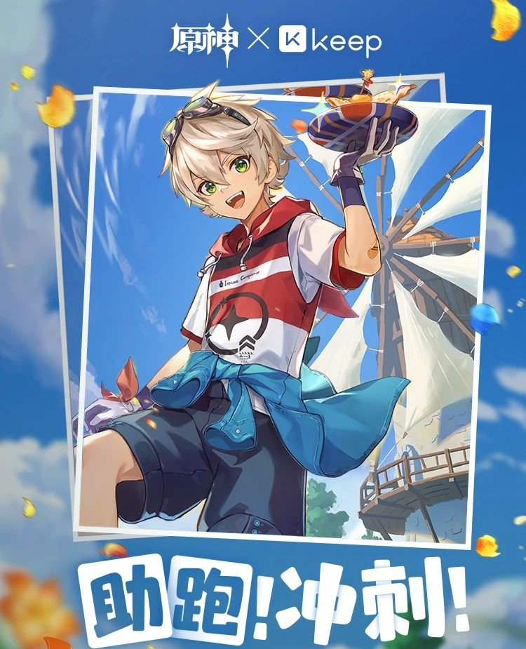

### [热点事件] 支付宝两期联动都是男角色

Made by ngapost2md (c) ludoux [GitHub Repo](https://github.com/ludoux/ngapost2md)

----

##### 0.[0] \<pid:0\> 2023-08-02 19:26:45 by Rontee

----

##### 1.[1] \<pid:706539324\> 2023-08-02 19:28:03 by Genius拉拉
之前不是还有可莉和砂糖柯莱吗，找点好角度车()

----

##### 2.[5] \<pid:706539655\> 2023-08-02 19:29:52 by 子夜歌QAQ
联动这种东西角色是联动方挑的

----

##### 3.[0] \<pid:706539752\> 2023-08-02 19:30:23 by 大漠孤雪
之前甘雨联名了信用卡

----

##### 4.[0] \<pid:706542114\> 2023-08-02 19:42:15 by tbiph9277
开始带节奏了是吧

----

##### 5.[0] \<pid:706542501\> 2023-08-02 19:44:18 by 没朋友的自闭人
虽然但是，这种东西是联动方选的吧

----

##### 6.[0] \<pid:706543357\> 2023-08-02 19:49:21 by 冬瓜A梦
小提都营业了多少次了，你们须弥没有别的男人了吗

----

##### 7.[0] \<pid:706543868\> 2023-08-02 19:52:15 by ricardo_milos
怎么说呢
阿贝多提那里是女性审美的男角色，可莉砂糖是不媚宅的一般向女角色

假如男角色变成一般向的，比如钟离+(第二个想不出，呃公子吧？)，女角色上申鹤+(第二个ml又涩的实在想不出…呃神里吧？)，这受众是不一样的

说白了你原受众是泛女性群体

----

##### 8.[0] \<pid:706545012\> 2023-08-02 19:59:08 by 白浪梅
那还是建议车点好的这次这个是晨光奇只好玩+支付宝的环保向联动，估下来得两个月

----

##### 9.[1] \<pid:706545235\> 2023-08-02 20:00:21 by 今天休息一会嘛
里版没话题了也不是这么带的

----

##### 11.[0] \<pid:706545843\> 2023-08-02 20:04:06 by 玩c罗玩的
>[jump](#pid706543868) ricardo_milos(2023-08-02 19:52) 说: 
>
>怎么说呢
>阿贝多提那里是女性审美的男角色，可莉砂糖是不媚宅的一般向女角色
>
>假如男角色变成一般向的，比如钟离+(第二个想不出，呃公子吧？)，女角色上申鹤+(第二个ml又涩的实在想不出…呃神里吧？)，这受众是不一样的
>
>说白了你原受众是泛女性群体

一般向男角色 那不得提名个班尼特

----

##### 12.[0] \<pid:706546151\> 2023-08-02 20:05:54 by ricardo_milos
>[jump](#pid706545843) 玩c罗玩的(2023-08-02 20:04) 说: 
>
>一般向男角色 那不得提名个班尼特

衣着暴露的小男孩跟一般向大概没什么关系
一般向小男孩学学林克吧，不娘，不骚，不x暗示

----

##### 13.[0] \<pid:706552272\> 2023-08-02 20:43:17 by ZFBXBD
喜茶：你在说什么？

----

##### 14.[0] \<pid:706552674\> 2023-08-02 20:45:33 by 0123cola
>[jump](#pid706546151) ricardo_milos(2023-08-02 20:05)说:
>[quote][pid=706545843,37234262,1]Reply[/pid] <b>Post by [uid=65143957]玩c罗玩的[/uid] (2023-08-02 20:04):</b>  一般向男角色 那不得提名个班尼特[s:ac:哭笑][/quote]衣着暴露的小男孩跟一般向大概没什么关系[s:ac:哭笑] 一般向小男孩学学林克吧，不娘，不骚，不x暗示

班尼特我记得是经典南通喜欢的角色吧，我指的是正经三次元南通，记得之前主板投票他好像挺高的?

----

##### 15.[0] \<pid:706563312\> 2023-08-02 21:53:49 by 亦鸟LL
>[jump](#pid706545843) 玩c罗玩的(2023-08-02 20:04) 说: 
>
>一般向男角色 那不得提名个班尼特

最近联动过了

----

##### 16.[1] \<pid:706565908\> 2023-08-02 22:11:06 by 寻找着徘徊着
>[jump](#pid706546151) ricardo_milos(2023-08-02 20:05) 说: 
>
>衣着暴露的小男孩跟一般向大概没什么关系
>一般向小男孩学学林克吧，不娘，不骚，不x暗示

要不是林克的本子那么多我就信了

----

##### 17.[0] \<pid:706566970\> 2023-08-02 22:18:23 by xhdijx
>[jump](#pid706543868) ricardo_milos(2023-08-02 19:52)说:
>怎么说呢[s:ac:哭笑] 阿贝多提那里是女性审美的男角色，可莉砂糖是不媚宅的一般向女角色  假如男角色变成一般向的，比如钟离+(第二个想不出，呃公子吧？)，女角色上申鹤+(第二个ml又涩的实在想不出…呃神里吧？)，这受众是不一样的  说白了你原受众是泛女性群体

没太看懂这段，阿贝多提纳里为什么是偏向女性审美的男角色，而且论起来公子卖的ml应该比提纳里多的吧。申鹤和甘雨，绫人和绫华联动的喜茶又是面向哪个群体的

