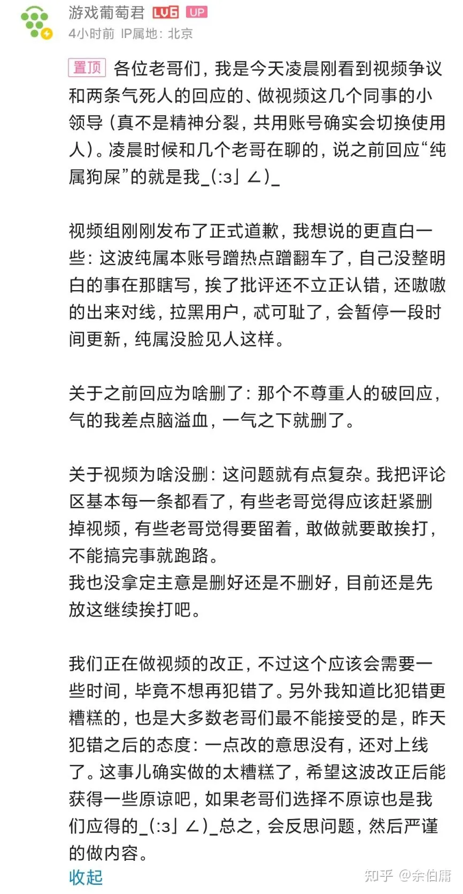

### [不吐不快] 游戏葡萄的软文称，原神制作组至少有1000人

Made by ngapost2md (c) ludoux [GitHub Repo](https://github.com/ludoux/ngapost2md)

----

##### 0.[3] \<pid:0\> 2023-08-02 22:19:43 by 云彩间隙裏消逝
emmm，那么问题来了，既然有这么多人，那原神的各种优化，emmmm
[url](https://mp.weixin.qq.com/s/F8p1LOjPZ-QbOC5jGpqGjg)
“目前米哈游的总人数已经超过了5000人，其中仅《原神》项目组就超过了1000人。面对这一情况，高层没有给出裁员优化的人数指标，而是要求大家思考一个问题：你的现有人员规模是否给业务带来了足够的价值？”

----

##### 1.[0] \<pid:706570178\> 2023-08-02 22:38:39 by 无料通贩商
工业化

----

##### 2.[0] \<pid:706570329\> 2023-08-02 22:39:40 by Gdygfdqqqq
怕不是800个洗厕所的，剩下200个负责看玩家抓耳挠腮尖叫

----

##### 3.[1] \<pid:706570457\> 2023-08-02 22:40:27 by astonishkwon
其中至少有100人是负责24小时监控玩家给某角色起了什么名字的吧？

----

##### 4.[2] \<pid:706570591\> 2023-08-02 22:41:17 by RebbitX
那么其中做开发的有多少人呢？优化个圣遗物系统都要三年，怕不是只有一个开发仙人在手搓原神

----

##### 5.[0] \<pid:706570758\> 2023-08-02 22:42:23 by 楚末_二号机
不是，我在想原1000人其他4000人干什么去了啊就算zzz崩铁崩三1000人崩二100人还有剩下900人吃干饭去了？而且1000人的超大项目最后每版本只有这么点东西 乐

----

##### 6.[0] \<pid:706570932\> 2023-08-02 22:43:33 by UID3563849
别优化了，现在挺好的，尤其是那几个主推CP和卖腐战略的战犯，还有那几个包粽子达人和午餐肉流水线，千万要把他们留住

----

##### 7.[0] \<pid:706571047\> 2023-08-02 22:44:20 by 伊莱亚斯0508
这五千人得有几千人当社区舆论引导员啊

----

##### 8.[1] \<pid:706571068\> 2023-08-02 22:44:28 by snwx62
就我看到的米哈游招职岗位数量 运营宣传部门比其他部门多的多 就怕这一千多大半是运营的

----

##### 9.[0] \<pid:706571203\> 2023-08-02 22:45:18 by muziqiduan
对比两个数据。
宫崎英高，手下397人(全公司，2023)，老头环开发周期四到五年。
最后生还者2，全职开发员工约200。

----

##### 10.[0] \<pid:706571775\> 2023-08-02 22:48:48 by Buss123
这家媒体有什么大人物吗？单个项目在编1000我是不太信的，太贵了也不科学，大可以外包很多岗位。顽皮狗顶峰的时候单个项目总研发2e刀，项目组也500人不到，其他都是短期外包。

----

##### 12.[0] \<pid:706572600\> 2023-08-02 22:54:00 by 网友述
有几个正常人？

----

##### 13.[0] \<pid:706572773\> 2023-08-02 22:55:06 by 一只墩邦妮
>[jump](#pid706571775) Buss123(2023-08-02 22:48) 说: 
>
>这家媒体有什么大人物吗？单个项目在编1000我是不太信的，太贵了也不科学，大可以外包很多岗位。顽皮狗顶峰的时候单个项目总研发2e刀，项目组也500人不到，其他都是短期外包。

肯定的，很多不是很重要的岗位还给交五险一金什么的压根不划算，外包人员肯定占了很大比重。

----

##### 14.[0] \<pid:706573260\> 2023-08-02 22:58:11 by 夜静銮铃
一个项目组比别人一整个公司的人都多，然后端上来这坨不会三分之二都是社区运营吧

----

##### 15.[0] \<pid:706573518\> 2023-08-02 22:59:58 by 神代Loga
给楼上老哥补个图，网传fs加班满中满不过拿来和米比多少有点跌价了，游戏公司比的也不仅仅是挣钱能力~~能做出来只狼我觉得已经是移动神坛了，更不用说后面的法环~~

----

##### 16.[0] \<pid:706573784\> 2023-08-02 23:01:41 by 沆瀣一气zex
谁跟你们说没有优化人的？专属客服不就被优化走了吗！

----

##### 17.[0] \<pid:706573800\> 2023-08-02 23:01:47 by 别慌冷静
每次看mhy家各种工作人员在公司内出镜的实拍视频，我都以为就是个最多百人的小公司，哪看得出是几千人规模的……

----

##### 18.[0] \<pid:706573952\> 2023-08-02 23:02:48 by piepiero
大公司病是这样的招这么多人纯属发疯，它米哈游有那个管理能力吗

----

##### 19.[0] \<pid:706574059\> 2023-08-02 23:03:33 by 诗音小跟班
这1000个里面少说200个猛干哥吧

----

##### 20.[0] \<pid:706574060\> 2023-08-02 23:03:33 by 蔻疏
那话怎么说来着，十一个人，七个葫芦娃挂在树上混，剩下四个帮忙淋农家肥

----

##### 21.[0] \<pid:706574924\> 2023-08-02 23:09:05 by 泪滴洇湿的言语
假如原神真的有一千人，那我觉得可以开除最低一半的员工了吧。原神也没什么大量内容，也没什么天天优化更新。这一千个人，怕不是7，800个人的工作都在网络上当水军公关控评删评培养邪教罕见。

----

##### 22.[0] \<pid:706576091\> 2023-08-02 23:16:39 by 廓尔克蜀黍
辛苦1000人制作这样的答辩

----

##### 23.[0] \<pid:706577388\> 2023-08-02 23:24:58 by cccherch
怕不是把外包都算里面了吧  下次建议直接吹米哈游带动游戏产业链上下游，创造几万个就业岗位吧。

----

##### 24.[0] \<pid:706585999\> 2023-08-03 00:27:21 by fgo0分
1000人做小游戏只能用做借鉴，怕不是就只有一个组做小游戏。

----

##### 25.[0] \<pid:706586295\> 2023-08-03 00:29:36 by origird
嗯？那个贴咋被隐了。
今天刷脉脉被米内推刷屏……

----

##### 26.[0] \<pid:706586730\> 2023-08-03 00:32:59 by ggt12
至少有一个是负责给米黑发3000是

----

##### 27.[0] \<pid:706586862\> 2023-08-03 00:33:58 by Kre-wella
1000人弄出这么没有新意的玩法和地图。。。。。。。。

----

##### 28.[0] \<pid:706586935\> 2023-08-03 00:34:24 by 盆菜
一个真·工业化生产的工厂能有一千人，都算个大厂了就原这个产出，米还是别扯工业化这个遮羞布了

----

##### 29.[0] \<pid:706587030\> 2023-08-03 00:35:16 by Torchka123
搜了一下游戏葡萄君是啥，原来是个胡说专业户，估计是被买了来吹的

----

##### 30.[0] \<pid:706587644\> 2023-08-03 00:40:12 by 逆空空空空空_
一千人里起码800人干领工资的吧？就这产出网页小游戏都不能做到体验良好，这还工业化……？

----

##### 31.[0] \<pid:706587904\> 2023-08-03 00:42:25 by lLerry
游戏葡萄，六分软文四分带节奏，还有那么一点点的实质性内容

----

##### 32.[0] \<pid:706588255\> 2023-08-03 00:45:41 by lazurita
1000个人做出来的游戏要质没有，要量也没有，米的工业化就是个笑话

----

##### 33.[0] \<pid:706588460\> 2023-08-03 00:47:28 by Heliooos
早就不止了，已经快2000人了，刚上线那会儿1000人左右

----

##### 34.[0] \<pid:706588723\> 2023-08-03 00:49:38 by 中建五局张鹏
人口这么多，流水再爆死几次，是不是有希望连带米一起爆死

----

##### 35.[0] \<pid:706589121\> 2023-08-03 00:53:16 by 马卡龙部长
一个美工一个音乐一个写代码一个李猛干(原神版)，其余九百多号人天天负责sj厕所

----

##### 36.[0] \<pid:706589397\> 2023-08-03 00:56:01 by 雨源rainsource
这1000人是不是有500人是社区舆论管理员

----

##### 37.[0] \<pid:706589409\> 2023-08-03 00:56:10 by 帝太虚
越多越强本来就是个不存在的事，不然怎么会有韩信说多多益善这种故事

----

##### 38.[0] \<pid:706589620\> 2023-08-03 00:58:11 by setsuna2023
你说得对，但是隔壁逆水寒作为猪场新旗舰，制作组只有(只有！)700人
你米大可以继续指挥结晶嘴硬把人开除二籍，但是人家700人四周更新大版本而且真的跟米家抢现充轻玩家

