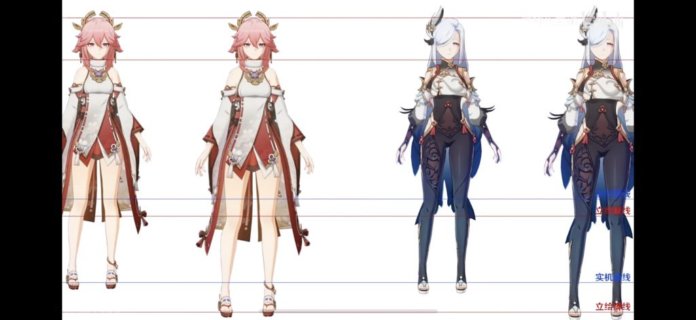
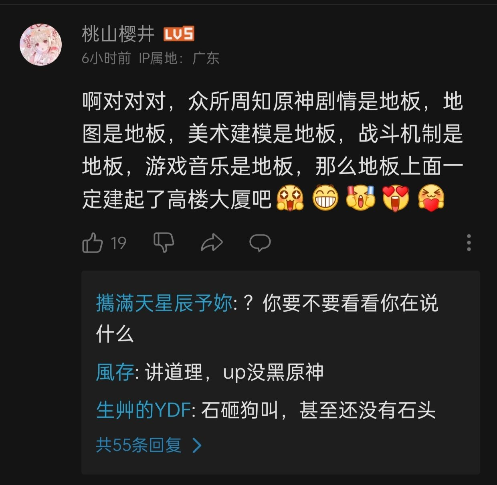

### [热点事件][热点事件]发现一个十分好玩的视频

Made by ngapost2md (c) ludoux [GitHub Repo](https://github.com/ludoux/ngapost2md)

----

##### 0.[0] \<pid:0\> 2023-08-02 23:05:25 by 2233log

贴个链接[当原神实机头身比调整到与立绘一致-哔哩哔哩] [url](https://b23.tv/Zos8QYr)
调整之后的老婆们都好美

----

##### 1.[7] \<pid:706596351\> 2023-08-03 02:32:20 by 玖玖77
还有个急了搓了连招

----

##### 2.[0] \<pid:706596426\> 2023-08-03 02:34:03 by 香槟买好了就等
一直这么觉得，游戏里这个头肩比想要大莱莱都很难，因为肩膀太窄头太大

----

##### 3.[1] \<pid:706596499\> 2023-08-03 02:35:58 by 邬宏畅
有的时候我拿自机角色和NPC对话，会感觉不是一个品种的人类
言语不当见谅

----

##### 4.[0] \<pid:706597367\> 2023-08-03 02:56:54 by hiddenself
萝莉头身比独一档。
少男少女的头身比基本一致。
成男成女头身比不一致，成男的比例还行，成女的头身比偏大。
钟离和八重为例，钟离头比八重窄，钟离身高又比八重高，八重又比钟离肩窄，成男眼睛比成女小，如果成女按成男的比例调整就和视频中比较接近了。

----

##### 5.[0] \<pid:706598792\> 2023-08-03 03:41:04 by 伪MIDI泥之会
>[jump](#pid706596499) 邬宏畅(2023-08-03 02:35) 说: 
>
>有的时候我拿自机角色和NPC对话，会感觉不是一个品种的人类
>言语不当见谅

原神自机角色和NPC本来就不是一个比例，尤其是萝莉角色，拿着迪奥娜和花店老板站在一起就突出一个画风各玩各的，而纳西妲的头甚至更大，相比之下星铁的萝莉空间站研究员NPC和自机角色比例就是一致的，只是部分贴图精度和装饰物有区别而已

----

##### 6.[1] \<pid:706622454\> 2023-08-03 09:23:02 by knimose
>[jump](#pid706596351) 玖玖77(2023-08-03 02:32) 说: 
>
>还有个急了搓了连招

他发了一堆表情不会以为就很有道理吧

----

##### 7.[0] \<pid:706623664\> 2023-08-03 09:28:41 by 末日未央
>[jump](#pid706597367) hiddenself(2023-08-03 02:56) 说: 
>
>萝莉头身比独一档。
>少男少女的头身比基本一致。
>成男成女头身比不一致，成男的比例还行，成女的头身比偏大。
>钟离和八重为例，钟离头比八重窄，钟离身高又比八重高，八重又比钟离肩窄，成男眼睛比成女小，如果成女按成男的比例调整就和视频中比较接近了。

成男的比例也不太行，星铁刚开服的时候就有图对比过钟离和瓦尔特的模型，肩宽少了差不多1/3，头显得非常大。

----

##### 8.[0] \<pid:706624510\> 2023-08-03 09:32:45 by 巳龚蓝丑郝芦
>[jump](#pid706596351) 玖玖77(2023-08-03 02:32) 说: 
>
>还有个急了搓了连招

触发连招了

----

##### 9.[0] \<pid:706625722\> 2023-08-03 09:38:22 by sla369696
原神人物建模最大的责任就是负责美术的老板，不知道哪根筋搭错了，下面员工只能按这个散兵的意见硬着头皮做。 有人可能会问模型今后会优化吗？ 答案是优化不了：底层代码、懂吧？

----

##### 10.[0] \<pid:706630507\> 2023-08-03 09:59:38 by coinko
有没有阿晴的图

----

##### 11.[0] \<pid:706631645\> 2023-08-03 10:04:35 by 无料通贩商
这看着多舒服

----

##### 12.[0] \<pid:706633271\> 2023-08-03 10:11:55 by zhengmo？
不能看，看了游戏里更加无法直视了

