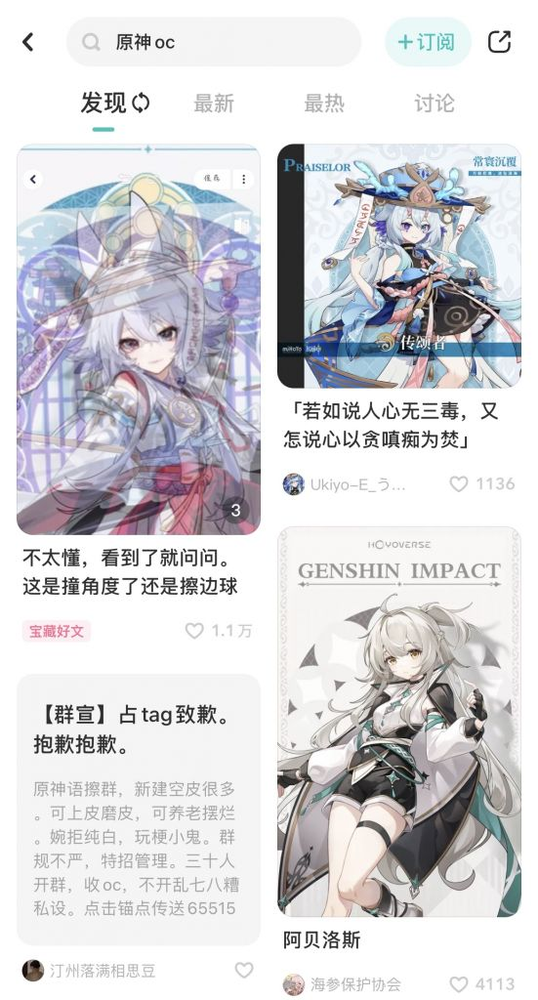
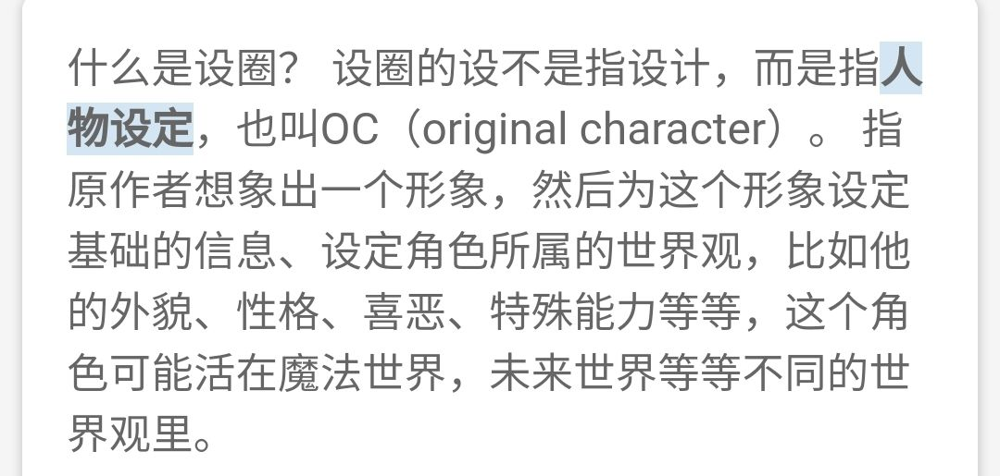

### [热点事件] 设圈是啥？

Made by ngapost2md (c) ludoux [GitHub Repo](https://github.com/ludoux/ngapost2md)

----

##### 0.[0] \<pid:0\> 2023-08-03 00:42:53 by AxialAge
为啥好多说枫丹角色像设圈

----

##### 1.[0] \<pid:706588021\> 2023-08-03 00:43:35 by 須賀悠衣
cy蹲个科普

----

##### 2.[10] \<pid:706588126\> 2023-08-03 00:44:28 by 逆空空空空空_
自己原创一个角色，然后当成孩子养，会约稿或者自产，有交易行为
这种角色的特点就是莫名其妙的装饰很多

----

##### 3.[1] \<pid:706588170\> 2023-08-03 00:44:49 by 再也不随意注销了
大概就是那种oc？设定一个原神世界观的角色这样的  
你还别说，有的比官方的还好看

----

##### 4.[0] \<pid:706588247\> 2023-08-03 00:45:38 by 阿猹不吃香菜

就是自己创造出来一个角色

----

##### 5.[0] \<pid:706588303\> 2023-08-03 00:46:05 by yuduvy
不止设定角色，世界观什么的也有

----

##### 6.[0] \<pid:706588369\> 2023-08-03 00:46:45 by 今锁朱楼
就是一群人搞自己喜欢的人设，一般会有人设图和角色设定，但很少有人能写出具体的故事和生平经历。
我觉得算是幼年幻想的变种吧。
~~就当成一帮子人给自己搞皮套爽爽就行了。~~

----

##### 7.[0] \<pid:706588472\> 2023-08-03 00:47:35 by 油门踩到底
花钱给小画家约稿，自己提要求
因为整个过程中甲方往往不会设计，就只会口头告知一些元素
而参与这种设圈约稿的小画家，本身又处在行业平均线中等偏下
(大手子一般不接这种)
所以往往最后弄出来的东西，外人看来一言难尽(

----

##### 8.[0] \<pid:706588492\> 2023-08-03 00:47:44 by 雨源rainsource
小画家或者同人女会自己想一个人设，然后用这个人设画画或者写文啥的，人多了就变圈了。

特点大概就是画出来的人设莫名其妙的细节特别多

----

##### 9.[2] \<pid:706588889\> 2023-08-03 00:50:58 by Shem_ha
米厂现在这个风格，还要加上一个定语，叫设圈圣诞树
重点凸显角色身上莫名其妙装饰极多的特点

