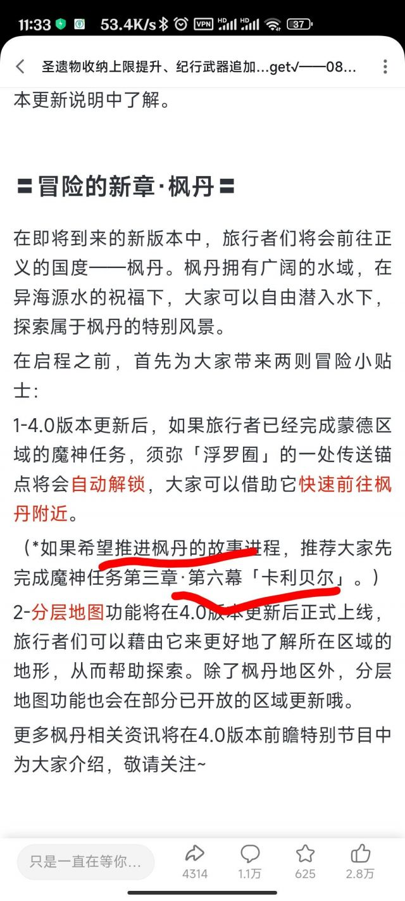

### [不吐不快]原来罪人舞步旋是枫丹的主题

Made by ngapost2md (c) ludoux [GitHub Repo](https://github.com/ludoux/ngapost2md)

----

##### 0.[0] \<pid:0\> 2023-08-03 01:39:43 by 雨源rainsource
不知道这次4.0猛干又会对这标题产生什么新的想法

----

##### 1.[0] \<pid:706593448\> 2023-08-03 01:42:09 by 月上七楼6004537238
虚空劫灰往事书和罪人舞步旋这俩标题起得很好，当时一看就浮想联翩期待满满

现在过完须弥…我只能说到时候剧情里有分开的罪人和跳舞表演就算达成标题

----

##### 2.[0] \<pid:706593757\> 2023-08-03 01:46:12 by 油门踩到底
你看草石头文案：
“人们手握着手转圈……人偶与神像，大家的欢舞里蕴藏着宇宙的一切……”
人偶显然是散兵，算上草，就是两个罪人在跳舞

所以接下来的剧情就是须弥pro max(

----

##### 3.[0] \<pid:706593794\> 2023-08-03 01:46:39 by rysher1
>[jump](#pid706593448) 月上七楼6004537238(2023-08-03 01:42) 说: 
>
>虚空劫灰往事书和罪人舞步旋这俩标题起得很好，当时一看就浮想联翩期待满满
>
>现在过完须弥…我只能说到时候剧情里有分开的罪人和跳舞表演就算达成标题

玩偶和神像跳舞

----

##### 4.[0] \<pid:706594044\> 2023-08-03 01:50:06 by AiakosG
>[jump](#pid706593448) 月上七楼6004537238(2023-08-03 01:42) 说: 
>
>虚空劫灰往事书和罪人舞步旋这俩标题起得很好，当时一看就浮想联翩期待满满
>
>现在过完须弥…我只能说到时候剧情里有分开的罪人和跳舞表演就算达成标题

(写出须弥三次元论文蝇营狗苟剧情的)罪人(们又要在枫丹抱怨自己是用戴着镣铐的)舞步(在)旋(转跳跃，它们不停歇)

----

##### 5.[0] \<pid:706594522\> 2023-08-03 01:57:15 by 二之日廿五
>[jump](#pid706593448) 月上七楼6004537238(2023-08-03 01:42) 说: 
>
>虚空劫灰往事书和罪人舞步旋这俩标题起得很好，当时一看就浮想联翩期待满满
>
>现在过完须弥…我只能说到时候剧情里有分开的罪人和跳舞表演就算达成标题

早就达成了，这不优菈吗

----

##### 6.[0] \<pid:706594617\> 2023-08-03 01:58:48 by id不知道用什么id
不知名npc跳个舞，幕后结语提下旋转，过

----

##### 7.[0] \<pid:706620355\> 2023-08-03 09:12:46 by kunizu
>[jump](#pid706594522) 二之日廿五(2023-08-03 01:57) 说: 
>
>早就达成了，这不优菈吗

我也觉得很奇怪，我有优菈剧情了，已经达成罪人和舞步旋了

----

##### 8.[0] \<pid:706623635\> 2023-08-03 09:28:33 by 魑魅魍魉魖魌
卡利贝尔里不是有个大石头说自己是罪人吗？到时候把这块石头拉出来给你挑个绫华同款月下舞就是“罪人舞步旋”了

----

##### 9.[0] \<pid:706653787\> 2023-08-03 11:33:41 by 骑士不死于手徒
>[jump](#pid706623635) 魑魅魍魉魖魌(2023-08-03 09:28) 说: 
>
>卡利贝尔里不是有个大石头说自己是罪人吗？到时候把这块石头拉出来给你挑个绫华同款月下舞就是“罪人舞步旋”了

嘶

----

##### 10.[0] \<pid:706655980\> 2023-08-03 11:42:01 by 梦之幻灵
>[jump](#pid706623635) 魑魅魍魉魖魌(2023-08-03 09:28) 说: 
>
>卡利贝尔里不是有个大石头说自己是罪人吗？到时候把这块石头拉出来给你挑个绫华同款月下舞就是“罪人舞步旋”了

没记错的话 卡利贝尔的罪人英文版是sinner 而罪人舞步旋是guilty 这个当时论坛就聊过了

----

##### 11.[0] \<pid:706656786\> 2023-08-03 11:45:06 by 魑魅魍魉魖魌
>[jump](#pid706655980) 梦之幻灵(2023-08-03 11:42) 说: 
>
>没记错的话 卡利贝尔的罪人英文版是sinner 而罪人舞步旋是guilty 这个当时论坛就聊过了

这两个词的内涵有啥不同吗？我英语不太好

----

##### 12.[0] \<pid:706657955\> 2023-08-03 11:49:39 by 咕咕咕咕pis
sin是原罪，指的是亚当夏娃小夫妻吃了智慧之果的事导致一切人类都有罪，必须信耶稣才有救
智慧之果，没想到吧，又回到散草99啦
不过我怀疑现在米桑的小打字机写不明白这玩意

----

##### 13.[0] \<pid:706659235\> 2023-08-03 11:54:36 by mie001
>[jump](#pid706656786) 魑魅魍魉魖魌(2023-08-03 11:45)说:
>[quote][pid=706655980,37237823,1]Reply[/pid] <b>Post by [uid=4704621]梦之幻灵[/uid] (2023-08-03 11:42):</b>  没记错的话 卡利贝尔的罪人英文版是sinner 而罪人舞步旋是guilty 这个当时论坛就聊过了[/quote]这两个词的内涵有啥不同吗？我英语不太好[s:ac:晕]

sinner更接近宗教意义上的“罪人”

----

##### 14.[0] \<pid:706662298\> 2023-08-03 12:07:30 by aswaw111
>[jump](#pid706657955) 咕咕咕咕pis(2023-08-03 11:49)说:
>[s:ac:哭笑]sin是原罪，指的是亚当夏娃小夫妻吃了智慧之果的事导致一切人类都有罪，必须信耶稣才有救 智慧之果，没想到吧，又回到散草99啦 不过我怀疑现在米桑的小打字机写不明白这玩意

那cos呢(露出痴呆的表情)

----

##### 15.[0] \<pid:706671687\> 2023-08-03 12:50:18 by 梦之幻灵
>[jump](#pid706656786) 魑魅魍魉魖魌(2023-08-03 11:45) 说: 
>
>这两个词的内涵有啥不同吗？我英语不太好

翻了下字典 sin更偏宗教道德上那种罪 guilt更偏犯法的罪 当然我英语也不好 不清楚这两者是界限严明还是一定程度上可以混用

而且仔细想了下还是得看剧情怎么解 那个罪人反抗天理 他理所当然的是sinner 万一在枫丹反抗天理等于违法呢 两者互通了

