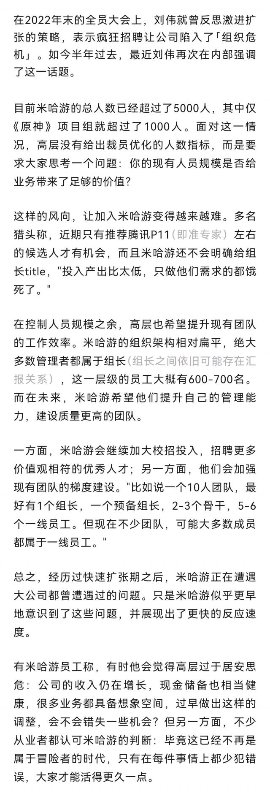

### [不吐不快]原神现在的团队有1000人？

Made by ngapost2md (c) ludoux [GitHub Repo](https://github.com/ludoux/ngapost2md)

----

##### 0.[1] \<pid:0\> 2023-08-03 07:08:24 by vhbjnm
这1000人起码有500人在摸鱼吧，产出的质量还不如开服的时候呢

----

##### 1.[0] \<pid:706604214\> 2023-08-03 07:12:38 by 哈兰德0175
早就是了吧，很早就听那些学长说了

----

##### 2.[0] \<pid:706604562\> 2023-08-03 07:18:11 by 大号被叉出马桶
米哈游似乎更早的认识到了问题，展现出来更快的反应速度

----

##### 3.[0] \<pid:706604582\> 2023-08-03 07:18:35 by 憨憨那个大鱼
过于居安思危等一个1+1&lt;1

----

##### 4.[0] \<pid:706604930\> 2023-08-03 07:23:17 by q794623
人数是挺多，但是你鬼知道多少人是真正做内容的，而且就这内容质量，我就想起那个笑话

“别说答案对不对，你就说我答的快不快嘛？”

工业化垃圾桶是吧

----

##### 5.[0] \<pid:706605065\> 2023-08-03 07:24:51 by hengentama
草，六七百个组长之间互相扯皮、推锅、踢皮球、下绊子
什么地狱绘图

----

##### 6.[0] \<pid:706605122\> 2023-08-03 07:25:39 by 冬马乔太郎
看看网上水军，我相信还是有1000人的

----

##### 7.[0] \<pid:706605366\> 2023-08-03 07:28:51 by Inquisit
也不一定是摸鱼，看之前那个泄露包他们精准选出最差的设计的样子，估计有大量互相使绊子的无效劳动无效内卷

----

##### 8.[0] \<pid:706605428\> 2023-08-03 07:29:38 by 神奇毛球
恐怕这一千人中8成都是做宣发的

----

##### 9.[0] \<pid:706606053\> 2023-08-03 07:36:58 by mimengan
一千个人，五百个饭桶，四百个废物？

----

##### 10.[0] \<pid:706606409\> 2023-08-03 07:41:06 by s_ms_zb
可能有人觉得1000人不可能，但参考某上市营销型制药公司，上市公司需要真实披露财务情况，财报公布是3000员工，负责营销的接近百分之80，营销成本完爆研发成本。具体数据记忆里的，但大差不差，回头查查去。

----

##### 11.[0] \<pid:706607284\> 2023-08-03 07:49:48 by 泪滴洇湿的言语
原神项目可以裁员一半以上了我说真的。都是一群废物。剧情剧情垃圾，也没什么要改进的玩意，可能有7，800人每天上班的工作就是拿着手机到处吵架。还扩充大学生……多招点精日恨国厕妹厕弟是吧。大伟在培养邪教罕见吗。

----

##### 12.[2] \<pid:706608130\> 2023-08-03 07:57:48 by akanatsu
软文都粉饰不清楚的细节最为魔鬼
我讲真，一个大企业在这种规模说自己超过十分之一的员工是有权限来回拉扯的组长，跟圣遗物整理在讨论了一样搞笑
难道别的企业扩张时不会先梳理管理构架，难道yys没有成熟的整理系统，不知道的还以为你米遇到的是旷古烁今的超导难题呢

----

##### 13.[0] \<pid:706608197\> 2023-08-03 07:58:25 by 不如玩○去
>[jump](#pid706605428) 神奇毛球(2023-08-03 07:29) 说: 
>
>恐怕这一千人中8成都是做宣发的

或许还附带开盒服务

----

##### 14.[0] \<pid:706608676\> 2023-08-03 08:02:22 by nervkid
1000人又不见得都是研发的，社区运营之类的也算团队里的吧，指不定这些人更多呢

----

##### 15.[0] \<pid:706618680\> 2023-08-03 09:04:01 by 罗德羽兰
价 值 观 相 符，养蛊嘛这是要

----

##### 16.[0] \<pid:706625067\> 2023-08-03 09:35:23 by 巳龚蓝丑郝芦
感觉原不如开服时候

----

##### 17.[0] \<pid:706626244\> 2023-08-03 09:40:49 by 鱼什么都知道
我怀疑有800个负责平时和玩家对线

----

##### 18.[0] \<pid:706626814\> 2023-08-03 09:43:27 by 风起鹤归。
>[jump](#pid706604930) q794623(2023-08-03 07:23) 说: 
>人数是挺多，但是你鬼知道多少人是真正做内容的，而且就这内容质量，我就想起那个笑话
>“别说答案对不对，你就说我答的快不快嘛？”
>工业化垃圾桶是吧

辱垃圾桶了，工业化厕所

----

##### 19.[0] \<pid:706627739\> 2023-08-03 09:47:31 by 无意识koishi
1000人我是信的
你看在理查就不少

----

##### 20.[0] \<pid:706628936\> 2023-08-03 09:52:42 by 他小炒肉谁啊
1000个里面搞不好有800个只会谢主隆恩的肽键宫女

----

##### 21.[0] \<pid:706655473\> 2023-08-03 11:40:01 by 小云青欲雨
米桑内部好几个小组卷一个方案，鉴定为挑了个最烂的

----

##### 22.[0] \<pid:706661957\> 2023-08-03 12:06:05 by Seeyoupelos
1000人开gayshit impart呢

----

##### 23.[0] \<pid:706662518\> 2023-08-03 12:08:21 by ggt12
>[jump](#pid706626244) 鱼什么都知道(2023-08-03 09:40):

其中有1个是负责给米黑发3000的？

----

##### 24.[0] \<pid:706662822\> 2023-08-03 12:09:48 by zhengmo？
一千个人八百个猛干哥

----

##### 25.[0] \<pid:706663296\> 2023-08-03 12:11:50 by 1703kj
这么多人，卷出来个垃圾游戏？

----

##### 26.[0] \<pid:706664601\> 2023-08-03 12:17:36 by 霏雨～忆光
>[jump](#pid706608130) akanatsu(2023-08-03 07:57) 说: 
>
>软文都粉饰不清楚的细节最为魔鬼
>我讲真，一个大企业在这种规模说自己超过十分之一的员工是有权限来回拉扯的组长，跟圣遗物整理在讨论了一样搞笑
>难道别的企业扩张时不会先梳理管理构架，难道yys没有成熟的整理系统，不知道的还以为你米遇到的是旷古烁今的超导难题呢

正经人谁找游戏葡萄写软文啊背刺好几次了

----

##### 27.[0] \<pid:706670365\> 2023-08-03 12:43:48 by 理律不知道我这卡
《招聘更多价值观相符的优秀人才》
《价值观相符》

----

##### 28.[0] \<pid:706685047\> 2023-08-03 13:59:05 by 闇の咒痕
1000个南通吗？

----

##### 29.[0] \<pid:706685580\> 2023-08-03 14:01:42 by 千炽双灯
1000人的项目组找不出来三观正常反对某些sb剧情的是吧

----

##### 30.[0] \<pid:706685841\> 2023-08-03 14:02:51 by jwbdbx
感觉裁掉800也不影响

----

##### 31.[0] \<pid:706685852\> 2023-08-03 14:02:55 by 剑筑师と書記官
我觉得把5k人裁掉3/4，这游戏差不多一样转甚至可能更好
评价为，招结晶招的

----

##### 32.[0] \<pid:706686339\> 2023-08-03 14:05:16 by l秦珺媛
我觉得挺合理的啊1000人里100个做游戏，剩下的去开小号带领仙巡视社区

----

##### 33.[0] \<pid:706686790\> 2023-08-03 14:07:22 by 埋もれる記憶
太离谱了吧，这么多人开会都得开几轮了吧

----

##### 34.[0] \<pid:706690756\> 2023-08-03 14:25:59 by 樱木花kun
真正在一线从事生产开发工作的应该减半再减半，其他的都是些杂事儿，或者领导。

