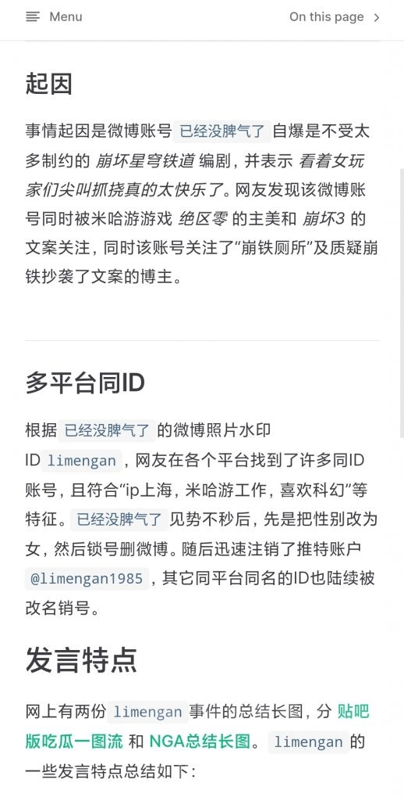
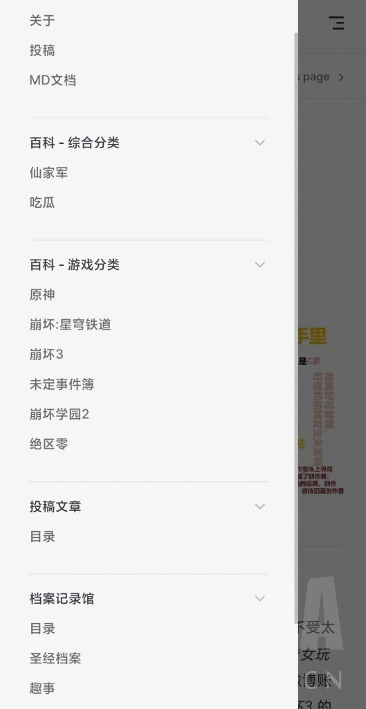

### [不吐不快] [代发] 世界树正式公测

Made by ngapost2md (c) ludoux [GitHub Repo](https://github.com/ludoux/ngapost2md)

----

##### 0.[7] \<pid:0\> 2023-08-03 09:25:56 by 满溢而出
<b>代发</b>
里版没办法完成的，世界之外取得否定世界的力量。
曾经里版呼声最高的代号，世界树，如今在世界之外重建。经历多天测试，近日终于正式开通外界访问。

世界树.一个米哈游玩家共建的百科网站，为您备份和总结米哈游节奏，无论是欢愉(乐子人，巡猎(米士兵，还是毁灭(加速人，同谐(劝架人，丰饶(老好人，都可以在这里找到你想要的乐子。

该网站完全使用静态文件构建，具有高速，轻便等优点，只需要2秒，即可加载一切，无需草神的权柄。

通过签名内链接即可访问。
预览图在楼下。

----

##### 1.[0] \<pid:706623442\> 2023-08-03 09:27:38 by 开磕
我是楼下

----

##### 2.[0] \<pid:706623609\> 2023-08-03 09:28:28 by 今天带钱了没
图图呢

----

##### 3.[1] \<pid:706623613\> 2023-08-03 09:28:29 by 安林zsbd
看不见签名，也看不见预览图，我是楼下的楼下

----

##### 4.[0] \<pid:706623651\> 2023-08-03 09:28:37 by 仲夏月影
我的图图呢

----

##### 6.[0] \<pid:706624555\> 2023-08-03 09:33:00 by 奈何断桥
俺滴图图捏？

----

##### 7.[0] \<pid:706626350\> 2023-08-03 09:41:18 by 满溢而出
5楼有访问地址

----

##### 8.[0] \<pid:706626630\> 2023-08-03 09:42:34 by mimengan
好耶，打卡

----

##### 9.[1] \<pid:706626870\> 2023-08-03 09:43:41 by 雨源rainsource
挺有意思，谨防岁月史树

----

##### 10.[0] \<pid:706626886\> 2023-08-03 09:43:45 by 富阳山水悦府
图文不符，应该叫珊瑚宫

----

##### 11.[0] \<pid:706627088\> 2023-08-03 09:44:40 by 是是是洺
网址好评  

----

##### 12.[0] \<pid:706627184\> 2023-08-03 09:45:03 by 烟颜研嫣
好好好，现在连世界树都搞出来了，理查蒸蒸日上

