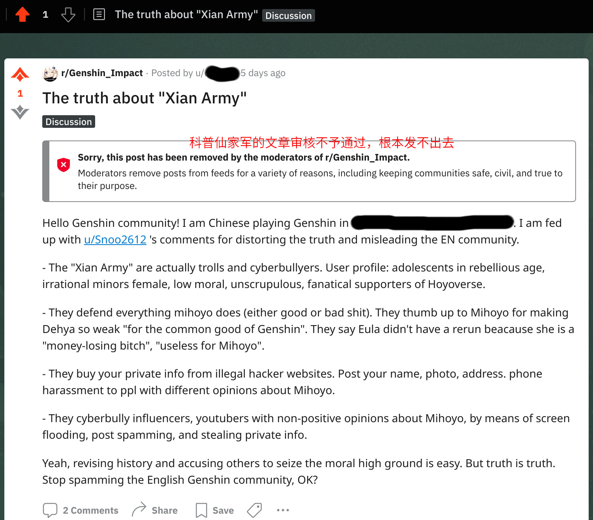

### [热点事件][瓜小味甜] 红迪原神官频上辟谣zoefang的文章发不出去 / github备份已传网盘

Made by ngapost2md (c) ludoux [GitHub Repo](https://github.com/ludoux/ngapost2md)

----

##### 0.[1] \<pid:0\> 2023-08-03 09:37:51 by ricardo_milos
众所周知红迪sub的mod权利比泥潭bw要大的多，大sub的言论审核是非常严的，长文要经过mod(也就是bw)审核通过，否则文章是发不出来的。换句话说，会引起对立骂战的东西，在红迪根本发不出来。

方女士节奏刚出那天，我写了个英文帖解释xian army是群什么货色，措辞很客观了，提交了好几次，结果原神bw到现在都不给过(看图)。

然而方女士的抹黑cn原神社区，aoe简中社区的文章，就这么从红迪开始大肆传播。文章加深了外网社区对cn人的刻板印象和偏见，引发非简中原神社区对cn人的贬低和辱骂。

猛厂的海外推广部门什么成分，明白了吧！对了。猛厂海外部门貌似也在上海上班。

-
顺带宣传一下理查版的git存档&quot;玩原神玩的&quot;，Github搜索：wyswd。
之前一直没有百度号，今天卖了个虚拟号注册了，度盘备份在一楼

   

----

##### 2.[2] \<pid:706627690\> 2023-08-03 09:47:17 by 須賀悠衣
挺好的，加速呗，白皮最好把赔钱货和mhy打成rh符号
反正我看乐子不嫌事大

----

##### 3.[1] \<pid:706627910\> 2023-08-03 09:48:14 by 平泽唯1987
红迪这种官方入驻的社区，能搞成这样，米的海外部门什么心思也一目了然了

----

##### 4.[0] \<pid:706627993\> 2023-08-03 09:48:34 by 卡普琪琪3
红迪原版的管理确实勤劳，虽然以前上红迪的时候我还不是米黑，但是nsfw的tag打的不对，被干掉的速度甚至超过NGA。红迪原版的流量当年比nga高到哪里去了。

