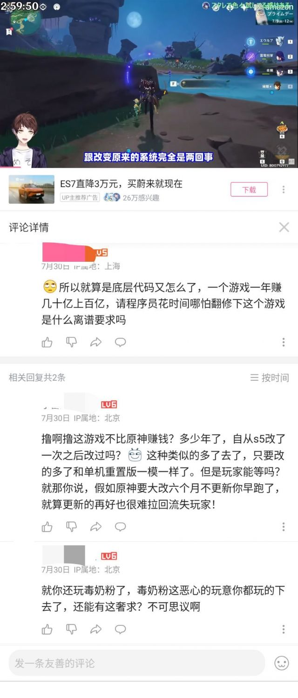
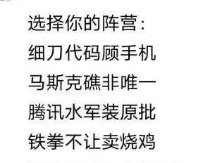

### [不吐不快]唉，底层代码

Made by ngapost2md (c) ludoux [GitHub Repo](https://github.com/ludoux/ngapost2md)

----

##### 0.[0] \<pid:0\> 2023-08-03 10:32:19 by Linkle_211
前两天刷到个视频说为什么原神很多想要的优化会更新到新游戏而不是原神里，大概就是底层代码翻修麻烦什么的，我回了一句一个一年赚几十上百亿的公司找一批程序员花时间翻修一遍又不是什么难事，结果被个结晶喷了，估计看到了我七八年前传的dnf视频这人怕是不是知道，dnf为了赚钱，玩家仓库越修越大，然后十几年的屎山代码，之前一次更新，进图不用读条了，之后再一次更新，把32位的游戏翻修成64位，单核游戏更新成支持多核，活了15年多的游戏都能改底层代码，3年的游戏还改不了了是吧另外吐槽个，ps5版的原神是为数不多的几个会把ps5功耗200多瓦吃满的游戏，大多数3a其实都不会吃满

----

##### 1.[0] \<pid:706639421\> 2023-08-03 10:37:13 by 无意识koishi
跟结晶bb啥 
你都不知道结晶里面的是李猛干还是收钱办事的
最差也是个弱智 这三种你能说服哪个？

----

##### 2.[1] \<pid:706639514\> 2023-08-03 10:37:36 by 唔姆啦

----

##### 3.[1] \<pid:706639722\> 2023-08-03 10:38:31 by 婆娑树影斑驳光影
又嘬奶嘴啊……

----

##### 4.[0] \<pid:706640189\> 2023-08-03 10:40:17 by aswaw111
毕竟腾讯是要赚钱的，而米哈游嘛

----

##### 5.[0] \<pid:706640470\> 2023-08-03 10:41:24 by 这游戏真给我整沉默了
自从知道李猛干后现在看结晶就像看到一群李猛干

----

##### 6.[0] \<pid:706640509\> 2023-08-03 10:41:36 by minios777
好的，他们多扯点lol吧，到时候就看结晶被吊着打吧

----

##### 7.[0] \<pid:706642107\> 2023-08-03 10:48:16 by Vs_Code
dnf为了赚钱最疯狂的事不是从一个清版act楞是改成了割草养成游戏吗。

----

##### 8.[0] \<pid:706642578\> 2023-08-03 10:50:10 by 野猫布鲁斯
唉，腾讯

----

##### 9.[0] \<pid:706643168\> 2023-08-03 10:52:38 by 岚岚鹭
玩家是会用脚投票的
反馈就是不改
好好好大力加速

----

##### 10.[0] \<pid:706643240\> 2023-08-03 10:52:59 by 龙澂
一方面看不起腾讯的游戏，一方面又要跟腾讯比烂

----

##### 11.[1] \<pid:706643823\> 2023-08-03 10:55:22 by 梦之幻灵
巧了 我也一直在骂拳头赚了这么多钱游戏一坨屎山还不开发英雄联盟2

哪有玩家帮游戏公司说话的道理

----

##### 12.[0] \<pid:706645332\> 2023-08-03 11:01:12 by 露缇娜丝
>[jump](#pid706642107) Vs_Code(2023-08-03 10:48) 说: 
>dnf为了赚钱最疯狂的事应该是从一个清版act楞是改成了割草养成游戏，整个游戏的性质都变了

这是数据膨胀的必然结果。我以前玩的艾尔之光，连蓝都要靠普攻来回，普攻的后摇还得靠连点方向键取消，pvp更是有各种帧级别操作，但现在也变成了个只嗑药和秒怪的pve游戏了。

----

##### 13.[0] \<pid:706646907\> 2023-08-03 11:07:25 by Ain丶7
笑死，你原哪来的底气去碰瓷110版本的毒奶粉的。110版本的主线机械战神保底一个正常番剧水平的剧情，整体逻辑没有太大漏洞，有燃点有泪点，角色刻画有亮点，天界那堆npc也给人留下很深的印象，主角形象在线，一反以前的谜语人剧情，把以前好多藏了很久的谜语剧情全部挑明了，主角从以前随波逐流的形象强化成有自己想法与意志的形象。甚至别人吃书也比你原强，借着改善升级体验的借口，直接把以前的剧情也小幅度重做，修了好几个bug
更别提韩服毒奶粉几乎每月都要修各种各样的bug和优化，新的护盾系装备从一开始几乎无法用，只有大概的视觉显示(护盾快破了护盾会小一圈)，加了护盾量显示，修了一堆影响护盾恢复的bug让护盾流成为可选流派。你原神这么长时间优化过什么，到现在连个盾量显示都没，笑死

----

##### 14.[0] \<pid:706664101\> 2023-08-03 12:15:24 by 夜山鬼
这些评论区对线的不会是米的程序员吧

----

##### 15.[0] \<pid:706665862\> 2023-08-03 12:23:31 by 右席酱
1000人的原神开发团队里面，实际游戏开发人员怕不是只有200人，剩下美术文案编剧什么又扣去100，其他700怕不是负责天天在网上线下高强度出击，营销拉满

----

##### 16.[0] \<pid:706666261\> 2023-08-03 12:25:21 by 诸葛老贼
巧了，拳头也天天被喷屎山代码不翻新也没人堵嘴咱也不知道这群人为什么还能拿LOL举例的

----

##### 17.[0] \<pid:706666361\> 2023-08-03 12:25:48 by wyvern0315
利润率60%警告，全花钱改了利润不就没了，老板还怎么买豹子号法拉利。

----

##### 18.[0] \<pid:706666677\> 2023-08-03 12:27:09 by NATFproposal
结晶居然笑话起毒奶粉了。毒奶粉在不管是巅峰时的国民度还是在自己赛道内的统治力米拿什么比啊。
毒奶粉衰落是为了上难度，搞出一堆无敌机制怪，玩家和怪之间战斗互动完蛋，输出窗口还贼短。搞的一堆长线输出职业完蛋，技能全都向脱手快速出伤的方向走。作为清版格斗过关，很多有格斗游戏特色的强抓取和强连段职业在数值膨胀，怪物机制化后职业特色就废了，玩家和怪物变成了你打你的我打我的。这些缺点原到是3年不到就开始了。dnf这个2d像素手绘格斗的战斗系统，在目前赛道还是没有竞品。原那个摆在arpg里都是属于拉的战斗拿头比啊。

