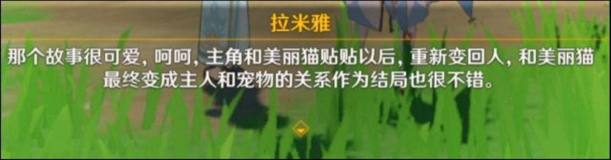

### [热点事件]真就什么词都不带脑子直接用是吧

Made by ngapost2md (c) ludoux [GitHub Repo](https://github.com/ludoux/ngapost2md)

----

##### 0.[4] \<pid:0\> 2023-08-03 10:55:23 by 観束京介

贴贴源自尊い(とうとい,toutoi)的变体てぇてぇ(tete,键盘输入thethe)，是个完完全全的冈本话
先说尊い，这个词最开始多见于宅女对男男或男女之间的关系评价，对应常见于宅男用语的萌え，差不多是一个意思
てぇてぇ是一个发音相似的变体，这个出处更是重量级。最开始是在推上有画师画某管人(虚拟纸片人，Vtuber)和另外的管人的漫画，在对话格子尊い第一次被写成てぇてぇ
正好18年又是冈本管人群快速扩散的时候，てぇてぇ这个词使用范围迅速扩大，基本在管人痴圈子到处都能见。在之后又由于发音相似被国内管人痴用作贴贴，之后就随处可见了
这词跟羁绊这种误用词还不一样，是完完全全的冈本词，这种词也能出现在中文的游戏文本里的？
算了，这事重要吗？只有我这种对贴贴PTSD的人才会在意吧。

可能有错误，欢迎指正

----

##### 1.[0] \<pid:706644457\> 2023-08-03 10:57:41 by 丧病の兜比
这文案我真蚌埠住了
顺便问一下我想把这个贴到主板可以吗

----

##### 2.[1] \<pid:706644556\> 2023-08-03 10:58:07 by 須賀悠衣
尊い用法没那么窄
不过“贴贴”最开始确实是低能管人吃黑话

----

##### 3.[0] \<pid:706644647\> 2023-08-03 10:58:27 by 観束京介
>[jump](#pid706644457) 丧病の兜比(2023-08-03 10:57) 说: 
>
>这文案我真蚌埠住了
>顺便问一下我想把这个贴到主板可以吗

随便贴，不在意的.jpg

----

##### 4.[4] \<pid:706644682\> 2023-08-03 10:58:35 by 晓美ker
没给你加个哈基米不错了

----

##### 5.[0] \<pid:706644818\> 2023-08-03 10:59:07 by 盈众有为1t阴湿地狗
>[jump](#pid706644556) 須賀悠衣(2023-08-03 10:58) 说: 
>
>尊い用法没那么窄
>不过“贴贴”最开始确实是低能管人吃黑话

看过管人的我只能说，确实，这词说出来只会被骂连体人

----

##### 6.[0] \<pid:706644913\> 2023-08-03 10:59:30 by 飘雪菌
这文案相当于一天玩了25个小时手机之后，花了-1分钟写了点垃圾就提交给上面，然后上面花了-2分钟审核通过了

----

##### 7.[0] \<pid:706645110\> 2023-08-03 11:00:19 by 假面骑士金币
酒吧舞文案是这样的

----

##### 8.[0] \<pid:706645115\> 2023-08-03 11:00:21 by 燐Rin
之前那个弹反活动都直接“试合”了，现在来个贴贴也没啥吧，毕竟家乡话

----

##### 10.[0] \<pid:706645282\> 2023-08-03 11:00:58 by scoutqq
我只能说有股媚劲了

----

##### 11.[2] \<pid:706645735\> 2023-08-03 11:02:48 by 今锁朱楼
贴贴在国内就是个很常见的网络用语，这种词放到正经文章里真不知道怎么想的文案高中老师没教过不能在作文里写乱七八糟的词吗？

----

##### 12.[2] \<pid:706645989\> 2023-08-03 11:03:47 by 慕潮声
网络用语直接扔文案里，是卖梗的电商吗

----

##### 13.[0] \<pid:706646044\> 2023-08-03 11:04:00 by write54
什塔马正式文章里面用贴贴

----

##### 14.[0] \<pid:706646183\> 2023-08-03 11:04:37 by 剑筑师と書記官
>[jump](#pid706644682) 晓美ker(2023-08-03 10:58) 说: 
>
>没给你加个哈基米不错了

说到哈基米，我第一反应是Hakimi，而Hakimi，我只想到那个Pet.exe

----

##### 15.[0] \<pid:706646794\> 2023-08-03 11:06:58 by nga_w926474q
说实话贴贴这个因为各个地方见得多我反而没感觉，但是“美丽猫”这个词……说实话味儿冲上天了

----

##### 16.[0] \<pid:706647892\> 2023-08-03 11:11:10 by 哒哒块
没有叫错的外号

----

##### 17.[0] \<pid:706648127\> 2023-08-03 11:12:07 by 透明级
抱怨须弥日常对话不够须弥味的玩家有福了，mhy引入了稻妻味，将就用用吧

----

##### 18.[0] \<pid:706649284\> 2023-08-03 11:16:44 by Sql蜃気楼
>[jump](#pid706644682) 晓美ker(2023-08-03 10:58) 说: 
>
>没给你加个哈基米不错了

哈基米到底啥意思

----

##### 19.[0] \<pid:706652451\> 2023-08-03 11:28:38 by 観束京介
>[jump](#pid706649284) Sql蜃気楼(2023-08-03 11:16) 说: 
>
>哈基米到底啥意思

出自日语蜂蜜(hachimitsu)，我猜应该是动画赛马娘里的东海帝王经常念叨的ハチミ(hachimi)破圈了导致的哈基米转化

----

##### 20.[0] \<pid:706652828\> 2023-08-03 11:29:59 by Tartaglia_11th
>[jump](#pid706649284) Sql蜃気楼(2023-08-03 11:16) 说: 
>
>哈基米到底啥意思

指小猫

----

##### 21.[0] \<pid:706653811\> 2023-08-03 11:33:45 by mie001
哈基米这个不是马娘里出来的那个蜂蜜吗……

----

##### 22.[0] \<pid:706653904\> 2023-08-03 11:34:08 by 斐林试剂水浴加热
还有雷电将军资料里面那个“关于我们-用心棒”，我他妈当时反反复复看了标题好几遍都没搞懂这是个什么意思

----

##### 23.[0] \<pid:706655467\> 2023-08-03 11:40:00 by 江鹤疏
>[jump](#pid706652828) Tartaglia_11th(2023-08-03 11:29) 说: 
>
>指小猫

帝王厨要哭了

----

##### 24.[1] \<pid:706655749\> 2023-08-03 11:41:07 by 玄羽难回
上学的时候，老师没有教过这些编剧，不要把网络用语用在文章里吗

----

##### 25.[0] \<pid:706656114\> 2023-08-03 11:42:32 by sl3228656
>[jump](#pid706653904) 斐林试剂水浴加热(2023-08-03 11:34) 说: 
>
>还有雷电将军资料里面那个“关于我们-用心棒”，我他妈当时反反复复看了标题好几遍都没搞懂这是个什么意思

毕竟是米家乡的词我们汉语使用者看不懂太正常  黑泽明有一部剑戟片《用心棒》 在老米的家乡用心棒说的是门闩，引申出来保镖/警卫的意思 也指代江户幕府时期警备人员用的警棍.不懂老米家乡话肯定看不懂

----

##### 26.[0] \<pid:706656524\> 2023-08-03 11:44:07 by 須賀悠衣
>[jump](#pid706652451) 観束京介(2023-08-03 11:28):

那东西就是把帝宝哼的蜂蜜歌调成了狗都听不下去的依托之后配上小宠物视频发上抖音然后莫名其妙火了
你哪怕配个原声我都认了，只能说抖音比管人吃还要低能200倍

----

##### 27.[0] \<pid:706657798\> 2023-08-03 11:49:06 by Tartaglia_11th
>[jump](#pid706655467) 江鹤疏(2023-08-03 11:40) 说: 
>
>帝王厨要哭了

反正我每次听到这个bgm都是猫

----

##### 28.[0] \<pid:706658983\> 2023-08-03 11:53:40 by 江鹤疏
>[jump](#pid706656524) 須賀悠衣(2023-08-03 11:44) 说: 
>
>那东西就是把帝宝哼的蜂蜜歌调成了狗都听不下去的依托之后配上小宠物视频发上抖音然后莫名其妙火了
>你哪怕配个原声我都认了，只能说抖音比管人吃还要低能200倍

错误的，那个bgm是b站up去年调的音mad
被抖音的出生盗用之后放在萌宠视频才变成现在这个样子。
原作者一分钱拿不到，但现在全部都在用他的调音

----

##### 29.[0] \<pid:706660694\> 2023-08-03 12:00:39 by 萨萨萨萨0918
再别说了，鉴定为更电商夺舍

----

##### 30.[0] \<pid:706661117\> 2023-08-03 12:02:28 by Axcend
梗夺舍！

----

##### 31.[0] \<pid:706661302\> 2023-08-03 12:03:12 by UID63375578
>[jump](#pid706644682) 晓美ker(2023-08-03 10:58):

绷不住了。以后没活了说不定还真会加个。自研开放世界冒险RPG？烂梗百科大全！

----

##### 32.[0] \<pid:706661837\> 2023-08-03 12:05:33 by 隙间星云
逐渐崩铁化，是猛干的大手伸过来了吗

----

##### 34.[0] \<pid:706662126\> 2023-08-03 12:06:46 by 野猫布鲁斯
家乡的撒库拉，开了

----

##### 35.[0] \<pid:706662221\> 2023-08-03 12:07:11 by 银河外的水滴
贴贴都出来了，什么时候出现单推、DD、炎上啊

----

##### 36.[0] \<pid:706662333\> 2023-08-03 12:07:40 by thx6822358
鉴定为管人入脑，建议和apex一起服用治疗。

----

##### 37.[0] \<pid:706663201\> 2023-08-03 12:11:27 by Arccrice
米现在这个玩法，迟早出事，用典不查清来源相当容易翻车。

----

##### 38.[0] \<pid:706664207\> 2023-08-03 12:15:50 by Axcend
>[jump](#pid706663201) Arccrice(2023-08-03 12:11) 说: 
>米现在这个玩法，迟早出事，用典不查清来源相当容易翻车。

你好，蒸鸡已经翻了

----

##### 39.[0] \<pid:706665118\> 2023-08-03 12:20:04 by sgqmmlz
几年后再玩米系游戏可能会有一种现在看十万个冷笑话的尴尬感
充满了过时的网络热梗和热词

----

##### 40.[0] \<pid:706665617\> 2023-08-03 12:22:22 by 休戰的天空
HY那么高的薪资连个会说人话的文案都聘不到 口碑是多烂啊
不说GPT了 Bard都会说中文了
写这破玩意是一个月20刀都出不起么 就算用免费的吧 人机房里的CUDA节点都比你脑子里神经元发达是吧
米家人类底蕴就这 群猩闪耀之时吧
~~大猩猩对不起哈~~

----

##### 41.[0] \<pid:706667283\> 2023-08-03 12:29:48 by wlgcwcl
>[jump](#pid706649284) Sql蜃気楼(2023-08-03 11:16) 说: 
>
>哈基米到底啥意思

赛马娘2动画大火
帝王舞步(赛马娘“东海帝王”一边踏步一边往前走)小火
赛马娘“东海帝王”喜欢喝蜂蜜水，管那个饮料叫“hachi mi”(蜂蜜的日文罗马音为：hachi mitsu)
赛马娘2奇怪的二创(褒义)大量发生
有人剪了萌萌小猫一步一步正步走，配音为东海帝王的语音
奇怪的二创扩散出圈，进入抖音(悲)
文盲开始管可爱的小猫叫哈机密
当有人解释以上来源时，会被“大家都这么叫，原教旨死宅差不多得了，能不能读一下空气，所以死宅才不被人待见”
-
抖音“现充”是这样的，什么都可以拿来自化用。
死宅是这样的，人嫌狗厌。
什么，原来我是死宅？
那没事了

----

##### 42.[0] \<pid:706668253\> 2023-08-03 12:34:09 by 风之碧海之翠
一边去二次元化一边在男蚌的情节里面加二次元词，评价为南蚌

----

##### 43.[1] \<pid:706676745\> 2023-08-03 13:16:01 by EugenMyWAIFU
不奇怪了，崩三时期homo梗就能堂而皇之进活动文案里

----

##### 44.[0] \<pid:706683493\> 2023-08-03 13:51:03 by 老虎二世
离开了烂梗就不会写文案了，鉴定为玩原神玩的

----

##### 45.[0] \<pid:706691587\> 2023-08-03 14:30:23 by lhx2770544613
>[jump](#pid706652451) 観束京介(2023-08-03 11:28):

哈基米最早是东海帝王在动画里随口唱的曲子(因为当时她在喝她喜欢的蜂蜜饮料)，然后被一个马娘厨调音了再被抖音给偷过去当BGM用在猫猫视频里，然后莫名病毒传播开了，然后现在猫不叫叫哈基米，说哈基米不是猫是蜂蜜，那就要被反咬一口了。

----

##### 46.[0] \<pid:706692117\> 2023-08-03 14:33:01 by 山药薏米粥
涨芝士了，谢谢你，科普侠
我一直以为这个词是写实，就是喜欢一个人一个小动物会想抱住亲她的那种亢奋感的表露……

----

##### 47.[1] \<pid:706692482\> 2023-08-03 14:34:46 by 山药薏米粥
不过原神里用日文词还少么，料理王将

----

##### 48.[1] \<pid:706693139\> 2023-08-03 14:37:45 by fyfhua
你说得对，但是越过沙暴与蜃气楼
稻妻用点家乡词我也就忍了，蜃气楼真是蚌埠住了

