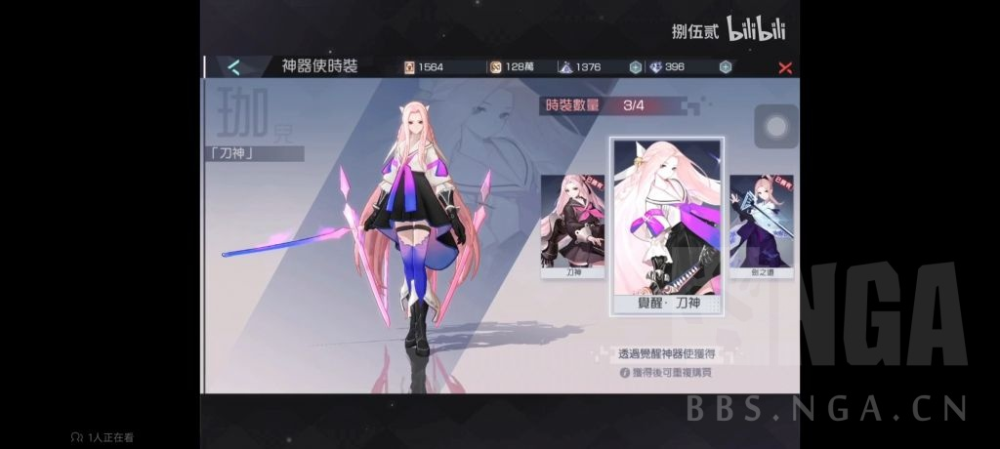
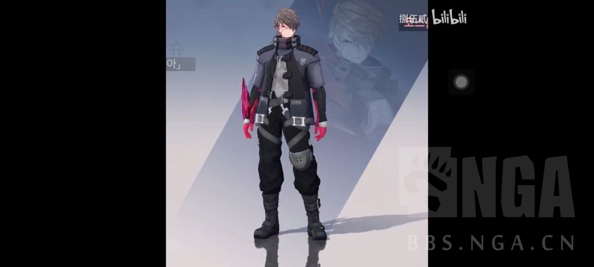
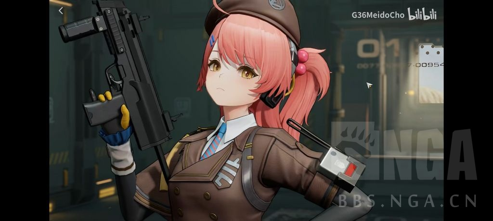

### [不吐不快]米哈游的游戏只配在手机里待3个月

Made by ngapost2md (c) ludoux [GitHub Repo](https://github.com/ludoux/ngapost2md)

----

##### 0.[1] \<pid:0\> 2023-08-03 15:53:49 by 献给美第奇
米哈游从一开始就是靠技术起家的公司，毕竟“tech otakus save the world”。所以米哈游一直在搞技术效果，成果就是崩坏三对同时代手游的技术碾压、桃源恋歌等一系列mmd和把“开放世界”塞进手机的原神，米哈游也成为顶级的手游“工场”。
但是游戏不只是看技术，个人认为更重要的是人文内核。举个经典例子就是任天堂的设备就是垃圾，但是任天堂的游戏很好玩。
而米在这点上是残疾的。米哈游的想法可能是“只要我的技术好画面棒特效炸裂，剧情？who cares”。对于新玩家，米这一套可能是有效的，毕竟入坑一个游戏第一时间体验到的就是画面，新玩家一眼被这些漂亮物件震慑，顿感为2d纸片人氪金不如为3d手办氪金。
但老玩家的需求不同。因为老玩家已经入戏了，哪怕真是2d纸片人演出也能脑补出3d特效、飙泪演出、生死离别。所以这个时候重要的就是剧情演出能不能触动内心。
可惜，米哈游屡次吃书就证明它根本没有这个能力，它不懂玩家留在提瓦特是为了什么。最好笑的就是它那个故意留着优化空间应对节奏的做法(比如这次的圣遗物+300)。
玩家不满的是自己投入了情感却被当取款机，还要被李猛干之流隔着屏幕肆意嘲笑。而单纯用福利应对节奏的解决方式就像<b>还你点钱，咱们继续维持关系</b>一般丑陋。玩家要的是福利吗？玩家最想要的重置垃圾剧情或清算剧情崩坏的罪魁祸首你是一点不提啊？？
写完这么一堆胡言乱语，好小丑

----

##### 1.[0] \<pid:706715650\> 2023-08-03 16:22:20 by 蛮力之弓
画面棒？这话发到显卡吧不得被笑掉大牙

----

##### 2.[0] \<pid:706716532\> 2023-08-03 16:25:50 by UID42376165
从技术驱动走向卖饭圈人设喽

----

##### 3.[0] \<pid:706716563\> 2023-08-03 16:25:59 by abasiyaluo2
>[jump](#pid706715650) 蛮力之弓(2023-08-03 16:22)说:
>画面棒？这话发到显卡吧不得被笑掉大牙[s:ac:喷]

画面在三维二游里确实算不错的了吧，比它好的不多，手机上那就更不多了

----

##### 4.[0] \<pid:706716588\> 2023-08-03 16:26:05 by 献给美第奇
>[jump](#pid706715650) 蛮力之弓(2023-08-03 16:22) 说: 
>
>画面棒？这话发到显卡吧不得被笑掉大牙

肯定是手游内比较，毕竟米也就在手游里得瑟一下

----

##### 5.[0] \<pid:706717211\> 2023-08-03 16:28:48 by adsere
>[jump](#pid706715650) 蛮力之弓(2023-08-03 16:22) 说: 
>
>画面棒？这话发到显卡吧不得被笑掉大牙

单就二游内来说，算画面好了。

----

##### 6.[0] \<pid:706720864\> 2023-08-03 16:45:06 by tk447999
画面棒确实也不是瞎说，真限定二次元游戏里面，原和铁道画面都算挺好
但是也只能算挺好，这两游戏我都是手机留着出差或者现实活动打日常混着，主要靠较高配pc和本子玩的
只能说1080p下还过得去，4k画面下，原的角色建模很粗糙，尤其主角身上的配饰，限5的还行，铁道有加强过一部分，但之前过彦卿同行最后接剑那下还是太粗糙，有进步空间
毕竟恶心的事，pc端铁道的优化是真不怎么样，反而低端显卡问题还不大，公司的1050ti跑1080p没啥问题，家里的3070ti但凡跑罗浮就风扇起飞，关键看显存最多只用了一半，这毛病至今没搞好
毕竟以前从日厂游戏荼毒至今的，只能说画面和优化虐虐万年不思进取的日厂是真没问题，但米厂又不只是有画面问题

----

##### 7.[0] \<pid:706721998\> 2023-08-03 16:50:12 by 白开水巨好喝
以后你们再吹米哈游的时候最好还是加上限定词。
不然真的很难绷，又是限定二次元画风又是手游。
原神在手机上那个画面也算得上画面好？

----

##### 8.[0] \<pid:706722215\> 2023-08-03 16:51:06 by UID3563849
妈个鸡，玩个游戏提心吊胆的，那最优解就是不碰他家的东西

----

##### 9.[0] \<pid:706722866\> 2023-08-03 16:53:57 by wjxjh
谁tm打游戏是冲着技术去的啊，不能满足情绪价值还不如在网上和人聊天呢

----

##### 10.[0] \<pid:706723054\> 2023-08-03 16:54:43 by Collapsar。
楼里上演了mhy的固定套路
先xjb一顿狂吹，被质疑了，就加限定词
哪怕在二游里，你米的建模都不算多好看
角色设计的垃圾审美加剧了建模的灾难
井底之蛙可以去看看七日之都的建模，吊打你原
都是国产，都是二游

----

##### 11.[0] \<pid:706723187\> 2023-08-03 16:55:18 by hexxehhexhex
切忌投入感情还有金钱！我是发现了，长期来看米家任何游戏小月卡极限，白嫖才勉强不亏

----

##### 12.[0] \<pid:706723948\> 2023-08-03 16:58:28 by 四洲鱼蛋
不如省流一句话。远离米家游戏

----

##### 13.[0] \<pid:706724314\> 2023-08-03 16:59:53 by IOKnAEDE
建议看看追放2的建模和光影再说画面，现在
画面建模这块真不是一枝独秀了

----

##### 14.[0] \<pid:706724740\> 2023-08-03 17:01:52 by safindem
里茶活像一个因沉没成本过高而不愿离去，希冀渣男男友恢复正常的恋爱脑女孩。
你们拿着大伟哥的经典发言鸣不平就跟知乎上哭号“他曾经如此诚恳地承诺过给我一个家，怎么可能出尔反尔呢？”的可怜人没什么两样。

----

##### 15.[0] \<pid:706724798\> 2023-08-03 17:02:03 by 时之流砂
倒不如说玩任何长线运营游戏都不要投入感情，你总会有失望的那天

----

##### 16.[0] \<pid:706726894\> 2023-08-03 17:11:43 by derhirte
应该是玩二游切忌入坑米

----

##### 17.[0] \<pid:706727658\> 2023-08-03 17:15:06 by Collapsar。
我混过的一个论坛，特别爱跨游戏比美
当年你原的角色，拉出去比美，让不玩游戏的人投票，你原角色基本垫底
一斗拉出来，被人说这是比美不是比丑，还被问美术是什么精神状态设计出这种角色的

能抱着你原的美术吹得天上有地下无，鉴定是玩原神玩的

----

##### 18.[1] \<pid:706754292\> 2023-08-03 19:31:28 by 时若ruo
是这样的，你一旦付出真心就一定会被mhy恶心到，因为mhy就是贪的要死贼喜欢两头吃，妄图在同一事物上使水火不容的两种受众共存，他明明在剧情里那么明白两头吃必然会两头受罪，搞不懂为什么还屡次这么干。可能唯一的答案就是，他们真的傲慢到认为玩家宁愿互相扯头花也不会离开他们，有一堆李猛干在看玩家因为他们写的东西互相讨伐，并以此为乐

----

##### 19.[0] \<pid:706754481\> 2023-08-03 19:32:36 by 不太好吃
那种事情重要吗

----

##### 20.[0] \<pid:707030046\> 2023-08-05 00:38:58 by xxqssh
>[jump](#pid706723054) Collapsar。(2023-08-03 16:54)说:
>楼里上演了mhy的固定套路 先一顿狂吹，被质疑了，就加限定词 哪怕在二游里，你米的建模都不算多好看 角色设计的糟糕审美加剧了建模的灾难 井底之蛙可以去看看七日之都的建模，吊打你原 都是国产，都是二游，限定词也给你加上[s:ac:茶]

逆天一个，就这还有这么多赞。

----

##### 21.[0] \<pid:707030698\> 2023-08-05 00:44:09 by xxqssh
>[jump](#pid706724314) IOKnAEDE(2023-08-03 16:59):

什么米式对比法，一个战旗游戏不吃大世界性能的比模型是吧？给你看看米哈游的高模好吧。

----

##### 22.[0] \<pid:707036352\> 2023-08-05 01:35:44 by 黄河远上白云间
马哈鱼的建模以前还能吹一吹，现在就算了，还没公测的烧钱二给他爆出石来，虽然我觉得三测的养成系统依托狗屎，但美术组一群懂哥

----

##### 23.[0] \<pid:707043004\> 2023-08-05 03:29:50 by ritsukaalter
还是彻底一点吧
不建议玩米游

----

##### 24.[0] \<pid:707043482\> 2023-08-05 03:44:13 by 梓川枫丶
原神这大头模型是真的能给我看出欢乐谷效应的

----

##### 25.[0] \<pid:707047332\> 2023-08-05 06:22:47 by 留下一个小不点
对的，不建议投入感情。
但是记得氪金

----

##### 26.[0] \<pid:707047955\> 2023-08-05 06:39:22 by 疯子二太郎
yysy我觉得yys的建模都比原舒服，角色设计暂且不比较，原建模的头是不是太大了点，萝莉角色看着还好，成男成女头也这么大其实看着很奇怪

----

##### 27.[0] \<pid:707048048\> 2023-08-05 06:41:55 by Inquisit
>[jump](#pid707030698) xxqssh(2023-08-05 00:44) 说: 
>
>什么米式对比法，一个战旗游戏不吃大世界性能的比模型是吧？给你看看米哈游的高模好吧。
>
>

高模是下面那个吗 不还是被上面薄纱，原宝的建模真不能和任何外面的对比 一比就爆炸头大

----

##### 28.[0] \<pid:707052220\> 2023-08-05 07:49:31 by cccherch
技术指的是外观渲染的几个专利吗 米从一开始不就是卖角色和人设的公司，逮他技术狂吹的有哪位是做游戏引擎相关的吗？不都是结晶复读洗脑包。

