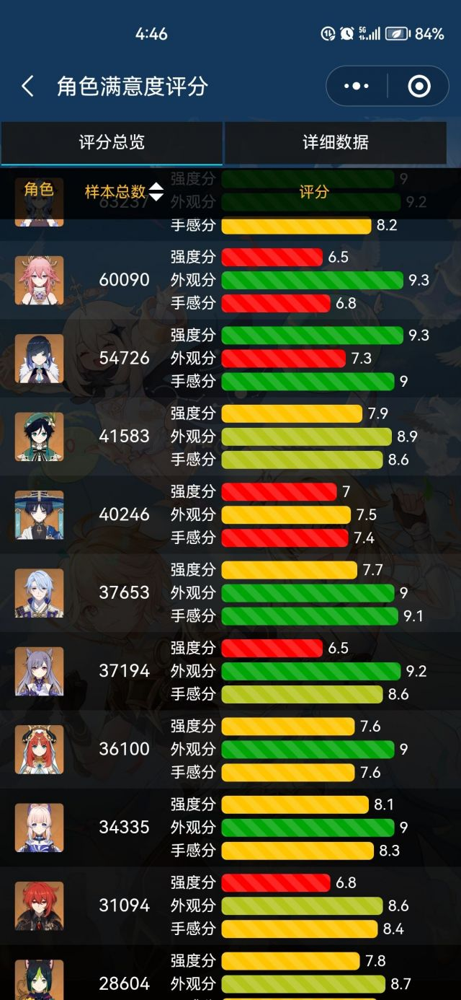

### [不吐不快]4.0快来了，说说争议最大的散兵吧

Made by ngapost2md (c) ludoux [GitHub Repo](https://github.com/ludoux/ngapost2md)

----

##### 0.[0] \<pid:0\> 2023-08-03 16:46:21 by 拱墅银枪小霸王孙一峰
整个须弥版本，散兵的剧情是原罪。
很多人说散兵写崩了，这点我不认同，散兵没写崩，因为米哈游从一开始就打算塑造这样的人物性格，所以散兵恰恰没崩。
但为什么大家觉得恶心，因为为了塑造散兵，把纳西妲写崩了！玩家从3.0开始用了3个版本对纳西妲建立起来的好感，在3.3直接被粉碎！这个角色本来应该成为须弥塑造最成功的角色，现在定位却非常尴尬。
根本原因，是米哈游搞捆绑销售，只要散兵出场，背后必有纳西妲，散兵一个活了几百年的人，历经大风大浪的人，变成好像离了纳西妲路都不会走一样，难道不尴尬吗？
希望老米能吸取教训，以后少搞一些捆绑销售，比如柯莱回蒙德，反而和砂糖成了朋友，这样的剧情就很好，如果把柯莱强行和安柏绑在一起，反而让人不舒服

----

##### 1.[0] \<pid:706721777\> 2023-08-03 16:49:13 by お宅不是
咱用数据说话

总之颜值夜上第一人

----

##### 2.[5] \<pid:706721908\> 2023-08-03 16:49:50 by Cloudrapid133
别反思了，这俩都已经臭了
我只会祝加速
不会来了里版还在打着一顿暴哭请爹地回心转意的心思吧
鸱鸮怪叫，尖叫抓挠.jpg

----

##### 3.[5] \<pid:706721920\> 2023-08-03 16:49:53 by 迷你靓仔
你在说什么

----

##### 4.[0] \<pid:706722410\> 2023-08-03 16:51:47 by 我冲我自己
要是散兵一开始就是想塑造成这个样子，他就不会落地，也不会拿小草兰纳罗一大堆人给他垫还是正视事实吧，纯纯mhy三观不正写的很烂而已

----

##### 6.[0] \<pid:706724448\> 2023-08-03 17:00:26 by 蒸馍，你不服气？
鸱鸮怪叫，终不能掩鹓鶵清音。

----

##### 7.[0] \<pid:706725986\> 2023-08-03 17:07:29 by 四十四号外星人
其实稻妻就开始崩了捏我心能量+3

----

##### 8.[0] \<pid:706726062\> 2023-08-03 17:07:50 by 夭叶舒华
神tm的现在散兵就是米哈游要的，一个lowb角色只会把ta周围的角色都带low，米哈游难道想要个全员lowb的游戏？

----

##### 9.[0] \<pid:706726826\> 2023-08-03 17:11:23 by Matrix1204
已经开始加强管理了吗

----

##### 10.[0] \<pid:706726952\> 2023-08-03 17:12:00 by 須賀悠衣
3000？

----

##### 11.[0] \<pid:706727983\> 2023-08-03 17:16:27 by CUCUK
更新一下里版版本吧，我们都要过夏活2.0了，你还搁这儿公测版本呢

----

##### 12.[1] \<pid:706728584\> 2023-08-03 17:19:01 by 小王饼干
别反思了，枫丹加速3.6之后我可是拷打了不少拿角色有自己的生活堵我嘴的结晶大家都要平等地挨创

----

##### 13.[0] \<pid:706731097\> 2023-08-03 17:30:33 by 重生之我是荣誉骑士
哈哈哈，散兵没崩是纳西妲崩了。是不是什么散解内部群发了统一话术和任务啊

----

##### 14.[0] \<pid:706731196\> 2023-08-03 17:30:56 by 沈一馨不怕黑
散兵撞树自我牺牲拯救被他杀了的人，最后散兵消失，世界树创造一个流浪者，这故事挺圆满的，顶多俗了点。然而米哈游编剧就非得写散兵做的一切都是徒劳的(甚至还让别人背了锅)，兜兜转转一圈散兵记忆也没丢，人也没救成，还无缝换了阵营，也不知道是编剧眼高手低还是单纯的想给玩家找不痛快，或者他们现实中没经历过圆满的事情所以不会写是吗？

----

##### 15.[0] \<pid:706732234\> 2023-08-03 17:35:46 by 吉尔菲艾丝
1)你还能看到苍白套里那个自称不被命运束缚的超越者吗？
2)散兵没有写崩，那你要不要想想看他现在的人设服务的对象是什么群体，招来了什么样的粉丝群，现在的散厨舆论环境和风评是什么样的？
—&gt;从定位这个角色的人设和面向人群开始，文案就已经走错路了

----

##### 16.[0] \<pid:706734967\> 2023-08-03 17:48:40 by Elsanna123
>[jump](#pid706722410) 我冲我自己(2023-08-03 16:51) 说: 
>
>要是散兵一开始就是想塑造成这个样子，他就不会落地，也不会拿小草兰纳罗一大堆人给他垫还是正视事实吧，纯纯mhy三观不正写的很烂而已

其实我也认为散兵没崩，本来斯卡拉姆齐意思就是个无能狂怒的小丑,鉴定为编剧xp清奇

----

##### 17.[0] \<pid:706735627\> 2023-08-03 17:51:48 by 落穹千刃
>[jump](#pid706734967) Elsanna123(2023-08-03 17:48) 说: 
>
>其实我也认为散兵没崩，本来斯卡拉姆齐意思就是个无能狂怒的小丑,鉴定为编剧xp清奇

我记得制作组访谈里说过愚人众的名字都只是捏他意大利歌剧里的角色名而已，不能完全用来参考人设

----

##### 18.[0] \<pid:706736893\> 2023-08-03 17:58:06 by 吃烤肉去啊
>[jump](#pid706731196) 沈一馨不怕黑(2023-08-03 17:30)说:
>散兵撞树自我牺牲拯救被他杀了的人，最后散兵消失，世界树创造一个流浪者，这故事挺圆满的，顶多俗了点。然而米哈游编剧就非得写散兵做的一切都是徒劳的(甚至还让别人背了锅)，兜兜转转一圈散兵记忆也没丢，人也没救成，还无缝换了阵营，也不知道是编剧眼高手低还是单纯的想给玩家找不痛快，或者他们现实中没经历过圆满的事情所以不会写是吗？

凭什么让散兵圆满？就是要[正因其徒劳]
从他说自己超越一切、命运也没有裁决他的资格之时起，就注定是个命运玩弄下的小丑了。

----

##### 19.[0] \<pid:706737258\> 2023-08-03 18:00:00 by 吃烤肉去啊
>[jump](#pid706735627) 落穹千刃(2023-08-03 17:51)说:
>[quote][pid=706734967,37244964,1]Reply[/pid] <b>Post by [uid=63943377]Elsanna123[/uid] (2023-08-03 17:48):</b>  其实我也认为散兵没崩，本来斯卡拉姆齐意思就是个无能狂怒的小丑,鉴定为编剧xp清奇[s:a2:自戳双目][/quote]我记得制作组访谈里说过愚人众的名字都只是捏他意大利歌剧里的角色名而已，不能完全用来参考人设[s:ac:哭笑]

波西米亚狂想曲的主人公也是命运审判下的小丑，他的个人故事里也说了斯卡拉姆齐是懦夫。

大部分散厨、甚至是一些散黑都无法接受，mhy就是故意把散兵写成这个样子，这就是他的[人设]。

----

##### 20.[0] \<pid:706737447\> 2023-08-03 18:00:53 by bzbjzj
散兵塑造失败了，一个复杂的人物塑造是非常麻烦的。
而散兵。。。。
1、黑化心路历程有待补充，很明显没有达到目标。
2、五传动机过程需要打补丁，逻辑欠缺直接链条链接动机无语塑造lowb。
3、该为自己所作所为负责，该对起源身份、故事收束圆满心路。
通通没有做到

----

##### 21.[0] \<pid:706737487\> 2023-08-03 18:01:05 by yian127
漫画里坚强勇敢的柯莱在原里面逐渐变成了吐槽役和团宠配置。
和砂糖这个友谊也来的莫名其妙的……反正须弥赛提柯这个关系网写得也越来越扁平，风花的呼吸主打一个无脑合家欢……
反正不要拿这个当正面教材了。

----

##### 22.[0] \<pid:706738266\> 2023-08-03 18:04:58 by forever_owl
社区管理来了？现在的话术变成没写崩就是想这么写的了？
那流水崩了肯定也是故意的吧
难道是下一盘大旗给星铁让路
哈哈哈哈

----

##### 23.[0] \<pid:706738368\> 2023-08-03 18:05:29 by 贾元春儿
>[jump](#pid706736893) 吃烤肉去啊(2023-08-03 17:58) 说: 
>
>凭什么让散兵圆满？就是要[正因其徒劳]
>从他说自己超越一切、命运也没有裁决他的资格之时起，就注定是个命运玩弄下的小丑了。

但问题是这个所谓“小丑”的散兵，现在表现得一点也不“小丑”啊~~(除了卡池流水)~~，
雌小鬼该吃的瘪编剧/ch是一点也舍不得让他吃啊，
这就搞得爷(以及莱妹、小提、赛诺以至于几位稻妻角色)很小丑啊！

总觉得烤肉佬你保有一份坚强的乐观…

----

##### 24.[0] \<pid:706743982\> 2023-08-03 18:34:47 by 吃烤肉去啊
>[jump](#pid706738368) 贾元春儿(2023-08-03 18:05)说:
>[quote][pid=706736893,37244964,1]Reply[/pid] <b>Post by [uid=63987990]吃烤肉去啊[/uid] (2023-08-03 17:58):</b>  凭什么让散兵圆满？就是要[正因其徒劳][s:ac:偷笑] 从他说自己超越一切、命运也没有裁决他的资格之时起，就注定是个命运玩弄下的小丑了。[/quote]但问题是这个所谓“小丑”的散兵，现在表现得一点也不“小丑”啊<del class='gray'> (除了卡池流水) </del>， 雌小鬼该吃的瘪编剧/ch是一点也舍不得让他吃啊， 这就搞得爷(以及莱妹、小提、赛诺以至于几位稻妻角色)很小丑啊！[s:ac:哭笑]  总觉得烤肉佬你保有一份坚强的乐观…[s:a2:doge]

小丑和雌小鬼还是有差别的。
不过可以确定的是，散兵这种人憎狗厌的状态就是编剧想要的。
他不可能不知道自己写的那些东西会给笔下的角色带来怎样的后果。
除了主线剧情外，不限于让散兵踩愚人众、踩莱伊拉、卖散草99，每一步都在切割分化散兵原有的支持者，增强玩家对他的负面印象。
就是不知道0h的流水编剧有没有想到了

----

##### 25.[0] \<pid:706749547\> 2023-08-03 19:05:38 by 甲徐时乙秦巫
>[jump](#pid706743982) 吃烤肉去啊(2023-08-03 18:34) 说: 
>
>小丑和雌小鬼还是有差别的。
>不过可以确定的是，散兵这种人憎狗厌的状态就是编剧想要的。
>他不可能不知道自己写的那些东西会给笔下的角色带来怎样的后果。
>除了主线剧情外，不限于让散兵踩愚人众、踩莱伊拉、卖散草99，每一步都在切割分化散兵原有的支持者，增强玩家对他的负面印象。
>就是不知道0h的流水编剧有没有想到了

承认编剧厕品就行了，现在的编剧自以为写了很有深度的角色，就是喜欢在游戏养儿子模拟器，你把编剧理解为现实中的熊家长就对了，他在游戏里有个七神老婆，大家都不能让他吃亏

就像龙族的诺诺，她在剧情后面也是塑造很差，但是你能说江南恨她吗？

----

##### 26.[0] \<pid:706751821\> 2023-08-03 19:18:09 by 吃烤肉去啊
>[jump](#pid706749547) 甲徐时乙秦巫(25楼) (2023-08-03 19:05)说:
>[quote][pid=706743982,37244964,2]Reply[/pid] <b>Post by [uid=63987990]吃烤肉去啊[/uid] (2023-08-03 18:34):</b>  小丑和雌小鬼还是有差别的。 不过可以确定的是，散兵这种人憎狗厌的状态就是编剧想要的。 他不可能不知道自己写的那些东西会给笔下的角色带来怎样的后果。 除了主线剧情外，不限于让散兵踩愚人众、踩莱伊拉、卖散草99，每一步都在切割分化散兵原有的支持者，增强玩家对他的负面印象。 就是不知道0h的流水编剧有没有想到了[s:ac:偷笑][/quote]承认编剧厕品就行了，现在的编剧自以为写了很有深度的角色，就是喜欢在游戏养儿子模拟器，你把编剧理解为现实中的熊家长就对了，他在游戏里有个七神老婆，大家都不能让他吃亏  就像龙族的诺诺，她在剧情后面也是塑造很差，但是你能说江南恨她吗？

编剧自己倒也不至于恨散兵，主要是这个角色存在的意义就在于做负面标杆衬托别人。

就像散兵先说莱伊拉不用占星术没觉悟，然后再借夏洛蒂和莫娜的那段剧情来体现莱伊拉正直高尚有原则。
这就是非常标准的操作，这一套下来以后正常人必然会更同情莱伊拉，而更厌恶散兵。
散兵作为三观歪曲、道德低劣的一方，他的存在可以更好体现出真正高尚的人应具有怎样的品格、怎样的光辉。
起到的效果大概就像是反向拉踩？

----

##### 27.[0] \<pid:706820952\> 2023-08-04 07:23:13 by 看我把那飞机打下来
>[jump](#pid706749547) 甲徐时乙秦巫(2023-08-03 19:05) 说: 
>
>承认编剧厕品就行了，现在的编剧自以为写了很有深度的角色，就是喜欢在游戏养儿子模拟器，你把编剧理解为现实中的熊家长就对了，他在游戏里有个七神老婆，大家都不能让他吃亏
>
>就像龙族的诺诺，她在剧情后面也是塑造很差，但是你能说江南恨她吗？

还有人记得龙族？感动

----

##### 28.[0] \<pid:706821730\> 2023-08-04 07:33:59 by write54
>[jump](#pid706751821) 吃烤肉去啊(2023-08-03 19:18) 说: 
>
>编剧自己倒也不至于恨散兵，主要是这个角色存在的意义就在于做负面标杆衬托别人。
>
>就像散兵先说莱伊拉不用占星术没觉悟，然后再借夏洛蒂和莫娜的那段剧情来体现莱伊拉正直高尚有原则。
>这就是非常标准的操作，这一套下来以后正常人必然会更同情莱伊拉，而更厌恶散兵。
>散兵作为三观歪曲、道德低劣的一方，他的存在可以更好体现出真正高尚的人应具有怎样的品格、怎样的光辉。
>起到的效果大概就像是反向拉踩？

送水 骂莱 锤卡 猫塑 ep哪点为了突出小丑了

