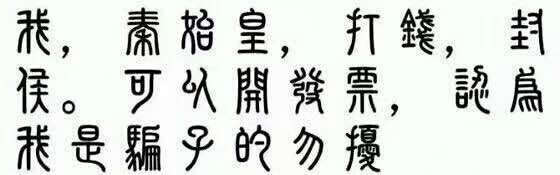

### [不吐不快]请问散兵流水是个什么水平？

Made by ngapost2md (c) ludoux [GitHub Repo](https://github.com/ludoux/ngapost2md)

----

##### 0.[0] \<pid:0\> 2023-08-03 16:50:57 by 小kotomi
有赔钱货也有人说赚了大钱，到底是什么档次？

----

##### 1.[1] \<pid:706722366\> 2023-08-03 16:51:36 by UID3563849
荣升赔宝的水平

----

##### 2.[0] \<pid:706722383\> 2023-08-03 16:51:41 by 药师鬼
赔钱货，0H

----

##### 4.[6] \<pid:706722477\> 2023-08-03 16:52:09 by 桐↑生↓战↑兔↓
抽取量和第四次的你心有来有回，在理查er普遍预测超抖音30~40h的情况下创造了超抖音0h的超级记录

----

##### 5.[3] \<pid:706722522\> 2023-08-03 16:52:20 by Gdygfdqqqq
居然是0哎.jpg
只能说结晶在3.0后就没打过这么赔钱的仗，各个平台都吹不动了

----

##### 6.[2] \<pid:706722652\> 2023-08-03 16:52:55 by 希望不要再非了
从3.3以后流水掉了多少个亿的水平

----

##### 7.[0] \<pid:706722667\> 2023-08-03 16:52:57 by tbiph9277
赚大钱指的是流水超抖音0h吗，一个机制优秀的命座战士抽取数和第四次复刻零命完全体的奶妈有来有回

那确实赚挺大

----

##### 8.[1] \<pid:706722690\> 2023-08-03 16:53:02 by 方子幕_桃
烂中烂，米哈游往散兵投入的资源给猪都比现在强

----

##### 9.[0] \<pid:706722698\> 2023-08-03 16:53:05 by nervkid
超抖音0小时的赔钱货啊，有啥说的，如果有人拿二观，蝉大师之类来说那对对对就好

----

##### 10.[2] \<pid:706722888\> 2023-08-03 16:54:02 by tag一定要打对真菌
>[jump](#pid0) 小kotomi(2023-08-03 16:50) 说: 
>
>有赔钱货也有人说赚了大钱(高于甘白池)，到底是什么档次？

高个几把甘白池，它甘拜下风还差不多

----

##### 11.[0] \<pid:706723194\> 2023-08-03 16:55:20 by 十夜铃沄花
能让结晶回头质疑散解的水平

----

##### 12.[0] \<pid:706723196\> 2023-08-03 16:55:20 by 电风扇kkks
哈哈哈哈哈超越白甘池赔钱货这个抖下第一人好意思说人家超了抖音的流水？

----

##### 13.[0] \<pid:706723238\> 2023-08-03 16:55:31 by wjxjh
很棒的水平，所以mhy加油飞，我可以提供氪金和玩它游戏以外的所有支持

----

##### 14.[6] \<pid:706723247\> 2023-08-03 16:55:33 by 青春派洛迪
又是一个看蝉大师的顺从就完事儿了，之前不是吹top吗，怎么现在跟优菈可莉比了

----

##### 15.[3] \<pid:706723251\> 2023-08-03 16:55:34 by Irori丶
感觉不如

----

##### 16.[10] \<pid:706723299\> 2023-08-03 16:55:45 by 哈人哈人太哈人了
首先白甘池流水对原神以前水平来说算是差的
其次白甘池超抖音18h爆杀心散0h

----

##### 17.[5] \<pid:706723317\> 2023-08-03 16:55:48 by lien11
算上间接影响大概率文娱界第一赔钱货的水平

----

##### 18.[1] \<pid:706723532\> 2023-08-03 16:56:44 by 前排合影围观
比白甘池低多了的水平，和上半打得有来有回，她看的是蝉大师，没有参考价值。

----

##### 19.[0] \<pid:706723590\> 2023-08-03 16:56:58 by 小kotomi
>[jump](#pid706723247) 青春派洛迪(2023-08-03 16:55) 说: 
>
>又是一个看蝉大师的顺从就完事儿了，之前不是吹top吗，怎么现在跟优菈可莉比了

主要是他在我写的文章里发评论 我不太希望读者被人误导 ，所以能不能解释一下禅大师是如何计算的

----

##### 20.[0] \<pid:706723751\> 2023-08-03 16:57:41 by q794623
。。碰瓷个锤子甘白池，超抖音没有，被逆水寒.王者荣耀压着打。。

最搞笑的那天终于反超顺火暖，但那时候。。。顺火暖在你馬维护啊。

----

##### 21.[2] \<pid:706724082\> 2023-08-03 16:59:02 by 夜寒溟
赚大钱，指云原神九十多名，还不如优可池七十多名
即使都是0h，第二次up的赔钱货也打不过第三次及第n次复刻的优菈可莉

----

##### 22.[3] \<pid:706724085\> 2023-08-03 16:59:02 by lien11
>[jump](#pid706723751) q794623(2023-08-03 16:57)说:
>。。碰瓷个锤子甘白池，超抖音没有，被逆水寒.王者荣耀压着打。。  最搞笑的那天终于反超顺火暖，但那时候。。。顺火暖在你馬维护啊。[s:ac:哭1][s:ac:哭笑]

那天早上寒维护的时候，我记得没超

----

##### 23.[1] \<pid:706724147\> 2023-08-03 16:59:15 by framita
这两年原神自从开双池以来跟上半优可并列最差的成绩

----

##### 24.[4] \<pid:706724241\> 2023-08-03 16:59:36 by tag一定要打对真菌
>[jump](#pid706723590) 小kotomi(2023-08-03 16:56) 说: 
>
>主要是他在我写的文章里发评论 我不太希望读者被人误导 ，所以能不能解释一下禅大师是如何计算的

逆水寒还在维护的时候它的排名竟然掉了逆水寒，一路俯冲到十名以下才稳住几天，现在已经十七名了，它个超抖音0h的拿头跟人家比啊

----

##### 25.[0] \<pid:706724417\> 2023-08-03 17:00:17 by Skalski_
都赔解了，你就让让赔宝吧

----

##### 26.[0] \<pid:706724653\> 2023-08-03 17:01:23 by 被窝里叉出去
>[jump](#pid706724085) lien11(2023-08-03 16:59) 说: 
>
>那天早上寒维护的时候，我记得没超

超了一小会，寒没维护完就掉了

----

##### 27.[0] \<pid:706724686\> 2023-08-03 17:01:32 by 青春派洛迪
>[jump](#pid706723590) 小kotomi(2023-08-03 16:56) 说: 
>
>主要是他在我写的文章里发评论 我不太希望读者被人误导 ，所以能不能解释一下禅大师是如何计算的

蝉大师是看排名给预估流水的，比如排名第一给800w，第二给500w这样。白甘那次其他游戏有活动所以虽然超过抖音了但排名不是特别高，峰值也就不高。瘤子这次没有游戏开活动，没过抖音但是排名不算很低。所以这种看排名给峰值的图没啥意义，不如直接对比抖音，毕竟抖音的流水稳定

----

##### 28.[0] \<pid:706724688\> 2023-08-03 17:01:33 by 不再嘴硬
如你图中所示，找尽角度也只能吹个白甘水平的玩意
谁帮我回忆一下他们赔宝初登场怎么吹的来着

----

##### 29.[0] \<pid:706724701\> 2023-08-03 17:01:37 by 嘀嘟滴嘟嘀
白甘池有超抖音，散兵没超抖音。
除非抖音在短短一个月的时间，完成了收入的超巨额增长。
不然散心池不可能超过白甘池。

----

##### 30.[3] \<pid:706724839\> 2023-08-03 17:02:15 by 哈人哈人太哈人了
>[jump](#pid706723590) 小kotomi(2023-08-03 16:56) 说: 
>
>主要是他在我写的文章里发评论 我不太希望读者被人误导 ，所以能不能解释一下禅大师是如何计算的

蝉大师赋值是根据应用在这个排名的时长来赋值的，现在24h第一给500多万，24h第二给200多万，24h第三好像是170多万吧。
心散池因为是下午六点开池，在晚上九点时候从后面一跃到总榜第四，所以第一天的流水预估就低，但是其实流水峰值就是开池前面几波。第二天因为其他游戏没有活动，所以24h第三，而白甘虽然超抖音了，但是因为其他游戏有活动，所以第二天也是总榜第三，晚上掉到第四，故流水预估会比心散低一些
这种赋值法非常看友商所以不准

----

##### 31.[0] \<pid:706725428\> 2023-08-03 17:05:00 by 小kotomi
>[jump](#pid706724839) 哈人哈人太哈人了(2023-08-03 17:02) 说: 
>
>蝉大师赋值是根据应用在这个排名的时长来赋值的，现在24h第一给500多万，24h第二给200多万，24h第三好像是170多万吧。
>心散池因为是下午六点开池，在晚上九点时候从后面一跃到总榜第四，所以第一天的流水预估就低，但是其实流水峰值就是开池前面几波。第二天因为其他游戏没有活动，所以24h第三，而白甘虽然超抖音了，但是因为其他游戏有活动，所以第二天也是总榜第三，晚上掉到第四，故流水预估会比心散低一些
>这种赋值法非常看友商所以不准

感谢指导

----

##### 32.[1] \<pid:706725657\> 2023-08-03 17:05:54 by 七月七寄
散解为什么要拿我老婆做头像，气死了
流水不是超抖音0h吗 烂完了

----

##### 33.[0] \<pid:706726004\> 2023-08-03 17:07:33 by lien11
我是真不懂怎么能池子刚开掉维护的寒的，那时候在维护啊，仙不来一手寒虚空充钱吗

----

##### 34.[0] \<pid:706726155\> 2023-08-03 17:08:18 by ALMAUJ
命座战士首次复刻抽取数和0命完全体四次up的心海打得有来有回、夜下第一人超抖音0h荣获赔宝称号的水平

----

##### 35.[1] \<pid:706726976\> 2023-08-03 17:12:08 by 冷光小调
胫骨结晶都觉得没眼看的成绩，也就三姐还在那自己骗自己……白甘18h，心散0h就挂在那，还和同为0h的优可池比是啥很光荣的事么顺便看抽取统计，这个池子至少有4成是心海贡献的

----

##### 36.[1] \<pid:706727257\> 2023-08-03 17:13:15 by moonlight34
吃了最强的资源，打出倒数的伤害  还和优可比，一个复刻四次了一个500天不复刻比过真觉得强啊要是放优菈第二复刻复刻都是薄纱的水平

----

##### 37.[0] \<pid:706728139\> 2023-08-03 17:17:13 by 哈人哈人太哈人了
>[jump](#pid706725428) 小kotomi(2023-08-03 17:05) 说: 
>
>感谢指导

客气啦。而且其实他对比的两个池子成绩也是差的，优可也是0h超抖音，白甘超抖音18h，和原神巅峰比起来也是不好看的成绩

----

##### 38.[1] \<pid:706728244\> 2023-08-03 17:17:45 by jaske
抖下第一人笑死

----

##### 39.[0] \<pid:706728357\> 2023-08-03 17:18:07 by 逢河牧野0v0
世界第一cjb的水平白甘超抖18h，我们再看看拖累我心的赔钱货
居然是零诶！

----

##### 40.[0] \<pid:706728569\> 2023-08-03 17:18:57 by a136875563
cos服销量？这怎么看的？合着都是在一家店买的？
刚看了下基本都是600多块钱一套的呀，而且COS服的价格难道不是看配件吗？他们这数据又是从哪里来的

----

##### 41.[0] \<pid:706728777\> 2023-08-03 17:19:55 by 红茶拿铁泡枸杞
就现在这0h流水都是和我心合砍的，第一次复刻的很有氪金点的站场主c和up四次的0+0完全体抽取比例不相上下，cjb的夜下第一人闹麻了的水平

----

##### 42.[0] \<pid:706728819\> 2023-08-03 17:20:05 by 天堂地狱破
说到cos，要是我现在这里人的平均身高能和我老家那边一样高，也不会有那么多散兵cos了

----

##### 43.[0] \<pid:706729767\> 2023-08-03 17:24:22 by meg1412
和cos什么关系我记得之前一个coser在理查说散兵的假发c服是原神里最便宜的那一档(如果不找人定做帽子)，白散的最便宜，和小草都是便宜好cos的角色，不需要什么身材要求，这都能吹上也是nb，跟吹同人软件参与量一样的挠谭

----

##### 44.[0] \<pid:706729855\> 2023-08-03 17:24:47 by shdm520
>[jump](#pid706723590) 小kotomi(2023-08-03 16:56) 说: 
>
>主要是他在我写的文章里发评论 我不太希望读者被人误导 ，所以能不能解释一下禅大师是如何计算的

友商还没开始打压呢
前天粥才来的夏活，现在敢pvp一下吗

----

##### 45.[0] \<pid:706729934\> 2023-08-03 17:25:05 by qinxiayi757
创造历史的水平

----

##### 46.[0] \<pid:706730087\> 2023-08-03 17:25:45 by samwincest
赔钱货一枚，和我心打得有来有回的水平

----

##### 47.[0] \<pid:706730138\> 2023-08-03 17:26:01 by 渐行渐远ii
让他拿数据证据出来啊，不会是自己打了个excel表就开吹了吧

----

##### 48.[0] \<pid:706730148\> 2023-08-03 17:26:04 by 描绘着抛物线
急得米桑赶紧叫内鬼太监出来稳定人心的水平

----

##### 49.[0] \<pid:706738064\> 2023-08-03 18:03:59 by 文字的憂傷
不清楚看的哪里，非小酋那边角色+武器方面，确实比优可稍多，接近甘白了

----

##### 50.[0] \<pid:706738679\> 2023-08-03 18:07:15 by Ales1a_
作为米桑夏活版本的主推卡池打出0h的好成绩，孝子们还真好意思到处乱叫

----

##### 51.[0] \<pid:706751751\> 2023-08-03 19:17:47 by bwzkuc233
第一次强度都救不回来的水平
在此之前你游流水可都跟强度关联最大的，赔宝以一己之力打破了这个规律

----

##### 52.[0] \<pid:706754653\> 2023-08-03 19:33:34 by 辰砂之纺锤
仅针对cos，散兵真的是我见过的最好cos的角色之一了，对coser的身材要求很低这样销量肯定高啊……

