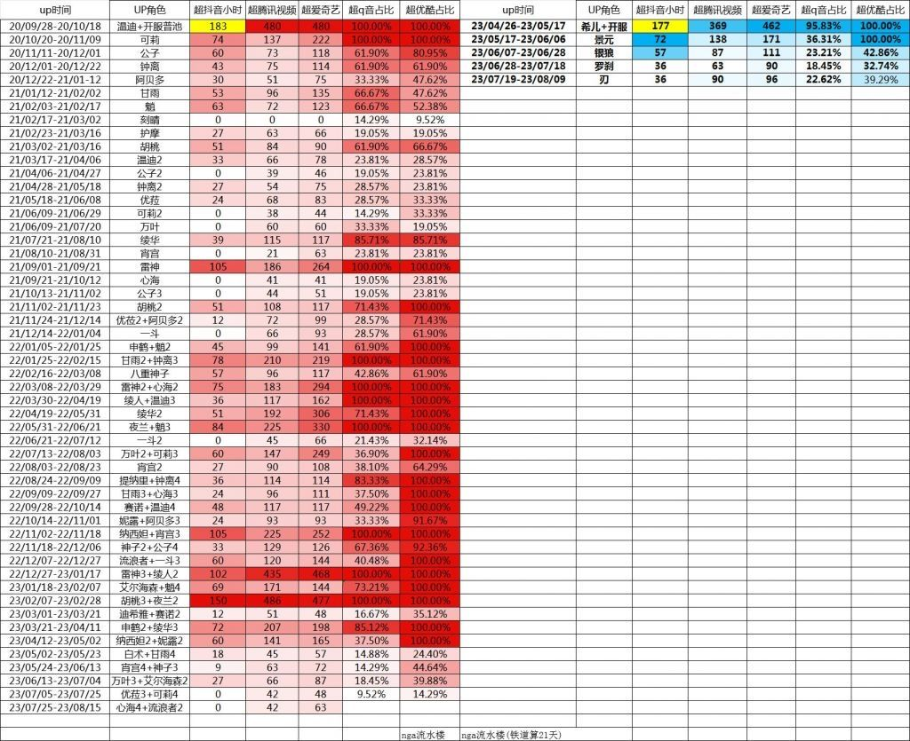
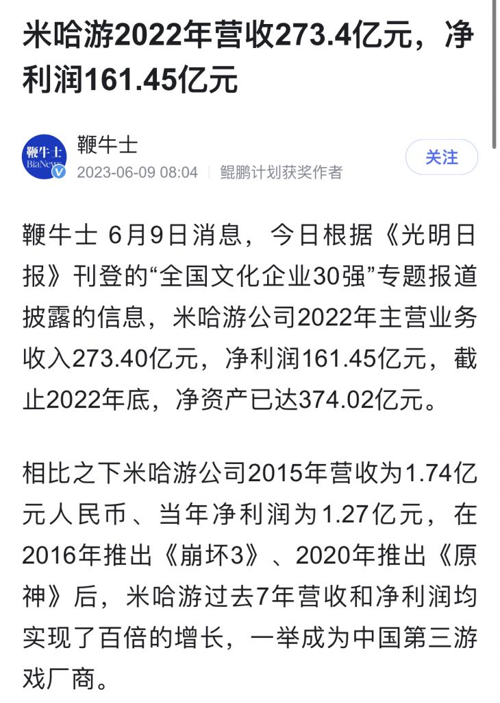

### [热点事件]其他复刻池在原神流水具体是排第几？

Made by ngapost2md (c) ludoux [GitHub Repo](https://github.com/ludoux/ngapost2md)

----

##### 0.[0] \<pid:0\> 2023-08-03 18:15:43 by 黄河远上白云间
虽然整天说0h赔钱货的，但老实讲他到底有多拉胯我还真没有个具体概念

----

##### 1.[0] \<pid:706740862\> 2023-08-03 18:18:35 by 夜∮碎雪

大概是优菈级别吧？

----

##### 2.[0] \<pid:706742018\> 2023-08-03 18:24:31 by 久伴我心1023
21年前10

----

##### 3.[0] \<pid:706742070\> 2023-08-03 18:24:48 by 前排合影围观
不用怀疑，就是倒数第一。
超抖腾Q优时长没办法判断每个角色的具体流水，只能判断档位，很明显散心池流水是倒数第一档次(未超抖)，而且鉴于同档位流水基本都是单池，而散心池作为双池抽取比为1：1，可得散兵单人流水就是倒数中的倒数，稳坐倒第一的水平。

----

##### 4.[0] \<pid:706742850\> 2023-08-03 18:28:53 by Austinando
>[jump](#pid706740862) 夜碎雪(2023-08-03 18:18) 说: 
>
>
>大概是优菈级别吧？  
>
>除了“真爱”党基本没路人抽，差不多算最低一级了。

无关疑惑，万叶第一次up为什么这么低(第二次就很正常)，我记得当时开池后只用了一两天就确认了强度，是当时雷神压在后面都不敢放手抽吗

----

##### 5.[0] \<pid:706743064\> 2023-08-03 18:29:56 by 全部席卷而去
倒数第二

----

##### 6.[0] \<pid:706743145\> 2023-08-03 18:30:24 by 电池vfsdvdfb
>[jump](#pid706742850) Austinando(2023-08-03 18:28) 说: 
>
>无关疑惑，万叶第一次up为什么这么低，我记得当时开池后只用了一两天就确认了强度，是当时雷神压在后面都不敢放手抽吗

当时原神热度太低了，不过万叶对比0h后劲算高的了(其他池子后劲也有点出乎意料的高，不知道是不是三阶真信了一周后冲池子峰值高的说法)

----

##### 7.[0] \<pid:706743454\> 2023-08-03 18:31:55 by oududu
>[jump](#pid706742850) Austinando(2023-08-03 18:28) 说: 
>
>无关疑惑，万叶第一次up为什么这么低(第二次就很正常)，我记得当时开池后只用了一两天就确认了强度，是当时雷神压在后面都不敢放手抽吗

风评小砂糖 后有真神 谁知道后面证道天帝了

----

##### 8.[0] \<pid:706744255\> 2023-08-03 18:36:16 by 夜∮碎雪
>[jump](#pid706742850) Austinando(2023-08-03 18:28) 说: 
>
>无关疑惑，万叶第一次up为什么这么低(第二次就很正常)，我记得当时开池后只用了一两天就确认了强度，是当时雷神压在后面都不敢放手抽吗

后面雷神绫华宵宫三连发，很多都是为了优先保老婆，忍痛放弃万叶的。比如说我就是

----

##### 9.[0] \<pid:706744490\> 2023-08-03 18:37:30 by 沆瀣一气zex
>[jump](#pid706742850) Austinando(2023-08-03 18:28)说:
>[quote][pid=706740862,37246041,1]Reply[/pid] <b>Post by [uid=41285087]夜碎雪[/uid] (2023-08-03 18:18):</b>  [img]https://img.nga.178.com/attachments/mon_202308/03/l2Q2s-1u4qZlT3cSsg-n7.jpg[/img] 大概是优菈级别吧？    除了“真爱”党基本没路人抽，差不多算最低一级了。[/quote]无关疑惑，万叶第一次up为什么这么低(第二次就很正常)，我记得当时开池后只用了一两天就确认了强度，是当时雷神压在后面都不敢放手抽吗[s:ac:哭笑]

小砂糖，嘴硬党，等神里(非贬义)。
心海、八重也在后面都证明了自己的强度，也有很多嘴硬的不承认嘛，并不是证道了就一定会有人抽。

----

##### 10.[0] \<pid:706744622\> 2023-08-03 18:38:15 by 调香师正牌夫人
>[jump](#pid706742850) Austinando(2023-08-03 18:28) 说: 
>
>无关疑惑，万叶第一次up为什么这么低(第二次就很正常)，我记得当时开池后只用了一两天就确认了强度，是当时雷神压在后面都不敢放手抽吗

当时风评小砂糖而且那会儿就甘雨纯色c还不算特别适配，国家队这种反应队那个纸面dps

----

##### 11.[0] \<pid:706744744\> 2023-08-03 18:38:51 by Austinando
>[jump](#pid706743454) oududu(2023-08-03 18:31) 说: 
>
>风评小砂糖 后有真神 谁知道后面证道天帝了

落地之前是有小砂糖说法，开池后剑斗一天就证道了，贴吧晚一点，但也可以说实打实的强度展示非常迅猛了

----

##### 12.[0] \<pid:706744885\> 2023-08-03 18:39:40 by 标的物的风险分担
23年的倒数第一

----

##### 13.[0] \<pid:706745556\> 2023-08-03 18:43:22 by 子夜歌QAQ
只能说比刻晴好点的程度

----

##### 14.[0] \<pid:706746833\> 2023-08-03 18:50:37 by 来点乐子吧
首UP一般般，首复刻倒数第一

----

##### 15.[0] \<pid:706747189\> 2023-08-03 18:52:39 by 雨瑞Viola
只能稳拿刻晴的水平

----

##### 16.[0] \<pid:706749106\> 2023-08-03 19:03:01 by aswaw111
和心海加起来之后，和心海单up差不多的水平

----

##### 17.[0] \<pid:706751442\> 2023-08-03 19:16:03 by Riverlee12
情况应该相当不好，算下成本就好了

根据财报算2022 年米哈游财产营收是270亿，利润60%，就是说总支出100亿左右，加上各种税和其他支出，粗略估计成本50亿。折合月成本4亿左右

现在全球原神萎靡，也就中日能氪米哈游的游戏，但是星铁又不怎么行，连续两个卡池流水跌到超抖音36小时，在原神里是提那里钟离的中低水平了，而且估计后台也看到原神用户流失数量多的吓人，摊销这月4亿成本难度可不小

不然也不至于最近那么多动作，什么座谈会，商单之类的，饼一定要画好，起码要留住现有玩家

----

##### 18.[0] \<pid:706771732\> 2023-08-03 21:19:58 by pinkparadise
>[jump](#pid706751442) Riverlee12(2023-08-03 19:16) 说: 
>
>情况应该相当不好，算下成本就好了
>
>根据财报算2022 年米哈游财产营收是270亿，利润60%，就是说总支出100亿左右，加上各种税和其他支出，粗略估计成本50亿。折合月成本4亿左右
>
>
>
>
>现在全球原神萎靡，也就中日能氪米哈游的游戏，但是星铁又不怎么行，连续两个卡池流水跌到超抖音36小时，在原神里是提那里钟离的中低水平了，而且估计后台也看到原神用户流失数量多的吓人，摊销

是吗，那怎么4.1还是两个男角色呢

----

##### 19.[0] \<pid:706772550\> 2023-08-03 21:24:30 by Rudimentary
>[jump](#pid706742850) Austinando(2023-08-03 18:28) 说: 
>
>无关疑惑，万叶第一次up为什么这么低(第二次就很正常)，我记得当时开池后只用了一两天就确认了强度，是当时雷神压在后面都不敢放手抽吗  
>编辑：突然想起来，当时万叶的主流配队基本都在讨论万达，其他队伍开发相对较少，谁知道后面越来越多，不仅保值还增值了感觉？

因为后面有绫华雷神
大家也真的都有温迪
~~绫华当时专武的提升大家也都知道了~~

----

##### 20.[0] \<pid:706773863\> 2023-08-03 21:32:21 by 黄河远上白云间
>[jump](#pid706771732) pinkparadise(2023-08-03 21:19) 说: 
>
>是吗，那怎么4.1还是两个男角色呢

做梦的时候4.1有芙芙来着

----

##### 21.[0] \<pid:706775784\> 2023-08-03 21:44:18 by Lilith330
每次想知道有多少人抽了散兵，你就问问自己，2023年了，有多少人会抽优菈可莉，这俩1.0的老角色复刻多次，尤其是可莉该有的都有了，优可武器池烂穿，陪跑四星不适配，深渊使用率经常倒数倒数前二
也就是说，这俩角色能吸引到的流水，散兵只有他们一半，这不好笑吗

----

##### 22.[0] \<pid:706780219\> 2023-08-03 22:10:49 by 狩月23333
你好，是倒数第一

----

##### 23.[1] \<pid:706781577\> 2023-08-03 22:19:07 by 不再嘴硬
双UP，1：1，0H，基本你只能从另一个双UP0H里看看能不能找个垫背的
然后赔这事不光要看收入还要看成本，别人0H什么待遇，赔宝什么待遇

----

##### 24.[0] \<pid:706784544\> 2023-08-03 22:37:05 by 还想长高耶
倒数第一 谁与争锋？

----

##### 25.[0] \<pid:706785309\> 2023-08-03 22:42:14 by Naranjaa
优下第一人的水平
~~而且优菈池还是很多厨子攒了五百多天球不怎么需要氪金那种~~

----

##### 26.[0] \<pid:706785661\> 2023-08-03 22:44:31 by 夜∮碎雪
>[jump](#pid706775784) Lilith330(2023-08-03 21:44) 说: 
>
>每次想知道有多少人抽了散兵，你就问问自己，2023年了，有多少人会抽优菈可莉，这俩1.0的老角色复刻多次，尤其是可莉该有的都有了，优可武器池烂穿，陪跑四星不适配，深渊使用率经常倒数倒数前二
>也就是说，这俩角色能吸引到的流水，散兵只有他们一半，这不好笑吗

纠错：优菈复刻是第一次，毕竟物理不存在了

----

##### 27.[0] \<pid:706786765\> 2023-08-03 22:51:38 by ⑨の军势
>[jump](#pid706751442) Riverlee12(2023-08-03 19:16):

参考其他游戏公司的报表以及米哈游19、20年的能查到的数据，综合税负在10-11%左右，也就是说他们整体的开发成本和营销、管理费用，一个月应该在7亿+

----

##### 28.[0] \<pid:706786814\> 2023-08-03 22:51:56 by 转生三周目
在心海0命完全体，赔命座战士的前提下，双方抽取数差距不大。所以我们可以得出结论，抽心海的人很可能多于抽赔的人(比如九个人抽了零命心海，三个人抽了二命赔，抽取数都是9)。开池前小助手的抽取意愿统计也佐证了这一点

----

##### 29.[0] \<pid:706844761\> 2023-08-04 09:49:54 by Riverlee12
>[jump](#pid706771732) pinkparadise(2023-08-03 21:19) 说: 
>
>是吗，那怎么4.1还是两个男角色呢

所以说，米哈游这公司不是常理能理解的

也许他们觉得不是男角色的问题，是控不住评论的问题？

只能说好似喵

----

##### 30.[0] \<pid:706849403\> 2023-08-04 10:09:16 by 罐头晓鱼
>[jump](#pid706751442) Riverlee12(2023-08-03 19:16) 说: 
>
>情况应该相当不好，算下成本就好了
>
>根据财报算2022 年米哈游财产营收是270亿，利润60%，就是说总支出100亿左右，加上各种税和其他支出，粗略估计成本50亿。折合月成本4亿左右
>
>
>
>
>现在全球原神萎靡，也就中日能氪米哈游的游戏，但是星铁又不怎么行，连续两个卡池流水跌到超抖音36小时，在原神里是提那里钟离的中低水平了，而且估计后台也看到原神用户流失数量多的吓人，摊销

这座谈会，二创商单好像都是负效果

----

##### 31.[0] \<pid:706850898\> 2023-08-04 10:15:29 by wyvern0315
按首次复刻算，只有1.0时代复刻的可莉和公子比赔宝低，但是那时都是单池，流水全是一个人的；而赔宝按最乐观的比例和心海六四开，单人复刻最低流水毫无疑问，赔钱货实至名归。

----

##### 32.[0] \<pid:706861018\> 2023-08-04 10:56:45 by Riverlee12
>[jump](#pid706786765) の军势(2023-08-03 22:51)说:
><b>Reply to [pid=706751442,37246041,1]Reply[/pid] Post by [uid=41310117]Riverlee12[/uid] (2023-08-03 19:16)</b> 参考其他游戏公司的报表以及米哈游19、20年的能查到的数据，综合税负在10-11%左右，也就是说他们整体的开发成本和营销、管理费用，一个月应该在7亿+

7亿太夸张了，只有登峰王者荣耀才能保持收支平衡，这很离谱

我这50亿只是主营和其他业务成本的预估，其他支出，费用这栏比如营销费用(卖广告、商单、线下活动)，营业外支出比如22年米哈游投资暴雷，这些没算进去

因为小道消息说米哈游每年广告费营销30亿+，而22年米哈游投资暴雷亏损据说达到10亿+，估算50亿成本也算是都算是有点偏高了，实际成本可能是30亿-40亿上下，不过月摊销起来也不小了

虽然目前来看不太可能会倒，毕竟底子足，但是近两个月发展下去，说不定就是裁员改编了

好似喵，开香槟喵

----

##### 33.[1] \<pid:706889845\> 2023-08-04 13:02:31 by 山薄荷雪
要是再算上武器池因素，优可那什么垃圾池
散专武精炼可是排前列的，那散单人就更差了

----

##### 34.[0] \<pid:706894113\> 2023-08-04 13:24:06 by 安林zsbd
0h就是倒一了。
考虑到双池0h貌似只有优可和散心，考虑到优可尴尬的强度和武器，考虑到心海的命座和专武，我觉得……说散兵是原神复刻池流水倒一没问题。

----

##### 35.[0] \<pid:706901093\> 2023-08-04 13:59:42 by 灬yorick灬
>[jump](#pid706742850) Austinando(2023-08-03 18:28):

一是温迪当时还没落魄,二是做梦梦到了稻妻女角色连发,真没石头了,你可以把1.6理解成未来的4.1

