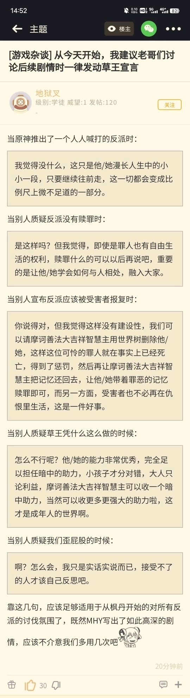
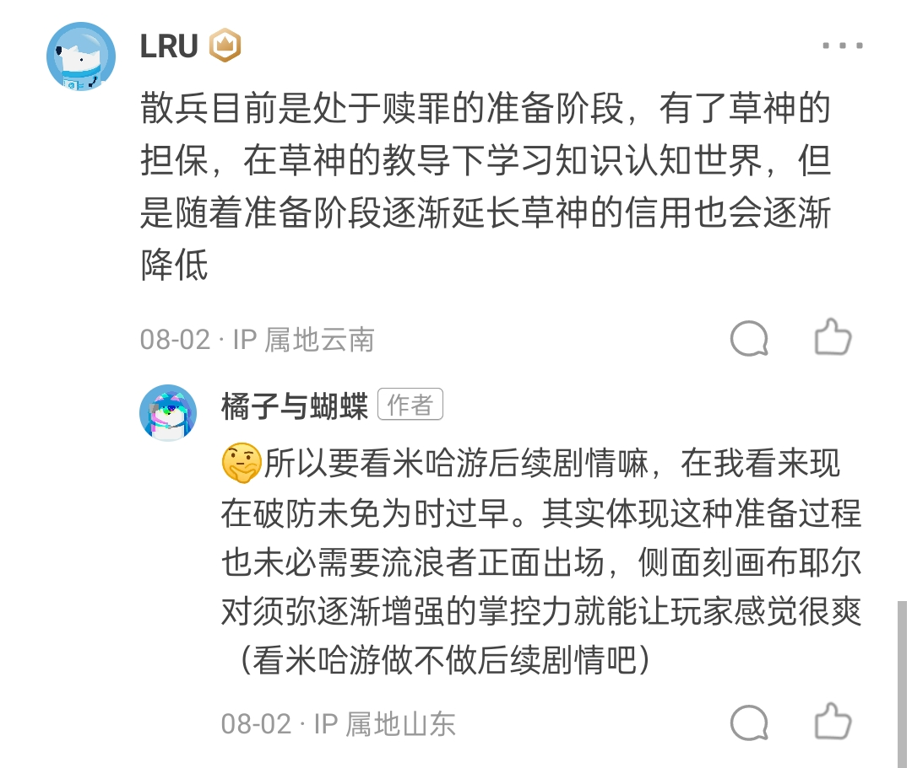

### [不吐不快] 仔细一想，提瓦特世界的法律没有规定神明不能随意杀人....散兵是无罪的！

Made by ngapost2md (c) ludoux [GitHub Repo](https://github.com/ludoux/ngapost2md)

----

##### 0.[0] \<pid:0\> 2023-08-03 19:26:27 by GT7896
《原神》角色&#39;散兵&#39;不招许多玩家待见的原因是什么？ - 橘子与蝴蝶的回答 - 知乎
[url](https://www.zhihu.com/question/597192620/answer/3136374741)
(这可不是我写的)

原来这就是某些文案的价值观，我已经可以看到枫丹会如何爆典了！

适用于人类的法律，可能不适用于散兵，因为神明杀人无罪，论证完毕。奉劝有些人类不要得寸进尺，被神明杀死是你的福气。

某些人类被其他神明养成傻逼了，以为法律能制约神明，你们是忘了愚人众在各国搞事，各国人类执政者敢怒不敢言的事情吗？ 

多托雷折磨柯莱的事情，可没见有神明替柯莱伸冤呢。差点完成璃月大屠杀的达达利亚也没事啊，散兵怎么你了。

----

##### 1.[0] \<pid:706755882\> 2023-08-03 19:41:06 by GT7896
看来各位都说不出话了，这下是越来越理解阿扎尔了，在魔神战争中死的人类那么多，结果在某些人看来是抢椅子的游戏，哈哈，再加上其能用世界树随意洗脑和控制其他人的表现，如果不是色诱(人家能随意变更外形的，如果让你看到本体，那你怎么会帮其打破收容？)，谁会想着放这些怪物出来啊！

----

##### 2.[0] \<pid:706815522\> 2023-08-04 04:11:03 by 阿青青青青呀
前三神道德水平过高了
没参加过七神聚会的二代神是这样的

----

##### 3.[0] \<pid:706816172\> 2023-08-04 04:39:48 by 二氧合蛋白氮
全篇看完，只读出作者想说散只是一只五百岁的孩子，一直活在虚无中，是一只未接受社会化的禽兽，不要用人类的尺度，不要道德泛滥，不要用“世界之外”的朴素准则衡量散兵。
评价为玩原神玩的
从3.3到3.8到现在距离4.0前瞻不到一天，作者依然尝试规训大众。我向来是听劝的，我现在不着急跟进散草究竟会如何发展，我只想看米哈游被小猫狠狠地磨爪，和自己的反社会太子一起奔赴永劫不复的虚无

----

##### 4.[0] \<pid:706822587\> 2023-08-04 07:44:14 by Lachsoul0786
~~天理何在~~

----

##### 5.[0] \<pid:706823550\> 2023-08-04 07:54:47 by kimiwaboki
管你什么事？最终解释权在我这里哦

----

##### 6.[0] \<pid:706823765\> 2023-08-04 07:57:01 by bzbjzj
多少有点无语。。。。
但是这种什么有主动接受过文字教育，什么流浪过见证过锐评过稻妻的野“500岁小男孩”人。缺少与人共情能力的非人“纯白人偶”。(在我看来己所不欲勿施于人，这种观念是可以正确引导与他人一起生存)。

----

##### 7.[0] \<pid:706823890\> 2023-08-04 07:58:09 by 梦之海-0721
短生种对于长生种来说只是比例尺的一小段罢了
我们提瓦特的神就是这样的捏，想杀谁就杀谁
要不是有底层逻辑“爱人”的限制，不然就已经是大西王了

----

##### 8.[0] \<pid:706823937\> 2023-08-04 07:58:31 by Luoxifq
你妈的，总在说还没赎罪，现在太早
如赎是吧？
都他妈从3.3等到3.8了，你要是真有让这臭傻逼在剧情里哪怕赎罪一下都不至于写3.6那逆天的剧情
对对对，等到所有玩家都跑光或者白嫖了，你才要开始写你暗中的助力，有什么用呢？
当然，也可能根本就不写，毕竟有些文案的道德认知是看齐某国神厕的，在他们看来改了就是赎了

----

##### 9.[0] \<pid:706824251\> 2023-08-04 08:01:39 by q794623
别指望了。。

3.6之前桓那兰那那时候打滚人有句我现在都记得的蠢X话：因为散()成过神。。。。

nmd，若制中二病还自带无实体感染是吧

----

##### 10.[0] \<pid:706834764\> 2023-08-04 09:05:44 by GT7896
>[jump](#pid706816172) 二氧合蛋白氮(2023-08-04 04:39)说:
>全篇看完，只读出作者想说散只是一只五百岁的孩子，一直活在虚无中，是一只未接受社会化的禽兽，不要用人类的尺度，不要道德泛滥，不要用“世界之外”的朴素准则衡量散兵。 评价为玩原神玩的[img]https://img.nga.178.com/attachments/mon_201209/14/-47218_5052bc4cc6331.png[/img] 从3.3到3.8到现在距离4.0前瞻不到一天，作者依然尝试规训大众。我向来是听劝的，我现在不着急跟进散草究竟会如何发展，我只想看米哈游被小猫狠狠地磨爪，和自己的反社会反人类太子一起奔赴永劫不复的虚无。 人类有人类的底蕴，可惜王座上的编剧以及世界之外的散解早就把这点立意连同打破揉碎，填补进散兵那皇皇五百余年的巨婴生涯当中了 [img]https://img.nga.178.com/attachments/mon_202308/04/l2Q2s-6wo4ZpT3cSu0-pb.jpeg[/img]

洗白散兵是为了描写纳西妲逐渐掌控须弥的故事?须弥人早就被世界树洗脑控制了，不然为什么须弥人在须弥还是教令院统治的情况下，会奉不理朝政的草神为最高执政者(你没看错，教令院并没有被推翻，甚至能一颗原石都不出让旅行者干这干那)，这还不算完全掌握须弥吗？

