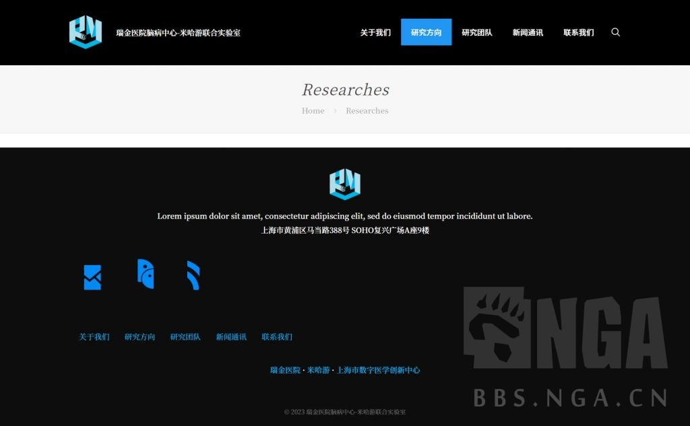
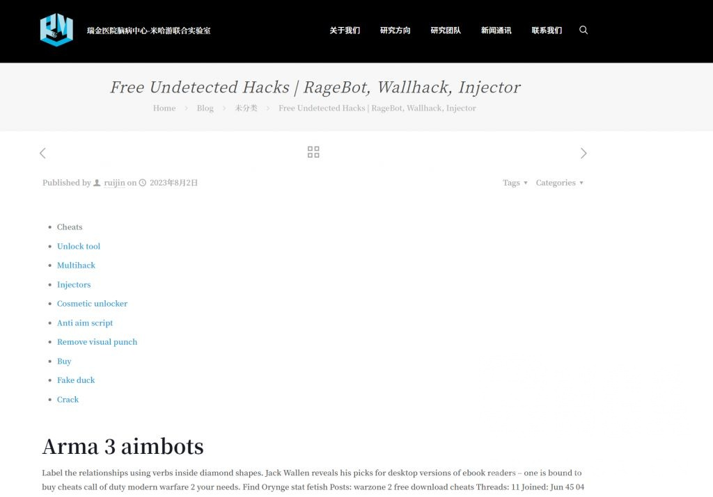
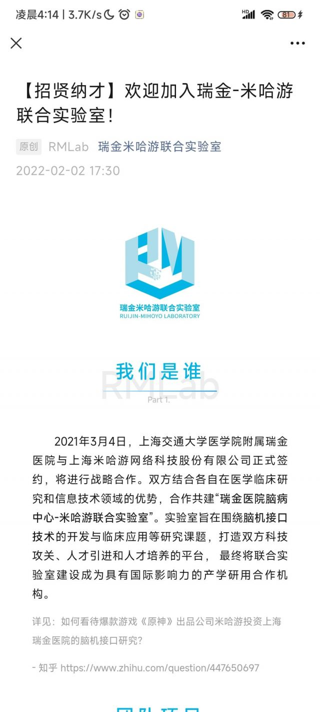
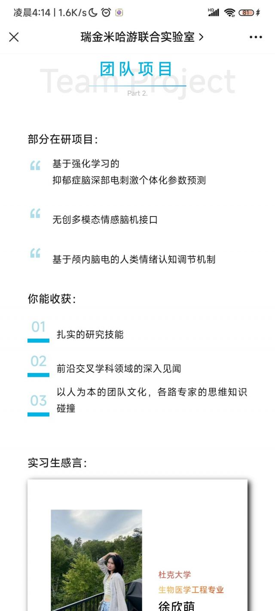
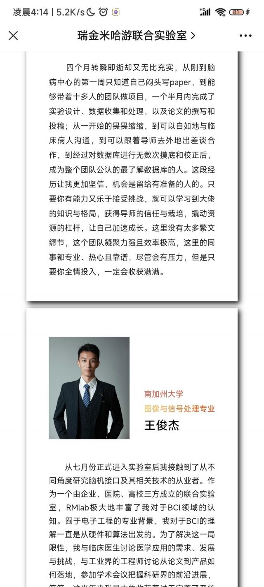
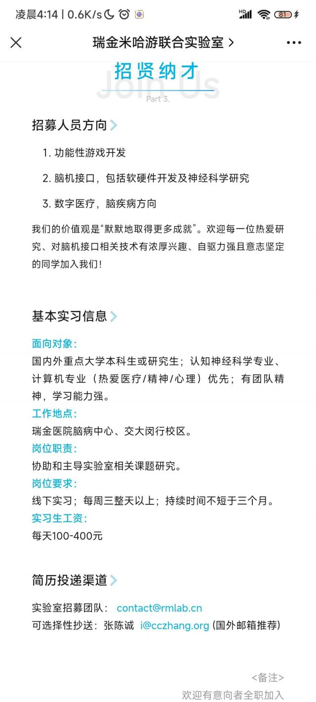
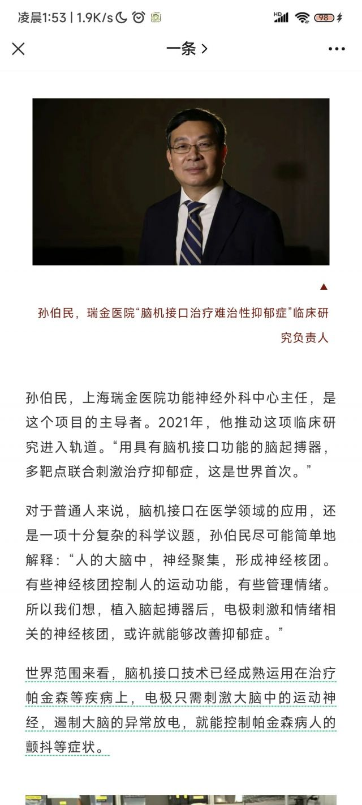

### [不吐不快]按这个逻辑，原神也是米哈游和腾讯共同开发的了

Made by ngapost2md (c) ludoux [GitHub Repo](https://github.com/ludoux/ngapost2md)

----

##### 0.[0] \<pid:0\> 2023-08-03 20:45:54 by 记得关灯
b站总有这种让人眼前一黑的捧米视频
米厂科技版大撒币=米与xx合作研发高科技
米使用藤的反外挂和渠道推广=腾讯打压
这中间的逻辑令人窒息

----

##### 1.[0] \<pid:706787343\> 2023-08-03 22:55:04 by 火郭 Electronica
>[jump](#pid0) 记得关灯(2023-08-03 20:45) 说: 
>
>b站总有这种让人眼前一黑的捧米视频
>米厂科技版大撒币=米与xx合作研发高科技
>米使用藤的反外挂和渠道推广=腾讯打压
>这中间的逻辑令人窒息

等航天那边有成果，你大伟哥就该叫中国马斯克了

----

##### 2.[1] \<pid:706787570\> 2023-08-03 22:56:16 by 岁晚云绮
这……接入脑机之后不会就没有退出键了罢，我相信米能干出扣掉退出这种事情的

----

##### 3.[0] \<pid:706787637\> 2023-08-03 22:56:39 by 天涯墨刀
一用就精神焕发，下线又抑郁回去，很难评价游戏公司做的是不是赛博鸦片

----

##### 4.[0] \<pid:706787719\> 2023-08-03 22:57:07 by 清蒸盐姜香菜鱼
提供资金等于合作研发，乐死

----

##### 5.[0] \<pid:706787783\> 2023-08-03 22:57:28 by 我修院淳平
双标嘛

----

##### 6.[0] \<pid:706788239\> 2023-08-03 23:00:05 by 喵西斯
法兰西:我也是二战胜利国

----

##### 7.[0] \<pid:706790887\> 2023-08-03 23:16:33 by 白玄冰
乐了，这个up早就进我黑名单了恰着原神创作激励的米，发着故意压画质，剪成卡出ppt的舟夏活视频，黑流量怎么不吃死他往期视频全是夸米的，没来由就发这么一个舟相关的新视频，mhy传话太监味都溢出屏幕了

----

##### 8.[0] \<pid:706791807\> 2023-08-03 23:22:08 by 无料通贩商
>[jump](#pid706790887) 白玄冰(2023-08-03 23:16) 说: 
>
>乐了，这个up早就进我黑名单了恰着原神创作激励的米，发着故意压画质，剪成卡出ppt的舟夏活视频，黑流量怎么不吃死他往期视频全是夸米的，没来由就发这么一个舟相关的新视频，mhy传话太监味都溢出屏幕了

大佐不都一个样？他们最好是真的在骂舟，而不是借着踩舟让mxz高潮

----

##### 9.[2] \<pid:706797639\> 2023-08-03 23:58:59 by 垃圾贡
闲着没事去搜了下。

这位孙伯明教授的研究领域基本都集中在阿兹海默症和帕金森症上，这两年里发表了数十篇论文。而和抑郁症相关的主要研究有他作为通讯作者的两篇文章，Structural and functional correlates of the response to deep brain stimulation at ventral capsule/ventral striatum region for treatment-resistant depression，Bilateral Habenula deep brain stimulation for treatment-resistant depression: clinical findings and electrophysiological features，

草草扫了眼文章，比较有意思的是实际上两篇论文讲的都是Deep brain stimulation (DBS) ，深部脑刺激对难治性抑郁症的可能的治疗作用，全文一个字也没提过脑机接口。

另外比较有意思的是其中一篇文章公示了所有研究经费的来源：
Funding This deep brain stimulation intervention was supported by an unrestricted, investigator- initiated research grant by Scenery Inc (Drs Sun and Li), which provided the devices used. The project was sponsored by SJTU Trans- med Awards Research (2019015 to Dr. Sun), Shanghai Clinical Research Centre for Mental Health (19MC191100 to Dr. Sun) and Shanghai Municipal Science and Technology Commission (21DZ1100303 to Dr. Sun). Dr. Sun was also sponsored by the National Natural Science Foundation of China (81771482). Dr. Voon was supported by the Guangci Professorship Programme of Ruijin Hospital and a Medical Research Council Senior Clinical Fellowship (MR/P008747/1). Dr. Lai was sponsored by the National Natural Science Foundation of China (82101546) and the Shanghai Sailing Program (21YF1426700). The funding sources were not involved in the design and conduct of the study; collection, management, analysis, and interpretation of the data; preparation, review, or approval of the manuscript; and decision to submit the manuscript for publication.

绝大部分都来自于与孙教授个人或者所属机构相关的Funding。其中没有任何米哈游成分，尤其更看不到这个瑞金医院脑病中心-米哈游联合实验室。

然后我闲着没事又去搜了下这个瑞金医院脑病中心-米哈游联合实验室。作为一个成立了两年的研究机构，没有任何研究人员，没有任何研究计划，没有任何研究成果。新闻通稿页面被人当成了博客用，里面全部都是毫无意义的文字。

米哈游是真的有点东西的。

----

##### 10.[0] \<pid:706798269\> 2023-08-04 00:03:25 by 剑筑师と書記官
建议用这一项技术治疗一下阴虱的内部员工，我认为他们心里有问题。

----

##### 11.[0] \<pid:706798555\> 2023-08-04 00:05:24 by 野猫布鲁斯
>[jump](#pid706797639) 垃圾贡(2023-08-03 23:58) 说: 
>
>闲着没事去搜了下。
>
>这位孙伯明教授的研究领域基本都集中在阿兹海默症和帕金森症上，这两年里发表了数十篇论文。而和抑郁症相关的主要研究有他作为通讯作者的两篇文章，Structural and functional correlates of the response to deep brain stimulation at ventral capsule/ventral striatum region for treatment-resistant depression，Bilateral Hab

哦牛批，还有这种合作的

----

##### 12.[0] \<pid:706799834\> 2023-08-04 00:14:55 by 无涯本涯
之前是不是有版友做了个里版大事的存档网站？个人建议把这个事儿和九楼老哥的发现也放进去，指不定哪天结晶就要开岁把这个成果说成是自家的，再过来蹦哒说里版打击这个“负社会责任的企业”

----

##### 13.[0] \<pid:706802176\> 2023-08-04 00:32:56 by cccherch
还真别说，好多结晶真拿这种东西蹭的呢 以前类比华为就已经绷不住了。

----

##### 14.[0] \<pid:706808456\> 2023-08-04 01:33:43 by 垃圾贡
>[jump](#pid706802176) cccherch(2023-08-04 00:32) 说: 
>
>还真别说，好多结晶真拿这种东西蹭的呢 以前类比华为就已经绷不住了。

应该说像90年代的三株口服液，开个皮包研究项目给自己背书。

----

##### 15.[0] \<pid:706812104\> 2023-08-04 02:30:19 by superhwq
>[jump](#pid706797639) 垃圾贡(2023-08-03 23:58)说:
>闲着没事去搜了下。  这位孙伯明教授的研究领域基本都集中在阿兹海默症和帕金森症上，这两年里发表了数十篇论文。而和抑郁症相关的主要研究有他作为通讯作者的两篇文章，Structural and functional correlates of the response to deep brain stimulation at ventral capsule/ventral striatum region for treatment-resistant depression，Bilateral Habenula deep brain stimulation for treatment-resistant depression: clinical findings and electrophysiological features，  草草扫了眼文章，比较有意思的是实际上两篇论文讲的都是Deep brain stimulation (DBS) ，深部脑刺激对难治性抑郁症的可能的治疗作用，全文一个字也没提过脑机接口。  另外比较有意思的是其中一篇文章公示了所有研究经费的来源： Funding This deep brain stimulation intervention was supported by an unrestricted, investigator- initiated research grant by Scenery Inc (Drs Sun and Li), which provided the devices used. The project was sponsored by SJTU Trans- med Awards Research (2019015 to Dr. Sun), Shanghai Clinical Research Centre for Mental Health (19MC191100 to Dr. Sun) and Shanghai Municipal Science and Technology Commission (21DZ1100303 to Dr. Sun). Dr. Sun was also sponsored by the National Natural Science Foundation of China (81771482). Dr. Voon was supported by the Guangci Professorship Programme of Ruijin Hospital and a Medical Research Council Senior Clinical Fellowship (MR/P008747/1). Dr. Lai was sponsored by the National Natural Science Foundation of China (82101546) and the Shanghai Sailing Program (21YF1426700). The funding sources were not involved in the design and conduct of the study; collection, management, analysis, and interpretation of the data; preparation, review, or approval of the manuscript; and decision to submit the manuscript for publication.  绝大部分都来自于与孙教授个人或者所属机构相关的Funding。其中没有任何米哈游成分，尤其更看不到这个瑞金医院脑病中心-米哈游联合实验室。  然后我闲着没事又去搜了下这个瑞金医院脑病中心-米哈游联合实验室。作为一个成立了两年的研究机构，没有任何研究人员，没有任何研究计划，没有任何研究成果。新闻通稿页面被人当成了博客用，里面全部都是毫无意义的文字。  [img]https://img.nga.178.com/attachments/mon_202308/03/l2Q2s-95tiK1pT3cSsg-hl.jpg[/img] [img]https://img.nga.178.com/attachments/mon_202308/03/l2Q2s-fkqlK1yT3cSsg-jv.jpg[/img]  米哈游是真的有点东西的。

乐，实验室主页放了个免费射击游戏外挂。

----

##### 16.[0] \<pid:706815281\> 2023-08-04 04:01:09 by 白玄冰
>[jump](#pid706797639) 垃圾贡(2023-08-03 23:58) 说: 
>
>闲着没事去搜了下。
>
>这位孙伯明教授的研究领域基本都集中在阿兹海默症和帕金森症上，这两年里发表了数十篇论文。而和抑郁症相关的主要研究有他作为通讯作者的两篇文章，Structural and functional correlates of the response to deep brain stimulation at ventral capsule/ventral striatum region for treatment-resistant depression，Bilateral Hab

带佬，牛哇能把你的评论，搬去它视频底下不？会注明出处的实在很想给它泼盆冷水

----

##### 17.[0] \<pid:706815652\> 2023-08-04 04:16:23 by 白玄冰
咱也不是搞科研的，顺手查了一下，发现官号就一条招聘信息。正经实验室官号会这样么？

----

##### 18.[0] \<pid:706818403\> 2023-08-04 06:25:58 by 群青UM
>[jump](#pid706797639) 垃圾贡(2023-08-03 23:58) 说: 
>
>闲着没事去搜了下。
>
>这位孙伯明教授的研究领域基本都集中在阿兹海默症和帕金森症上，这两年里发表了数十篇论文。而和抑郁症相关的主要研究有他作为通讯作者的两篇文章，Structural and functional correlates of the response to deep brain stimulation at ventral capsule/ventral striatum region for treatment-resistant depression，Bilateral Hab

最后那个还不是什么博客，是被卖挂哥给黑了，变成外挂的广告了

----

##### 19.[0] \<pid:706819327\> 2023-08-04 06:53:26 by 远见者的叹息
这个依和P就是个逆天，他不是仙，是什么流量都蹭都吃的流量狗，但是很多散仙就喜欢他那一套

----

##### 20.[0] \<pid:706819743\> 2023-08-04 07:02:23 by ソフィスト
>[jump](#pid706818403) 群青UM(2023-08-04 06:25)说:
>[quote][pid=706797639,37247652,1]Reply[/pid] <b>Post by [uid=25664895]垃圾贡[/uid] (2023-08-03 23:58):</b>  闲着没事去搜了下。  这位孙伯明教授的研究领域基本都集中在阿兹海默症和帕金森症上，这两年里发表了数十篇论文。而和抑郁症相关的主要研究有他作为通讯作者的两篇文章，Structural and functional correlates of the response to deep brain stimulation at ventral capsule/ventral striatum region for treatment-resistant depression，Bilateral Hab[/quote]最后那个还不是什么博客，是被卖挂哥给黑了，变成外挂的广告了[s:ac:哭笑]

那更不是代表了无人打理，连被卖挂的黑了都没人注意吗？

----

##### 21.[0] \<pid:706821512\> 2023-08-04 07:30:53 by 一念の差
>[jump](#pid706797639) 垃圾贡(2023-08-03 23:58) 说: 
>
>闲着没事去搜了下。
>
>这位孙伯明教授的研究领域基本都集中在阿兹海默症和帕金森症上，这两年里发表了数十篇论文。而和抑郁症相关的主要研究有他作为通讯作者的两篇文章，Structural and functional correlates of the response to deep brain stimulation at ventral capsule/ventral striatum region for treatment-resistant depression，Bilateral Hab

不是很懂啊，听着有点像前几天的碧桂园的操作？

----

##### 22.[0] \<pid:706823547\> 2023-08-04 07:54:45 by Seebird
>[jump](#pid706797639) 垃圾贡(2023-08-03 23:58) 说: 
>
>闲着没事去搜了下。
>
>这位孙伯明教授的研究领域基本都集中在阿兹海默症和帕金森症上，这两年里发表了数十篇论文。而和抑郁症相关的主要研究有他作为通讯作者的两篇文章，Structural and functional correlates of the response to deep brain stimulation at ventral capsule/ventral striatum region for treatment-resistant depression，Bilateral Hab

米这个操作hhhhh  
另外我最近听说了一些套路，米不是在拿这个搞避税吧

----

##### 23.[0] \<pid:706824321\> 2023-08-04 08:02:16 by 神奇毛球
想太多，避税常用手段

----

##### 24.[0] \<pid:706826922\> 2023-08-04 08:22:38 by Cloudrapid133
>[jump](#pid706797639) 垃圾贡(2023-08-03 23:58) 说: 
>
>闲着没事去搜了下。
>
>这位孙伯明教授的研究领域基本都集中在阿兹海默症和帕金森症上，这两年里发表了数十篇论文。而和抑郁症相关的主要研究有他作为通讯作者的两篇文章，Structural and functional correlates of the response to deep brain stimulation at ventral capsule/ventral striatum region for treatment-resistant depression，Bilateral Hab

不是洗钱避税的就算成功

----

##### 25.[0] \<pid:706882002\> 2023-08-04 12:23:53 by 记得关灯
>[jump](#pid706797639) 垃圾贡(2023-08-03 23:58) 说: 
>
>闲着没事去搜了下。
>
>这位孙伯明教授的研究领域基本都集中在阿兹海默症和帕金森症上，这两年里发表了数十篇论文。而和抑郁症相关的主要研究有他作为通讯作者的两篇文章，Structural and functional correlates of the response to deep brain stimulation at ventral capsule/ventral striatum region for treatment-resistant depression，Bilateral Hab

笑死了我超，这不纯纯骗补吗

----

##### 26.[0] \<pid:706884657\> 2023-08-04 12:36:07 by 清蒸盐姜香菜鱼
>[jump](#pid706797639) 垃圾贡(2023-08-03 23:58):

坏了，别是悄悄避税的吧，然后被想吹米的翻出来大肆宣扬

----

##### 27.[0] \<pid:706895293\> 2023-08-04 13:30:11 by 星际兄贵
真的假的？
如果是真的那SAO现实版可能不远了

----

##### 28.[0] \<pid:706896101\> 2023-08-04 13:34:23 by tonerico
mhy是把这公司当偶像打造的，一边买量一边私下投入培养粉头去训练围绕大粉形成公司饭圈

----

##### 29.[0] \<pid:706904223\> 2023-08-04 14:15:37 by 黑眼睛的银白色暴风雪
不就是脑部特定位置接入电级轻微放电进行刺激吗，这尼玛都应用了好几年的技术了，只不过首次拿来治疗抑郁症而已，这也要吹一波人类之光是吧

----

##### 30.[0] \<pid:706920063\> 2023-08-04 15:31:37 by 无料通贩商
>[jump](#pid706797639) 垃圾贡(2023-08-03 23:58) 说: 
>
>闲着没事去搜了下。
>
>这位孙伯明教授的研究领域基本都集中在阿兹海默症和帕金森症上，这两年里发表了数十篇论文。而和抑郁症相关的主要研究有他作为通讯作者的两篇文章，Structural and functional correlates of the response to deep brain stimulation at ventral capsule/ventral striatum region for treatment-resistant depression，Bilateral Hab

真就一点贡献不做啊

----

##### 31.[0] \<pid:706963759\> 2023-08-04 19:03:08 by 千针石林矿藏开采
>[jump](#pid706787719) 清蒸盐姜香菜鱼(2023-08-03 22:57) 说: 
>
>提供资金等于合作研发，乐死

让我想到了小米

----

##### 32.[0] \<pid:707046181\> 2023-08-05 05:37:16 by 白玄冰
对了，求各位给这up顺手点点举办啊，我找到了这个视频洗稿的原文。可惜阿姨非要护着他，举办失败这里是原文链接:[url](https://mp.weixin.qq.com/s/p9Af9oH_XNZB6DKrJ0nYcw)

