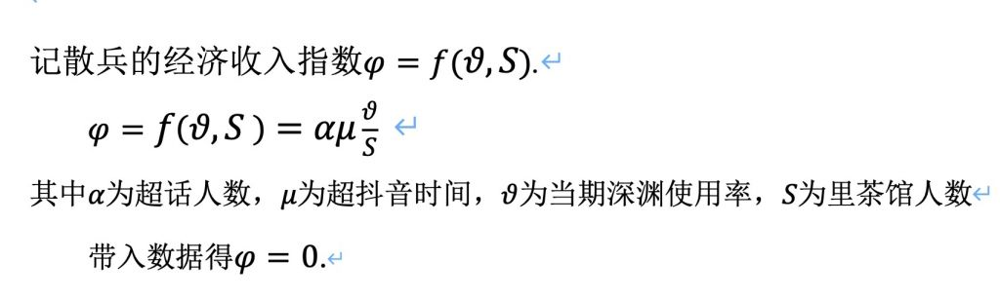

### [热点事件]发明了一个计算角色经济指数的公式

Made by ngapost2md (c) ludoux [GitHub Repo](https://github.com/ludoux/ngapost2md)

----

##### 0.[6] \<pid:0\> 2023-08-03 22:40:17 by Thl111

----

##### 1.[0] \<pid:706785345\> 2023-08-03 22:42:27 by 一只电子龙
挺专业但如何计算理查人数，按流水楼算?

----

##### 2.[0] \<pid:706785418\> 2023-08-03 22:42:53 by 岁晚云绮
好活！

----

##### 4.[0] \<pid:706785545\> 2023-08-03 22:43:46 by yoooooov
呃，总感觉有点怪

----

##### 5.[7] \<pid:706785582\> 2023-08-03 22:44:00 by AkariYu3310
什麼鬼 狗屁不通
你就是想說0吧

----

##### 6.[6] \<pid:706785603\> 2023-08-03 22:44:08 by Teddydesu
>[jump](#pid706785345) 一只电子龙(2023-08-03 22:42) 说: 
>
>挺专业但如何计算理查人数，按流水楼算?

不如直接看nga注册人数算了
反正在学长仙u眼中nga=里茶

----

##### 7.[0] \<pid:706785728\> 2023-08-03 22:44:57 by 吃瓜专用_2
欺负我们赔宝0h是吧领带美元

----

##### 8.[0] \<pid:706785739\> 2023-08-03 22:45:01 by 大碗番茄炒鸡拌饭
>[jump](#pid706785603) Teddydesu(2023-08-03 22:44) 说: 
>
>不如直接看nga注册人数算了
>反正在学长仙u眼中nga=里茶

nga迫害mhy的恶名已经名扬海外了

----

##### 9.[0] \<pid:706785772\> 2023-08-03 22:45:13 by 丢人杯
>[jump](#pid706785345) 一只电子龙(2023-08-03 22:42) 说: 
>
>挺专业但如何计算理查人数，按流水楼算?

叉老师的1.5w长文点赞数——2854，或者3000
四舍五入嘛

----

##### 10.[0] \<pid:706785857\> 2023-08-03 22:45:45 by l秦珺媛
你这个μ放在这里，不如再大胆点多乘点东西
反正最后都是<b>0</b>的

----

##### 12.[0] \<pid:706788547\> 2023-08-03 23:01:58 by 还有一把
你这还得减去宣发成本和带来的负面影响，都赔钱货总不能是个非负数吧

----

##### 13.[0] \<pid:706790686\> 2023-08-03 23:15:17 by Lucifer1992
>[jump](#pid706785345) 一只电子龙(2023-08-03 22:42) 说: 
>
>挺专业但如何计算理查人数，按流水楼算?

有什么区别呢，常值函数带什么变量出来都一样，0，zero，零，挑一个吧

