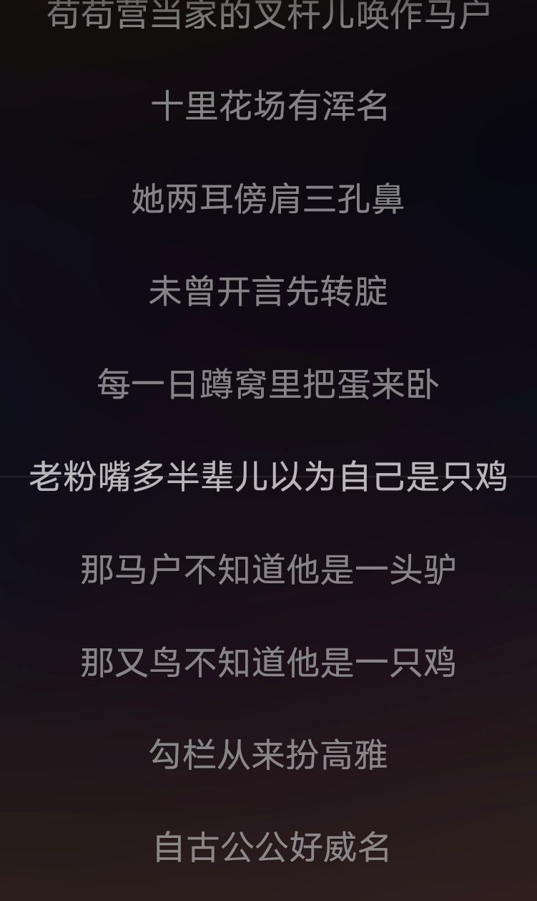
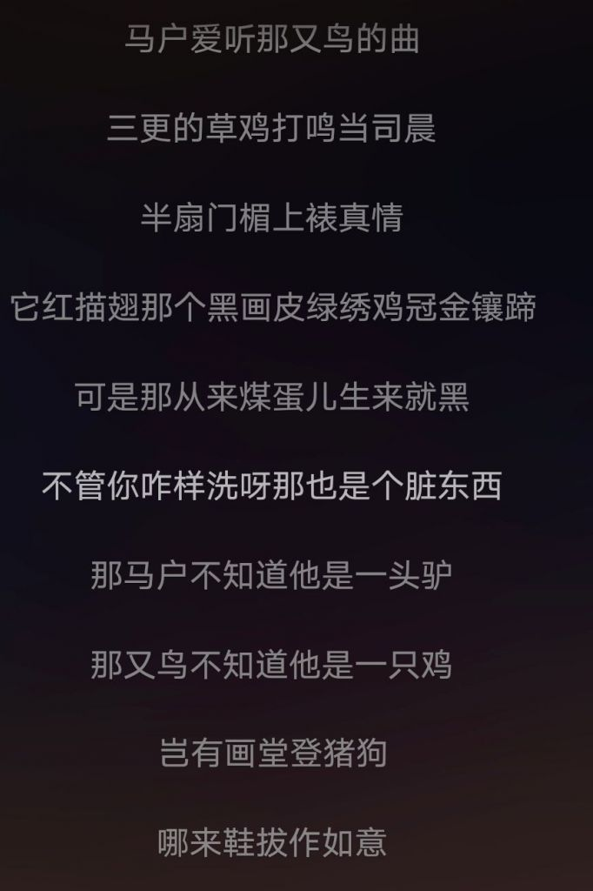

### [不吐不快][不吐不快]你们说为啥编剧会这么菜呢

Made by ngapost2md (c) ludoux [GitHub Repo](https://github.com/ludoux/ngapost2md)

----

##### 0.[1] \<pid:0\> 2023-08-03 23:17:30 by canadaghost
还是她们有啥不得已的苦衷？任谁来写剧情只要是真的认真思考 然后站在观众角度共情下都不至于写的这么烂吧  这么大个公司 编剧难道不是团队制作吗 为什么有些剧情能写的这么弱智

----

##### 1.[20] \<pid:706791113\> 2023-08-03 23:18:02 by 今锁朱楼
首先，是他们。
不要遗忘我们的神父和猛干哥。

编辑：怎么这么快就进来了。

----

##### 3.[7] \<pid:706791257\> 2023-08-03 23:18:52 by sagaho
文案组都是猛干这种废物领导在，能好到哪里

----

##### 4.[0] \<pid:706791322\> 2023-08-03 23:19:16 by 不苦的无糖红茶
《罗刹海市》

----

##### 5.[0] \<pid:706791564\> 2023-08-03 23:20:42 by bobocc9000
来人，上大干老师语录

----

##### 6.[0] \<pid:706791632\> 2023-08-03 23:21:05 by roseta
将熊熊一窝

----

##### 7.[0] \<pid:706791833\> 2023-08-03 23:22:16 by samiyako
人无廉耻 百事可为

----

##### 8.[0] \<pid:706791921\> 2023-08-03 23:22:45 by Cvjutfvkkk
也就三点：愚蠢、自大、缺乏敬畏心
这三条互为充分必要条件，可以互相推导

----

##### 9.[0] \<pid:706792218\> 2023-08-03 23:24:42 by 我修院淳平

----

##### 10.[0] \<pid:706792685\> 2023-08-03 23:27:30 by Auroramae
之前有老哥搬运过，猛干哥入职前文案水平不错的，翻译过很硬核的东西，是什么让他变成如今的样子，m吗？查询文案内部情况

----

##### 11.[0] \<pid:706795098\> 2023-08-03 23:42:26 by 折凳猫
原神是一个大版本有一个完整的剧本，还是说只是先写好主线的剧本，之后再慢慢填补呢？总觉得主线结束之后，剩下的支线发展的路子都莫名其妙的，要说拓展了世界观，也说不上

----

##### 12.[0] \<pid:706796281\> 2023-08-03 23:49:58 by 溯洄寻英

zsbd

----

##### 13.[1] \<pid:706796333\> 2023-08-03 23:50:22 by 无涯本涯
这是被搬进里版的吗
那我就直接说了，因为米哈游从根里就已经烂了，你以为他们是在和你共情，实际上米哈游有自己的癖好，你只是被捎带上了而已。
所谓不得已的苦衷，就是三巨头一想到自己已经是个大富豪了却还要降低身价讨好玩家，越想越不爽，今天我米哈游就要改变你们所有人的xp！

----

##### 14.[0] \<pid:706796759\> 2023-08-03 23:53:22 by 星际兄贵
>[jump](#pid706792685) Auroramae(2023-08-03 23:27)说:
>之前有老哥搬运过，猛干哥入职前文案水平不错的，翻译过很硬核的东西，是什么让他变成如今的样子，m吗？查询文案内部情况

猛干哥早年是翻译西幻相关书籍的，称之为大佬也丝毫不为过
mhy这家企业的文化环境肯定有问题

----

##### 15.[0] \<pid:706796944\> 2023-08-03 23:54:32 by 无涯本涯
>[jump](#pid706795098) 折凳猫(2023-08-03 23:42) 说: 
>
>原神是一个大版本有一个完整的剧本，还是说只是先写好主线的剧本，之后再慢慢填补呢？总觉得主线结束之后，剩下的支线发展的路子都莫名其妙的，要说拓展了世界观，也说不上

足迹定好了大纲，后来写足迹的大佬走了，后来者新文案上任三把火把足迹烧没了，现在应该是处于一个“当一个自由而不受约束的编剧，想到哪儿写到哪儿实在是太快乐了呼哈哈哈”的状态

----

##### 16.[0] \<pid:706797290\> 2023-08-03 23:56:38 by 雷军单推人
菜吗？我觉得一点都不菜啊。

人家的写作目的就是为了让广大玩家吵起来，让他们看到乐子。
他们很成功的实现了目标，不是吗？

----

##### 17.[0] \<pid:706797458\> 2023-08-03 23:57:46 by 萨萨萨萨0918
不如说好编剧难找，电影电视剧不也是答辩满天飞……再加上这吊公司文化，把所有锅都甩在编剧身上显然是不客观的…编剧恶心人也就是藏藏私货，卖弄一下生僻字，水点车轱辘话，大方向显然是更大的cs拍板的

----

##### 18.[0] \<pid:706797495\> 2023-08-03 23:58:03 by 白泽老中医啊啊啊啊
你有能力，并且靠着你的能力进的公司，但是进公司之后发现你努力工作拿到的工资实际上随便摸摸鱼也能拿到，根本没人管你你可以随便写自己喜欢的东西，就算是一坨&amp;#128169;也能被一些人吹上天，把你捧的高高在上，出了事情也不会把你怎么样，，虽然公司赚的米越来越少但是关你屁事

----

##### 19.[1] \<pid:706797810\> 2023-08-04 00:00:06 by 风之碧海之翠
蒸馍爱上了只因鸡爱上了又鸟鸡

----

##### 20.[0] \<pid:706798165\> 2023-08-04 00:02:43 by hx0539
首先，pg都不正的就别说他们是编剧了，顶多算个文案高人气的ZHLBC当背景板给我们文案最爱的小男孩，尤其是那几个风男狂垫
也就你们非小男孩厨才会觉得重要吧就皇就皇！
什么？反派进池？就进就进，让女角色说两句好话垫一下都能进  
文案那是没有水平吗，nonono，是全身心扑在他们内部喜欢的角色上了呗

----

##### 21.[1] \<pid:706798590\> 2023-08-04 00:05:44 by a阿洛洛洛
明明打赢决赛圈的是神父，我不许你们忘记猛干哥！

----

##### 22.[0] \<pid:706798999\> 2023-08-04 00:08:41 by 折凳猫
>[jump](#pid706796944) 无涯本涯(2023-08-03 23:54) 说: 
>
>足迹定好了大纲，后来写足迹的大佬走了，后来者新文案上任三把火把足迹烧没了，现在应该是处于一个“当一个自由而不受约束的编剧，想到哪儿写到哪儿实在是太快乐了呼哈哈哈”的状态

但是按道理，一个大版本的故事也应该有个大纲？总不能每个小版本现写下个小版本的故事吧？我看配音这些都是早早就录好的呀

----

##### 23.[0] \<pid:706799706\> 2023-08-04 00:13:59 by 白浪梅
这些个文案真的是，能看出来对部分角色很喜欢很上心，然后写成惊世烂活，不上心的更不必说了，价值观和思考方式也与常人不一样，这大半年毁角色的表现是突出个不堪入目

----

##### 25.[0] \<pid:706799927\> 2023-08-04 00:15:37 by 可恶，长个锤子
草，不知道为什么跑错楼了编辑

----

##### 26.[0] \<pid:706800014\> 2023-08-04 00:16:09 by 十夜铃沄花
国内水平高的写手大多是网文写手，收入摆在那进公司都难说更不会进二游厂，而国内在二次元这块尤其国轻在经过几次打压和错误策略后已经基本半死不活了，所以做二游想找到好编剧就非常需要选人的那位有很好的判断能力
其实缺好编剧这事不仅是游戏，在影视圈也同样存在这个现象，只不过那边还有网文可以形成产业链，直接改编网文小说的越来越多

在本就很难找的情况下，像MHY这种一天到晚喊自己是宅男实际对二次元圈子根本不懂的，找来的编剧就只能是“有一定文学水平的圈外人”而不是“能够创作出好的二游剧本”的编剧，真找个二游编剧去MHY那些制作组里，我估计出不了几天就得脑溢血
所以米家游戏的剧本永远充斥着一股现充、文青、以及莫名的高高在上的味道，所以MHY成了二游厂里最不尊重角色的那个，因为他们找来的根本不是这个圈子里的人，那就必定天生带着圈外人对二次元圈的偏见，即便是往这个方向做也只会变成“我是放低身位做出来给你们看的”，甚至出现猛干鸽那种乐子人

说的直白一点，以MHY这种运营模式，上到网文作者压根看不上它，下到纯二次元圈子的要么不想来要么来不了，最后只能找来在哪都混不好唯独吹水平很能吹的编剧。当然这一点正好和刘伟他们的作风不谋而合，属于是门当户对了

----

##### 27.[0] \<pid:706800808\> 2023-08-04 00:22:34 by 无涯本涯
>[jump](#pid706798999) 折凳猫(2023-08-04 00:08) 说: 
>
>但是按道理，一个大版本的故事也应该有个大纲？总不能每个小版本现写下个小版本的故事吧？我看配音这些都是早早就录好的呀

浅翻了下你的回复，冒昧劝一句，老哥你要是真萌萌人就别泡在里版了；如果你是披皮过来装误入的，那你也别废那个功夫了，在这儿洗地又挣不到钱  
本想用主线人物塑造和主线结束后的人物塑造来向你解释你的问题，不过看你的回复似乎并不认同的样子

----

##### 28.[0] \<pid:706801895\> 2023-08-04 00:30:42 by 普鲁士蓝蓝蓝
编剧这东西不是那么容易的，是需要一点水平和天赋的
打个比方潭友那么多真写出1.5万的不也就叉哥那一个？
显而易见米家编剧绝大多数就是个下雨了知道往家跑的水平。。。

----

##### 29.[0] \<pid:706802211\> 2023-08-04 00:33:09 by 折凳猫
>[jump](#pid706800808) 无涯本涯(2023-08-04 00:22) 说: 
>
>浅翻了下你的回复，冒昧劝一句，老哥你要是真萌萌人就别泡在里版了；如果你是披皮过来装误入的，那你也别废那个功夫了，在这儿洗地又挣不到钱  
>本想用主线人物塑造和主线结束后的人物塑造来向你解释你的问题，不过看你的回复似乎并不认同的样子

我是听说这里有大瓜就来看了，这个猛干的行为实在无法理解，怎么会有人这么看不上自己的衣食父母呢？而且我是真的很好奇，原神的大纲是怎么写的，比如稻妻线神里绫人前期为什么一点伏笔都没有，但是绫华故事明明有提到？一个角色的设计应该要花很长的时间吧，怎么会没想到要怎么安插到故事里呢？在一个就是宵宫和公子的剧情，这个剧情的设置是为了什么？

----

##### 30.[0] \<pid:706803798\> 2023-08-04 00:46:04 by 苍音玱琅
>[jump](#pid706802211) 折凳猫(2023-08-04 00:33) 说: 
>
>我是听说这里有大瓜就来看了，这个猛干的行为实在无法理解，怎么会有人这么看不上自己的衣食父母呢？而且我是真的很好奇，原神的大纲是怎么写的，比如稻妻线神里绫人前期为什么一点伏笔都没有，但是绫华故事明明有提到？一个角色的设计应该要花很长的时间吧，怎么会没想到要怎么安插到故事里呢？在一个就是宵宫和公子的剧情，这个剧情的设置是为了什么？

米哈游看不上衣食父母还要更多的理由吗，问就是飘了

----

##### 31.[0] \<pid:706804206\> 2023-08-04 00:49:45 by 折凳猫
>[jump](#pid706800808) 无涯本涯(2023-08-04 00:22) 说: 
>
>浅翻了下你的回复，冒昧劝一句，老哥你要是真萌萌人就别泡在里版了；如果你是披皮过来装误入的，那你也别废那个功夫了，在这儿洗地又挣不到钱  
>本想用主线人物塑造和主线结束后的人物塑造来向你解释你的问题，不过看你的回复似乎并不认同的样子

嗯，我觉得我的话看起来是给这个破剧情找补了，大家骂我也是可以理解，我个人是会习惯性的给剧情找逻辑性，我也会脑补角色为什么会有这样的行动，不然我会觉得我看了半天看了个寂寞......如果剧情毫无逻辑，那这到底是怎么写出来的呢？想到哪写到哪吗？作为一个商业作品，这不应该啊

----

##### 32.[0] \<pid:706804597\> 2023-08-04 00:53:27 by 无涯本涯
>[jump](#pid706802211) 折凳猫(2023-08-04 00:33) 说: 
>
>我是听说这里有大瓜就来看了，这个猛干的行为实在无法理解，怎么会有人这么看不上自己的衣食父母呢？而且我是真的很好奇，原神的大纲是怎么写的，比如稻妻线神里绫人前期为什么一点伏笔都没有，但是绫华故事明明有提到？一个角色的设计应该要花很长的时间吧，怎么会没想到要怎么安插到故事里呢？在一个就是宵宫和公子的剧情，这个剧情的设置是为了什么？

绫人前期有伏笔的，神里家仆说他“枪剑双绝”，神里屋敷里挂着蓝色的水和粉色的鸟两幅画，托马语音有所提及，留言板上也有涉及。
公子和宵宫的剧情看你怎么想了，可以认为是拿去洗公子的，也可以认为是围公子救散兵的，先在这个版本打个铺垫“只要他正在做好事就不是坏人”。对宵宫是百害无一利的，不过那个时候卡池好像已经结束了。
关于你说的米哈游怎么会这么说自己的衣食父母的问题，很简单，<b>因为米哈游是个神经病公司</b>
就这样了，你也别回复我了，这里可不是没出脑的萌萌人的家，你在卡维楼里的那一大堆回复可不像是“只是来吃瓜”的样子

----

##### 33.[0] \<pid:706804643\> 2023-08-04 00:53:54 by 折凳猫
>[jump](#pid706803798) 苍音玱琅(2023-08-04 00:46) 说: 
>
>米哈游看不上衣食父母还要更多的理由吗，问就是飘了

游戏公司也有很多前车之鉴吧，EA，暴雪现在口碑都什么样了。米哈游在国内还有两个强力的对手，现在就开始飘了，头部人物自己没有一点警惕性吗。而且米哈游的公关就打算这么冷处理了，也很不专业啊

----

##### 34.[0] \<pid:706804933\> 2023-08-04 00:56:26 by 苍音玱琅
>[jump](#pid706804643) 折凳猫(2023-08-04 00:53) 说: 
>
>游戏公司也有很多前车之鉴吧，EA，暴雪现在口碑都什么样了。米哈游在国内还有两个强力的对手，现在就开始飘了，头部人物自己没有一点警惕性吗。而且米哈游的公关就打算这么冷处理了，也很不专业啊

放弃助人情节，尊重他人命运。有空去多玩点游戏，别搁米游一头撞死。

----

##### 35.[0] \<pid:706804999\> 2023-08-04 00:56:59 by 无涯本涯
>[jump](#pid706804206) 折凳猫(2023-08-04 00:49) 说: 
>
>嗯，我觉得我的话看起来是给这个破剧情找补了，大家骂我也是可以理解，我个人是会习惯性的给剧情找逻辑性，我也会脑补角色为什么会有这样的行动，不然我会觉得我看了半天看了个寂寞......如果剧情毫无逻辑，那这到底是怎么写出来的呢？想到哪写到哪吗？作为一个商业作品，这不应该啊

对于高层领导：每天躺着挣钱，想写什么写什么，还能上网看玩家疯狂，还有学长自发堵嘴洗地，给毫无逻辑的东西上高度。这份工作简直无比快乐
对于底层员工：反正剧情不署名，写啥样都找不到自己头上，写得用心最后也剩不下多少，还不如摆烂完事儿

----

##### 36.[0] \<pid:706805991\> 2023-08-04 01:06:11 by 折凳猫
>[jump](#pid706804933) 苍音玱琅(2023-08-04 00:56) 说: 
>
>放弃助人情节，尊重他人命运。有空去多玩点游戏消遣，别搁米游一头撞死。  
>你这么上心的一切，他值得吗，烂就是烂了，一切以结果作数，不要抱着不切实际的妄想。  
>也是我半夜睡不着还有闲心唠叨两句，你头铁对我很重要吗。
>傻逼游戏公司多他一家不多，少他一家也不少。今年新游这么多今天还有bg3呢，se这几年都快被我判死刑了还闲着搁这等米哈游醒悟吗

我2.3入坑的，当时2.4看到神女劈观真的很感动，觉得这游戏是有股劲的，没想到一年就变这样了，两个海灯节的感动，这么多时间金钱投入，要说就这么舍弃也很难啊。

----

##### 37.[0] \<pid:706807237\> 2023-08-04 01:18:55 by UID42376165
你先证明你的那些大前提是正确的。谁告诉你你花钱就是衣食父母了(我看人家一点都不慌)？谁告诉你他们就讲道理了(价值观歪屁股也不是一次两次了)？原神早就有预防针了，结合猛干语录多看看

----

##### 38.[0] \<pid:706807283\> 2023-08-04 01:19:30 by 苍音玱琅
>[jump](#pid706805991) 折凳猫(2023-08-04 01:06) 说: 
>
>我2.3入坑的，当时2.4看到神女劈观真的很感动，觉得这游戏是有股劲的，没想到一年就变这样了，两个海灯节的感动，这么多时间金钱投入，要说就这么舍弃也很难啊。

舍弃倒也不至于舍弃，投入多少米看我账号信息也能知道个大概了，但要说整个游戏从3.0开始其实就已经没有吸引我的地方了。
现在属于还能给个机会看他怎么作死

----

##### 39.[0] \<pid:706807885\> 2023-08-04 01:27:05 by lcm68
答案是：在米哈游上班上的，弱智的地方有的是水平低，然而还有不少都是故意
猛干早年不是还给米招员工了么，他都那样了，招来的人能啥样？更别说他和他招来的还都是老员工不是什么扩招来的新人…也别妄想是什么新员工带坏米哈游了，只能说米哈游本身就那样…以前滤镜没碎 现在碎光了

----

##### 40.[0] \<pid:706808835\> 2023-08-04 01:38:32 by 重生之我是荣誉骑士
>[jump](#pid706796759) 星际兄贵(2023-08-03 23:53) 说: 
>
>猛干哥早年是翻译西幻相关书籍的，称之为大佬也丝毫不为过
>mhy这家企业的文化环境肯定有问题

翻译归翻译，创作又是另一回事了

----

##### 41.[0] \<pid:706809200\> 2023-08-04 01:43:06 by 折凳猫
>[jump](#pid706807283) 苍音玱琅(2023-08-04 01:19) 说: 
>
>舍弃倒也不至于舍弃，投入多少看我账号信息也能知道个大概，毕竟沉默成本太高没那么容易说弃就弃，但要说整个游戏从3.0开始其实就已经没有吸引我的地方了，已经交给朋友代肝好几个月了。
>现在属于还能给个机会看他怎么作死

从2.3到3.2，一直都不完美，但是每个版本都有值得铭记的美好，真的想不通为什么从3.3开始突然急转直下，全方面的出问题，之前的快乐就像泡沫一样。一个公司的堕落，就这么快吗？感觉一切想要合理化的行为都变得像小丑一样。我真是不甘心，明明可以真的成为推向世界的一张名片的，但是现在一点扭转的曙光都看不到

----

##### 42.[0] \<pid:706809215\> 2023-08-04 01:43:17 by kiyota119
>[jump](#pid706802211) 折凳猫(2023-08-04 00:33) 说: 
>
>我是听说这里有大瓜就来看了，这个猛干的行为实在无法理解，怎么会有人这么看不上自己的衣食父母呢？而且我是真的很好奇，原神的大纲是怎么写的，比如稻妻线神里绫人前期为什么一点伏笔都没有，但是绫华故事明明有提到？一个角色的设计应该要花很长的时间吧，怎么会没想到要怎么安插到故事里呢？在一个就是宵宫和公子的剧情，这个剧情的设置是为了什么？

不难理解，你看卡维跟多莉咋说的
怎么会有人这么看不上自己的衣食父母呢——猛干核心就是，“你要是想随便玩玩二游何必找我，你找我就是你得听我的(因为我牛比)”

----

##### 43.[0] \<pid:706809761\> 2023-08-04 01:50:41 by 苍音玱琅
>[jump](#pid706809200) 折凳猫(2023-08-04 01:43) 说: 
>
>从2.3到3.2，一直都不完美，但是每个版本都有值得铭记的美好，真的想不通为什么从3.3开始突然急转直下，全方面的出问题，之前的快乐就像泡沫一样。一个公司的堕落，就这么快吗？感觉一切想要合理化的行为都变得像小丑一样。我真是不甘心，明明可以真的成为推向世界的一张名片的，但是现在一点扭转的曙光都看不到

还好3.3听说烂大了就直接委托给朋友至今，从年初到现在多打了不少游戏算比泡在原里重复日常开心不少。就一些傻逼剧情活动自己开个平板边看平板消遣边过剧情

----

##### 44.[0] \<pid:706809966\> 2023-08-04 01:53:33 by 罗德羽兰
>[jump](#pid706805991) 折凳猫(2023-08-04 01:06) 说: 
>
>我2.3入坑的，当时2.4看到神女劈观真的很感动，觉得这游戏是有股劲的，没想到一年就变这样了，两个海灯节的感动，这么多时间金钱投入，要说就这么舍弃也很难啊。

理查相当多开服玩家，氪佬，前角色厨，60级都是基本操作了。但是大家还是该跑就跑，因为不需要在乎这些了，现在在这个版也都是看乐子放下助人情节，尊重他人命运。说不定写出好剧情的文案就像写《足迹》的那位一样早跑路了

----

##### 45.[0] \<pid:706810132\> 2023-08-04 01:55:52 by 白芍识秋
剧情怎么样重要吗？也就你们……

----

##### 46.[0] \<pid:706810193\> 2023-08-04 01:56:44 by 星际兄贵
>[jump](#pid706808835) 重生之我是荣誉骑士(2023-08-04 01:38)说:
>[quote][pid=706796759,37249288,1]Reply[/pid] <b>Post by [uid=60933471]星际兄贵[/uid] (2023-08-03 23:53):</b>  猛干哥早年是翻译西幻相关书籍的，称之为大佬也丝毫不为过 mhy这家企业的文化环境肯定有问题[/quote]翻译归翻译，创作又是另一回事了

确实是两码事，然而猛干哥的文学素养和审美的降级也太夸张了

----

##### 47.[0] \<pid:706810226\> 2023-08-04 01:57:05 by 小王饼干
有没有一种可能是他们又菜又爱恶心人，单纯菜可写不出这种玩意儿

----

##### 48.[0] \<pid:706810404\> 2023-08-04 01:59:49 by 折凳猫
>[jump](#pid706809215) kiyota119(2023-08-04 01:43) 说: 
>
>不难理解，你看卡维跟多莉咋说的
>怎么会有人这么看不上自己的衣食父母呢——猛干核心就是，“你要是想随便玩玩二游何必找我，你找我就是你得听我的(因为我牛比)”

你说得对，原来这些小细节都是编剧的真实想法的提现。编剧们已经不是像之前一样想要好好的讲一个故事了，而是肆意的把自己的负面情绪放到剧情里面了。或许之前剧情中的违和感和不和谐的因子，都是编剧的私货而不是笔力不济的原因。

----

##### 49.[0] \<pid:706810508\> 2023-08-04 02:01:37 by salmonequation
你觉得他们神神叨叨，他觉得你不知道茴有四种写法属于文盲，顺从就完事了，赛博孔乙己还真给他牛上了，我的评价是回旋镖永远不会骗人

----

##### 50.[0] \<pid:706810731\> 2023-08-04 02:05:07 by Miu的雨雨子
之前有看过一名编剧吐槽地位低的瓜，大概意思是那些上层为了卖角色让编剧到处改，上层根本不在意剧情的合理性，只在意怎么设人设立标签卖出去。不一定对

----

##### 51.[0] \<pid:706810757\> 2023-08-04 02:05:31 by salmonequation
>[jump](#pid706810404) 折凳猫(2023-08-04 01:59) 说: 
>
>你说得对，原来这些小细节都是编剧的真实想法的提现。编剧们已经不是像之前一样想要好好的讲一个故事了，而是肆意的把自己的负面情绪放到剧情里面了。或许之前剧情中的违和感和不和谐的因子，都是编剧的私货而不是笔力不济的原因。

因为换人了，换成猛干哥一类的人来主理，能写好才怪呢，真是理解什么叫做尸位素餐

----

##### 52.[0] \<pid:706810808\> 2023-08-04 02:06:20 by bzbjzj
因为看样子他们是缝给自己看的，而不是创作给观众看的，之前不是有帖子提到设圈巨人车吗？我看他们的创作模式也差不多，所有元素揉一块甭管合不合理吧！就享受了捏人的乐趣，故事本身是没有的靠硬缝，又不舍得减除这些复杂的设定，留个清爽的核心。除了捏人后面可以说都是镍币创作的。

----

##### 53.[0] \<pid:706810872\> 2023-08-04 02:07:23 by 折凳猫
>[jump](#pid706810757) salmonequation(2023-08-04 02:05) 说: 
>
>因为换人了，换成猛干哥一类的人来主理，能写好才怪呢，真是理解什么叫做尸位素餐

我看的瓜里说，猛干是铁的编剧吧？原的编剧是谁啊？之前有消息说主笔换人了吗？

----

##### 54.[0] \<pid:706810993\> 2023-08-04 02:09:25 by 咕咕咕咕pis
外面那4.0名字考据是不是有人下场了

----

##### 55.[0] \<pid:706811075\> 2023-08-04 02:10:35 by salmonequation
>[jump](#pid706810872) 折凳猫(2023-08-04 02:07) 说: 
>
>我看的瓜里说，猛干是铁的编剧吧？原的编剧是谁啊？之前有消息说主笔换人了吗？

倒是有传言足迹编剧早就跑路了，但是从足迹过来种种迹象都表明肯定换过人了，而且很明显不止文案，你能相信做沙漠和雪山的是一个团队的么，还有海森技能机制和公子的比起来又如何，工业化罢了

----

##### 56.[0] \<pid:706811292\> 2023-08-04 02:14:09 by salmonequation
>[jump](#pid706810872) 折凳猫(2023-08-04 02:07) 说: 
>
>我看的瓜里说，猛干是铁的编剧吧？原的编剧是谁啊？之前有消息说主笔换人了吗？

哦雪山你可能还没入坑，反正就是从进稻妻开始就有点不对劲，稻妻八骏图可能就是原团队留给这个游戏最后的财富了，此后的角色设计真的，很明显下降了一个档次，一斗我如果说勉强及格，那夜兰可真真是策划对玩家的一次试探，现在好多人最喜欢的少女还是心海刻晴芭芭拉呢

----

##### 57.[0] \<pid:706811479\> 2023-08-04 02:17:31 by 折凳猫
>[jump](#pid706811075) salmonequation(2023-08-04 02:10) 说: 
>
>倒是有传言足迹编剧早就跑路了，但是从足迹过来种种迹象都表明肯定换过人了，而且很明显不止文案，你能相信做沙漠和雪山的是一个团队的么，还有海森技能机制和公子的比起来又如何，工业化罢了

工业化应该能保持一个水准的质量不好不坏才对，比如育碧的开放世界那样，有个基本的素质啊，这断崖式下跌感觉跟走了一大批带头人一样

----

##### 58.[0] \<pid:706811564\> 2023-08-04 02:19:07 by 折凳猫
>[jump](#pid706811292) salmonequation(2023-08-04 02:14) 说: 
>
>哦雪山你可能还没入坑，反正就是从进稻妻开始就有点不对劲，稻妻八骏图可能就是原团队留给这个游戏最后的财富了，此后的角色设计真的，很明显下降了一个档次，一斗我如果说勉强及格，那夜兰可真真是策划对玩家的一次试探，现在好多人最喜欢的少女还是心海刻晴芭芭拉呢

设计团队也换人了？但是建模看起来更精致了一点....

----

##### 59.[0] \<pid:706811694\> 2023-08-04 02:21:37 by 右手边03
有zz编剧是正常的，问题是审核负责的人竟然也

----

##### 60.[0] \<pid:706811914\> 2023-08-04 02:26:08 by 折凳猫
>[jump](#pid706811694) 右手边03(2023-08-04 02:21) 说: 
>
>有zz编剧是正常的，问题是审核负责的人竟然也

最疑惑的就是这么大的项目，理应提前起码3个月就得审核筹备好，而不是这么随心所欲没有一点规划的样子，一个这么大的公司的核心项目，怎么会跟草台班子一样，而且之前明明好好的

----

##### 61.[0] \<pid:706812156\> 2023-08-04 02:31:34 by 小王饼干
>[jump](#pid706811914) 折凳猫(2023-08-04 02:26) 说: 
>
>最疑惑的就是这么大的项目，理应提前起码3个月就得审核筹备好，而不是这么随心所欲没有一点规划的样子，一个这么大的公司的核心项目，怎么会跟草台班子一样，而且之前明明好好的

有没有可能就是提前规划好了的结果呢。可能3.0-3.2左右公司定了后续版本的方向，然后就“工业化”的做下去，出于傲慢和沉没成本的缘故，哪怕问题出现也不解决，想着继续按这个方向做下去，结果后来已经积重难返咯。

----

##### 62.[0] \<pid:706812213\> 2023-08-04 02:32:38 by 蓝蓝路50号
>[jump](#pid706804206) 折凳猫(2023-08-04 00:49) 说: 
>
>嗯，我觉得我的话看起来是给这个破剧情找补了，大家骂我也是可以理解，我个人是会习惯性的给剧情找逻辑性，我也会脑补角色为什么会有这样的行动，不然我会觉得我看了半天看了个寂寞......如果剧情毫无逻辑，那这到底是怎么写出来的呢？想到哪写到哪吗？作为一个商业作品，这不应该啊

商业公司的逻辑就是卖卡，领导一拍脑袋觉得来个这样的角色肯定大卖，下面的文案美术就照着领导的意思搞出个这样的角色，领导觉得只需要角色就行，剧情逻辑完全不重要，那下面写剧情的肯定也就凑活凑活完事了

事实上没啥逻辑的剧情从开服开始就一直不缺，只是到了须弥编剧又放飞到了新境界而已

----

##### 63.[0] \<pid:706812347\> 2023-08-04 02:35:49 by 又是一春秋
这个吊公司跟旧时代文人一样，骨子里看不起玩家

----

##### 64.[0] \<pid:706812546\> 2023-08-04 02:40:04 by 折凳猫
>[jump](#pid706812156) 小王饼干(2023-08-04 02:31) 说: 
>
>有没有可能就是提前规划好了的结果呢。可能3.0-3.2左右公司定了后续版本的方向，然后就“工业化”的做下去，出于傲慢和沉没成本的缘故，哪怕问题出现也不解决，想着继续按这个方向做下去，结果后来已经积重难返咯。

现在一把火把世界树烧了，把3.0大版本的剧情全部推倒重来，我就再信米哈游一次

