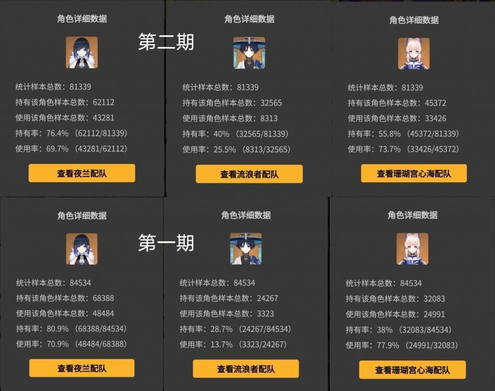
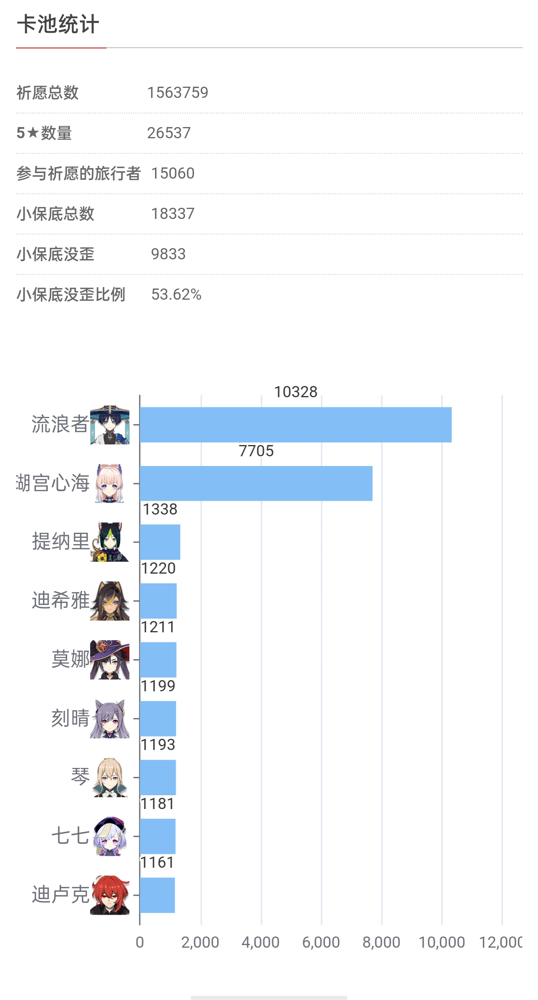

### [不吐不快][清蒜时间]非小酋的抽取统计水分是不是有点大啊

Made by ngapost2md (c) ludoux [GitHub Repo](https://github.com/ludoux/ngapost2md)

----

##### 0.[0] \<pid:0\> 2023-08-03 23:49:27 by 扉与
今晚小助手出榜，在剑斗看到一张使用率对比的图。

在样本都是8万多的情况下，心海持有数多了1w3，太子的持有数多了8k。但是我记得非小酋上是太子抽的比较多吧，于是特地去看了下是太子比心海2500左右，这是怎么回事捏

不会有人连非小酋这种榜都要买吧

----

##### 1.[0] \<pid:706814637\> 2023-08-04 03:37:06 by 屠鼠狂魔
用样本来推论总体是有条件的，并不是从总体中抽取的任何一部分样本都可用来推论总体，只有在解决了样本的代表性、可比性的前提下，掌握了抽样误差的大小及发生概率时，才能用样本来推论总体。——wiki百科

----

##### 2.[0] \<pid:706814638\> 2023-08-04 03:37:12 by RebbitX
说明散兵抽命座的更多。

----

##### 3.[0] \<pid:706814658\> 2023-08-04 03:37:41 by 子夜歌QAQ
应该是命座的问题，心海毕竟真的基本上都是零命收手。关于打榜，散超明牌号召散解上传各种数据，她们什么榜都打，社区声音大的要死但是0h是这样的

