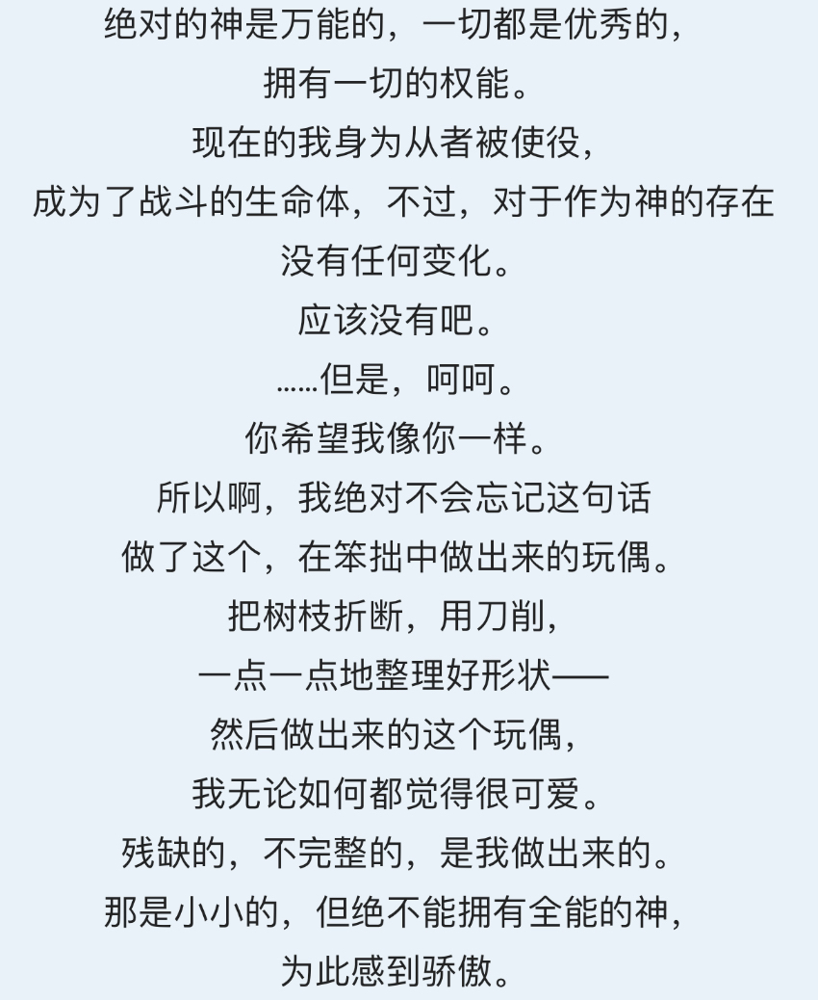
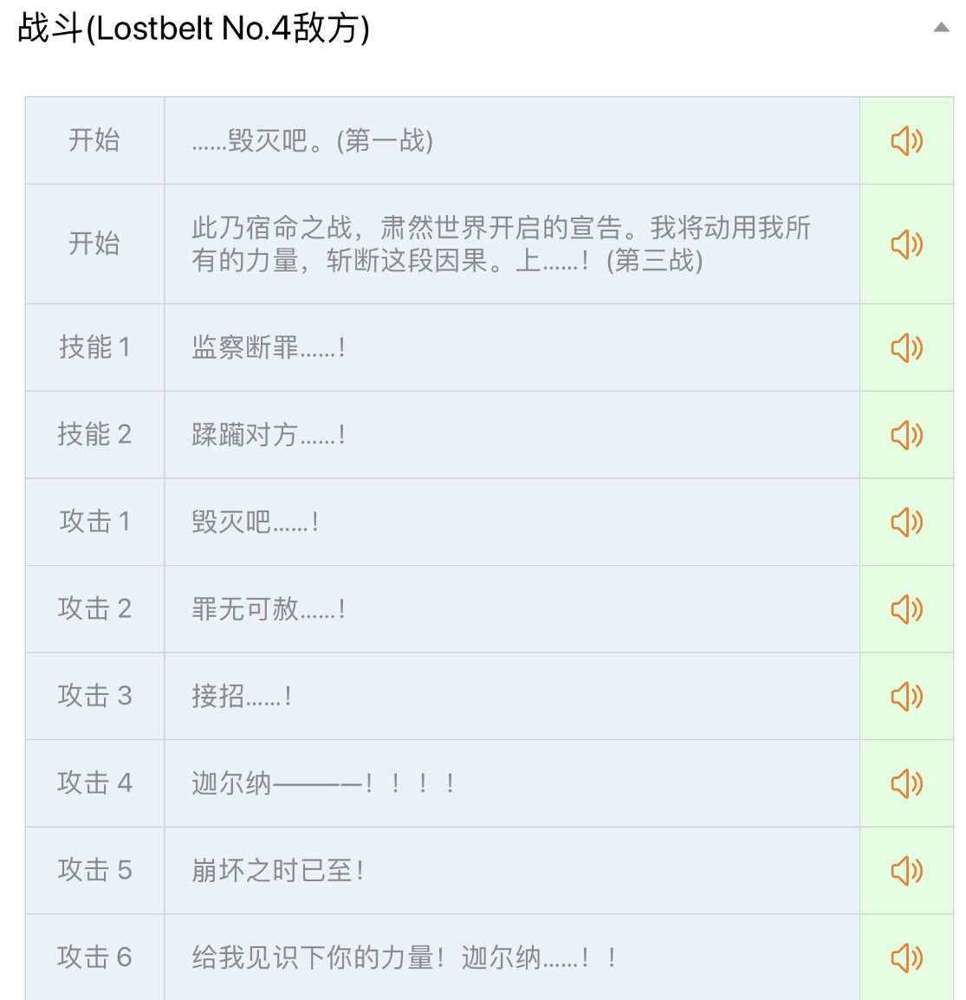
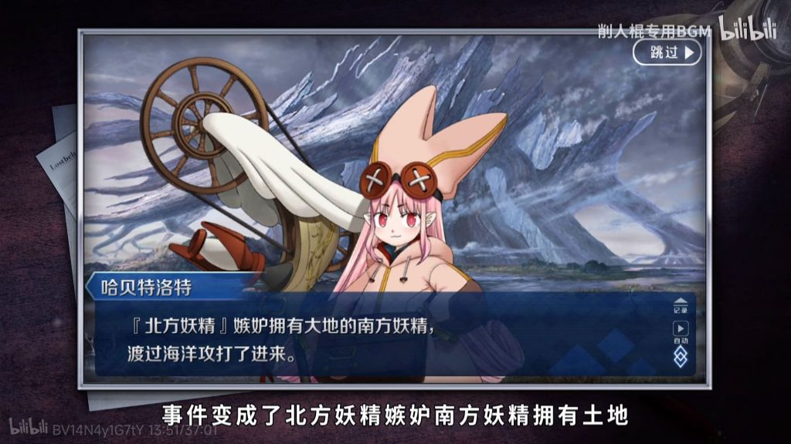
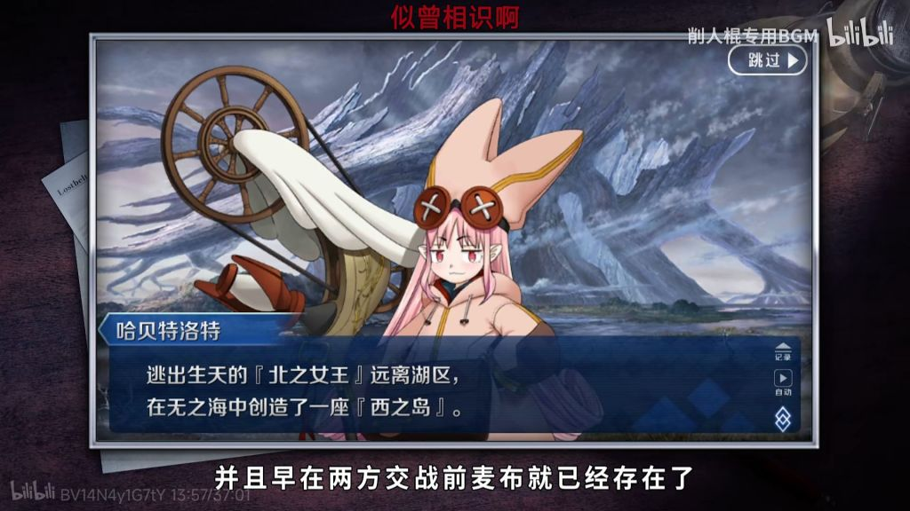
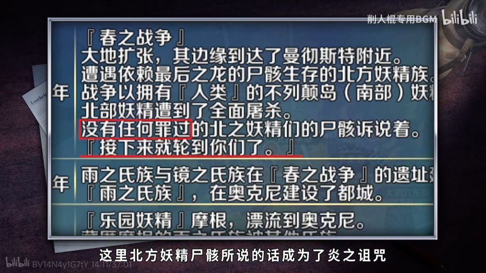
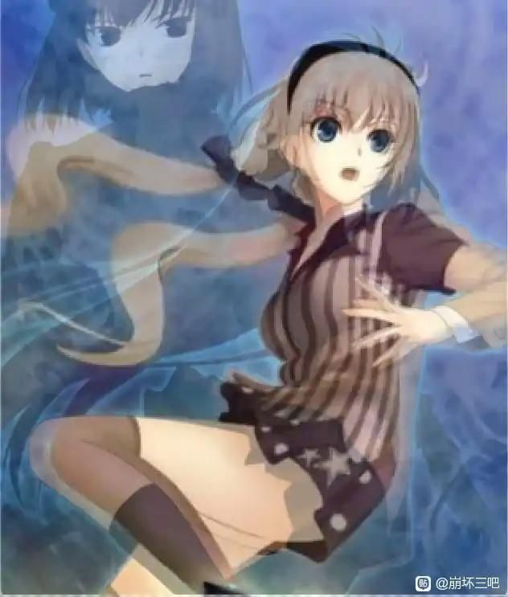
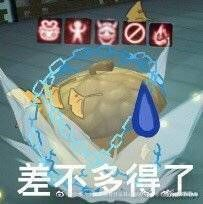
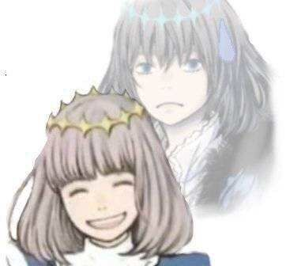

### [不吐不快]浅谈史上最大东施效颦—原神3.3对fgo2.6的“致敬”

Made by ngapost2md (c) ludoux [GitHub Repo](https://github.com/ludoux/ngapost2md)

----

##### 0.[1] \<pid:0\> 2023-08-04 00:48:38 by zzzzzzy14
人设给他偷麻了

按照mhy推散草cp来看，他们内部编剧很可能就是受了2.6的启发……

不成熟的草神纳西妲——不成熟的选定之子c呆
表面礼貌实际嘴臭的最终反派奥伯龙——1.1礼貌后来嘴臭的最终反派散兵
成熟的前辈草神大慈树王——成熟的前辈选定之子摩根
共同对抗禁忌知识——共同对抗诅咒
以及ml角色c呆奥伯龙，ml角色纳西妲散兵，两个ml之间还有互相救赎的关系……

别的都可以说我臆测，但是<b>两个ml异性角色互相有较深的羁绊</b>这种设定fgo基本独一份。当然，现在多了散草。

但fgo可不是散草这么恶心的包庇罪犯的关系，fgo里奥伯龙是伪装成梅林在用类似传音的方式当c呆的魔术老师，是真正的“互相救赎”。

咱们散草也有五百年前华馆的梦中流泪，我不好说

总之，我愿称之为史上最大东施效颦，一想到我讨厌的两个角色原型可能是我最喜欢的两个角色，就深切的感受到原神编剧有多么低能，能把剧情写的恶心到这种程度，毫无疑问也是出众的才能，愿原神编剧和原神锁死，99。

----

##### 1.[0] \<pid:706804256\> 2023-08-04 00:50:15 by ochaaki
卧槽14号机！

----

##### 2.[1] \<pid:706804434\> 2023-08-04 00:51:50 by linkeee0910
虽然对FGO完全不了解也不感兴趣，不过看到猛干哥对FGO的关注，这个“致敬”的可能还是挺大的

----

##### 3.[0] \<pid:706804480\> 2023-08-04 00:52:16 by 过客型逆戟鲸
一想到之前某米家编剧对fgo的阴阳怪气，更乐了

----

##### 4.[0] \<pid:706804618\> 2023-08-04 00:53:41 by 雏鹤玲子
啊？这都能拐到FGO？  
编辑：怎么感觉真有点可能性

----

##### 5.[0] \<pid:706804735\> 2023-08-04 00:54:35 by tbiph9277
去他的吧，虽然我不喜欢奥伯龙，但是对位散兵我只能说是乳奥了

至于纳西妲，只能说也配和c呆比

----

##### 6.[0] \<pid:706804893\> 2023-08-04 00:56:04 by zzzzzzy14
>[jump](#pid706804434) linkeee0910(2023-08-04 00:51) 说: 
>
>虽然对FGO完全不了解也不感兴趣，不过看到猛干哥对FGO的关注，这个“致敬”的可能还是挺大的

2.6作者可是被猛干兄亲自给颁发的含金量奖章的奈须蘑菇！

奈须蘑菇可是被猛干看得起的作者，那得多强多霸！

----

##### 7.[0] \<pid:706804895\> 2023-08-04 00:56:06 by 咕哒阳
开什么玩笑，要吐了！

----

##### 8.[1] \<pid:706805061\> 2023-08-04 00:57:32 by EIVAAAA
完叻，奥伯龙和c呆甚至fgo被沾屎了

----

##### 9.[1] \<pid:706805103\> 2023-08-04 00:57:52 by yswjisreal
别说小c呆的剧情真的把我哭了 你原神是？

----

##### 10.[2] \<pid:706805116\> 2023-08-04 00:57:59 by zzzzzzy14
>[jump](#pid706804735) tbiph9277(2023-08-04 00:54) 说: 
>
>去他的吧，虽然我不喜欢奥伯龙，但是对位散兵我只能说是乳奥了
>
>至于纳西妲，只能说也配和c呆比

是啊，但我偏偏看出了这层致敬。

核心的深层情感一点不懂，就学去嘴臭了，问题是奥伯龙只在里人格，在咕哒面前嘴臭，外面可是交际满分精灵王。

散兵嘴臭所有人

----

##### 11.[0] \<pid:706805286\> 2023-08-04 00:59:36 by 呙邱邱
>[jump](#pid706804434) linkeee0910(2023-08-04 00:51)说:
>虽然对FGO完全不了解也不感兴趣，不过看到猛干哥对FGO的关注，这个“致敬”的可能还是挺大的

顺带一提，虚空劫灰往世书不知道是不是2.4印度篇章的灵感，毕竟我记得他好像喜欢阿周那，2.4也是轮回题材，有树，也有火……

----

##### 12.[0] \<pid:706805299\> 2023-08-04 00:59:43 by 邓江特电机
老实说我a了快一年fgo就是玩原去了。这次公主落地+原破烂事一堆。是时侯滚回去了
看到6z哥这个形容2.6让我这个2.5.5还没打完的有亿点慌

----

##### 13.[0] \<pid:706805316\> 2023-08-04 00:59:54 by zzzzzzy14
>[jump](#pid706805061) EIVAAAA(2023-08-04 00:57) 说: 
>
>完叻，奥伯龙和c呆甚至fgo被沾屎了

我觉得东施效颦不影响西子捧心，不算粘屎，算薄纱

----

##### 14.[0] \<pid:706805525\> 2023-08-04 01:01:51 by 天堂地狱破
二者的水平简直就是水梣和水陈的区别

----

##### 15.[0] \<pid:706805600\> 2023-08-04 01:02:38 by 广阔的蓝天i
一想到猛干那态度和废狗日常被米孝子当拐，我就觉得米真的让人恶心

----

##### 16.[0] \<pid:706805626\> 2023-08-04 01:02:46 by EIVAAAA
>[jump](#pid706805316) zzzzzzy14(2023-08-04 00:59)说:
>[quote][pid=706805061,37250160,1]Reply[/pid] <b>Post by [uid=65095447]EIVAAAA[/uid] (2023-08-04 00:57):</b>  完叻，奥伯龙和c呆甚至fgo被沾屎了[s:ac:哭笑][/quote]我觉得东施效颦不影响西子捧心，不算粘屎，算薄纱

指的是以后原神玩家玩fgo，看到c呆和奥伯龙，都会不自觉想起原神散草然后一阵恶心涌上心头

----

##### 17.[3] \<pid:706805821\> 2023-08-04 01:04:27 by 呵呵不会取名
你别说，以米家对型月的执着程度看还真有可能，这下真的要吐了

----

##### 18.[1] \<pid:706805864\> 2023-08-04 01:04:51 by 广阔的蓝天i
我记得以前有人跟我说过，把散兵纳西妲和主角叫什么倾蓝组让我恶心的不行

----

##### 19.[1] \<pid:706805918\> 2023-08-04 01:05:30 by 玄羽难回
乳奥伯龙了，散兵什么cjb能和奥伯龙放在一起说？不说别的，就奥伯龙为了覆灭妖精不列颠的计划可是准备了几千年的。散兵成神的计划是自己想的吗？

----

##### 20.[1] \<pid:706805957\> 2023-08-04 01:05:54 by 戊詹郝戊傅宋
因为一直在玩fgo，所以我很早就想说了~~但那时候一定会被woc，op！蹭尼玛呢~~
散兵这角色…变成流浪者以后主色调变成蓝色，包括后面登神的剧情……真的有点像猛干哥最爱的阿周那啊
贴个狂娜绊礼和敌对语音吧~~我的即视感来源~~

----

##### 21.[0] \<pid:706806032\> 2023-08-04 01:06:30 by Aby星人
老实说我也是这么想的，但我不敢说，散兵真是对奥伯龙的侮辱，以至于虽然我这么怀疑，但还是想着文案不会这么低能吧

----

##### 22.[3] \<pid:706806177\> 2023-08-04 01:07:50 by 米翼
>[jump](#pid706805299) 邓江特电机(2023-08-04 00:59) 说: 
>
>老实说我a了快一年fgo就是玩原去了。这次公主落地+原破烂事一堆。是时侯滚回去了
>看到6z哥这个形容2.6让我这个2.5.5还没打完的有亿点慌

别慌，2.6非常好看，虽然后期蘑菇写爆字数了收尾太快有些角色塑造没完善(我可怜的妖崔…)，但是剧情发展和文笔都十分流畅吸引人，主要角色也立的很好，我连续打了几十个小时就像在打一部gal，有skip键也不会想按

----

##### 23.[3] \<pid:706806215\> 2023-08-04 01:08:10 by o0o00o0o
>[jump](#pid706805286) 呙邱邱(2023-08-04 00:59) 说: 
>
>顺带一提，虚空劫灰往世书不知道是不是2.4印度篇章的灵感，毕竟我记得他好像喜欢阿周那，2.4也是轮回题材，有树，也有火……

巴娜娜和奥宝是我最喜欢的两个角色，别被屎拖把粘上口牙

----

##### 24.[0] \<pid:706806381\> 2023-08-04 01:09:43 by 朔夜寒光
只能说2.6恰恰跟3.3形成了最鲜明的对比。
原罪的妖精、充满罪恶的不列颠，妖精们想要从诅咒中解脱，中间的章节似乎也看到了希望，至少有一部分妖精能够逃出去。然而最后的反转告诉你，阿瓦隆没有忘记他们的渎职，大角神没有忘记他们的背叛，奥伯龙没有忘记他们的罪恶。这片土地永远不会原谅他们。能够洗刷他们罪恶的方式只有一个，就是以最凄惨的方式，彻彻底底的灭亡！
3.3这坨臭狗屎，可没有资格和2.6相提并论。

----

##### 25.[0] \<pid:706806670\> 2023-08-04 01:13:05 by sd-fg
你看过2.6么？c呆是铁血ml，c呆玩家奥伯龙之间的羁绊也不是一句友情或者爱情能说清的，三人组成的跃动组在二创也是很受欢迎的
不像就是不像，何必滑坡也要贴上来，这帖何尝不是另一种蹭

----

##### 26.[0] \<pid:706806676\> 2023-08-04 01:13:09 by 广阔的蓝天i
>[jump](#pid706806381) 朔夜寒光(2023-08-04 01:09) 说: 
>
>只能说2.6恰恰跟3.3形成了最鲜明的对比。
>原罪的妖精、充满罪恶的不列颠，妖精们想要从诅咒中解脱，中间的章节似乎也看到了希望，至少有一部分妖精能够逃出去。然而最后的反转告诉你，阿瓦隆没有忘记他们的渎职，大角神没有忘记他们的背叛，奥伯龙没有忘记他们的罪恶。这片土地永远不会原谅他们。能够洗刷他们罪恶的方式只有一个，就是以最凄惨的方式，彻彻底底的灭亡。
>3.3这坨臭狗屎，可没有资格和2.6相提并论。

我记得那个翅之一族的族长死前说了句：前辈的罪孽为什么要后辈承担。之后就被奥伯龙杀了而且奥伯龙还嘲讽了

----

##### 27.[1] \<pid:706806809\> 2023-08-04 01:14:22 by zzzzzzy14
>[jump](#pid706806381) 朔夜寒光(2023-08-04 01:09) 说: 
>
>只能说2.6恰恰跟3.3形成了最鲜明的对比。
>原罪的妖精、充满罪恶的不列颠，妖精们想要从诅咒中解脱，中间的章节似乎也看到了希望，至少有一部分妖精能够逃出去。然而最后的反转告诉你，阿瓦隆没有忘记他们的渎职，大角神没有忘记他们的背叛，奥伯龙没有忘记他们的罪恶。这片土地永远不会原谅他们。能够洗刷他们罪恶的方式只有一个，就是以最凄惨的方式，彻彻底底的灭亡。
>3.3这坨臭狗屎，可没有资格和2.6相提并论。

这不正是米氏致敬米氏回旋镖的醍醐味吗？

散兵致敬的波西米亚狂想曲，是不被世俗接受的歌手最后抛下质疑展现自我的勇气；

散兵呢？到最后他还是那个孬种，那个不敢面对罪责的胆小鬼。

----

##### 28.[0] \<pid:706806968\> 2023-08-04 01:16:09 by EIVAAAA
>[jump](#pid706806676) 广阔的蓝天i(2023-08-04 01:13)说:
>[quote][pid=706806381,37250160,2]Reply[/pid] <b>Post by [uid=65064965]朔夜寒光[/uid] (2023-08-04 01:09):</b>  只能说2.6恰恰跟3.3形成了最鲜明的对比。 原罪的妖精、充满罪恶的不列颠，妖精们想要从诅咒中解脱，中间的章节似乎也看到了希望，至少有一部分妖精能够逃出去。然而最后的反转告诉你，阿瓦隆没有忘记他们的渎职，大角神没有忘记他们的背叛，奥伯龙没有忘记他们的罪恶。这片土地永远不会原谅他们。能够洗刷他们罪恶的方式只有一个，就是以最凄惨的方式，彻彻底底的灭亡。 3.3这坨臭狗屎，可没有资格和2.6相提并论。[/quote]我记得那个翅之一族的族长死前说了句：前辈的罪孽为什么要后辈承担。之后就被奥伯龙杀了而且奥伯龙还嘲讽了

这还是日本人写的，反观中国人这边写的...

----

##### 29.[1] \<pid:706807009\> 2023-08-04 01:16:35 by zzzzzzy14
>[jump](#pid706806670) sd-fg(2023-08-04 01:13) 说: 
>
>你看过2.6么？c呆是铁血ml，c呆玩家奥伯龙之间的羁绊也不是一句友情或者爱情能说清的，三人组成的跃动组在二创也是很受欢迎的
>不像就是不像，何必滑坡也要贴上来，这帖何尝不是另一种蹭

我并不是说他们有任何的像。而是我真能看出mhy的编剧在塑造人物关系时收到过启发。

他们想达成的效果是c呆奥伯龙咕哒式的，否则无法解释他们给ml拉cp的理由，他们实际达成的效果是净善宫夫妇99，这是因为他们低能。

----

##### 30.[0] \<pid:706807094\> 2023-08-04 01:17:33 by 朔夜寒光
>[jump](#pid706806676) 广阔的蓝天i(2023-08-04 01:13) 说: 
>
>我记得那个翅之一族的族长死前说了句：前辈的罪孽为什么要后辈承担。之后就被奥伯龙杀了而且奥伯龙还嘲讽了

2.6这点我挺震撼的，对罪恶的绝对的惩罚，也包括复仇的奥伯龙自身。只要是这个不列颠原生的，就没有干净的，最后也全部迎来了毁灭，毁灭的真的够彻底。

----

##### 31.[0] \<pid:706807124\> 2023-08-04 01:17:59 by 道仰
跟你老婆是C罗比，很合理

----

##### 32.[0] \<pid:706807331\> 2023-08-04 01:20:00 by 朔夜寒光
>[jump](#pid706806809) zzzzzzy14(2023-08-04 01:14) 说: 
>
>这不正是米氏致敬米氏回旋镖的醍醐味吗？
>
>散兵致敬的波西米亚狂想曲，是不被世俗接受的歌手最后抛下质疑展现自我的勇气；
>
>散兵呢？到最后他还是那个孬种，那个不敢面对罪责的胆小鬼。

米式致敬，突出一个只学外表，扭曲内核，只能说米这帮文案的境界也就这样了。

----

##### 33.[1] \<pid:706807410\> 2023-08-04 01:21:06 by 广阔的蓝天i
>[jump](#pid706806968) EIVAAAA(2023-08-04 01:16) 说: 
>
>这还是日本人写的，反观中国人这边写的...

有个更有意思的是南方妖精们还真就岁月史书了，最后也都死了

----

##### 35.[1] \<pid:706807427\> 2023-08-04 01:21:26 by 吃乐川下你和我
tmd，摩根单推人+印度组厨子看着都想吐
沙呗玩意滚远点别沾我梣小姐和巴娜娜

----

##### 36.[0] \<pid:706807587\> 2023-08-04 01:23:27 by kimorse
>[jump](#pid706806676) 广阔的蓝天i(2023-08-04 01:13) 说: 
>
>我记得那个翅之一族的族长死前说了句：前辈的罪孽为什么要后辈承担。之后就被奥伯龙杀了而且奥伯龙还嘲讽了

这个也有一部分设定的内容吧，我记得妖精的后代来源于先代的灵魂复制。
也就是说最初的六妖精犯下罪孽，而其后代也是他们的延伸，所以整个不列颠除了乐园妖精和复制品的人类都是有罪的
当然就设定如此，拿犯下罪过之后的赎罪或者对罪人的惩罚来说，原何德何能跟废狗比啊

----

##### 37.[0] \<pid:706807733\> 2023-08-04 01:25:18 by 林明玉翩洁夭兮
…………差太远了真的
不如无敌的2.6一根毛，真不配提鞋，这话不是口嗨不是夸张，是字面意思，毫不夸张

推荐大家有空可以去看看b站fgo2.6的录播，看看手游界top1的剧情是什么样子的

[url](https://www.bilibili.com/video/BV1rh411e75q)

----

##### 38.[0] \<pid:706808019\> 2023-08-04 01:28:28 by zzzzzzy14
>[jump](#pid706807422) クロエ私の(2023-08-04 01:21) 说: 
>
>感动，在幽夜死去的半年后，6z哥和我达成了一种同步
>[url](https://ngabbs.com/read.php?tid=33079626)

其实我以前就发过类似的帖子，但是bw没有让它活过24小时。

东施效颦就是要有西施冲击力才大，不是吗

----

##### 39.[0] \<pid:706808164\> 2023-08-04 01:30:04 by 米翼
按照这个理论，那么猛干兄有没有抄我2.6最爱的阴间百合？
不过我觉得笔力不行的还是别借鉴这写的极其出彩的阴间cp了，而且她们作恶多端be也是罪有应得的(届不到也是应该的，我认为这种悲惨的结局与最后揭晓却绝对无法传达的双箭头是这个cp的醍醐味)

----

##### 40.[0] \<pid:706808171\> 2023-08-04 01:30:10 by 等把美又强的剑
虽然但是，难道你要玩原神的也是一章一章玩的吗，如果只记须弥版本，散兵可能烂活不多，可是他前面版本的烂活多啊。。。这个操作就好像前面一直当活宝反派的歌剧魅影(随机挑选一个幸运反派从者)，突然立意戏份就变成了奥伯龙一样，这又不是什么活动中的角色扮演，你还能说给戏就给戏了？

评价为，编剧断章給自己断的.jpg

----

##### 41.[1] \<pid:706808444\> 2023-08-04 01:33:39 by 反物质FWZfwz
离阿周那远点啊不论是弓那还是狂那其他哪点配了啊狂那一个宝具都屠屠了

----

##### 42.[0] \<pid:706808481\> 2023-08-04 01:34:01 by Ascension___
>[jump](#pid706805286) 呙邱邱(2023-08-04 00:59) 说: 
>
>顺带一提，虚空劫灰往世书不知道是不是2.4印度篇章的灵感，毕竟我记得他好像喜欢阿周那，2.4也是轮回题材，有树，也有火……

我记得提纳里还是fgo专门画印度人的pako设计的，以米对fate的执着程度……我真不好说了

----

##### 43.[0] \<pid:706808794\> 2023-08-04 01:37:55 by 阿sh
能给我一双没看过这帖子的眼睛吗，感觉2.6脏了
本打了一堆字说明这俩的差异，越写越觉得一股恶心味就上来了

----

##### 44.[3] \<pid:706809036\> 2023-08-04 01:41:05 by 隔壁的一只小鲸鱼
………………………………………………………………mhy能不能别碰fgo了，我要吐了

----

##### 46.[0] \<pid:706809285\> 2023-08-04 01:44:13 by zzzzzzy14
>[jump](#pid706808794) 阿sh(2023-08-04 01:37) 说: 
>
>能给我一双没看过这帖子的眼睛吗，感觉2.6脏了
>本打了一堆字说明这俩的差异，越写越觉得一股恶心味就上来了

想象一下，当你看到东施效颦的时候被恶心到了，并不是动作恶心，而是东施长的恶心，娇弱造作的姿态恶心。

西施并不会因为东施效颦就不是四大美女了。

----

##### 47.[0] \<pid:706810224\> 2023-08-04 01:57:05 by 复活节奏
还是算了吧，没有一点可比性，mhy根本写不出c呆这样的角色。
主角和c呆羁绊是相互的，奥伯龙确实和呆羁绊很深，但这不影响主角藤丸立香一直是c呆心中在漫天风暴中独一无二的星辰，主角是c呆的救赎，是把自暴自弃的C呆拉出妖精之森的人，终局之战中，c呆也在主角对抗奥伯龙这个终极boss陷入绝境时，像星星一样突破一切阻碍，降临到了主角身边。
而须弥sb文案不仅没写出来这种相互的羁绊，反而通过一系列骚操作把草神旅行者建立更多羁绊的可能性都堵住了

----

##### 48.[0] \<pid:706810247\> 2023-08-04 01:57:34 by c6537
米桑为对fate的执念让我有种四处横行的恶霸对领家清纯少女求而不得最后发疯强迫手下全都化妆成少女模样的既视感

----

##### 49.[0] \<pid:706810722\> 2023-08-04 02:04:55 by Tony特别帅
>[jump](#pid706807009) zzzzzzy14(2023-08-04 01:16) 说: 
>
>我并不是说他们有任何的像。而是我真能看出mhy的编剧在塑造人物关系时收到过启发。
>
>他们想达成的效果是c呆奥伯龙咕哒式的，否则无法解释他们给ml拉cp的理由，他们实际达成的效果是净善宫夫妇99，这是因为他们低能。

卧槽每周破防一次也是够了，米哈游你还在什么惊喜是朕不知道的？
仔细一想草神身上标签拉满了：转世，不自信，善良()，被打压，有点莽，哄人开心，主角帮她建立信心，救赎，成为主导者……到3.2勉强还可以，3.3是怎么回事？？

那么3.3之后违和感就能理解了，编剧强行凹c呆人设。问题草神就是草神，他们没去想作为草神有什么解决方案，而是他们刻板印象里的c呆会怎么做。结果就是剧情怪模怪样的。

----

##### 50.[0] \<pid:706811042\> 2023-08-04 02:10:02 by zzzzzzy14
>[jump](#pid706810722) Tony特别帅(2023-08-04 02:04) 说: 
>
>卧槽每周破防一次也是够了，米哈游你还在什么惊喜是朕不知道的？
>仔细一想草神身上标签拉满了：转世，不自信，善良()，被打压，有点莽，哄人开心，主角帮她建立信心，救赎，成为主导者……到3.2勉强还可以，3.3是怎么回事？？
>
>那么3.3之后违和感就能理解了，编剧强行凹c呆人设。问题草神就是草神，他们没去想作为草神有什么解决方案，而是他们刻板印象里的c呆会怎么做。结果就是剧情怪模怪样的。

你是懂的啊！这就是我最恶心的一点：拼石块型的创造角色。

看到想致敬的优秀例子就无脑拿别人的特点去堆砌，完全不管自己故事里的合理性，最终人物塑造就是一坨缝合怪。

----

##### 51.[0] \<pid:706812490\> 2023-08-04 02:38:50 by sagacontinue
别比了，要吐出来了(蛾子脸)

----

##### 52.[0] \<pid:706812734\> 2023-08-04 02:44:26 by 江鹤疏
>[jump](#pid706805525) 天堂地狱破(2023-08-04 01:01) 说: 
>
>二者的水平简直就是水梣和水陈的区别

你说的哪个方面~~不会是强度吧~~

----

##### 53.[0] \<pid:706813015\> 2023-08-04 02:51:02 by 玖玖77
>[jump](#pid706810247) c6537(2023-08-04 01:57) 说: 
>
>米桑为对fate的执念让我有种四处横行的恶霸对领家清纯少女求而不得最后发疯强迫手下全都化妆成少女模样的既视感

是对型月的执念，人家第一个作品就是“致敬”口牙

----

##### 54.[0] \<pid:706813386\> 2023-08-04 03:00:12 by 众生蔓延
第一反应是好恶心，莫挨蛾子c呆然后越想越觉得有内味了……mhy编剧你现在是真的实体了

----

##### 55.[0] \<pid:706813402\> 2023-08-04 03:00:36 by Do_Ming_go_2
>[jump](#pid0) zzzzzzy14(2023-08-04 00:48):

那猛干就是脑袋欧若拉吧

----

##### 56.[0] \<pid:706814300\> 2023-08-04 03:27:02 by sd510520
>[jump](#pid706809135) 阿猹不吃香菜(2023-08-04 01:42)说:
>虽然退bgo好久了但是突然就被创死了，求求了猛干哥别再喜欢阿周那了[s:ac:抓狂] 突然庆幸原没给散兵整成奥伯龙那样的人权卡吧[s:ac:呆]

()已经是了
命座战士+每UP必带专辅
又何尝不是内部爱呢

----

##### 57.[0] \<pid:706815475\> 2023-08-04 04:08:51 by 你槐初代机
最近被fgo八周年动画勾引回坑花了一天时间打完了2.5.1，只能说人物塑造和剧情比猛干哥引以为傲的米氏掉书袋剧情好太多了，今年日服fgo每次剧情新卡池流水压原神是有理由的

----

##### 58.[0] \<pid:706815585\> 2023-08-04 04:13:49 by illium
开什么玩笑隔壁在开夏活啊正好轮到2.6的大家出泳装，不要搞得我下不去手抽好不好  
2.6真给我看哭了的，3.3也配？甚至不用比较，放在一起我都觉得是对2.6的侮辱

----

##### 60.[0] \<pid:706816044\> 2023-08-04 04:33:45 by A璃月北镇抚司
额，FGO是啥，是游戏吗

----

##### 62.[0] \<pid:706817370\> 2023-08-04 05:40:26 by 你好这世间
想起了以前看魔圆的时候一句测评：
“很多人从虚渊玄那里学到了魔法少女可以黑深残，却没有想过黑深残的背后同样映照了人性的光辉，而他们只抄会了黑深残”
这何尝不是一种历史的轮回呢？

----

##### 63.[0] \<pid:706817454\> 2023-08-04 05:45:00 by 田瑾优子
开什么玩笑，要吐了
不是，人家c呆什么塑造，你米哈游懂什么叫ml，什么叫令人怜惜，能不能搞明白每次c呆被叫做救世主但是自己又没有对应力量的恐惧和逃避啊。c呆是我目前全手游打下来感觉最大杯的ml和角色塑造，你草神比起c呆的塑造真的一毛都不是，我现在想起c呆说自己最近被妖精欺负冬天没鞋子穿而冻掉了两根脚趾的时候，那句[因为我太害羞了，所以就没和别人说]都会巴拉巴拉掉眼泪。你知道吗，说这句话的c呆在笑啊，她在笑，未成年的她把这件前阵子发生的事情当做谈资一样的讲给了连见面都没有见过，仅仅只通过魔杖交谈的实际上是敌人的奥伯龙
奥伯龙又是什么塑造啊！如果说草神塑造比起c呆是一毛，那谁塑造连一毛都没有，我都不惜的说了都。就光论c呆奥伯龙和散草间的对比就是天堑鸿沟，他妈的，我都不想对比了(气晕)

----

##### 64.[0] \<pid:706817859\> 2023-08-04 06:04:36 by _Aheng
如果真是“致敬”2.6的话那原还是去414吧，太恶心了
以前是笑话，现在是就是地狱笑话

----

##### 65.[0] \<pid:706818527\> 2023-08-04 06:30:38 by 辰池明丙师樊
>[jump](#pid0) zzzzzzy14(2023-08-04 00:48):

草神不配和呆毛比好吧
这脸给型月吃了快20年的饭了，是你一个出了没一年的角色能比的嘛

----

##### 66.[0] \<pid:706818579\> 2023-08-04 06:32:24 by dogge852
別碰我家C呆

----

##### 67.[0] \<pid:706819278\> 2023-08-04 06:52:23 by 葡萄水晶酒
人家c呆奥伯龙什么级别塑造，和你米简直云泥之别

----

##### 68.[0] \<pid:706819482\> 2023-08-04 06:57:04 by 超级龙击炮
不能吧，散草这塑造完全就是c呆和奥伯龙的究极对立，写的还垃圾

就你们版以前发帖那个反转草神，还比较符合c呆形象

----

##### 69.[0] \<pid:706819537\> 2023-08-04 06:58:18 by mihomopromax
不对吧？草神应该是学妹和狮子狗的散莫名其妙拉郎配，玩家惨遭ntr。
”我真是个幸福无比的新娘呢”这句话每次回想起来都能把人创死

----

##### 70.[0] \<pid:706819623\> 2023-08-04 06:59:57 by 奇迹沼
虽然但是，猛干不是崩铁的吗？
怎么滑到神父xp都是他写的了，只看出都是会嘴臭的角色，别的真的难想，都写的太低级了。

----

##### 71.[0] \<pid:706821348\> 2023-08-04 07:28:41 by 超级龙击炮
>[jump](#pid706819537) mihomopromax(2023-08-04 06:58) 说: 
>
>不对吧？草神应该是学妹和狮子狗的散莫名其妙拉郎配，玩家惨遭ntr。
>”我真是个幸福无比的新娘呢”这句话每次回想起来都能把人创死

想多了，散草怎么配碰瓷狮子头的，乳狮子头了

----

##### 72.[0] \<pid:706821590\> 2023-08-04 07:32:09 by 锆氢元素
~~那草神自爆一定也是致敬吧~~
算个锤子致敬，要我说和2.6唯一的相似就是这文案和那群贵物妖精一样烂

----

##### 73.[0] \<pid:706821652\> 2023-08-04 07:33:02 by 色胚茄子

我的心路历程

----

##### 74.[0] \<pid:706822106\> 2023-08-04 07:38:33 by 卯黄梅辰尤齐
可能一开始确实有类似的地方吧，但是估计文案写着写着就把自己代入散草中一方大肆厨放了

----

##### 75.[0] \<pid:706822570\> 2023-08-04 07:44:06 by ritsukaalter
这沾屎拖把甩的是不是有点太远了

----

##### 76.[0] \<pid:706822735\> 2023-08-04 07:45:52 by 取名字可真难
正在刷120的我被精神冲击了，郁郁了哥。

----

##### 77.[0] \<pid:706823798\> 2023-08-04 07:57:21 by __唐紫陌

2.6多么美好的东西，别以后一提起2.6就想起散草99

----

##### 78.[1] \<pid:706824203\> 2023-08-04 08:01:09 by 尤塔基里斯
真的很喜欢fgo英灵的设定，因为迦里所有反派几乎都是在剧情里被主角团搞死过一遍的，管他什么人气高，做了坏事就通通给我死一遍，mhy拿散兵这么宝贝，他敢吗？

----

##### 79.[0] \<pid:706824864\> 2023-08-04 08:07:18 by 爱溜冰的猪、
想回去玩fgo了，已经退坑快4年了

----

##### 80.[0] \<pid:706824948\> 2023-08-04 08:08:09 by hx0539
别他妈蹭我c呆，你草神塑造是个什么玩意啊蹭蹭蹭？c呆牺牲自己装填圣剑，你草神一口一个碎掉了，囚犯也有权利，真特么侮辱人呢

----

##### 81.[0] \<pid:706825033\> 2023-08-04 08:08:51 by 芥子禹
>[jump](#pid706824203) 尤塔基里斯(2023-08-04 08:01)说:
>真的很喜欢fgo英灵的设定，因为迦里所有反派几乎都是在剧情里被主角团搞死过一遍的[s:ac:茶]，管他什么人气高，做了坏事就给我以命偿命，mhy拿散兵这么宝贝，他敢吗？

有了英灵座系统，完全不用在意什么只有活人才能进卡池的问题，在剧情和卡池安排上都要自由很多
顺便一提，我的看法是fgo其实各种小雷点也挺多，但分布很零散，而且主线基本把控的还是不错，加上ml角色量大，总体感受就好不少
散兵这个角色是集合了拉高人气角色cp/cb，反派尬系和嘴臭玩家等雷点于一身，世界树这个设定和其他编剧的厨力放出更是对须弥乃至整个主线产生了毁灭性打击，让人没法忽略了

----

##### 82.[0] \<pid:706825445\> 2023-08-04 08:11:52 by 随便改个名字吧
………

----

##### 83.[0] \<pid:706826678\> 2023-08-04 08:21:03 by 红绳会太子
我c呆奥伯龙什么设计你什么设计估计原一辈子都写不出像2.6这么优秀的作品了，2.6就连百合cp都有欧若拉和妖兰这样扭曲又纯爱至极爱恨交织的阴间百合，原能写出这样的cp吗，不能吧，只会复读贴标签

----

##### 84.[0] \<pid:706827646\> 2023-08-04 08:27:37 by mihomopromax
>[jump](#pid706821348) 超级龙击炮(2023-08-04 07:28):

可是官方确实有暗戳戳推这个啊，抛开狮子头人设其他地方完全一致

----

##### 85.[0] \<pid:706828128\> 2023-08-04 08:30:46 by 須賀悠衣
6z哥你到底有几个手机号

----

##### 86.[0] \<pid:706828437\> 2023-08-04 08:32:36 by 行檐
辱FGO了

----

##### 87.[0] \<pid:706831208\> 2023-08-04 08:48:21 by 九尾卫星回收站
我确实觉得米给赔宝硬加了个“傲娇嘴臭”的人设是在蹭fgo奥伯龙
米这个low货不会真觉得奥伯龙人气高是因为他嘴臭吧？抄人设也只抄了一层皮

----

##### 88.[0] \<pid:706833715\> 2023-08-04 09:00:40 by 假日微聋羊
乳fgo了

----

##### 89.[0] \<pid:706833880\> 2023-08-04 09:01:28 by 绯墨语
别说了要吐了
虽然2.6剧情事后复盘起来也确实存在不少瑕疵，但当时一整章体验下来我会感觉“这真是一段略带苦涩而又难忘的旅程”(我是等2.6完结后在B站上看的翻译，没体验到断章这点也很重要)，蘑菇那可是GalGame起家靠文字吃饭的，就算他公款追星+大搞内部爱，就算c呆因为提前落地又很可能改了大纲导致资料里存在不少吃书现象，但就是能凭一章塑造让我对奥伯龙的立绘从无感到一定要拥有，让我想好好抱抱自迦小c呆(看完剧情立刻把自迦c呆改成二破)
2.7主线也是蘑菇主笔吧，虽然我至今无法接受烟雾镜立绘，但南美主从的塑造真的让我觉得很有意思，其实整个2.7的卡立绘都不太戳我，但看完剧情谁能忍住不往池子里丢石头呢？这才叫用剧情卖卡啊，你原的剧情只能反向塑造吧，现在还有哪家厨子希望自己喜欢的角色多出剧情吗？(哦，可能还真有，瘤子家的)

----

##### 90.[0] \<pid:706836417\> 2023-08-04 09:13:11 by 青禾木
啊啊啊不要碰瓷我家小c呆和奥博龙mhy这个大煞笔配吗

----

##### 91.[0] \<pid:706837541\> 2023-08-04 09:18:20 by 黄河远上白云间
这就是真的不配了，虽然平常总吐槽过气女主，但c8脸在型月IP可是吃了十几年的饭都没有下桌，草神拿头比

