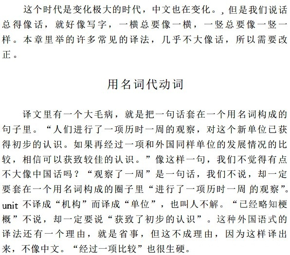

### [不吐不快] 刚刚才看到4.0的版本标题，想给mhy推荐一本书

Made by ngapost2md (c) ludoux [GitHub Repo](https://github.com/ludoux/ngapost2md)

----

##### 0.[1] \<pid:0\> 2023-08-04 01:41:00 by 不尔魃
这个标题读起来语感很怪，为啥呢？因为这本就不是中文的习惯
在思果先生的《翻译研究》里面，刚好提到过这个毛病：

“轻雨无因飘落”已经是一句话，你非要扭成一个词，放进另一句话里面，那中国人看着当然觉得怪咯

不过《翻译研究》确实是好书，哪怕不考虑翻译，只是拿来规范中文写作，读一遍也有不少收获，感谢mhy提醒，这次可以重读一遍了

----

##### 1.[0] \<pid:706809564\> 2023-08-04 01:47:54 by 雨源rainsource
文案日本进修回来的，学的是日本翻译法

----

##### 2.[0] \<pid:706809981\> 2023-08-04 01:53:48 by 小王饼干
居然能在泥潭看到有佬推这本！！是很好的专业参考书！枫丹版本标题就是，我明白它的意思，但还是想骂它能不能说人话

----

##### 3.[0] \<pid:706810293\> 2023-08-04 01:58:12 by 哒哒块
醍醐灌顶

----

##### 4.[0] \<pid:706810819\> 2023-08-04 02:06:28 by 一只狼崽
我很想用一个词形容米哈游这个4.0版本标题给我的感受
 原版违禁词之一 (

----

##### 5.[0] \<pid:706815165\> 2023-08-04 03:56:09 by MeliMor
仿佛梦回翻译课另外我也推荐余光中写的《余光中谈翻译》，他攻击性好强，特别会阴阳怪气，不过读起来很爽很有趣，当然有些观点确实比较个人化，理智吸收

----

##### 6.[0] \<pid:706815853\> 2023-08-04 04:24:50 by Rachel里澈
写成“仿若轻雨无因飘落”都比现在这种奇怪句式强啊

----

##### 7.[0] \<pid:706816793\> 2023-08-04 05:11:09 by mdy3502
喷文案也讲点基本法吧，说它不知所云做作矫情怎么都行，这哪里不符合中文表达习惯了？结构和 &quot;像一头会飞的猪&quot; 有区别吗？

----

##### 8.[0] \<pid:706818642\> 2023-08-04 06:34:02 by 色胚茄子
想了一下确实，仿若细雨无因飘落反而更符合中国人的说话方式

----

##### 9.[0] \<pid:706819174\> 2023-08-04 06:50:03 by mihomopromax
其实不用提这本大杀器，他妈的只要上过高中都知道翻译讲究一个信达雅，尤其是信最重要:一句话词不达意翻译了个得儿。~~大伙已经默认稻妻话翻译了吗~~

----

##### 10.[0] \<pid:706819488\> 2023-08-04 06:57:11 by _Aheng
这个是无因轻雨，标题是像轻雨无因
应该是标题一句话说了标题一句话
更像是废话文学
你问它说没说，如说
到底说没说，如说

----

##### 11.[0] \<pid:706825900\> 2023-08-04 08:15:24 by 巳龚蓝丑郝芦
日本进修回来的体谅一下

----

##### 12.[0] \<pid:706826542\> 2023-08-04 08:20:06 by 慈怀药王
对不起，我做六级翻译题基本上都是这个味

