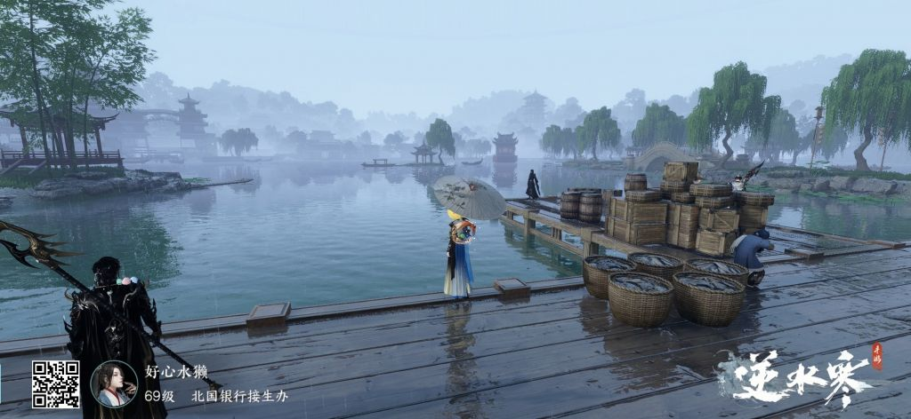
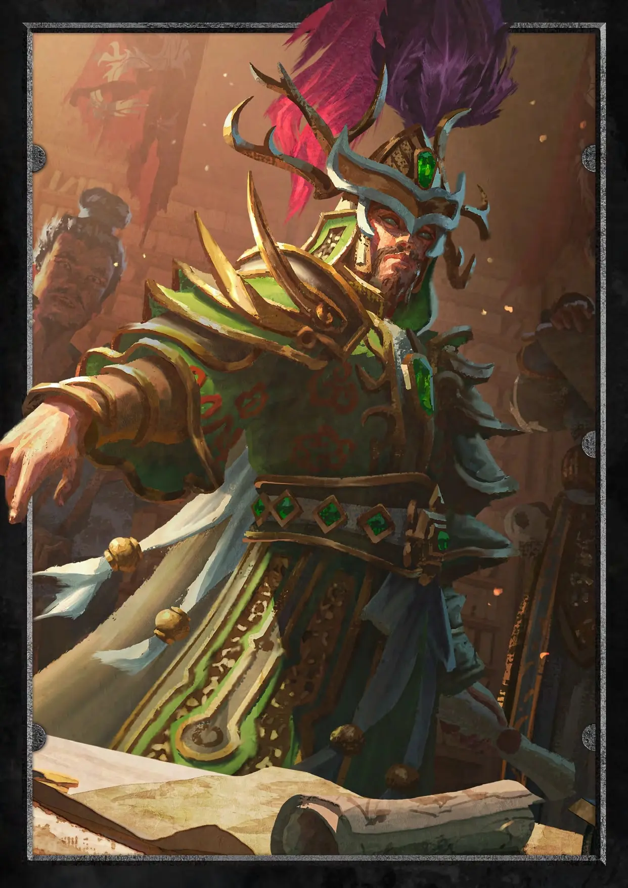
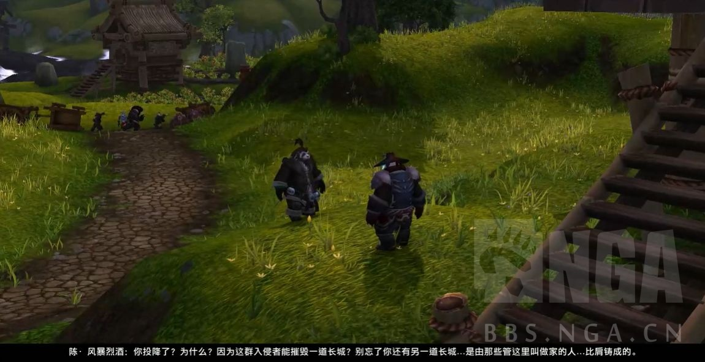
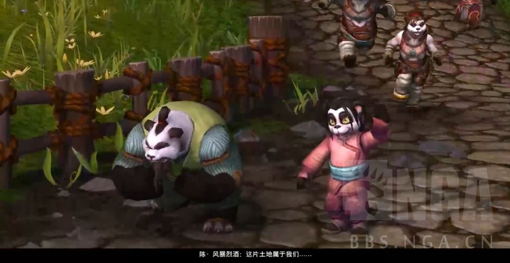

### [不吐不快] mhy做不好国风就不要做

Made by ngapost2md (c) ludoux [GitHub Repo](https://github.com/ludoux/ngapost2md)

----

##### 0.[4] \<pid:0\> 2023-08-04 01:59:41 by Jason794
起因是之前崩铁版有人吐槽为什么mhy总是要搞个国风世界，然后现在仙舟还搞成那样，果不其然底下开始“中国游戏为什么不能做国风”、“awwbwg”

总感觉mhy做国风仿佛是为了做而做，像是为了完成任务一样，璃月除了2.2那次就只有海灯节，然后崩铁刚开始宣传各种太空喜剧、公路片，期待值拉满，然后仙舟端上来个等仨月就更新了俩小时还断章的剧情，全程突出一个一脸懵逼顺便卖卖cp，做完仙舟新主线就直接卸载跑路了，很难想象在猛干的笔下仙舟乃至崩铁未来的剧情能有什么意思，估计猛干看到玩家们为此争论不休正在电脑前面偷着乐呢。

现在回过头来看感觉mhy这国风搞的还不如顺火暖了，璃月港给我的感觉还不错，沉浸感十足，但仙舟真的是很难产生共鸣，我的评价是mhy不会做就别做了。有人说仙舟的剧情就是国产仙侠剧，我个人觉得正确的描述是仙舟剧情只能算国产仙侠剧的中下等，突出一个节奏混乱抓不住主旨，产能还十分低下。

----

##### 1.[1] \<pid:706810482\> 2023-08-04 02:01:07 by Nimbus純水100
hy特有的绣红旗，不做这个怎么上报纸？

----

##### 2.[0] \<pid:706810555\> 2023-08-04 02:02:11 by 雨源rainsource

----

##### 3.[0] \<pid:706810651\> 2023-08-04 02:03:51 by safindem
璃月早期那批像是汉文出身的文案去哪了

----

##### 4.[0] \<pid:706810671\> 2023-08-04 02:04:06 by 清蒸盐姜香菜鱼
其实有听到两个完全不认识的朋友给mhy的评价是，璃月是日系的国风，日本眼中的中国风

----

##### 5.[1] \<pid:706810717\> 2023-08-04 02:04:43 by 折凳猫
别的不说，我觉得仙舟的音乐也没有璃月的抓耳，没几首想要循环播放的。实在不喜欢仙舟那种没什么起伏的调子

----

##### 6.[0] \<pid:706810832\> 2023-08-04 02:06:38 by 谷底石
其实我已经对所有手游里的“国风”都有点ptsd了
真的没几个能做出新意...

----

##### 7.[0] \<pid:706811020\> 2023-08-04 02:09:45 by 普鲁士蓝蓝蓝
我倒觉得仙舟比璃月更像当代中国一点——当然也就仅限背景和NPC，我们中国没有因为屁大点爱恨情仇搞得全国上下都遭殃的烂活

----

##### 8.[0] \<pid:706811111\> 2023-08-04 02:11:07 by bzbjzj
别提了，这现在已经是他们拥有自创能力第二还是第三、四拿手的风格了。不做这些做什么？

----

##### 9.[0] \<pid:706811192\> 2023-08-04 02:12:22 by 不尔魃
我真希望他们在标榜国风之前能先学会怎么说好中国话(

----

##### 10.[0] \<pid:706811222\> 2023-08-04 02:12:53 by 一只扁扁
绣红旗罢了
人家的故乡在哪里？
把你不切实际的幻想丢掉

----

##### 11.[0] \<pid:706811465\> 2023-08-04 02:17:15 by origird
这就要看编剧组怎么定义国风了。
他觉着国风是古偶仙侠，那他就只能写出爱恨纠葛四角恋。
他觉着国风是武侠，那他就写时代意义下的儿女情长。

突然想回去看东邪西毒啥的

----

##### 12.[0] \<pid:706811741\> 2023-08-04 02:22:32 by 右手边03
崩坏3那个叫啥符华某个装甲就挺好的啊，是一个元素辅助，具体叫啥忘了

----

##### 13.[0] \<pid:706812002\> 2023-08-04 02:28:06 by p186804696
单就璃月的建筑群混杂中日两种建筑设计且纯堆放不讲究就觉得很敷衍了

----

##### 14.[0] \<pid:706812042\> 2023-08-04 02:28:50 by Jason794
>[jump](#pid706811020) 普鲁士蓝蓝蓝(2023-08-04 02:09)说:
>我倒觉得仙舟比璃月更像当代中国一点——当然也就仅限背景和NPC，我们中国没有因为屁大点爱恨情仇搞得全国上下都遭殃的烂活[s:ac:哭笑]

有一些方面又太像现实，不比如塞刀片偷快递什么的有种须弥论文的即视感，感觉嘛，仁者见仁，我是不喜欢这种

----

##### 15.[0] \<pid:706812173\> 2023-08-04 02:31:54 by Jason794
>[jump](#pid706811741) 右手边03(2023-08-04 02:22)说:
>崩坏3那个叫啥符华某个装甲就挺好的啊，是一个元素辅助，具体叫啥忘了

是说云墨丹心吗？我内心的top1二次元国风人设出道即巅峰

----

##### 16.[0] \<pid:706812620\> 2023-08-04 02:41:35 by paradoxtale
虽然都是捏鼻绣红旗，原的渌华池华光林好歹把景点做进去了。崩铁…喜欢那集装箱和仿佛到了唐人街的国风吗

----

##### 17.[0] \<pid:706813166\> 2023-08-04 02:54:36 by 九万里穹苍
[collapse=以下内容可能是我个人想太多，且涉及到历史相关，若有不当还请斧正]说起国风的问题……其实璃月和仙舟我都有一个非常不解的地方，璃月的尤为明显。那就是中国明明是一个起源于大河之滨的农耕文明国家，为何璃月则是一个商贸立身的海洋文明国家，甚至用的还是“契约”这一舶来词汇来概括国情，而且游戏里的璃月给我的感觉，与其说是中国，更像是我国的东南沿海地区仙舟倒是还好，我就是单纯不理解为什么偏偏雅利洛都能是一颗星球，而最不愿意离家的中国人反倒抛弃了故乡开着船四处游荡私以为长久的农业文明发展给人民带来的对土地的依恋是我国文化中不可或缺的一环，但这两个游戏又偏偏避掉了，我就觉得很神奇 collapse]

----

##### 18.[0] \<pid:706813452\> 2023-08-04 03:01:56 by 小王饼干
>[jump](#pid706813166) 九万里穹苍(2023-08-04 02:54) 说: 
>
>[collapse=以下内容可能是我个人想太多，且涉及到历史相关，若有不当还请斧正]说起国风的问题……其实璃月和仙舟我都有一个非常不解的地方，璃月的尤为明显。那就是中国明明是一个起源于大河之滨的农耕文明国家，为何璃月则是一个商贸立身的海洋文明国家，甚至用的还是“契约”这一舶来词汇来概括国情，而且游戏里的璃月给我的感觉，与其说是中国，更像是我国的东南沿海地区仙舟倒是还好，我就是单纯不理解为什么偏偏雅利洛都能是一颗星球，而最不愿意离家的中国人反倒抛弃了故乡开着船四处游荡明明从文化上来看中国的河流文明和璃月体现出来的海洋文明就截然不同，但是璃月又套了层中国的皮仙舟我倾向于文案觉得星舰联盟这个设定很酷所以就这么写了

----

##### 19.[0] \<pid:706813635\> 2023-08-04 03:06:43 by Chostsongs
>[jump](#pid706813166) 九万里穹苍(2023-08-04 02:54) 说: 
>......

当你感觉不对劲时，不用怀疑，他就是故意的

----

##### 20.[0] \<pid:706813971\> 2023-08-04 03:16:46 by 苏心洲
本硕建筑学的看到仙舟建模直接昏迷 充满极度刻板印象的中式建筑
交大作业给老师都是要被全班批斗的那种

----

##### 21.[0] \<pid:706814134\> 2023-08-04 03:21:49 by 雁行未晓
怎么说呢，璃月我好歹还是很喜欢庆云顶，渌华池，绝云间，轻策庄，夕阳下的璃月港，当初开荒时第一眼看到璃月的喜悦也都是真的。
仙舟么……我不好说，我连拍照打卡都懒得拍，进去全是各种集装箱。甚至不想承认这是国风。感觉仙舟地图做的甚至不如贝洛伯格精致

----

##### 22.[0] \<pid:706814154\> 2023-08-04 03:22:28 by 媚宅不硬核
不交保护费 还想拿版号？

----

##### 23.[0] \<pid:706814525\> 2023-08-04 03:33:58 by 甲叶
你米的所谓“国风”，不就是建筑放到古建筑吧会被批烂那种？

至于服装我就不说了——看了感觉不如逆水寒国风

----

##### 24.[0] \<pid:706814642\> 2023-08-04 03:37:20 by xmkz798
什么叫“还不如顺火暖”顺火暖随便搬一个城市过来不都薄纱原么…不管是景致建筑还是人文

----

##### 25.[0] \<pid:706814842\> 2023-08-04 03:44:16 by 右手边03
>[jump](#pid706812173) Jason794(2023-08-04 02:31) 说: 
>
>是说云墨丹心吗？我内心的top1二次元国风人设出道即巅峰

对对对，不同分支那个动作也很好看

----

##### 26.[0] \<pid:706815335\> 2023-08-04 04:03:00 by 厉害费多大劲
>[jump](#pid706813166) 九万里穹苍(2023-08-04 02:54) 说: 
>
>[collapse=以下内容可能是我个人想太多，且涉及到历史相关，若有不当还请斧正]说起国风的问题……其实璃月和仙舟我都有一个非常不解的地方，璃月的尤为明显。那就是中国明明是一个起源于大河之滨的农耕文明国家，为何璃月则是一个商贸立身的海洋文明国家，甚至用的还是“契约”这一舶来词汇来概括国情，而且游戏里的璃月给我的感觉，与其说是中国，更像是我国的东南沿海地区仙舟倒是还好，我就是单纯不理解为什么偏偏雅利洛都能是一颗星球，而最不愿意离家的中国人反倒抛弃了故乡开着船四处游荡![晕

(https://img4.nga.178.com/ngabbs/post/smile/)他是故意的
璃月与其说是取材传统文化，不如说mhy是取材外国人眼里的十里洋场上海，甚至还不是老上海人眼里的弄堂老街
璃月七星组成里没有一个是文人，这是非常反直觉的事，半部论语治天下，我们的传统文化对读书人是非常推崇的
结果文人墨客出身的璃月角色，也就行秋能够勉强沾个边，而且都非常勉强，秋秋人顶多算是喜欢武侠小说的富家少爷
更不要说科举取士和重农抑商这两个大点了
朝为田舍郎，暮登天子堂，真的想不通为什么不写科举考试，普通百姓凭借自己努力封侯拜相，这不比商人白手起家赚钱符合国情，我们又不是海洋文明
璃月七星那个选拔抽象得很，但凡天权不是我为国家造核武的凝光，是隔壁九条老头想给自己家人谋谋福利，璃月都没法写，商人治理国家，他这还不如隔壁封建稻妻了
更不要说那个重农抑商了，璃月就没有一个跟农业搭边的角色，这有什么可说啊
包括之前理查高楼车过璃月国风的问题，甘雨是瑞兽麒麟，但甘雨的设计就没有一条和传统典籍记载的麒麟所符的，对比隔壁稻妻的天狗，简直是惨烈至极
那个楼里也提到璃月非常接近外国人眼里的刻板印象，就怎么说了，除非是打小就泡日漫二次元里的，不然但凡接触过我们国产仙侠，武侠电视剧，游戏，动画，都能一眼感觉到璃月这味就是有些地方不对

----

##### 27.[0] \<pid:706815536\> 2023-08-04 04:11:35 by 春风负雪
二游国风跟正统mmo系武侠比较还是。。。虽然这十几年了武侠mmo也在往花里胡哨玄幻现代搞，但还是辱逆辱武侠mmo了，甚至古风玄幻类都辱了二游味太冲，差太远

----

##### 28.[0] \<pid:706815553\> 2023-08-04 04:12:10 by 蘑菇菇不下去了
>[jump](#pid706815335) 厉害费多大劲(2023-08-04 04:03)说:
>[quote][pid=706813166,37250558,1]Reply[/pid] <b>Post by [uid=61975627]九万里穹苍[/uid] (2023-08-04 02:54):</b>  [collapse=以下内容可能是我个人想太多，且涉及到历史相关，若有不当还请斧正]说起国风的问题……其实璃月和仙舟我都有一个非常不解的地方，璃月的尤为明显。那就是中国明明是一个起源于大河之滨的农耕文明国家，为何璃月则是一个商贸立身的海洋文明国家，甚至用的还是“契约”这一舶来词汇来概括国情，而且游戏里的璃月给我的感觉，与其说是中国，更像是我国的东南沿海地区[s:ac:晕]仙舟倒是还好，我就是单纯不理解为什么偏偏雅利洛都能是一颗星球，而最不愿意离家的中国人反倒抛弃了故乡开着船四处游荡[s:ac:晕[/quote]他是故意的 璃月与其说是取材传统文化，不如说mhy是取材外国人眼里的十里洋场上海，甚至还不是老上海人眼里的弄堂老街 璃月七星组成里没有一个是文人，这是非常反直觉的事，半部论语治天下，我们的传统文化对读书人是非常推崇的 结果文人墨客出身的璃月角色，也就行秋能够勉强沾个边，而且都非常勉强，秋秋人顶多算是喜欢武侠小说的富家少爷 更不要说科举取士和重农抑商这两个大点了 朝为田舍郎，暮登天子堂，真的想不通为什么不写科举考试，普通百姓凭借自己努力封侯拜相，这不比商人白手起家赚钱符合国情，我们又不是海洋文明 璃月七星那个选拔抽象得很，但凡天权不是我为国家造核武的凝光，是隔壁九条老头想给自己家人谋谋福利，璃月都没法写，商人治理国家，他这还不如隔壁封建稻妻了 更不要说那个重农抑商了，璃月就没有一个跟农业搭边的角色，这有什么可说啊 包括之前理查高楼车过璃月国风的问题，甘雨是瑞兽麒麟，但甘雨的设计就没有一条和传统典籍记载的麒麟所符的，对比隔壁稻妻的天狗，简直是惨烈至极 那个楼里也提到璃月非常接近外国人眼里的刻板印象，就怎么说了，除非是打小就泡日漫二次元里的，不然但凡接触过我们国产仙侠，武侠电视剧，游戏，动画，都能一眼感觉到璃月这味就是有些地方不对

农业，农田都很少！甚至在田里种花

----

##### 29.[0] \<pid:706816159\> 2023-08-04 04:39:14 by 火郭 Electronica
该说不说，仙舟都不是单纯的沿海商业文化了，直接是异世界版的郑和下西洋
这么想的话，仙舟联盟三族的原型会不会是参考了马来西亚新加坡啊？持明人/仙舟本土人/狐族也许是对应印度人/华人/马来人

----

##### 30.[0] \<pid:706816807\> 2023-08-04 05:11:59 by 云恭
>[jump](#pid706813166) 九万里穹苍(2023-08-04 02:54) 说: 
>仙舟倒是还好，我就是单纯不理解为什么偏偏雅利洛都能是一颗星球，而最不愿意离家的中国人反倒抛弃了故乡开着船四处游荡，可能想多了吧

----

##### 31.[0] \<pid:706817684\> 2023-08-04 05:57:24 by akxttx1
就感觉在玩新的仙剑奇侠转

----

##### 32.[0] \<pid:706818723\> 2023-08-04 06:36:52 by dogge852
原跟崩總給我一種捏鼻做國風的感覺，什麼狗血劇情都往國風國家裡塞(第一年海燈節各種npc的愛恨情仇) 

----

##### 33.[0] \<pid:706819247\> 2023-08-04 06:51:33 by 苹果红茶
有没有想过他们是故意做差的？
本身就会国风无爱，可是又想绣红旗给自己立上一座高大上的牌坊，又不甘心把红旗绣得太好看，又想迎合洋大人的刻板印象，可不就只能做出这样的东西来？
用米氏话术来说，这叫捏着鼻子做国风。
看看璃月再看看米的精神故乡，难道还说明不了什么吗？

----

##### 34.[0] \<pid:706819578\> 2023-08-04 06:59:13 by lkjzxm
每次在璃月合成台一抬头就能看到一个大日式灯笼挂在眼前，跟跳脸嘲讽一样

----

##### 35.[0] \<pid:706819766\> 2023-08-04 07:02:49 by YVANLAU
国中生眼里的中国风

----

##### 36.[0] \<pid:706819966\> 2023-08-04 07:06:57 by saber1sy
离月现在没其它活动，除了拿海灯节做文化输出外已经什么拿不出手了吗？要搞清楚一样是我们是玩游戏而不是看着日历自动回家过节

----

##### 37.[0] \<pid:706820553\> 2023-08-04 07:16:56 by ZGDX夜
说实话mhy这俩国风感觉不如其他游戏国风版本的一根毛()

----

##### 39.[0] \<pid:706820830\> 2023-08-04 07:21:30 by Arekekw
海洋贸易文明，讲究契约精神，拥有提瓦特货币发行权
喜欢我国风阿美利加吗

----

##### 40.[1] \<pid:706824254\> 2023-08-04 08:01:41 by 有梦想的非酋
>[jump](#pid706815335) 厉害费多大劲(2023-08-04 04:03)说:
>[quote][pid=706813166,37250558,1]Reply[/pid] <b>Post by [uid=61975627]九万里穹苍[/uid] (2023-08-04 02:54):</b>  [collapse=以下内容可能是我个人想太多，且涉及到历史相关，若有不当还请斧正]说起国风的问题……其实璃月和仙舟我都有一个非常不解的地方，璃月的尤为明显。那就是中国明明是一个起源于大河之滨的农耕文明国家，为何璃月则是一个商贸立身的海洋文明国家，甚至用的还是“契约”这一舶来词汇来概括国情，而且游戏里的璃月给我的感觉，与其说是中国，更像是我国的东南沿海地区[s:ac:晕]仙舟倒是还好，我就是单纯不理解为什么偏偏雅利洛都能是一颗星球，而最不愿意离家的中国人反倒抛弃了故乡开着船四处游荡[s:ac:晕[/quote]他是故意的 璃月与其说是取材传统文化，不如说mhy是取材外国人眼里的十里洋场上海，甚至还不是老上海人眼里的弄堂老街 璃月七星组成里没有一个是文人，这是非常反直觉的事，半部论语治天下，我们的传统文化对读书人是非常推崇的 结果文人墨客出身的璃月角色，也就行秋能够勉强沾个边，而且都非常勉强，秋秋人顶多算是喜欢武侠小说的富家少爷 更不要说科举取士和重农抑商这两个大点了 朝为田舍郎，暮登天子堂，真的想不通为什么不写科举考试，普通百姓凭借自己努力封侯拜相，这不比商人白手起家赚钱符合国情，我们又不是海洋文明 璃月七星那个选拔抽象得很，但凡天权不是我为国家造核武的凝光，是隔壁九条老头想给自己家人谋谋福利，璃月都没法写，商人治理国家，他这还不如隔壁封建稻妻了 更不要说那个重农抑商了，璃月就没有一个跟农业搭边的角色，这有什么可说啊 包括之前理查高楼车过璃月国风的问题，甘雨是瑞兽麒麟，但甘雨的设计就没有一条和传统典籍记载的麒麟所符的，对比隔壁稻妻的天狗，简直是惨烈至极 那个楼里也提到璃月非常接近外国人眼里的刻板印象，就怎么说了，除非是打小就泡日漫二次元里的，不然但凡接触过我们国产仙侠，武侠电视剧，游戏，动画，都能一眼感觉到璃月这味就是有些地方不对

所以我很反感拿mhy的任何游戏鼓吹文化输出的，就这个内核都歪的文化，输出什么(吹的最狠的其实也就是蹭了戏剧元素)？如果真有人当真了，这不就是现实的岁月史书歪曲历史，假借游戏文化洗脑歪曲认知。但凡真的玩过游戏，都知道mhy在设计中国原型国家的时候，在内核和立场上就是歪的

----

##### 41.[0] \<pid:706824956\> 2023-08-04 08:08:13 by 墨色月光
建议去B站看下全战战锤3的震旦宣传片，看看英国佬是怎么做奇幻世界国风的，再看看璃月的
还特么不如歪果仁

----

##### 42.[0] \<pid:706825108\> 2023-08-04 08:09:18 by 陌生的牙刷
>[jump](#pid706813166) 九万里穹苍(2023-08-04 02:54):

确实，当初做到那边听说他们讲究契约，我还以为是西方资本内核披一个仙侠皮。

----

##### 43.[0] \<pid:706825635\> 2023-08-04 08:13:26 by 冬日霜露
>[jump](#pid706813166) 九万里穹苍(2023-08-04 02:54):

想想“国中生”这个词，假如从外面看，上海等各大港口城市是工作，其他地方是景点，不是很写实吗

----

##### 44.[0] \<pid:706825727\> 2023-08-04 08:14:09 by 歪比巴卜算子咏梅
这下原来你也觉得mhy做的国风有一股异味了
抛开氪金性不谈，网易的武侠手游都比米十倍像中国游戏，你说你想做日本文化就跟yys一样明摆着做都还算了，这样捏着鼻子做中国文化可不就是吃里扒外

----

##### 46.[0] \<pid:706825863\> 2023-08-04 08:15:11 by 寓动于动2
这还是得赖玩家，为什么还在氪

----

##### 47.[0] \<pid:706826267\> 2023-08-04 08:18:07 by qqqqqzzzz
中果游戏：指璃月活动量垫底

----

##### 48.[0] \<pid:706826320\> 2023-08-04 08:18:26 by EWSCHNEE
璃月的国风味的亲切感还比不上部分MMORPG

----

##### 49.[0] \<pid:706826405\> 2023-08-04 08:19:03 by 云恭
米是不可能放弃国风的，就算仙结晶()粉都深恨国内不懂米的好，但是他们也知道国服流水最大头，所以你可以看到结晶经常抱怨璃月倒贴现实，米就不该如何如何，而他们不愿意说的是所有倒贴设计宣传都是米制定的，不是别人逼着做的，同样不可能做好国风，原还收着点，所以干脆一个版本一次活动，但是活在fes宣传内鬼画饼里，隔壁游戏拿了国风宣传最大头的和国风地区是怎么爱恨交织。米的内核是limengan主流，可想而知国风区出的让他们多憋屈但是宣发又离不开

----

##### 50.[0] \<pid:706826549\> 2023-08-04 08:20:09 by tengshenga5
璃月港也好，契约也好更类似于上海的这个城市的气质而不是整个中国，这点也是前两年很多人提到过，可能楼里某些朋友来的晚，不知道罢了。

----

##### 51.[0] \<pid:706826872\> 2023-08-04 08:22:21 by 想看你看的世界主真
至少像梯田那块做的还是很漂亮的

----

##### 52.[2] \<pid:706826917\> 2023-08-04 08:22:37 by 辰天乐
“国风”指国风自机角色衣服找不出一个交领 

----

##### 53.[2] \<pid:706826975\> 2023-08-04 08:22:59 by 山薄荷雪
你们指望日本留学回来“高材生”们和猛干之流能弄出什么好东西来

游戏公司老板有什么想法不好说
但有些打工人恐怕为了自己埋个雷，意淫恶心玩家而洋洋得意
雷可能是“你老婆是c罗”，也可能是“你喜欢的国风是本子/印度味儿”

----

##### 54.[3] \<pid:706827041\> 2023-08-04 08:23:34 by 喵西斯
当你感觉不对劲的时候，不用怀疑，它就是故意的
“还不如逆水寒”？被逆水寒薄纱
我就问一句我交领呢？

----

##### 55.[1] \<pid:706827085\> 2023-08-04 08:23:54 by 折凳猫
还有一个问题是璃月自然风景很多很漂亮，但是城市农村都只有一个，地图上大片的废墟，为什么不开发成各种样子的城镇呢？

----

##### 56.[0] \<pid:706827689\> 2023-08-04 08:27:57 by 药师鬼
(在手游里)被逆水寒薄纱了……

----

##### 57.[0] \<pid:706827745\> 2023-08-04 08:28:16 by 梦一下怎么了
璃月大世界还是不错的，抄的国内景点

----

##### 58.[0] \<pid:706828220\> 2023-08-04 08:31:18 by 玩c罗玩的
须弥稻妻倒是有点儿中国“味儿”

----

##### 59.[0] \<pid:706828312\> 2023-08-04 08:31:48 by Inquisit
>[jump](#pid706827041) 喵西斯(2023-08-04 08:23)说:
>当你感觉不对劲的时候，不用怀疑，它就是故意的[s:ac:偷笑] “还不如逆水寒”？被逆水寒薄纱[s:ac:偷笑] 我就问一句我交领呢？

隔壁的↑↓龙尊还没逆水寒的男款灵鹿像龙给家乡人以外的角色做点正常交领不露肩的衣服会要mhy的命

----

##### 60.[1] \<pid:706828695\> 2023-08-04 08:34:17 by gfffkkf
>[jump](#pid706827085) 折凳猫(2023-08-04 08:23) 说: 
>
>还有一个问题是璃月自然风景很多很漂亮，但是城市农村都只有一个，地图上大片的废墟，为什么不开发成各种样子的城镇呢？

自然景观可不涉及什么人类文明，无人区瑰丽的景象多了去了。但是人文，中国传统仙人飘带只用在稻妻人物上，坡仙的诗也被化用在稻妻人身上。

----

##### 61.[1] \<pid:706828822\> 2023-08-04 08:35:03 by 山薄荷雪
原神里宽袍大袖、交领、笔墨纸砚其实一个不少，还不是点到为止，而是很讲究地出场
只是在你没想到的地方

----

##### 62.[8] \<pid:706829070\> 2023-08-04 08:36:36 by 喵西斯
我想让mhy死的最主要的原因就是利用国人目前对“国风”病急乱投医的簇拥和情怀，尤其是拿着冲着“国风”来玩游戏的国人的钱，混淆文化印象、夹带私货，隐晦地恶心人，zz文化敏感度不高的玩家根本发现不了，潜移默化地被影响。
其行为和被批斗的中国古装剧“以倭代华”本质相同，也就是因为没那么明目张胆加上游戏内容的传播度没有影视剧广、关注度没有影视剧高(国家一向对此类行为管制松散，全靠民间抵制)，没被注意到。
其实我想到一个类似的事。前些年国漫“仰卧起坐”，观众对国创动画(漫画死透了救不活了)的宽容纵容，养出了多少德不配位的狗屎。近几年慢慢地要求提高了，讲质量了。
我在观察“国风”游戏是否也在经历同样的道路

----

##### 63.[0] \<pid:706829632\> 2023-08-04 08:39:55 by 折凳猫
>[jump](#pid706828695) gfffkkf(2023-08-04 08:34) 说: 
>
>自然景观可不涉及什么人类文明，无人区瑰丽的景象多了去了。但是人文，中国传统仙人飘带只用在稻妻人物上，坡仙的诗也被化用在稻妻人身上。

我是想，群玉阁不是重建了吗？那其实可以用相似的理由，把其他废墟也重建一下，让地图不那么空，哪怕说不重新设计建筑，直接用旧的建筑建模搭一个小镇也行啊？明蕴镇那个地方就这么空着也太可惜了

----

##### 64.[1] \<pid:706829660\> 2023-08-04 08:40:03 by 在家模块
国风地区兼具破圈拉新、绣红旗(方便吃红利和结晶吹嘘)以及背锅(可怜的mhy被zzzq绑架了才……)三重功能，看看崩铁照搬原神的开服规划就知道有多好用，不做是不可能的，只能镍币做再加点私货进去以表对家乡的衷心

----

##### 65.[1] \<pid:706830290\> 2023-08-04 08:43:35 by 寻找着徘徊着
看隔壁复刻第二个国家赶工端上来的国风就知道mhy路径依赖吃的红利有多爽了。

----

##### 66.[0] \<pid:706830805\> 2023-08-04 08:46:11 by 我是连连aa
原神里面不细究剧情好歹能看看风景。仙舟这个集装箱…

----

##### 67.[2] \<pid:706830833\> 2023-08-04 08:46:23 by 庚冉秦庚黎曹
>[jump](#pid706829070) 喵西斯(2023-08-04 08:36) 说: 
>
>我想让mhy死的最主要的原因就是利用国人目前对“国风”病急乱投医的簇拥和情怀，尤其是拿着冲着“国风”来玩游戏的国人的钱，混淆文化印象、夹带私货，隐晦地恶心人，zz文化敏感度不高的玩家根本发现不了，潜移默化地被影响。
>其行为和被批斗的中国古装剧“以倭代华”本质相同，也就是因为没那么明目张胆加上游戏内容的传播度没有影视剧广、关注度没有影视剧高(国家一向对此类行为管制松散，全靠民间抵制)，没被注意到。
>其实我想到一个类似的事。前些年国漫“仰卧起坐”，观众对国创动画(漫画死透了救不活了

还有一点就是很多现充和二次元宅宅对这点是毫不关注的
mmo和单机有仙剑古剑和剑三天刀顺火暖(原著强相关)这些打底，再怎么样也跑偏不到哪去，要搞家国情怀要搞武侠是要和这些摆在一个赛道上做对比的，米如果做这个方向是真的会被吊打。
但你米取巧在二游搞这个二游受众又多半能完美接受日式刻板印象，现充么影视剧现在才开始管以倭代华，日本冰箱论还甚嚣尘上呢。
所以米就心安理得蹭了你鳖三年，我每次看见有些人口口声声爱璃月就蚌埠住，有种爱日漫里“中华”的美，只想说吃点好的吧。

----

##### 68.[0] \<pid:706831809\> 2023-08-04 08:51:33 by 玛缇亚斯
>[jump](#pid706813166) 九万里穹苍(2023-08-04 02:54) 说: 
>
>[collapse=以下内容可能是我个人想太多，且涉及到历史相关，若有不当还请斧正]说起国风的问题……其实璃月和仙舟我都有一个非常不解的地方，璃月的尤为明显。那就是中国明明是一个起源于大河之滨的农耕文明国家，为何璃月则是一个商贸立身的海洋文明国家，甚至用的还是“契约”这一舶来词汇来概括国情，而且游戏里的璃月给我的感觉，与其说是中国，更像是我国的东南沿海地区仙舟倒是还好，我就是单纯不理解为什么偏偏雅利洛都能是一颗星球，而最不愿意离家的中国人反倒抛弃了故乡开着船四处游荡啊这么一说还真的有点，幻塔我不了解，就谈一下粥和双吧，粥的大炎是宁愿扛着山当土木天师满地跑，都没有丢掉那些地；战双的九龙是在灾难中宁愿血战到底，封存自己的城市也要永久保留，这两个都能说明一般二游中式设定的表现形式……吧

----

##### 69.[0] \<pid:706832100\> 2023-08-04 08:52:52 by xlsq03
还不如顺火暖？
这不顺火暖薄纱吗

----

##### 70.[2] \<pid:706834200\> 2023-08-04 09:03:05 by 米酒酿汤圆
>[jump](#pid706813166) 九万里穹苍(2023-08-04 02:54) 说: 
>
>[collapse=以下内容可能是我个人想太多，且涉及到历史相关，若有不当还请斧正]说起国风的问题……其实璃月和仙舟我都有一个非常不解的地方，璃月的尤为明显。那就是中国明明是一个起源于大河之滨的农耕文明国家，为何璃月则是一个商贸立身的海洋文明国家，甚至用的还是“契约”这一舶来词汇来概括国情，而且游戏里的璃月给我的感觉，与其说是中国，更像是我国的东南沿海地区仙舟倒是还好，我就是单纯不理解为什么偏偏雅利洛都能是一颗星球，而最不愿意离家的中国人反倒抛弃了故乡开着船四处游荡![晕

(https://img4.nga.178.com/ngabbs/post/smile/)确实，这个满嘴契约经商的味儿即使是我还有滤镜的时候看也觉得违和。但是毕竟有滤镜，觉得米可能只是单纯表达了“务实”这点，但是水平不够，只能拿些西方现代词汇和思想拼拼凑凑。
~~现在想想其心可诛啊，谁知道他是不是在暗搓搓修改你的认知，快进到中华文明起源希腊捏(~~

----

##### 71.[1] \<pid:706834336\> 2023-08-04 09:03:43 by lkjzxm
>[jump](#pid706831809) 玛缇亚斯(2023-08-04 08:51) 说: 
>
>啊这么一说还真的有点，幻塔我不了解，就谈一下粥和双吧，粥的大炎是宁愿扛着山当土木天师满地跑，都没有丢掉那些地；战双的九龙是在灾难中宁愿血战到底，封存自己的城市也要永久保留，这两个都能说明一般二游中式设定的表现形式……吧

舟还固定每年新年出一条龙呢~~去年还出了两条~~，而且在阵营地区比原神多多了的情况下每年都有固定的炎国ss~~今年还多一个故事集~~，原神就七个国家还扣扣搜搜的就给璃月分一个海灯节，甚至还要给枫丹开路高下立判

----

##### 72.[1] \<pid:706835578\> 2023-08-04 09:09:31 by aaccns
不说别的什么了，什么时候给蛇画爪子，我看twi上画丹恒同人的外国人都知道龙是有爪子的

----

##### 73.[2] \<pid:706836196\> 2023-08-04 09:12:14 by 喵西斯
>[jump](#pid706830833) 庚冉秦庚黎曹(2023-08-04 08:46) 说: 
>
>还有一点就是很多现充和二次元宅宅对这点是毫不关注的
>mmo和单机有仙剑古剑和剑三天刀顺火暖(原著强相关)这些打底，再怎么样也跑偏不到哪去，要搞家国情怀要搞武侠是要和这些摆在一个赛道上做对比的，米如果做这个方向是真的会被吊打。
>但你米取巧在二游搞这个二游受众又多半能完美接受日式刻板印象，现充么影视剧现在才开始管以倭代华，日本冰箱论还甚嚣尘上呢。
>所以米就心安理得蹭了你鳖三年，我每次看见有些人口口声声爱璃月就蚌埠住，有种爱日漫里“中华”的美，只想说吃点好的吧。

二游受众确实大多也是日漫受众，受日文化熏陶久了，对自己本国文化不敏感的很常见。中国的传统太多太广了，衣食住行在数千年间一直在随着朝代交替、民族融合不断地继承和改变，本身就复杂多变，再加上国内一直没什么能成气候的文化产品来科普宣传，大众对什么是没被歪曲过的“古风”“国风”的认知非常非常少。
不过我对二游“国风”比较乐观的点在于，一是目前二次元在扩圈和融合，二次元和现充不再是老死不相往来的关系，边界也在渐渐模糊，当“非日式二次元”的人进入二游，情况就开始改变了。二是国风正在流行，国产动画也不再是被日番市场全面暴打的局面了，且影视剧“以倭代华”被骂是真能上热搜的，这也使公众对文化被殖民被歪曲这件事开始留意，引发了关注度和讨论度(说一下以前tvb时代也有很多日式古装，但那时候无人在意)现在大众意识正在提高，只不过还没轮到二游这种小角落。(叠甲一下，不是瞧不起二游，而是二游看起来很赚钱，但仅仅是赚钱，论舆论讨论度和关注度是比不上影视剧的，玩家群体自己都很少发声)
总而言之大众的需求会渐渐越来越高，“国风”会从量到质逐渐转变，不过原神可能等不到要求“质”的那一天就先凉了，也无人在意它的阴湿举动。但无所谓，比例尺上的一小段罢了。

----

##### 74.[0] \<pid:706837257\> 2023-08-04 09:16:57 by 当个乐子人
璃月这个样子除了米哈游自己歪屁股的问题，还有某一部分玩家群体问题吧平时堵嘴堵习惯了，现在璃月什么东西都没有反而符合那些人的想法吧，过一次逐月节被人念叨一辈子，每年一次海灯节就是天大的恩赐了然后米哈游在海灯节镍币绣红旗，还要跳出来说“呜呜米哈游被zzzq束缚住了”

----

##### 75.[2] \<pid:706837272\> 2023-08-04 09:17:00 by 云恭
仙舟更近一步不是直接是徐福出海设定，顺便璃月糟好歹看上去本身自己人也能收拾摊子，到了仙舟直接是御三家之一被国风地区虐待过，人设百分百放下了不打算再回来的，被主线推着对方别扭不得不帮了一把仙舟，而且设定就是没他罗浮肯定要死一半，其实故事这样写还是随便的，毕竟二次元就是随便来个故事，回头还要买宣传大力宣传米最会讲国风故事
估计结晶回头还要说国风地区这个故事写的太烂了，什么破烂古偶，还是xx地区更像我们的崩铁游戏的老家，都赖国风zzzq非得做这个地区，各种束缚写不好，不是米写的烂还要拿这个扩圈

----

##### 76.[1] \<pid:706837281\> 2023-08-04 09:17:02 by yunwowuxin
mhy一边打压扭曲国风一边又猛偷中国文化给稻妻，又当又立还有xz洗白，这游戏任何一点可夸的地方都塌完了，包括音乐现在也拉了，还nm文输，我没入坑的朋友都知道mhy偷文化的“丰功伟绩”
还有隔壁打着国风名头结果缝一堆印度元素混得不伦不类……国风的确有很多西域元素，但最适配也最多的根本就不是印度文化，mhy这样做纯属硬塞精印编剧猛干的私货。
任何了解并喜欢国风的都不会再对米家游戏有任何好感的吧，也就xz和yxh在吹了，还割韭菜呢，喜欢国风的大部分都能接受mmo，不去玩顺火暖玩你这文化挪用的破游？

----

##### 77.[0] \<pid:706837468\> 2023-08-04 09:18:00 by 庚冉秦庚黎曹
>[jump](#pid706836196) 喵西斯(2023-08-04 09:12) 说: 
>
>二游受众确实大多也是日漫受众，受日文化熏陶久了，对自己本国文化不敏感的很常见。中国的传统太多太广了，衣食住行在数千年间一直在随着朝代交替、民族融合不断地继承和改变，本身就复杂多变，再加上国内一直没什么能成气候的文化产品来科普宣传，大众对什么是没被歪曲过的“古风”“国风”的认知非常非常少。
>不过我对二游“国风”比较乐观的点在于，一是目前二次元在扩圈和融合，二次元和现充不再是老死不相往来的关系，边界也在渐渐模糊，当“非日式二次元”的人进入二游，情况就开始改变了。二是国风正在流

看楼上说战双和舟的国风角色就走的是中式刻板印象这不比原高明许多？
这些年玩下来我最喜欢的“国风”游戏还是古剑三，我在这里面是真的能感受到文化共鸣的。

----

##### 78.[0] \<pid:706838422\> 2023-08-04 09:22:15 by 朝云无觅
>[jump](#pid706813166) 九万里穹苍(2023-08-04 02:54) 说: 
>
>[collapse=以下内容可能是我个人想太多，且涉及到历史相关，若有不当还请斧正]说起国风的问题……其实璃月和仙舟我都有一个非常不解的地方，璃月的尤为明显。那就是中国明明是一个起源于大河之滨的农耕文明国家，为何璃月则是一个商贸立身的海洋文明国家，甚至用的还是“契约”这一舶来词汇来概括国情，而且游戏里的璃月给我的感觉，与其说是中国，更像是我国的东南沿海地区仙舟倒是还好，我就是单纯不理解为什么偏偏雅利洛都能是一颗星球，而最不愿意离家的中国人反倒抛弃了故乡开着船四处游荡![晕

(https://img4.nga.178.com/ngabbs/post/smile/)所以这究竟是编剧懂还是不懂呢？明知故犯就……嗯……不好说了

----

##### 79.[0] \<pid:706839053\> 2023-08-04 09:25:07 by 万岁玛利亚
>[jump](#pid706835578) aaccns(2023-08-04 09:09) 说: 
>
>不说别的什么了，什么时候给蛇画爪子，我看twi上画丹恒同人的外国人都知道龙是有爪子的

说明外国人没有搞懂印吹死挺猛干兄的良苦用心，持明龙明明是我大印度的娜迦，你们却擅自画成东亚龙

----

##### 80.[0] \<pid:706839414\> 2023-08-04 09:26:42 by 喵西斯
话说要不要赌一下这个帖子能活多久
我打了怪多字的，就这么没了怪可惜的  

瞎猜一下吧，活过中午十二点喝奶茶，过不了喝粉椰啵啵

----

##### 81.[0] \<pid:706839442\> 2023-08-04 09:26:48 by 星翼舞
说实话，仙舟这种仙侠和高科技的“硬”结合，什么导弹飞剑，超算占卜，万国来朝。我现在都能幻视成瓦坎达，部落人民大喊着黑人力量，拿着高科技石矛去打外星人

----

##### 82.[0] \<pid:706839493\> 2023-08-04 09:26:58 by srdn_z
这么说吧日本人做的国风都比mhy好，fgo的政哥哥教你什么才是赛博国风2.3当时日服刚开那叫一个震撼，感觉一切都出乎意料而又情理之中。
而仙舟给人的感觉就像劣质电视剧一样，光有服化道，但实际上和普通古装剧没啥区别，就好像其它一样，500岁像了还是个巨婴，做的事说的话就不是这个科技树下的，mhy除了神女批棺感觉很少抓住国风的精髓，只是停留在简单的外表

----

##### 83.[0] \<pid:706840167\> 2023-08-04 09:29:53 by Inquisit
>[jump](#pid706839442) 星翼舞(2023-08-04 09:26)说:
>说实话，仙舟这种仙侠和高科技的“硬”结合，什么导弹飞剑，超算占卜，万国来朝。我现在都能幻视成瓦坎达，部落人民大喊着黑人力量，拿着高科技石矛去打外星人[s:ac:擦汗]

明明是星际背景却给我感觉土的掉渣是可以说的吗

----

##### 84.[0] \<pid:706840486\> 2023-08-04 09:31:22 by 风与牧歌
>[jump](#pid706835578) aaccns(2023-08-04 09:09) 说: 
>
>不说别的什么了，什么时候给蛇画爪子，我看twi上画丹恒同人的外国人都知道龙是有爪子的

古有画蛇添足，今米有画龙去足，何尝不是一种致敬呢？

----

##### 85.[0] \<pid:706840833\> 2023-08-04 09:32:54 by 卡普琪琪3
>[jump](#pid706810482) Nimbus純水100(2023-08-04 02:01):

既然是上海报纸，我觉得不绣红旗报纸也会帮着想想办法

----

##### 86.[0] \<pid:706841805\> 2023-08-04 09:37:02 by 花瓣飘零
就喜欢他们捏鼻做国风绣红旗，反正里外不是人，外网日本爹真把他们当自己人？

----

##### 87.[0] \<pid:706842020\> 2023-08-04 09:37:57 by 芙洛斯特的残影
这是我们战锤的龙，你们的呢

<a href="javascript:;" onclick="collapse(this);">+</a>战锤的龙 ...

----

##### 88.[0] \<pid:706842234\> 2023-08-04 09:38:45 by 冯仔from2001
>[jump](#pid706810482) Nimbus純水100(2023-08-04 02:01):

感觉你说的八九不离十了，米哈游做给上面看看的样板戏

----

##### 89.[1] \<pid:706842418\> 2023-08-04 09:39:35 by 雾海漫游者
米哈游国风和顺火暖这不是越级碰瓷吗

----

##### 90.[0] \<pid:706843329\> 2023-08-04 09:43:34 by 星辰之剑
>[jump](#pid706811020) 普鲁士蓝蓝蓝(2023-08-04 02:09):

你敢往这边想，你不想想药王秘传尤其是丹枢为啥叛变的么

----

##### 91.[0] \<pid:706843491\> 2023-08-04 09:44:16 by 雅歌
暴雪一个欧美公司，做的熊猫人资料片虽然不可避免的在美术上东方主义的东西很多，对中国人骨子里农耕情怀的把握都暴杀米哈游。

四风谷的那无边无际的田地，以及老陈在保卫石犁村任务里，在铺天盖地的螳螂妖越过长城杀过来时对农夫们的说的话：

还有翡翠林，部落和联盟打得一团乱，部落的纳兹戈林将军想拉拢影踪派的掌门祝踏岚，说“帮我们铲除他们(联盟)，你的族人就能挺起胸膛傲然虼立在部落身边。”祝踏岚直接怼他说“没有你们，我们也挺着胸膛在这里生活了几千年。”

----

##### 92.[0] \<pid:706843712\> 2023-08-04 09:45:13 by 冷光小调
zzz好像还没有国风元素的角色，不知道将来还会不会出，不过zzz的场景美术风格比以往的都要日式

----

##### 93.[2] \<pid:706843728\> 2023-08-04 09:45:18 by 不想上班999号
>[jump](#pid706842234) 冯仔from2001(2023-08-04 09:38) 说: 
>
>感觉你说的八九不离十了，米哈游做给上面看看的样板戏

辱样板戏了，样板戏可都是经典才能作为样板戏的

----

##### 94.[1] \<pid:706844193\> 2023-08-04 09:47:28 by 云恭
>[jump](#pid706842234) 冯仔from2001(2023-08-04 09:38) 说: 
>
>感觉你说的八九不离十了，米哈游做给上面看看的样板戏

不只是是做给上面的吧，不说原现在外服什么样，崩铁的欧美服目前更没什么意思
米使劲买国风宣传哪怕三成为上面，至少七成是为了国服扩圈引新流水，别总推给上面，好像米不是原因为了自己赚钱一样

----

##### 95.[1] \<pid:706844780\> 2023-08-04 09:50:00 by 蒋超越
浓浓的捏鼻味儿，来璃月港还要听npc大喊中原杂碎

----

##### 96.[0] \<pid:706846659\> 2023-08-04 09:57:55 by Amklein
>[jump](#pid706830833) 庚冉秦庚黎曹(2023-08-04 08:46) 说: 
>
>还有一点就是很多现充和二次元宅宅对这点是毫不关注的
>mmo和单机有仙剑古剑和剑三天刀顺火暖(原著强相关)这些打底，再怎么样也跑偏不到哪去，要搞家国情怀要搞武侠是要和这些摆在一个赛道上做对比的，米如果做这个方向是真的会被吊打。
>但你米取巧在二游搞这个二游受众又多半能完美接受日式刻板印象，现充么影视剧现在才开始管以倭代华，日本冰箱论还甚嚣尘上呢。
>所以米就心安理得蹭了你鳖三年，我每次看见有些人口口声声爱璃月就蚌埠住，有种爱日漫里“中华”的美，只想说吃点好的吧。

我就是A了剑三玩原神的，听人吹了三年璃月国风……很无助。其实我对璃月还算有好感，但很多时候我都会说我对璃月有好感是因为我喜欢璃月神才爱屋及乌，单论它的设计，真比我所知的所有国风mmo都差太多了。

----

##### 97.[0] \<pid:706847015\> 2023-08-04 09:59:27 by Jason794
>[jump](#pid706814134) 雁行未晓(2023-08-04 03:21):

yysy仙舟我满怀期待的进去结果周围全tm是集装箱，当场吐血

----

##### 98.[0] \<pid:706847050\> 2023-08-04 09:59:35 by Q135125
璃月还国风 你吹绝云顶绿化池都还行 主城拉倒吧

----

##### 99.[0] \<pid:706847647\> 2023-08-04 10:02:04 by Jason794
>[jump](#pid706847050) Q135125(2023-08-04 09:59)说:
>璃月还国风 你吹绝云顶绿化池都还行 主城拉倒吧

璃月是乍一看不错但是细究起来问题一堆

仙舟是从头到脚一种奇怪的感觉，各种问题大伙们说差不多了

----

##### 100.[0] \<pid:706849247\> 2023-08-04 10:08:39 by fuitu
主打的就是一个吹得天上有地下无但是我愣是没感觉到哪里好。璃月我还能说是编剧不太敢写，看了仙舟我只能说是编剧太敢写了。2.4因为钟离入坑，同期就上来空壳让我摸不着头脑，之后还是神女劈观刷的印象分，，，我真情实感地看剧情，猛干哥就是我的报应。

----

##### 101.[1] \<pid:706850385\> 2023-08-04 10:13:14 by 千炽双灯
国风？请问璃月灯笼改了吗？这个话题还能说吗？

----

##### 103.[0] \<pid:706851358\> 2023-08-04 10:17:24 by Q135125
>[jump](#pid706847647) Jason794(2023-08-04 10:02):

国风(x)
刻板中国古代印象(√)

仙舟想缝点现代的东西 结果做出来个怪胎

----

##### 104.[0] \<pid:706851388\> 2023-08-04 10:17:31 by axv_ytw
喜欢它日式灯笼高高挂的璃月港吗

----

##### 105.[0] \<pid:706851850\> 2023-08-04 10:19:32 by 伟大的jarno
>[jump](#pid706846659) Amklein(2023-08-04 09:57):

巧了我是从天刀A来的~~看完大名鼎鼎的神女劈观的观感是“就这？”~~陈致逸你可害我不浅啊

----

##### 106.[0] \<pid:706853108\> 2023-08-04 10:24:49 by 世事苍茫成云烟
我是真没觉得罗浮有多少国风元素，不知道吹国风的人是怎么想的

----

##### 107.[0] \<pid:706854003\> 2023-08-04 10:28:27 by guajssika
米不想做国风元素可以不做，恶心自己也恶心玩家。原的璃月比较出圈可能不敢乱写，崩的仙舟简直是疯狂夹带私货，你米突出一个又怂又坏。

----

##### 108.[0] \<pid:706855526\> 2023-08-04 10:34:28 by axv_ytw
这是我最恶心厌恶米的地方，yue死了

----

##### 109.[0] \<pid:706856503\> 2023-08-04 10:38:25 by gfffkkf
>[jump](#pid706837257) 当个乐子人(2023-08-04 09:16) 说: 
>
>璃月这个样子除了米哈游自己歪屁股的问题，还有某一部分玩家群体问题吧平时堵嘴堵习惯了，“不希望原宝被zzzq束缚住”，现在洗地“午餐肉”还是甩锅给zzzq

别说已经出了的逐月节和海灯节了，就连画饼的翘英庄都被一部分人酸了好久。直到一直画饼不实装才消停了。

----

##### 111.[0] \<pid:706857029\> 2023-08-04 10:40:36 by Inquisit
>[jump](#pid706851850) 伟大的jarno(2023-08-04 10:19)说:
><b>Reply to [pid=706846659,37250558,5]Reply[/pid] Post by [uid=65116523]Amklein[/uid] (2023-08-04 09:57)</b> [s:ac:哭笑]巧了我是从天刀A来的<del class='gray'> 看完大名鼎鼎的神女劈观的观感是“就这？” </del>陈致逸你可害我不浅啊

+1.哪怕对原滤镜没掉时我对吹上天的怪味国风评价都是感觉不如刀桑

----

##### 112.[0] \<pid:706857343\> 2023-08-04 10:41:53 by 一只电子龙
>[jump](#pid706856503) gfffkkf(2023-08-04 10:38)说:
>[quote][pid=706837257,37250558,4]Reply[/pid] <b>Post by [uid=65073197]当个乐子人[/uid] (2023-08-04 09:16):</b>  璃月这个样子除了米哈游自己歪屁股的问题，还有某一部分玩家群体问题吧[s:ac:反对]平时堵嘴堵习惯了，“不希望原宝被zzzq束缚住”，现在洗地“午餐肉”还是甩锅给zzzq[/quote]别说已经出了的逐月节和海灯节了，就连画饼的翘英庄都被一部分人酸了好久。直到一直画饼不实装才消停了。

翘英庄沉玉谷黑岩厂画了多久的饼现在枫丹要开了还没消息白术从层岩引路人须弥引路人引路了个头

----

##### 113.[0] \<pid:706857910\> 2023-08-04 10:44:16 by 转生能成功吗
但是璃月的风景我还蛮喜欢的，像绝云间、庆云顶、渌华池、荻花洲，主城确实一直不太喜欢

----

##### 114.[0] \<pid:706858495\> 2023-08-04 10:46:36 by 仲夏月影
>[jump](#pid706857029) Inquisit(2023-08-04 10:40)说:
><b>Reply to [pid=706851850,37250558,6]Reply[/pid] Post by [uid=17556949]伟大的jarno[/uid] (2023-08-04 10:19)</b>  +1.哪怕对原滤镜没掉时我对吹上天的怪味国风评价都是感觉不如刀桑[s:ac:哭笑]

刀桑确实牛, 前三年一直到公测都没爆过大典, 顶多就是ch越来越屎普通玩家越来越变成土豪的游戏体验罢了, 哪个腾讯游戏不这样, 但是人家音乐和地图真牛啊

----

##### 115.[0] \<pid:706858705\> 2023-08-04 10:47:27 by Jason794
>[jump](#pid706857343) 一只电子龙(2023-08-04 10:41)说:
><b>Reply to [pid=706856503,37250558,6]Reply[/pid] Post by [uid=65180394]gfffkkf[/uid] (2023-08-04 10:38)</b>翘英庄沉玉谷黑岩厂画了多久的饼现在枫丹要开了还没消息[s:ac:呆]白术从层岩引路人须弥引路人引路了个头

翘英庄我记得2.5就传2.7开，然后须弥之后又传枫丹前开，我总觉得mhy搞出这些璃月卫星就是为了吊着你不走

----

##### 116.[0] \<pid:706859569\> 2023-08-04 10:51:05 by 一只电子龙
>[jump](#pid706858705) Jason794(2023-08-04 10:47)说:
><b>Reply to [pid=706857343,37250558,6]Reply[/pid] Post by [uid=64730435]一只电子龙[/uid] (2023-08-04 10:41)</b> 翘英庄我记得2.5就传2.7开，然后须弥之后又传枫丹前开，我总觉得mhy搞出这些璃月卫星就是为了吊着你不走[s:ac:哭笑]

我就是被吊的那一个

----

##### 117.[0] \<pid:706859895\> 2023-08-04 10:52:28 by Inquisit
>[jump](#pid706858495) 仲夏月影(2023-08-04 10:46)说:
><b>Reply to [pid=706857029,37250558,6]Reply[/pid] Post by [uid=65208639]Inquisit[/uid] (2023-08-04 10:40)</b>[s:ac:哭笑]刀桑确实牛, 前三年一直到公测都没爆过大典, 顶多就是ch越来越屎普通玩家越来越变成土豪的游戏体验罢了, 哪个腾讯游戏不这样, 但是人家音乐和地图真牛啊

技术和优化水平哪怕现在说吊打逆子都不为过，但是真不好玩……鹅端点好东西上来吧

----

##### 118.[0] \<pid:706860163\> 2023-08-04 10:53:30 by 透明级
国风吗没多少国风，上心吗没多上心。拼命黑红营销+岩元素反应们蟑螂一样尬吹惹事，倒是让许多角色无端沾一身腥。

----

##### 119.[0] \<pid:706863377\> 2023-08-04 11:06:09 by 仲夏月影
>[jump](#pid706859895) Inquisit(2023-08-04 10:52)说:
><b>Reply to [pid=706858495,37250558,6]Reply[/pid] Post by [uid=42378251]仲夏月影[/uid] (2023-08-04 10:46)</b>  技术和优化水平哪怕现在说吊打逆子都不为过，但是真不好玩……[s:ac:忧伤]鹅端点好东西上来吧

当年还没变成土豪的玩具的时候阵营战是真的能跟着指挥打绝地翻盘局的赢了成就感爆炸
pvp和pve分开我就感觉开始一坨了 15人本变成10人副本 当年打琴魔还打的是无攻略 一群音痴嗯听打的也很开心
前面的苍梧城天峰会八荒 后面万雪窟和开封会八荒机制我还都挺喜欢的 怎么说至少有特点也没怎么抄袭吧

----

##### 120.[0] \<pid:706863949\> 2023-08-04 11:08:27 by 伟大的jarno
>[jump](#pid706859895) Inquisit(2023-08-04 10:52)说:
><b>Reply to [pid=706858495,37250558,6]Reply[/pid] Post by [uid=42378251]仲夏月影[/uid] (2023-08-04 10:46)</b>  技术和优化水平哪怕现在说吊打逆子都不为过，但是真不好玩……[s:ac:忧伤]鹅端点好东西上来吧

北极光要么也多缝点吧，反正都抄袭大厂了

----

##### 121.[0] \<pid:706864300\> 2023-08-04 11:09:50 by 空白模糊的未来
米就是老用三次元爱国情怀绣红旗，实际贴的都是传统文化，甚至一部分传统文化还要被偷，整个璃月除了千岩军好像根本没怎么体现人民的力量，要知道古有“水能载舟亦能覆舟”，今有新中国的建立靠全人民，鉴定为不如《巴克亚罗》能体现中华内核

----

##### 122.[1] \<pid:706864388\> 2023-08-04 11:10:15 by 乙范武甲熊乔
猛干语录里可是有张口优越性的，这种人负责咸粥剧情，鼻子快捏烂了吧

----

##### 123.[0] \<pid:706864660\> 2023-08-04 11:11:16 by Inquisit
>[jump](#pid706863949) 伟大的jarno(2023-08-04 11:08)说:
><b>Reply to [pid=706859895,37250558,6]Reply[/pid] Post by [uid=65208639]Inquisit[/uid] (2023-08-04 10:52)</b> 北极光要么也多缝点吧，反正都抄袭大厂了[s:ac:羞]

它有没有新项目在做啊赶紧学学，感觉刀是捞不上来了，一副硬改也积重难返干脆躺平摆烂的样子。。

----

##### 124.[0] \<pid:706864907\> 2023-08-04 11:12:17 by 芙芙蓉蓉
>[jump](#pid706811192) 不尔魃(2023-08-04 02:12) 说: 
>
>我真希望他们在标榜国风之前能先学会怎么说好中国话(

mhy不会说中国话？

----

##### 125.[0] \<pid:706865111\> 2023-08-04 11:13:04 by 普鲁士蓝蓝蓝
>[jump](#pid706843491) 雅歌(2023-08-04 09:44) 说: 
>
>暴雪一个欧美公司，做的熊猫人资料片虽然不可避免的在美术上东方主义的东西很多，对中国人骨子里农耕情怀的把握都暴杀米哈游。
>
>四风谷的那无边无际的田地，以及老陈在保卫石犁村任务里，在铺天盖地的螳螂妖越过长城杀过来时对农夫们的说的话：
>
>
>[img]./mon_202308/04/l2Q2s-9l

一直觉得曾经的暴雪对其他民族是有一点比较深刻的思考在里面的可惜现在

----

##### 126.[5] \<pid:706866081\> 2023-08-04 11:16:48 by 雅歌
上次有个类似的帖我回复写了一串一提交发现帖子没了，不知道这帖能活多久，我还是继续把上次没能发出来的东西再发一次：

文化上的真正的向心力不仅仅体现在语言和文字，它在物质层面上也是会体现出来的，生活方式，使用的器物——你更习惯哪种，像鱼生活在水中一样选择了哪种，这种倾向是很难掩藏的。

米家的璃月和稻妻一比，璃月的风物依然是一种观光客视角，不需要是中国人都知道的几个表层元素随便摆了几个，比如烹饪。而一到稻妻，满溢出来的对器物细节的刻划马上来了，从漆器到焰火再到书法等等。

现实里的璃月，在相当长的时间内都是东亚的文化宗主国，单论器物之丰富和精致，周边全都是从宗主国学点鸡毛蒜皮回去都要供起来的，然而在米哈游家刻划的璃月，璃月的所有精致与文化都只在钟离这样古老神明身上侧写，生活氛围上整体展现的市井生活是空洞的农家乐和世侩的商港结合。

而稻妻，从雷神到市井，各种器物和任务都在显示稻妻是风雅精致的器物云集，能工巧匠倍出。

制作者在文化上真正亲近是哪一边，是非常明显的。

----

##### 127.[1] \<pid:706872278\> 2023-08-04 11:41:12 by Kaleidoscope2
>[jump](#pid706813166) 九万里穹苍(2023-08-04 02:54) 说: 
>
>[collapse=以下内容可能是我个人想太多，且涉及到历史相关，若有不当还请斧正]说起国风的问题……其实璃月和仙舟我都有一个非常不解的地方，璃月的尤为明显。那就是中国明明是一个起源于大河之滨的农耕文明国家，为何璃月则是一个商贸立身的海洋文明国家，甚至用的还是“契约”这一舶来词汇来概括国情，而且游戏里的璃月给我的感觉，与其说是中国，更像是我国的东南沿海地区仙舟倒是还好，我就是单纯不理解为什么偏偏雅利洛都能是一颗星球，而最不愿意离家的中国人反倒抛弃了故乡开着船四处游荡![晕

(https://img4.nga.178.com/ngabbs/post/smile/)你可以直接念出那个通商口岸的名字，上海！
捧的不是中国的臭脚，捧的是他上海的臭脚，只有上海是改开之后做对外贸易起家的，商业文化、契约文化是舶来的招牌，不然怎么提高对样带人的亲和力和好感度呢，奈何样带人着实rich。璃月究竟是写的哪里太明显了，这都没尝出来我觉得大多国人还是少根弦。

----

##### 128.[0] \<pid:706874792\> 2023-08-04 11:51:22 by gfffkkf
>[jump](#pid706872278) Kaleidoscope2(2023-08-04 11:41) 说: 
>
>你可以直接念出那个通商口岸的名字，上海！
>捧的不是中国的臭脚，捧的是他上海的臭脚，只有上海是改开之后做对外贸易起家的，商业文化、契约文化是舶来的招牌，不然怎么提高对样带人的亲和力和好感度呢，奈何样带人着实rich。璃月究竟是写的哪里太明显了，这都没尝出来我觉得大多国人还是少根弦。

就看上海的话，申城这个别称还是来自战国四公子之一的春申君，是他的封地，华亭陆机的平复帖是中国现存最早的西晋名家名帖，上博还展览过呢。书法这一文化元素又是在稻妻地区大加展示。

----

##### 129.[0] \<pid:706874868\> 2023-08-04 11:51:41 by Arekekw
吐槽一下剧情，
稻妻主线虽然被骂的很多，但是高潮点却很有家乡的物哀美学。
璃月剧情虽然好评的多，但是呃呃感觉在抄隔壁fate金闪闪，从ccc到fgo，什么神治到人治内核就纯纯的二次元自嗨这是可以说的吗？

----

##### 130.[0] \<pid:706876477\> 2023-08-04 11:58:42 by 无果的枯草
赛博国风？赛博交公粮

----

##### 131.[0] \<pid:706880088\> 2023-08-04 12:14:48 by 一只扁扁
说到逆水寒我还蛮喜欢磁州的，感觉都是徽派建筑和梯田，让我想到了婺源。
杭州主城也好看，西湖。

----

##### 132.[0] \<pid:706880411\> 2023-08-04 12:16:22 by 阿瓦隆aqq
抓个虫

每次看到什么米哈游做xx还不如隔壁 顺火暖就绷不住。搞的好像以前比顺火暖做得好一样。尤其是国风这块。

