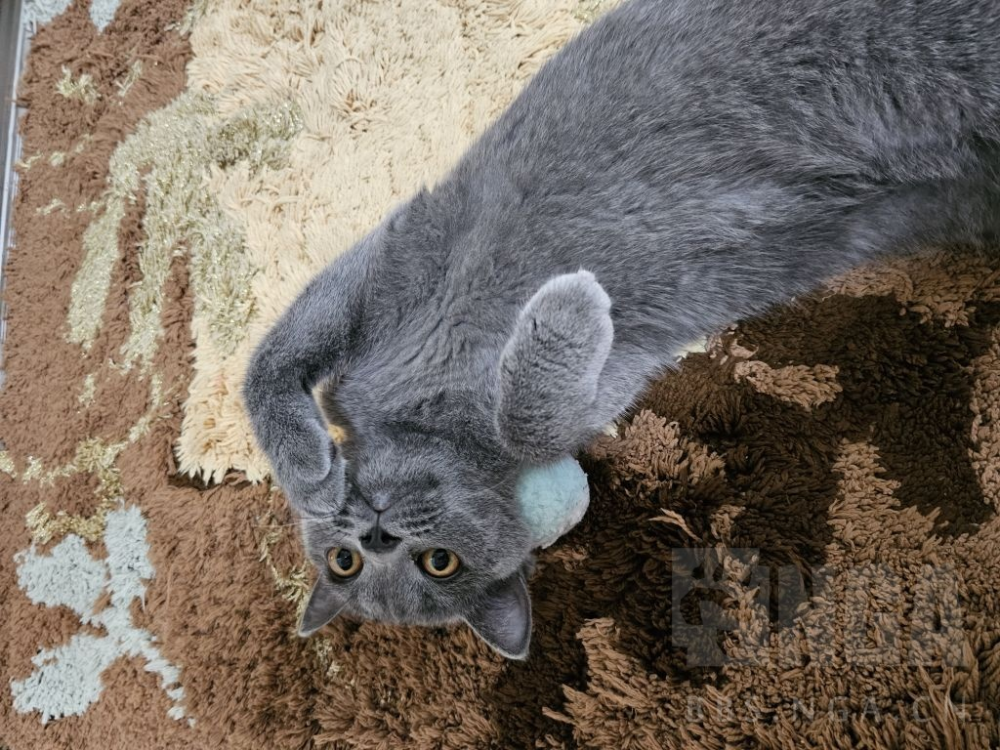
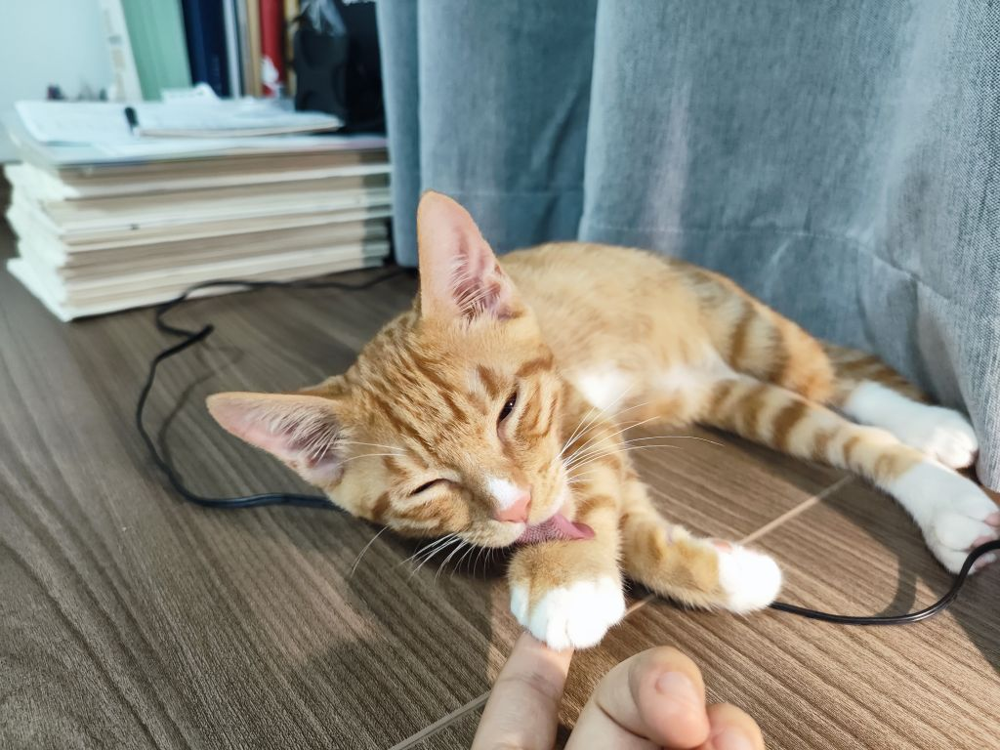
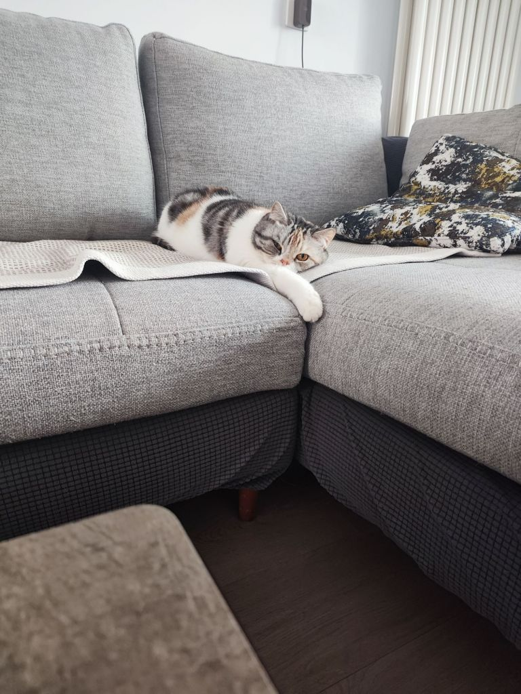

### [不吐不快]有时候看8U直抒胸臆还特么挺好笑的

Made by ngapost2md (c) ludoux [GitHub Repo](https://github.com/ludoux/ngapost2md)

----

##### 0.[1] \<pid:0\> 2023-08-04 09:04:24 by 雨源rainsource
主打一个直来直去

----

##### 1.[0] \<pid:706834915\> 2023-08-04 09:06:24 by 我修院淳平
8U最让我舒服的就是这点，爽！

----

##### 2.[0] \<pid:706835038\> 2023-08-04 09:06:58 by 虎扑双标版主司马
贴吧吧主一般没那么龟男

----

##### 3.[1] \<pid:706835230\> 2023-08-04 09:07:53 by write54
我养猫亲猫 首先它是猫

----

##### 4.[1] \<pid:706835389\> 2023-08-04 09:08:36 by 舟端F91
真正的搏击俱乐部是这样的

----

##### 5.[0] \<pid:706836052\> 2023-08-04 09:11:40 by pirsdsop
我家就是公猫但是我不会觉得公猫有什么特殊意义 也不会强调这是一只公猫

----

##### 6.[0] \<pid:706836271\> 2023-08-04 09:12:32 by 肯定是假的
我不信谁养猫，会觉得是公猫很有文学性

----

##### 7.[0] \<pid:706836565\> 2023-08-04 09:13:52 by RebbitX
阉了的猫猫还算公猫吗？

----

##### 8.[2] \<pid:706836809\> 2023-08-04 09:14:53 by 爆破匠
谁没事养个公猫成天关注性别成天强调性别的的？
“家人们谁懂啊，我男我也喜欢公猫”
有病是吧，我养牛魔

----

##### 9.[0] \<pid:706836925\> 2023-08-04 09:15:25 by 喵西斯
当大家在弹幕打出“快给我变！快变啊！”并不是真的希望它们变
虽然我没有猫但想到我的猫如果变成了人，无论男女老少无论好看得多么惊天地泣鬼神我只想说“噫！！你不要过来啊啊啊啊！！”

----

##### 10.[1] \<pid:706836934\> 2023-08-04 09:15:28 by 逆空空空空空_
养猫的最多说品种谁强调性别

----

##### 11.[0] \<pid:706837005\> 2023-08-04 09:15:48 by tina2231
要想直球还得是贴吧，直抒胸臆，酣畅淋漓

----

##### 12.[0] \<pid:706837287\> 2023-08-04 09:17:04 by btbs
养宠物不会强调性别

----

##### 13.[0] \<pid:706837482\> 2023-08-04 09:18:05 by kunizu
>[jump](#pid706836925) 喵西斯(2023-08-04 09:15) 说: 
>
>当大家在弹幕打出“快给我变！快变啊！”并不是真的希望它们变
>虽然我没有猫但想到我的猫如果变成了人，无论男女老少无论好看得多么惊天地泣鬼神我只想说“噫！！你不要过来啊啊啊啊！！”

一天一个猎奇小故事

----

##### 14.[0] \<pid:706837655\> 2023-08-04 09:18:55 by 梓川枫丶
对付逆天还讲什么道理，直接骂就对了

----

##### 15.[0] \<pid:706837857\> 2023-08-04 09:19:47 by Luoxifq
谁他妈家里养宠物还会上赶着跟别人讲自己养的是公的母的啊？
怎么，人打拳还不够，现在宠物也要饲主帮忙打拳吗？照你这样讲，米哈游你他妈为什么只有公猫才是文学性呢？那母猫是什么性？你是不是歧视母的？

----

##### 16.[0] \<pid:706837958\> 2023-08-04 09:20:13 by 何時會有HE的存在
我覺得大家如果在說貓的性別，都是討論閹割，然後公貓比起母貓價錢便宜的問題

----

##### 18.[0] \<pid:706838622\> 2023-08-04 09:23:14 by lng236
我养猫，而且是公猫，可以骂了么？
我想说谁勾八养猫是为了幻想和猫搞南通？而且还很有文学性？也就你mhy文案了吧

----

##### 19.[0] \<pid:706839067\> 2023-08-04 09:25:12 by 寻找着徘徊着
我养猫很负责的把他绝育了。

----

##### 21.[0] \<pid:706844588\> 2023-08-04 09:49:07 by 巳龚蓝丑郝芦
一来就没绷住

----

##### 22.[0] \<pid:706845884\> 2023-08-04 09:54:41 by 昆昆昆昆0v0
我在读书的时候送校园里面七八只流浪猫去绝育了，公母都有，绝完了在我眼里都是一个性别
怎么，某人也绝一个试试吗

----

##### 23.[0] \<pid:706846230\> 2023-08-04 09:56:11 by 十六个核桃
家里一公一母，只有在“哎呀呀叫的这么嗲一点不像个小伙子”“明明是小姑娘怎么还袒胸露腹坐没坐相的”这种亲昵交流的时候才会强调猫猫性别

平常只管可爱就行，谁会养个猫还天天想着“这是个公/母猫”啊，有毛病吧

<a href="javascript:;" onclick="collapse(this);">+</a>点击展开 ...
橘是公三花是母

----

##### 24.[0] \<pid:706846436\> 2023-08-04 09:57:02 by carwind
我家公猫没有蛋蛋，他有吗？

----

##### 25.[0] \<pid:706847285\> 2023-08-04 10:00:31 by 透明级
刚看到时还没什么想法，现在突然回过味来，一般人哪会管猫的性别这个故事到底想说什么，这个连堆废话都能堆出问题的团队又到底是在干什么

----

##### 26.[0] \<pid:706847702\> 2023-08-04 10:02:18 by q794623
。。。只能说米氏策划的抽象已经没救了。。。

----

##### 27.[0] \<pid:706847894\> 2023-08-04 10:03:06 by oududu
公猫不是公公猫吗

----

##### 28.[0] \<pid:706848026\> 2023-08-04 10:03:45 by 剑音忧
>[jump](#pid706838622) lng236(2023-08-04 09:23) 说: 
>
>我养猫，而且是公猫，可以骂了么？
>我想说谁勾八养猫是为了幻想和猫搞南通？而且还很有文学性？也就你mhy文案了吧
>

好可爱的猫猫！！

----

##### 29.[0] \<pid:706848462\> 2023-08-04 10:05:37 by 。一念七绝
日常对话是：
你养猫了啊 什么猫 给我看看照片
我掏出猫片 
诶呀 这狸花真好看
我内心：这是卷耳啊 卷耳虎斑看着像狸花就算了 怎么那么大的卷耳朵也能看不到

真没几个人关注公母 顶多看到蛋皮了调侃一句东厂入职 要不就是绝育了没花了多钱 这样的客套对话

----

##### 30.[0] \<pid:706848634\> 2023-08-04 10:06:18 by milan321
>[jump](#pid706846436) carwind(2023-08-04 09:57) 说: 
>
>我家公猫没有蛋蛋，他有吗？

这个可能真得问雷神和博士了

----

##### 32.[0] \<pid:706849645\> 2023-08-04 10:10:20 by 須賀悠衣
我养你的公妈

----

##### 33.[0] \<pid:706849937\> 2023-08-04 10:11:25 by 孤独瞬息
我家也是公猫，文案放过猫吧。强调动物性别的人脑子里在借喻什么，玩家又不是傻子。

怎么琢磨怎么怪，今天不让它趴我腿了。

----

##### 34.[0] \<pid:706852427\> 2023-08-04 10:21:59 by 二氧合蛋白氮
>[jump](#pid706836271) 肯定是假的(2023-08-04 09:12) 说: 
>我不信谁养猫，会觉得是公猫很有文学性

谁养猫不做绝育啊
按这群小猛干的说法，“男兽医的手术刀和美丽公猫的神之心贴贴，最后巩固了主人和宠物的关系，呵呵，结局挺有文学性的”

----

##### 35.[0] \<pid:706852487\> 2023-08-04 10:22:14 by piepiero
养猫强调性别的时候一般都是
“嘎蛋了吗”
“嘎了”

----

##### 36.[0] \<pid:706852741\> 2023-08-04 10:23:15 by 破碎的境界线
我养公猫的原因就是公猫大而且噶的时候比较轻松而不是因为他是公的

----

##### 37.[0] \<pid:706860277\> 2023-08-04 10:53:57 by Karq
养猫没见过强调性别的，是拿来艹的吗

----

##### 38.[0] \<pid:706862549\> 2023-08-04 11:02:50 by 奔跑的苦茶子
>[jump](#pid706836934) 逆空空空空空_(2023-08-04 09:15) 说: 
>
>养猫的最多说品种谁强调性别

确实会考虑，一方面是外形上确实会有小差别(比如公猫脸更圆，体型更大)，不过这并不明显，所以不是主要原因，只能说顺带考虑一下

最主要的是考虑到：公猫和母猫哪种<b>绝育</b>起来更方便所以散u们其实是考虑到了绝育这一层，领带美元

----

##### 39.[0] \<pid:706863414\> 2023-08-04 11:06:19 by heavenscar
>[jump](#pid706836934) 逆空空空空空_(2023-08-04 09:15) 说: 
>
>养猫的最多说品种谁强调性别

强调性别只有两个时候
1 要绝育了，母猫贵点
2 想拿去配个种什么的

----

##### 40.[0] \<pid:706863713\> 2023-08-04 11:07:26 by 哒哒块
公猫确实比较省事，当然得先阉了

----

##### 41.[0] \<pid:706863801\> 2023-08-04 11:07:50 by bishoujo！！！
不会有人养猫不噶蛋吧

----

##### 42.[0] \<pid:706864079\> 2023-08-04 11:08:55 by 红绳会太子
谁他妈养小动物天天说我男的喜欢公猫/公狗/公仓鼠啊

----

##### 43.[0] \<pid:706864743\> 2023-08-04 11:11:37 by 群青色的孤独
这样说会不会太伤ta了  

----

##### 44.[0] \<pid:706866567\> 2023-08-04 11:18:47 by qinxiayi757
我选猫倾向于选公猫的原因仅仅是公猫绝育便宜且术后恢复更快。

----

##### 45.[0] \<pid:706866620\> 2023-08-04 11:19:00 by 有个壳
我特么好像在dota2吧认识这个B，当初著名的切屌哥，打赌输了结果赖了一堆人这么叫他

----

##### 46.[0] \<pid:706866957\> 2023-08-04 11:20:20 by 花夹饼
公猫母猫都绝育，绝育完了公母有啥区别

----

##### 47.[0] \<pid:706867305\> 2023-08-04 11:21:44 by 汀上白沙_
一般强调猫的性别时都是问绝育了没
难道编剧也想被绝育？

----

##### 48.[0] \<pid:706867821\> 2023-08-04 11:23:50 by 锟斤拷烫烫
可惜现在百度的自动审核也越来越严了动不动就系统删贴，老哥们的攻击性其实都已经低了不少了

----

##### 49.[0] \<pid:706871238\> 2023-08-04 11:36:57 by 梦里寻欢-
这不和开头强调自己是直男，喜欢某男角色的人一个样？喜欢就喜欢呗，扯上性别是什么意思？

----

##### 50.[0] \<pid:706871672\> 2023-08-04 11:38:52 by wassily_hilda
u1s1公公才是值得我去强调的

----

##### 51.[0] \<pid:706874217\> 2023-08-04 11:49:07 by 今天休息一会嘛
>[jump](#pid706836934) 逆空空空空空_(2023-08-04 09:15) 说: 
>
>养猫的最多说品种谁强调性别

把猫当生育工具卖小猫的会特别在意，现在好多博眼球的宠物博主就这样“众所周知我们家xxx是一只小公猫”“给我们家xxx找个小母猫”等下，怎么和这次文案味道这么像

----

##### 52.[0] \<pid:706879829\> 2023-08-04 12:13:46 by 尽倾江河里
>[jump](#pid706836934) 逆空空空空空_(2023-08-04 09:15) 说: 
>
>养猫的最多说品种谁强调性别

绝育时还是有必要关注的，公猫绝育比母猫便宜(即答

----

##### 53.[0] \<pid:706891128\> 2023-08-04 13:08:53 by Kururugi
>[jump](#pid706864743) 群青色的孤独(2023-08-04 11:11) 说: 
>
>这样说会不会太伤ta了  

伤ta妈的头！(小阁老音)

----

##### 54.[0] \<pid:706912771\> 2023-08-04 14:57:49 by 失望呢喃
直抒胸臆 酣畅淋漓

----

##### 55.[0] \<pid:706913149\> 2023-08-04 14:59:39 by cbgc343
养了一公一母两只狗，长得一模一样，平时都是家里人在照顾，我压根分不清哪只是公的哪只是母的

----

##### 56.[0] \<pid:706913264\> 2023-08-04 15:00:14 by yoooooov
养猫当然要看性别，母猫要是跑出去自个儿配种那不就愁了，有个公的腌猫，性格又温顺又不会给你凭空又多几个猫命

----

##### 57.[0] \<pid:706925921\> 2023-08-04 15:59:17 by kilinde
我家强调猫性别的时候只有:
哎呀，咪咪是个小太监喽～
以及
怎么都阉了还发情，不会没噶干净吧

----

##### 58.[0] \<pid:706926401\> 2023-08-04 16:01:33 by scoutqq
文案：我觉得你们不想和公猫贴贴主要是因为你们的小公猫不够美丽

