### [不吐不快]分享一下自己对卡维的态度变化

Made by ngapost2md (c) ludoux [GitHub Repo](https://github.com/ludoux/ngapost2md)

----

##### 0.[2] \<pid:0\> 2023-08-04 10:57:19 by 宫萧语
今天的热点好像是车卡维的塑造，那来加把火热闹一下。顺便证明一下我之前对卡维的态度真的是友善以及期待剧情，现在这种态度是hk的cp粉以及mhy剧情的锅。

----

##### 1.[0] \<pid:706861535\> 2023-08-04 10:58:57 by 宫萧语
上面这几个附件基本上都是期待他强度可以，以及剧情里出现沙漠大工程，证明天才人设什么的。

----

##### 2.[0] \<pid:706862102\> 2023-08-04 11:01:08 by 宫萧语
这两张是出来后，当时因为其他的关系，剧情跳着看的，还在友善讨论卡维强度以及抽不抽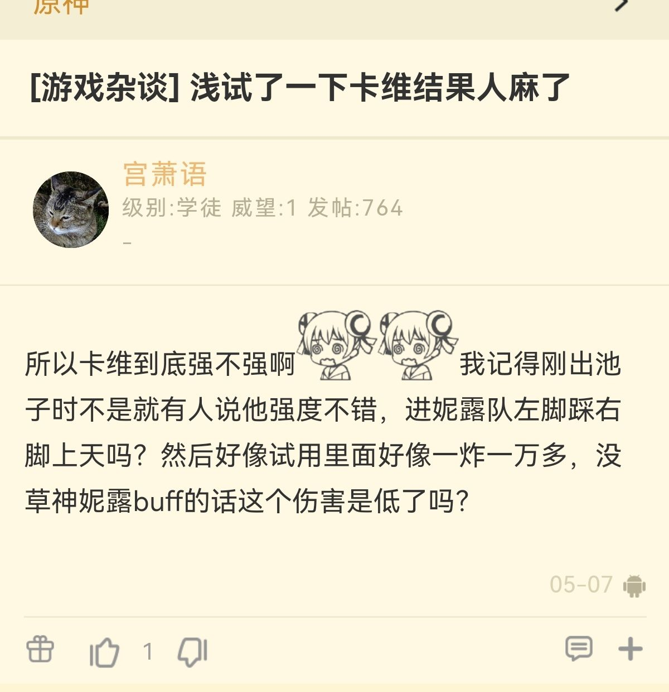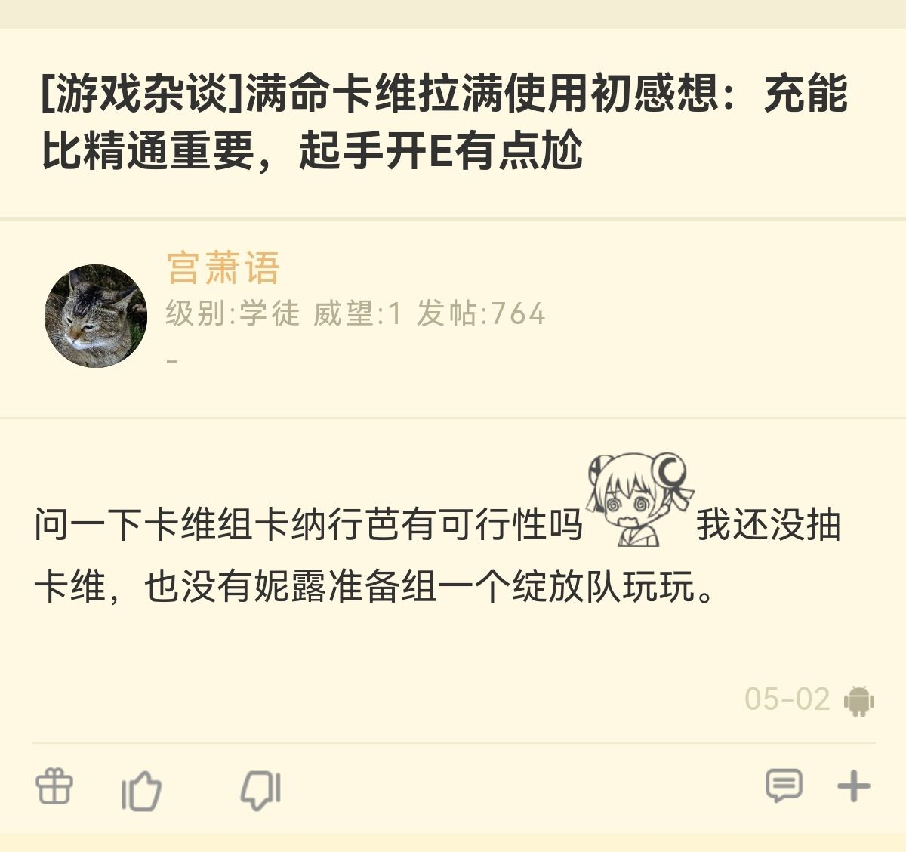
不过后面因为不强就放弃了

----

##### 3.[2] \<pid:706862103\> 2023-08-04 11:01:08 by wjxjh
好了老哥别说了，看见你仿佛在照镜子，笑不出来

----

##### 4.[0] \<pid:706862321\> 2023-08-04 11:01:59 by 飘雪菌
对卡维的塑造.....能看到现在的，正常人都会疯的好吧除非......

----

##### 5.[0] \<pid:706862501\> 2023-08-04 11:02:43 by sunshine23334
>[jump](#pid706862321) 飘雪菌(2023-08-04 11:01) 说: 
>
>对卡维的塑造.....能看到现在的，正常人都会疯的好吧除非......

是sfw(即答)

----

##### 6.[0] \<pid:706862601\> 2023-08-04 11:03:06 by 9with9
谁不是从期待咔到 因为hkh解和mhy的死操作给恶心走的

----

##### 7.[3] \<pid:706862842\> 2023-08-04 11:04:01 by 白浪梅
笑不出来想当时看完角色故事拉满的也有我一个，塑造一路咯噔

----

##### 8.[0] \<pid:706863159\> 2023-08-04 11:05:18 by 残血之殇
我玩原神阴得的

----

##### 9.[0] \<pid:706863324\> 2023-08-04 11:05:55 by 小王饼干
不是，3.1留言板吵架的时候，我真嗑过，当时我还单推艾尔海森现在想来有种地狱到家了的美

----

##### 10.[5] \<pid:706863837\> 2023-08-04 11:07:58 by 宫萧语
现在因为被海卡到处跳脸，又被善良小白花恶心到了。去看了看卡的剧情，好感直接掉完了。
顺带问一下，他和珐露珊的剧情真的没人觉得奇怪吗？自己提出的抽签，没抽到自己的话，正常人不应该恭喜珐露珊什么的吗，哪怕觉得倒霉说一句就行了，至于那样？
当着她的面说自己倒霉，卖惨。换一个不经世事又同理心强的，估计就给他了，这真的不是故意的？

----

##### 11.[0] \<pid:706864029\> 2023-08-04 11:08:44 by 被塞抹布后的小号
散兵，林尼，卡维算不算一种理查热度御三家……

----

##### 12.[0] \<pid:706864063\> 2023-08-04 11:08:51 by 是大可不是duck
卡维还没上线之前我真的很期待他的，尤其是建模还不错，而且日配是内田dd，卡池一出来我就开始抽，抽到了零命白术我才拿到一个卡维，当时还喜滋滋的给他放进我专门做的壶的房间，现在看来我是玩原神玩的，阴得的。

----

##### 13.[0] \<pid:706864185\> 2023-08-04 11:09:22 by 105104_
有人看乐子，有人照镜子

----

##### 14.[0] \<pid:706864784\> 2023-08-04 11:11:50 by Fablet
简直和你一模一样……
朋友喜欢草神和他，给我强势安利。
现在的我就好像神农尝百草之后毒发身亡一样，还得担心他家粉丝不要拐我的老婆，如士郎等人……
米哈游，你该死啊。

----

##### 15.[0] \<pid:706864968\> 2023-08-04 11:12:30 by 今天休息一会嘛
都是这样的，从“看脸有好感”到“看后续剧情难绷” 又是“擅自期待擅自破防”了捏genshit impact大舞台，够粪你就来

----

##### 16.[0] \<pid:706865088\> 2023-08-04 11:12:58 by 9with9
>[jump](#pid706863324) 小王饼干(2023-08-04 11:05) 说: 
>
>不是，3.1留言板吵架的时候，我真嗑过，当时我还单推艾尔海森现在想来有种地狱到家了的美

谁不是说 第一次卡维露面我还去找留言板去磕 现在真是地狱笑话

----

##### 17.[0] \<pid:706865124\> 2023-08-04 11:13:07 by KingreyShawn
>[jump](#pid706863837) 宫萧语(2023-08-04 11:07) 说: 
>
>现在因为被海卡到处跳脸，又被善良小白花恶心到了。去看了看卡的剧情，好感直接掉完了。
>顺带问一下，他和珐露珊的剧情真的没人觉得奇怪吗？自己提出的抽签，没抽到自己的话，正常人不应该恭喜珐露珊什么的吗，哪怕觉得倒霉说一句就行了，至于那样？
>当着她的面说自己倒霉，卖惨。换一个不经世事又同理心强的，估计就给他了，这真的不是故意的？

3.6我真就看他一路卖惨，“我倒霉”“我痛苦”“性格矛盾”复读了一路，然后怨天怨地怒喊要搬家，不知道的还以为房东怎么虐待他了，最难崩的是搬家口号喊得震天响，最后当个屁放了，一切照旧无事发生了

----

##### 20.[4] \<pid:706865194\> 2023-08-04 11:13:23 by 一只电子龙
玩原神玩的，厨海厨的，这是我应得
真想打醒当年期待这俩人对手戏的我

----

##### 21.[0] \<pid:706865416\> 2023-08-04 11:14:16 by 何時會有HE的存在
令回想起nga關於因為卡維寫關於設計師還是建築師的長文那位同學

----

##### 22.[0] \<pid:706865440\> 2023-08-04 11:14:21 by 逢河牧野0v0
就为了角色语音里的一句话，认识一个人要先认识他的理想，把他抽+拉到90级，看了后续剧情之后只觉得我真是个笑话

----

##### 23.[0] \<pid:706865611\> 2023-08-04 11:14:58 by 今锁朱楼
学园祭活动之前我就在B站说过，卡维的形象塑造绝对有问题，他缺乏独立的塑造和艾尔海森绑定太深，这种方式对两个人都不利。学园祭他可能是主角但不可能有什么长进，塑造估计会比较差。
然后我就变成海解了我还能说什么呢。

----

##### 24.[0] \<pid:706865619\> 2023-08-04 11:15:00 by 辰砂之纺锤
摄像头拆了感觉就是我本人

----

##### 25.[0] \<pid:706865694\> 2023-08-04 11:15:19 by 哈哈哈哈鸡汤来喽
好像在照镜子啊啊啊

----

##### 26.[0] \<pid:706865749\> 2023-08-04 11:15:30 by 花夹饼
我真是上辈子反了大罪了才会在原里厨草神柯莱卡维
后面卡维出的时候我都不看他剧情了，就抽一个打打绽放队听听内田弟的语音，你别说他打架真有气势，然后这个队打着还卡手，直接退坑跑路了

----

##### 27.[0] \<pid:706866224\> 2023-08-04 11:17:20 by A—lhaitham
这是我玩原神的报应

----

##### 28.[0] \<pid:706866332\> 2023-08-04 11:17:44 by 红豆薏米汤圆
卡维我是在他实装之前一直就有好感的(相中了他的美貌 他和海哥为什么能住一起之前也是我期待编剧会怎么写的点
他进卡池了捞他出金了我还顶着小保底捞到4命
虽然他那角色故事越看越别扭但是我还是给他研究了配队(冻绽) 迪奥娜圣遗物都是扒了重新配的草套
后来...就跟lz一样了哈哈哈哈哈
对人设彻底失望了之后我现在能做到只欣赏卡维那副皮囊 应该也算是出脑了

----

##### 29.[0] \<pid:706866630\> 2023-08-04 11:19:03 by 汀上白沙_
曾经我真情实意的磕过海卡
但一切都被米哈游的骚操作、某些卡维厨子~~应该是卡子哥sfw~~搞得我对这个角色的评价是越来越低

----

##### 30.[0] \<pid:706866639\> 2023-08-04 11:19:04 by 折凳猫
谁不是呢，之前还觉得是要塑造一个有缺陷的大建筑师，后来居然发现是皮套。我以为的写作失误居然是故意的，根本没把他当一个独立角色来写。真白瞎了这人物设计，编剧真是可恨

----

##### 31.[10] \<pid:706866972\> 2023-08-04 11:20:23 by akanatsu
看到说柯莱还是有点伤感，这个一言难尽的须弥从认识柯莱感觉亲切惊喜开始，亦结束于卡维邀约柯莱工具到了甚至不配出场有台词
没人记得她想学医，就像没人在意丽莎开服就有的魔女背景铺垫
这个须弥真的是，唉，3.2以前多经典的冒险小队救神集结从零开始的团队情，怎么就写成了这个样子

----

##### 33.[1] \<pid:706867178\> 2023-08-04 11:21:13 by Cvjutfvkkk
你们看过龙族吗？我一开始对卡维期待是凯撒那种骄傲自信风流倜傥再加上有点不动声色的装B而经常变成傻小子喜剧人那种金发狗子大帅哥，然后和艾尔海森走理念不合但是勾肩搭背的怨种兄弟剧情。
而米哈游给我端上来个没老公路都不会走的娇妻发癫文案吃我一拳！！

----

##### 34.[0] \<pid:706867647\> 2023-08-04 11:23:10 by 折凳猫
>[jump](#pid706866972) akanatsu(2023-08-04 11:20) 说: 
>
>看到说柯莱还是有点伤感，这个一言难尽的须弥从认识柯莱感觉亲切惊喜开始，亦结束于卡维邀约柯莱工具到了甚至不配出场有台词
>没人记得她想学医，就像没人在意丽莎开服就有的魔女背景铺垫
>这个须弥真的是，唉，3.2以前多经典的冒险小队救神集结从零开始的团队情，怎么就写成了这个样子

柯莱还梦到烧树了，我还以为她有什么大的剧情呢，这编剧到底是咋想的啊，这不就是描写有一把枪但是不开枪么

----

##### 36.[0] \<pid:706868320\> 2023-08-04 11:25:40 by 折凳猫
>[jump](#pid706867178) Cvjutfvkkk(2023-08-04 11:21) 说: 
>
>你们看过龙族吗？我一开始对卡维期待是凯撒那种骄傲自信风流倜傥再加上有点不动声色的装B而经常变成傻小子喜剧人那种金发狗子大帅哥，然后和艾尔海森走理念不合但是勾肩搭背的怨种兄弟剧情。
>而米哈游给我端上来个没老公路都不会走的娇妻发癫文案吃我一拳！！

我只看了原来的龙三，后面发生什么事了？

----

##### 37.[0] \<pid:706868584\> 2023-08-04 11:26:45 by 夜雨浮良
哎哟，照镜子

----

##### 38.[1] \<pid:706868694\> 2023-08-04 11:27:10 by 今锁朱楼
>[jump](#pid706866972) akanatsu(2023-08-04 11:20)说:
>看到说柯莱还是有点伤感，这个一言难尽的须弥从认识柯莱感觉亲切惊喜开始，亦结束于卡维邀约柯莱工具到了甚至不配出场有台词 没人记得她想学医，就像没人在意丽莎开服就有的魔女背景铺垫 这个须弥真的是，唉，3.2以前多经典的冒险小队救神集结从零开始的团队情，怎么就写成了这个样子

我最难受的是赛诺居然会说柯莱应该和他学一样的。
先不说赛诺之前有个 柯莱会害怕我所以我只偷偷去看她关心她 的体贴人设，就主线赛诺那个别人说得有道理就会立刻反思自己承认错误的人设，会说出这么理所当然替别人决定人生的话吗。

----

##### 39.[0] \<pid:706869093\> 2023-08-04 11:28:47 by 可恶，长个锤子
>[jump](#pid706863324) 小王饼干(2023-08-04 11:05) 说: 
>
>不是，3.1留言板吵架的时候，我真嗑过，当时我还单推艾尔海森现在想来有种地狱到家了的美

我也是，但我3.2就开始觉得不对劲了，留言板感叹号被删了之后更是感到一股异味3.4之后直接清空磕cp相关痕迹，还留下的要不是超时间了清不了要不是忘记了只能说我相当敏感……

----

##### 41.[0] \<pid:706870532\> 2023-08-04 11:34:27 by 小王饼干
>[jump](#pid706869093) 可恶，长个锤子(2023-08-04 11:28) 说: 
>
>我也是，但我3.2就开始觉得不对劲了，留言板感叹号被删了之后更是感到一股异味3.4之后直接清空磕cp相关痕迹，还留下的要不是超时间了清不了要不是忘记了只能说我相当敏感……

我差不多知道它肯定卖但没想到能这样3.4之后就被创飞了

----

##### 42.[2] \<pid:706871038\> 2023-08-04 11:36:14 by A25558889
>[jump](#pid706868694) 今锁朱楼(2023-08-04 11:27) 说: 
>
>我最难受的是赛诺居然会说柯莱应该和他学一样的。
>先不说赛诺之前有个 柯莱会害怕我所以我只偷偷去看她关心她 的体贴人设，就主线赛诺那个别人说得有道理就会立刻反思自己承认错误的人设，会说出这么理所当然替别人决定人生的话吗。

同人创作全是须弥F4，主线里有清晰完整变化的三朝圣者无人问津。
谁看了不说一句好营销。
谁能想起来海哥很欣赏迪姐，在主线邀请她去教令院任职很多次？谁能想起来三朝圣者是出生入死过的？没人知道哦。
换以前我会说，文案能不能好好塑造。
现在我只会说，这很重要吗？只有你们这些厨子会在乎

----

##### 43.[0] \<pid:706871258\> 2023-08-04 11:37:06 by 小王饼干
>[jump](#pid706871038) A25558889(2023-08-04 11:36) 说: 
>
>同人创作全是须弥F4，主线里有清晰完整变化的三朝圣者无人问津。
>谁看了不说一句好营销。
>谁能想起来海哥很欣赏迪姐，在主线邀请她去教令院任职很多次？谁能想起来三朝圣者是出生入死过的？没人知道哦。
>换以前我会说，文案能不能好好塑造。
>现在我只会说，这很重要吗？只有你们这些厨子会在乎

你别说，真的品到过一点他俩，一种互相欣赏的成年人

----

##### 44.[0] \<pid:706871496\> 2023-08-04 11:38:04 by 脖子右拧好兄弟
基本上就是某名古屋大学建筑系毕业的南通文案把自己缝进了游戏里，幻想有个嗨森来撅自己

----

##### 45.[3] \<pid:706871930\> 2023-08-04 11:39:54 by piepiero
卡维这角色的塑造方式有点像绫人，<b>不是说角色类型</b>我是说这种主线不出场但有提及，主要塑造放在版本活动中的方式
但绫人他好就好在他这个形象是独立的，甚至是一个家庭的主心骨，一个他人的依靠，容彩祭的剧情非常拉好感
而卡维在主线剧情里可以说是屁用没有突然安排一个“彩蛋”给你看他和艾尔海森吵架，他这个角色的存在就是为了和艾尔海森吵架
架吵完了，那要怎么安排反差萌呢就写一个虽然我和人吵架没事找事，但我其实是一个不被认可的悲惨天才，所有人都逼我害我，可我依旧很善良，宁愿自己渴死都要给小动物喂水
从他和风散兵的塑造不难看出，须弥文案里一定有一个爱好“他这么惨都是世界的错！他嘴很臭可他本质善良，他伤害了别人但受伤的其实是他的内心，这个残忍的世界里一定有一个强者来包容他”的逆天

----

##### 46.[0] \<pid:706872077\> 2023-08-04 11:40:29 by A25558889
卡维成为永恒绿洲you know who的时候，有个卡厨发了个问卷，我在问卷里安慰说别难受，看你们的描述他是个善良又坚定的理想主义者，我对理想主义者有滤镜。
我还希望他能升星，从四星变五星，因为显而易见你游四星待遇很一般。
我是真对理想主义有滤镜，实装前看了他的角色故事写的也挺好的，我还夸过。
滤镜破碎于我去复盘了他的剧情……谢谢，出脑了。

----

##### 47.[0] \<pid:706872271\> 2023-08-04 11:41:10 by 七月七寄
>[jump](#pid706871038) A25558889(2023-08-04 11:36)说:
>[quote][pid=706868694,37253244,2]Reply[/pid] <b>Post by [uid=65143386]今锁朱楼[/uid] (2023-08-04 11:27):</b>  我最难受的是赛诺居然会说柯莱应该和他学一样的。 先不说赛诺之前有个 柯莱会害怕我所以我只偷偷去看她关心她 的体贴人设，就主线赛诺那个别人说得有道理就会立刻反思自己承认错误的人设，会说出这么理所当然替别人决定人生的话吗。[/quote]同人创作全是须弥F4，主线里有清晰完整变化的三朝圣者无人问津。 谁看了不说一句好营销。 谁能想起来海哥很欣赏迪姐，在主线邀请她去教令院任职很多次？谁能想起来三朝圣者是出生入死过的？[s:ac:呆][s:ac:呆]没人知道哦。 换以前我会说，文案能不能好好塑造。 现在我只会说，这很重要吗？只有你们这些厨子会在乎[s:a2:goodjob]

你这么一说瞬间磕到一点海迪

----

##### 48.[0] \<pid:706872520\> 2023-08-04 11:42:07 by 大碗番茄炒鸡拌饭
其实我一开始就感觉味不太对，最开始留言板还只是以为是各有各的生活顺带卖卖欢喜冤家cp没在意，但是后来越品越不对劲。
特别是内鬼爆外貌出来的时候，当时推上有个太太(没有说太太不好的意思)根据描述画了两幅很好看的立绘，9说相似度很高，我一看那个配色和感觉再配上当时有cpf开嗑心里咯噔一下这味有点上头(因为那个气质真的一眼sfw会很多)，但是正脸爆出来又松了口气，因为卡正脸其实有点凶观感还是好了一点，最后没想到啊，没想到啊，谁能想到变成了sfw和餐券妹的狂欢
曾几何时我对海哥还挺有好感，材料也攒了东西都准备好了，结果一个钥匙连招给我干蒙了，我只希望喜欢的角色能独立有什么问题吗，然后嗨卡姐就开始了大型猎巫活动，指把全世界所有不喜欢钥匙待机的一律打成乙解，甚至我在别的cp群都能看见嘲破防乙解的
之后就是愈演愈烈，海厨大部分都跑干净了，不管什么地方提海就有卡，甚至嗨卡姐在海单人评论区ky乱跳，还有经典的海不发音，爹味攻具人，卡解和嗨卡姐还在每个对卡不满的地方打滚，好多楼明明没说什么一转打滚最后锁楼，就，一群挠弹，别人为什么骂你们家，因为你们该骂

----

##### 49.[0] \<pid:706872635\> 2023-08-04 11:42:32 by 宫萧语
>[jump](#pid706867178) Cvjutfvkkk(2023-08-04 11:21) 说: 
>
>你们看过龙族吗？我一开始对卡维期待是凯撒那种骄傲自信风流倜傥再加上有点不动声色的装B而经常变成傻小子喜剧人那种金发狗子大帅哥，然后和艾尔海森走理念不合但是勾肩搭背的怨种兄弟剧情。
>而米哈游给我端上来个没老公路都不会走的娇妻发癫文案吃我一拳！！

我倒不指望是凯撒那样的，毕竟人家有钱hhhh。
我当时希望的卡维是这样的性格(留言板时期)：
1.不管怎么落魄，都能指着多莉那屋说：“看！那是我修的宫殿”，为自己的选择与成就而自豪。
2.然后对自己住艾尔海森家不避讳，大大咧咧表示“小学弟，帮帮忙，会<b>按时付你房租的</b>”，别人问他为什么住那时，直接说原来的房子卖了，现在在租房。(我记得卡说自己不想让人知道是不让学弟学妹失去信心什么的？但完全可以用卖房是为了追梦/自己出工程一出就很久，回家要搞卫生，不如租个单间之类的理由)
3.而善良这方面的特质则表现为他热爱建筑除了自己本身的喜好还因为这可以为很多人提供一个临时工作岗位。他会关注那些贫困的人，然后根据他们的情况安排他们到自己工地干活。
4.甚至债务还可以改成他自费修了一个医院/救济所什么的，然后因为不可抗力超支了。
5.总的来说，我希望他对自己的选择以及选择导致的苦难不后悔，而不是说我怎么这么倒霉

----

##### 50.[0] \<pid:706872707\> 2023-08-04 11:42:54 by 七月七寄
>[jump](#pid706871930) piepiero(2023-08-04 11:39)说:
>卡维这角色的塑造方式有点像绫人，<b>不是说角色类型</b>[s:ac:哭笑]我是说这种主线不出场但有提及，主要塑造放在版本活动中的方式 但绫人他好就好在他这个形象是独立的，甚至是一个家庭的主心骨，一个他人的依靠，容彩祭的剧情非常拉好感 而卡维在主线剧情里可以说是屁用没有[s:ac:喷]突然安排一个“彩蛋”给你看他和艾尔海森吵架，他这个角色的存在就是为了和艾尔海森吵架 架吵完了，那要怎么安排反差萌呢[s:ac:嘲笑]就写一个虽然我和人吵架没事找事，但我其实是一个不被认可的悲惨天才，所有人都逼我害我，可我依旧很善良，宁愿自己渴死都要给小动物喂水 从他和风散兵的塑造不难看出，须弥文案里一定有一个爱好“他这么惨都是世界的错！他嘴很臭可他本质善良，他伤害了别人但受伤的其实是他的内心，这个残忍的世界里一定有一个强者来包容他”的逆天[s:ac:黑枪]

有种&quot;你只是失去了一条腿，紫菱失去的可是她的爱情啊&quot; 这样的既视感

----

##### 51.[2] \<pid:706872830\> 2023-08-04 11:43:23 by 喵喵酱与狗比酱
文字彩蛋：期待！有点像经典太阳和月亮，我当然要日月同辉
主线登场：好像有点暴躁……模型还是美美哒
实装至今：你不准参加全民医保

----

##### 52.[0] \<pid:706873224\> 2023-08-04 11:44:57 by 两簸烫皮
>[jump](#pid706872635) 宫萧语(2023-08-04 11:42) 说: 
>
>我倒不指望是凯撒那样的，毕竟人家有钱hhhh。
>我当时希望的卡维是这样的性格(留言板时期)：
>1.不管怎么落魄，都能指着多莉那屋说：“看！那是我修的宫殿”，为自己的选择与成就而自豪。
>2.然后对自己住艾尔海森家不避讳，大大咧咧表示“小学弟，帮帮忙，会<b>按时付你房租的</b>”，别人问他为什么住那时，直接说原来的房子卖了，现在在租房。(我记得卡说自己不想让人知道是不让学弟学妹失去信心什么的？但完全可以用卖房是为了追梦/自己出工程一出就很久，回家要搞卫生，不如租个单间之类的理由)
>3.而善良这方

mhy……怎么能写得这么烂的……

----

##### 54.[0] \<pid:706873770\> 2023-08-04 11:47:11 by 怎么样都会重复用户名
我最开始只是觉得他立绘建模都不错，想抽一个拉到80玩玩，拉到50之后不想动了就先带着蹭好感，等到解锁人物评价的时候，看他疯狂吹小典王……开始还是有点同情心的，一个无人在意的四星被拿去垫了，后来有了邀约和其他剧情，我的同情心也没了

----

##### 55.[0] \<pid:706874310\> 2023-08-04 11:49:26 by 折凳猫
>[jump](#pid706872635) 宫萧语(2023-08-04 11:42) 说: 
>
>我倒不指望是凯撒那样的，毕竟人家有钱hhhh。
>我当时希望的卡维是这样的性格(留言板时期)：
>1.不管怎么落魄，都能指着多莉那屋说：“看！那是我修的宫殿”，为自己的选择与成就而自豪。
>2.然后对自己住艾尔海森家不避讳，大大咧咧表示“小学弟，帮帮忙，会<b>按时付你房租的</b>”，别人问他为什么住那时，直接说原来的房子卖了，现在在租房。(我记得卡说自己不想让人知道是不让学弟学妹失去信心什么的？但完全可以用卖房是为了追梦/自己出工程一出就很久，回家要搞卫生，不如租个单间之类的理由)
>3.而善良这方

想说大佬能不能入职米哈游拳打猛干脚踢皮套人把剧情掰回来，又觉得给再多钱也不能让大佬受这个罪

----

##### 56.[3] \<pid:706874414\> 2023-08-04 11:49:53 by 我冲我自己
现在回顾一下须弥剧情真是一地鸡毛啊放出的伏笔和铺垫都吃了，设计好的角色全小丑了，还有我的柯莱，开服漫画就有的角色不仅个性没了，梦想没了，还被迫当南通的女儿

----

##### 57.[0] \<pid:706874784\> 2023-08-04 11:51:18 by axv_ytw
>[jump](#pid706871038) A25558889(2023-08-04 11:36) 说: 
>
>同人创作全是须弥F4，主线里有清晰完整变化的三朝圣者无人问津。
>谁看了不说一句好营销。
>谁能想起来海哥很欣赏迪姐，在主线邀请她去教令院任职很多次？谁能想起来三朝圣者是出生入死过的？没人知道哦。
>换以前我会说，文案能不能好好塑造。
>现在我只会说，这很重要吗？只有你们这些厨子会在乎

嗯？主线势均力敌的cp多来点，爱看

----

##### 58.[1] \<pid:706875638\> 2023-08-04 11:54:58 by lien11
说起来有点好笑，典王和老赖互相吹捧，这就是海哥在拯救典王行动中出大力的报应啊

----

##### 59.[1] \<pid:706876667\> 2023-08-04 11:59:27 by 炒鸡内金
本来因为内田弟对他还有点期待的，还想着姐弟雷草还可以一起玩，结果立绘出来以后cpf四处发那张自从我和我老公在一起你都不笑了的表情，给我恶心吐了，之后还各种aoe乙姐，只要不喜欢他们cp的都是乙姐，最绝的还得是那个封面是杀乙解的视频，这角色我现在真是压箱底见都不想见

----

##### 60.[2] \<pid:706877277\> 2023-08-04 12:01:59 by 小王饼干
>[jump](#pid706876667) 炒鸡内金(2023-08-04 11:59) 说: 
>
>本来因为内田弟对他还有点期待的，还想着姐弟雷草还可以一起玩，结果立绘出来以后cpf四处发那张自从我和我老公在一起你都不笑了的表情，给我恶心吐了，之后还各种aoe乙姐，只要不喜欢他们cp的都是乙姐，最绝的还得是那个封面是杀乙解的视频，这角色我现在真是压箱底见都不想见

所以今天须弥糊作一团是它阴得的这几天补流水瓜我感觉喝的冰红茶都要变香槟咯

----

##### 61.[0] \<pid:706877824\> 2023-08-04 12:04:34 by 剑筑师と書記官
我都不想把自己的黑历史拿出来照镜子了……

一张图，不言自明。
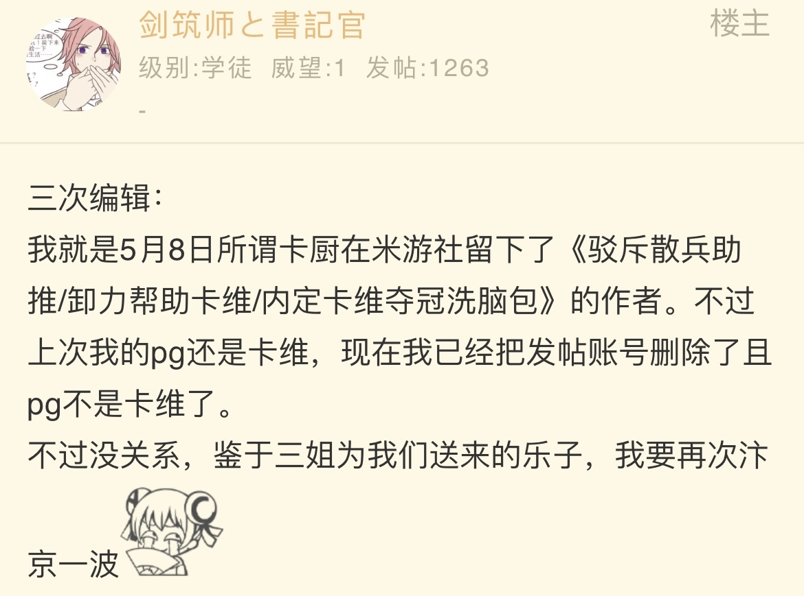

----

##### 62.[1] \<pid:706878331\> 2023-08-04 12:06:41 by 現實逃避_
第一輪比賽是第2名，第二輪比賽是第3名，都是2分
這就卡維佔琺露珊便宜.....

算吧你們繼續車吧........

----

##### 63.[0] \<pid:706879178\> 2023-08-04 12:10:41 by 白浪梅
>[jump](#pid706878331) 現實逃避_(2023-08-04 12:06)说:
>第一輪比賽是第2名，第二輪比賽是第3名，都是2分 這就卡維佔琺露珊便宜.....  算吧你們繼續車吧........

这个车点歪了和卡维剧情塑造客观有问题不矛盾

----

##### 64.[0] \<pid:706879501\> 2023-08-04 12:12:12 by 喵西斯
怎么大家都这么善良
我没看过须弥公告板，完全不知道有这么个人，主线结束突然空降一个角色出来吵架就让我印象很差。
内鬼资料卖惨还有一堆人跟着公情就让我的雷达嗡嗡响。你游“卖惨”没一个不恶心人的。
果不其然。
他这经历别说是在提瓦特一个虚幻大陆，放在三次元都不算惨。一个大男人，又没有遭受封建压迫，祥林嫂一样发散负能量，这年头这样也能叫惨了。

----

##### 65.[3] \<pid:706879863\> 2023-08-04 12:13:54 by 笑着选择原谅它
>[jump](#pid706879501) 喵西斯(2023-08-04 12:12) 说: 
>
>怎么大家都这么善良
>我没看过须弥公告板，完全不知道有这么个人，主线结束突然空降一个角色出来吵架就让我印象很差。
>内鬼资料卖惨还有一堆人跟着共情就让我的雷达嗡嗡响。你游“卖惨”没一个不恶心人的。
>果不其然。
>他这经历别说是在提瓦特一个虚幻大陆，放在三次元都不算惨。一个大男人，又没有遭受封建压迫，祥林嫂一样发散负能量，这年头这样也能叫惨了。

主线结尾大吵大闹真的很没教养！有些话攻击性太强我就不说了

----

##### 66.[0] \<pid:706880046\> 2023-08-04 12:14:39 by 安希雅_R4
我从一开始就感觉他要踩着海塑造。
一个在草神语音里就莫名其妙的高评价(反观对艾尔海森的评价就很……微妙)，感觉人都没出来就开始踩着艾尔海森踩一捧一了；
一个是柯莱的语音语音里说他会在吃饭的时候吐槽艾尔海森……感觉就……
当时我挺气的，心想你人都没出来就开始诋毁我海哥塑造了吗？
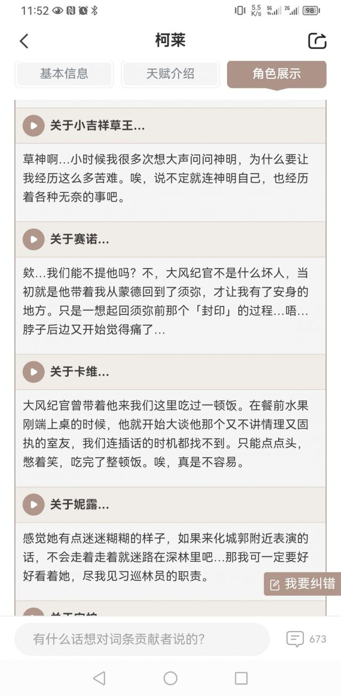
现在想起来……这是不是某种娇妻行为

这行为不就是娇妻跟人吐槽自己老公吗？
问题是，写手还能意识到他写的人是个男的，是个房客，而不是女的，娇妻吗？
卡维理论上应该是男人，艾尔海森理论上也不是他老公而是房东。他俩理论上应该没上过，因为艾尔海森那边的态度很正常……但是卡的表现仿佛跟海已经领过证一样的这算啥……
——真有大男人会跟别人婆婆妈妈念叨自己房东是个煞笔念叨一顿饭？大老爷们的自尊心会允许他们这么干？他不觉得自己的行为很炸裂？房东的名誉如何不知道，真有男人这么干他自己的名声是别想要了——“那个家伙特别婆妈跟个娘们似的”。

啊，还有一个更炸裂的
[提纳里对·艾·尔·海·森·的·语·音]

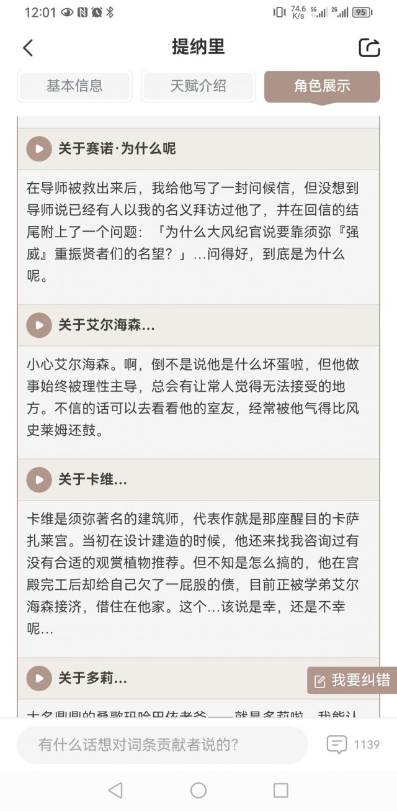
这是啥，这算啥，为什么一个人对你是他对另一个人的看法还要夹带第三人啊
整得跟小女生集团里互相说坏话似的，就不能正常的说提纳里[自·己·对·艾·尔·海·森的印象吗？
好吧……虽然艾尔海森对提纳里的语音也夹卡维，但好歹是“他救了卡维”这类很正常的说件事而已。
这一次毁三个人的塑造也没谁了，写手是平常生活有多无聊只有跟闺蜜聊天吹水这一种生活乐趣吗？魔女大妈会是不是也是你写的
还有卡维有多特殊到底，别人的语音都要夹带他。

----

##### 67.[0] \<pid:706880150\> 2023-08-04 12:15:09 by mASAYUMecHASIN
>[jump](#pid706878331) 現實逃避_(2023-08-04 12:06)说:
>第一輪比賽是第2名，第二輪比賽是第3名，都是2分 這就卡維佔琺露珊便宜.....  算吧你們繼續車吧........

好我记错了了我道歉，那把占便宜的部分全部删掉，他不还是在第一天唉声叹气、给珐姐甩脸子了？幸好文案够鸡贼，是让卡维给珐姐甩脸子，换成莱依拉，假如莱依拉一边道歉一边手足无措的话，是个人都发现不对劲了吧

----

##### 68.[0] \<pid:706880168\> 2023-08-04 12:15:13 by 宫萧语
>[jump](#pid706878331) 現實逃避_(2023-08-04 12:06) 说: 
>
>第一輪比賽是第2名，第二輪比賽是第3名，都是2分
>這就卡維佔琺露珊便宜.....
>
>算吧你們繼續車吧........

我没说什么占便宜啊，我就觉得他自己提出抽签，那没抽到他也不应该<b>当着珐露珊的面</b>emo，哭自己倒霉。

----

##### 69.[0] \<pid:706882465\> 2023-08-04 12:26:00 by 绽放于夜暮
卡维角色塑造已经乱七八糟了，原来我觉得海卡是欢喜冤家设定，但现在看来他们两个好像真的很真情实意地讨厌对方，海看上去真的是由内到外从上到下地鄙视卡维，但就卡维目前的剧情塑造真的很难让人服众，说是理想家却天天自怨自艾，最大的成绩是多莉帮他实现的却还怪人家不够好人，比赛要求海为他改规则，说好抽签输了又卖惨，沙漠救沙狐更是教科书式愚蠢小白花塑造，一边嘟囔要搬家一边生日信情意绵绵地一口一个我家，这个版本甚至连专业技能都拉了，这个人设到底怎么一回事

----

##### 70.[1] \<pid:706882662\> 2023-08-04 12:26:55 by 笑着选择原谅它
赛诺对此表示：提纳里和柯莱觉得卡维的亲身经历比我的冷笑话好笑
我不知道这是在暗示什么，希望下次卡解要是想吹卡维的人缘可以解读一下这句话

----

##### 71.[1] \<pid:706883313\> 2023-08-04 12:29:42 by 小王饼干
>[jump](#pid706882662) 笑着选择原谅它(2023-08-04 12:26) 说: 
>
>赛诺对此表示：提纳里和柯莱觉得卡维的亲身经历比我的冷笑话好笑
>我不知道这是在暗示什么，希望下次卡解要是想吹卡维的人缘可以解读一下这句话

放过全网最惨阿努比斯吧，赛命也命

----

##### 72.[0] \<pid:706885291\> 2023-08-04 12:39:06 by Sannae
>[jump](#pid706865416) 何時會有HE的存在(2023-08-04 11:14):

求求一个地址！没搜索出来

----

##### 73.[3] \<pid:706885336\> 2023-08-04 12:39:18 by 断裂的尾巴
>[jump](#pid706863324) 小王饼干(2023-08-04 11:05) 说: 
>
>不是，3.1留言板吵架的时候，我真嗑过，当时我还单推艾尔海森现在想来有种地狱到家了的美

谁还不是个被留言板蒙骗的海推呢甚至3.4角色演示出来的那时候我还想着海森在须弥也有很多朋友了过得真好，他开心就好，卡维虽然还没什么塑造但是能作为海森的“镜子”也能有可取之处吧，谁知道我会被无休止的小学鸡吵架和老赖创飞呢

----

##### 74.[0] \<pid:706886082\> 2023-08-04 12:43:02 by 晓音requiem
我当初V1在内鬼网看完他的档案，我去写了一篇人物分析，以月亮与六便士为题目，很认真的写了长文考据
然后我等到他实装在池子的那一个点发了帖，抽了，拉满了，然后退坑了
剧情我让朋友帮过的，中途撇了两眼，果然一坨狗屎，算了，就让那个金灿灿的大建筑师活在档案里，活在我曾经写的作品里，现在这个娇妻我不认识

----

##### 76.[0] \<pid:706887732\> 2023-08-04 12:51:27 by 太空一号旅行者
还有3.6活动里的，说卡维受苦，这话好像居然还是从珐姐的语言侧面说的(记不太清了)，但是卡维是晕倒，珐姐是掉进遗迹一天走完了别人一个星期的路，她俩到底谁更苦啊，啊？

----

##### 77.[2] \<pid:706888138\> 2023-08-04 12:53:41 by 星辰大海23333
懂不懂“其他cp”的含金量啊

----

##### 78.[2] \<pid:706888238\> 2023-08-04 12:54:10 by 今锁朱楼
>[jump](#pid706887732) 太空一号旅行者(2023-08-04 12:51)说:
>还有3.6活动里的，说卡维受苦，这话好像居然还是从珐姐的语言侧面说的(记不太清了)，但是卡维是晕倒，珐姐是掉进遗迹一天走完了别人一个星期的路，她俩到底谁更苦啊，啊？

珐姐设定就是完全的卡维上位，经历更惨举目无亲课题被认为没有价值(这也是个理想主义者)还申不到研究经费，就这样人家也没有自暴自弃，而是努力地过好生活，还身体力行地去进行扫盲教育。
反观卡维

----

##### 79.[0] \<pid:706890118\> 2023-08-04 13:03:57 by KingreyShawn
>[jump](#pid706880046) 安希雅_R4(2023-08-04 12:14) 说: 
>
>我从一开始就感觉他要踩着海塑造。
>  
>一个在草神语音里就莫名其妙的高评价(反观对艾尔海森的评价就很……微妙)，感觉人都没出来就开始踩着艾尔海森踩一捧一了；
>一个是柯莱的语音语音里说他会在吃饭的时候吐槽艾尔海森……感觉就……
>当时我挺气的，心想你人都没出来就开始诋毁我海哥塑造了吗？
>
>现

说出我心声了属于是……我就是看文案感觉到卡维这个人设是要拉海森垫背来塑造，所以一开始我对他观感就很微妙，再加上他和海森塑造时联系太紧密了让我不得不关注到他，然后……然后我就被他雷倒了，因为我发现好像整个须弥上自草神下自无名NPC甚至是一次性的限时活动NPC全都被拉来给他背书这到底是个什么人物怎么塑造全靠人给他喊口号的

----

##### 80.[0] \<pid:706890187\> 2023-08-04 13:04:16 by 空白模糊的未来
我当年看小草对卡维的评价，还以为他和海哥是对照组，海是先顾好自己再兼顾天下人，卡维是以天下人为先不顾自己，虽然现在也差不多，但那个时候我可不知道海哥给卡维兜底也不知道卡维心理脆弱啊，我还以为他就是以天下人为先即使自己没好处也乐呵呵的而且不需要别人兜底，和海的争吵也是因为理念不同而非这种鸡毛蒜皮的小事，难道如今自毁真是一种时尚单品？米到底写了啥啊？

----

##### 82.[0] \<pid:706891056\> 2023-08-04 13:08:34 by 霜鸠0102
卡维要是真搬出去我就对他改观，这个要求不过分吧

----

##### 83.[0] \<pid:706891539\> 2023-08-04 13:10:54 by sunshine23334
>[jump](#pid706891056) 霜鸠0102(2023-08-04 13:08) 说: 
>
>卡维要是真搬出去我就对他改观，这个要求不过分吧

他搬出去我要狠狠嘲笑，说“我们家”的气势哪去了

----

##### 84.[0] \<pid:706891635\> 2023-08-04 13:11:22 by 我永远喜欢神乃木庄龙
我本人…

----

##### 85.[1] \<pid:706893346\> 2023-08-04 13:19:53 by zhy68872
>[jump](#pid706880046) 安希雅_R4(2023-08-04 12:14) 说: 
>
>我从一开始就感觉他要踩着海塑造。
>  
>一个在草神语音里就莫名其妙的高评价(反观对艾尔海森的评价就很……微妙)，感觉人都没出来就开始踩着艾尔海森踩一捧一了；
>一个是柯莱的语音语音里说他会在吃饭的时候吐槽艾尔海森……感觉就……
>当时我挺气的，心想你人都没出来就开始诋毁我海哥塑造了吗？
>
>现

离谱一个四处说室友坏话的极品室友跃然纸上
上了楼知道他乱拿室友东西，现在又知道他还四处说室友坏话……
文案带入的是“我的极品室友”吗？

----

##### 86.[0] \<pid:706894703\> 2023-08-04 13:27:11 by UID43055609
沙漠修建一座月女城和沙漠修复一座游乐园带来的观感可是一个天一个地

----

##### 87.[0] \<pid:706896087\> 2023-08-04 13:34:18 by Kaekaekae
那我比较刻薄，过3.2主线看到这个吵吵嚷嚷的人我就烦他烦得要死，后来的塑造也没让我失望，果然是个废物

----

##### 88.[1] \<pid:706921239\> 2023-08-04 15:37:10 by Ales1a_
自从爆出“我们家”的金句之后，我对他理想型人格仅有的一点欣赏也无了。

----

##### 89.[3] \<pid:706922418\> 2023-08-04 15:42:36 by 空白退散
我曾经年少无知开了个楼说卡维塑造有问题，然后被海卡姐冲了九百多楼  

我才知道这原来是不能说的

----

##### 90.[0] \<pid:706923791\> 2023-08-04 15:48:55 by 天星之愿
同样卡维厨，我还吃cp，然后随着剧情塑造越来越出脑
说真的，作为须弥唯二俩成男，哪怕他俩没关系cp也能拉郎起来，结果mhy要卖，卖就算了，还写的难看。海哥先出场加主线剧情还算有独立塑造，卡维那真是出场绑定死。然后卡维所有剧情全部围绕cp来写，难得单独和其他角色或者玩家交流，要么三句不离海哥，要么就是在倒苦水，应该有的闪光点只存在于设定里
现在完全是声优为内田弟+外貌让我还能继续爱他，不过人设性格在我这已经是oc了

----

##### 91.[0] \<pid:706924282\> 2023-08-04 15:51:20 by 不太好吃
>[jump](#pid706922418) 空白退散(2023-08-04 15:42) 说: 
>
>我曾经年少无知开了个楼说卡维塑造有问题，然后被海卡姐冲了九百多楼  
>
>我才知道这原来是不能说的

3.8之前……每一个说卡维有问题的楼都活不过去，尤其3.6那阵子，甚至不像散兵，散解撒泼打滚的时候甚至还能跟你说说剧情试图洗地，卡解是什么剧情塑造我都不知道，你不理解卡维是你有毛病

----

##### 92.[0] \<pid:706924829\> 2023-08-04 15:54:04 by 子夜歌QAQ
能吃的下去有怪味的东西的人，本身也好不到哪去

----

##### 93.[1] \<pid:706925391\> 2023-08-04 15:56:45 by 链接失效
当初3.6看到卡维送小动物而拖延了比赛那种拎不清轻重缓急的样子，还共情过的。
记得在B站刷到分析这种心理状态其实也是自恋的表现，由此深刻反思过自己。
总的来说多少对卡维有一点好感，因为对米家角色塑造深度无期待所以并没察觉到角色设定空洞的问题。但是有一点不满主要是对于卡身上一些建筑设计者的完全不着边的tag感到无语。
因为抽到快大保底都没抽到卡维也没搜过语音传记，只觉得卡维人气应该不错的。今天看到车好奇点进来才发现这个人物的问题。
很多表现上，人物行为并没有跟上他的理想主义标签，试想一个因为不优先拯救小动物生命而会愧疚的人怎么会觉得拖欠别人的钱心安理得，类似白拿海森酒之类的我穷我有理的行为跟想塑造的卡维还是很割裂的。欠债是卡自己主观原因造成的，要别人来给自己理想买单确实挺让人观感不好。
不过嘛，对于我这种没找过组织、混乱中立埋头纯吃肉选手一开始还是只看hk粮的，最后hkh乱吃了。
反正同人OOC也不是一两天了，大多都是脑内二创吧，已经跟原型除了名字和外型没什么关系了。虽然我朋友天天叫我吃点好的，但是鱼和熊掌不可兼得，我已经把精神需求和xp需求拆开了。hkh感情线人设一概不能细想，默认这是俩皮套人。

----

##### 94.[0] \<pid:706925677\> 2023-08-04 15:58:08 by 剑筑师と書記官
>[jump](#pid706924282) 不太好吃(2023-08-04 15:51) 说: 
>
>3.8之前……每一个说卡维有问题的楼都活不过去，尤其3.6那阵子，甚至不像散兵，散解撒泼打滚的时候甚至还能跟你说说剧情试图洗地，卡解是什么剧情塑造我都不知道，你不理解卡维是你有毛病

记得3.5在油液有“锁哥”的称号，因为印象里没有一个能活下来

----

##### 95.[0] \<pid:706927014\> 2023-08-04 16:04:12 by kiyota119
哦说起这个塑造，之前有一个嗑这个的人跟我抱怨说这cp点赞高的都是她觉得特别弱智的捡手机文学啥的，“有一个真正解读角色内核、灵魂伴侣相惜”的太太热度却不高
当时我还安慰说，原的受众普遍爱捡手机
现在我想对她说，有没有可能，ooc的是你们这帮往文思哲灵魂伴侣上扯的“大文学家”
这同人的矛盾就是，原作贫瘠但猛干的塑造水平，与，同人女内心无处发泄的丰富情感，之间的鸿沟

----

##### 96.[1] \<pid:706929273\> 2023-08-04 16:15:18 by 历经沧桑成神经
简单来说，卡维这个人物几乎所有违和崩坏的点都基于“他要和海哥捆绑麦麸”这个前提，试想一下，如果他没和海哥住在一起，两个人只是立场不同的朋友，互相尊重，辩证的看待对方(参考赛提)，卡维很多违和感就消失了，包括他和海哥毫无营养的吵架，不尊重海哥的话，寄居蟹行为，还没有任何社交尺度没礼貌行为，都是因为他要“麦麸”。
同理海哥，卡维没出场前的海哥是最有魅力的。
麦麸毁一生。

----

##### 97.[0] \<pid:706929600\> 2023-08-04 16:16:58 by 子苏郝庚臧余
其实吧我觉得本质就是须弥人塑造，在3.3之后，基本已经停滞了，除了出的一些传说和邀约
唯一有塑造的就是3.6的活动，但是活动写的真的一坨
3.6的剧情，如果站在打工人角度，为什么说卖的差呢，可以说3.6的版本活动，围绕着卡维有以下这几点KPI:
1. 把卡维的身世和“理想主义&quot;介绍给玩家
2. 产生剧情冲突，卡维需要一个参赛的动机，动机是搬家的话，写吵架可以顺便卖腐
3. (从彩蛋推测的)在海卡线写理想主义和现实主义的冲突

但说实话我觉得写3.6的文案都不一定通读过卡维个人故事。。他文案里的理想主义明明根本不只是内疚心代偿、做善事不顾自己这点，更多的是对美学的追求和现实条件的限制这点上。而且他的善意也不全是因为负罪感，他个人故事里也有写过关于才能的争论，个人故事里的观点更偏向“人类是知识的载体，虽然能力有差距，但是如果我能扶一把的话可以让所有人都获得更好的结局”，所以他在那个论文流产之前，在尽力去帮能力不足的同学，因为他相信把知识和人类这个载体割裂不是正确的选择，再加上自己澎湃的同理心
当然结果是他失败了，但其实如果能延续这个塑造也是一个挺有趣的角色的。但可惜活动写的什么(

而且我觉得他们是真的不会写立场冲突的争执是怎么样的，不是吵点鸡毛蒜皮的小事就是立场争论的。。

总而言之，我觉得他的个人故事给了我很高的期待吧，卖不卖腐倒是其次，感觉活动文案确实没有承担起塑造角色的能力，比起2.x版本都某些塑造真的差多了(直接说吧，2.3雪山塑造的abd吊打3.x活动文案的所有角色塑造)

----

##### 98.[0] \<pid:706930817\> 2023-08-04 16:22:41 by 风听沙白
海哥和卡维那个所谓的对照组突出一个不明所以……
真要跟海哥对照组，我觉得不管是妮露还是赛诺都更适合
这两位不论是“理想主义”还是“我为他人”起码在剧情塑造上都对得上，而不是虚浮贴了个标签但剧情南辕北辙
而且人家两位在达成自己理想的路上坚定不移从来不自怨自艾也没干出来慷他人之慨的事儿

----

##### 99.[0] \<pid:706931923\> 2023-08-04 16:27:47 by 子夜歌QAQ
题外话，为什么共情卡维是自恋的表现，我觉得自恋的人不应该直接代入海森吗，抛开大家聊的卡维剧情隔离的部分，各方面逼格也是海森更高啊，都自恋了你还不吃点好的

----

##### 100.[4] \<pid:706932305\> 2023-08-04 16:29:30 by 庚傅任甲范穆
>[jump](#pid706930817) 风听沙白(2023-08-04 16:22)说:
>海哥和卡维那个所谓的对照组突出一个不明所以…… 真要跟海哥对照组，我觉得不管是妮露还是赛诺都更适合[s:ac:哭笑] 这两位不论是“理想主义”还是“我为他人”起码在剧情塑造上都对得上，而不是虚浮贴了个标签但剧情南辕北辙[s:ac:怕] 而且人家两位在达成自己理想的路上坚定不移从来不自怨自艾也没干出来慷他人之慨的事儿[s:ac:哦]

赛诺、妮露、迪希雅、提纳里，甚至多莉，哪个不是在为了自己的理想坚定不移，哪个不是勇敢对抗现实阻碍的战士，当然他们和艾尔海森有没有形成对照组我不好说，但艾尔海森独身一人能把自己的生活过得安定美好确实跟卡维这个寄居蟹水平形成了鲜明对照

----

##### 101.[2] \<pid:706932947\> 2023-08-04 16:32:20 by 今锁朱楼
>[jump](#pid706931923) 子夜歌QAQ(2023-08-04 16:27):

卡维我个人觉得有种wb小画师的感觉，就是天天感动天天破防天天觉得自己被害自己好无辜，然后一翻发言记录骂人比谁都多的那种。
定下一个纯洁无辜的人设，但是不干人事，能共情的也差不多吧。

----

##### 102.[0] \<pid:706933445\> 2023-08-04 16:34:31 by 一只扁扁
恕我直言，说和卡维这样的理想主义者共情，到还不如说是和那些个觉得自己写的都是精品都是艺术但是曲高和寡你们都不懂都欣赏不来才不被赏识的sb米家文案们共情。

----

##### 103.[0] \<pid:706934751\> 2023-08-04 16:40:06 by lien11
>[jump](#pid706931923) 子夜歌QAQ(2023-08-04 16:27):

这个自恋感觉是代入自己这么烂也会有高富帅超爱它的心态。即使普通人有缺点也终会有一天遇到愿意为他付出的人，这种题材写的好的比如隔壁fate，mhy写出来的就是惨圈妹无病呻吟从青山医院出来对着周围人发疯pua

----

##### 104.[0] \<pid:706935184\> 2023-08-04 16:42:03 by 叉车佬安康鱼
隔壁帖子怎么又没了

----

##### 105.[0] \<pid:706935299\> 2023-08-04 16:42:36 by axv_ytw
>[jump](#pid706925391) 链接失效(2023-08-04 15:56) 说: 
>
>当初3.6看到卡维送小动物而拖延了比赛那种拎不清轻重缓急的样子，还共情过的。
>记得在B站刷到分析这种心理状态其实也是自恋的表现，由此深刻反思过自己。
>总的来说多少对卡维有一点好感，因为对米家角色塑造深度无期待所以并没察觉到角色设定空洞的问题。但是有一点不满主要是对于卡身上一些建筑设计者的完全不着边的tag感到无语。
>因为抽到快大保底都没抽到卡维也没搜过语音传记，只觉得卡维人气应该不错的。今天看到车好奇点进来才发现这个人物的问题。
>很多表现上，人物行为并没有跟上他的理想主义标签，试想一个因为不优先

呃，卡好像真的是米内部策划的皮套人……

----

##### 106.[1] \<pid:706935396\> 2023-08-04 16:43:01 by Kaekaekae
>[jump](#pid706935184) 叉车佬安康鱼(2023-08-04 16:42) 说: 
>
>隔壁帖子怎么又没了

那个蟑螂一出现就没了

----

##### 107.[0] \<pid:706935671\> 2023-08-04 16:44:18 by レオ
>[jump](#pid706935396) Kaekaekae(2023-08-04 16:43) 说: 
>
>那个蟑螂一出现就没了

我就留了两句评
怕不是lz盯着想精准隐我，何必

----

##### 108.[1] \<pid:706935826\> 2023-08-04 16:44:57 by 剑筑师と書記官
>[jump](#pid706935396) Kaekaekae(2023-08-04 16:43) 说: 
>
>那个蟑螂一出现就没了

捏妈妈的……我还就想说咋回事，还是那个人吗

----

##### 109.[2] \<pid:706936012\> 2023-08-04 16:45:52 by sunshine23334
又来了又来了，阴魂不散

----

##### 110.[0] \<pid:706936135\> 2023-08-04 16:46:26 by 大碗番茄炒鸡拌饭
怎么又来了，真就蟑螂到处飞呗

----

##### 111.[4] \<pid:706936170\> 2023-08-04 16:46:34 by 米翼
>[jump](#pid706935671) レオ(2023-08-04 16:44) 说: 
>
>我就留了两句评
>怕不是lz盯着想精准隐我，何必

lz…？隔壁lz好惨

另外这楼看样子也是保不住了，什么全自动毁楼机

----

##### 112.[1] \<pid:706936322\> 2023-08-04 16:47:14 by 剑筑师と書記官
>[jump](#pid706936170) 米翼(2023-08-04 16:46) 说: 
>
>lz…？隔壁lz好惨
>
>另外这楼看样子也是保不住了，什么全自动毁楼机

全自动レオ，有股仙的味道了

----

##### 113.[0] \<pid:706936393\> 2023-08-04 16:47:39 by 就随便起了个名字
隔壁帖子又没了一个？
我就说我怎么没刷出来呢

----

##### 114.[0] \<pid:706936416\> 2023-08-04 16:47:42 by 神乐苍籁
别回她了，免得楼又炸了

----

##### 115.[0] \<pid:706936626\> 2023-08-04 16:48:37 by レオ
>[jump](#pid706936170) 米翼(2023-08-04 16:46) 说: 
>
>lz…？隔壁lz好惨
>
>另外这楼看样子也是保不住了，什么全自动毁楼机

为了兼顾护楼+能畅所欲言聊我，要不你们去外面开个楼聊我，这样这楼也不会炸

----

##### 116.[5] \<pid:706936810\> 2023-08-04 16:49:22 by 0123cola
>[jump](#pid706929273) 历经沧桑成神经(2023-08-04 16:15):

别的典不说，就光那个妙论派之光的设定，拉一堆自机npc给他的成就背书，那按理说就算欠了债，接几个项目也赚回来了，甚至应该有一堆人请着他去，结果为了让他“想搬又不能搬出去”找了各种理由让他没钱，问题他是个毕业了好几年的成年人啊，想象一下现实里一个全国知名的建筑设计师连欠款和房租都不能按时还还住在别人家里，就这一点就很难不怀疑这个人是不是有什么毛病。怀疑本质上是为了麦麸，同居才是这个角色设定的根，其他的什么大建筑师理想主义都是贴上去的，所以才会觉得设定这么虚还时不时自相矛盾，甚至生日信演都不演了，呃呃

----

##### 117.[8] \<pid:706936818\> 2023-08-04 16:49:25 by 历经沧桑成神经
别搭理她了前面那个楼围观过就知道这个人最后已经没脸没皮了

----

##### 118.[0] \<pid:706936882\> 2023-08-04 16:49:42 by 叉车佬安康鱼
怎么做才能让帖子留下来？我正经写一篇《管中窥豹，三流文案的自我感动和逻辑混乱——从剧情分析卡维塑造的全面失败》论文能在理查活下来吗

----

##### 119.[4] \<pid:706936898\> 2023-08-04 16:49:48 by 米翼
>[jump](#pid706936416) 神乐苍籁(2023-08-04 16:47) 说: 
>
>别回她了，免得楼又炸了

确实，不得不说之前有层主说的锁哥这个称呼太合适了，这水冲的比其他还猛啊

----

##### 120.[1] \<pid:706937195\> 2023-08-04 16:51:12 by 青禾木
楼里一眼会飞的蟑螂…  大家别理这人了

----

##### 121.[1] \<pid:706937242\> 2023-08-04 16:51:21 by lien11
>[jump](#pid706936882) 叉车佬安康鱼(2023-08-04 16:49)说:
>[s:ac:哭笑]怎么做才能让帖子留下来？我正经写一篇《管中窥豹，三流文案的自我感动和逻辑混乱——从剧情分析卡维塑造的全面失败》论文能在理查活下来吗

不行，可能要mhy给你稿费才行

----

##### 122.[4] \<pid:706937270\> 2023-08-04 16:51:28 by bwzkuc233

卡维sfw是真的多。
之前刷到过一些海卡二创，呃，不能说全部，但大多数都浓浓的霸总娇妻味儿。

----

##### 123.[4] \<pid:706937304\> 2023-08-04 16:51:38 by 剑筑师と書記官
>[jump](#pid706936898) 米翼(2023-08-04 16:49) 说: 
>
>确实，不得不说之前有层主说的锁哥这个称呼太合适了，这水冲的比其他还猛啊

锁哥这称呼我记得是绿洲给起的，我只是素材复用

同样的还有 百变卡维

----

##### 124.[3] \<pid:706937309\> 2023-08-04 16:51:39 by 米翼
>[jump](#pid706936882) 叉车佬安康鱼(2023-08-04 16:49) 说: 
>
>怎么做才能让帖子留下来？我正经写一篇《管中窥豹，三流文案的自我感动和逻辑混乱——从剧情分析卡维塑造的全面失败》论文能在理查活下来吗

我想看这种带原文正经分析的请务必写出来

----

##### 125.[8] \<pid:706937325\> 2023-08-04 16:51:43 by 奶糖包
护楼小助手舍身提醒大家注意跨栏自动毁楼生物，请不要骂他给他提供情绪价值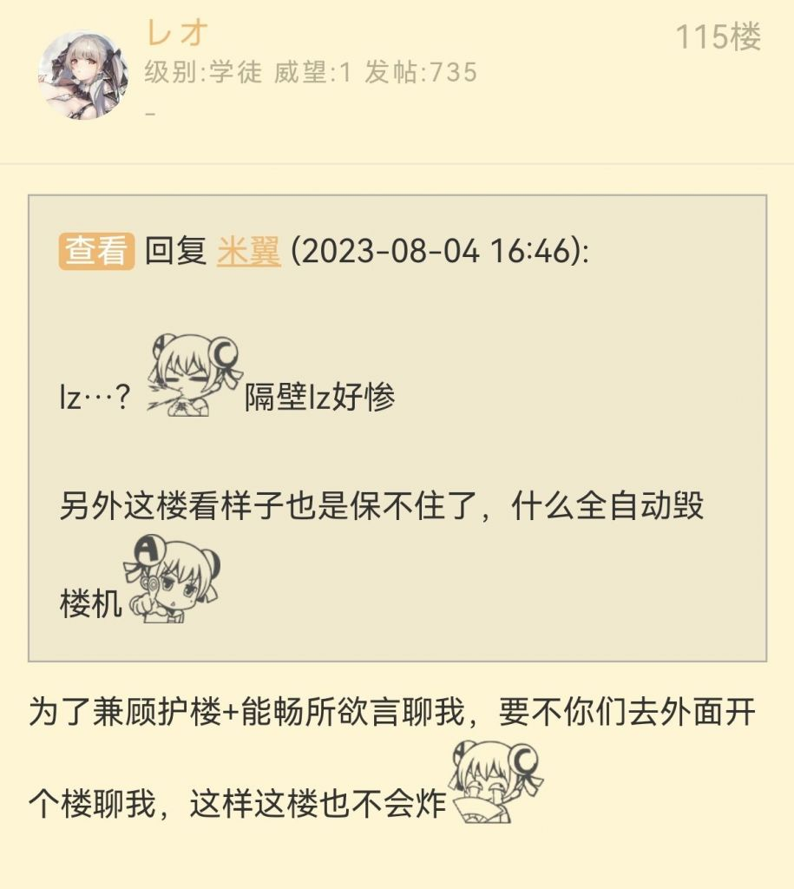

----

##### 126.[7] \<pid:706937341\> 2023-08-04 16:51:47 by 南海狒狒王
别理她啊，大家都别回她一句话，就当回她一句话自推跟卡维贴贴一次

----

##### 127.[0] \<pid:706937386\> 2023-08-04 16:52:01 by sunshine23334
>[jump](#pid706936882) 叉车佬安康鱼(2023-08-04 16:49) 说: 
>
>怎么做才能让帖子留下来？我正经写一篇《管中窥豹，三流文案的自我感动和逻辑混乱——从剧情分析卡维塑造的全面失败》论文能在理查活下来吗

支持大佬作品，我会手快一点截图的

----

##### 128.[0] \<pid:706937417\> 2023-08-04 16:52:10 by 风听沙白
建议直接屏蔽，别搭理，让他自己打滚呗。

----

##### 129.[2] \<pid:706937445\> 2023-08-04 16:52:18 by 叉车佬安康鱼
>[jump](#pid706937242) lien11(2023-08-04 16:51) 说: 
>
>不行，可能要mhy给你稿费才行

理查有没有创作激励啊

----

##### 130.[1] \<pid:706937566\> 2023-08-04 16:52:50 by 米翼
>[jump](#pid706936810) 0123cola(2023-08-04 16:49) 说: 
>
>别的典不说，就光那个妙论派之光的设定，拉一堆自机npc给他的成就背书，那按理说就算欠了债，接几个项目也赚回来了，甚至应该有一堆人请着他去，结果为了让他“想搬又不能搬出去”找了各种理由让他没钱，问题他是个毕业了好几年的成年人啊，想象一下现实里一个全国知名的建筑设计师连欠款和房租都不能按时还还住在别人家里，就这一点就很难不怀疑这个人是不是有什么毛病。怀疑本质上是为了麦麸，同居才是这个角色设定的根，其他的什么大建筑师理想主义都是贴上去的，所以才会觉得设定这么虚还时不时自相矛盾，甚至生日信演都不演了，呃

生日信让本就摇摇欲坠的人设雪上加霜直接崩了还记得那个热评，之后他再说自己要搬出去，真的会看不起他，我也这样想的

----

##### 131.[0] \<pid:706937582\> 2023-08-04 16:52:54 by nonaligned9888
大佬又要写了吗，期待了

----

##### 132.[0] \<pid:706937650\> 2023-08-04 16:53:14 by 梅花鹿嘉宾
>[jump](#pid706936882) 叉车佬安康鱼(2023-08-04 16:49)说:
>[s:ac:哭笑]怎么做才能让帖子留下来？我正经写一篇《管中窥豹，三流文案的自我感动和逻辑混乱——从剧情分析卡维塑造的全面失败》论文能在理查活下来吗

热知识：叉佬的1.5w在桓那兰那专版

----

##### 133.[1] \<pid:706937658\> 2023-08-04 16:53:16 by 大碗番茄炒鸡拌饭
说起卡的印象变化，卡解和嗨卡解是功不可没只能说物随主人形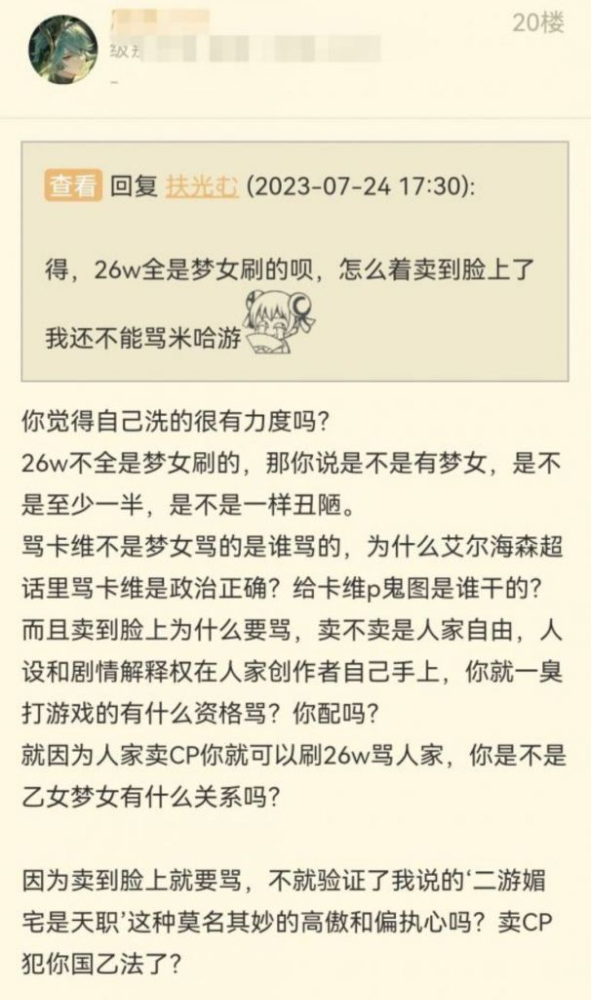

----

##### 134.[0] \<pid:706937730\> 2023-08-04 16:53:36 by レオ
>[jump](#pid706937195) 青禾木(2023-08-04 16:51) 说: 
>
>楼里一眼会飞的蟑螂…  大家别理这人了

我都提议我的事你们单开个楼去聊了这样也不会炸楼，反而我一出来你们就在这里像雨后春笋一样冒出来应激好多层楼才是在毁楼吧。。

----

##### 135.[10] \<pid:706937886\> 2023-08-04 16:54:18 by lien11
犹记得当时自封锁哥它们相当自豪，开口就是总有刁民害它，里里外外透露一种烫烫的很安心的自信

----

##### 137.[5] \<pid:706937932\> 2023-08-04 16:54:30 by plume-羽
>[jump](#pid706936882) 叉车佬安康鱼(2023-08-04 16:49) 说: 
>
>怎么做才能让帖子留下来？我正经写一篇《管中窥豹，三流文案的自我感动和逻辑混乱——从剧情分析卡维塑造的全面失败》论文能在理查活下来吗

大佬发不发知乎，说不定还能搞个3000呢。支持大佬。

----

##### 138.[0] \<pid:706937964\> 2023-08-04 16:54:39 by 叉车佬安康鱼
>[jump](#pid706937650) 梅花鹿嘉宾(2023-08-04 16:53) 说: 
>
>热知识：叉佬的1.5w在桓那兰那专版

理查不参加吗

----

##### 139.[0] \<pid:706938171\> 2023-08-04 16:55:31 by 青禾木
>[jump](#pid706936882) 叉车佬安康鱼(2023-08-04 16:49) 说: 
>
>怎么做才能让帖子留下来？我正经写一篇《管中窥豹，三流文案的自我感动和逻辑混乱——从剧情分析卡维塑造的全面失败》论文能在理查活下来吗

感觉危呀

----

##### 140.[0] \<pid:706938235\> 2023-08-04 16:55:45 by 庚彭史辛文吕
隔壁那个高楼是被锁了好像 我打好的回复发不出去
我应该就是那个“模拟器抽卡维抽出焦虑”的。。。不过不是焦虑，而是年轻人没为四星下过池，感叹下期望抽数
原本是个卡厨 但随着后续版本更新以及细读剧情后。。。
剧情和海森绑定真的太深了，而且我求求你海哥这种一针见血指出病痛的人你还嘴得这么暴躁你想干嘛？明明是自己的责任结果抱怨恩人多莉是想干嘛？对朋友和陌生人真的就是负面情绪集合体，我是真的无语

又通过坛友得知了部分卡厨的逆天，吓人真是

----

##### 141.[2] \<pid:706938257\> 2023-08-04 16:55:50 by nonaligned9888
她们下次可不可以换自家头像啊
拉瓜踩瓜还用海哥头像啊，怎么，自家拿不出手丢人现眼是吗>[jump](#pid706937658) 大碗番茄炒鸡拌饭(2023-08-04 16:53) 说: 
>
>说起卡的印象变化，卡解和嗨卡解是功不可没只能说物随主人形

----

##### 142.[0] \<pid:706938261\> 2023-08-04 16:55:51 by 子夜歌QAQ
>[jump](#pid706937964) 叉车佬安康鱼(2023-08-04 16:54) 说: 
>
>理查不参加吗

理查帖子飘不了多久就被冲走了吧

----

##### 143.[0] \<pid:706938370\> 2023-08-04 16:56:18 by 大碗番茄炒鸡拌饭
>[jump](#pid706936882) 叉车佬安康鱼(2023-08-04 16:49) 说: 
>
>怎么做才能让帖子留下来？我正经写一篇《管中窥豹，三流文案的自我感动和逻辑混乱——从剧情分析卡维塑造的全面失败》论文能在理查活下来吗

佬发知乎吧，下一个3000指日可待

----

##### 144.[0] \<pid:706938536\> 2023-08-04 16:57:03 by lien11
理查冲水的，烟消云散了都哪来的稿费呀

----

##### 145.[0] \<pid:706938616\> 2023-08-04 16:57:19 by 就随便起了个名字
>[jump](#pid706936882) 叉车佬安康鱼(2023-08-04 16:49) 说: 
>
>怎么做才能让帖子留下来？我正经写一篇《管中窥豹，三流文案的自我感动和逻辑混乱——从剧情分析卡维塑造的全面失败》论文能在理查活下来吗

要不然在知乎准备个备份~~顺便看看还能不能薅米这个铁公鸡一点毛~~

----

##### 146.[5] \<pid:706938963\> 2023-08-04 16:58:48 by 叉车佬安康鱼
>[jump](#pid706937932) plume-羽(2023-08-04 16:54) 说: 
>
>大佬发不发知乎，说不定还能搞个3000呢。支持大佬。

我一直奇怪为什么没有人认真车卡维的问题，明明撇开cp掐架这个角色也毫无可取之处啊，而且某个角色对我游戏体验造成的影响和他的星级又无关，在于他的剧情在游戏中的占比，在于会不会强迫我看四星难道就不配得到好塑造吗，四星拉了就不配车吗

----

##### 147.[0] \<pid:706938996\> 2023-08-04 16:58:55 by 梅花鹿嘉宾
>[jump](#pid706937964) 叉车佬安康鱼(2023-08-04 16:54):

我的意思是，理查自由搏击的风气较重，锁隐门槛小，不想被gank的话桓那兰那版也是可以发的，不一定会被移回来
而且大家觉得好的话理查肯定会开传送门，不用担心没人看

----

##### 148.[0] \<pid:706939227\> 2023-08-04 16:59:51 by moonlight34
又锁了一楼太吓人了真是个神奇的角色，明明写的烂还要冒烟，怕不是真的有内部套皮偷窥

----

##### 149.[5] \<pid:706939473\> 2023-08-04 17:00:56 by lien11
>[jump](#pid706938963) 叉车佬安康鱼(2023-08-04 16:58)说:
>[quote][pid=706937932,37253244,7]Reply[/pid] <b>Post by [uid=65135145]plume-羽[/uid] (2023-08-04 16:54):</b>  大佬发不发知乎，说不定还能搞个3000呢。支持大佬。[s:ac:羡慕][/quote][s:ac:哭笑]我一直奇怪为什么没有人认真车卡维的问题，明明撇开cp掐架这个角色也毫无可取之处啊，而且某个角色对我游戏体验造成的影响和他的星级又无关，在于他的剧情在游戏中的占比，在于会不会强迫我看[s:ac:哭笑]四星难道就不配得到好塑造吗，四星拉了就不配车吗

佬，看看今天还不明显吗，不懂卡维是一款玩家的问题，车老赖要被打滚一上午锁楼的，涉及到他没的楼见过的都两位数了

----

##### 150.[5] \<pid:706940002\> 2023-08-04 17:03:19 by 奶糖包
>[jump](#pid706938963) 叉车佬安康鱼(2023-08-04 16:58) 说: 
>
>我一直奇怪为什么没有人认真车卡维的问题，明明撇开cp掐架这个角色也毫无可取之处啊，而且某个角色对我游戏体验造成的影响和他的星级又无关，在于他的剧情在游戏中的占比，在于会不会强迫我看四星难道就不配得到好塑造吗，四星拉了就不配车吗

之前追过两个车卡维人设的帖子，里面有很多有理有据的回复，但是都被卡嬷追进来打滚几十页就隐藏了，所以其实不是没人车而是他没有小草那样曾经真爱过又清醒过来的粉费心力整合长文吧

----

##### 151.[1] \<pid:706940076\> 2023-08-04 17:03:39 by 鱼鸟_____
可以说吗，因为马哈鱼卖嗨卡和卡sfw天天打滚捆绑觉得海人格魅力被拉低了，海沾上卡某种程度也是悲哀

----

##### 152.[0] \<pid:706940149\> 2023-08-04 17:03:57 by 花舞苍天
>[jump](#pid706925677) 剑筑师と書記官(2023-08-04 15:58) 说: 
>
>记得3.5在油液有“锁哥”的称号，因为印象里没有一个能活下来

那个啊，起因是因为卡解隔三差五在永恒绿洲发贴桃五星，然后又把说卡是四星的谭友打成海解乙解或者辱角色，所以bw锁的很快，卡解就以为bw针对她们，当初其他在永恒绿洲那会儿满屏都是起名贴，卡解有样学样在绿洲狂刷卡维的帖子灌水，甚至当初有个帖子蹭尘世之锁和归终，那帖子里一群卡解狂欢还在那里狂甩锅钟厨海厨
顺便放一些当初的逆天言论，啊对对对都是五星男角色和他们厨子的错你家是无辜小白花呢

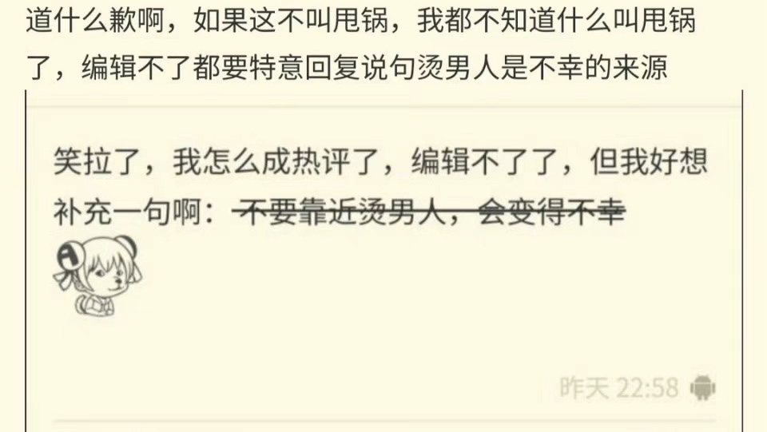

----

##### 153.[6] \<pid:706940307\> 2023-08-04 17:04:37 by 叉车佬安康鱼
>[jump](#pid706940002) 奶糖包(2023-08-04 17:03) 说: 
>
>之前追过两个车卡维人设的帖子，里面有很多有理有据的回复，但是都被卡嬷追进来打滚几十页就隐藏了，所以其实不是没人车而是他没有小草那样曾经真爱过又清醒过来的粉费心力整合长文吧

我见过的每个帖子都锁了

----

##### 154.[4] \<pid:706940434\> 2023-08-04 17:05:11 by 乙师苑辰邱梅
>[jump](#pid706937658) 大碗番茄炒鸡拌饭(2023-08-04 16:53) 说: 
>
>说起卡的印象变化，卡解和嗨卡解是功不可没只能说物随主人形

我觉得，不如这个好笑

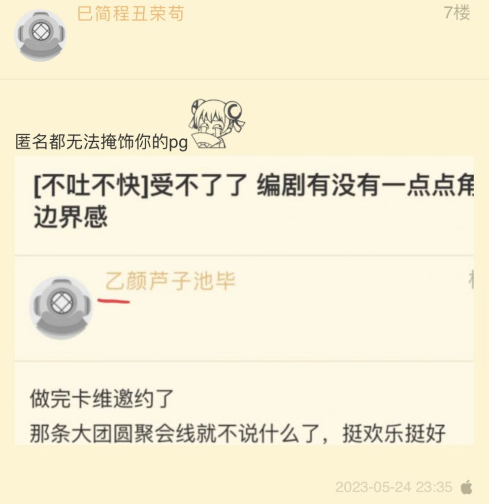

----

##### 155.[1] \<pid:706940519\> 2023-08-04 17:05:35 by 子苏郝庚臧余
>[jump](#pid706937910) A25558889(2023-08-04 16:54):

他没后悔过卖房子吧，想要搬家也不等于后悔卖了房子
老实说我觉得他坐了一晚决定去卖房是在行为上有体现他的品格为数不多的弧光了

----

##### 156.[2] \<pid:706940700\> 2023-08-04 17:06:23 by Kaekaekae
>[jump](#pid706940434) 乙师苑辰邱梅(2023-08-04 17:05) 说: 
>
>我觉得，不如这个好笑
>
>

你也要被打成乙解了

----

##### 157.[1] \<pid:706940719\> 2023-08-04 17:06:33 by lien11
看截图我想起来了，烫男人，烫烫的，真tm熟悉的味道

----

##### 158.[6] \<pid:706940948\> 2023-08-04 17:07:38 by 就随便起了个名字
>[jump](#pid706940434) 乙师苑辰邱梅(2023-08-04 17:05) 说: 
>
>我觉得，不如这个好笑
>
>

好了，这下子她们sj之后又要说匿名也盖不住你的pg了

----

##### 159.[2] \<pid:706941504\> 2023-08-04 17:10:09 by 剑筑师と書記官
>[jump](#pid706940434) 乙师苑辰邱梅(2023-08-04 17:05) 说: 
>
>我觉得，不如这个好笑
>
>

我他妈仰天长啸笑得肚子疼哈哈哈哈哈哈哈哈哈哈哈哈哈哈哈哈哈哈哈

----

##### 160.[0] \<pid:706942288\> 2023-08-04 17:13:46 by 齐莠
卡维楼已经塌了无数个了，守护

----

##### 161.[0] \<pid:706942720\> 2023-08-04 17:15:29 by 夜雨浮良
有人回复我但是隔壁锁了可恶啊啊啊我好好奇,

----

##### 162.[5] \<pid:706942894\> 2023-08-04 17:16:09 by lien11
老赖，夜间扰民，对着室友鄙夷爱好追求，对室友请来的朋友说他那人不行没朋友，直接偷了室友订下的酒，等等等等，以前没细想，随便一列都让人头皮发麻。但是，提瓦特大陆自有它的法律，不愧是典王欣赏的人

----

##### 164.[0] \<pid:706943178\> 2023-08-04 17:17:26 by 今锁朱楼
>[jump](#pid706942894) lien11(2023-08-04 17:16)说:
>老赖，夜间扰民，对着室友鄙夷爱好追求，对室友请来的朋友说他那人不行没朋友，直接偷了室友订下的酒，等等等等，以前没细想，随便一列都让人头皮发麻。但是，提瓦特大陆自有它的法律，不愧是典王欣赏的人[s:ac:哭笑]

草王还表明过喜欢谁吗？崩塌的前兆啊这是。

----

##### 167.[1] \<pid:706943448\> 2023-08-04 17:18:36 by Kaekaekae
>[jump](#pid706943178) 今锁朱楼(2023-08-04 17:17) 说: 
>
>草王还表明过喜欢谁吗？崩塌的前兆啊这是。

就两个，散兵和卡维

----

##### 168.[3] \<pid:706943838\> 2023-08-04 17:20:12 by lien11
>[jump](#pid706943178) 今锁朱楼(2023-08-04 17:17)说:
>>[jump](#pid706942894) lien11(2023-08-04 17:16)说:
>>老赖，夜间扰民，对着室友鄙夷爱好追求，对室友请来的朋友说他那人不行没朋友，直接偷了室友订下的酒，等等等等，以前没细想，随便一列都让人头皮发麻。但是，提瓦特大陆自有它的法律，不愧是典王欣赏的人[s:ac:哭笑]
>
>草王还表明过喜欢谁吗？崩塌的前兆啊这是。

语音里典王老赖对彼此的评价啊，不涉及真爱，这就是海哥你当初出大力救典王的报应啊

----

##### 170.[5] \<pid:706944107\> 2023-08-04 17:21:23 by 伊兽
全自动打滚锁楼机，又可以岁成乙解搞事了，win！
其他cpf和其他f重合度真的很高吧

----

##### 171.[14] \<pid:706944130\> 2023-08-04 17:21:28 by 超定归约律
>[jump](#pid706940076) 鱼鸟_____(2023-08-04 17:03) 说: 
>
>可以说吗，因为马哈鱼卖嗨卡和卡sfw天天打滚捆绑觉得海人格魅力被拉低了，海沾上卡某种程度也是悲哀

卡维对海本身就是拖累啊，当初3.2主线过完还没到卡维出场的时候我就觉得这对cp肯定不好嗑，因为艾尔海森这个角色塑造的太健康全了，他一个人人设逻辑已经非常完整了，这在一堆问题儿童的纸片人界也算得上少见，这种角色本身就不符合同人女嗑cp的“互相补足”“相互救赎”的路径依赖，这种角色要写好cp还不ooc非常难，你猜我信不信mhy有这能力。
嗑到后期肯定要么变得二设入脑强行给艾海加缺陷设定，要么他的相方满身缺陷，艾海成为单方面投入扶贫方。
结果是编剧空降了一个物质生活精神状态全方面残疾的卡维……原来是这样镜像论的吗？太厉害了

----

##### 172.[2] \<pid:706944715\> 2023-08-04 17:24:05 by 子刘向辛廖艾
>[jump](#pid706940149) 花舞苍天(2023-08-04 17:03) 说: 
>
>那个啊，起因是因为卡解隔三差五在永恒绿洲发贴桃五星，然后又把说卡是四星的谭友打成海解乙解或者辱角色，所以bw锁的很快，卡解就以为bw针对她们，当初其他在永恒绿洲那会儿满屏都是起名贴，卡解有样学样在绿洲狂刷卡维的帖子灌水，甚至当初有个帖子蹭尘世之锁和归终，那帖子里一群卡解狂欢还在那里狂甩锅钟厨海厨
>顺便放一些当初的逆天言论，啊对对对都是五星男角色和他们厨子的错你家是无辜小白花呢
>
>[img]./mon_202308/04/l2Q2s-6svdZbT3cSu8-

关钟离p事啊。卡维和钟离一点关系都没。
卡厨怎么莫名其妙代入归终骂钟离
hk厨也喜欢故意拐公钟炸楼。不理解为什么对钟离这么大恨意

----

##### 173.[1] \<pid:706945131\> 2023-08-04 17:25:46 by KingreyShawn
卧槽，一下午几个小时，前面的几栋楼全没了？

----

##### 174.[2] \<pid:706945146\> 2023-08-04 17:25:48 by nonaligned9888
其他和其他CP的粉丝群体真的都是T0级别的恶心
隔壁同流合污的楼还真的没说错，能给战犯和老赖洗的，成分果然不用多说

----

##### 175.[0] \<pid:706945365\> 2023-08-04 17:26:50 by lien11
>[jump](#pid706944715) 子刘向辛廖艾(172楼) (2023-08-04 17:24)说:
>>[jump](#pid706940149) 花舞苍天(2023-08-04 17:03) 说: 
>>
>>那个啊，起因是因为卡解隔三差五在永恒绿洲发贴桃五星，然后又把说卡是四星的谭友打成海解乙解或者辱角色，所以bw锁的很快，卡解就以为bw针对她们，当初其他在永恒绿洲那会儿满屏都是起名贴，卡解有样学样在绿洲狂刷卡维的帖子灌水，甚至当初有个帖子蹭尘世之锁和归终，那帖子里一群卡解狂欢还在那里狂甩锅钟厨海厨
>>顺便放一些当初的逆天言论，啊对对对都是五星男角色和他们厨子的错你家是无辜小白花呢
>>
>>[img]./mon_202308/04/l2Q2s-6svdZbT3cSu8-
>
>关钟离p事啊。卡维和钟离一点关系都没。
>卡厨怎么莫名其妙代入归终骂钟离
>hk厨也喜欢故意拐公钟炸楼。不理解为什么对钟离这么大恨意

如果要问原因，一切大概可以归为厕妹恨钟吧

----

##### 176.[4] \<pid:706945479\> 2023-08-04 17:27:23 by 一只扁扁
>[jump](#pid706944715) 子刘向辛廖艾(2023-08-04 17:24) 说: 
>
>关钟离p事啊。卡维和钟离一点关系都没。
>卡厨怎么莫名其妙代入归终骂钟离
>hk厨也喜欢故意拐公钟炸楼。不理解为什么对钟离这么大恨意

个人觉得因为那是前美帝啊
我们新任top，当然要踩着前美帝上位呀

----

##### 177.[4] \<pid:706945678\> 2023-08-04 17:28:12 by 米翼
>[jump](#pid706944130) 超定归约律(2023-08-04 17:21) 说: 
>
>卡维对海本身就是拖累啊，当初3.2主线过完还没到卡维出场的时候我就觉得这对cp肯定不好嗑，因为艾尔海森这个角色塑造的太健康全了，他一个人人设逻辑已经非常完整了，这在一堆问题儿童的纸片人界也算得上少见，这种角色本身就不符合同人女嗑cp的“互相补足”“相互救赎”的路径依赖，这种角色要写好cp还不ooc非常难，你猜我信不信mhy有这能力。
>嗑到后期肯定要么变得二设入脑强行给艾海加缺陷设定，要么他的相方满身缺陷，艾海成为单方面投入扶贫方。
>结果是编剧空降了一个物质生活精神状态全方面残疾

海哥这种抛开后来卖腐不谈，单看主线其实是本攻粉天菜，又美又强又帅智商也在线，这时候我磕cp倾向于强强对抗相爱相杀这种风味，然后就没有然后了，庆幸我没入地狱

----

##### 178.[1] \<pid:706946031\> 2023-08-04 17:29:50 by 叉车佬安康鱼
其实有一个盲点吧，天天给卡维贴理想主义的标签，到底几个过了3.6的人能说出他有什么理想的，最后的呈现确定不是脑子里一团浆糊吗

----

##### 180.[3] \<pid:706946579\> 2023-08-04 17:32:15 by 可恶，长个锤子
>[jump](#pid706944715) 子刘向辛廖艾(2023-08-04 17:24) 说: 
>
>关钟离p事啊。卡维和钟离一点关系都没。
>卡厨怎么莫名其妙代入归终骂钟离
>hk厨也喜欢故意拐公钟炸楼。不理解为什么对钟离这么大恨意

厕妹恨国风大家长这种事不是很正常吗越健全越恨，越根正苗红符合国人价值观越恨，简直和米双向奔赴

----

##### 181.[0] \<pid:706947059\> 2023-08-04 17:34:29 by 逢河牧野0v0
>[jump](#pid706945131) KingreyShawn(2023-08-04 17:25) 说: 
>
>卧槽，一下午几个小时，前面的几栋楼全没了？

有其他和其他cp粉这群打滚人在，楼想活着都难

----

##### 182.[2] \<pid:706947067\> 2023-08-04 17:34:31 by 米翼
>[jump](#pid706946579) 可恶，长个锤子(2023-08-04 17:32) 说: 
>
>厕妹恨国风大家长这种事不是很正常吗越健全越恨，越根正苗红符合国人价值观越恨，简直和米双向奔赴

这也是敏感话题小心被炸

----

##### 183.[0] \<pid:706947194\> 2023-08-04 17:35:11 by 神乐苍籁
>[jump](#pid706946579) 可恶，长个锤子(2023-08-04 17:32) 说: 
>
>厕妹恨国风大家长这种事不是很正常吗越健全越恨，越根正苗红符合国人价值观越恨，简直和米双向奔赴

有点好奇所以歪一下楼，层主的头像也包含在厕妹恨的范围内吗？

----

##### 185.[5] \<pid:706947764\> 2023-08-04 17:38:09 by 甲查唐乙孔卫
下午另一栋楼里有人扒出来的一些工业化证据
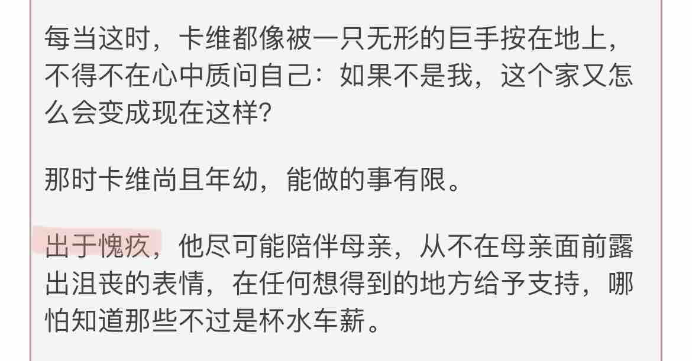
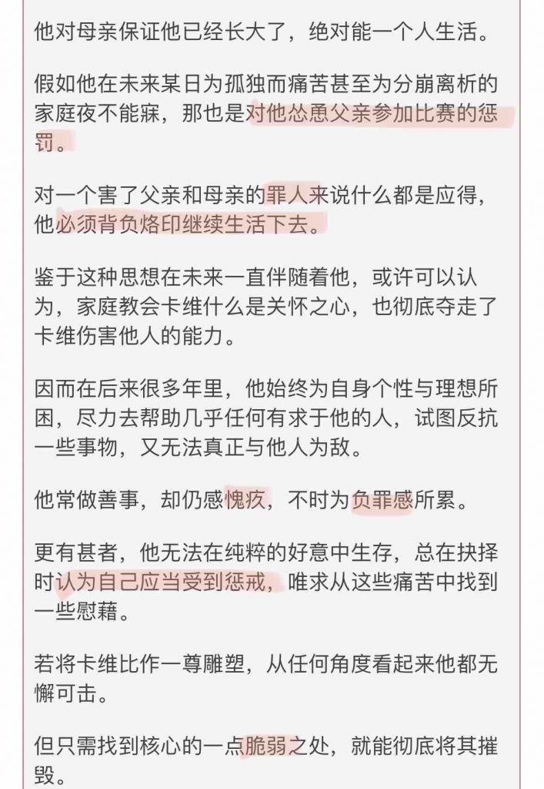
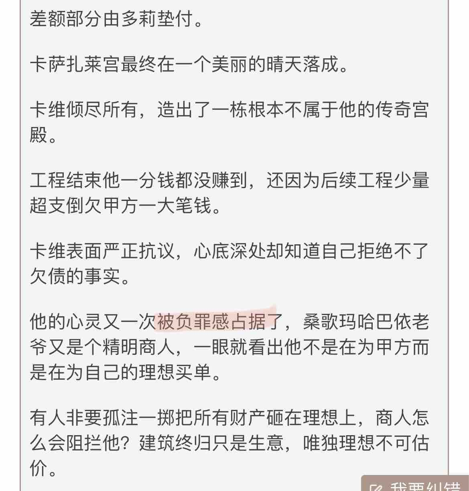
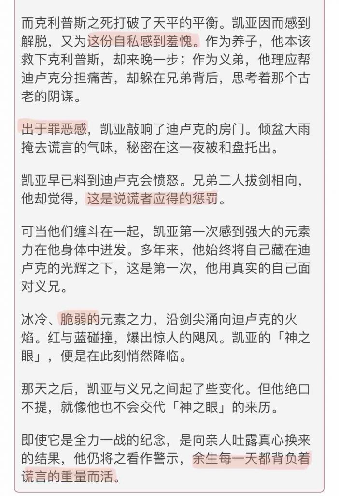
所以说卡维文案跟卡维剧情里的表现相当割裂，因为文案里那些负罪感愧疚认为自己应受惩罚背负烙印活下去blabla根本不是他的，“债主催债不够善良”那些才是他的真正想法

----

##### 186.[0] \<pid:706947843\> 2023-08-04 17:38:36 by 可恶，长个锤子
>[jump](#pid706947067) 米翼(2023-08-04 17:34) 说: 
>
>这也是敏感话题小心被炸

改了改了

----

##### 187.[8] \<pid:706948116\> 2023-08-04 17:40:05 by nonaligned9888
顺便卡维在日那边投票里好像在嫌榜里排名很高啊，怎么，3.6大版本活动主角垫了其他角色的高光就塑造出这个啊
之前在其他版说的时候还有人说是Yhm三观问题，现在想想人家说不定还是比某些群体要清醒得多呢

----

##### 188.[0] \<pid:706948770\> 2023-08-04 17:43:36 by 魔法少女砂莎美
妈呀我还没仔细看过。。原来这么多自机都评价过这对加上主线的强行插入 、待机动作 、3.6、生日信可以说是原捆的最死没有之一吧

----

##### 189.[10] \<pid:706948788\> 2023-08-04 17:43:42 by Kaekaekae
>[jump](#pid706948116) nonaligned9888(2023-08-04 17:40) 说: 
>
>顺便卡维在日那边投票里好像在嫌榜里排名很高啊，怎么，3.6大版本活动主角垫了其他角色的高光就塑造出这个啊
>之前在其他版说的时候还有人说是Yhm三观问题，现在想想人家说不定还是比某些群体要清醒得多呢

不止很高，是原神第1，全二次元第5的含金量  

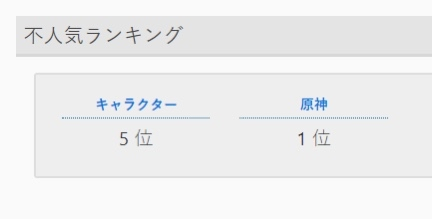

----

##### 190.[7] \<pid:706949082\> 2023-08-04 17:45:12 by 今锁朱楼
>[jump](#pid706948116) nonaligned9888(2023-08-04 17:40)说:
>顺便卡维在日那边投票里好像在嫌榜里排名很高啊[s:ac:哭笑]，怎么，3.6大版本活动主角垫了其他角色的高光就塑造出这个啊 之前在其他版说的时候还有人说是Yhm三观问题，现在想想人家说不定还是比某些群体要清醒得多呢

yhm车卡维的原因之一是卡维说幸好小梅没有生命(大概这个意思)的时候小梅表情很难过，这观察力和敏锐度是真的强

----

##### 191.[0] \<pid:706949313\> 2023-08-04 17:46:23 by 就随便起了个名字
>[jump](#pid706948770) 魔法少女砂莎美(2023-08-04 17:43) 说: 
>
>妈呀我还没仔细看过。。原来这么多自机都评价过这对加上主线的强行插入 、待机动作 、3.6、生日信可以说是原捆的最死没有之一吧

我散草cp呢！这可是官方ep盖章认证的

----

##### 192.[0] \<pid:706949742\> 2023-08-04 17:48:29 by 栗子味蛋糕
本来是当我前妻代餐看的，现在跑回前坑了

----

##### 193.[1] \<pid:706949757\> 2023-08-04 17:48:39 by 嘟嘟水
>[jump](#pid706948770) 魔法少女砂莎美(2023-08-04 17:43) 说: 
>
>妈呀我还没仔细看过。。原来这么多自机都评价过这对加上主线的强行插入 、待机动作 、3.6、生日信可以说是原捆的最死没有之一吧

捆成大闸蟹，直接把单推都赶跑了。以至于我已经想不出下一对还能有什么新(烂)招(活)拿来捆了

----

##### 194.[0] \<pid:706950047\> 2023-08-04 17:50:10 by レオ
>[jump](#pid706948788) Kaekaekae(2023-08-04 17:43) 说: 
>
>不止很高，是原神第1，全二次元第5的含金量  
>
>
>

怎么掉到第五了，上次有人发全二次元前三的时候暴露出来第一还是第二是蝴蝶忍她姐，导致底下的回复全都歪楼歪到问为什么蝴蝶忍她姐会在榜上，从而开始质疑这个榜的靠谱度

----

##### 195.[5] \<pid:706950353\> 2023-08-04 17:51:37 by 不太好吃
ta带着自己的蟑螂味来了，祝这栋楼运气好，我先撤了

----

##### 196.[5] \<pid:706950493\> 2023-08-04 17:52:15 by 米翼
还记得yhm评论：卡维在嫌榜的上升趋势比满是债务的人生经历要顺利得多

----

##### 197.[0] \<pid:706950640\> 2023-08-04 17:53:04 by 泛舟浮白
唉，我的一见钟情不值钱

----

##### 198.[13] \<pid:706950748\> 2023-08-04 17:53:40 by lien11
说个地狱的话题，须弥最逍遥自在的其他和老赖是唯二没参与救典王的须弥自机，这是何等的因果报应啊不对，还有莱依拉和珐姐俩被波及的，还行

----

##### 199.[0] \<pid:706950953\> 2023-08-04 17:54:45 by 嘟嘟水
>[jump](#pid706950353) 不太好吃(2023-08-04 17:51) 说: 
>
>ta带着自己的蟑螂味来了，祝这栋楼运气好，我先撤了

自觉跨栏就行啦，你看她发了这么多有人理她吗

----

##### 200.[0] \<pid:706951060\> 2023-08-04 17:55:17 by 炒鸡内金
>[jump](#pid706940434) 乙师苑辰邱梅(2023-08-04 17:05) 说: 
>
>我觉得，不如这个好笑
>
>

笑的笔筒…

----

##### 201.[3] \<pid:706951095\> 2023-08-04 17:55:28 by 笑着选择原谅它
>[jump](#pid706950748) lien11(2023-08-04 17:53) 说: 
>
>说个地狱的话题，须弥最逍遥自在的其他和老赖是唯二没参与救典王的须弥自机，这是何等的因果报应

拯救草神 ×
打开潘多拉魔盒 &amp;#10003;

----

##### 202.[0] \<pid:706951235\> 2023-08-04 17:56:09 by nonaligned9888
也是典王给的评价最好的两个
典王甚至觉得小提脾气还不够好>[jump](#pid706950748) lien11(2023-08-04 17:53) 说: 
>
>说个地狱的话题，须弥最逍遥自在的其他和老赖是唯二没参与救典王的须弥自机，这是何等的因果报应

----

##### 203.[0] \<pid:706951286\> 2023-08-04 17:56:24 by kiyota119
>[jump](#pid706950748) lien11(2023-08-04 17:53) 说: 
>
>说个地狱的话题，须弥最逍遥自在的其他和老赖是唯二没参与救典王的须弥自机，这是何等的因果报应

你忘了这俩还是目前为止草神相当认可的俩人
我之前都没意识到这个，什么须弥笑话

----

##### 204.[6] \<pid:706951317\> 2023-08-04 17:56:35 by 大碗番茄炒鸡拌饭
>[jump](#pid706950493) 米翼(2023-08-04 17:52) 说: 
>
>还记得yhm评论：卡维在嫌榜的上升趋势比满是债务的人生经历要顺利得多

想起了赛诺锐评：亲身经历比笑话还有意思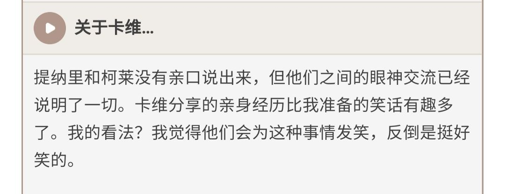

----

##### 205.[0] \<pid:706951484\> 2023-08-04 17:57:20 by レオ
>[jump](#pid706950953) 嘟嘟水(2023-08-04 17:54) 说: 
>
>自觉跨栏就行啦，你看她发了这么多有人理她吗

问题不大，只要发的东西足够有说服力，大部分人是不好意思看着两层楼并列还能熟视无睹的

----

##### 207.[1] \<pid:706951794\> 2023-08-04 17:58:57 by 米翼
>[jump](#pid706950953) 嘟嘟水(2023-08-04 17:54) 说: 
>
>自觉跨栏就行啦，你看她发了这么多有人理她吗

我想对我推好点不想沾这角色，前边有层主的诅咒狠毒堪比垫子攻具人永世不得翻身

----

##### 208.[0] \<pid:706951924\> 2023-08-04 17:59:29 by nonaligned9888
笑死我了越想越觉得须弥真是烂完了，看看草神都喜欢哪些人啊，一丘之貉是吧

----

##### 209.[2] \<pid:706951976\> 2023-08-04 17:59:43 by 嘟嘟水
>[jump](#pid706951317) 大碗番茄炒鸡拌饭(2023-08-04 17:56) 说: 
>
>想起了赛诺锐评：亲身经历比笑话还有意思

有时候我看着这些评论都觉得这些话是否是阴阳怪气但是又碍于是朋友不好吐槽这人做人太烂

----

##### 210.[0] \<pid:706952062\> 2023-08-04 18:00:10 by 笑着选择原谅它
>[jump](#pid706951317) 大碗番茄炒鸡拌饭(2023-08-04 17:56) 说: 
>
>想起了赛诺锐评：亲身经历比笑话还有意思

这可是小提和柯莱一直认为的好笑，化城郭的人真是太没有同情心了

----

##### 211.[2] \<pid:706952123\> 2023-08-04 18:00:30 by 苦瓜加多了
恨比爱长久。
破防乙解，魔怔海解，cp对家，不稳定形态厕妹。请选择你的阵营。
艾尔海森他超爱，吐槽就是梦女破防，人设不对劲就是你三次元碰不到这么优秀的人，没有共情力。请选择你的帽子。
不过没关系，是我擅自期待了所谓的大建筑师、妙论派之光、理想主义者、善良的失去伤害他人能力卡维了。我为搞过此类卡维的ooc二创和我的画笔一起忏悔，这确实是我的错。
我真的后悔了，这次真心的。

----

##### 212.[0] \<pid:706952156\> 2023-08-04 18:00:38 by レオ
>[jump](#pid706951794) 米翼(2023-08-04 17:58) 说: 
>
>我想对我推好点不想沾这角色，前边有层主的诅咒狠毒堪比垫子攻具人永世不得翻身

我觉得米只会卖一对这么锁的，你换别的大多数角色推应该都能更幸福

----

##### 213.[5] \<pid:706952161\> 2023-08-04 18:00:41 by 今锁朱楼
>[jump](#pid706951317) 大碗番茄炒鸡拌饭(2023-08-04 17:56)说:
>[quote][pid=706950493,37253244,10]Reply[/pid] <b>Post by [uid=39748281]米翼[/uid] (2023-08-04 17:52):</b>  还记得yhm评论：卡维在嫌榜的上升趋势比满是债务的人生经历要顺利得多[s:ac:喷][/quote]想起了赛诺锐评：亲身经历比笑话还有意思[s:ac:哭笑][img]https://img.nga.178.com/attachments/mon_202308/04/l2Q2s-f9lkK1dT3cSu0-bk.jpg.medium.jpg[/img]

邀约里赛诺直抒胸臆表达了对卡维人生的冷酷看法，赛诺啊我的赛诺，先是个人语音暗指太子，又是当面锐评卡维人生，怪不得好好的大风机关休假这么长时间呢

----

##### 214.[3] \<pid:706952200\> 2023-08-04 18:00:56 by 夜子归
>[jump](#pid706945479) 一只扁扁(2023-08-04 17:27) 说: 
>
>个人觉得因为那是前美帝啊
>我们新任top，当然要踩着前美帝上位呀
>

虽然但是，hk也没登过顶当美帝啊，至少我印象里国内绝对没有过

----

##### 215.[1] \<pid:706952379\> 2023-08-04 18:01:52 by 笑着选择原谅它
>[jump](#pid706952161) 今锁朱楼(2023-08-04 18:00) 说: 
>
>邀约里赛诺直抒胸臆表达了对卡维人生的冷酷看法，赛诺啊我的赛诺，先是个人语音暗指太子，又是当面锐评卡维人生，怪不得好好的大风机关休假这么长时间呢

别说了，小提都被发配常驻了，柯莱都被发配打深渊就送了，~~但是强度都比卡维高~~

----

##### 216.[0] \<pid:706952444\> 2023-08-04 18:02:14 by 大碗番茄炒鸡拌饭
>[jump](#pid706952161) 今锁朱楼(2023-08-04 18:00) 说: 
>
>邀约里赛诺直抒胸臆表达了对卡维人生的冷酷看法，赛诺啊我的赛诺，先是个人语音暗指太子，又是当面锐评卡维人生，怪不得好好的大风机关休假这么长时间呢

居然敢说典王心水的两大红人的坏话，难怪要休假呢，皇上龙颜大怒了

----

##### 217.[0] \<pid:706952510\> 2023-08-04 18:02:38 by 来份图图
卡维或者躲在卡维身后的编剧透露出一种浓厚的优越感，然而我既没有在剧情里直观感受到卡维的才华，也没有感受到他的努力(更何况现实中就很讨厌天天把男朋友挂在嘴边完全无法独立聊天的人

----

##### 218.[3] \<pid:706952636\> 2023-08-04 18:03:15 by moonlight34
>[jump](#pid706952161) 今锁朱楼(2023-08-04 18:00) 说: 
>
>邀约里赛诺直抒胸臆表达了对卡维人生的冷酷看法，赛诺啊我的赛诺，先是个人语音暗指太子，又是当面锐评卡维人生，怪不得好好的大风机关休假这么长时间呢

还别说，知妙解可喜欢偷赛的设定套给卡了可惜被赛本人瑞平几次了。知妙解一边吹自家top一边暗戳戳sj冒烟

----

##### 219.[8] \<pid:706952661\> 2023-08-04 18:03:22 by 米翼
>[jump](#pid706952161) 今锁朱楼(2023-08-04 18:00) 说: 
>
>邀约里赛诺直抒胸臆表达了对卡维人生的冷酷看法，赛诺啊我的赛诺，先是个人语音暗指太子，又是当面锐评卡维人生，怪不得好好的大风机关休假这么长时间呢

赛诺说了实话被卡维顶了一句后回复，“嗯，你的人生挺好的”，印象过于深刻，我一时不知道该怎么评价这编剧

----

##### 220.[2] \<pid:706952791\> 2023-08-04 18:03:57 by 笑着选择原谅它
>[jump](#pid706952444) 大碗番茄炒鸡拌饭(2023-08-04 18:02) 说: 
>
>居然敢说典王心水的两大红人的坏话，难怪要休假呢，皇上龙颜大怒了

赛诺前有嘲笑卡维，后有和散兵打架，加上参与释放魔物，报应啊，都是报应

----

##### 221.[6] \<pid:706952793\> 2023-08-04 18:03:58 by 己宁梅寅汪甄
>[jump](#pid706952200) 夜子归(2023-08-04 18:00) 说: 
>
>虽然但是，hk也没登过顶当美帝啊，至少我印象里国内绝对没有过

美帝创业未半而枫丹已经到了该卖新的了

----

##### 222.[0] \<pid:706952863\> 2023-08-04 18:04:20 by 夜子归
>[jump](#pid706947764) 甲查唐乙孔卫(2023-08-04 17:38) 说: 
>
>下午另一栋楼里有人扒出来的一些工业化证据
>
>
>
>[img]./mon_202308/04/l2Q2s-l

啊？啊？啊？

----

##### 223.[1] \<pid:706953078\> 2023-08-04 18:05:23 by 笑着选择原谅它
>[jump](#pid706952661) 米翼(2023-08-04 18:03) 说: 
>
>赛诺说了实话被卡维顶了一句后回复，“嗯，你的人生挺好的”，印象过于深刻，我一时不知道该怎么评价这编剧

赛少怎么净说大实话啊，不要命啦

----

##### 224.[0] \<pid:706953183\> 2023-08-04 18:05:55 by 辰池宋丁殷唐
>[jump](#pid706952200) 夜子归(2023-08-04 18:00) 说: 
>
>虽然但是，hk也没登过顶当美帝啊，至少我印象里国内绝对没有过

我路过围观到的美帝都自称先帝退位让贤了

----

##### 225.[2] \<pid:706953662\> 2023-08-04 18:08:39 by KingreyShawn
我不知道被锁的那些楼在后面几个小时还有什么内容，但前面有一些真写得挺好的，怎么就锁了，太可惜了

----

##### 226.[2] \<pid:706953676\> 2023-08-04 18:08:42 by lien11
总之，既然须弥囚犯也有受教育的权利，那我会说，须弥老赖当然有欠债不还的权利

----

##### 227.[0] \<pid:706953699\> 2023-08-04 18:08:49 by レオ
>[jump](#pid706953183) 辰池宋丁殷唐(2023-08-04 18:05) 说: 
>
>我路过围观到的美帝都自称先帝退位让贤了

美帝解不必，美帝体量在那，须弥版本都结束了增量拿头，最后美帝应该还是铁打的美帝
不如期待枫丹双成男限五

----

##### 228.[7] \<pid:706954089\> 2023-08-04 18:10:56 by A—lhaitham
好好的楼总是会被脏东西缠上

----

##### 229.[4] \<pid:706954144\> 2023-08-04 18:11:13 by 巳卜左辛安尚
>[jump](#pid706953183) 辰池宋丁殷唐(2023-08-04 18:05) 说: 
>
>我路过围观到的美帝都自称先帝退位让贤了

草原来是这个意思，我还问过朋友这个花名是谁家

----

##### 230.[5] \<pid:706954283\> 2023-08-04 18:11:55 by 银霭鸢尾花
>[jump](#pid706953662) KingreyShawn(2023-08-04 18:08)说:
>我不知道被锁的那些楼在后面几个小时还有什么内容，但前面有一些真写得挺好的，怎么就锁了，太可惜了[s:ac:怒]

卡相关高楼后排必有打滚选手引导爆破，没有例外的

----

##### 231.[0] \<pid:706954415\> 2023-08-04 18:12:43 by 笑着选择原谅它
>[jump](#pid706954089) A—lhaitham(2023-08-04 18:10) 说: 
>
>好好的楼总是会被脏东西缠上

只要把楼都炸掉就不需要担心有人讨厌卡维了

----

##### 232.[4] \<pid:706954462\> 2023-08-04 18:12:58 by 来份图图
>[jump](#pid706865165) summer_zephyr(2023-08-04 11:13) 说: 
>
>在告示板时代喜欢过mhy贴的标签，现在想切割过去喜欢上mhy标签的自己
>3.6版本的塑造真的太掉价了，有那种像个祥林嫂一样徘徊在过去的不幸里的那种感觉。在提瓦特这个人均孤儿的世界里，也没觉得卡维有多惨orz

可是祥林嫂是真的很惨，被强迫结婚，被强x后生下孩子，孩子由于自己的疏忽死于非命，最后衣衫褴褛，精神失常，是真实的旧时代的悲剧，卡维的惨除了单亲家庭意外都太悬浮了，虽然我欠债但是我衣着光鲜、吃好喝好、住一环大别野，还在债主面前气宇轩昂毫不害怕，债主也多少有点做慈善，妈妈也找到了幸福，到底哪里惨呢我请问

----

##### 233.[0] \<pid:706954506\> 2023-08-04 18:13:12 by レオ
>[jump](#pid706954283) 银霭鸢尾花(2023-08-04 18:11) 说: 
>
>卡相关高楼后排必有打滚选手引导爆破，没有例外的

有一栋剧院，那楼聊了好几页我，我回一句就锁了  

----

##### 234.[3] \<pid:706954551\> 2023-08-04 18:13:27 by 香槟买好了就等
>[jump](#pid706952661) 米翼(2023-08-04 18:03) 说: 
>
>赛诺说了实话被卡维顶了一句后回复，“嗯，你的人生挺好的”，印象过于深刻，我一时不知道该怎么评价这编剧

米的文案经常让我产生一些困惑，你说他不懂吧他好像又在装傻，你说他装傻吧他好像真的深爱

----

##### 235.[9] \<pid:706954578\> 2023-08-04 18:13:35 by 可恶，长个锤子
>[jump](#pid706954283) 银霭鸢尾花(2023-08-04 18:11) 说: 
>
>卡相关高楼后排必有打滚选手引导爆破，没有例外的

而且我围观的每个车卡楼里都有上面这位打滚，锲而不舍，精神比她正主坚韧

----

##### 236.[4] \<pid:706954703\> 2023-08-04 18:14:12 by nonaligned9888
因为其他CP粉真的跟疯狗一样见人就咬，甚至单纯路人表达对卡维塑造不满的地方还要进来打滚，当然骂海就没关系啦，海不发音，问就是他超爱
感觉无论是角色厨子还是CP厨估计都不想沾边吧，沾了要不然被拉踩要不然被KY，然后你反驳就给你扣乙解梦女对家海解帽子
咱就是说真的对你家受人气有自信，大可不必天天拉踩别的四星男人然后对五星男人嫉妒羡慕恨，就米这文案水平谁的剧情都能被车，如果连别人讨不讨厌这个角色都要管那我建议去看精神科

----

##### 237.[9] \<pid:706954735\> 2023-08-04 18:14:21 by 魑魅魍魉魖魌
>[jump](#pid706947764) 甲查唐乙孔卫(2023-08-04 17:38) 说: 
>
>下午另一栋楼里有人扒出来的一些工业化证据
>
>
>
>[img]./mon_202308/04/l2Q2s-l

凯亚怀着负罪感搬出了生活了多年的家；卡维怀着负罪感住进艾尔海森家还要拖欠房租。
评价为新文案对老编剧的东施效颦。

----

##### 238.[0] \<pid:706954750\> 2023-08-04 18:14:26 by whaleso
>[jump](#pid706927014) kiyota119(2023-08-04 16:04) 说: 
>
>哦说起这个塑造，之前有一个嗑这个的人跟我抱怨说这cp点赞高的都是她觉得特别弱智的捡手机文学啥的，“有一个真正解读角色内核、灵魂伴侣相惜”的太太热度却不高
>当时我还安慰说，原的受众普遍爱捡手机
>现在我想对她说，有没有可能，ooc的是你们这帮往文思哲灵魂伴侣上扯的“大文学家”
>这同人的矛盾就是，原作贫瘠但猛干的塑造水平，与，同人女内心无处发泄的丰富情感，之间的鸿沟

你这么一说我就明白为什么我觉得这对cp别扭了原作过于贫瘠，同人女想象又过于丰富，过于丰富的同时还自封对角色有深入理解

----

##### 239.[0] \<pid:706955136\> 2023-08-04 18:16:17 by 米翼
>[jump](#pid706954703) nonaligned9888(2023-08-04 18:14) 说: 
>
>因为其他CP粉真的跟疯狗一样见人就咬，甚至单纯路人表达对卡维塑造不满的地方还要进来打滚，当然骂海就没关系啦，海不发音，问就是他超爱
>感觉无论是角色厨子还是CP厨估计都不想沾边吧，沾了要不然被拉踩要不然被KY，然后你反驳就给你扣乙解梦女对家海解帽子

路人不平等地车海哥塑造人家还会不满有时候看用什么爹味男啊pua啊评价海哥，路人不车人家自己上了

----

##### 240.[9] \<pid:706955537\> 2023-08-04 18:18:33 by mASAYUMecHASIN
又不是一个文案写的，比如负责赛诺语音的，明显在给同事倒油

----

##### 241.[18] \<pid:706955671\> 2023-08-04 18:19:22 by lien11
>[jump](#pid706954750) whaleso(2023-08-04 18:14)说:
>[quote][pid=706927014,37253244,5]Reply[/pid] <b>Post by [uid=40313352]kiyota119[/uid] (2023-08-04 16:04):</b>  哦说起这个塑造，之前有一个嗑这个的人跟我抱怨说这cp点赞高的都是她觉得特别弱智的捡手机文学啥的，“有一个真正解读角色内核、灵魂伴侣相惜”的太太热度却不高 当时我还安慰说，原的受众普遍爱捡手机 现在我想对她说，有没有可能，ooc的是你们这帮往文思哲灵魂伴侣上扯的“大文学家”[s:pg:吃瓜] 这同人的矛盾就是，原作贫瘠但猛干的塑造水平，与，同人女内心无处发泄的丰富情感，之间的鸿沟[/quote]你这么一说我就明白为什么我觉得这对cp别扭了[s:ac:瞎]原作过于贫瘠，同人女想象又过于丰富，过于丰富的同时还自封对角色有深入理解[s:ac:晕]

贫瘠？不，以同人女的脑补能力，你一点剧情不做这对都没这么难磕。欠钱不还，半夜扰民，践踏理想，还偷酒怎么就贫瘠了，负面塑造就不是塑造了吗

----

##### 242.[35] \<pid:706955855\> 2023-08-04 18:20:14 by 笑着选择原谅它
>[jump](#pid706951235) nonaligned9888(2023-08-04 17:56) 说: 
>也是典王给的评价最好的两个，大大认可其理念和给罪犯教育权利的含金量
>典王甚至觉得小提脾气还不够好

你不说我都忘了，关于小提的脾气问题，典王觉得他还不够温柔
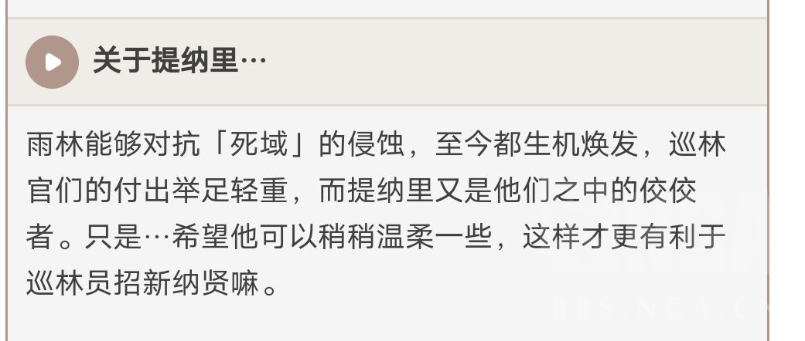，
对此艾尔海森说
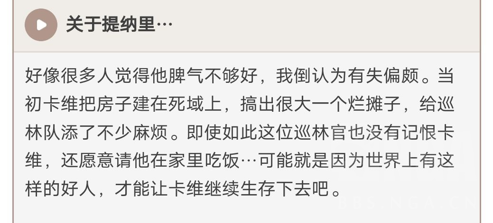
加上3.6结尾的话，难怪艾尔海森连夜辞职不敢当大贤者

----

##### 243.[4] \<pid:706955918\> 2023-08-04 18:20:35 by Kaekaekae
来一点日本玩家瑞平

1. アルカヴェ、カヴェアルはワンク要らないみたいな風潮何マジで。キモすぎる。
カーヴェ本人も文句しか言わない被害者面寄生虫だけどそいつ推してるやつも非常識の塊でキモすぎる。原神界隈から消えてくれ。
看到海卡和卡海这样的风气，实在是让人无法忍受。太恶心了。虽然卡维本人也只会抱怨，是个充满怨言的受害者，但那些支持他的人也都是非常不讲理的一群，太恶心了。请从原神社区中消失吧。

2. 原神にオタクの中でも最悪の層を取り込んだ元凶
イベストじゃいちいち自分語りして進行悪くしてたしもう語り尽くしただろ 二度とゲーム内イベントに出てこないで欲しい
原神吸引了最糟糕的宅文化成分，是祸根。在活动中总是自言自语，导致进展缓慢，说够了吧。希望他不会再出现在游戏内的活动中。

3. なんなら同性愛者を盾に出して自分達を正当化しようとした馬鹿共だからな。
内で否定しよう者がいれば叩いて黙らせ、他界隈のいじめにまで発展した人間として終わってる奴ら。これ海外の人ではなく日本人のアルカヴェ腐女子がやらかした事だからな。害悪すぎて関わりたくない。勿論美人タグや公式腐凸もコイツら
甚至还借GAY来为自己辩护，这些白痴们。如果有人试图否定他们，他们就会攻击并迫使对方沉默，如此一来，他们成了甚至引发了对其他社区的欺凌的人。这些是由日本的海卡解搞出的事情，实在是太有害，不想与其有任何关联。当然，还有美人标签和官方卖腐的这些人也是一样的。

4. アルカヴェとかカーヴェのせいで他キャラとか他界隈のこと叩きまくりsageまくりの存在がいること知っちゃって最悪。自分が好きなものだけ満喫してなよ
因为海卡和卡海的缘故，存在着一些只会不断诋毁其他角色和其他社区的人，而且还匿名地发表帖子。知道了这一点真的很糟糕。只是享受自己喜欢的东西就好了。

5. アルカヴェが今まで出会ってきた界隈の中で一番マナーのカケラもない原神民度崩壊豚共の胸糞宗教団体だと思ってる
我认为海卡是迄今为止我见过的社区中最没有礼貌的原神玩家，是一个令人作呕的宗教团体。

6.たった1人で原神の民度を破壊した男
那个仅凭一人摧毁了原神玩家素质的男人

7. だめだよ运営さん(笑)
腐女子に媚びてもアイツらすぐ違うエサ見つけて群がってっちゃうんだからさ
原神という作品を追ってるファンと
BL追ってる一時的なファン。
ターゲット層を間違えないでくれよな！
FF15みたいな事になったら終わりだぜ？
不行哦，运营人员(笑)。就算讨好腐女也没用，她们很快就会找到别的食物并聚集到一起。请不要把原神作品的追随者和一时追逐BL的迷糊粉丝混为一谈。请别错误地定位我们的目标受众！要是变成像《最终幻想15》那样就完蛋了吧？

8. カーヴェ=38歳児
って印象がもう自分の中で定着してしまった
カーヴェさえ登場しなければ腐メールなんて言われずに済んだのにな。原神の信頼と株を落とした原因は少なからずこいつとファンにあると思ってる
卡维=38岁儿童，在我内心中已经根深蒂固地形成了这种印象。要是卡维不出现的话，(须弥)就不会被称为腐弥了吧。我认为原神的信任和声誉受损在某种程度上是因为他和他的粉丝。

9. レザーの両親がモブモデルで出てきてレザーは母親似だったけどレザー推しは大して騒いでなかったな
まぁモンド勢は害悪ファン少ないイメージあるけど
雷泽的父母以模特的形式出现，而雷泽长得像他的母亲，但雷泽的粉丝们并没有尖叫抓挠(说雷泽是美女)。嗯，感觉蒙德阵营的害群之马的粉丝不是很多。

10. 今まで親の話が出たプレイアブルキャラは割といたけど&#39;親が美人だから??も美人！&#39;とか声デカで騒いでる層は表立って出てこなかった気がするからやっぱりコイツの客層って今までと違うんだよな…周囲の雰囲気とか気にしないでギャーギャー騒いでる連中。
二次創作とかは好きにしてくれって思うけど
腐配慮がなさすぎるから名前だけでも腐った内容しか出てこないし、完全にソッチ用のキャラになってしまった。で、おまけにクズ。
単推し層に配慮ないからこいつに関わってる腐は余計に嫌われてる。
我觉得以前提到过父母的角色还是相当多的，但是尖叫抓挠着说&quot;因为母亲很美所以??也很美！&quot;这样的人群似乎并没有到处乱跳，所以(卡解)这个客户群似乎与以往不同...她们很KY，到哪里都是吱哇乱叫。
我认为二次创作之类的可以随意进行，但是过于不考虑原作或是其他人的感受，只能得到带有恶臭内容的作品，完全成了满足某类特定读者的需求。而且他本人也是渣滓。
由于没有考虑到单推团体的感受，所以卡维相关的腐向就更多人讨厌了。   

----

##### 244.[29] \<pid:706956171\> 2023-08-04 18:21:53 by A—lhaitham
>[jump](#pid706955136) 米翼(2023-08-04 18:16) 说: 
>
>路人不平等地车海哥塑造人家还会不满有时候看用什么爹味男啊pua啊评价海哥，路人不车人家自己上了

靠着挂一个五星当挂件才有热度的角色，结果cpf还要攻击大爹，建议角色独立行走不要当挂件

----

##### 245.[5] \<pid:706956220\> 2023-08-04 18:22:06 by 叉车佬安康鱼
回来了，须弥政斗学又回来了

----

##### 246.[12] \<pid:706956334\> 2023-08-04 18:22:39 by 丑顾敖巳关徐
>[jump](#pid706952200) 夜子归(2023-08-04 18:00) 说: 
>
>虽然但是，hk也没登过顶当美帝啊，至少我印象里国内绝对没有过

有米inner爱米太太给海卡买数据，何愁以后当不上美帝

----

##### 247.[16] \<pid:706956343\> 2023-08-04 18:22:41 by 0123cola
>[jump](#pid706955537) mASAYUMecHASIN(2023-08-04 18:18)说:
>又不是一个文案写的，比如负责赛诺语音的，明显在给同事倒油

有时候感觉文案内部自己都在掐架，体现在剧情里就是一种新型的米氏回旋镖

----

##### 248.[23] \<pid:706956511\> 2023-08-04 18:23:29 by 今锁朱楼
>[jump](#pid706955855) 笑着选择原谅它(2023-08-04 18:20)说:
>>[jump](#pid706951235) nonaligned9888(2023-08-04 17:56) 说: 
>>也是典王给的评价最好的两个，大大认可其理念和给罪犯教育权利的含金量
>>典王甚至觉得小提脾气还不够好
>
>你不说我都忘了，关于小提的脾气问题，典王觉得他还不够温柔
>，
>对此艾尔海森说
>
>加上3.6结尾的话，难怪艾尔海森连夜辞职不敢当大贤者

“有失偏颇”
原来这还有个更勇的啊

----

##### 249.[18] \<pid:706956605\> 2023-08-04 18:23:58 by 笑着选择原谅它
>[jump](#pid706956220) 叉车佬安康鱼(2023-08-04 18:22) 说: 
>
>回来了，须弥政斗学又回来了

没办法，赛提海(的语音文案)一个两个后脑勺都长反骨了

----

##### 250.[21] \<pid:706956612\> 2023-08-04 18:24:01 by 可恶，长个锤子
>[jump](#pid706955855) 笑着选择原谅它(2023-08-04 18:20) 说: 
>
>你不说我都忘了，关于小提的脾气问题，典王觉得他还不够温柔
>，
>对此艾尔海森说
>
>加上3.6结尾的话，难怪艾尔海森连夜辞职不敢当大贤者

不然怎么是一丘之貉呢一模一样的做事不过脑子，转嫁行善成本，严于律人宽以律己，还又菜又爱玩搞出事故
散卡草，草神和她的两个宝藏男孩99

----

##### 251.[25] \<pid:706956636\> 2023-08-04 18:24:11 by 丙穆常寅傅李
>[jump](#pid706954735) 魑魅魍魉魖魌(2023-08-04 18:14) 说: 
>
>凯亚怀着负罪感搬出了生活了多年的家；卡维怀着负罪感住进艾尔海森家还要拖欠房租。
>评价为新文案对老编剧的东施效颦。

虽然新文案写得烂，但是字数水得多啊
虽然角色塑造得low，但那是文案本人的人生啊
卡解好大福气还不谢谢老米

----

##### 252.[11] \<pid:706956733\> 2023-08-04 18:24:38 by 大碗番茄炒鸡拌饭
>[jump](#pid706955855) 笑着选择原谅它(2023-08-04 18:20) 说: 
>
>你不说我都忘了，关于小提的脾气问题，典王觉得他还不够温柔
>，
>对此艾尔海森说
>
>加上3.6结尾的话，难怪艾尔海森连夜辞职不敢当大贤者

笑死了，不愧是典王，从自己到眼光都是典中典，难怪功臣小队都跑干净了

----

##### 253.[20] \<pid:706956755\> 2023-08-04 18:24:43 by 安希雅_R4
>[jump](#pid706936810) 0123cola(2023-08-04 16:49):

其实有时候觉得挺可惜的。
原本觉得把麦麸拿掉了他的大建筑师人设还可以救一下，殊不知麦麸才是关键设定，大建筑师才是皮毛。
所以卡萨扎莱宫只是一幢跟其他须弥高级建筑看不出太大区别的普通好看的房子，他们甚至不肯为这个咨询个真正的建筑师建模个有点特色的建筑——恕我直言，小提他们学院那个玻璃温室都比卡萨扎莱宫给我印象深刻，卡萨扎莱宫给我所有的印象就是它周边可以采月莲，至于它本体长啥样我印象其实不太深。
然而这里还有一个问题——大建筑师这个设定在麦麸这个目的中其实也是可要可不要、
就像你说的，一个成年的大建筑师，想挣出能让自己独立生活的钱不要太简单，结果他还真就挣不出来，挣出来也保不住……
其实全部设定浓缩起来就是“这个人有跟艾尔海森比肩的才能，但他挣了钱也保不住”，那这个人是大建筑师还是大画家还是大音乐家什么区别呢……？
其实没什么区别，是建筑家可能没什么特别深的含义，可能就是“反正必须是个什么艺术家”“那就建筑家吧”程度吧.

----

##### 254.[22] \<pid:706956914\> 2023-08-04 18:25:39 by lien11
>[jump](#pid706955855) 笑着选择原谅它(2023-08-04 18:20)说:
>>[jump](#pid706951235) nonaligned9888(2023-08-04 17:56) 说: 
>>也是典王给的评价最好的两个，大大认可其理念和给罪犯教育权利的含金量
>>典王甚至觉得小提脾气还不够好
>
>你不说我都忘了，关于小提的脾气问题，典王觉得他还不够温柔
>，
>对此艾尔海森说
>
>加上3.6结尾的话，难怪艾尔海森连夜辞职不敢当大贤者

海哥，你，唉谁让你是放出典王的主力，就当你偿还果报了吧如果有一天纳西妲的灵柩是整个mhy，那你的灵柩必有须弥一块地

----

##### 255.[0] \<pid:706957022\> 2023-08-04 18:26:15 by レオ
>[jump](#pid706956755) 安希雅_R4(2023-08-04 18:24) 说: 
>
>其实有时候觉得挺可惜的。
>原本觉得把麦麸拿掉了他的大建筑师人设还可以救一下，殊不知麦麸才是关键设定，大建筑师才是皮毛。
>所以卡萨扎莱宫只是一幢跟其他须弥高级建筑看不出太大区别的普通好看的房子，他们甚至不肯为这个咨询个真正的建筑师建模个有点特色的建筑——恕我直言，小提他们学院那个玻璃温室都比卡萨扎莱宫给我印象深刻，卡萨扎莱宫给我所有的印象就是它周边可以采月莲，至于它本体长啥样我印象其实不太深。
>然而这里还有一个问题——大建筑师这个设定在麦麸这个目的中其实也是可要可不要、
>就像你说的，一个成年的大建

要艺术兼具理科生8
不然怎么对称zsbd

----

##### 256.[2] \<pid:706957135\> 2023-08-04 18:26:48 by aaa呵

几小时没看怎么两栋楼都没了，有人存楼了吗

----

##### 257.[18] \<pid:706957211\> 2023-08-04 18:27:12 by 魑魅魍魉魖魌
>[jump](#pid706956636) 丙穆常寅傅李(2023-08-04 18:24) 说: 
>
>虽然新文案写得烂，但是字数水得多啊
>虽然角色塑造得low，但那是文案本人的人生啊
>卡解好大福气还不谢谢老米

当初卡解吹卡维角色故事字数多的时候，虽然我对卡维的滤镜还没有消失，但是也没感觉到这个全游最长个人故事里体现了多少人设啊？

----

##### 258.[15] \<pid:706957311\> 2023-08-04 18:27:38 by 梅花鹿嘉宾
>[jump](#pid706955855) 笑着选择原谅它(2023-08-04 18:20)说:
>>[jump](#pid706951235) nonaligned9888(2023-08-04 17:56) 说: 
>>也是典王给的评价最好的两个，大大认可其理念和给罪犯教育权利的含金量
>>典王甚至觉得小提脾气还不够好
>
>你不说我都忘了，关于小提的脾气问题，典王觉得他还不够温柔
>，
>对此艾尔海森说
>
>加上3.6结尾的话，难怪艾尔海森连夜辞职不敢当大贤者

我时常想#查询文案精神状态#，搞清楚他们到底想写出什么样的草神和什么样的卡维
两人的缺陷是如此明显且逻辑自洽，游戏内各种蛛丝马迹都能处处印证，若非他们都是拿出来卖的自机，我都要相信文案们本就想塑造讨人厌的角色了

----

##### 259.[19] \<pid:706957345\> 2023-08-04 18:27:49 by 安希雅_R4
>[jump](#pid706956511) 今锁朱楼(2023-08-04 18:23)说:
>>[jump](#pid706955855) 笑着选择原谅它(2023-08-04 18:20)说:
>>>[jump](#pid706951235) nonaligned9888(2023-08-04 17:56) 说: 
>>>也是典王给的评价最好的两个，大大认可其理念和给罪犯教育权利的含金量
>>>典王甚至觉得小提脾气还不够好
>>
>>你不说我都忘了，关于小提的脾气问题，典王觉得他还不够温柔
>>，
>>对此艾尔海森说
>>
>>加上3.6结尾的话，难怪艾尔海森连夜辞职不敢当大贤者
>
>“有失偏颇”
>原来这还有个更勇的啊

第二天海哥因为左脚先踏入智慧宫自己写了辞呈

----

##### 260.[6] \<pid:706957367\> 2023-08-04 18:27:58 by 小王饼干
睡了一觉这楼居然还活着好震惊

----

##### 261.[12] \<pid:706957501\> 2023-08-04 18:28:40 by 今锁朱楼
>[jump](#pid706957211) 魑魅魍魉魖魌(2023-08-04 18:27)说:
>>[jump](#pid706956636) 丙穆常寅傅李(2023-08-04 18:24) 说: 
>>
>>虽然新文案写得烂，但是字数水得多啊
>>虽然角色塑造得low，但那是文案本人的人生啊
>>卡解好大福气还不谢谢老米
>
>当初卡解吹卡维角色故事字数多的时候，虽然我对卡维的滤镜还没有消失，但是也没感觉到这个全游最长个人故事里体现了多少人设啊？

他的邀约我当时玩得最开心的地方在赛诺养父和那个老婆婆斗嘴的地方，这俩人真有意思。

----

##### 262.[15] \<pid:706957553\> 2023-08-04 18:28:54 by 飞霜叩门
>[jump](#pid706957367) 小王饼干(2023-08-04 18:27) 说: 
>
>睡了一觉这楼居然还活着好震惊

积极跨栏保平安

----

##### 263.[18] \<pid:706957575\> 2023-08-04 18:29:01 by 甲查唐乙孔卫
>[jump](#pid706956755) 安希雅_R4(2023-08-04 18:24) 说: 
>
>其实有时候觉得挺可惜的。
>原本觉得把麦麸拿掉了他的大建筑师人设还可以救一下，殊不知麦麸才是关键设定，大建筑师才是皮毛。
>所以卡萨扎莱宫只是一幢跟其他须弥高级建筑看不出太大区别的普通好看的房子，他们甚至不肯为这个咨询个真正的建筑师建模个有点特色的建筑——恕我直言，小提他们学院那个玻璃温室都比卡萨扎莱宫给我印象深刻，卡萨扎莱宫给我所有的印象就是它周边可以采月莲，至于它本体长啥样我印象其实不太深。
>然而这里还有一个问题——大建筑师这个设定在麦麸这个目的中其实也是可要可不要、
>就像你说的，一个成年的大建

其实是“因为编剧本人是建筑系，有很多本专业牢骚想发，那就建筑师吧正好套皮发了”

----

##### 264.[22] \<pid:706957755\> 2023-08-04 18:30:00 by 叉车佬安康鱼
>[jump](#pid706956755) 安希雅_R4(2023-08-04 18:24) 说: 
>
>其实有时候觉得挺可惜的。
>原本觉得把麦麸拿掉了他的大建筑师人设还可以救一下，殊不知麦麸才是关键设定，大建筑师才是皮毛。
>所以卡萨扎莱宫只是一幢跟其他须弥高级建筑看不出太大区别的普通好看的房子，他们甚至不肯为这个咨询个真正的建筑师建模个有点特色的建筑——恕我直言，小提他们学院那个玻璃温室都比卡萨扎莱宫给我印象深刻，卡萨扎莱宫给我所有的印象就是它周边可以采月莲，至于它本体长啥样我印象其实不太深。
>然而这里还有一个问题——大建筑师这个设定在麦麸这个目的中其实也是可要可不要、
>就像你说的，一个成年的大建

是浪国小画家就很合理啊
内耗=都是原生家庭的问题(然而没什么问题)
输出负面情绪=厕妹微博发癫
给乞丐打钱共情沙狐却不共情身边人=转发动保内容感动自己
“这种遮风避雨的房子不配我的高价”=你的丑oc不配我高贵的画技
卡宫塌了+忘了锚索=金主单子多次翻车

----

##### 265.[6] \<pid:706957762\> 2023-08-04 18:30:04 by 安希雅_R4
>[jump](#pid706957022) レオ(2023-08-04 18:26)说:
>>[jump](#pid706956755) 安希雅_R4(2023-08-04 18:24) 说: 
>>
>>其实有时候觉得挺可惜的。
>>原本觉得把麦麸拿掉了他的大建筑师人设还可以救一下，殊不知麦麸才是关键设定，大建筑师才是皮毛。
>>所以卡萨扎莱宫只是一幢跟其他须弥高级建筑看不出太大区别的普通好看的房子，他们甚至不肯为这个咨询个真正的建筑师建模个有点特色的建筑——恕我直言，小提他们学院那个玻璃温室都比卡萨扎莱宫给我印象深刻，卡萨扎莱宫给我所有的印象就是它周边可以采月莲，至于它本体长啥样我印象其实不太深。
>>然而这里还有一个问题——大建筑师这个设定在麦麸这个目的中其实也是可要可不要、
>>就像你说的，一个成年的大建
>
>要艺术兼具理科生8
>不然怎么对称zsbd

编辑了zsbd

----

##### 266.[14] \<pid:706957823\> 2023-08-04 18:30:23 by 今锁朱楼
>[jump](#pid706957575) 甲查唐乙孔卫(263楼) (2023-08-04 18:29)说:
>>[jump](#pid706956755) 安希雅_R4(2023-08-04 18:24) 说: 
>>
>>其实有时候觉得挺可惜的。
>>原本觉得把麦麸拿掉了他的大建筑师人设还可以救一下，殊不知麦麸才是关键设定，大建筑师才是皮毛。
>>所以卡萨扎莱宫只是一幢跟其他须弥高级建筑看不出太大区别的普通好看的房子，他们甚至不肯为这个咨询个真正的建筑师建模个有点特色的建筑——恕我直言，小提他们学院那个玻璃温室都比卡萨扎莱宫给我印象深刻，卡萨扎莱宫给我所有的印象就是它周边可以采月莲，至于它本体长啥样我印象其实不太深。
>>然而这里还有一个问题——大建筑师这个设定在麦麸这个目的中其实也是可要可不要、
>>就像你说的，一个成年的大建
>
>其实是“因为编剧本人是建筑系，有很多本专业牢骚想发，那就建筑师吧正好套皮发了”

我记得有人扒过，日本留学的文案里面有一个确实是建筑系转到文学的

----

##### 267.[10] \<pid:706957881\> 2023-08-04 18:30:43 by 飞霜叩门
>[jump](#pid706957501) 今锁朱楼(2023-08-04 18:28) 说: 
>
>他的邀约我当时玩得最开心的地方在赛诺养父和那个老婆婆斗嘴的地方，这俩人真有意思。

“你有病吧，你给我出来”

不过我当时也有点膈应，为了赢比赛就去偷偷摘朋友家种好的蔬菜……策划真的觉得这个操作很有趣吗

----

##### 268.[15] \<pid:706958068\> 2023-08-04 18:31:41 by 嘟嘟水
>[jump](#pid706956755) 安希雅_R4(2023-08-04 18:24) 说: 
>
>其实有时候觉得挺可惜的。
>原本觉得把麦麸拿掉了他的大建筑师人设还可以救一下，殊不知麦麸才是关键设定，大建筑师才是皮毛。
>所以卡萨扎莱宫只是一幢跟其他须弥高级建筑看不出太大区别的普通好看的房子，他们甚至不肯为这个咨询个真正的建筑师建模个有点特色的建筑——恕我直言，小提他们学院那个玻璃温室都比卡萨扎莱宫给我印象深刻，卡萨扎莱宫给我所有的印象就是它周边可以采月莲，至于它本体长啥样我印象其实不太深。
>然而这里还有一个问题——大建筑师这个设定在麦麸这个目的中其实也是可要可不要、
>就像你说的，一个成年的大建

这就是现在国产偶像剧被人槽烂了的原因啊。一个个都是什么律师医生消防员总裁公主皇帝太子王爷，哦最近流行的时尚单品还有玉玉症，结果实际上就是为了给角色一个高大上的身份方便观众yy，实际上剧情演出来公主没有公主样王子也没有王子样玉玉也看不出来哪里玉玉为啥玉玉，这些乱七八糟的身份通通都是一个单纯的标签而已

----

##### 269.[14] \<pid:706958098\> 2023-08-04 18:31:50 by 奶糖包
>[jump](#pid706957762) 安希雅_R4(2023-08-04 18:30) 说: 
>
>说到对称我就想起那个仿佛连夜写的命题作文一样的“语言和建筑”的对比……

朋友记得跨栏啊，回复之前看看ID

----

##### 270.[21] \<pid:706958148\> 2023-08-04 18:32:05 by 寅覃邵辛纪唐
>[jump](#pid706957762) 安希雅_R4(2023-08-04 18:30) 说: 
>
>说到对称我就想起那个仿佛连夜写的命题作文一样的“语言和建筑”的对比……

而你，我的朋友，你还没有掌握辨认id的技巧
有些发言该看不见就看不见，这是多次楼塌了的安全经验

----

##### 271.[11] \<pid:706958215\> 2023-08-04 18:32:30 by 米翼
>[jump](#pid706956755) 安希雅_R4(2023-08-04 18:24) 说: 
>
>其实有时候觉得挺可惜的。
>原本觉得把麦麸拿掉了他的大建筑师人设还可以救一下，殊不知麦麸才是关键设定，大建筑师才是皮毛。
>所以卡萨扎莱宫只是一幢跟其他须弥高级建筑看不出太大区别的普通好看的房子，他们甚至不肯为这个咨询个真正的建筑师建模个有点特色的建筑——恕我直言，小提他们学院那个玻璃温室都比卡萨扎莱宫给我印象深刻，卡萨扎莱宫给我所有的印象就是它周边可以采月莲，至于它本体长啥样我印象其实不太深。
>然而这里还有一个问题——大建筑师这个设定在麦麸这个目的中其实也是可要可不要、
>就像你说的，一个成年的大建

其实从那个镜像对称的那几个描述词来看，根基就是歪的，不说严肃作品历史人物，就说纸片人，前段时间打完的樱之刻，最近开始看的蓝色时期，什么是艺术家什么是艺术，都有比较深刻的探讨，绝对不是卡维表现出来的这样，这也是我看到卡维塑造非常不爽的原因之一，前脚看完优秀范例，后脚看到糟糕案例，这落差太大了

----

##### 272.[15] \<pid:706958217\> 2023-08-04 18:32:31 by plume-羽
>[jump](#pid706955855) 笑着选择原谅它(2023-08-04 18:20) 说: 
>
>你不说我都忘了，关于小提的脾气问题，典王觉得他还不够温柔
>，
>对此艾尔海森说
>
>加上3.6结尾的话，难怪艾尔海森连夜辞职不敢当大贤者

晚辞一会可能就像赛诺那样放几个版本假，大书记官都做不得，书都看不了了，没看海森调查都不敢和散草正面对上嘛。

----

##### 273.[0] \<pid:706958274\> 2023-08-04 18:32:53 by 今锁朱楼
>[jump](#pid706957881) 飞霜叩门(2023-08-04 18:30)说:
>>[jump](#pid706957501) 今锁朱楼(2023-08-04 18:28) 说: 
>>
>>他的邀约我当时玩得最开心的地方在赛诺养父和那个老婆婆斗嘴的地方，这俩人真有意思。
>
>“你有病吧，你给我出来”
>
>不过我当时也有点膈应，为了赢比赛就去偷偷摘朋友家种好的蔬菜……策划真的觉得这个操作很有趣吗

俩人都摘过彼此的且对此心知肚明，我觉得还可以啦。

----

##### 274.[0] \<pid:706958281\> 2023-08-04 18:32:56 by レオ
>[jump](#pid706957823) 今锁朱楼(2023-08-04 18:30) 说: 
>
>我记得有人扒过，日本留学的文案里面有一个确实是建筑系转到文学的

那位被锤了不在原神组
你还不如假定文案里有多名建筑系

----

##### 275.[23] \<pid:706958350\> 2023-08-04 18:33:23 by 嘟嘟水
>[jump](#pid706957762) 安希雅_R4(2023-08-04 18:30) 说: 
>
>说到对称我就想起那个仿佛连夜写的命题作文一样的“语言和建筑”的对比……

你回复的这个人，是之前在几栋楼撒泼打滚最后锁隐的元凶，建议修改内容积极跨栏保平安

----

##### 276.[14] \<pid:706958429\> 2023-08-04 18:33:49 by 大碗番茄炒鸡拌饭
>[jump](#pid706957762) 安希雅_R4(2023-08-04 18:30) 说: 
>
>说到对称我就想起那个仿佛连夜写的命题作文一样的“语言和建筑”的对比……

请记住这个ID朋友，你猜猜之前的帖子都是怎么没的，打滚锁楼王跟你闹着玩的？

----

##### 277.[6] \<pid:706958439\> 2023-08-04 18:33:51 by 是风动，也是心动
谁不是呢艹，当初单爱他，看到还和海有cp也能接受，两个都好看，结果后面初见就对我当头一棒，米哈游官方直接让我恐同，不论是海卡还是卡海都让我觉得恶心心

----

##### 278.[9] \<pid:706958474\> 2023-08-04 18:34:03 by 小王饼干
>[jump](#pid706957553) 飞霜叩门(2023-08-04 18:28) 说: 
>
>积极跨栏保平安

跨栏万岁看大伙这个宁愿憋着的劲儿也是苦这几位久矣

----

##### 279.[13] \<pid:706958588\> 2023-08-04 18:34:43 by 笑着选择原谅它
>[jump](#pid706957823) 今锁朱楼(2023-08-04 18:30) 说: 
>
>我记得有人扒过，日本留学的文案里面有一个确实是建筑系转到文学的

然后艾尔海森这个理论上的文科生做人做事严谨认真，反而是最需要严谨认真的理科生卡维是个不着调的
另外关于卡维的负能量，草神大人对此的开导是
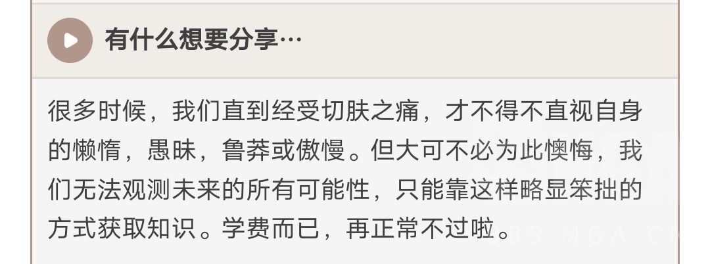
草神都这么说了，赛诺提纳里当笑话看应该也……没啥问题吧

----

##### 280.[0] \<pid:706958621\> 2023-08-04 18:34:56 by レオ
>[jump](#pid706958148) 寅覃邵辛纪唐(2023-08-04 18:32) 说: 
>
>而你，我的朋友，你还没有掌握辨认id的技巧
>有些发言该看不见就看不见，这是多次楼塌了的安全经验

没必要，讨论本身能做到就事论事就好
你非要认id的话，不就是借个号或者开个小号的事
专注于内容本身还能显得你更客观

----

##### 281.[5] \<pid:706958640\> 2023-08-04 18:35:01 by 飞霜叩门
>[jump](#pid706958274) 今锁朱楼(2023-08-04 18:32) 说: 
>
>俩人都摘过彼此的且对此心知肚明，我觉得还可以啦。

他们之间感情当然很好，我也觉得老头老太太都很有趣，我很喜欢他们，但我总觉得这个操作的价值观有些微妙

无端联想到当年fpx的嘴臭文化，虽然大家都说互相嘴臭是队伍文化，但外人看起来总觉得emmmmm一言难尽

----

##### 282.[17] \<pid:706958818\> 2023-08-04 18:36:04 by 甲查唐乙孔卫
>[jump](#pid706957823) 今锁朱楼(2023-08-04 18:30) 说: 
>
>我记得有人扒过，日本留学的文案里面有一个确实是建筑系转到文学的

头像还是帝释天本人还是个南通，正常人看一眼就有数了，结合最近的米家编剧爆典事件，隔壁白月光玛丽苏女主是男工作人员套皮事件，卡维这事多半也跑不了的

----

##### 283.[7] \<pid:706958974\> 2023-08-04 18:36:59 by 安希雅_R4
>[jump](#pid706958068) 嘟嘟水(2023-08-04 18:31)说:
>>[jump](#pid706956755) 安希雅_R4(2023-08-04 18:24) 说: 
>>
>>其实有时候觉得挺可惜的。
>>原本觉得把麦麸拿掉了他的大建筑师人设还可以救一下，殊不知麦麸才是关键设定，大建筑师才是皮毛。
>>所以卡萨扎莱宫只是一幢跟其他须弥高级建筑看不出太大区别的普通好看的房子，他们甚至不肯为这个咨询个真正的建筑师建模个有点特色的建筑——恕我直言，小提他们学院那个玻璃温室都比卡萨扎莱宫给我印象深刻，卡萨扎莱宫给我所有的印象就是它周边可以采月莲，至于它本体长啥样我印象其实不太深。
>>然而这里还有一个问题——大建筑师这个设定在麦麸这个目的中其实也是可要可不要、
>>就像你说的，一个成年的大建
>
>这就是现在国产偶像剧被人槽烂了的原因啊。一个个都是什么律师医生消防员总裁公主皇帝太子王爷，哦最近流行的时尚单品还有玉玉症，结果实际上就是为了给角色一个高大上的身份方便观众yy，实际上剧情演出来公主没有公主样王子也没有王子样玉玉也看不出来哪里玉玉为啥玉玉，这些乱七八糟的身份通通都是一个单纯的标签而已

见鬼了有时候我甚至觉得我一个学考古兼史迹保护的，为了跟着前上司学怎么搭博物馆自学了点建筑美学现在都忘光了的都比他们写手对建筑美学多点实感和敬畏……

----

##### 284.[0] \<pid:706959040\> 2023-08-04 18:37:17 by 小王饼干
>[jump](#pid706958640) 飞霜叩门(2023-08-04 18:35) 说: 
>
>他们之间感情当然很好，我也觉得老头老太太都很有趣，我很喜欢他们，但我总觉得这个操作的价值观有些微妙
>
>无端联想到当年fpx的嘴臭文化，虽然大家都说互相嘴臭是队伍文化，但外人看起来总觉得emmmmm一言难尽

fpx…唉…19年没夺冠之前还好，夺冠了之后什么都拿出来审判了，最后大概队内也决裂了

----

##### 285.[14] \<pid:706959169\> 2023-08-04 18:38:00 by 嘟嘟水
>[jump](#pid706958818) 甲查唐乙孔卫(2023-08-04 18:36) 说: 
>
>头像还是帝释天本人还是个南通，正常人看一眼就有数了，结合最近的米家编剧爆典事件，隔壁白月光玛丽苏女主是男工作人员套皮事件，卡维这事多半也跑不了的

一说到编剧套皮我就控制不住想起“你老婆是c罗”“我给c罗买婚纱”。救命什么时候看到这个我才不会笑

----

##### 286.[0] \<pid:706959175\> 2023-08-04 18:38:02 by 神乐苍籁
说起来快要前瞻了

----

##### 287.[0] \<pid:706959205\> 2023-08-04 18:38:12 by レオ
>[jump](#pid706958818) 甲查唐乙孔卫(2023-08-04 18:36) 说: 
>
>头像还是帝释天本人还是个南通，正常人看一眼就有数了，结合最近的米家编剧爆典事件，隔壁白月光玛丽苏女主是男工作人员套皮事件，卡维这事多半也跑不了的

南通根本没锤啊，连在米家哪个组都不清楚，以及你凭什么假定人家性向，万一有女朋友是不是还是骗婚给

----

##### 288.[29] \<pid:706959214\> 2023-08-04 18:38:14 by 笛河
楼里老哥老姐们假装看不见那位积极跨栏的样子真的有点规则类怪谈的味了

----

##### 289.[18] \<pid:706959298\> 2023-08-04 18:38:38 by 庚傅任甲范穆
其实卡维本来也没什么好车的，一个做烂的四星，啥也没塑造出来，存在感高全靠赖上限五和粉(也不知道是角色粉还是CP粉)够跳，不过靠这个方法达到了跟其他其名的水平，不得不说也是一种能力的体现

----

##### 290.[12] \<pid:706959367\> 2023-08-04 18:38:53 by 超定归约律
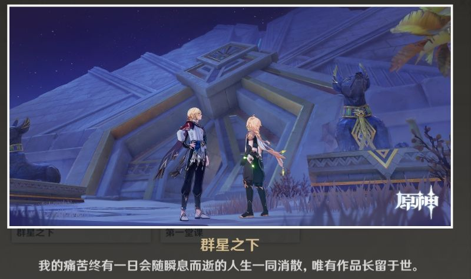
卡维邀约这条线的合照配文是我为数不多对这个角色心动了一下的地方

这句话之后才稍微让我感觉到了一点卡维作为创作者的魅力，邀约这条线是唯一一条没cue艾尔海森，纯粹主角陪卡维散心的剧情线

但可惜编剧完全没有往这方面扩写，散心线更像是写来凑数的，邀约最后被人记住的是4f聚餐线和卡维就是需要人陪伴来缓解心理问题的结论这个角色的未来已经被钉死了，没救了

----

##### 291.[15] \<pid:706959552\> 2023-08-04 18:39:52 by 小王饼干
>[jump](#pid706959214) 笛河(2023-08-04 18:38) 说: 
>
>楼里老哥老姐们假装看不见那位积极跨栏的样子真的有点规则类怪谈的味了

我看到的这三天就炸了两栋楼，不跨还能怎么办。不可直视()罢了。

----

##### 292.[18] \<pid:706959600\> 2023-08-04 18:40:10 by 今锁朱楼
>[jump](#pid706958588) 笑着选择原谅它(2023-08-04 18:34)说:
>>[jump](#pid706957823) 今锁朱楼(2023-08-04 18:30) 说: 
>>
>>我记得有人扒过，日本留学的文案里面有一个确实是建筑系转到文学的
>
>然后艾尔海森这个理论上的文科生做人做事严谨认真，反而是最需要严谨认真的理科生卡维是个不着调的
>另外关于卡维的负能量，草神大人对此的开导是
>
>草神都这么说了，赛诺提纳里当笑话看应该也……没啥问题吧

我发现她就好这口人品有问题的。
对着提纳里艾尔海森这种精神状态性格都很好的，说人家不够好，一口一个但是；对着卡维散兵这种充分挥洒她的温柔，呵护之情溢于言表。
她有救赎癖？还是说只有在这种人面前腰杆才能挺直？

----

##### 293.[17] \<pid:706959601\> 2023-08-04 18:40:10 by 可恶，长个锤子
>[jump](#pid706956605) 笑着选择原谅它(2023-08-04 18:23) 说: 
>
>没办法，赛提海(的语音文案)一个两个后脑勺都长反骨了

所以啊其实须弥的正直正常的人很多，但下场都不是很好
不算四星，就说五星，你海就不说了，被自诩娇妻的室友吸血永世不得超生；
赛诺，草行秋现在都没影子除非6白，风纪官休假几版本复读冷笑话牌佬；提纳里，发配常驻还被太子送水垫去洗白，好在强度机制还不错；
迪希雅，惨绝人寰的强度，离谱的定位，还发配常驻；
妮露，为艺术抗争教令院，但须弥女路人
这些有美好品质的各有各的不幸，倒是各位作孽的荣宠加身四星太子老赖发言，五星太子岁月史书，还有个圣母神搁那和宝藏男孩双向奔赴，屁股歪得不行

----

##### 294.[3] \<pid:706959727\> 2023-08-04 18:40:51 by 飞霜叩门
>[jump](#pid706959040) 小王饼干(2023-08-04 18:37) 说: 
>
>fpx…唉…19年没夺冠之前还好，夺冠了之后什么都拿出来审判了，最后大概队内也决裂了

只能说有些行为确实不太合适，上升期有别的东西遮盖了，但一旦没有上升就很容易裂开

摘菜这个事情也是挺怪的，我向来不觉得朋友之间应该通过互相伤害来体验关系的紧密的摘菜这事儿就有点那种感觉，我伤害了你，但你不准真的生气，这样才叫我们关系好……当时觉得就有点怪怪的

----

##### 295.[0] \<pid:706959756\> 2023-08-04 18:41:06 by lien11
也不用很努力，真没看前瞻等等看理查的消息，我才不会点开mhy的玩意儿看

----

##### 296.[0] \<pid:706959817\> 2023-08-04 18:41:22 by レオ
>[jump](#pid706959367) 超定归约律(2023-08-04 18:38) 说: 
>
>
>卡维邀约这条线的合照配文是我为数不多对这个角色心动了一下的地方
>
>这句话之后才稍微让我感觉到了一点卡维作为创作者的魅力，邀约这条线是唯一一条没cue艾尔海森，纯粹主角陪卡维散心的剧情线
>
>但可惜编剧完全没有往这方面扩写，散心线更像是写来凑数的，邀约最后被人记住的是4f聚餐线和卡维就是需要人陪伴来缓解心理问题的结论这个角色的未来已经被钉死了，没救了

类比gal的话，散心和聚餐应该算是双true end，毕竟二者表达的东西并不冲突是可以并存的

----

##### 297.[14] \<pid:706959818\> 2023-08-04 18:41:22 by 小王饼干
>[jump](#pid706959601) 可恶，长个锤子(2023-08-04 18:40) 说: 
>
>所以啊其实须弥的正直正常的人很多，但下场都不是很好
>不算四星，就说五星，你海就不说了，被自诩娇妻的室友吸血永世不得超生；
>赛诺，草行秋现在都没影子除非6白，风纪官休假几版本复读冷笑话牌佬；提纳里，发配常驻还被太子送水垫去洗白，好在强度机制还不错；
>迪希雅，惨绝人寰的强度，离谱的定位，还发配常驻；
>妮露，为艺术抗争教令院，但须弥女路人
>这些有美好品质的各有各的不幸，倒是各位作孽的荣宠加身[s

这下知道为什么大贤者不给她放出来了。大贤者你冤啊

----

##### 298.[20] \<pid:706959857\> 2023-08-04 18:41:38 by 笑着选择原谅它
>[jump](#pid706959367) 超定归约律(2023-08-04 18:38) 说: 
>
>
>卡维邀约这条线的合照配文是我为数不多对这个角色心动了一下的地方
>
>这句话之后才稍微让我感觉到了一点卡维作为创作者的魅力，邀约这条线是唯一一条没cue艾尔海森，纯粹主角陪卡维散心的剧情线
>
>但可惜编剧完全没有往这方面扩写，散心线更像是写来凑数的，邀约最后被人记住的是4f聚餐线和卡维就是需要人陪伴来缓解心理问题的结论这个角色的未来已经被钉死了，没救了

站在赤王遗迹门口，最高成就私人别墅，的建筑从业者，说这种话真的不是反讽吗，能力很大自谦可以，能力不够吹牛逼就很尴尬了兄弟

----

##### 299.[0] \<pid:706959892\> 2023-08-04 18:41:48 by 银霭鸢尾花
现在无比期待枫丹剧情(爆的典)了，嘎嘎——

----

##### 300.[23] \<pid:706959895\> 2023-08-04 18:41:48 by Kaekaekae
>[jump](#pid706959600) 今锁朱楼(2023-08-04 18:40) 说: 
>
>我发现她就好这口人品有问题的。
>对着提纳里艾尔海森这种精神状态性格都很好的，说人家不够好，一口一个但是；对着卡维散兵这种充分挥洒她的温柔，呵护之情溢于言表。
>她有救赎癖？还是说只有在这种人面前腰杆才能挺直？

有一种xp叫慕残，因为健全的人不好控制

----

##### 301.[18] \<pid:706959899\> 2023-08-04 18:41:50 by 嘟嘟水
>[jump](#pid706959214) 笛河(2023-08-04 18:38) 说: 
>
>楼里老哥老姐们假装看不见那位积极跨栏的样子真的有点规则类怪谈的味了

没办法，想要留下个楼好好聊只能这样了。实际上正常人看到大家这样子都该自觉没趣走掉啊，结果还死皮赖脸赖在这，只能说确实人不要脸天下无敌。再说了很快就前瞻，等一下就换去前瞻专楼玩了，打发下时间而已。

----

##### 302.[28] \<pid:706959939\> 2023-08-04 18:42:03 by akanatsu
锁了几个楼了，可能这就是海森把小典王放出来的代价吧，保皇没前途的，须弥剧情太深刻了

----

##### 304.[12] \<pid:706959945\> 2023-08-04 18:42:04 by 今锁朱楼
>[jump](#pid706958818) 甲查唐乙孔卫(282楼) (2023-08-04 18:36)说:
>>[jump](#pid706957823) 今锁朱楼(2023-08-04 18:30) 说: 
>>
>>我记得有人扒过，日本留学的文案里面有一个确实是建筑系转到文学的
>
>头像还是帝释天本人还是个南通，正常人看一眼就有数了，结合最近的米家编剧爆典事件，隔壁白月光玛丽苏女主是男工作人员套皮事件，卡维这事多半也跑不了的

崩坏系列已经充分展现了这帮人是多喜欢从身边取材，我没记错他们自己还很自豪地公布出来了

----

##### 305.[0] \<pid:706960199\> 2023-08-04 18:43:30 by レオ
>[jump](#pid706959899) 嘟嘟水(2023-08-04 18:41) 说: 
>
>没办法，想要留下个楼好好聊只能这样了。实际上正常人看到大家这样子都该自觉没趣走掉啊，结果还死皮赖脸赖在这，只能说确实人不要脸天下无敌。再说了很快就前瞻，等一下就换去前瞻专楼玩了，打发下时间而已。

我现在也不知道撤不撤，但回都回了，突然撤反而更怪异  ，继续玩规则类怪谈play吧

----

##### 306.[11] \<pid:706960216\> 2023-08-04 18:43:36 by 嘟嘟水
>[jump](#pid706959601) 可恶，长个锤子(2023-08-04 18:40) 说: 
>
>所以啊其实须弥的正直正常的人很多，但下场都不是很好
>不算四星，就说五星，你海就不说了，被自诩娇妻的室友吸血永世不得超生；
>赛诺，草行秋现在都没影子除非6白，风纪官休假几版本复读冷笑话牌佬；提纳里，发配常驻还被太子送水垫去洗白，好在强度机制还不错；
>迪希雅，惨绝人寰的强度，离谱的定位，还发配常驻；
>妮露，为艺术抗争教令院，但须弥女路人
>这些有美好品质的各有各的不幸，倒是各位作孽的荣宠加身[s

本质是你米编剧不会写，越给戏份人越崩，惨

----

##### 307.[17] \<pid:706960218\> 2023-08-04 18:43:37 by plume-羽
>[jump](#pid706959939) akanatsu(2023-08-04 18:42) 说: 
>
>锁了几个楼了，可能这就是海森把小典王放出来的代价吧，保皇没前途的，须弥剧情太深刻了

唉，须弥合伙营救草神这批人哪有一个好下场。

----

##### 308.[14] \<pid:706960374\> 2023-08-04 18:44:30 by lien11
>[jump](#pid706959601) 可恶，长个锤子(2023-08-04 18:40)说:
>>[jump](#pid706956605) 笑着选择原谅它(2023-08-04 18:23) 说: 
>>
>>没办法，赛提海(的语音文案)一个两个后脑勺都长反骨了
>
>所以啊其实须弥的正直正常的人很多，但下场都不是很好
>不算四星，就说五星，你海就不说了，被自诩娇妻的室友吸血永世不得超生；
>赛诺，草行秋现在都没影子除非6白，风纪官休假几版本复读冷笑话牌佬；提纳里，发配常驻还被太子送水垫去洗白，好在强度机制还不错；
>迪希雅，惨绝人寰的强度，离谱的定位，还发配常驻；
>妮露，为艺术抗争教令院，但须弥女路人
>这些有美好品质的各有各的不幸，倒是各位作孽的荣宠加身四星太子老赖发言，五星太子岁月史书，还有个圣母神搁那和宝藏男孩双向奔赴，屁股歪得不行

所以须弥后面烂到底太正常了，须弥没有正常人吗？当然有，不是遭报应了就是殃及池鱼。放在大伙眼里，好人没好报，恶人倒是逍遥自在还骑在正常人头上拉屎，这什么地狱图景

----

##### 309.[21] \<pid:706960412\> 2023-08-04 18:44:43 by 叉车佬安康鱼
>[jump](#pid706959298) 庚傅任甲范穆(2023-08-04 18:38) 说: 
>
>其实卡维本来也没什么好车的，一个做烂的四星，啥也没塑造出来，存在感高全靠赖上限五和粉(也不知道是角色粉还是CP粉)够跳，不过靠这个方法达到了跟其他其名的水平，不得不说也是一种能力的体现

本来就是从头烂到尾，毫无可取之处，车都懒得车但是有些人真的太喜欢作孽，这下不得不车了
其实卡嬷可以多来吹一吹，反驳一下，这样大家头脑风暴，就能找出更多卡维的烂点，比如夏活那个锚索之前很多人都没注意过，而据我所知前段时间卡嬷很喜欢吹卡维是“事业批”(可能是为了反驳娇妻)……粉吹的卡维的业务能力，三流文案直接正面击碎

----

##### 310.[15] \<pid:706960502\> 2023-08-04 18:45:17 by 可恶，长个锤子
>[jump](#pid706959600) 今锁朱楼(2023-08-04 18:40) 说: 
>
>我发现她就好这口人品有问题的。
>对着提纳里艾尔海森这种精神状态性格都很好的，说人家不够好，一口一个但是；对着卡维散兵这种充分挥洒她的温柔，呵护之情溢于言表。
>她有救赎癖？还是说只有在这种人面前腰杆才能挺直？

我看着觉得有种比烂的美就那种，在精神健全生活美满意志坚定的人面前潜意识里自惭形秽只能通过贬低他们获取自信，转头对更烂的挥洒同情显示自己善良

----

##### 311.[17] \<pid:706960528\> 2023-08-04 18:45:28 by 甲查唐乙孔卫
>[jump](#pid706958818) 甲查唐乙孔卫(2023-08-04 18:36) 说: 
>
>头像还是帝释天本人还是个南通，正常人看一眼就有数了，结合最近的米家编剧爆典事件，隔壁白月光玛丽苏女主是男工作人员套皮事件，卡维这事多半也跑不了的

没法编辑就补充一下，我说正常人看一眼就有数了，不是正常人完全可以没数，我不阻止
这个人岗位是文案策划性别是男头像是yys官推南通帝释天
我是觉得，正常编剧写一个不属于自己的职业里的翘楚，应该抱有对这个职业本身的敬意和朦胧的好感，不然没必要赋予自己笔下的角色这个职业，多半是觉得“这个职业里的大佬，听起来挺酷的”所以写的
而塞了大量对甲方的牢骚，对职业的抱怨，把职业生涯里遭受的打击写得一应俱全详细到家，甚至爆了字数，很难不觉得是编剧自己想发牢骚

----

##### 312.[9] \<pid:706960880\> 2023-08-04 18:47:20 by 小王饼干
>[jump](#pid706959727) 飞霜叩门(2023-08-04 18:40) 说: 
>
>只能说有些行为确实不太合适，上升期有别的东西遮盖了，但一旦没有上升就很容易裂开
>
>摘菜这个事情也是挺怪的，我向来不觉得朋友之间应该通过互相伤害来体验关系的紧密的摘菜这事儿就有点那种感觉，我伤害了你，但你不准真的生气，这样才叫我们关系好……当时觉得就有点怪怪的

我觉得须弥这俩成男别扭也就在这儿…按我的想法朋友不合分开就好了，互相伤害根本不能证明感情。你们天天在那儿互嘴又要凑在一起还要拿给我看，劝你们分开你们又不，但是见面必吵架，戏外还有一帮丫鬟给我科普这不是不合是真爱，但我就是路过被吵吵到了啊最后结果就是我对俩人印象都变坏了

----

##### 313.[9] \<pid:706960947\> 2023-08-04 18:47:43 by 奶糖包
>[jump](#pid706959899) 嘟嘟水(2023-08-04 18:41) 说: 
>
>没办法，想要留下个楼好好聊只能这样了。实际上正常人看到大家这样子都该自觉没趣走掉啊，结果还死皮赖脸赖在这，只能说确实人不要脸天下无敌。再说了很快就前瞻，等一下就换去前瞻专楼玩了，打发下时间而已。

那没办法，粘屎拖把和人谁怕碰到对方呢

----

##### 314.[12] \<pid:706961043\> 2023-08-04 18:48:16 by 安希雅_R4
>[jump](#pid706959601) 可恶，长个锤子(2023-08-04 18:40)说:
>>[jump](#pid706956605) 笑着选择原谅它(2023-08-04 18:23) 说: 
>>
>>没办法，赛提海(的语音文案)一个两个后脑勺都长反骨了
>
>所以啊其实须弥的正直正常的人很多，但下场都不是很好
>不算四星，就说五星，你海就不说了，被自诩娇妻的室友吸血永世不得超生；
>赛诺，草行秋现在都没影子除非6白，风纪官休假几版本复读冷笑话牌佬；提纳里，发配常驻还被太子送水垫去洗白，好在强度机制还不错；
>迪希雅，惨绝人寰的强度，离谱的定位，还发配常驻；
>妮露，为艺术抗争教令院，但须弥女路人
>这些有美好品质的各有各的不幸，倒是各位作孽的荣宠加身四星太子老赖发言，五星太子岁月史书，还有个圣母神搁那和宝藏男孩双向奔赴，屁股歪得不行

恐怕写手真的是日常把这些正常人叫“健人”的那伙人

----

##### 315.[1] \<pid:706961165\> 2023-08-04 18:48:55 by 那又能怎么样呢
3.2小学生吵架之后我就觉得这人不对劲，然后3.6更是直接放飞自我一条路走到黑了

----

##### 316.[17] \<pid:706961192\> 2023-08-04 18:49:07 by KingreyShawn
我当初觉得写海哥背景故事的人和写卡维背景故事的人肯定没有沟通过，而且写成的时间肯定是海在先，卡在后。从留言板时期来看，卡维和海哥吵架还是就事论事，有理念碰撞，互相之间没有谁明显被压一头的，卡维虽然困顿，但他自信且自尊，还有一些天才建筑师的气质在。海哥语音说到提纳里时，他的说法是“卡维在死域上建房子”，这乍一看就给人感觉，这个建筑师荒谬又大胆，明知不可能而为之，是个不顾一切追求他的建筑艺术的怪才。但等到卡维背景故事，又变成了“建成之后死域意外长了出来摧毁了70%”，变成了天灾，这观感就完全不一样。然后后面就有卡解抓着这前后矛盾的文案，特么不去骂编剧，在那骂角色说艾尔海森故意造谣，直接给我气笑了。这典型的团队沟通不当导致的内容矛盾，把文案的错误拿出来变成车无辜角色的论据。艾尔海森吃饱了撑的去给卡维造谣？

----

##### 317.[15] \<pid:706961290\> 2023-08-04 18:49:43 by Kaekaekae
去看了一下好嫌网原神评论区，发现他们也都知道猛干哥了只不过猛干哥日本花名叫“38岁巨婴”

----

##### 318.[8] \<pid:706961653\> 2023-08-04 18:51:46 by 米翼
>[jump](#pid706961192) KingreyShawn(2023-08-04 18:49) 说: 
>
>我当初觉得写海哥背景故事的人和写卡维背景故事的人肯定没有沟通过，而且写成的时间肯定是海在先，卡在后。从留言板时期来看，卡维和海哥吵架还是就事论事，有理念碰撞，互相之间没有谁明显被压一头的，卡维虽然困顿，但他自信且自尊，还有一些天才建筑师的气质在。海哥语音说到提纳里时，他的说法是“卡维在死域上建房子”，这乍一看就给人感觉，这个建筑师荒谬又大胆，明知不可能而为之，是个不顾一切追求他的建筑艺术的怪才。但等到卡维背景故事，又变成了“建成之后死域意外长了出来摧毁了70%”，变成了天灾，这观感就完全不一样。

说实话，要真是在死域上建房子这种性格古怪的怪才，我可能还挺喜欢的

----

##### 319.[3] \<pid:706961693\> 2023-08-04 18:51:55 by 红豆薏米汤圆
>[jump](#pid706959214) 笛河(2023-08-04 18:38) 说: 
>
>楼里老哥老姐们假装看不见那位积极跨栏的样子真的有点规则类怪谈的味了

哈哈哈哈这大夏天的 刷到你这条有很好的降温效果

----

##### 320.[24] \<pid:706961758\> 2023-08-04 18:52:15 by 嘟嘟水
>[jump](#pid706960412) 叉车佬安康鱼(2023-08-04 18:44) 说: 
>
>本来就是从头烂到尾，毫无可取之处，车都懒得车但是有些人真的太喜欢作孽，这下不得不车了
>其实卡嬷可以多来吹一吹，反驳一下，这样大家头脑风暴，就能找出更多卡维的烂点，比如夏活那个锚索之前很多人都没注意过，而据我所知前段时间卡嬷很喜欢吹卡维是“事业批”(可能是为了反驳娇妻)……粉吹的卡维的业务能力，三流文案直接正面击碎

真的很难蚌。其实我真的对沙漠里的大工程有过期待的。我老爹就是搞建筑设计的，所以我对这个职业天然有好感
结果卡维实际上就是去搞了个游乐园，还搞出没弄锚索这种大乌龙。只能说在编剧脑海里，天才建筑师人设确实不如笨蛋娇妻麦麸的人设重要了
联想到我老爹每次审图都心惊胆战战战兢兢，快60的人了看图都是戴着老花镜一次两次三次审，就因为所有工程都是终身责任制，生怕就出什么事临退休名节不保。这次夏活看到卡维这个不负责任的大乌龙，我真是无语他妈给无语开门，简直毁掉了我对他最后一丝期待

----

##### 321.[16] \<pid:706961883\> 2023-08-04 18:53:04 by 今锁朱楼
>[jump](#pid706960502) 可恶，长个锤子(2023-08-04 18:45)说:
>>[jump](#pid706959600) 今锁朱楼(2023-08-04 18:40) 说: 
>>
>>我发现她就好这口人品有问题的。
>>对着提纳里艾尔海森这种精神状态性格都很好的，说人家不够好，一口一个但是；对着卡维散兵这种充分挥洒她的温柔，呵护之情溢于言表。
>>她有救赎癖？还是说只有在这种人面前腰杆才能挺直？
>
>我看着觉得有种比烂的美就那种，在精神健全生活美满意志坚定的人面前潜意识里自惭形秽只能通过贬低他们获取自信，转头对更烂的挥洒同情显示自己善良

我记得恒纳兰那有篇分析草神的就是类似观点：小吉祥草王因为一直生活在大慈树王阴影下、自认是比不过太阳的月亮，所以对于那种人类种中的天之骄子都有一种回避之心，比如救神小队的人，只接近社会的边缘群体和弱势群体，比如病人、疯学者之类的。
文案在这种地方不是挺逻辑自洽的吗？怎么写起好的来就不行了？

----

##### 322.[25] \<pid:706962003\> 2023-08-04 18:53:45 by 笑着选择原谅它
>[jump](#pid706961758) 嘟嘟水(2023-08-04 18:52) 说: 
>
>真的很难蚌。其实我真的对沙漠里的大工程有过期待的。我老爹就是搞建筑设计的，所以我对这个职业天然有好感
>结果卡维实际上就是去搞了个游乐园，还搞出没弄锚索这种大乌龙。只能说在编剧脑海里，天才建筑师人设确实不如笨蛋娇妻麦麸的人设重要了
>联想到我老爹每次审图都心惊胆战战战兢兢，快60的人了看图都是戴着老花镜一次两次三次审，就因为所有工程都是终身责任制，生怕就出什么事临退休名节不保。这次夏活看到卡维这个不负责任的大乌龙，我真是无语他妈给无语开门，简直毁掉了我对他最后一丝期待

主线里他跟艾尔海森怎么吹牛逼的？我去沙漠里搞了个大~工程，搞笑程度确实比赛诺的冷笑话强多了

----

##### 323.[12] \<pid:706962473\> 2023-08-04 18:56:05 by lien11
我爸当初就说你学医为面前的人命负责担风险所以你会小心害怕，他们建筑更是如此，你的设计方案是要负责一整栋楼的人的安全的，风险更大，安全问题是重中之重，当然提瓦特自有规则在此不必担心

----

##### 324.[0] \<pid:706962496\> 2023-08-04 18:56:13 by レオ
>[jump](#pid706961192) KingreyShawn(2023-08-04 18:49) 说: 
>
>我当初觉得写海哥背景故事的人和写卡维背景故事的人肯定没有沟通过，而且写成的时间肯定是海在先，卡在后。从留言板时期来看，卡维和海哥吵架还是就事论事，有理念碰撞，互相之间没有谁明显被压一头的，卡维虽然困顿，但他自信且自尊，还有一些天才建筑师的气质在。海哥语音说到提纳里时，他的说法是“卡维在死域上建房子”，这乍一看就给人感觉，这个建筑师荒谬又大胆，明知不可能而为之，是个不顾一切追求他的建筑艺术的怪才。但等到卡维背景故事，又变成了“建成之后死域意外长了出来摧毁了70%”，变成了天灾，这观感就完全不一样。

你说的这个，一开始给个大概的设定最后明确下来新的更具体的也能做到，未必是不沟通，也可能明知细节稍有出入但是以新设定为准
或者说想制造出先后的反转(以为是xx结果是xx)，结果用力过猛了，拿这个车语音的我觉得是在装傻 或者为车而车

----

##### 325.[8] \<pid:706962698\> 2023-08-04 18:57:12 by 云影之离
>[jump](#pid706944715) 子刘向辛廖艾(2023-08-04 17:24) 说: 
>
>关钟离p事啊。卡维和钟离一点关系都没。
>卡厨怎么莫名其妙代入归终骂钟离
>hk厨也喜欢故意拐公钟炸楼。不理解为什么对钟离这么大恨意

没人记得了吗卡厨非要在永恒绿洲发癫，发情贴发一堆，然后伴舞锁了，她们就不乐意了，管卡维叫锁王，因为归终尘世锁，并且归终因为众所周知的原因也是一提就锁，就和归终联谊了

----

##### 326.[15] \<pid:706962911\> 2023-08-04 18:58:20 by 笑着选择原谅它
>[jump](#pid706961883) 今锁朱楼(2023-08-04 18:53) 说: 
>
>我记得恒纳兰那有篇分析草神的就是类似观点：小吉祥草王因为一直生活在大慈树王阴影下、自认是比不过太阳的月亮，所以对于那种人类种中的天之骄子都有一种回避之心，比如救神小队的人，只接近社会的边缘群体和弱势群体，比如病人、疯学者之类的。
>文案在这种地方不是挺逻辑自洽的吗？怎么写起好的来就不行了？

你说的这个倒不是没有道理，结合草神对艾尔海森的评价倒推，她对把自己应该放在哪一个层次的定位很微妙，反过来艾尔海森对她的评价也挺微妙的，有一种看动物的感觉，心理上他俩的地位搞不好是颠倒的
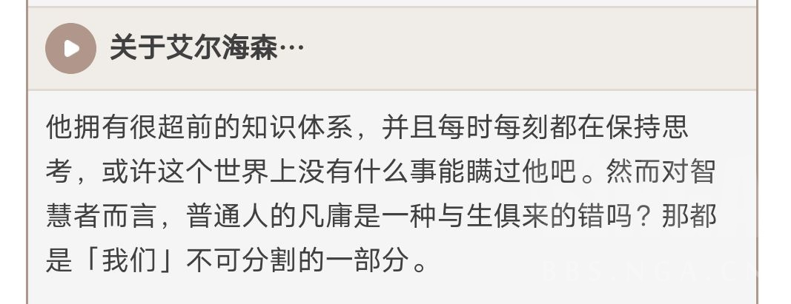

----

##### 327.[10] \<pid:706962939\> 2023-08-04 18:58:29 by 可恶，长个锤子
>[jump](#pid706962003) 笑着选择原谅它(2023-08-04 18:53) 说: 
>
>主线里他跟艾尔海森怎么吹牛逼的？我去沙漠里搞了个大~工程，搞笑程度确实比赛诺的冷笑话强多了

还大工程，差点搞个大工程事故吧
建筑这种事还不同于其他艺术，其他的你搞砸了最多也就作品砸了，建筑搞砸了可是会危及他人人身安全的，容不得一点马虎，每个节点都要认认真真算的就他那放个气球都忘了锚的样儿，我感觉妙论派把他开了把开大机甲那位老哥请回来说不定振兴速度会快一点

----

##### 328.[7] \<pid:706963005\> 2023-08-04 18:58:53 by omkl656
一模一样，我一开始还和朋友说，我好喜欢卡维，金毛控要遇到原神最喜欢的角色了，从剧情泄露的两张图就开始等卡维，结果呢？(虽然但是，我还是为了捞卡维抽了二命白术
cp卖得让人厌烦，从一开始觉得应该和海森势均力敌、但是他富有同理心、老好人的人设，到后来……咋咋唬唬没脑子惨兮兮的小哥哥一枚吖～
我几次暗暗在茶馆吐槽都被狠狠点踩，因为这个让人厌烦的cp塑造让我对海森和卡维的好感都下降很多很多
厨艾尔海森厨的，海森梦女罢了

乐子人开嗑海妮和珐卡

----

##### 329.[5] \<pid:706963020\> 2023-08-04 18:58:57 by Kaekaekae
>[jump](#pid706962698) 云影之离(2023-08-04 18:57) 说: 
>
>没人记得了吗卡厨非要在永恒绿洲发癫，发情贴发一堆，然后伴舞锁了，她们就不乐意了，管卡维叫锁王，因为归终尘世锁，并且归终因为众所周知的原因也是一提就锁，就和归终联谊了

记得还有同人图产出，然后卡解说就爱看美女贴贴

----

##### 330.[6] \<pid:706963028\> 2023-08-04 18:59:02 by 红豆薏米汤圆
>[jump](#pid706961758) 嘟嘟水(2023-08-04 18:52) 说: 
>
>真的很难蚌。其实我真的对沙漠里的大工程有过期待的。我老爹就是搞建筑设计的，所以我对这个职业天然有好感
>结果卡维实际上就是去搞了个游乐园，还搞出没弄锚索这种大乌龙。只能说在编剧脑海里，天才建筑师人设确实不如笨蛋娇妻麦麸的人设重要了
>联想到我老爹每次审图都心惊胆战战战兢兢，快60的人了看图都是戴着老花镜一次两次三次审，就因为所有工程都是终身责任制，生怕就出什么事临退休名节不保。这次夏活看到卡维这个不负责任的大乌龙，我真是无语他妈给无语开门，简直毁掉了我对他最后一丝期待

感觉这帮文案根本对职业没进行深入了解就凭刻板印象在那写...结果越写人设越立不住

----

##### 331.[8] \<pid:706963195\> 2023-08-04 18:59:53 by 己宁梅寅汪甄
>[jump](#pid706962473) lien11(2023-08-04 18:56) 说: 
>
>我爸当初就说你学医为面前的人命负责担风险所以你会小心害怕，他们建筑更是如此，你的设计方案是要负责一整栋楼的人的安全的，风险更大，安全问题是重中之重，当然提瓦特自有规则在此不必担心

须弥规则，事情无法收拾了可以让兰那罗和蕈兽自爆

----

##### 332.[11] \<pid:706963303\> 2023-08-04 19:00:26 by 小王饼干
>[jump](#pid706963005) omkl656(2023-08-04 18:58) 说: 
>
>一模一样，我一开始还和朋友说，我好喜欢卡维，金毛控要遇到原神最喜欢的角色了，从剧情泄露的两张图就开始等卡维，结果呢？(虽然但是，我还是为了捞卡维抽了二命白术
>cp卖得让人厌烦，从一开始觉得应该和海森势均力敌、但是富有同理心的人设，到后来……咋咋唬唬没脑子惨兮兮的小哥哥一枚吖
>我几次暗暗在茶馆吐槽都被狠狠点踩，因为这个让人厌烦的cp塑造让我对海森和卡维的好感都下降很多很多
>厨艾尔海森厨的，海森梦女罢了
>
>乐子人开嗑海妮和珐卡

那我就要端出我们海迪了成男成女、主线三贤、狮子与隼的含金量

----

##### 333.[8] \<pid:706963417\> 2023-08-04 19:01:06 by 叉车佬安康鱼
>[jump](#pid706962473) lien11(2023-08-04 18:56) 说: 
>
>我爸当初就说你学医为面前的人命负责担风险所以你会小心害怕，他们建筑更是如此，你的设计方案是要负责一整栋楼的人的安全的，风险更大，安全问题是重中之重，当然提瓦特自有规则在此不必担心

把被锁的楼里的图补一下
<b>不过是安全生产比例尺上小小的一段[补档]</b>

还有一张戒社经典
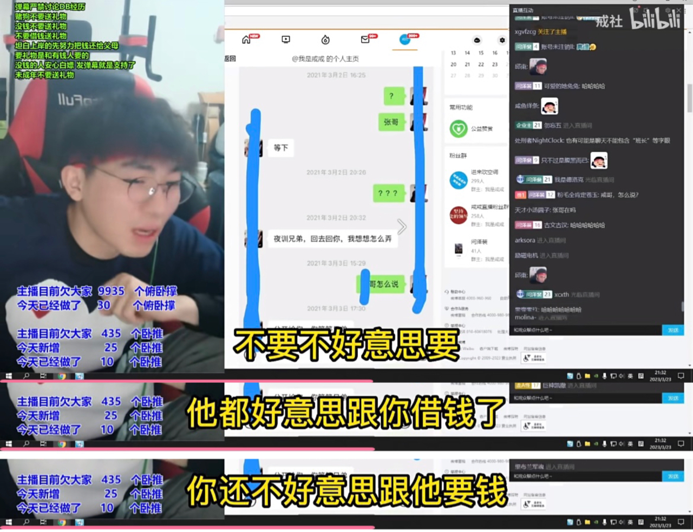

----

##### 334.[4] \<pid:706963585\> 2023-08-04 19:02:03 by omkl656
>[jump](#pid706963303) 小王饼干(2023-08-04 19:00) 说: 
>
>那我就要端出我们海迪了成男成女、主线三贤、狮子与隼的含金量

嗑了

----

##### 335.[9] \<pid:706963693\> 2023-08-04 19:02:43 by 笑着选择原谅它
>[jump](#pid706962939) 可恶，长个锤子(2023-08-04 18:58) 说: 
>
>还大工程，差点搞个大工程事故吧
>建筑这种事还不同于其他艺术，其他的你搞砸了最多也就作品砸了，建筑搞砸了可是会危及他人人身安全的，容不得一点马虎，每个节点都要认认真真算的就他那放个气球都忘了锚的样儿，我感觉妙论派把他开了把开大机甲那位老哥请回来说不定振兴速度会快一点

瞧不起加扎里是吧，人家手握迦毗鸠师的《九阳神功》~~《论文手稿》~~好不好

----

##### 336.[4] \<pid:706963874\> 2023-08-04 19:03:48 by 今锁朱楼
>[jump](#pid706963005) omkl656(2023-08-04 18:58)说:
>一模一样，我一开始还和朋友说，我好喜欢卡维，金毛控要遇到原神最喜欢的角色了，从剧情泄露的两张图就开始等卡维，结果呢？(虽然但是，我还是为了捞卡维抽了二命白术
>cp卖得让人厌烦，从一开始觉得应该和海森势均力敌、但是他富有同理心、老好人的人设，到后来……咋咋唬唬没脑子惨兮兮的小哥哥一枚吖～
>我几次暗暗在茶馆吐槽都被狠狠点踩，因为这个让人厌烦的cp塑造让我对海森和卡维的好感都下降很多很多
>厨艾尔海森厨的，海森梦女罢了
>
>乐子人开嗑海妮和珐卡

不介意的话可以去看看隼莺，有个画师画得很不错，有次路过惊到我了。

----

##### 337.[2] \<pid:706964101\> 2023-08-04 19:05:11 by omkl656
>[jump](#pid706963874) 今锁朱楼(2023-08-04 19:03) 说: 
>
>不介意的话可以去看看隼莺，有个画师画得很不错，有次路过惊到我了。

刷到过mmd，感觉也很香

----

##### 338.[4] \<pid:706964115\> 2023-08-04 19:05:18 by 嘟嘟水
>[jump](#pid706962939) 可恶，长个锤子(2023-08-04 18:58) 说: 
>
>还大工程，差点搞个大工程事故吧
>建筑这种事还不同于其他艺术，其他的你搞砸了最多也就作品砸了，建筑搞砸了可是会危及他人人身安全的，容不得一点马虎，每个节点都要认认真真算的就他那放个气球都忘了锚的样儿，我感觉妙论派把他开了把开大机甲那位老哥请回来说不定振兴速度会快一点

你别说加扎里的人设在我眼里还挺讨喜的
在男npc中的地位我觉得可以仅次于泽维尔

----

##### 339.[8] \<pid:706964175\> 2023-08-04 19:05:33 by 安希雅_R4
>[jump](#pid706960502) 可恶，长个锤子(2023-08-04 18:45)说:
>>[jump](#pid706959600) 今锁朱楼(2023-08-04 18:40) 说: 
>>
>>我发现她就好这口人品有问题的。
>>对着提纳里艾尔海森这种精神状态性格都很好的，说人家不够好，一口一个但是；对着卡维散兵这种充分挥洒她的温柔，呵护之情溢于言表。
>>她有救赎癖？还是说只有在这种人面前腰杆才能挺直？
>
>我看着觉得有种比烂的美就那种，在精神健全生活美满意志坚定的人面前潜意识里自惭形秽只能通过贬低他们获取自信，转头对更烂的挥洒同情显示自己善良

问题为什么这种语音会出现在一个神身上啊
你游新团队拉胯成这样，对神的IP管理都懒得管理了吗？
你游的神……至少到影姐为止还是有以下特性的:
1. 天生具备爱人的本能，会保护子民的一切
2. 同时因为这个本能会下意识地把子民当孩子

因为这两个特性，之前的神(温，钟，影，其他魔神)是不会对子民中的个体输出负面情绪的。
比如钟离回想起璃月人那叫一个一顿夸，不是夸夸就是在回忆“这孩子年轻时候也不容易”，满满全是“爸爸爱你”的拳拳慈父之心。
从某种意义上来说魔神不把子民当平等的存在，自然不会妒忌憎恨子民什么。

到了纳西妲这里我发现问题很大啊。
她有点yygq的在挑自己子民的刺……why？而且这几个人也没有对不起她，不但没有甚至是把她放出来的主力，why？

挑刺的隐晦含义就是她觉得这几个人跟自己平等的，甚至是对立的。
她或多或少有点害怕这几个人身上的什么特性，所以才会“但是”之类的稍微贬低一下。

她发现自己这个心理了吗？
或者写手发现自己写的有问题了吗？

你游写一个神，那应该是整个国家的父母——不说这个设定是不是有神权，而是你七神凭什么就特殊，就被重视被人在意，为什么那么多人进一个国家不管其他人怎么样反正神一定要抽一个？因为你游的神就是特殊一点啊。
既然你要把草神当作神这个特殊个体来卖你当然要保护她的逼格，而不是让她的逼格随便碎啊。

什么是逼格：让人觉得这个存在确实占在人的上位那就是逼格。被人囚禁被人无视但是仍旧爱着子民那就是逼格。
——因为这个设定不光是圣母不圣母，这个设定隐含的含义就是“对于草神来说被你们关五百年根本不算事”，“尔等终为吾之子”的上位感啊。上位者不在乎下位者的冒犯也是一种上位感啊。
现在可好……不说上次有人考察出的“草神深恨人类”这个惊悚内涵了，就这几句话里暗戳戳的yygq都让我觉得本来就很碎的草神的逼格更没法捡了……真就兰那罗都比她像神。至少兰那罗虽然偶尔会被坏那菈伤害，但是他们还是会去保护小那菈啊。

----

##### 340.[11] \<pid:706964290\> 2023-08-04 19:06:11 by 甲查唐乙孔卫
>[jump](#pid706963028) 红豆薏米汤圆(2023-08-04 18:59) 说: 
>
>感觉这帮文案根本对职业没进行深入了解就凭刻板印象在那写...结果越写人设越立不住

也说不定这就是建筑系那位转行当文案的原因呢三次元的“委屈”在二次元尽情发泄了，三次元当不好一个建筑师，就创造一个建筑师可以随便甩锅给甲方不用为安全负责的二次元世界

----

##### 341.[2] \<pid:706964738\> 2023-08-04 19:08:41 by 南海狒狒王
我强烈驳斥楼里说卡维是建筑系文案自我代入的说法，因为很明显，卡维这个内部文案对建筑系没有任何了解，很明显只是某个浪国小画家借助建筑这个皮发自己怀才不遇的疯
我也不是建筑系的，只是恰好近段时间接了个外包，校对了几百篇建筑工程期刊的论文，对建筑工程不说了解，也算是知道了个皮毛

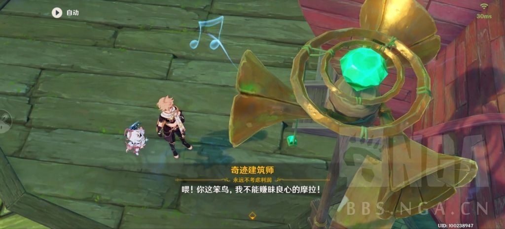
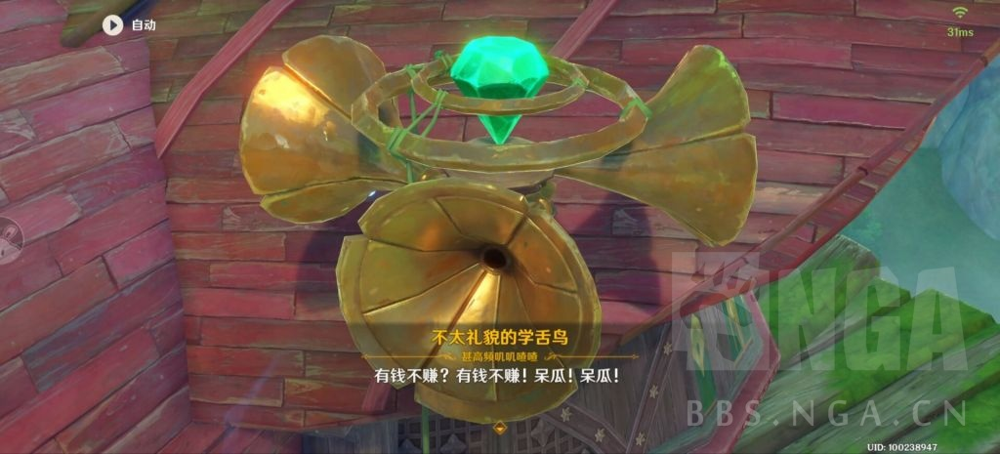
比如这里，给卡维的标签是什么，是“永远不考虑利润”
问题是你建筑师要考虑的压根不是利润，而是成本，建筑师的工资是合同制不是中间商赚差价，你要给你的甲方省钱，而不是拿着甲方的钱嚯嚯，这钱就不是你的，你是要先报价再开工，全程还要造价审核追踪，改方案要经过审核会议的，如果表现你的善良，就应该用最少的钱办最多的事，给甲方省钱，而不是“不考虑利润”

----

##### 342.[0] \<pid:706964876\> 2023-08-04 19:09:29 by niniloading
3.3之前我还捡过一点海博，因为这俩对神都有一点缺少敬畏的感觉在，对自己(掌握的知识和力量)有一种很平静的自信
然而现在，算了，这重要吗

----

##### 343.[1] \<pid:706964910\> 2023-08-04 19:09:40 by 可恶，长个锤子
>[jump](#pid706964115) 嘟嘟水(2023-08-04 19:05) 说: 
>
>你别说加扎里的人设在我眼里还挺讨喜的
>在男npc中的地位我觉得可以仅次于泽维尔

废话，你想想有个人非常严肃的跟你说我要启动这台巨大的机甲，我的后背就交给你了，谁不热血沸腾别说什么菜鸡深渊法师使徒咏者，天理来了我都给他挡着

----

##### 344.[0] \<pid:706964922\> 2023-08-04 19:09:45 by 大碗番茄炒鸡拌饭
>[jump](#pid706960528) 甲查唐乙孔卫(2023-08-04 18:45) 说: 
>
>没法编辑就补充一下，我说正常人看一眼就有数了，不是正常人完全可以没数，我不阻止
>这个人岗位是文案策划性别是男头像是yys官推南通帝释天
>我是觉得，正常编剧写一个不属于自己的职业里的翘楚，应该抱有对这个职业本身的敬意和朦胧的好感，不然没必要赋予自己笔下的角色这个职业，多半是觉得“这个职业里的大佬，听起来挺酷的”所以写的
>而塞了大量对甲方的牢骚，对职业的抱怨，把职业生涯里遭受的打击写得一应俱全详细到家，甚至爆了字数，很难不觉得是编剧自己想发牢骚

图图来了

----

##### 345.[6] \<pid:706964941\> 2023-08-04 19:09:53 by Giovann
隔壁被锁了吗这楼来继续清算，白术仅仅是和卡维同csf就要被卡解换星级嘲特效嘲服设嘲强度，她家卡就是最惨最棒最心疼的理想主义者，看一眼你白的角色故事和传说任务，对比卡维，惨烈啊  
编辑：我坚持清算实在是卡解太逆天还没出csf就成功让我这个喜欢白术的人成功对以前根本不知道的卡解产生了十足的心理阴影，要我说卡解跟三j一样沾谁谁臭

----

##### 346.[0] \<pid:706965193\> 2023-08-04 19:11:27 by 康康康酱
从外表开始感兴趣，到现在也只能对外表感得了兴趣了

----

##### 347.[0] \<pid:706965215\> 2023-08-04 19:11:37 by Kaekaekae
>[jump](#pid706964876) niniloading(2023-08-04 19:09) 说: 
>
>3.3之前我还捡过一点海博，因为这俩对神都有一点缺少敬畏的感觉在，对自己(掌握的知识和力量)有一种很平静的自信
>然而现在，算了，这重要吗

突然看到了眼熟的id，这位乐子人你在隔壁被锁的楼里回复了我一句话，我没看到，很好奇是什么，你还记得吗

----

##### 348.[3] \<pid:706965500\> 2023-08-04 19:13:24 by 小王饼干
>[jump](#pid706955918) Kaekaekae(2023-08-04 18:20) 说: 
>
>来一点日本玩家瑞平
>
>1. アルカヴェ、カヴェアルはワンク要らないみたいな風潮何マジで。キモすぎる。
>カーヴェ本人も文句しか言わない被害者面寄生虫だけどそいつ推してるやつも非常識の塊でキモすぎる。原神界隈から消えてくれ。
>看到海卡和卡海这样的风气，实在是让人无法忍受。太恶心了。虽然卡维本人也只会抱怨，是个充满怨言的受害者，但那些支持他的人也都是非常不讲理的一群，太恶心了。请从原神社区中消失吧。
>
>2. 原神にオタクの中でも最悪の層を取り込んだ元凶
>イベストじゃいちいち自分語りして進行悪くしてたし

妈呀yhm攻击性这么强的吗推上我看大伙一句话三个私密马三

----

##### 349.[7] \<pid:706965608\> 2023-08-04 19:13:54 by 甲查唐乙孔卫
>[jump](#pid706964738) 南海狒狒王(2023-08-04 19:08) 说: 
>
>我强烈驳斥楼里说卡维是建筑系文案自我代入的说法，因为很明显，卡维这个内部文案对建筑系没有任何了解，很明显只是某个浪国小画家借助建筑这个皮发自己怀才不遇的疯
>我也不是建筑系的，只是恰好近段时间接了个外包，校对了几百篇建筑工程期刊的论文，对建筑工程不说了解，也算是知道了个皮毛
>
>
>
>比如这里

真不一定，很多时候米哈游编剧不是不知道应该怎么做，它们只是不想让角色那么做，为了满足自己的私心，为了让你们抓挠它完全可以不提成本利润这些东西，但毕竟是理想主义者，说不定人家文案搞建筑的时候就很不满“凭什么我还要考虑节约成本，考虑成本我还怎么实现理想”最后干不下去来当编剧了

----

##### 350.[0] \<pid:706965623\> 2023-08-04 19:13:59 by 红豆薏米汤圆
>[jump](#pid706963874) 今锁朱楼(2023-08-04 19:03) 说: 
>
>不介意的话可以去看看隼莺，有个画师画得很不错，有次路过惊到我了。

可以礼帽问下隼莺的cp名是怎么来的吗 刚才突然好奇但是没有搜到出处

----

##### 351.[1] \<pid:706965779\> 2023-08-04 19:14:55 by niniloading
>[jump](#pid706965215) Kaekaekae(2023-08-04 19:11)说:
>[quote][pid=706964876,37253244,18]Reply[/pid] <b>Post by [uid=60493627]niniloading[/uid] (2023-08-04 19:09):</b>  3.3之前我还捡过一点海博，因为这俩对神都有一点缺少敬畏的感觉在，对自己(掌握的知识和力量)有一种很平静的自信 然而现在，算了，这重要吗[/quote]突然看到了眼熟的id，这位乐子人你在隔壁被锁的楼里回复了我一句话，我没看到，很好奇是什么，你还记得吗[s:ac:哭笑]

哦哦哦是你！我还以为我没发出去就隐了！
应该是说原铺垫这么久的雷电五传故事最后这样潦草收场，比不上打滚人前圈的高中生唱歌跳舞恨海情天一根(各有各的烂，没有说那边写得很好的意思)

----

##### 352.[3] \<pid:706965854\> 2023-08-04 19:15:21 by whaleso
>[jump](#pid706959367) 超定归约律(2023-08-04 18:38) 说: 
>
>
>卡维邀约这条线的合照配文是我为数不多对这个角色心动了一下的地方
>
>这句话之后才稍微让我感觉到了一点卡维作为创作者的魅力，邀约这条线是唯一一条没cue艾尔海森，纯粹主角陪卡维散心的剧情线
>
>但可惜编剧完全没有往这方面扩写，散心线更像是写来凑数的，邀约最后被人记住的是4f聚餐线和卡维就是需要人陪伴来缓解心理问题的结论这个角色的未来已经被钉死了，没救了

出脑一下，文案写出“唯有作品长存于世”的时候想的是自己那些牛头不对马嘴逻辑稀烂的故事吧

----

##### 353.[1] \<pid:706965974\> 2023-08-04 19:16:07 by 嘟嘟水
>[jump](#pid706965500) 小王饼干(2023-08-04 19:13) 说: 
>
>妈呀yhm攻击性这么强的吗推上我看大伙一句话三个私密马三

不一定是yhm吧，有可能是樱花老哥

----

##### 354.[2] \<pid:706966234\> 2023-08-04 19:17:37 by Kaekaekae
>[jump](#pid706965779) niniloading(2023-08-04 19:14) 说: 
>
>哦哦哦是你！我还以为我没发出去就隐了！
>应该是说原铺垫这么久的雷电五传故事最后这样潦草收场，比不上打滚人前圈的高中生唱歌跳舞恨海情天一根(各有各的烂，没有说那边写得很好的意思)

es的确是突出一个高中生唱个歌跳个舞莫名就上升到看不懂的高度了
原神正好相反，真正流血杀人的事情撞个树就大事化小小事化了了

----

##### 355.[0] \<pid:706966291\> 2023-08-04 19:18:00 by 剑筑师と書記官
>[jump](#pid706963874) 今锁朱楼(2023-08-04 19:03) 说: 
>
>不介意的话可以去看看隼莺，有个画师画得很不错，有次路过惊到我了。

这个莺是我想的那个吗

----

##### 357.[7] \<pid:706966545\> 2023-08-04 19:19:29 by 超定归约律
>[jump](#pid706965854) whaleso(2023-08-04 19:15) 说: 
>
>出脑一下，文案写出“唯有作品长存于世”的时候想的是自己那些牛头不对马嘴逻辑稀烂的故事吧

你这么一说瞬间下头
这帮傻呗文案写的东西别说长存，五年后就会从互联网消失吧

----

##### 359.[3] \<pid:706966745\> 2023-08-04 19:20:46 by 叉车佬安康鱼
>[jump](#pid706966545) 超定归约律(2023-08-04 19:19) 说: 
>
>你这么一说瞬间下头
>这帮傻呗文案写的东西别说长存，五年后就会从互联网消失吧

有一说一，应该会遗臭万年，毕竟一个大版本出两个赔钱货也是很少见的

----

##### 360.[3] \<pid:706966775\> 2023-08-04 19:20:55 by 小王饼干
>[jump](#pid706966545) 超定归约律(2023-08-04 19:19) 说: 
>
>你这么一说瞬间下头
>这帮傻呗文案写的东西别说长存，五年后就会从互联网消失吧

遗臭万年怎么不算是一种长存呢

----

##### 362.[1] \<pid:706966871\> 2023-08-04 19:21:35 by 红豆薏米汤圆
>[jump](#pid706966291) 剑筑师と書記官(2023-08-04 19:18) 说: 
>
>这个莺是我想的那个吗

你不会...以为是莺儿吧~~因为第一次看到我也是这么以为的~~

----

##### 363.[0] \<pid:706967158\> 2023-08-04 19:23:26 by 寅覃邵辛纪唐
>[jump](#pid706966291) 剑筑师と書記官(2023-08-04 19:18) 说: 
>
>这个莺是我想的那个吗

海森和丽莎
别说，丽莎新皮肤那个配色还真挺般配的，起码mmd里看着挺顺眼

----

##### 364.[0] \<pid:706967266\> 2023-08-04 19:24:09 by 今锁朱楼
>[jump](#pid706965623) 红豆薏米汤圆(2023-08-04 19:13):

我也不知道，没磕过，刷lof的时候个性化推荐推给我的，我看tag是这个就这么念了

----

##### 365.[0] \<pid:706967380\> 2023-08-04 19:24:51 by 今锁朱楼
>[jump](#pid706967158) 寅覃邵辛纪唐(363楼) (2023-08-04 19:23)说:
>[quote][pid=706966291,37253244,18]Reply[/pid] <b>Post by [uid=65051592]剑筑师と書記官[/uid] (2023-08-04 19:18):</b>  这个莺是我想的那个吗[s:a2:惊][/quote][s:ac:哭笑]海森和丽莎 别说，丽莎新皮肤那个配色还真挺般配的，起码mmd里看着挺顺眼

不是啊，莺是莱依拉。

----

##### 366.[0] \<pid:706967423\> 2023-08-04 19:25:08 by omkl656
>[jump](#pid706967158) 寅覃邵辛纪唐(2023-08-04 19:23) 说: 
>
>海森和丽莎
>别说，丽莎新皮肤那个配色还真挺般配的，起码mmd里看着挺顺眼

莺是莱依拉，蔷是丽莎(？)
这俩都和海组过cp

----

##### 367.[0] \<pid:706967432\> 2023-08-04 19:25:11 by 红豆薏米汤圆
>[jump](#pid706967158) 寅覃邵辛纪唐(2023-08-04 19:23) 说: 
>
>海森和丽莎
>别说，丽莎新皮肤那个配色还真挺般配的，起码mmd里看着挺顺眼

隼莺是海哥和莱依拉 隼蔷才是海哥和丽莎

----

##### 368.[4] \<pid:706967510\> 2023-08-04 19:25:42 by 安希雅_R4
>[jump](#pid706965974) 嘟嘟水(2023-08-04 19:16):

不，应该是樱花妹。这些对话里很多yhm车的点隐隐都是“海卡姐没有遵守圈里规矩”，比如第一句话的“ワンク”，意思就是“腐向的作品在比如推特什么公共场所展出的时候都要先放到别的图床里面然后放警告”，这样可以让不看的人自然避雷。但是海卡很多作品是大庭广众之下放的，不但放还转，上次我在推上关注了一位画别的角色画的很好的太太，结果瞬间就被推了一堆海卡的图
像这样的腐圈规矩，一般的yh哥们是不知道的，或者知道也不会车，因为圈子不一样。

----

##### 369.[1] \<pid:706967515\> 2023-08-04 19:25:43 by 寅覃邵辛纪唐
>[jump](#pid706967380) 今锁朱楼(2023-08-04 19:24) 说: 
>
>不是啊，莺是莱依拉。

记错了，丽莎是隼蔷
拉郎太多记不太住礼貌磕一口

----

##### 370.[0] \<pid:706967652\> 2023-08-04 19:26:32 by 今锁朱楼
>[jump](#pid706966291) 剑筑师と書記官(2023-08-04 19:18):

是莱依拉啦。
至于为啥叫莺我也不清楚，人家tag是这么打的。
会提这个是因为lof当时给我推了，确实画得很好印象很深，而且我也没磕过艾尔海森的cp，只认识这个就提了一嘴。

----

##### 371.[3] \<pid:706967668\> 2023-08-04 19:26:38 by F8273937
须弥主线前半段，海哥对神明明有独到的思考和非推崇态度，后期这些特质都不再被提及，变为一般优质公务员，可能文案不觉得这些特质重要吧

----

##### 372.[0] \<pid:706967774\> 2023-08-04 19:27:12 by whaleso
>[jump](#pid706964175) 安希雅_R4(2023-08-04 19:05) 说: 
>
>问题为什么这种语音会出现在一个神身上啊
>你游新团队拉胯成这样，对神的IP管理都懒得管理了吗？
>你游的神……至少到影姐为止还是有以下特性的:
>1. 天生具备爱人的本能，会保护子民的一切
>2. 同时因为这个本能会下意识地把子民当孩子
>
>因为这两个特性，之前的神(温，钟，影，其他魔神)是不会对子民中的个体输出负面情绪的。
>比如钟离回想起璃月人那叫一个一顿夸，不是夸夸就是在回忆“这孩子年轻时候也不容易”，满满全是“爸爸爱你”的拳拳慈父之心。
>从某种意义上来说魔神不把子民当平等的存在，自然

纯粹就是文案想写纳西妲平等看待每一个人并且往下兼容吧，但是这个表现手法现在大多数人都不吃了

----

##### 373.[1] \<pid:706967947\> 2023-08-04 19:28:07 by 红豆薏米汤圆
>[jump](#pid706967266) 今锁朱楼(2023-08-04 19:24) 说: 
>
>我也不知道，没磕过，刷lof的时候个性化推荐推给我的，我看tag是这个就这么念了

哦哦 哈哈 我刚刚去查了下 应该是因为莱依拉命座是夜莺座 所以简称隼莺

----

##### 374.[0] \<pid:706968016\> 2023-08-04 19:28:27 by 今锁朱楼
>[jump](#pid706965500) 小王饼干(2023-08-04 19:13):

霓虹那边也有女性向匿名论坛的，见过几个发言真的是惊爆眼球。

----

##### 375.[0] \<pid:706968037\> 2023-08-04 19:28:36 by 剑筑师と書記官
>[jump](#pid706967652) 今锁朱楼(2023-08-04 19:26) 说: 
>
>是莱依拉啦。
>至于为啥叫莺我也不清楚，人家tag是这么打的。
>会提这个是因为lof当时给我推了，确实画得很好印象很深，而且我也没磕过艾尔海森的cp，只认识这个就提了一嘴。

啊 Layla的话那或许能理解了，夜莺座

----

##### 376.[3] \<pid:706968114\> 2023-08-04 19:29:00 by 安希雅_R4
>[jump](#pid706967774) whaleso(2023-08-04 19:27)说:
>[quote][pid=706964175,37253244,17]Reply[/pid] <b>Post by [uid=65064818]安希雅_R4[/uid] (2023-08-04 19:05):</b>  问题为什么这种语音会出现在一个神身上啊[s:ac:汗] 你游新团队拉胯成这样，对神的IP管理都懒得管理了吗？ 你游的神……至少到影姐为止还是有以下特性的: 1. 天生具备爱人的本能，会保护子民的一切 2. 同时因为这个本能会下意识地把子民当孩子  因为这两个特性，之前的神(温，钟，影，其他魔神)是不会对子民中的个体输出负面情绪的。 比如钟离回想起璃月人那叫一个一顿夸，不是夸夸就是在回忆“这孩子年轻时候也不容易”，满满全是“爸爸爱你”的拳拳慈父之心。 从某种意义上来说魔神不把子民当平等的存在，自然[/quote]纯粹就是文案想写纳西妲平等看待每一个人并且往下兼容吧，但是这个表现手法现在大多数人都不吃了[s:ac:汗]

平等看待X
平等恨着每个比自己强的人 √

----

##### 377.[4] \<pid:706968158\> 2023-08-04 19:29:13 by 小王饼干
>[jump](#pid706967668) F8273937(2023-08-04 19:26) 说: 
>
>须弥主线前半段，海哥对神明明有独到的思考和非推崇态度，后期这些特质都不再被提及，变为一般优质公务员，可能文案不觉得这些特质重要吧

又一个我喜欢的点被忘了。“神也是动物”这种发言后期仿佛全不存在了一样只有无穷无尽的吵架

----

##### 378.[4] \<pid:706968183\> 2023-08-04 19:29:23 by 煌星若月
>[jump](#pid706967774) whaleso(2023-08-04 19:27) 说: 
>
>纯粹就是文案想写纳西妲平等看待每一个人并且往下兼容吧，但是这个表现手法现在大多数人都不吃了

平等看待？嫉贤妒能
整个须弥剧情都在嫉贤妒能，有点本事的都被拿下了

----

##### 379.[1] \<pid:706968217\> 2023-08-04 19:29:33 by 叉车佬安康鱼
>[jump](#pid706967510) 安希雅_R4(2023-08-04 19:25) 说: 
>
>不，应该是樱花妹。这些对话里很多yhm车的点隐隐都是“海卡姐没有遵守圈里规矩”，比如第一句话的“ワンク”，意思就是“腐向的作品在比如推特什么公共场所展出的时候都要先放到别的图床里面然后放警告”，这样可以让不看的人自然避雷。但是海卡很多作品是大庭广众之下放的，不但放还转，上次我在推上关注了一位画别的角色画的很好的太太，结果瞬间就被推了一堆海卡的图
>像这样的腐圈规矩，一般的yh哥们是不知道的，或者知道也不会车，因为圈子不一样。

其实海卡不止yhm的名声很差，洋妞也去年欧美海卡姐和赛提姐联合网暴了海赛海的蓝鸟主页几千条

----

##### 380.[0] \<pid:706968340\> 2023-08-04 19:30:12 by 神乐苍籁
来提醒一下前瞻开始了

----

##### 381.[2] \<pid:706968428\> 2023-08-04 19:30:40 by Kaekaekae
>[jump](#pid706967510) 安希雅_R4(2023-08-04 19:25) 说: 
>
>不，应该是樱花妹。这些对话里很多yhm车的点隐隐都是“海卡姐没有遵守圈里规矩”，比如第一句话的“ワンク”，意思就是“腐向的作品在比如推特什么公共场所展出的时候都要先放到别的图床里面然后放警告”，这样可以让不看的人自然避雷。但是海卡很多作品是大庭广众之下放的，不但放还转，上次我在推上关注了一位画别的角色画的很好的太太，结果瞬间就被推了一堆海卡的图
>像这样的腐圈规矩，一般的yh哥们是不知道的，或者知道也不会车，因为圈子不一样。

原来是这个意思，我日语只有N2水平，拜托了GPT帮我翻译，结果它直接给我略过这个它不懂的词语了

----

##### 382.[4] \<pid:706968720\> 2023-08-04 19:32:15 by 米翼
>[jump](#pid706967510) 安希雅_R4(2023-08-04 19:25) 说: 
>
>不，应该是樱花妹。这些对话里很多yhm车的点隐隐都是“海卡姐没有遵守圈里规矩”，比如第一句话的“ワンク”，意思就是“腐向的作品在比如推特什么公共场所展出的时候都要先放到别的图床里面然后放警告”，这样可以让不看的人自然避雷。但是海卡很多作品是大庭广众之下放的，不但放还转，上次我在推上关注了一位画别的角色画的很好的太太，结果瞬间就被推了一堆海卡的图
>像这样的腐圈规矩，一般的yh哥们是不知道的，或者知道也不会车，因为圈子不一样。

我见过一个yh哥点评卡粉：以为只有女性在批判这角色的思考视野狭窄得可怕

真的很震惊，就个人感觉通常目指女性向的角色，反过来是男玩家讨厌的比较多才对吧

----

##### 383.[4] \<pid:706968813\> 2023-08-04 19:32:49 by 叉车佬安康鱼
>[jump](#pid706968183) 煌星若月(2023-08-04 19:29) 说: 
>
>平等看待？嫉贤妒能
>整个须弥剧情都在嫉贤妒能，有点本事的都被拿下了

可能因为草神认为有能力，比她强，功高震主的人难以控制吧，尤其海和赛本身就是作为教令院人士但是背叛了当届教令院，迪希雅和爷是外来人口更没有顾虑，重来一次主线也不是不可能

----

##### 385.[1] \<pid:706969554\> 2023-08-04 19:36:59 by 笑着选择原谅它
隔空，对艾尔海森有评价且没有附带任何转折的就三个人，坎蒂丝，赛诺，莱伊拉，这个cp甚至挺合理的

----

##### 386.[0] \<pid:706969606\> 2023-08-04 19:37:10 by 可恶，长个锤子
>[jump](#pid706968813) 叉车佬安康鱼(2023-08-04 19:32) 说: 
>
>可能因为草神认为有能力，比她强，功高震主的人难以控制吧，尤其海和赛本身就是作为教令院人士但是背叛了当届教令院，迪希雅和爷是外来人口更没有顾虑，重来一次主线也不是不可能

这我就更不理解了，她不是手握世界树吗，岁就完事了怕个der啊

----

##### 387.[5] \<pid:706970123\> 2023-08-04 19:39:27 by lien11
>[jump](#pid706969606) 可恶，长个锤子(2023-08-04 19:37)说:
>[quote][pid=706968813,37253244,20]Reply[/pid] <b>Post by [uid=60292166]叉车佬安康鱼[/uid] (2023-08-04 19:32):</b>  [s:ac:哭笑]可能因为草神认为有能力，比她强，功高震主的人难以控制吧，尤其海和赛本身就是作为教令院人士但是背叛了当届教令院，迪希雅和爷是外来人口更没有顾虑，重来一次主线也不是不可能[/quote]这我就更不理解了，她不是手握世界树吗，岁就完事了怕个der啊[s:ac:哭笑]

没本事的玩意总是会心虚的，会觉得自己能岁一万次别人也能推翻自己一万零一次

----

##### 388.[4] \<pid:706970129\> 2023-08-04 19:39:29 by 叉车佬安康鱼
>[jump](#pid706969606) 可恶，长个锤子(2023-08-04 19:37) 说: 
>
>这我就更不理解了，她不是手握世界树吗，岁就完事了怕个der啊

如果……有些人能发现岁了呢？我见过一种猜测，说艾尔海森和赛诺在庆功宴上的对话就是发现了历史改变之后在通气，虽然实际上的剧情应该不会是这样

----

##### 389.[1] \<pid:706971103\> 2023-08-04 19:43:34 by 笑着选择原谅它
>[jump](#pid706970123) lien11(2023-08-04 19:39) 说: 
>
>没本事的玩意总是会心虚的，会觉得自己能岁一万次别人也能推翻自己一万零一次

我刚才翻坎蒂丝语音才发现她对草神的评价，未尝不是她悲剧的根源

草神啊…作为阿赫玛尔血脉延续的我既然能在此安然生存，或许也仰赖她的仁慈吧。不过，虽说心中怀有淡薄的感激之念，但我毕竟是沙漠的子嗣…

----

##### 390.[0] \<pid:706971227\> 2023-08-04 19:44:09 by 安希雅_R4
>[jump](#pid706968720) 米翼(2023-08-04 19:32)说:
>[quote][pid=706967510,37253244,19]Reply[/pid] <b>Post by [uid=65064818]安希雅_R4[/uid] (2023-08-04 19:25):</b>  不，应该是樱花妹。这些对话里很多yhm车的点隐隐都是“海卡姐没有遵守圈里规矩”，比如第一句话的“ワンク”，意思就是“腐向的作品在比如推特什么公共场所展出的时候都要先放到别的图床里面然后放警告”，这样可以让不看的人自然避雷。但是海卡很多作品是大庭广众之下放的，不但放还转，上次我在推上关注了一位画别的角色画的很好的太太，结果瞬间就被推了一堆海卡的图[s:ac:凌乱] 像这样的腐圈规矩，一般的yh哥们是不知道的，或者知道也不会车，因为圈子不一样。[/quote]我见过一个yh哥点评卡粉：以为只有女性在批判这角色的思考视野狭窄得可怕  真的很震惊，就个人感觉通常目指女性向的角色，反过来是男玩家讨厌的比较多才对吧[s:ac:哭笑]

可能yh哥默默点了个踩就走了，这里车的人必然对女性向内容非常熟悉

----

##### 391.[0] \<pid:706971467\> 2023-08-04 19:45:21 by 可恶，长个锤子
>[jump](#pid706970123) lien11(2023-08-04 19:39) 说: 
>
>没本事的玩意总是会心虚的，会觉得自己能岁一万次别人也能推翻自己一万零一次

懂了，欺负稻妻离得远对史书这件事一无所知呢

----

##### 392.[1] \<pid:706972047\> 2023-08-04 19:48:00 by 米翼
>[jump](#pid706971227) 安希雅_R4(2023-08-04 19:44) 说: 
>
>可能yh哥默默点了个踩就走了，这里车的人必然对女性向内容非常熟悉

也是，正因为目指女性向结果指歪了导致yhm反而想吐槽的更多
顺便一提，这个yh哥这么说卡粉，是因为有个卡粉在那发癫嘲吐槽卡维塑造的都是玩家嫉妒之类的，和国内有些粉真的是一脉相承的让人难绷

----

##### 393.[0] \<pid:706973012\> 2023-08-04 19:52:02 by KingreyShawn
>[jump](#pid706970129) 叉车佬安康鱼(2023-08-04 19:39) 说: 
>
>如果……有些人能发现岁了呢？我见过一种猜测，说艾尔海森和赛诺在庆功宴上的对话就是发现了历史改变之后在通气，虽然实际上的剧情应该不会是这样

说到庆功宴这里，我也觉得海哥的表现很耐人寻味。主线开头的时候 海哥能根据旅行者的微表情和说话语气等判断出来旅行者知道一些事但没和他坦白。而庆功宴时，迪娜泽黛捂着脑袋说我好像忘了什么我是不是记错了，旅行者有个惊讶表情的特写，然后镜头专门转到了海哥的侧脸，看不见表情，海哥平静地安抚迪娜泽黛说你没记错，这里我印象很深刻，也不知道是编剧故意的还是啥。但庆功宴结束之后，剧情就开始朝着奇怪的方向跑起来了……

----

##### 394.[0] \<pid:706974141\> 2023-08-04 19:57:06 by 虚室生白红茶版
>[jump](#pid706880150) mASAYUMecHASIN(2023-08-04 12:15) 说: 
>
>好我记错了了我道歉，那把占便宜的部分全部删掉，他不还是在第一天唉声叹气、给珐姐甩脸子了？幸好文案够鸡贼，是让卡维给珐姐甩脸子，换成莱依拉，假如莱依拉一边道歉一边手足无措的话，是个人都发现不对劲了吧

他哪次不炸裂……
只是每次文案都很鸡贼，一直在通过说话对象转移自身塑造问题。
主线和传说出场对海森说的话，“别看你那破书了”、“你这种人怎么可能拯救须弥”、“你这种人怎么可能有朋友”，除了我还有人愿意当你朋友？我当时就心想，我去，这不是典中典PUA话术？贬低别人爱好和价值的同时暗暗抬高自己。只不过艾尔海森精神堡垒太强根本不吃他那套罢了。你看他这番话把海哥这个对象换成莱伊拉来说，有多少人能看出问题。
对多莉也是，典中典发言，“她为什么不能是一个更善良的好人”，不向我讨债。亏多莉有钱给了一些人通过说多莉奸商来转移矛盾的可乘之机。这个对象要是换成一个正常的、没那么多钱资金链因此断了的甲方，也更容易看出问题来了吧

----

##### 396.[0] \<pid:706976297\> 2023-08-04 20:06:42 by lien11
说多莉奸商的有没有想过，这奸商资金链真断了须弥的免费医疗出问题怎么办，是靠自爆的典王还是逍遥的其他，抑或是修个工程都能出安全问题的大建筑师好一个地狱

----

##### 397.[0] \<pid:706976394\> 2023-08-04 20:07:08 by 今天的我摸鱼了吗
须弥的几位自机在主线结束后塑造就再也没有深入过，甚至可以说是倒退了，怎么回事呢

----

##### 398.[8] \<pid:706979109\> 2023-08-04 20:18:06 by mASAYUMecHASIN
>[jump](#pid706974141) 虚室生白红茶版(2023-08-04 19:57)说:
>[quote][pid=706880150,37253244,4]Reply[/pid] <b>Post by [uid=65201085]mASAYUMecHASIN[/uid] (2023-08-04 12:15):</b>  好我记错了了我道歉，那把占便宜的部分全部删掉，他不还是在第一天唉声叹气、给珐姐甩脸子了？幸好文案够鸡贼，是让卡维给珐姐甩脸子，换成莱依拉，假如莱依拉一边道歉一边手足无措的话，是个人都发现不对劲了吧[/quote]他哪次不炸裂…… 只是每次文案都很鸡贼，一直在通过说话对象转移自身塑造问题。 主线和传说出场对海森说的话，“别看你那破书了”、“你这种人怎么可能拯救须弥”、“你这种人怎么可能有朋友”，除了我还有人愿意当你朋友？我当时就心想，我去，这不是典中典PUA话术？贬低别人爱好和价值的同时暗暗抬高自己[s:ac:哭笑]。只不过艾尔海森精神堡垒太强根本不吃他那套罢了。你看他这番话把海哥这个对象换成莱伊拉来说，有多少人能看出问题。 对多莉也是，典中典发言，“她为什么不能是一个更善良的好人”，不向我讨债。亏多莉有钱给了一些人通过说多莉奸商来转移矛盾的可乘之机[s:ac:喷]。这个对象要是换成一个正常的、没那么多钱资金链因此断了的甲方，也更容易看出问题来了吧

所以草神的塑造还有可能不是故意的，卡维绝对是故意写成现在这个吊样的，他最令人诟病的几次事件都精准挑选了一些精神坚韧、信念坚定，不会真的被他的行为伤害、影响的人，我悟了这才是“他被收走了伤害他人能力”的真正意思，不是卡维不会再去伤害别人了，而是文案每次都给卡维精心挑好了伤害对象，又让卡维满足了伤害他人的欲望，又因为受害者自身的强大，而让他们看起来没有受到伤害，以堵悠悠之口。坏了越想越感觉卡维像被文案饲养的小邪神了

----

##### 399.[2] \<pid:706979965\> 2023-08-04 20:21:37 by 安希雅_R4
>[jump](#pid706979109) mASAYUMecHASIN(2023-08-04 20:18)说:
>>[jump](#pid706974141) 虚室生白红茶版(2023-08-04 19:57)说:
>>[quote][pid=706880150,37253244,4]Reply[/pid] <b>Post by [uid=65201085]mASAYUMecHASIN[/uid] (2023-08-04 12:15):</b>  好我记错了了我道歉，那把占便宜的部分全部删掉，他不还是在第一天唉声叹气、给珐姐甩脸子了？幸好文案够鸡贼，是让卡维给珐姐甩脸子，换成莱依拉，假如莱依拉一边道歉一边手足无措的话，是个人都发现不对劲了吧[/quote]他哪次不炸裂…… 只是每次文案都很鸡贼，一直在通过说话对象转移自身塑造问题。 主线和传说出场对海森说的话，“别看你那破书了”、“你这种人怎么可能拯救须弥”、“你这种人怎么可能有朋友”，除了我还有人愿意当你朋友？我当时就心想，我去，这不是典中典PUA话术？贬低别人爱好和价值的同时暗暗抬高自己[s:ac:哭笑]。只不过艾尔海森精神堡垒太强根本不吃他那套罢了。你看他这番话把海哥这个对象换成莱伊拉来说，有多少人能看出问题。 对多莉也是，典中典发言，“她为什么不能是一个更善良的好人”，不向我讨债。亏多莉有钱给了一些人通过说多莉奸商来转移矛盾的可乘之机[s:ac:喷]。这个对象要是换成一个正常的、没那么多钱资金链因此断了的甲方，也更容易看出问题来了吧
>
>所以草神的塑造还有可能不是故意的，卡维绝对是故意写成现在这个吊样的，他最令人诟病的几次事件都精准挑选了一些精神坚韧、信念坚定，不会真的被他的行为伤害、影响的人，我悟了这才是“他被收走了伤害他人能力”的真正意思，不是卡维不会再去伤害别人了，而是文案每次都给卡维精心挑好了伤害对象，又让卡维满足了伤害他人的欲望，又因为受害者自身的强大，而让他们看起来没有受到伤害，以堵悠悠之口。坏了越想越感觉卡维像被文案饲养的小邪神了

、
我上面的帖子就说了，但凡把海哥性别换成个姑娘，你再看看效果

----

##### 400.[0] \<pid:706982583\> 2023-08-04 20:32:56 by 虚室生白红茶版
>[jump](#pid706979109) mASAYUMecHASIN(2023-08-04 20:18) 说: 
>
>所以草神的塑造还有可能不是故意的，卡维绝对是故意写成现在这个吊样的，他最令人诟病的几次事件都精准挑选了一些精神坚韧、信念坚定，不会真的被他的行为伤害、影响的人，我悟了这才是“他被收走了伤害他人能力”的真正意思，不是卡维不会再去伤害别人了，而是文案每次都给卡维精心挑好了伤害对象，又让卡维满足了伤害他人的欲望，又因为受害者自身的强大，而让他们看起来没有受到伤害，以堵悠悠之口。坏了越想越感觉卡维像被文案饲养的小邪神了

精心挑选受害对象这点真没绷住
从某些方面来说编剧在这方面的塑造还挺……“成功”的

----

##### 401.[0] \<pid:706987076\> 2023-08-04 20:51:13 by mASAYUMecHASIN
>[jump](#pid706979965) 安希雅_R4(2023-08-04 20:21):

之前看性转版的感受是性转后好可怕，幸好艾尔海森是比他壮的男的，卡维没有机会真的去毁掉一个学妹的人生，没想那么多，草啊我现在脑内的这个卡维还不如男娇妻呢

----

##### 402.[0] \<pid:706997155\> 2023-08-04 21:34:54 by 虚室生白红茶版
>[jump](#pid706987076) mASAYUMecHASIN(2023-08-04 20:51) 说: 
>
>之前看性转版的感受是性转后好可怕，幸好艾尔海森是比他壮的男的，卡维没有机会真的去毁掉一个学妹的人生，没想那么多，草啊我现在脑内的这个卡维还不如男娇妻呢

你这一说……我想起来这也是我为什么在贼早的时候磕过一点kh后面转纯雷的原因……
因为这关系里你把艾尔海森当受位再加点性转的话就是纯纯的三次元版阴间……确实里面很多人舞的也是卡维可以出轨/和别人结婚，然后艾尔海森需要痴情倒贴、免费当全自助提款机帮卡维养娃。什么软饭男+倒贴白富美组合，啊，my eyes，刷到不小心一眼都是救大命的程度

----

##### 403.[5] \<pid:707001816\> 2023-08-04 21:57:18 by 可恶，长个锤子
>[jump](#pid706997155) 虚室生白红茶版(2023-08-04 21:34)说:
>[quote][pid=706987076,37253244,21]Reply[/pid] <b>Post by [uid=65201085]mASAYUMecHASIN[/uid] (2023-08-04 20:51):</b>  之前看性转版的感受是性转后好可怕，幸好艾尔海森是比他壮的男的，卡维没有机会真的去毁掉一个学妹的人生，没想那么多[s:ac:怕]，草啊我现在脑内的这个卡维还不如男娇妻呢[s:ac:汗][/quote]你这一说……我想起来这也是我为什么在贼早的时候磕过一点kh后面转纯雷的原因…… 因为这关系里你把艾尔海森当受位再加点性转的话就是纯纯的三次元版阴间……确实里面很多人舞的也是卡维可以出轨/和别人结婚，然后艾尔海森需要痴情倒贴、免费当全自助提款机帮卡维养娃。什么软饭男+倒贴白富美组合，啊，my eyes，刷到不小心一眼都是救大命的程度

……想起曾经有一位天天说海是卡痴女的群友每次她发言就给我的神智一记重创，而且不管别人怎么反驳都坚定信念，有种活在自己世界的美

----

##### 404.[2] \<pid:707008045\> 2023-08-04 22:28:56 by 虚室生白红茶版
>[jump](#pid707001816) 可恶，长个锤子(2023-08-04 21:57) 说: 
>
>……想起曾经有一位天天说海是卡痴女的群友每次她发言就给我的神智一记重创，而且不管别人怎么反驳都坚定信念，有种活在自己世界的美

很难评……感觉精神杀伤力在某种意义上确实比hk的男娇妻更强

----

##### 405.[0] \<pid:707012901\> 2023-08-04 22:53:47 by 纽特yyds
被米桑逼上了崆峒山

----

##### 406.[0] \<pid:707039813\> 2023-08-05 02:20:33 by 網速堪憂
>[jump](#pid706997155) 虚室生白红茶版(2023-08-04 21:34) 说: 
>
>你这一说……我想起来这也是我为什么在贼早的时候磕过一点kh后面转纯雷的原因……
>因为这关系里你把艾尔海森当受位再加点性转的话就是纯纯的三次元版阴间……确实里面很多人舞的也是卡维可以出轨/和别人结婚，然后艾尔海森需要痴情倒贴、免费当全自助提款机帮卡维养娃。什么软饭男+倒贴白富美组合，啊，my eyes，刷到不小心一眼都是救大命的程度

细思极恐

----

##### 407.[0] \<pid:707041278\> 2023-08-05 02:47:20 by 上砂奂
>[jump](#pid706997155) 虚室生白红茶版(2023-08-04 21:34) 说: 
>
>你这一说……我想起来这也是我为什么在贼早的时候磕过一点kh后面转纯雷的原因……
>因为这关系里你把艾尔海森当受位再加点性转的话就是纯纯的三次元版阴间……确实里面很多人舞的也是卡维可以出轨/和别人结婚，然后艾尔海森需要痴情倒贴、免费当全自助提款机帮卡维养娃。什么软饭男+倒贴白富美组合，啊，my eyes，刷到不小心一眼都是救大命的程度

太可怕了，性转之后光是代入主线最后的剧情我都会生气，出谋划策的姐姐被什么都没干的不认识的男的指指点点批来批去，你谁啊？到后面的版本更是边蹭住蹭酒边言语难听，要自主不自主要能力没能力，天天散发负能量阴阳怪气耍性子，这不纯纯坑人吗，好一手软饭硬吃……特别看不起祸害人姑娘的男性(反过来也是)，海哥要是女性卡早八百年被车上天了

----

##### 409.[0] \<pid:707042177\> 2023-08-05 03:07:27 by 小王饼干
半夜三更的这楼怎么又热闹起来了爱看多看

----

##### 410.[0] \<pid:707043071\> 2023-08-05 03:31:49 by -lynx-
说实话，在做完海哥传说任务在海哥家里遇见卡的时候，他再三询问旅行者真的是海的朋友吗，不会是耍他的吧，(语气还不太好，我听的日配(叠甲：很喜欢内田dd！！但对cv的滤镜无法减轻我的痛苦！！)我就明白这个角色在我这里已经是“绝对喜欢不上”的类型了
个人真的很反感这种明明已经得到答案还要反复询问的桥段

----

##### 411.[6] \<pid:707043484\> 2023-08-05 03:44:15 by ritsukaalter
我和你的心路历程基本一致虽然对于外观并不是很敏感，但是从海森语音里对卡维的描述就觉得这应该是一个铁老好人，这种喜欢帮助别人但又有点容易被骗的老好人设定对我来说还是蛮讨喜的(尤其是在精致的利己主义和现实黑泥横飞的须弥)结果嘛…怎么他自己成了黑泥了又是欠债又是乙方的。
不过对于卖男同这点我是有预料的。严格来说卡维卖男同的时间甚至早于他的实装(这真的很搞笑，这意味着他是一个为了服务cp而专门做出来的角色)，也就是海哥掏钥匙的时候。虽然那个时候一群人洗脑什么室友就是容易拿错钥匙，但明眼人(但凡了解米的)都会明白是怎么回事
我个人是非常恶心这种为了卖cp而生产角色的行为，那个时候我还能切割(想到了米可能会整恶心活但没想到还能这么恶心)，不仅卖cp连自己本人的塑造都出了问题(老赖发言，虚无的理想主义，还有从同人变成官设的炸毛小娇妻——我要搬出去！——怎么来我们家了？)
真的是……看着一个原本还ok的角色一步步垮掉……

----

##### 412.[0] \<pid:707079598\> 2023-08-05 11:03:05 by 3000米的潜水怪
好家伙又一个车卡子哥高楼感觉这样的场景每过几天都要在里版上演一遍

----

##### 413.[0] \<pid:707081411\> 2023-08-05 11:12:38 by 笑着选择原谅它
>[jump](#pid707079598) 3000米的潜水怪(2023-08-05 11:03) 说: 
>
>好家伙又一个车卡子哥高楼感觉这样的场景每过几天都要在里版上演一遍

昨天有好几个楼呢，你还能看到的这是最矮的一个

----

##### 414.[0] \<pid:707082945\> 2023-08-05 11:21:14 by KingreyShawn
>[jump](#pid707079598) 3000米的潜水怪(2023-08-05 11:03) 说: 
>
>好家伙又一个车卡子哥高楼感觉这样的场景每过几天都要在里版上演一遍

昨天我印象里三个还是四个楼，锁得只剩这一个了

----

##### 415.[3] \<pid:707083369\> 2023-08-05 11:23:45 by 笑着选择原谅它
>[jump](#pid707082945) KingreyShawn(2023-08-05 11:21) 说: 
>
>昨天我印象里三个还是四个楼，锁得只剩这一个了

之前大日御舆级别的楼都被炸了，昨天稻妻城级别的也被炸了，可不就只剩个卡萨扎莱宫级别的才能留下来了

----

##### 416.[0] \<pid:707088113\> 2023-08-05 11:50:19 by VerlasseneInsel
朋友的说法差点把我笑死，她说这哪是卖腐，这是小时代闺蜜情。
别说，还挺对味儿。

----

##### 417.[0] \<pid:707090961\> 2023-08-05 12:05:55 by 荒原旧记
我觉得他永远也搬不出去了

----

##### 418.[0] \<pid:707092240\> 2023-08-05 12:13:26 by 墨离焰
一开始有点嗑这对的时候就是被无处不在的海森强制爱不让卡维搬出去创出坑的。个人理解里的海哥是真的希望卡维搬出去的某种程度上意味着卡维摆脱困境，3.6抽签那段剧情讨论都是海哥因为不想让卡维赢所以阻挠人设都嗑low了这是能说的吗

----

##### 419.[0] \<pid:707095837\> 2023-08-05 12:34:23 by KingreyShawn
>[jump](#pid707092240) 墨离焰(2023-08-05 12:13) 说: 
>
>一开始有点嗑这对的时候就是被无处不在的海森强制爱不让卡维搬出去创出坑的。个人理解里的海哥是真的希望卡维搬出去的某种程度上意味着卡维摆脱困境，3.6抽签那段剧情讨论都是海哥因为不想让卡维赢所以阻挠人设都嗑low了这是能说的吗

这CP什么时候管过海森的死活，都是想尽办法一转来句“他超爱”无论是让卡维住进去还是搬出来，其选择权完全是在卡维自己手上的，他自己要搬进去然后也不肯搬出来，怪海森咯

----

##### 420.[0] \<pid:707104369\> 2023-08-05 13:24:01 by 予晞
说实话他3.2出场对话给我感官就不太舒服，直接冲出来在别人办公区(那地方到底算办公区还是图书室)大声嚷嚷，还开口就是贬低海让他“别看你那破书了”，先不提在公共场合大声嚷嚷多没素质，我想认真看了主线的的人都会有海爱看书的印象吧？
然后这个传闻中的“好友”开口就是贬低爱好，其实提纳里也做过类似的事，一边让赛诺多打牌(赛诺传说)但同时给他的冷笑话泼冷水(风花节活动)且在柯莱组好牌组想和赛诺打牌时阻止柯莱(3.6聚会)，当然这都是3.2后面的活动塑造了，编剧怎么想的我也不知道，编剧心里认同的[好朋友]是个什么形象我也懒得总结了。
就这样他一出场对于海的好友这个身份和他的言行举止就给我一种怪异感，当时只是觉得他有点没礼貌可能性格就这样，谁知道后续塑造持续爆典反而证实了我当时的感觉没出问题

----

##### 421.[0] \<pid:707106128\> 2023-08-05 13:34:27 by 春日隼
我甚至都因为看了3.6直接没热情了所以连邀约都没玩的，本来还以为是我个人没看懂感觉活动剧情用力过猛而且说着要搬出去结果最后真的一点没留还是继续跟海哥住一起真的很出尔反尔又当又立的听别人说卡维对海哥说怎么不给他把房租免了的时候已经所有滤镜都碎掉了，海哥已经帮了他很多他还这么跟海哥吵，现在只觉得海哥真是个大善人不要管了，对于一直只会自怨自艾的人能帮上什么呢，弧光没有，成长没看到，日常刷好感带着都烫手……

----

##### 422.[0] \<pid:707112283\> 2023-08-05 14:11:49 by 云间居雁中
笑死，我也是，之前度日如年的期盼他落地，看完个人故事非常喜欢被朋友评价我反应最大的一个角色，为了抽他抽出二命白术，周边一上架立刻买买买摆桌上，手机电脑截图截了一大堆，但莫名其妙就是越来越迷茫越来越不喜欢，总觉得哪里不对劲，热情在稀烂的3.6故事里渐渐褪去，这次夏活看到卡维相关剧情只觉得烂
现在？买的卡维便利贴压根没怎么用就已经没胶性了，直接一整块从里头掉下来，我只会随便塞一下丢桌上这种无所谓就跟我对米哈游的所有游戏一样

----

##### 423.[0] \<pid:707116715\> 2023-08-05 14:40:09 by 迦勒底在逃员工
出差两天发现怎么那两栋楼都没了…
企图用游戏文本讨论卡维这个角色立不住脚的一个原因：人设太多，行动太少。
gigo出联动后看到部分卡姐爱拉妮露来和卡维组成“艺术家组”，那就对比妮露的角色故事来说说这件事。妮露的故事里并没有提到太多妮露对艺术的解读，也说到妮露“并不擅长思考意义”，只是用很平常的语调讲述了妮露成为一个“舞者”的故事，对大巴扎的归属感、第一次看到老师跳舞时的情不自禁、第一次登台时想到的美丽景象。这就是一个很完整的故事，不需要解释意义，读者自然而然就会体会到“她为什么接触舞蹈、喜爱舞蹈、喜爱大巴扎，进而成为了大巴扎的舞者”。
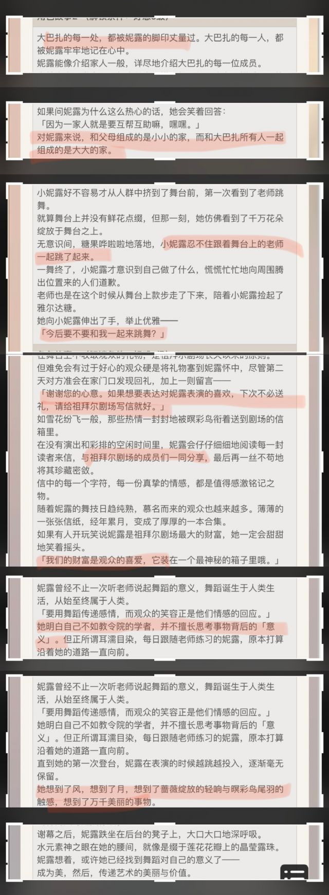
反观被卡姐津津乐道、洋洋洒洒大好几千字的卡维的角色故事，唯有故事1提到了“卡维视艺术为设立生命的源泉”——然后下一段直接跳戏开始说卡萨扎莱宫有多“成功”；故事3提到“真正醉心艺术的人才知道艺术家在须弥承受着什么”——然后下一段开始写卡维“反对艺术无用观点”。
但问题是，卡维可不是妮露，卡维的人设比妮露“花哨”得多太多了。
妮露可以说因为不是学者所以回避了对“意义”的思考，但文案自己写的卡维的另一个身份是“设计能力与美学造诣非常出众的‘妙论派天才’”吧？既然设定这个身份在前，大家自然是想听到你陈述和解释自己的艺术观点、美学理念的。
然，而，并，没，有。
篇幅如此广阔、字数冠绝全游(不知道是不是我记错了)的角色故事，宁可分出去写卡维家庭的破碎，写卡维事业多不顺多可怜，写卡维和艾尔海森，写卡维童年的绘本/日记，写卡维自己在家做烤饼，写卡维坚持美学——但就是不写卡维心中的“艺术”到底是什么。
你的人设是这个，你的角色故事里也写到了你多重视这个，但却绝口不提你是如何理解、如何重视、如何为你的理念而倾尽全力。
卡姐可能要说：啊那他盖了卡萨扎莱宫怎么不算倾尽全力呢？
首先请明确，卡维卖了房子的钱是钱，多莉的钱也是钱。
其次，故事4里完全没有把卡萨扎莱宫的建造与他的设计理念结合在一起，只是蜻蜓点水般提到了“卡维对这栋宫殿的设想”以及一句盖棺定论的“卡维倾尽所有”。
最能体现卡维艺术理念、建筑理念的建造过程，竟然完全没有啊！
这种塑造真的真的真的是非常致命的，到底是文案没有那个笔力无法具体陈述出“艺术理念”抑或是别的什么原因，我们不得而知。但结果就是，仅看角色故事，我只能说，卡维的这个“艺术家”人设太苍白了，太空洞了，这甚至连停留在口头上的“艺术”都谈不上。
我个人认为，起码妮露是比卡维更“像”艺术家的，而且是我们普世价值观念下非常难得的那种“民间艺术家”，因为纵使是并非学者、不擅思考事物意义的的妮露，起码她真的在用自己的方式、用切身实地的行动去丈量和感悟舞蹈的意义。而妮露可从来没有被任何人盖章为“艺术家”和“天才”。
对比卡维和艾尔海森的塑造也有这个问题，艾尔海森的角色故事3里是明确写了他对能力、社会、学识等等概念的理解的。这样做的结果是什么，就是即使抛去知论派学者这个身份，即使看不懂他到底怎么认知这一切，但你也能从这节故事里清楚地感受到“这个艾尔海森是一个有自己生活法则和看待世界角度的人”，并且你知道这个人的准则和看法就写在角色故事3里。
但是卡维呢？卡维也是学者，甚至在文案嘴里，他是远比艾尔海森有名、比艾尔海森成功的学者。然而这些树立人设的深层内涵，我从他的故事里一点也看不出来。你又想说他是艺术家，又想说他是妙论派的天才，又想说他善良，又想说他理想……文案在卡维角色故事里用别人的视角给卡维的溢美之词有多多，角色给人的观感就越差——说得直白一点，就是“尬吹”。因为他的所作所为里值得被人拿出来说的，盖卡萨扎莱宫也好，救沙狐也好，都完完全全达不到树立起他这个“饱受赞誉”的天才人设的水平，简言之，名头很响，但真没多少能拿得出手说的成就。
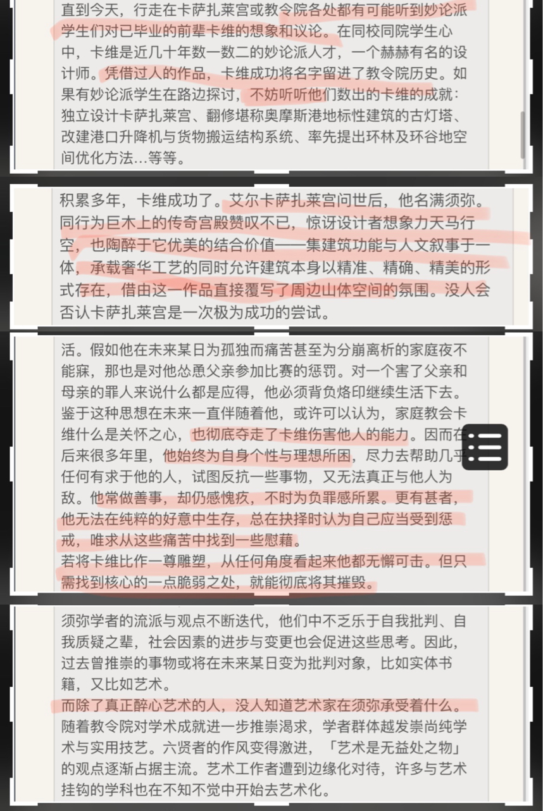
再看卡维这长篇累牍的角色故事，从“没人知道艺术家承受着什么”到“始终为理想与个性所困”再到“很容易摧毁”，不觉得这种“缺少铺垫的定论”实在是太多了吗？文字处处流露出一种愤世嫉俗者的哭惨，一种遗世独立的孤高与不满，就差魂穿渔父把“何故怀瑾握瑜而自令见放为”刻到卡维脑门上了。
瑾在哪？瑜又在哪？但这片大陆上比卡维惨的人比比皆是，比卡维成就出色的人也比比皆是，文案显然有意将他塑造为一个多领域的天才，然而无论作为艺术家也好，学者也好，建筑师也好，很显然，卡维都远远谈不上成功。
我不知道把角色塑造成这样到底是出于恨还是爱，但我想所谓的内部爱大抵还是存在的，只不过这爱的对象不是卡维，而是卡维身上的这些“设定”。小学时曾投入热情于小说创作的朋友们或许能够明白一种经历那就是“做人设的时候活力满满，写剧情的时候精疲力尽”。为什么会这样？因为做人设根本不用过脑子啊，做人设是你想写什么就写什么，但把人设落实到剧情上却是非常非常困难的，所以写作其实并不是能够随心所欲进行的事情。
再反观卡维这个角色，大抵也是如此情况吧。他就像是一个文案兴之所起而创造出来的传话筒，想给他的人设太多，但能够担得起这些人设的剧情塑造却完全没有。在别处文案里的欠钱还嘴恩人、弄出噪音偷酒……大家都讨论过很多次了，我也不展开说了。
我曾经真的期待过卡维的落地，真情实感地希望须弥f4会是那种有理念交锋的沙雕男大宿舍型展开，现在看来当真一地鸡毛。卡维这个角色，我已经对他和他的粉丝到了看见就想吐的地步了，以后只当须弥f3团推。卡姐也别说我星级歧视，4星成男里明显有一个比他还惨的，但人家可没塑造成某种又当又立的德行

----

##### 425.[0] \<pid:707119814\> 2023-08-05 15:00:55 by 14billion
>[jump](#pid706877277) 小王饼干(2023-08-04 12:01) 说: 
>
>所以今天须弥糊作一团是它阴得的这几天补流水瓜我感觉喝的冰红茶都要变香槟咯

有无传送门想看流水瓜

----

##### 426.[0] \<pid:707153198\> 2023-08-05 18:24:29 by 叉车佬安康鱼
>[jump](#pid707104369) 予晞(2023-08-05 13:24) 说: 
>
>说实话他3.2出场对话给我感官就不太舒服，直接冲出来在别人办公区(那地方到底算办公区还是图书室)大声嚷嚷，还开口就是贬低海让他“别看你那破书了”，先不提在公共场合大声嚷嚷多没素质，我想认真看了主线的的人都会有海爱看书的印象吧？
>然后这个传闻中的“好友”开口就是贬低爱好，其实提纳里也做过类似的事，一边让赛诺多打牌(赛诺传说)但同时给他的冷笑话泼冷水(风花节活动)且在柯莱组好牌组想和赛诺打牌时阻止柯莱(3.6聚会)，当然这都是3.2后面的活动塑造了，编剧怎么想的我也不知道，编剧心里认同的[好朋友]是

卡维贬低艾尔海森，提纳里贬低赛诺，文案除了贬低想不出麦麸的方式了

----

##### 427.[0] \<pid:707153976\> 2023-08-05 18:28:35 by 夜静銮铃
这楼居然还活着我们理查也有自己的规则类怪谈力！

----

##### 428.[0] \<pid:707155020\> 2023-08-05 18:35:00 by 小王饼干
>[jump](#pid707119814) 14billion(2023-08-05 15:00) 说: 
>
>有无传送门想看流水瓜

省流一下：3.6之后流水腰斩了，3.7万海池子和去年宵宫盾剑单走一个水平，3.8散心池你猜怎么着？超抖音居然是零耶

----

##### 429.[0] \<pid:707156392\> 2023-08-05 18:43:29 by 叉车佬安康鱼
突然发现，其实米对提纳里赛诺关系的塑造和卡维艾尔海森有相似之处，卡维的行为之所以最开始没有太多人抱怨，就像这楼之前说的是因为艾尔海森和多莉足够强大，所以淡化了负面影响，而提纳里不断给赛诺泼冷水以及客观上阻止了柯莱和赛诺关系性发展的负面感被淡化，也是因为赛诺本身强大和独来独往“受害者都不在意，你们观众在意什么”，这就是三流文案想达成的效果，也就是前面潭友说的“精心挑选受害者”

----

##### 430.[0] \<pid:707158332\> 2023-08-05 18:55:12 by 今锁朱楼
>[jump](#pid707156392) 叉车佬安康鱼(2023-08-05 18:43)说:
>突然发现，其实米对提纳里赛诺关系的塑造和卡维艾尔海森有相似之处，卡维的行为之所以最开始没有太多人抱怨，就像这楼之前说的是因为艾尔海森和多莉足够强大，所以淡化了负面影响，而提纳里不断给赛诺泼冷水以及客观上阻止了柯莱和赛诺关系性发展的负面感被淡化，也是因为赛诺本身强大和独来独往[s:ac:哭笑]“受害者都不在意，你们观众在意什么”，这就是三流文案想达成的效果，也就是前面潭友说的“精心挑选受害者”

其实鸣神组也有这种雷点，神子冒犯影不当回事。这种刻画本身没什么问题，有时候没有边界感正是关系好的证明。问题在于冒犯一方缺乏付出刻画，卡维要是能为艾尔海森人生带来什么明确的好处的话，这cp也不至于让人当成pua看待。
提纳里本身性格好点，所以看起来还凑合，但要是以后剧情也这么复读迟早会起节奏的。~~前提是你游那时候还没凉~~

----

##### 431.[0] \<pid:707158575\> 2023-08-05 18:56:42 by 叉车佬安康鱼
>[jump](#pid707158332) 今锁朱楼(2023-08-05 18:55) 说: 
>
>其实鸣神组也有这种雷点，神子冒犯影不当回事。这种刻画本身没什么问题，有时候没有边界感正是关系好的证明。问题在于冒犯一方缺乏付出刻画，卡维要是能为艾尔海森人生带来什么明确的好处的话，这cp也不至于让人当成pua看待。
>提纳里本身性格好点，所以看起来还凑合，但要是以后剧情也这么复读迟早会起节奏的。~~前提是你游那时候还没凉~~

不会起节奏的，因为赛诺粉少。虽然已经复读了好几个版本冷笑话了，但文案喜欢偷窥社区，下次再有剧情就偷偷给你改了

----

##### 432.[0] \<pid:707172230\> 2023-08-05 20:03:54 by A25558889
>[jump](#pid707116715) 迦勒底在逃员工(2023-08-05 14:40) 说: 
>
>出差两天发现怎么那两栋楼都没了…
>企图用游戏文本讨论卡维这个角色立不住脚的一个原因：人设太多，行动太少。
>gigo出联动后看到部分卡姐爱拉妮露来和卡维组成“艺术家组”，那就对比妮露的角色故事来说说这件事。妮露的故事里并没有提到太多妮露对艺术的解读，也说到妮露“并不擅长思考意义”，只是用很平常的语调讲述了妮露成为一个“舞者”的故事，对大巴扎的归属感、第一次看到老师跳舞时的情不自禁、第一次登台时想到的美丽景象。这就是一个很完整的故事，不需要解释意义，读者自然而然就会体会到“她为什么接触舞蹈、喜爱舞蹈

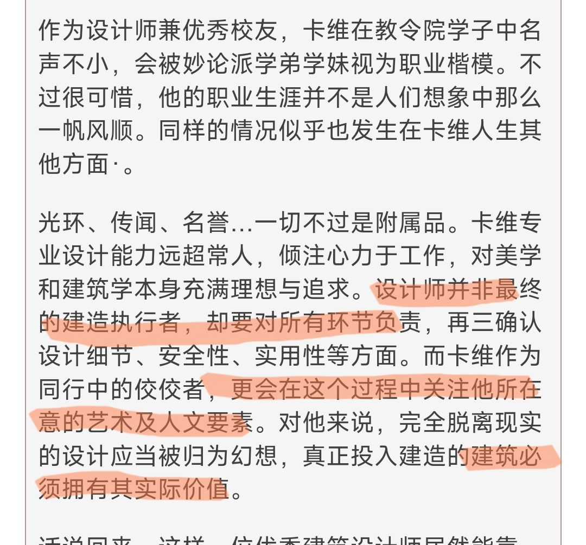
那我得说一句，角色故事里还是有阐述的。
不过矛盾之处在于，文案说明卡维是个在艺术的同时注重实用性的，结果摧毁了卡萨扎莱宫的却是所谓的艺术性。
因为卡维想把卡萨扎莱宫建在悬崖边的原因，是“可以看到风景”，是为了艺术性。
多有意思。
这个角色真正经不起推敲的是他既要又要，角色故事写着卡维不是刻板印象中的艺术家形象，然而文案塑造出来的就是刻板印象献上经典名言：[别看你那破书了][拿职权搞来的书][你是艾尔海森请来装朋友的演员吗？]
“自我中心、暴躁、颐气指使”，哪一个他不沾边？
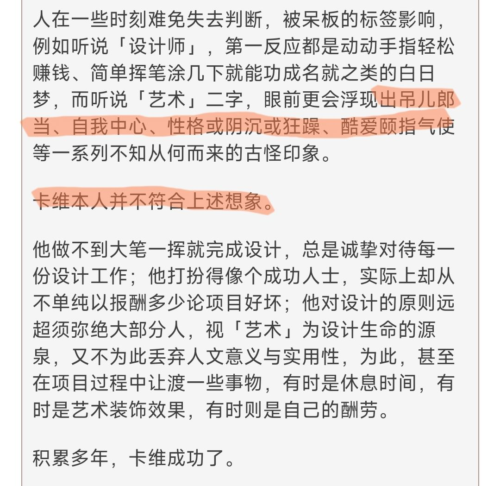

声名双收，早期还积累了喜欢自己风格的客户，被学弟学妹视为榜样，有存下一笔财产……然后说教令院打压艺术，生活让他不满。
给我整笑了，在一个有底层吃不饱的沙漠民、有流放的疯学者存在的国度，他这有房有钱有名声有地位的，还怪生活？。

还有关于卡萨扎莱宫，既然“没人否认卡萨扎莱宫是极为成功的尝试”，所谓的心中的传世之作已经实现了，那卡维在痛苦什么啊？他口中的“无法到达理想之国”又在说什么？
卡维到底是因为无法实现理想而痛苦，还是在为了钱财，为了破产而痛苦？
如果没有出现死域，成功建成了卡萨扎莱宫，就是实现理想了？
把建造卡萨扎莱宫视为完成理想，然后真的建好了，又觉得这不是实现理想该有的样子。
卖房子是自己选的，借钱是自己选的，痛苦成这样只能说明他一开始就没站在要为理想付出所有的思想高度，“视艺术为设计的生命源泉”只是说说而已，过得好才是更重要的。因此他才会反思自己的所作所为，觉得自己实现理想的手段是“错误”的。
你看看他那痛苦的样子，再反过来看角色故事“卡维并不符合关于艺术家的刻板印象”。
看看他角色故事里说会好好对待每一份设计工作，再想想他在邀约怎么对待甲方的。
理想？编的。对工作认真？装的。艺术被打压？你妙论派搞得是实用性建筑，又不是妮露舞蹈那种纯艺术，打压的是艺术，又不打压你。
这个角色的内核、动机、塑造全都是破碎的、割裂的。

----

##### 433.[3] \<pid:707173090\> 2023-08-05 20:07:30 by 虚室生白红茶版
>[jump](#pid707041278) 上砂奂(2023-08-05 02:47) 说: 
>
>太可怕了，性转之后光是代入主线最后的剧情我都会生气，出谋划策的姐姐被什么都没干的不认识的男的指指点点批来批去，你谁啊？到后面的版本更是边蹭住蹭酒边言语难听，要自主不自主要能力没能力，天天散发负能量阴阳怪气耍性子，这不纯纯坑人吗，好一手软饭硬吃……特别看不起祸害人姑娘的男性(反过来也是)，海哥要是女性卡早八百年被车上天了

没错，就是这样
让我们假设主线充当艾尔海森职责的是位女性……那就是主线非常独立自主很飒的爱看书的小姐姐，在结尾突然被冲出来的一个不认识的男的诋毁爱好和贬低能力。而后面你慢慢了解到——这个男的平时一边在小姐姐那里蹭吃蹭住，还一边在外面到处抱怨小姐姐说小姐姐坏话……他日常拖着小姐姐的房租不还，有钱了却去外面搞慈善和请客大鱼大肉，美其名曰都是为了“我的理想”。然后他还喜欢在外面酗酒emo只知道一味抱怨都是甲方不好，没想着踏踏实实改方案承担责任而是天天“啊，我好惨，没有人理解我的理想”

你就说这三次元版中年无成还软饭硬吃的下头男的既视感强不强，mhy要敢把海哥写成女的，你看看卡维现在这塑造会被车成什么样。

----

##### 434.[1] \<pid:707173559\> 2023-08-05 20:09:26 by 虚室生白红茶版
>[jump](#pid707041278) 上砂奂(2023-08-05 02:47) 说: 
>
>太可怕了，性转之后光是代入主线最后的剧情我都会生气，出谋划策的姐姐被什么都没干的不认识的男的指指点点批来批去，你谁啊？到后面的版本更是边蹭住蹭酒边言语难听，要自主不自主要能力没能力，天天散发负能量阴阳怪气耍性子，这不纯纯坑人吗，好一手软饭硬吃……特别看不起祸害人姑娘的男性(反过来也是)，海哥要是女性卡早八百年被车上天了

更绝的是这个站位的cpf(对应过去即kh)还特别喜欢从CP角度舞这个男的就可以出轨或者结婚，然后小姐姐生气却无可奈何，还得对这个男的痴情不悔，宠着这个男的，替这个男的当全自动提款机、帮忙带他和另一个人的娃，这种东西叫特别特别仙品
你就说阴不阴间吧，简直就在我三观雷区上蹦迪

----

##### 435.[3] \<pid:707178514\> 2023-08-05 20:35:17 by 迦勒底在逃员工
>[jump](#pid707172230) A25558889(2023-08-05 20:03) 说: 
>
>
>那我得说一句，角色故事里还是有阐述的。
>不过矛盾之处在于，文案说明卡维是个在艺术的同时注重实用性的，结果摧毁了卡萨扎莱宫的却是所谓的艺术性。
>因为卡维想把卡萨扎莱宫建在悬崖边的原因，是“可以看到风景”，是为了艺术性。
>多有意思。
>这个角色真正经不起推敲的是他既要又要，角色故事写着卡维不是刻板印象中的艺术家形象，然而文案塑造出来的就是刻板印象献上经典名言：[别看

感谢大佬勘误！！我的问题我的问题，我没仔细看他的角色故事
我对这个角色的认识也没有大佬这么深入，不过怎么说呢，反正他就是有一种说不出来的拧巴，整个角色故事粗浅看下来就给人一种全世界都对不起他的感觉……然后我整个人的观后感be like：？
但是我很赞同大佬最后这段论述，我觉得他的问题就在于调起得都太高了，人设洋洋洒洒写了那么多，写得这么华丽，然后实际一看我实在是没觉出来他哪里担得起这些名头了

----

##### 436.[0] \<pid:707178951\> 2023-08-05 20:37:59 by cywivsu
心路历程：
卡推→卡推，但磕海卡海CP→察觉CP异味不磕了，切割式推卡→卡维是一款我的oc→推不下去了rnm，原神和mhy打包滚蛋吧。
这就是小号没错，大号早已经注销，沾了太多你原和我推角色的痛苦回忆，给他设计壶，给他写文，给他画图，第一买周边就是他的。几次问卷写一堆建议和分析，得到是越来越蹬鼻子上脸的剧情和文案。因为他人设碎成一地我曾经是真的哭过，结合猛干兄的话现在只觉得自己幼稚。贴设定但没写出来的东西根本就算不上，尤其在这种情况下还说出一些让人难绷的话。
连着那几个月是我精神状态最差的时候，狠狠长了记性，我这辈子都不会碰你mhy的任何东西了。
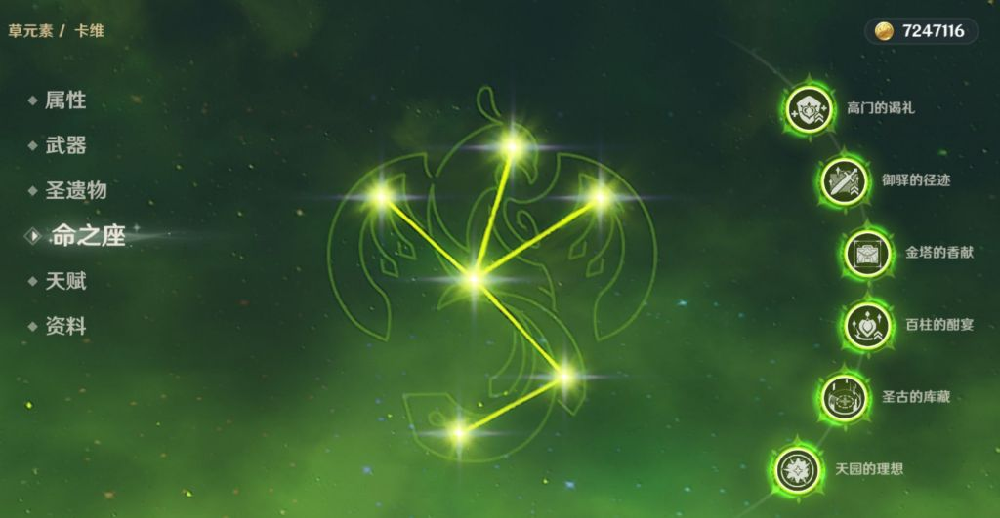
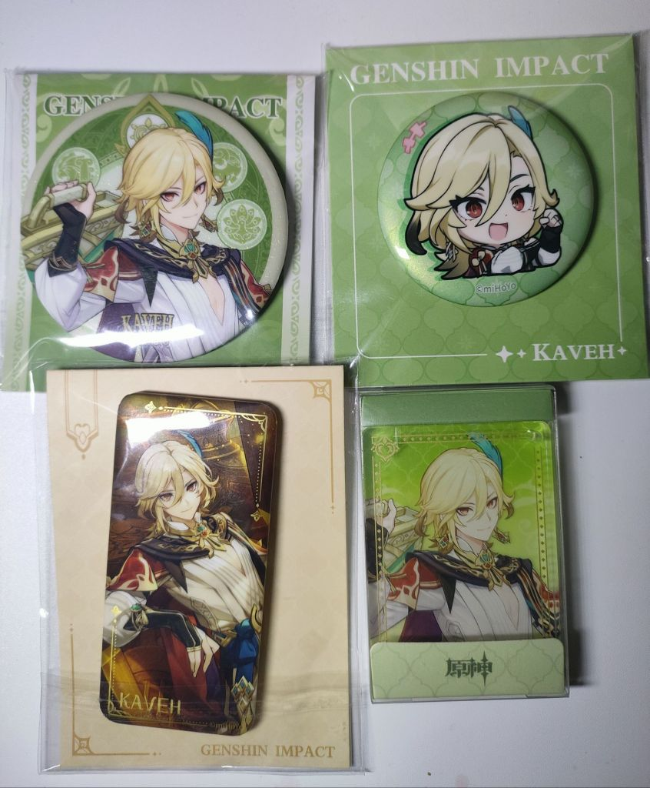

----

##### 437.[0] \<pid:707179204\> 2023-08-05 20:39:26 by hantangmeng1
对他的唯一印象就是和隔壁的帝释天撞脸。

然后在隔壁被策划摁头吃修帝吃吐退坑了，导致我一开始就对这个角色没好感

----

##### 438.[0] \<pid:707179446\> 2023-08-05 20:40:53 by Cvjutfvkkk
>[jump](#pid707116715) 迦勒底在逃员工(2023-08-05 14:40)说:
>出差两天发现怎么那两栋楼都没了… 企图用游戏文本讨论卡维这个角色立不住脚的一个原因：人设太多，行动太少。 gigo出联动后看到部分卡姐爱拉妮露来和卡维组成“艺术家组”，那就对比妮露的角色故事来说说这件事。妮露的故事里并没有提到太多妮露对艺术的解读，也说到妮露“并不擅长思考意义”，只是用很平常的语调讲述了妮露成为一个“舞者”的故事，对大巴扎的归属感、第一次看到老师跳舞时的情不自禁、第一次登台时想到的美丽景象。这就是一个很完整的故事，不需要解释意义，读者自然而然就会体会到“她为什么接触舞蹈、喜爱舞蹈、喜爱大巴扎，进而成为了大巴扎的舞者”。 [img]https://img.nga.178.com/attachments/mon_202308/05/l2Q2s-dse2ZkT3cShs-1cc.jpg.medium.jpg[/img] 反观被卡姐津津乐道、洋洋洒洒大好几千字的卡维的角色故事，唯有故事1提到了“卡维视艺术为设立生命的源泉”——然后下一段直接跳戏开始说卡萨扎莱宫有多“成功”；故事3提到“真正醉心艺术的人才知道艺术家在须弥承受着什么”——然后下一段开始写卡维“反对艺术无用观点”。 但问题是，卡维可不是妮露，卡维的人设比妮露“花哨”得多太多了。 妮露可以说因为不是学者所以回避了对“意义”的思考，但文案自己写的卡维的另一个身份是“设计能力与美学造诣非常出众的‘妙论派天才’”吧？既然设定这个身份在前，大家自然是想听到你陈述和解释自己的艺术观点、美学理念的。 然，而，并，没，有。 篇幅如此广阔、字数冠绝全游(不知道是不是我记错了)的角色故事，宁可分出去写卡维家庭的破碎，写卡维事业多不顺多可怜，写卡维和艾尔海森，写卡维童年的绘本/日记，写卡维自己在家做烤饼，写卡维坚持美学——但就是不写卡维心中的“艺术”到底是什么。 你的人设是这个，你的角色故事里也写到了你多重视这个，但却绝口不提你是如何理解、如何重视、如何为你的理念而倾尽全力。 卡姐可能要说：啊那他盖了卡萨扎莱宫怎么不算倾尽全力呢？ 首先请明确，卡维卖了房子的钱是钱，多莉的钱也是钱。 其次，故事4里完全没有把卡萨扎莱宫的建造与他的设计理念结合在一起，只是蜻蜓点水般提到了“卡维对这栋宫殿的设想”以及一句盖棺定论的“卡维倾尽所有”。 最能体现卡维艺术理念、建筑理念的建造过程，竟然完全没有啊！[s:a2:是在下输了] 这种塑造真的真的真的是非常致命的，到底是文案没有那个笔力无法具体陈述出“艺术理念”抑或是别的什么原因，我们不得而知。但结果就是，仅看角色故事，我只能说，卡维的这个“艺术家”人设太苍白了，太空洞了，这甚至连停留在口头上的“艺术”都谈不上。 我个人认为，起码妮露是比卡维更“像”艺术家的，而且是我们普世价值观念下非常难得的那种“民间艺术家”，因为纵使是并非学者、不擅思考事物意义的的妮露，起码她真的在用自己的方式、用切身实地的行动去丈量和感悟舞蹈的意义。而妮露可从来没有被任何人盖章为“艺术家”和“天才”。 对比卡维和艾尔海森的塑造也有这个问题，艾尔海森的角色故事3里是明确写了他对能力、社会、学识等等概念的理解的。这样做的结果是什么，就是即使抛去知论派学者这个身份，即使看不懂他到底怎么认知这一切，但你也能从这节故事里清楚地感受到“这个艾尔海森是一个有自己生活法则和看待世界角度的人”，并且你知道这个人的准则和看法就写在角色故事3里。 但是卡维呢？卡维也是学者，甚至在文案嘴里，他是远比艾尔海森有名、比艾尔海森成功的学者。然而这些树立人设的深层内涵，我从他的故事里一点也看不出来。你又想说他是艺术家，又想说他是妙论派的天才，又想说他善良，又想说他理想……文案在卡维角色故事里用别人的视角给卡维的溢美之词有多多，角色给人的观感就越差——说得直白一点，就是“尬吹”。因为他的所作所为里值得被人拿出来说的，盖卡萨扎莱宫也好，救沙狐也好，都完完全全达不到树立起他这个“饱受赞誉”的天才人设的水平，简言之，名头很响，但真没多少能拿得出手说的成就。 [img]https://img.nga.178.com/attachments/mon_202308/05/l2Q2s-bvg8Z2fT3cSnu-zk.jpg.medium.jpg[/img] 再看卡维这长篇累牍的角色故事，从“没人知道艺术家承受着什么”到“始终为理想与个性所困”再到“很容易摧毁”，不觉得这种“缺少铺垫的定论”实在是太多了吗？文字处处流露出一种愤世嫉俗者的哭惨，一种遗世独立的孤高与不满，就差魂穿渔父把“何故怀瑾握瑜而自令见放为”刻到卡维脑门上了。 瑾在哪？瑜又在哪？但这片大陆上比卡维惨的人比比皆是，比卡维成就出色的人也比比皆是，文案显然有意将他塑造为一个多领域的天才，然而无论作为艺术家也好，学者也好，建筑师也好，很显然，卡维都远远谈不上成功。 我不知道把角色塑造成这样到底是出于恨还是爱，但我想所谓的内部爱大抵还是存在的，只不过这爱的对象不是卡维，而是卡维身上的这些“设定”。小学时曾投入热情于小说创作的朋友们或许能够明白一种经历那就是“做人设的时候活力满满，写剧情的时候精疲力尽”。为什么会这样？因为做人设根本不用过脑子啊，做人设是你想写什么就写什么，但把人设落实到剧情上却是非常非常困难的，所以写作其实并不是能够随心所欲进行的事情。 再反观卡维这个角色，大抵也是如此情况吧。他就像是一个文案兴之所起而创造出来的传话筒，想给他的人设太多，但能够担得起这些人设的剧情塑造却完全没有。在别处文案里的欠钱还嘴恩人、弄出噪音偷酒……大家都讨论过很多次了，我也不展开说了。 我曾经真的期待过卡维的落地，真情实感地希望须弥f4会是那种有理念交锋的沙雕男大宿舍型展开，现在看来当真一地鸡毛。卡维这个角色，我已经对他和他的粉丝到了看见就想吐的地步了，以后只当须弥f3团推。卡姐也别说我星级歧视，4星成男里明显有一个比他还惨的，但人家可没塑造成某种又当又立的德行[s:a2:囧2]

一想到这么一大段未来会被冲水就太可惜了真的很会写

----

##### 439.[0] \<pid:707182902\> 2023-08-05 20:59:44 by A25558889
>[jump](#pid707178514) 迦勒底在逃员工(2023-08-05 20:35) 说: 
>
>感谢大佬勘误！！我的问题我的问题，我没仔细看他的角色故事
>我对这个角色的认识也没有大佬这么深入，不过怎么说呢，反正他就是有一种说不出来的拧巴，整个角色故事粗浅看下来就给人一种全世界都对不起他的感觉……然后我整个人的观后感be like：？
>但是我很赞同大佬最后这段论述，我觉得他的问题就在于调起得都太高了，人设洋洋洒洒写了那么多，写得这么华丽，然后实际一看我实在是没觉出来他哪里担得起这些名头了

原本我怀疑写角色故事的和写活动剧情的是两波人，因此才会让他这么割裂。
现在我怀疑他的角色故事也是两波人写的。
一波人想把他塑造成不落俗套的务实派艺术工作者，兼顾艺术理论与实际建造，善良又不失主见，认真对待设计。
另一波人说不行，卡维这样就精神状态太好了，能把生活过好的艺术者不够刻板印象，艺术家就得是自我中心并且精神状态很差、生活很糟，这才是艺术家。
而且你这样我怎么让他卖惨？不卖惨怎么惹人同情？
你得让他有家庭问题，亲子关系可是个热门话题;你得让他吐槽甲方，你得让他多抱怨生活，这样才能让玩家有共情的地方嘛。

----

##### 440.[1] \<pid:707184115\> 2023-08-05 21:06:09 by 花舞苍天
所以说卡海和海卡本来就是一丘之貉，只要沾上卡维这个烂人不管左右位是谁都是依托答辩，卡海姐发表海哥超爱言论以及替mhy麦麸捆绑叫好的言论我也见得多了，一直一来光车海卡没车卡海只能说卡海蹦的没这么高而已

